# SharePoint 2013 中面向开发人员的新增功能
了解 SharePoint 2013 中的新增特性和功能，包括新的云加载项模型、开发工具、平台增强功能、移动加载项以及更多其他功能。
## 云加载项模型

SharePoint 2013 引入了一个云加载项模型，允许您创建加载项。SharePoint 外接程序是此功能的自包含部分，可扩展 SharePoint 网站的功能。一个加载项可能包括列表、工作流和网站页面之类的 SharePoint 组件，但也可能显示 SharePoint 中的远程 Web 应用程序和远程数据。加载项很少或几乎不与安装在其中的设备或平台上的任何其他软件相关（除了平台中内置的软件之外）。这种特性可确保加载项的安装简单并且卸载彻底。加载项没有在 SharePoint 服务器上运行的自定义代码。相反，所有自定义逻辑"向上"移至云，或"向下"移至客户端计算机。此外，SharePoint 2013 引入一个 SharePoint 外接程序的创新式传递模型，包括 Office 商店和加载项目录等组件。
  
    
    
 [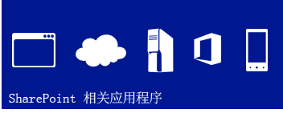
  
    
    
](http://msdn.microsoft.com/library/cd1eda9e-8e54-4223-93a9-a6ea0d18df70%28Office.15%29.aspx) [
  
    
    
](http://msdn.microsoft.com/library/d15a74a7-3c10-485a-9885-7ef11aaa0d90%28Office.15%29.aspx) [
  
    
    
](http://msdn.microsoft.com/library/d15a74a7-3c10-485a-9885-7ef11aaa0d90%28Office.15%29.aspx)
  
    
    

## 常见的使用 Web 标准的编程模型

通过 SharePoint 2013，任何 Web 开发人员都能轻松地创建 SharePoint 解决方案，包括那些使用非 Microsoft 平台堆栈的开发人员。这是因为 SharePoint 2013 基于常见的 Web 标准，如 HTML、CSS 和 JavaScript。此外，实施过程依赖于已建立的协议，如开放式数据协议 (OData) 和 OAuth。
  
    
    
 [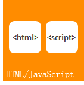
  
    
    
](http://msdn.microsoft.com/library/cd1eda9e-8e54-4223-93a9-a6ea0d18df70%28Office.15%29.aspx) [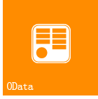
  
    
    
](using-odata-sources-with-business-connectivity-services-in-sharepoint-2013.md) [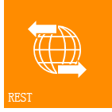
  
    
    
](get-to-know-the-sharepoint-2013-rest-service.md) [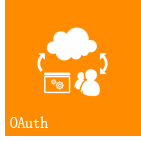
  
    
    
](http://msdn.microsoft.com/library/bde5647a-fff1-4b51-b67b-2139de79ce4a%28Office.15%29.aspx)
  
    
    

## 开发工具

当前版本不仅提供用于开发应用程序新开发的基于 Web 的工具（Napa Office 365 开发工具）版本，还体现了在优化现有开发工具（如 Visual Studio 和 SharePoint Designer）方面的巨大进步。通过 Visual Studio 中新的统一项目系统，您可以开发 SharePoint 外接程序、Office 外接程序、SharePoint 外接程序（包括 Office 外接程序）或由 SharePoint 承载的 Office 外接程序。除了较早版本中提供的 SharePoint 项目模板之外，Visual Studio 2008 现在还包括一个新的应用程序项目模板，该模板位于名为 Apps for SharePoint 2013 的应用程序文件夹中。"属性"窗口和"属性"页面中添加了多个新属性用于支持 SharePoint 外接程序项目。其他改进功能包括对针对云应用程序模型开发的完整支持（包括 OData 和 OAuth 支持），和对针对 Workflow Manager Client 1.0 平台开发的完整支持。
  
    
    
 [
  
    
    
](http://msdn.microsoft.com/library/82a3645c-0911-4926-9176-236ac8d28bdd%28Office.15%29.aspx) [
  
    
    
](http://msdn.microsoft.com/library/e00dc63f-b4a4-4c08-b058-729fcb09af41%28Office.15%29.aspx) [
  
    
    
](workflow-development-in-sharepoint-designer-and-visio.md)
  
    
    

## 核心平台增强功能

从更广的层面上看，SharePoint 2013 已得到改进和增强，以支持新的基于云的体系结构和以应用为导向的开发框架。从最低级别的 SharePoint API 到与社交媒体集成的连接，SharePoint 2013 的设计和执行均支持丰富的应用程序开发体验。除了使用用于 Web 服务的代表性状态传输 (REST) 终结点之外，还有一个新的用于服务器和客户端开发的广义 API。除了客户端呈现之外，现在也支持远程事件接收器。 
  
    
    
 [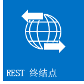
  
    
    
](e1ff2979-1c16-4cb0-a57e-9168dfe20a7c.md) [
  
    
    
](choose-the-right-api-set-in-sharepoint-2013.md) [
  
    
    
](how-to-customize-a-field-type-using-client-side-rendering.md) [
  
    
    
](http://msdn.microsoft.com/library/c050d056-8548-4496-a053-016779d723d9%28Office.15%29.aspx)
  
    
    

## 移动性

通过 SharePoint 2013，您可以将 Windows Phone 7 应用程序与本地 SharePoint 服务和应用程序结合，或者与在云中运行的远程 SharePoint 服务和应用程序（如使用 SharePoint Online 的服务和应用程序）结合，以创建功能超越传统台式计算机或便携式计算机并进入真正便携且更容易访问的环境的强大应用程序。SharePoint 2013 中新增的移动功能建立在现有的 Microsoft 工具和技术基础上，如 SharePoint、Windows Phone 7、Visual Studio 和 Microsoft Silverlight。您可以在 Visual Studio 中使用新 SharePoint Phone 应用程序向导模板为 Windows Phone 创建 SharePoint 支持的移动应用程序，这样便可创建简单的基于列表的移动应用程序。您可以将 SharePoint 2013 中引入的新功能（如 SharePoint Server 中的"地理位置"字段类型和"推送"通知）集成到您的移动应用程序中。
  
    
    
 [
  
    
    
](overview-of-windows-phone-sharepoint-2013-application-templates-in-visual-studio.md) [
  
    
    
](how-to-configure-and-use-push-notifications-in-sharepoint-2013-apps-for-windows.md) [
  
    
    
](integrating-location-and-map-functionality-in-sharepoint-2013.md)
  
    
    

## 社会和协作

经过改进的新的社会和协作功能使用户能够轻松地进行通信并保持参与和消息灵通。改进的"我的网站"好友动态订阅源可帮助用户了解其所关注的人和事的最新消息。新的社区网站 功能提供了丰富的社区体验，用户可以轻松查找并共享信息，并可找到志趣相投的人。
  
    
    
 [
  
    
    
](work-with-social-feeds-in-sharepoint-2013.md) [
  
    
    
](what-s-new-for-developers-in-social-and-collaboration-features-in-sharepoint-201.md#bkmk_Collab) [
  
    
    
](follow-people-in-sharepoint-2013.md) [
  
    
    
](follow-content-in-sharepoint-2013.md)
  
    
    

## 搜索

SharePoint 2013 中的搜索功能包括多个增强功能、使用 Content Enrichment Web 服务的自定义内容处理，以及用于显示搜索结果类型的新框架。此外，对关键字查询语言 (KQL) 也进行了重要改进。
  
    
    
 [
  
    
    
](custom-content-processing-with-the-content-enrichment-web-service-callout.md) [
  
    
    
](what-s-new-in-sharepoint-2013-search-for-developers.md) [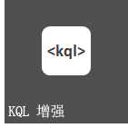
  
    
    
](building-search-queries-in-sharepoint-2013.md)
  
    
    

## 工作流

Workflow Manager Client 1.0 是一个基于 Windows Workflow Foundation 4 构建的重新设计的工作流基础结构，为 SharePoint 2013 中的工作流创作提供新功能和灵活性。通过完全声明性创作环境，信息工作者可以使用 SharePoint Designer 2013 创作功能强大的工作流，并且开发人员可以使用一组新的 Visual Studio 2008 工作流项目模板访问更加复杂的功能，如自定义操作。也许最重要的是，Workflow Manager Client 1.0 与 SharePoint 外接程序的模型完全集成。此外，工作流在云中执行而不是在 SharePoint 中执行，从而为设计基于工作流的 SharePoint 外接程序提供了极大的灵活性。
  
    
    
 [
  
    
    
](what-s-new-in-workflows-for-sharepoint-2013.md) [
  
    
    
](sharepoint-2013-workflow-fundamentals.md) [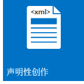
  
    
    
](workflow-development-in-sharepoint-designer-and-visio.md) [
  
    
    
](develop-sharepoint-2013-workflows-using-visual-studio.md)
  
    
    

## 企业内容管理

在 SharePoint 2013 中，除了新扩展的 .NET 服务器管理的 API 集之外，您现在还可以使用 .NET 客户端、Silverlight、Windows Phone 和 JavaScript API，以自定义企业内容管理 (ECM) 体验和行为。
  
    
    
 [
  
    
    
](what-s-new-with-sharepoint-2013-site-development.md) [
  
    
    
](managed-navigation-in-sharepoint-2013.md) [
  
    
    
](cross-site-publishing-in-sharepoint-2013.md) [
  
    
    
](ediscovery-in-sharepoint-2013.md)
  
    
    

## Business Connectivity Services

除了其他通过 WCF 服务或 OData 终结点公开的数据驱动的应用程序之外，Business Connectivity Services (BCS) 还允许 SharePoint 访问外部数据系统（如 SAP、ERP 和 CRM）的数据。SharePoint 2013 中的 BCS 已在多个方面得到了改进和增强，包括 OData 连接性、外部事件、应用程序中的外部数据、筛选和排序、支持 REST 以及其他方面。
  
    
    
 [
  
    
    
](using-odata-sources-with-business-connectivity-services-in-sharepoint-2013.md) [
  
    
    
](add-in-scoped-external-content-types-in-sharepoint-2013.md) [
  
    
    
](external-events-and-alerts-in-sharepoint-2013.md)
  
    
    

## 应用程序服务

SharePoint Server 2013 包括可用于处理 SharePoint 网站中的数据的若干个服务。SharePoint 的新增服务是机器翻译服务，该服务可翻译多语言支持的网站、文档和数据流。SharePoint Server 2013 还包括 Access Services 和新数据访问模型。为了将文件和数据流转换成其他格式，SharePoint Server 2013 具有 Word Automation Services 和 PowerPoint Automation Services（SharePoint 的新增功能）。SharePoint 还提供数据分析工具，如 PerformancePoint Services 和 Visio Services，这些服务支持商业智能以及 Excel Services 中的强大新功能。
  
    
    
 [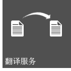
  
    
    
](machine-translation-services-in-sharepoint-2013.md) [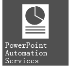
  
    
    
](powerpoint-automation-services-in-sharepoint-2013.md) [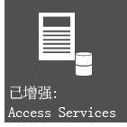
  
    
    
](what-s-new-in-access.md) [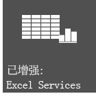
  
    
    
](09e96c8b-cb55-4fd1-a797-b50fbf0f9296.md)
  
    
    

## 其他资源

-  [SharePoint 2013 开发概述](sharepoint-2013-development-overview.md)
    
  
-  [开发 SharePoint 外接程序](http://msdn.microsoft.com/library/71ddde4b-fac4-4d8c-aa2e-524f9c2c4c99%28Office.15%29.aspx)
    
  
-  [SharePoint 加载项与 SharePoint 解决方案比较](sharepoint-add-ins-compared-with-sharepoint-solutions.md)
    
  
-  [在 SharePoint 2013 中选择正确的 API 集](choose-the-right-api-set-in-sharepoint-2013.md)
    
  
-  [SharePoint 2013 中的辅助功能](accessibility-in-sharepoint-2013.md)
    
  

