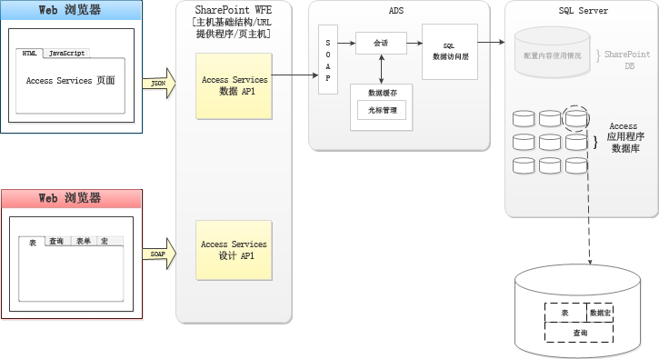

# Access 中的新增功能
了解 Access 2013 中的功能可能让您轻松创建、部署和管理本地或云中的基于 Web 的协作应用程序。
## 简介

Access 2013 采用新应用程序模型，该模型专用于简化 Web 部署，与包含 Windows 部署的 Access 的早期版本类似。利用 Access 2013，行业专家可快速创建可用于运行其业务的应用程序。通过使用 Microsoft SharePoint 2013 承载应用程序的前端，和使用 Microsoft SQL Server 2012 作为作其数据存储技术，Access 2013 显著提高 Access 应用程序的可管理性和可伸缩性。与 Office 365 和 SQL Azure 的兼容性显著扩大了 Access 应用程序的范围。
  
    
    

## 体系结构

在内部环境中，Access 2013 应用程序由 SharePoint 2013 承载，而数据存储在 SQL Server 2012 中。SharePoint 2013 为 Access 2013 应用程序提供身份验证、授权和安全性。后端表、视图、宏和查询存储在 SQL Server 2012 数据库中。
  
    
    
Access 2013 通过 Office 365 和 SQL Azure 服务提供将 Access 应用程序部署到云的方法。
  
    
    
图 1 提供 Access 2013 体系结构的概述。
  
    
    

**图 1. Access 2013 体系结构**

  
    
    

  
    
    

  
    
    
新建 Access 应用程序时， SharePoint Server 2013 中的 Access Services 新建存储应用程序中包含的数据、视图、查询和宏的应用程序数据库。Access Services 2013 System 数据库可配置为在单独的 SQL Server 2012 服务器上新建应用程序数据库。
  
    
    
使用 SQL Server 2012 存储数据可向 Access 应用程序提供前所未有的可管理性和可伸缩性。必须在更强大的环境中重新设计和重新实现 Access 应用程序的日子已经一去不返了。
  
    
    
在创建 Access 2013 应用程序时，该应用程序处于联机状态。您可决定与其他人共享应用程序、部署带私有公司目录或部署到 Office 商店。
  
    
    

## 开发 Access 应用程序

与许多 SharePoint Server 2013应用程序服务不同，Access Services 2013 不公开可用于在 Visual Studio 中开发 Access 应用程序的 API。Access 2013 是用于开发 Access 2013 应用程序的环境。
  
    
    
有关如何开发 Access 2013 应用程序的详细信息，请参阅  [如何：在 Access 中创建和自定义 Web 应用程序](http://msdn.microsoft.com/library/628745f4-82e9-4838-9726-6f3e506a654f%28Office.15%29.aspx)
  
    
    

## 其他资源

-  [Access 中面向开发人员的新增功能](http://msdn.microsoft.com/library/df778f51-d65e-4c30-b618-65003ceb39b3%28Office.15%29.aspx)
    
  
-  [Access 自定义 web 应用程序引用](http://msdn.microsoft.com/library/8d696fa4-a6f2-4fb1-8662-a313bf0b5989%28Office.15%29.aspx)
    
  

