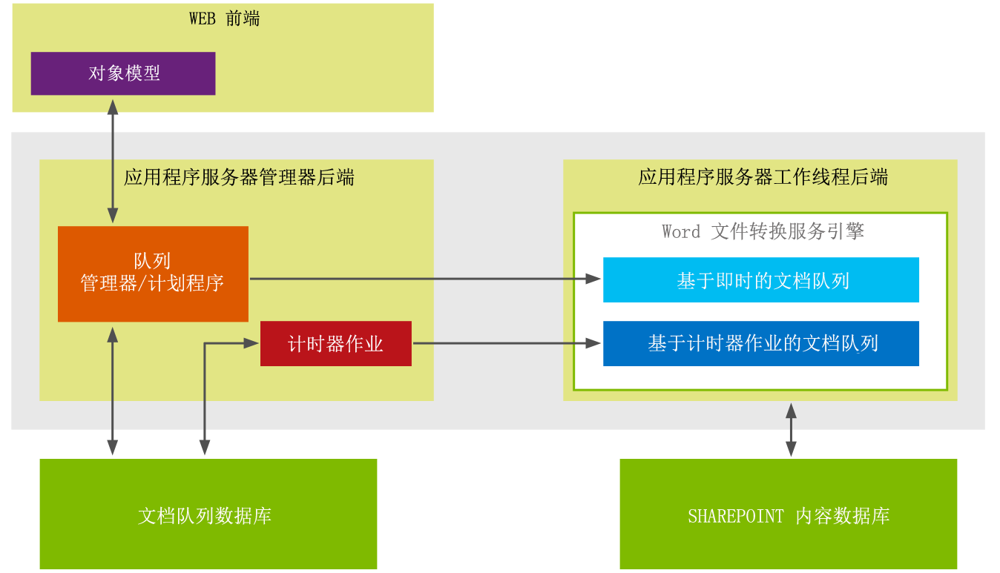

# Word Automation Services 中面向开发人员的新增功能
本主题全面概述了 Word Automation Services 中面向开发人员的新增功能和增强功能。在 Microsoft SharePoint 2013 中，针对 Word Automation Services 的新增功能是支持"按需"文件转换请求。针对 Word Automation Services 的最重要的增强功能是，增加了对将流用作转换作业的输入和输出的支持。
## 创建按需文件转换

在 Microsoft SharePoint 2013 的 Word Automation Services 中，现在可以创建按需文件转换请求，这将产生被立即处理的文件转换。在 SharePoint 2010 中，您将使用代码创建文件转换作业，然后使用 ConversionJob.Start 方法开始转换。随后，转换作业将基于在 Word Automation Services 中设置的有关开始转换作业的频率的时间间隔开始进行。SharePoint 计时器作业将根据此时间间隔开始转换作业。通过使用基于计时器作业的方法，可按照最快 1 分钟的时间间隔开始转换作业。
  
    
    
现在，在 Microsoft SharePoint 2013 的 Word Automation Services 中，您又多了一种选择，即创建一旦提交就会被处理的文件转换请求，而且转换将立即开始且不依赖 SharePoint 计时器作业。
  
    
    
考虑按需文件转换请求与基于 SharePoint 计时作业的转换作业之间的差异的一种方法是，了解按需文件转换请求会通过同步方式立即处理，而基于 SharePoint 计时器作业的转换作业会通过异步方式进行。Word Automation Services 体系结构已经过重新设计，同时支持新类型的按需文件转换请求和现有的基于 SharePoint 计时器作业的文件转换。
  
    
    

**图 1. Word Automation Services 2013 体系结构**

  
    
    

  
    
    

  
    
    
在图 1 中，可以看到 Word Automation Services 体系结构维护了 2 个针对转换的单独队列：一个队列针对的是按需（即时）文件转换请求，另一个队列针对的是基于 SharePoint 计时器作业的转换作业，按需请求将放置在立即处理转换的基于即时的文档队列中。
  
    
    
相比之下，基于 SharePoint 计时器作业的转换作业将放置在基于计时器作业的文档队列中。针对这些请求的转换作业将以为 Word Automation Services 设置的时间间隔开始进行。基于即时的文档队列中的转换请求始终优先于基于计时器作业的文档队列中的转换作业。
  
    
    

### 要点

- 按需文件转换请求是一项附加功能，不会替换现有的基于 SharePoint 计时器作业的转换作业。这意味着，在 SharePoint 2010 中编辑和运行的解决方案将继续在 SharePoint 2013 中编译和运行。
    
  
- 一次只能为一个文件创建按需文件转换请求
    
  
- Word Automation Services 将始终先执行按需文件转换作业，然后再执行基于转换作业的 SharePoint 计时器作业。如果 Word Automation Services 已执行使用 SharePoint 计时器作业的文件转换作业，则 Word Automation Services 将中断此作业，并切换为执行按需文件转换作业直到该作业完成。随后，它将切换回执行基于 SharePoint 计时器作业的文件转换作业
    
  

## 对流执行文件转换

Microsoft SharePoint 2013 的 Word Automation Services 中的另一项新增功能是，支持转换流。在 SharePoint 2010 中，只能转换存储在 SharePoint 库中的文件。现在，您可以使用流转换存储在 SharePoint 外部的文件。
  
    
    

### 要点

- 在创建按需文件转换作业时，只能将流用作输入
    
  
- 由于上述观点，您一次只能转换一个流
    
  
在添加了按需文件转换请求和对转换流的支持后，Word Automation Services 已得到大大增强，可支持更多的文档转换方案。
  
    
    

### 其他资源

-  [SharePoint Server 2010 中的 Word Automation Services](http://msdn.microsoft.com/zh-cn/library/ee558278.aspx)
    
  
-  [Word Automation Services 类库](http://msdn.microsoft.com/zh-cn/library/ee559408.aspx)
    
  

