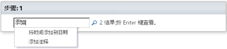

# 工作流操作快速参考（SharePoint 2010 工作流平台）
了解 Microsoft SharePoint Designer 2013 的 SharePoint 2010 工作流平台中可用的工作流操作。 *仅*  当您在使用 SharePoint Designer 2013 而又希望继续使用 SharePoint 2010 工作流平台时使用本文。如果您希望改用 SharePoint 2013 工作流平台，请参阅  [工作流操作快速参考（SharePoint 2013 工作流平台）](workflow-actions-quick-reference-sharepoint-2013-workflow-platform.md)，以及有关较新平台中提供的新功能的其他文章（"其他资源"一节会提到）。若要开始使用 2010 工作流平台创建工作流，请在"创建工作流"对话框的"平台类型"框中选择"SharePoint 2010 工作流"。
## 在哪可以找到工作流操作

可以使用两种方式访问可用工作流操作的菜单。
  
    
    
当您在工作流步骤中进行编辑时，执行下列操作之一：
  
    
    

- 在"工作流"选项卡上的"插入"组中，单击"操作"。
    
  
- 在工作流步骤中双击。在显示的搜索框中，键入您所需的操作的名称中显示的文本（例如"添加"），然后按 Enter。包含您键入的文本的操作和条件将显示在文本框的下方。
    

  

  

  
工作流创建期间可供您使用的操作取决于当前的上下文。例如，"启动审批流程"和"启动反馈流程"操作对基于 Microsoft SharePoint Foundation 2013 的网站不可用。某些列表操作仅在模拟步骤中可用，而另外一些列表操作仅当您的工作流与某个文档库或文档内容类型相关联时可用。用于当前项目的列表操作（例如"设置内容审批状态"和"设置当前项目中的域"）在网站工作流中不可用。
  
    
    
根据操作在工作流中的应用领域，操作被分为多个类别。例如，影响项目行为的操作列于"列表操作"下；与文档集相关的操作列于"文档集操作"下；自定义工作流操作列于"自定义操作"下。操作的类别包括：
  
    
    

- 核心操作
    
  
- 文档集操作（仅当您的工作流与某个文档库或文档内容类型相关联时才会显示）
    
  
- 列表操作
    
  
- 关系操作（仅当您的 SharePoint 网站运行 SharePoint Server 2013 时才会显示）
    
  
- 任务操作（仅当您的 SharePoint 网站运行 SharePoint Server 2013 时才会显示）
    
  
- 任务行为操作（仅当您在预建的工作流操作（例如 "启动审批流程"和"启动反馈流程"）中自定义任务时才会显示）
    
  
- 实用程序操作
    
  
- 自定义操作
    
  

## 常规操作

常规操作是所有工作流上下文中的"操作"列表中都会显示的操作。
  
    
    

****

|**操作**|**说明**|
|:-----|:-----|
|**核心操作**   |此类别的操作是工作流中最常用的操作。    |
|添加注释    | 此操作最初在工作流步骤中显示为"注释: 注释文本"。使用此操作可在工作流设计器中留下信息注释以供参考。在有其他用户共同创作工作流时，此功能尤为有用。例如，如果当前工作流中的某个变量没有使用易于用户理解的名称，则您可以使用此操作添加注释以指示此变量在工作流中的作用。    下面是此操作在工作流步骤中的可能外观的示例：    注释：此变量提供工作流发起人所在的部门。   > **注释**>  在 Microsoft Visio 2013 中编辑工作流的任何人也都能够查看注释。          |
|将时间添加到日期    | 此操作最初在工作流步骤中显示为"向日期添加 0 分钟(输出到变量: date)"。使用此操作可将指定时间（以分钟、小时、天、月或年为单位）添加到某个日期值并将输出值存储在变量中。该时间所添加到的日期值可以是当前日期、指定日期或者查阅结果。    下面是此操作在工作流步骤中的可能外观的示例：    将7天添加到Current Item:Modified（输出到: 变量: A week from Modified）    |
|进行计算    | 此操作最初在工作流步骤中显示为"计算值加值(输出到变量: calc)"。使用此操作可对两个值进行计算并将输出值存储在变量中。可能的计算包括加、减、乘和除。    下面是此操作在工作流步骤中的可能外观的示例：    计算36除以9 (输出到变量:Number of Widgets)     计算 [fx :: Courses*, Filled Seats] 加 1 (输出到变量: New Filled Seats)   |
|记录到历史记录列表    | 此操作最初在工作流步骤中显示为"将此消息记录到工作流历史记录列表"。使用此操作可在工作流的历史记录列表中记录有关工作流的操作或进度的消息。消息可以是工作流事件的摘要，也可以是您要获取的有关当前运行的工作流的其他任何内容。此类消息在解决工作流问题方面很有帮助。例如，您可以记录一则记录"已复制到列表 A"或"已将电子邮件发送给审阅者"等事件的消息。在工作流成功完成后，您可以转到"工作流历史记录"列表并查看"说明"列中显示的消息。    下面是此操作在工作流步骤中的可能外观的示例：    将A week from Modified 变量集记录到工作流历史记录列表中    > **注释**>  如果您需要一项用于停止工作流然后将消息记录到历史记录列表的操作，则请改用"停止工作流"操作。          |
|过程中暂停    |此操作最初在工作流步骤中显示为"暂停 0 天，0 小时，5 分钟"。使用此操作可暂停工作流，具体持续时间以天、小时和分钟为单位。    > **注释**> 最初显示的延迟时间反映计时器作业间隔，此间隔的默认值为 5 分钟。           |
|暂停到某个日期    | 此操作最初在工作流步骤中显示为"暂停到此时间"。使用此操作可将工作流暂停到特定日期。您可使用当前日期、指定日期或者查阅结果。    下面是此操作在工作流步骤中的可能外观的示例：    暂停到1/1/2010 12:00:00 AM    暂停到变量: A week from Modified   |
|发送电子邮件    | 此操作最初在工作流步骤中显示为"向这些用户发送电子邮件"。使用此操作可向用户或组发送电子邮件。它通常用于向工作流参与者发送确认邮件。电子邮件参与者可以是网站集中的用户或组，也可以是组织内部的任何人。您现在可以在您的主题中指定动态值，例如查阅或字符串。   > **重要信息**>  传出电子邮件必须在 SharePoint 管理中心配置。           下面是此操作在工作流步骤中的可能外观的示例：    向变量: approvers 发送电子邮件   |
|设置日期/时间域的时间部分    | 此操作最初在工作流步骤中显示为"将日期的时间设置为 00:00 (输出到变量: date1)"。使用此操作可创建时间戳并将输出值存储在变量中。您可以用小时和分钟为单位设置时间并添加当前日期、指定日期或者查阅结果。例如，假定您要为添加到订单列表中的所有新客户订单添加时间戳。您不希望在时间戳中使用实际收到订单的当前时间，而希望添加某个特定时间以便能够让您的工作流对具有同一时间戳的所有新项目执行任一操作（例如将订单传送到仓库）。再举一个例子，假定您要在某天上午 9 点进行一次演示，并希望收到电子邮件提醒。可以使用此操作将时间添加到日期，将工作流暂停到演示的前一天，然后让工作流向您发送提醒。    下面是此操作在工作流步骤中的可能外观的示例：    将Current Item:Modified 的时间设置为00: 00 (输出到Modified time variable set to midnight)    |
|设置工作流状态    | 此操作最初在工作流步骤中显示为"将工作流状态设置为'已取消'"。使用此操作可设置工作流的状态。默认选项为"已取消"、"已批准"和"已拒绝"。    如果您在此操作的下拉列表中键入新的状态值，您的新状态会自动添加到下拉列表以便后续使用。例如，您可以添加一个比"已完成"或"已取消"更易于用户理解且信息更充分的自定义状态，例如"费用报表已批准"。   > **注释**>  创建某个自定义状态值之后，不能重命名或删除该状态值。但是，您并不是一定要使用该状态值。>  自定义状态仅适用于当前工作流，而不能在其他工作流中使用。>  如果此操作用在模拟步骤中，则工作流不能使用您在此操作中定义的自定义状态值。           如果"设置工作流状态"操作是您在其中同样使用了自定义值的工作流中的最后一个步骤，则您可在工作流暂停或完成后在列表的"状态"列中看到您的自定义值。    下面是此操作在工作流步骤中的可能外观的示例：    将工作流状态设置为规范状态: 准备进行设计评审   |
|设置工作流变量    | 此操作最初在工作流步骤中显示为"将工作流变量设置为值"。使用此操作可以让工作流为工作流变量分配值数据。    下面是此操作在工作流步骤中的可能外观的示例：    将变量: Expense report total 设置为Current Item:Total   |
|**列表操作**   |此类别的操作对列表项执行操作。    > **注释**> 此类别的某些操作会在某些而非所有工作流上下文中显示。例如，有些列表操作仅当您在您的工作流中的模拟步骤中单击时才会显示，而有些列表操作仅当您的工作流附加到某个文档库或文档内容类型时才会显示。有关详细信息，请参阅下文中的 [仅在模拟步骤中可用的操作](workflow-actions-quick-reference-sharepoint-2010-workflow-platform.md#section7a)和 [工作流与某个文档库或文档内容类型相关联时的可用操作](workflow-actions-quick-reference-sharepoint-2010-workflow-platform.md#section6)。           |
|签入项目    | 此操作最初在工作流步骤中显示为"签入此列表中的项目并添加注释: comment"。使用此操作可签入当前已签出的项目。    下面是此操作在工作流步骤中的可能外观的示例：    签入费用报表中的项目并加注释: 费用报告已批准   > **注释**>  您只能签入文档库中的项目。          |
|签出项目    | 此操作最初在工作流步骤中显示为"签出此列表中的项目"。使用此操作可签出当前已签入的项目。    下面是此操作在工作流步骤中的可能外观的示例：    签出当前项目中的项目    > **注释**>  您只能从自己的网站的库中签出项目。>  在签出项目之前，工作流首先会验证该项目当前是否已签入。          |
|复制列表项    | 此操作最初在工作流步骤中显示为"将此列表中的项目复制到此列表"。使用此操作可将列表项复制到另一个列表中。（如果列表项中包含文档，则工作流还会将该文档复制到目标列表。）    下面是此操作在工作流步骤中的可能外观的示例：    将当前项目中的项目复制到存档请求    > **重要信息**>  源列表和目标列表中必须至少有一个类似的列。          |
|创建列表项    | 此操作最初在工作流步骤中显示为"在此列表中创建项(输出到变量: create)"。使用此操作可在您指定的列表中创建一个新列表项。您可在新项中提供域和值。    当您希望创建一个包含指定信息的新项时，可以使用此操作。例如，每当公司相关重要文档（例如合同）获得批准时或在存档文档时创建通知。   > **注释**>  输出变量是在列表中创建的新项的 ID。           下面是此操作在工作流步骤中的可能外观的示例：    在订单中创建项(输出到变量: New Order ID)    |
|删除项目    | 此操作最初在工作流步骤中显示为"删除此列表中的项目"。使用此操作可从列表中删除项目。    下面是此操作在工作流步骤中的可能外观的示例：    删除文档中的项目    |
|放弃签出项目    | 此操作最初在工作流步骤中显示为"放弃签出此列表中的项目"。使用此操作可重新签入项目而不保留自其上次签出后对其所做的任何更改。    下面是此操作在工作流步骤中的可能外观的示例：    放弃签出文档中的项目    |
|设置内容审批状态    | 此操作最初在工作流步骤中显示为"使用注释将内容审批状态设置为此状态"。使用此操作可将内容审批状态字段设置为某个值，例如"已批准"、"已拒绝"或"待定"。（您还可以在此操作中键入自定义状态。）    下面是此操作在工作流步骤中的可能外观的示例：    使用看起来不错将内容审批状态设置为已批准   > **注释**>  必须在列表中启用内容审批才能使用此操作。           此操作适用于工作流当前正在处理的项目，因而在网站工作流中不可用。   |
|设置当前项目中的域    | 此操作最初在工作流步骤中显示为"将域设置为值"。使用此操作可将当前项目中的域设置为某个值。    下面是此操作在工作流步骤中的可能外观的示例：    将内容类型 ID 设置为规格   > **注释**>  如果您希望暂停工作流，直到域的值更改，则请改用"等待当前项目中的域更改"操作。>  当您正在使用网站工作流时，"设置当前项目中的域"操作不可用。          |
|更新列表项    | 此操作最初在工作流步骤中显示为"更新此列表中的项目"。使用此操作可更新列表项。您可以指定域以及这些域中的新值。    下面是此操作在工作流步骤中的可能外观的示例：    更新文档中的项目    |
|等待当前项目中的域更改    | 此操作最初在工作流步骤中显示为"等待域等于值"。使用此操作可暂停工作流，直到当前项目中的指定域已更改为指定值。    下面是此操作在工作流步骤中的可能外观的示例：    等待审批状态等于1;#Rejected   > **注释**>  如果您希望工作流更改域的值，而不是让工作流等待域更改，则请改用"设置当前项目中的域"操作。          |
|**任务操作**   |此类别的操作与任务项目相关。    |
|将表单分配给组    | 此操作最初在工作流步骤中显示为"将自定义表单分配给这些用户"。使用此操作可创建自定义任务表单并将该表单分配给一个或多个参与者或组。参与者在该表单的域中提供其响应，当他们完成任务时，将单击表单上的"完成任务"。    下面是此操作在工作流步骤中的可能外观的示例：    将资产报告分配给营销组    > **注释**>  没有标识任务数据的返回值。          |
|分配待办事项    | 此操作最初在工作流步骤中显示为"将待办事项分配给这些用户"。使用此操作可将待办事项分配给一个或多个参与者或组，提示他们执行自己的任务，并在稍后完成任务时单击其任务表单上的"完成任务"按钮。    下面是此操作在工作流步骤中的可能外观的示例：    将提交费用报表分配给营销组    |
|从用户处收集数据    | 此操作最初在工作流步骤中显示为"从此用户处收集数据(输出到变量: collect)"。使用此操作可将任务分配给参与者，提示他们在自定义任务表单中提供所需的信息，然后单击任务表单上的"完成任务"按钮。    此操作具有 output 子句，这意味着工作流将操作返回的信息存储在相应的变量中。操作中的已完成任务项目的列表项 ID 存储在 **collect** 变量中。    下面是此操作在工作流步骤中的可能外观的示例：    从营销组处收集费用报表(输出到变量: Marketing Expense Report)    |
|**实用程序操作**   |此类别的大多数操作都可用于从文本字符串中提取信息。    您可以拆分文本字符串，并在多种不同情况下在工作流中使用拆分的各个部分。例如，假定您的公司希望通过使用"日期_部门"（例如 07142009_sales.docx）等特定名称格式为所有传入文档加上标记，您希望运行工作流，根据该文件的标记中的日期将任务分配给审阅者。您可以使用实用程序操作获取文档名的前 8 个字符 (07142009)，并使用查阅强制转换将其转换为日期，以便您能够根据该截止日期分配任务。    有关查阅强制的详细信息，请参阅"另请参阅"一节。    |
|从字符串结尾提取子字符串    | 此操作最初在工作流步骤中显示为"复制字符串结尾的 0 个字符(输出到变量: substring)"。使用此操作可复制字符串结尾的指定数量的字符，并将输出值存储在变量中。您应指定工作流要从字符串中复制的字符数。    下面是此操作在工作流步骤中的可能外观的示例：    复制Current Item:Name 结尾的15 个字符(输出到变量:Copy15CharFromEndOfName)    |
|从字符串索引提取子字符串    | 此操作最初在工作流步骤中显示为"从字符串中的 0 开始复制(输出到变量: substring)"。使用此操作可从字符串中的指定字符开始复制所有字符，并将输出存储在变量中。    下面是此操作在工作流步骤中的可能外观的示例：    从Current Item:Name 中的4 开始复制(输出到变量:CopyStringFromChar4)    |
|从字符串开头提取子字符串    | 此操作最初在工作流步骤中显示为"复制字符串开头的 0 个字符(输出到变量: substring)"。使用此操作可复制字符串开头的指定数量的字符，并将输出存储在变量中。您应指定工作流要从字符串中复制的字符数。    下面是此操作在工作流步骤中的可能外观的示例：    复制Current Item:Name 开头的15 个字符(输出到变量:Copy15CharFromStartOfName)    |
|从长度索引提取字符串的子字符串    | 此操作最初在工作流步骤中显示为"从字符串中的 0 开始复制 0 个字符(输出到变量: substring)"。使用此操作可从字符串中的特定字符开始复制指定数量的字符，并将输出存储在变量中。您应指定工作流要从字符串中复制的字符数。    下面是此操作在工作流步骤中的可能外观的示例：    从Current Item:Name 中的4 开始复制15 个字符(输出到变量:CopyfromChar4for15CharOfName)    |
|查找日期之间的间隔    | 此操作最初在工作流步骤中显示为"查找日期和日期间隔的分钟数(输出到变量: time)"。使用此操作可计算两个日期之间的时间差（以分钟、小时或天为单位），并将输出存储在变量中。    下面是此操作在工作流步骤中的可能外观的示例：    查找CurrentItem:Modified 和Today 间隔的分钟数(输出到变量: Last Modified In Minutes)    |
   

## SharePoint 网站运行 SharePoint Server 2013 时的可用操作

"启动审批流程"、"声明记录"和"用户的查阅管理器"等操作仅在 SharePoint 网站运行 SharePoint Server 2013 时可用。
  
    
    

****

|**操作**|**说明**|
|:-----|:-----|
|**文档集操作**|此类别的操作与文档集相关。文档集是一个存储多个文档的文件夹。在工作流中，文档集被视为单个项目。> **注释**> 为了能够在库中使用文档集，您必须在 SharePoint 网站的"库设置"页面中添加"文档集"内容类型。           |
|启动文档集审核流程| 此操作最初在工作流步骤中显示为"启动用户由此列指定的此文档集内容的审批流程"。使用此操作可启动对文档集以及文档集包含的所有文档的审批操作。 使用此操作时，文档集的状态以及文档集包含的所有文档的状态都会更改（例如，更改为"已批准"或"已拒绝"）。 同样，如果您对文档集使用"启动审批流程"操作，则只有文档集的状态本身（而非文档集包含的各个文档的状态）会更改。 下面是此操作在工作流步骤中的可能外观的示例： 通过变量: Bill of Materials Approvers 指定的用户启动此文档集内容的物料清单审批流程 |
|捕获文档集版本| 此操作最初在工作流步骤中显示为"捕获包含内容的类型版本的此文档集版本并加注释: 注释"。使用此操作可锁定包含您在此操作中指定的文档版本（主要版本或次要版本）的文档集的版本。 下面是此操作在工作流步骤中的可能外观的示例： 捕获此文档集的版本，此版本包含内容的上一个主要版本，并加注释：物料清单的上一个主要版本|
|将文档集发送至存储库| 此操作最初在工作流步骤中显示为"使用此操作将文档集提交到具有此说明的此目标内容管理器(输出到变量: submit file result)"。使用此操作可将文档集移动或复制到文档库。文档库可以是 SharePoint 网站中的库，也可以是整个网站（例如"文档中心"），它可使用您定义的规则将记录传送到特定目标。 下面是此操作在工作流步骤中的可能外观的示例： 使用复制操作将文档集提交至 DocumentRepository:GUID ，并包含说明将最终物料清单复制到存储库(输出到变量: Copy Document Set to repository) > **注释**>  在定义规则和传送文档之前，您必须首先在 SharePoint 网站中启用"内容管理器"网站功能。有关详细信息，请参阅"另请参阅"一节中的"配置内容管理器以传送记录"主题。          |
|设置文档集的内容审批状态| 此操作最初在工作流步骤中显示为"将此文档集内容的内容审批状态设置为具有注释的此状态"。使用此操作可将文档集的内容审批设置为"已批准"、"已拒绝"或"待定"。 下面是此操作在工作流步骤中的可能外观的示例： 将此文档集内容的内容审批状态设置为已批准并添加注释"物料清单已批准" > **注释**>  必须在列表中启用内容审批才能使用此操作。          |
|**任务操作**|此类别的操作在审批方案中使用。此类别中有两种预建的工作流操作："启动审批流程"和"启动反馈流程"。预建的操作类似于子工作流，也就是说工作流逻辑已在操作中定义。您只需提供相应信息。这些操作在 SharePoint Server 2013 附带的全局可重用的工作流"审批-SharePoint 2013"和"收集反馈-SharePoint 2013"中使用。有关何时使用这些工作流以及何时使用这些操作的信息，请参阅本文的 [您应何时使用审批和反馈操作？](workflow-actions-quick-reference-sharepoint-2010-workflow-platform.md#section5)一节。另外还提供有"启动自定义任务流程"，此操作还具有内置逻辑，但它（与上述两种操作不同）没有预建工作流应在每个阶段进行的操作。名为"任务行为操作"的操作类别仅在您自定义审批操作（例如"分配项目进行审批"或"分配项目进行反馈""）的行为时才会显示在"操作"列表中。有关"任务行为操作"的详细信息，请参阅本文的 [任务操作中的可用操作](workflow-actions-quick-reference-sharepoint-2010-workflow-platform.md#section4)一节。|
|启动审批流程| 此操作最初在工作流步骤中显示为"通过这些用户启动当前项目上的审批流程"。使用此操作可传送文档以进行审批。审批者可以批准或拒绝文档、重新分配审批任务或请求对文档进行更改。 "启动审批流程"操作的行为方式类似于预建工作流：逻辑已在操作中定义。此操作内置了多个不同阶段，用于定义任务行为、任务流程行为、历史记录日志记录、电子邮件通知和完成条件。虽然此操作附带了此预建逻辑，但仍然需要您提供某些信息，例如审阅者、审批任务是一次分配一个（默认值为"串行"）还是一次分配全部（"并行"）以及任务完成的截止日期或允许的持续时间。 您可将任务分配给内部和外部参与者。外部参与者可以是并非网站集用户的组织内部员工，也可以是组织外部的任何人。 下面是此操作在工作流步骤中的可能外观的示例： 启动变量: Approvers 对当前项目的规格审批流程 |
|启动反馈流程| 此操作最初在工作流步骤中显示为"通过这些用户启动当前项目上的反馈流程"。使用此操作可传送文档以进行反馈。审阅者可以提交反馈或者重新分配反馈任务。 "启动反馈流程"操作的行为方式类似于预建工作流：逻辑已在操作中定义。此操作内置了多个不同阶段，用于定义任务行为、任务流程行为、历史记录日志记录、电子邮件通知和完成条件。虽然此审批操作附带了此预建逻辑，但仍然需要您提供某些信息，例如审阅者、审批任务是一次分配一个（默认值为"串行"）还是一次分配全部（"并行"）以及任务完成的截止日期或允许的持续时间。 您可将任务分配给内部和外部参与者。外部参与者可以是并非网站集用户的组织内部员工，也可以是组织外部的任何人。 下面是此操作在工作流步骤中的可能外观的示例： 启动变量: Reviewers 对当前项目的规格反馈流程 |
|启动自定义任务流程| 此操作最初在工作流步骤中显示为"通过这些用户启动当前项目上的任务流程"。如果上述两种审批操作都无法满足您的需求，则可使用"启动自定义任务流程"操作（一个审批流程模板）。"启动自定义任务流程"还允许将逻辑内置于其中；但与其他两种审批操作不同，它没有预建工作流在其每个阶段需要的所有操作。您可在任务行为或完成条件中指定自己的操作和条件。 下面是此操作在工作流步骤中的可能外观的示例： 启动变量: Approvers 对当前项目的视频课程审批流程 |
|**列表操作**|此类别的操作对列表项执行操作。|
|声明记录|此操作在工作流步骤中显示为"声明此项目为记录"。使用此操作可将文档标识为记录，并应用您可能已在 SharePoint 网站的"记录声明设置"页中定义的记录限制设置。无需为此操作设置任何变量。您可在网站集中的首要网站上定义记录声明设置。记录声明设置可以控制记录的处理方式，例如是否可以编辑或删除记录、哪些元数据应用于记录，以及记录的保留策略是什么样的。记录声明设置指定在将项目声明为记录之后应该应用的限制、允许声明记录的用户角色以及记录声明是否可供所有网站用户使用。|
|撤消声明记录|此操作在工作流步骤中显示为"撤消声明项目为记录"。使用此操作可以撤消应用于记录的任何记录声明设置。无需为此操作设置任何变量。您可在网站集中的首要网站上定义记录声明设置。记录声明设置可以控制记录的处理方式，例如是否可以编辑或删除记录、哪些元数据应用于记录以及记录的保留策略是什么样的。记录声明设置指定在将项目声明为记录之后应该应用的限制、允许声明记录的用户角色以及记录声明是否可供所有网站用户使用。|
|**关系操作**|通过此类别的操作，您可以查阅用户的管理器，并将该输出值存储在变量中。|
|用户的查阅管理器| 此操作最初在工作流步骤中显示为"此用户的查找管理器(输出到变量: manager)"。使用此操作可查阅用户的管理器并将该输出值存储在变量中。 下面是此操作在工作流步骤中的可能外观的示例： 查找Workflow Context:Initiator 的管理器(输出到变量: manager) |
   

## 任务操作中的可用操作

可在工作流中使用"启动审批流程"和"启动反馈流程"等操作来分配列表项以进行审批或反馈。虽然这些操作是预建的（这意味着很多工作流逻辑已在操作中定义），但您还需提供操作所需的其他信息（例如通过确定任务将要分配给的审批者或审阅者）。
  
    
    

> **注释**
> 如果这些操作无法充分满足您的需求，则您可在浏览器、SharePoint Designer 2013 以及与 SharePoint 兼容的开发环境（包括 Visual Studio）中自定义这些操作。也可使用相同工具来自定义"启动自定义任务流程"操作。此操作是一个模板，可用于为组织定义新的任务流程。 
  
    
    

当您在"启动审批流程"和"启动反馈流程"等操作中自定义任务行为时，可以使用名为"任务行为操作"的新操作类别。
  
    
    

> **注释**
> 该类别的可用操作会根据您在工作流中的当前操作位置而变化。 
  
    
    

****

|**操作**|**说明**|
|:-----|:-----|
|结束任务流程|此操作最初在工作流步骤中显示为"结束任务流程"。使用此操作可结束任务流程。随后主工作流将继续执行下一项操作。|
|设置内容审批状态(作为作者)|此操作最初在工作流步骤中显示为"将任务流程正在运行的项目的内容审批设置为此状态(作为工作流作者运行)"。通过此操作，可以使用工作流作者（而非启动工作流的人员）的权限将列表项的审批状态设置为"已批准"、"已拒绝"或"待定"。如果启动审批工作流的人员可能没有审批文档的必要权限，则通常使用此操作。此操作中指定的列表项是当前正在运行操作的项目。它可能是运行整个工作流的项目，但也可能不是。> **注释**> 必须在列表中启用内容审批才能使用此操作。           |
|等待更改任务流程项目|此操作在工作流步骤中显示为"等待更改任务流程正在运行的项目"。使用此操作可暂停任务流程，直到正在运行审批流程的项目中的值更改。|
|等待删除任务流程项目|此操作在工作流步骤中显示为"等待删除任务流程正在运行的项目"。使用此操作可暂停任务流程，直到审批流程正在运行的任务项目中的值被删除。|
||以下操作仅在自定义"启动审批流程"操作（单击"更改单个任务的行为"，然后在"分配任务前"步骤中单击）时才会显示。|
|设置任务域|此操作最初在工作流步骤中显示为"将'任务'域设置为值"。使用此操作可将当前任务项目中的特定域设置为指定值。此操作可用于尚未创建的任务。|
||以下操作仅在自定义"启动审批流程"操作（单击"更改单个任务的行为"，然后在"任务待定时"或"任务到期时"步骤中单击）时才会显示。|
|撤消任务|此操作在工作流步骤中显示为"然后撤消此任务"。使用此操作可终止任务，而不产生任何后果。|
|追加任务|此操作在工作流步骤中显示为"然后追加新任务并分配至此用户"。使用此操作可在审批操作的当前阶段结束时向指定用户分配新任务。如果当前阶段为 Molly;Diane;Oliver，则将任务追加到 Diane 会将阶段更改为 Molly;Diane;Oliver;Diane。|
|委派任务|此操作最初在工作流步骤中显示为"然后将此任务委派给此用户"。使用此操作可撤消分配给当前用户的任务，然后将同一任务分配给其他用户。如果新工作分配的目标是组，则只会将单个任务作为整体分配到组，而不是为每个组成员分配一项任务。若要为每个组成员分配一项任务，请改用"转发任务"操作。|
|升级任务|此操作最初在工作流步骤中显示为"然后将此任务升级至当前代理人的管理者"。使用此操作可将任务分配给当前分配了该任务的用户的管理者。无需为此操作设置任何变量。|
|转发任务|此操作最初在工作流步骤中显示为"然后将此任务转发至此用户"。使用此操作可撤消分配给当前用户的任务，并将同一任务分配给其他用户。如果新工作分配的目标是组，则将为组中的每个成员分配一项任务，而不只是将单个任务作为整体分配到组。若要将单个任务作为整体分配到组，请改用"委派任务"操作。|
|插入任务|此操作最初在工作流步骤中显示为"然后插入分配至此用户的任务"。在审批流程中使用此操作可在当前阶段之后插入一个新阶段（其中指定的用户是唯一参与者）。|
|重新分配任务|此操作最初在工作流步骤中显示为"然后将此任务重新分配给此用户"。使用此操作可将任务重新分配给另一个用户。|
|请求更改|此操作最初在工作流步骤中显示为"然后请求对此用户进行更改"。使用此操作可请求来自其他用户的更改，然后在完成请求的更改后将新任务分配给当前用户。|
|发送任务电子邮件|此操作最初在工作流步骤中显示为"然后向这些用户发送电子邮件"。使用此操作可在发送给指定用户的电子邮件任务通知中包括"编辑任务"按钮。|
   

## 您应何时使用审批和反馈操作？

在 Microsoft Office SharePoint Designer 2007 中，您在审批方案中使用了任务操作。对于 SharePoint Server 2013 中预建的可重用工作流（例如"审批 - SharePoint 2013"和"收集反馈 - SharePoint 2013"），您可能想知道这些工作流与任务操作"启动审批流程"和"启动反馈流程"有何区别。虽然这些任务操作和预建工作流都可在收集反馈和收集审批方案中使用，但预建工作流可提供更加先进和完整的解决方案。
  
    
    
如果预建的可重用工作流无法满足您的需求，您可使用 SharePoint Designer 2013 自定义这些工作流。如果自定义满足您的需求的预建工作流所需的工作量高于创建新工作流，则可在新工作流中利用"启动审批流程"和"启动反馈流程"操作。如果您需要这些操作提供的结构，而不需要它们预先配置的全部功能，则可使用"启动自定义任务流程"操作。
  
    
    
请注意，各种任务操作可在无需严格遵循审批或反馈流程的情况下使用。例如，您可使用任务操作发送电子邮件，提醒员工填写自己的时间表。
  
    
    
下表一方面呈现了三种任务操作之间的比较，另一方面呈现了预建的可重用工作流之间的比较：
  
    
    

****

|**功能**|**任务操作**|**预建的可重用工作流**|
|:-----|:-----|:-----|
|参与流程的用户数    |每项任务操作有单个用户或组参与。    |在预建工作流中，可在多个分配阶段指定多个用户和组。可在每个分配阶段指定两种规范：任务是按串行还是并行顺序分配，以及任务将分配给的用户、组和其他参与者。    |
|预加载的工作流逻辑    |这三种任务操作没有内置逻辑。必须使用其他操作和条件来构建审批或反馈机制。    |预建工作流配备了所有内置逻辑，可提供自始至终的审批或反馈收集体验。您既可以使用其默认逻辑，也可以自定义这些逻辑以满足您的需求。    |
|分配任务的顺序    |在这三种任务操作中，只能按照并行顺序分配任务，无论是分配给单个用户，还是分配给组中的每个成员。也就是说：某个任务操作分配的所有任务都是在单个分配阶段中的同一时间分配的。    |在预建工作流中，可在单个分配阶段分配任务，也可在多个阶段分配；且在每个阶段中，既可以按串行顺序分配任务，也可以按并行顺序分配。    |
|针对任务信息的数据绑定    |这三种任务操作没有配备现成的查阅。    "从用户处收集数据"是一个包含 output 子句的操作：在工作流运行时生成的数据存储在 output 子句中的变量中。若要自己生成审批或反馈方案，您必须随后在工作流中的多个不同操作中提供此变量    |预建工作流利用数据源（包括当前项目、预定义的工作流变量和参数、当前工作流的上下文以及任务结果），让您更加轻松地自定义工作流以满足您的需求。    例如，若要向当前任务分配给的人员发送电子邮件，您可使用"发送电子邮件"操作，并将该操作配置为向"当前任务: 分配对象"发送电子邮件。    |
|面向任务参与者的特殊功能    |这三种任务操作不提供面向任务参与者的特殊功能（例如任务重新分配和更改请求选项）。    |在预建工作流中，审批操作可允许任务参与者将任务重新分配给另一个用户，或通过一次单击请求任务流程所有者进行更改。    |
|任务完成    |在这三种任务操作中，唯一可用于指示任务完成的按钮始终标记有"完成任务"。    |在预建工作流中，您可在任务完成表单中添加更多有意义的按钮（例如"批准"和"拒绝"）以指示任务结果。    |
   

## 工作流与某个文档库或文档内容类型相关联时的可用操作

有些工作流操作（例如"共享文档"）仅在工作流与文档库或者"文档"内容类型或该内容类型的子级相关联时可用。
  
    
    

****

|**操作**|**说明**|
|:-----|:-----|
|**核心操作**   ||
|将文档发送至存储库    | 此操作最初在工作流步骤中显示为"使用此操作将文件提交到带有此说明的此目标路由器(输出到变量: submit file result)"。使用此操作可将与列表项相关联的文档移动或复制到文档库。文档库可以是 SharePoint 网站中的库，也可以是整个网站（如文档中心），它可使用您定义的规则将记录传送到特定目标。    下面是此操作在工作流步骤中的可能外观的示例：    使用移动操作将文件提交到 Archive:DocumentID Value 并包含说明该文件可随时存档(输出到变量: Submit file for archival)    |
|**文档集操作**   |此类别的操作与文档集相关。文档集是一个存储多个文档的文件夹。在工作流中，文档集和文档集包含的所有文档均被视为单个项目。    > **注释**>  为了能够在库中使用文档集，您必须在 SharePoint 网站的"库设置"页面中添加"文档集"内容类型。>  文档集是 SharePoint Server 2013 的一项功能。          有关"文档集操作"的详细信息，请参阅本文的  [SharePoint 网站运行 SharePoint Server 2013 时的可用操作](workflow-actions-quick-reference-sharepoint-2010-workflow-platform.md#section3)一节。    |
|**列表操作**   |此类别的操作对列表项执行操作。    |
|删除草稿    |此操作在工作流步骤中显示为"删除项目的所有草稿(次要版本)"。使用此操作可删除当前项目的所有现有草稿或次要版本。无需为此操作设置任何变量。    > **注释**> 必须在 SharePoint 列表上启用对次要版本的版本控制才能使用此操作。           |
|删除旧版本    |此操作在工作流步骤中显示为"删除项目的所有旧版本"。使用此操作可删除当前项目的所有现有旧版本。无需为此操作设置任何变量。    > **注释**> 必须在 SharePoint 列表上启用版本控制才能使用此操作。           |
   

## 仅在模拟步骤中可用的操作

有些列表操作仅在模拟步骤中可用。使用模拟步骤可通过模拟工作流作者而非工作流发起人来让工作流执行操作。模拟步骤在审批和发布等方案中非常有用，在这些方案中，提交内容进行审批的人员和审批内容的人员可能具有不同的权限。模拟步骤还有助于实现网站管理员任务的自动化（例如在自动为用户分配权限的工作流中）。
  
    
    

> **注释**
>  "工作流作者"是最后一个发布工作流的人员。>  模拟步骤不能嵌套在任何类型的其他步骤中。
  
    
    

|**操作**|**说明**|
|:-----|:-----|
|添加列表项权限    | 此操作最初在工作流步骤中显示为"将这些权限添加到此列表中的项"。使用此操作可向一位或多位指定用户授予指定项目的指定权限级别。    下面是此操作在工作流步骤中的可能外观的示例：    添加对图像列表中的项目的参与讨论、读取权限    |
|继承列表项父权限    | 此操作最初在工作流步骤中显示为"继承此列表中项的父权限"。使用此操作可强制让具有独有权限的列表项从其列表继承父权限。    下面是此操作在工作流步骤中的可能外观的示例：    继承图像列表中的项目的父权限    |
|删除列表项权限    | 此操作最初在工作流步骤中显示为"从此列表中的项删除这些权限"。使用此操作可删除一位或多位指定用户的指定项目的指定权限级别。    下面是此操作在工作流步骤中的可能外观的示例：    删除图像列表中的项目的参与讨论权限    |
|替换列表项权限    | 此操作最初在工作流步骤中显示为"替代此列表中项目的这些权限"。使用此操作可为一位或多位指定用户将其指定项目的当前权限级别替换为指定的新权限级别。    下面是此操作在工作流步骤中的可能外观的示例：    替换图像列表中的项目的读取权限    |
   

## 网站工作流中的操作

网站工作流在网站级别运行，而未附加到任何更具体对象（例如某个单独项目或内容类型）。当您在运行网站工作流时，将无法使用当前项目运行的"设置内容审批状态"和"设置当前项目中的域"等操作。有关这些操作的详细信息，请参阅本文的 [常规操作](workflow-actions-quick-reference-sharepoint-2010-workflow-platform.md#section2)一节。
  
    
    

## 其他资源

-  [工作流操作快速参考（SharePoint 2013 工作流平台）](workflow-actions-quick-reference-sharepoint-2013-workflow-platform.md)
    
  
-  [SharePoint 2013 工作流的新增功能](what-s-new-in-workflows-for-sharepoint-2013.md)
    
  
-  [SharePoint 2013 中的工作流入门](get-started-with-workflows-in-sharepoint-2013.md)
    
  
-  [SharePoint Designer 和 Visio 中的工作流开发](workflow-development-in-sharepoint-designer-and-visio.md)
    
  

  
    
    
