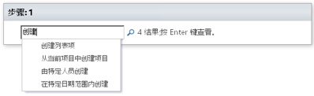
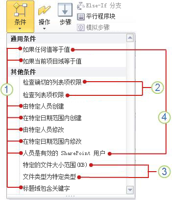

# 工作流条件快速参考（SharePoint 2010 工作流平台）
了解在 Microsoft SharePoint Designer 2013 中 SharePoint 2010 工作流平台中提供的可用工作流条件。 *仅*  当您要在 SharePoint Designer 2013 中操作但又希望继续使用 SharePoint 2010 工作流平台时使用本文。如果您希望改用 SharePoint 2013 工作流平台，请参阅  [SharePoint 2013 的工作流操作和活动引用](workflow-actions-and-activities-reference-for-sharepoint-2013.md)以及"其他资源"一节中列出的其他文章，这些文章介绍了该较新平台中提供的新功能。若要开始使用 2010 工作流平台创建工作流，请在"创建工作流"对话框中的"平台类型"框中选择"SharePoint 2010 工作流"。
## 在何处查找工作流条件

可通过两种方法访问可用工作流条件的菜单。
  
    
    
当您在工作流步骤内进行编辑时，执行下列操作之一：
  
    
    

- 在"工作流"选项卡上的"插入"组中，单击"条件"以打开工作流操作列表。
    
  
- 在工作流步骤内双击。在出现的搜索框中，键入显示在所需条件名称中的文本（如"创建"），然后按 Enter。包含所键入文本的操作和条件将显示在文本框后面。
    
  

  
    
    

  
    
    
您在创建或修改工作流时可供您使用的条件取决于您所处理的准确上下文。请参阅下面的插图以获取更多信息。
  
    
    

  
    
    

  
    
    
 **1** SharePoint Designer 2013 中的一般条件。
  
    
    
 **2** "检查确切的列表项权限"和"检查列表项权限"仅在模拟步骤中可用。
  
    
    
 **3** "特定的文件大小范围(KB)"和"文件类型为特定类型"仅在与文档内容类型、文档内容类型的子项或库关联的工作流中可用。
  
    
    
 **4** "如果任何值等于值"和"人员是有效的 SharePoint 用户"是在您创建网站工作流时唯一可用的条件。
  
    
    

## 一般条件

本节介绍 SharePoint Designer 2013 中适用于列表工作流和可重用列表工作流的条件，而不考虑工作流与何种列表类型或内容类型相关联。
  
    
    

### 如果任何值等于值

此条件在工作流步骤中最初显示为"如果任何值等于值"。当您希望将一个值与另一个值进行比较时，可使用此条件。每个值可以为静态文本、动态字符串或者变量、上下文信息或 SharePoint 域查找。
  
    
    
您可从各种运算符中进行选择以用在您的条件中，例如"包含"和"大于"。为此，您必须设置条件中的第一个"值"然后单击"等于"。可用运算符取决于条件中的第一个"值"的设置。例如，如果您使用查找对话框将条件中的第一个"值"设置为"日期和时间"数据类型（例如"创建于"），则"包含"运算符不在可用选项中。
  
    
    
"等于"和"包含"运算符有两种变化形式：
  
    
    

- "等于"和"包含"运算符都区分大小写。
    
  
- "等于(忽略大小写)"和"包含(忽略大小写)"运算符不区分大小写。
    
  
您为条件中的第二个"值"选择的选项在某种程度上还取决于"值"设为什么。例如，假定您将第一个"值"设置为"创建于"，然后使用字符串变量（如"最后 10 个字符"）查找第二个"值"。您可能希望返回字符串"作为日期/时间"，以便与"创建于"的比较将返回可预测的结果。
  
    
    

> **注释**
> 您可以在条件中使用逻辑运算符，例如**||**（或）或 **&amp;&amp;**（与）。 
  
    
    

下面是此条件在工作流步骤中可能外观的示例：
  
    
    

- 如果 Variable: A week from Modified大于Today
    
  
- 如果 Variable: Specification Name包含(忽略大小写)SharePoint Designer || SPD
    
  
"如果任何值等于值"条件是唯一在您处理网站工作流时可用的两个条件之一，另一个条件是"人员是有效的 SharePoint 用户"。有关网站工作流的详细信息，请参阅本文的 [网站工作流中的可用条件](workflow-conditions-quick-reference-sharepoint-2010-workflow-platform.md#section5)一节。
  
    
    

### 如果当前项目域等于值

此条件在工作流步骤中最初显示为"如果域等于值"。使用此条件可将当前项目（即，当前在其上运行列表或可重用列表工作流的项目）域中的值与另一个值进行比较。值可以为静态文本、动态字符串或者变量、上下文信息或其他 SharePoint 域查找。
  
    
    
可单击"域"查看选项列表。"域"的可用选项取决于工作流关联到的内容类型、列表、库或网站。例如，关联到默认库的工作流将具有"标题"、"创建于"和"创建者"等域选项。
  
    
    
您可从各种运算符中进行选择以用在您的条件中，例如"包含"和"大于"。在选择运算符之前，必须先为"域"选择一个值，然后单击"等于"。可用的运算符取决于"域"设置。例如，如果您使用查找对话框将"域"设置为"日期和时间"数据类型（"创建于"），则"包含"运算符不会列为选项。
  
    
    
"等于"和"包含"运算符有两种变化形式。"等于"和"包含"运算符区分大小写，而"等于(忽略大小写)"和"包含(忽略大小写)"不区分大小写。例如，如果您将"域"设置为"标题"然后使用"包含"运算符，并且条件中的"值"为 Document，则仅当标题包含大写 D 的 Document 时，此条件才为真；如果标题只包含document（不带大写 D），此条件不为真。如果您改用"包含(忽略大小写)"运算符，则对于包含 Document 和/或document 的标题，此条件均为真。
  
    
    
您为"值"设置的选项在某种程度上还取决于"域"设置。例如，假定您将"域"设置为"创建于"，然后使用字符串变量（如"最后 10 个字符"）查找该"值"。您可能希望返回字符串"作为日期/时间"，以便与"创建于"的比较将返回可预期的结果。
  
    
    

> **注释**
> 您可在条件中使用逻辑运算符，例如**||**（或）或 **&amp;&amp;**（与）。 
  
    
    

下面是此条件在工作流步骤中可能外观的示例。（请注意，在第一个示例中，"小于"的含义是"早于"。）
  
    
    

- 如果 Current Item:Modified小于1/1/2010 12:00:00 AM
    
  
- 如果 Current Item:Path包含(忽略大小写)Marketing || Public Relations
    
  

### 由特定人员创建

此条件在工作流步骤中最初显示为"如果由特定人员创建"。使用此条件可发现某项目是否是由指定的用户创建的。您可以通过以下方法指定用户：手动输入用户的用户名或电子邮件地址（例如 Olivier@contoso.com）或通过从已列在 SharePoint、Exchange 或 Active Directory 中的用户中选择该用户。
  
    
    

> **注释**
> 由于用户名和电子邮件地址都区分大小写，因此建议您使用后种方法来确保大小写正确。如果您必须手动输入用户名或电子邮件地址，请注意准确匹配大小写。例如，如果用户帐户注册为 Contoso\\Molly，则"如果由 contoso\\molly 创建"这一条件的计算结果不为真。 
  
    
    

下面是此条件在工作流步骤中可能外观的示例：
  
    
    

- 如果由 Molly Clark 创建
    
  

### 在特定日期范围内创建

此条件在工作流步骤中最初显示为"如果在日期和日期之间创建"。使用此条件可发现某项目是否是在两个指定的日期之间创建的。您可以使用当前日期、指定日期或查找结果。
  
    
    
下面是此条件在工作流步骤中可能外观的示例：
  
    
    

- 如果在 1/1/2009 和1/1/2010 12:00:00 AM 之间创建
    
  

### 由特定人员修改

此条件在工作流步骤中最初显示为"如果由特定人员修改"。使用此条件可发现某项目是否是由指定的用户修改的。可以电子邮件地址（例如 olivier@contoso.com）的形式指定该用户，也可从 SharePoint、Exchange 或 Active Directory 用户中选择该用户。
  
    
    

> **注释**
> 用户名和电子邮件地址都区分大小写。建议您选择用户名或电子邮件地址来帮助确保您使用正确的大小写。如果您键入用户名或电子邮件地址，则必须与帐户大小写匹配。例如，如果用户帐户为 Contoso\\Molly，则"如果由 contoso\\molly 修改"的计算结果不为真。 
  
    
    

下面是此条件在工作流步骤中可能外观的示例：
  
    
    

- 如果由 Molly Clark 修改
    
  

### 在特定日期范围内修改

此条件在工作流步骤中最初显示为"如果在日期和日期之间修改"。使用此条件可发现某项目是否是在两个指定的日期之间修改的。对于每个日期值，您可以使用当前日期、指定日期或查找结果。
  
    
    
下面是此条件在工作流步骤中可能外观的示例，
  
    
    

- 如果在 1/1/2009 和1/1/2009 12:00:00 AM 之间修改
    
  

### 人员是有效的 SharePoint 用户

此条件在工作流步骤中最初显示为"如果人员是有效的 SharePoint 用户"。使用此条件可发现指定的用户是否为 SharePoint 网站的成员。
  
    
    
在 SharePoint Designer 2013 中，您可在工作流中包括企业域外部的人员（称为外部参与者）。例如，假定您已将工作流中的任务分配给外部参与者。您随后可使用此操作使网站用户跟踪这些外部参与者，直到这些任务完成。
  
    
    
下面是此条件在工作流步骤中可能外观的示例，
  
    
    

- 如果 Molly Clark 是有效的 SharePoint 用户
    
  
"人员是有效的 SharePoint 用户"条件是在您处理网站工作流时可用的唯一两个条件之一，另一个条件是"如果任何值等于值"。有关网站工作流的详细信息，请参阅本文的 [网站工作流中的可用条件](workflow-conditions-quick-reference-sharepoint-2010-workflow-platform.md#section5)一节。
  
    
    

### 标题域包含关键字

此条件在工作流步骤中最初显示为"如果标题域包含关键字"。使用此条件可发现某项目的"标题"域是否包含特定文本。您可以在字符串生成器中指定文本（作为静态值、作为动态字符串或作为二者的组合），也可以插入域或变量查找。
  
    
    

> **注释**
> 使用"标题域包含关键字"条件时，您无法搜索多个关键字文本。要搜索多个可选的关键字文本，可在以下两个条件中的任一个中使用逻辑运算符（例如**||**（或）和 **&amp;&amp;**（与））："如果任何值等于值"和"如果当前项目域等于值"。（如果您只想在"标题"域中搜索，则使用后一个条件。）例如，请查看下面的图像： > 
  
    
    

  
    
    

  
    
    

  
    
    

  
    
    

## 仅在模拟步骤中可用的条件

默认情况下，在手动启动工作流时，该工作流使用启动它的人员具有的权限。但如果启动工作流的人员没有足够的权限来执行该工作流将需要执行的一项或多项操作，情况会怎样？例如：如果工作流有时需要将文档存档至库中，启动该工作流的人员对该库可能只有读取权限级别（不包括存档权限），情况会怎样？ 
  
    
    
在此类情况下，您可以使用工作流中的一个或多个模拟步骤。模拟步骤使用最近保存工作流模板的人员具有的权限，该人员通常是模板创作者，通常具有执行工作流的所有操作的权限（包括本例中将文档存档至相应库中的权限）。 
  
    
    

> **注释**
>  对于这两个条件， *所有*  指定的用户和组都必须通过比较才能使条件的计算结果为 True。>  对于这两个条件，指定的权限是否已 *明确*  分配给指定的单个用户或者这些单个用户是否仅 *隐式*  具有这些权限（例如，作为已向其分配这些权限的组成员）无关紧要。另一方面，对于指定的 *组*  ，这些权限必须已 *明确*  进行分配且 *未*  继承自父组。
  
    
    

### 检查列表项权限

此条件在模拟步骤中最初显示为"如果这些用户的权限为至少对此列表中的项目具有这些权限"。 
  
    
    
使用此条件可发现对于指定的列表或库，每个指定的用户和组具有的 *单个权限*  是否包括指定的一个或多个安全级别中包括的所有 *单个权限*  。
  
    
    
 **示例**
  
    
    

- 某用户或组对列表只有读取权限级别，但条件指定审批级别。读取级别 *不*  包括审批级别中包括的所有权限，因此本例中条件的计算结果为 False。
    
  
- 另一用户或组对同一列表具有完全控制权限级别。完全控制级别包括审批级别中包括的所有权限（以及其他权限），因此这时条件的计算结果为 True。
    
  
下面是此条件在工作流步骤中可能外观的示例：
  
    
    

- 如果 Contoso 成员的权限为至少对当前项中项的具有读取权限
    
  

### 检查列表项权限级别

此条件在模拟步骤中最初显示为"如果这些用户的权限级别为对此列表中的项目至少具有这些权限级别"。 
  
    
    
使用此条件可发现对于指定的列表或库，每个指定的用户和组是否已被 *明确*  分配了指定的一个或多个权限 *级别*  。此条件 *不*  会考虑仅 *隐式*  具有的权限（例如，由已向其分配这些权限的组成员持有的权限），也不会考虑指定用户和组具有的单个权限。
  
    
    
 **示例**
  
    
    

- 某用户只明确分配有对列表的完全控制权限级别，但条件仅指定读取级别。即使该用户 *具有*  读取级别中包括的所有单个权限，该用户也未 *明确*  分配有读取级别，因此条件的计算结果为 False。
    
  
- 另一位用户只明确分配有对不同列表的设计权限级别，但条件同时指定设计级别和管理层次结构级别。因为该用户只分配有两个必需级别中的一个，所以条件的计算结果为 False。
    
  
- 对于第三个列表，某用户为 Members 组的成员并从该组继承权限。但是，任何权限级别都未 *明确*  分配给该用户。条件需要参与级别的 *明确工作分配*  ，因此，因为该用户仅隐式具有该级别的权限，所以条件的计算结果同样为 False。
    
  
下面是此条件在工作流步骤中可能外观的示例：
  
    
    

- 如果 Contoso 成员的权限级别为对当前项中项的至少具有读取权限
    
  

## 仅在工作流与库或文档内容类型相关联时可用的条件

"特定的文件大小范围(KB)"和"文件类型为特定类型"这两个条件仅在工作流关联到库或文档内容类型时可用。
  
    
    

### 特定的文件大小范围(KB)

此条件在工作流步骤中最初显示为"如果文件大小在大小 KB 和大小 KB 之间"。使用此条件可发现文档的文件大小是否介于两个指定的大小（以 KB 为单位）之间。此条件不将指定的大小包括在计算中。对于每个"大小"实例，您可以输入数字或使用查找。
  
    
    
下面是此条件在工作流步骤中可能外观的示例，
  
    
    

- 如果文件大小在 1023 和1048577 KB 之间
    
  

> **注释**
> 指定的上限和下限不包括在定义的范围中。在此处提供的示例中，1023 KB 的文件的计算结果为 false ，因为它不介于 1023 与 1048577 之间。 
  
    
    

### 文件类型为特定类型

此条件在工作流步骤中最初显示为"如果文件类型为特定类型"。使用此条件可发现当前项的文件类型是否为指定的类型（例如 docx）。您可以输入字符串形式的文件类型或使用查找。
  
    
    
下面是此条件在工作流步骤中可能外观的示例：
  
    
    

- 如果文件类型为 docx
    
  

## 网站工作流中的可用条件

网站工作流在网站级别运行且不与列表项关联。当您处理网站工作流时，仅下列条件可用。（SharePoint Designer 2013 中的所有其他条件适用于列表项，因此这些条件在网站工作流中均无效。）
  
    
    

- **如果任何值等于值**
    
  
- **人员是有效的 SharePoint 用户**
    
  
在网站工作流中的模拟步骤中：
  
    
    

- **检查列表项权限**
    
  
- **检查列表项权限级别**
    
  
- **人员是有效的 SharePoint 用户**
    
  
有关条件的详细信息，请参阅本文的 [一般条件](workflow-conditions-quick-reference-sharepoint-2010-workflow-platform.md#section2)一节。
  
    
    

## 其他资源

-  [SharePoint 2013 工作流的新增功能](what-s-new-in-workflows-for-sharepoint-2013.md)
    
  
-  [SharePoint 2013 中的工作流入门](get-started-with-workflows-in-sharepoint-2013.md)
    
  
-  [SharePoint Designer 和 Visio 中的工作流开发](workflow-development-in-sharepoint-designer-and-visio.md)
    
  

  
    
    

