# 使用 Visual Studio 2012 处理 SharePoint 2013 工作流中的任务
了解 SharePoint 2013 中引入的新的和已修订的工作流任务框架，它在新的 工作流管理器 上构建。 
 **提供者：** [Andrew Connell](http://social.msdn.microsoft.com/profile/andrew%20connell%20%5bmvp%5d/)， [AndrewConnell.com](http://www.andrewconnell.com)
  
    
    


  
    
    

> **注释**
> 本文随附端到端代码示例，你可以用来理解文章，或用作你自己的 SharePoint 工作流项目的起点。你可以在 [此处](http://assets.andrewconnell.com/media/Default/Downloads/SP2013Wf-CustomTasks.zip)找到可下载的代码。 
  
    
    


  
    
    
SharePoint 带给 Windows Workflow Foundation 的最大的优势之一是实现了新的和改进的任务管理框架，它采用了新 工作流管理器 作为其托管环境。
## 查看 SharePoint 2007 和 SharePoint 2010 中的工作流任务

SharePoint 2007 和 SharePoint 2010 都以类似方式实现工作流任务。当你在列表、内容类型或网站（在 SharePoint 2010 中）上创建了工作流关联时，你已将特定列表指定为创建工作流任务的位置。该列表是使用标准 SharePoint **Task** 内容类型 (ID = 0x0108) 的标准 SharePoint **Task** 列表 (ID = 107)。然后，用户可以访问列表中的项以查看、编辑和完成任务。如果已为工作流进行相应配置，则工作流实例已监控列表中的任务项，以便进行更新。
  
    
    
然而，SharePoint 中任务表单的默认呈现已预先确定，即使对于自定义工作流也是如此。要获得完整的灵活性，你需要在创建用于支持任务的自定义表单解决方案时使用 ASP.NET [Web 表单](http://www.asp.net/web-forms) 或 [InfoPath 表单](http://msdn.microsoft.com/zh-cn/library/ms540731%28v=office.14%29.aspx)。
  
    
    

## SharePoint 2013 中任务的新功能

由于 SharePoint 体系结构的更改，在 SharePoint 2013 中创建、管理和处理任务的方式也发生了改变。
  
    
    
核心的改变是不再在 SharePoint 内管理和处理工作流。相反，SharePoint 2013 利用称为 工作流管理器 的新组件，它在外部运行。工作流管理器 托管 Windows Workflow Foundation 运行时和 Windows Workflow Foundation 要求的必需服务。在发布工作流或启动已发布工作流的新实例时，SharePoint 会通知 工作流管理器，后者反过来会处理工作流事件。当工作流需要访问 SharePoint 中的信息（例如列表项属性或用户属性）时，它会使用 OAuth 为自己进行身份验证，并使用 REST API 通过 Web 服务调用再次与 SharePoint 通信。
  
    
    
SharePoint 2013 中 SharePoint 平台的整体自定义趋势也发生了改变，尽管此改变从 SharePoint 2010 中 沙盒解决方案 的实现开始。在 SharePoint 2013 中，Microsoft 引入了更改，将自定义从 SharePoint Server 移到客户端浏览器或外部资源。这些更改包含新的 SharePoint 应用程序模型、对于分配应用程序身份的支持、使用 OAuth 的身份验证、客户端对象模型的增强功能以及 REST API。
  
    
    

## SharePoint 2013 中工作流任务的体系结构更改

SharePoint 2013 中的体系结构更改会如何影响工作流任务呢？对于工作流任务，影响并不明显；你使用自定义任务表单的情况除外。过去，你使用 InfoPath 或 ASP.NET Web 表单创建了任务表单。另一方面，SharePoint 2013 为工作流任务使用默认列表项呈现表单。 
  
    
    
有时，你可能需要自定义任务字段的外观或行为。要实现该目的，请创建包含网站栏的自定义任务内容类型。然后，网站栏可以使用 SharePoint 2013 中新的客户端呈现框架，该框架要求创建用于定义字段在浏览器中的外观和行为的 JavaScript 文件。 
  
    
    
有关使用客户端呈现的详细信息，请参阅 [如何使用客户端呈现在 SharePoint 应用程序中自定义列表视图](http://msdn.microsoft.com/zh-cn/library/jj220045.aspx)。
  
    
    
单个任务项基于内容类型。重要的是，SharePoint 2013 中的内容类型有一些改变。在 SharePoint 2007 和 SharePoint 2010 中，使用 **Task** 内容类型 (ID = 0x0108) 创建了工作流。这与用于手动创建任务列表中非工作流任务的内容类型相同。SharePoint 2013 通过引入新的内容类型 **Workflow Task (SharePoint 2013)** (ID = 0x0108003365C4474CAE8C42BCE396314E88E51F) 改变了此状况，新内容类型继承自 Task 内容类型并可指示这些任务仅用于工作流。
  
    
    
新的 **Workflow Task** 内容类型与之前的 **Task** 内容类型的差异在于它具有两个新栏：
  
    
    

- **WorkflowInstanceId**：包含对创建了任务的工作流实例标识符的引用，该标识符用于工作流实例状态页等位置。该状态页可以使用此字段查询相关联的工作流任务列表以查找 **WorkflowInstanceId** 列包含指定 ID 的所有列表项。
    
  
- **TaskOutcome**：在任务表单的呈现中使用的选择字段，它使用户可以选择不同的完成标准选项。任务编辑表单将指定工作流任务结果以表单底部按钮的形式呈现，这些按钮位于"保存" 和"取消"按钮旁。SharePoint 2013 中的工作流不仅限于 **Approved** 和 **Rejected** 这两个选项，如图 1 所示。
    
   **图 1. 工作流任务结果**

  

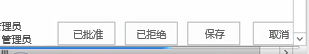
  

  

  
当然，内容类型是工作流任务的一部分。内容类型仅规定任务列表项的结构。任务列表模板具有同等重要性，它在 SharePoint 2013 中也有所改变。
  
    
    
在 SharePoint 2013 之前，工作流任务列表与标准任务列表 (ID = 107) 使用同一个列表模板。它曾是同样可以包含非工作流任务的标准 SharePoint 任务列表。但 SharePoint 2013 中的方法不相同，它引入了新的列表类型。该列表称为层次结构任务列表，它引入页面顶部的时间线视图以显示任务计划，如图 2 所示。请注意，它还可以让用户查看任务依赖关系。
  
    
    

**图 2. 层次结构任务列表**

  
    
    

  
    
    
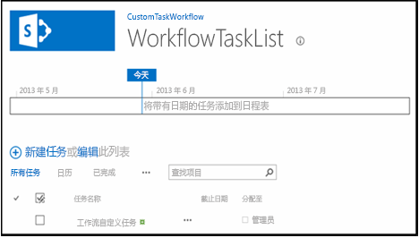
  
    
    

  
    
    

  
    
    

## SharePoint 2013 中的创建工作流任务选项

SharePoint Designer 2013 和 Visual Studio 2008 都为工作流作者提供用于创建工作流任务的两种方法。一种是创建用于分配到个人或组的单个任务。另一种是创建任务并将其分配给多个人。使用 Visual Studio 2008 在自定义工作流中创建单个任务时，请使用 **SingleTask** 活动。使用该活动，你可以在"属性"工具窗口中或使用向导修改属性，如图 3 所示。
  
    
    

**图 3. 单个任务向导**

  
    
    

  
    
    
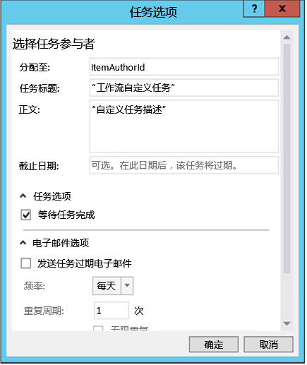
  
    
    
SharePoint 使你可以指定多个任务以串行或并行方式运行，并指定任务完成的标准。SharePoint 是否应该等待所有任务都完成，还是应该等待一定百分比的任务完成并得到特定结果？要在 Visual Studio 2008 中创建多个任务，请使用 **CompositeTask** 活动，其向导和属性与 **SingleTask** 活动相似，如图 4 所示。
  
    
    

**图 4. 复合任务向导**

  
    
    

  
    
    
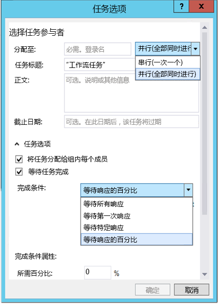
  
    
    

  
    
    

  
    
    

## 如何：在自定义工作流中创建和分配任务

下面是演示如何在自定义工作流中创建和分配任务的演练。在开始之前，请确保你可以访问 SharePoint 2013 开发人员网站。
  
    
    

### 1. 创建新的 SharePoint 2013 应用程序项目


1. 创建新的 SharePoint 2013 应用程序项目并将其配置为 SharePoint 承载的外接程序。
    
  
2. 向该项目添加新的 **Announcement** 列表实例。它将用作用于测试工作流的项的容器。
    
  
3. 右键单击"解决方案资源管理器"中的项目图标并依次选择"添加"和"新项"，以向该项目添加工作流项。
    
  
4. 在"添加新项"对话框中，从"Office/SharePoint"类别选择"工作流"项目项，并将其命名为"CustomTaskWorkflow"，然后单击"下一步"。
    
  

### 2. 收集关于新公告项的信息

我们将在工作流中创建一个任务，并将其分配到创建了用于启动工作流的公告列表项的人。列表项本身将向工作流提供信息。我们将使用 **LookupSPListItemProperties** 活动，它会从自己在 SharePoint 中调用的 REST Web 服务返回动态值。然后，我们将该值存储在名为 **AnnouncementItemProperties** 的新变量中，我们会将该变量的数据类型更改为 **DynamicValue**。
  
    
    

1. 创建 **AnnouncementItemAuthorId** 变量以存储创建了列表项的人的 ID，如图 5 所示。
    
   **图 5. LookupSPListItemProperties 活动**

  

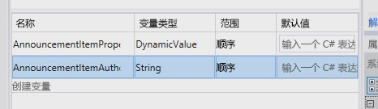
  

  

  
2. 将 **LookupSPListItem** 活动放置在工作流设计图面上，并将 **ListID** 属性设置为 _(current list)_。
    
  
3. 将 **ItemId** 设置为 _(current item)_。
    
  
4. 将 **Result** 设置为输出到我们之前创建的 **AnnouncementItemProperties** 变量。
    
  
5. 要从变量中获取项的作者，请单击 **LookupSPListItem** 活动中的"获取属性"链接，并将 **GetDynamicValueProperties** 活动添加到设计图面。将其 **Source** 属性设置为 **LookupSPListItem** 活动的输出。
    
  
6. 单击 **Properties** 属性上的"[…]"按钮以显示"属性"对话框。
    
  
7. 在"属性"对话框中，将"实体类型"更改为"公告列表项"，如图 6 所示。
    
  
8. 将"创建者"路径指定到变量 **AnnouncementItemAuthorId**，如图 6 所示。
    
   **图 6. "属性"对话框**

  

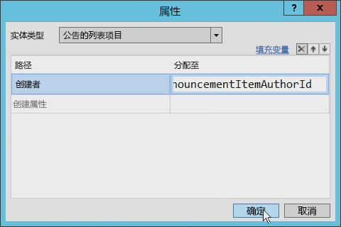
  

  

  

### 3. 创建和分配任务

此时，我们可以创建任务，并将其分配给公告项的作者。
  
    
    

1. 从工具箱中，将 **SingleTask** 活动添加到工作流设计图面。
    
  
2. 单击活动中的"配置"链接以打开"任务项目"对话框。
    
  
3. 将"Assigned To"属性设置为用于存储作者标识符的变量。
    
  
4. 修改任务的标题和正文，如图 7 所示。
    
   **图 7. "任务选项"对话框**

  

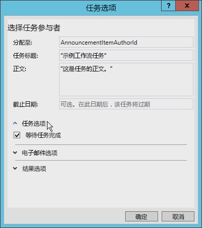
  

  

  
还可以在"任务选项"对话框中设置其他几个选项。例如，仅需选中该框，即可设置工作流，使其等待任务完成（参见图 7）。之前版本的 SharePoint 工作流需要较难的解决方法才能达到此目的。
  
    
    
请注意图 8 中可以设置的电子邮件选项。它们位于其他选项中间，你可以使用它们确定电子邮件将在任务过期时发送，还可以指定发送提醒信息的频率。 
  
    
    

**图 8. "电子邮件选项"设置**

  
    
    

  
    
    
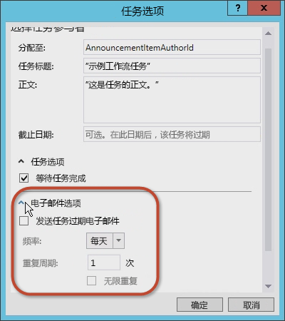
  
    
    
你还可以设置任务结果选项。你可以通过"结果字段"和"默认结果"选择工作流任务内容类型，如图 9 所示。
  
    
    

**图 9. "结果选项"设置**

  
    
    

  
    
    
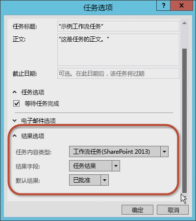
  
    
    

  
    
    

  
    
    

### 4. 检查并修改任务属性

接受"任务选项"对话框中的值之后，请选择 **SingleTask** 活动，然后检查"属性"属性网格（参见图 10）。
  
    
    

**图 10. "属性"工具窗口**

  
    
    

  
    
    
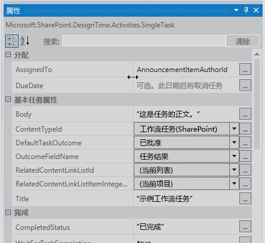
  
    
    
使用"属性"属性网格，你可以指定是否希望任务等待完成之后再继续，还可以配置任务生成的电子邮件，包括初始分配电子邮件、过期电子邮件以及任务取消电子邮件。
  
    
    
请注意， **Outcome** 属性自动为任务创建了名为 **outcome_0** 的变量。要查看该变量中包含的内容，请在设计图面上添加 **WriteToHistory** 活动并更新消息以写出结果，如图 11 所示。
  
    
    

**图 11. 结果属性值**

  
    
    

  
    
    
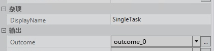
  
    
    

  
    
    

  
    
    

### 5. 测试工作流

要测试工作流，请进行以下操作：
  
    
    

1. 按"F5"以构建并运行，或者单击 Visual Studio 2008 中的"开始"按钮。如果你要在本地安装的 SharePoint 2013 中测试，Visual Studio 2008 将启动 工作流管理器 测试服务主机实用程序并将工作流部署到开发人员网站。稍后，开发人员网站将打开。
    
  
2. 导航至"公告"列表并创建列表项，然后手动启动自定义工作流。
    
  
3. 返回到该工作流实例的状态页以查找该工作流创建的任务。单击任务以查看表单。请注意工作流中定义的"任务名称"和"AssignedTo"字段，如图 12 所示。
    
   **图 12. 任务表单**

  

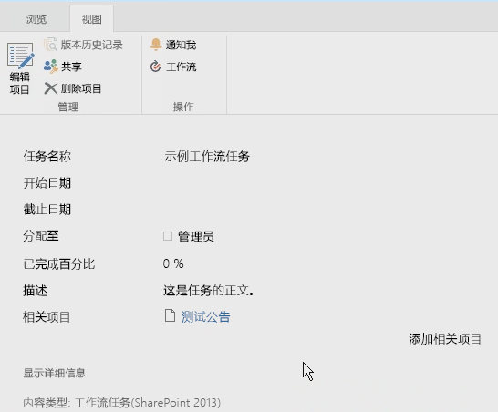
  

  

  
4. 最后，返回任务并编辑表单，然后单击"批准"或"拒绝"以完成任务。请注意，任务结果显示在工作流实例的"工作流历史记录"列表中，如图 13 所示。
    
   **图 13. "工作流历史记录"列表**

  

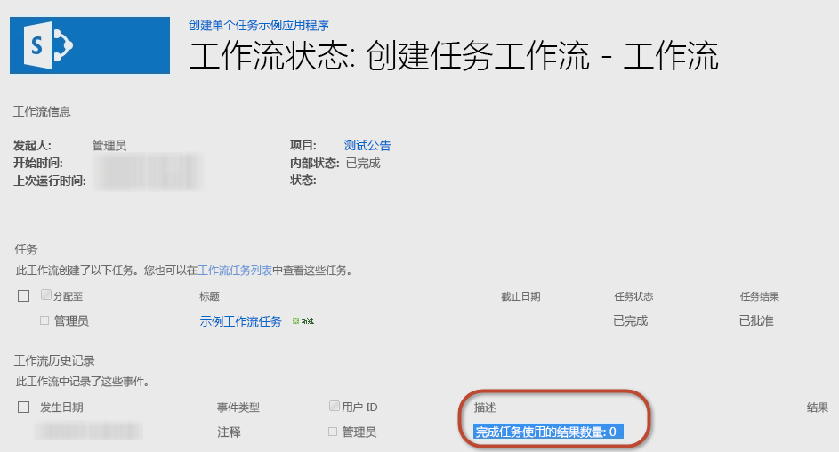
  

  

  

## 如何：使用自定义结果创建自定义任务类型

以前的演练演示了如何创建简单的任务并配置其属性。然而，有时默认选项不能满足你的需求。例如，请考虑一个要求某人审阅文档的任务。在审阅草稿文档时，审阅者应该选择两个选项之一：将草稿文档返回给作者以供修订，或者将文档转发给编辑。遗憾的是，两个默认选项（"批准"和"拒绝" ）都不能满足审阅者的需求。更适合的选项应该是"返回给作者"和"转发给编辑" 。
  
    
    
使用 SharePoint Designer 2013 或 Visual Studio 2008 创建工作流时，你可以创建包含自定义任务结果的自定义工作流任务。要实现此目的，请将自定义任务创建为特殊内容类型，然后添加用于定义所需结果的自定义网站栏。你可以从称为 **OutcomeChoice** 的字段类型（它是选项字段）派生自定义列。
  
    
    
但是，该方法可能有挑战性，因为从中派生自定义任务的内容类型是 **Workflow Task (SharePoint 2013)** 内容类型，它包含默认 **TaskOutcome** 网站栏，其中包括"批准"和"拒绝"选项。然而，你可以通过将 **TaskOutcome** 列从自定义任务内容类型删除并确保它没有在工作流任务列表中出现来调整默认设置。否则，它会导致显示多个选项。例如，请考虑具有两个选项（"红色药丸"和"蓝色药丸"）的自定义结果。如果没有删除默认结果，将为完成任务的用户呈现所有可用的结果选项（如图 14 所示），即使这些结果选项并不适合也是如此。
  
    
    

**图 14. 结果选项**

  
    
    

  
    
    

  
    
    
最佳做法是为你创建的每个任务类型创建不同的工作流任务列表。 
  
    
    

### 创建 SharePoint 2013 应用程序项目

若要开始进行针对使用 Visual Studio 2008 创建自定义工作流任务的演练，你首先要确保自己能够访问 SharePoint 2013 开发人员网站。 
  
    
    

1. 在 Visual Studio 2008 中，创建新的 SharePoint 2013 应用程序项目，它已配置为 SharePoint 承载的外接程序。
    
  
2. 向该项目添加新的 **Announcement** 列表实例。你会将它用作用来测试工作流的项的容器。
    
  
3. 接下来，通过右键单击"解决方案资源管理器"中的项目图标并依此选择"添加"和"新项"来为项目添加工作流项。
    
  
4. 在"添加新项"对话框中，从"Office/SharePoint"类别中选择"工作流"项目项，并将其命名为"CustomTaskWorkflow"；然后单击"下一步"。
    
  

### 创建自定义结果列

创建了 **Announcements** 列表后，我们接下来要创建将包含自定义任务的自定义内容类型以及用于自定义结果字段的网站栏。
  
    
    

1. 右键单击该项目，然后依次选择"添加"和"新项"。
    
  
2. 现在，选择"网站栏"项目项模板，并将此字段名称设置为"CustomOutcomeColumn"。在网站栏的模板内，需要进行几处更改。
    
  
3. 将该列的字段类型设置为 **OutcomeChoice**，这是结果列的必填字段类型。
    
  
4. 删除"必填"列。
    
  
5. 接下来，由于 **OutcomeChoice** 字段类型基于选择字段类型，所以请添加几个你自己的选择。
    
  
新的自定义网站栏标记现在应如下所示：
  
    
    


```XML

<?xml version="1.0" encoding="utf-8"?>
<Elements xmlns="http://schemas.microsoft.com/sharepoint/">  
  <Field
       ID="{7b7edd9e-f5d1-4558-a2c8-e733dcfb0a5e}"
       Name="CustomSiteColumn"
       DisplayName="Better State"
       Type="Choice"
       Required="FALSE"
       Group="Custom Site Columns">
       <CHOICES>
         <CHOICE>Florida</CHOICE>
         <CHOICE>Georgia</CHOICE>
       </CHOICES>
       <Default>Florida</Default>
  </Field>
</Elements>
```


### 创建自定义任务的内容类型

创建网站栏后，下一步是创建自定义任务专用的内容类型。
  
    
    

1. 将新内容类型的项目项添加到名为 **CustomTaskContentType** 的项目。
    
  
2. 当系统提示你选择作为其基础的内容类型时，请选择 **Workflow Task (SharePoint 2013)** 内容类型。
    
  
3. 接下来，将自定义结果列添加到可用列的列表，并删除默认结果列，以使内容类型的标记如下所示。
    
  ```XML
  
<?xml version="1.0" encoding="utf-8"?>
<Elements xmlns="http://schemas.microsoft.com/sharepoint/">
  <!-- Parent ContentType: Workflow Task (SharePoint 2013) (0x0108003365C4474CAE8C42BCE396314E88E51F) -->
  <ContentType 
      ID="0x0108003365C4474CAE8C42BCE396314E88E51F00D368DFB2B31A447BB184BA1334E5119E" 
      Name="CustomContentType" 
      Group="Custom Content Types" 
      Description="My Content Type" 
      Inherits="TRUE" Version="0">
      <FieldRefs>
         <FieldRef 
            ID="{7b7edd9e-f5d1-4558-a2c8-e733dcfb0a5e}" 
            DisplayName="Better State" 
            Required="FALSE" 
            Name="CustomSiteColumn" />
            <RemoveFieldRef 
               ID="{55B29417-1042-47F0-9DFF-CE8156667F96}" 
               Name="TaskOutcome" />
      </FieldRefs>
  </ContentType>
</Elements>
  ```


### 创建工作流

现在我们创建工作流，以便可以测试自定义网站栏和内容类型。 
  
    
    

1. 将工作流添加到我们的项目，将其配置为列表工作流。
    
  
2. 使用我们之前创建的"公告"列表创建与该工作流的关联。
    
  
3. 创建 **DynamicValue** 类型的新变量并将其命名为 "ItemProperties"；我们将使用此变量来存储用于启动工作流属性的项。
    
  
4. 创建 **Int32** 变量并将命名为"ItemAuthorId"，如图 15 所示。
    
   **图 15. 创建工作流变量**

  

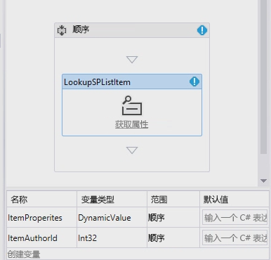
  

  

  

### 收集列表项属性

现在，我们收集列表项属性。
  
    
    

1. 将 **LookupSPListItem** 活动放置在设计图面上，并将 **ListID** 属性设置为 _(current list)_ 以及将 **ItemId** 属性设置为 _(current item)_。 
    
  
2. 现在，将 **Result** 输出设置到我们之前创建的 **ItemProperties** **DynamicValue** 变量。
    
  
3. 若要从变量中获取项的作者，请单击 **LookupSPListItem** 活动中的"获取属性" 链接，并在设计图面上添加 **GetDynamicValueProperties** 活动。
    
  
4. 将项的 **Source** 属性自动设置为 **LookupSPListItem** 活动的输出。
    
  
5. 单击 **Properties** 属性上的"[…]"按钮以显示"属性"对话框。
    
  
6. 将 **Entity Type** 更改为 **List Item of Announcements** 以为对话框提供上下文，并将 **Created By** 路径指定到变量 **ItemAuthorId**，如图 16 所示。
    
   **图 16. "属性"对话框**

  

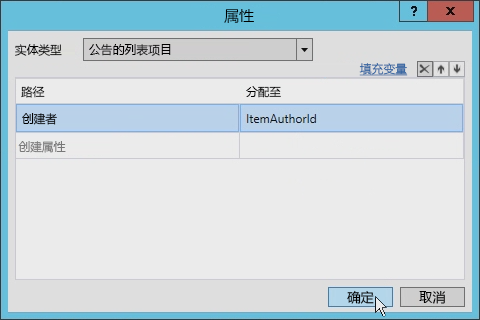
  

  

  

### 创建单个任务

现在，我们可以创建单个任务。 
  
    
    

1. 将 **SingleTask** 活动添加到设计图面。
    
  
2. 单击活动中的"配置"链接以打开"任务选项"对话框。
    
  
3. 将 "正文"字段设置为一些字符串（是哪些字符串并不重要），然后将"Assigned To"属性设置为你用来存储作者标识符的变量（在本例中为 **ItemAuthorId**）。
    
  
4. 更改任务的标题，如图 17 所示。
    
   **图 17. "任务标题"设置**

  

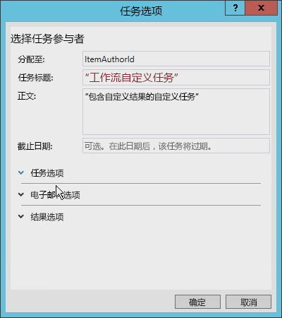
  

  

  
5. 最后，设置"结果选项"以使用新的自定义内容类型和自定义结果列。
    
    该对话框通过查看从 **Workflow Task (SharePoint 2013)** 内容类型派生的所有内容类型来确定哪些可用，如图 18 所示。
    

   **图 18. "结果选项"设置**

  

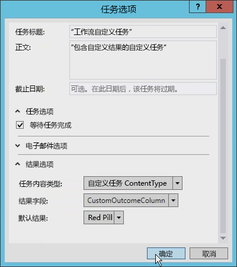
  

  

  

### 更新 AssignedTo 字段

在继续下一步操作前，我们需要更新 **SingleTask** 活动上的 "AssignedTo"字段，因为它应该填写字符串而非整数。要解决此问题，请在表达式结尾处添加 **ToString()**。
  
    
    
同样，请注意 **Outcome** 属性自动创建了名为 **outcome_0** 的变量。要查看该变量的内容，请在设计图面上添加 **WriteToHistory** 活动，并更新消息以写出结果。
  
    
    

### 更新工作流任务列表

最后一步是配置工作流任务列表。默认情况下，应用程序创建的任务列表仅接受内容类型 **Workflow Task (SharePoint 2013)**。该工作流使用用于自定义结果的自定义内容类型。打开用于工作流任务列表的  `Elements.xml` 文件，并更改 **<ContentTypeBinding>** 元素的 **ContentTypeId** 属性以匹配项目中的内容类型，如以下代码示例所示。
  
    
    

```XML

<?xml version="1.0" encoding="utf-8" ?>
<Elements xmlns="http://schemas.microsoft.com/sharepoint/">
  <ListInstance 
      FeatureId="{f9ce21f8-f437-4f7e-8bc6-946378c850f0}"
      TemplateType="171"
      Title="WorkflowTaskList"
      Description="This list instance is used for workflow Task items."
      Url="Lists/WorkflowTaskList"
      RootWebOnly="FALSE" />
  <!-- CustomContentType -->
  <ContentTypeBinding 
      ListUrl="Lists/WorkflowTaskList"
      RootWebOnly="FALSE"
      ContentTypeId="0x0108003365C4474CAE8C42BCE396314E88E51F00D368DFB2B31A447BB184BA1334E5119E"/>
</Elements>
```


### 使用自定义任务结果测试自定义内容任务

现在让我们来测试该工作流。 
  
    
    

1. 在 Visual Studio 2008 中，按"F5"或单击"开始"按钮。如果在本地安装的 SharePoint 2013 上测试，Visual Studio 2008 将启动 工作流管理器 测试服务主机实用程序并将工作流部署到开发人员网站。稍后，开发人员网站将打开。
    
  
2. 导航到"公告"列表并创建新项。然后手动启动自定义工作流。
    
  
3. 接下来，返回到该工作流实例的状态页以查找该工作流创建的任务。
    
  
4. 单击该任务，并使用功能区中的"编辑"按钮切换到编辑模式。表单底部应该有四个按钮。前两个按钮是自定义结果按钮；当它们被按下时，会将任务标记为已完成。后两个按钮是默认的"保存"和"取消"按钮，它们仅更新列表项，而不完成任务，如图 19 所示。
    
   **图 19. 自定义结果按钮**

  

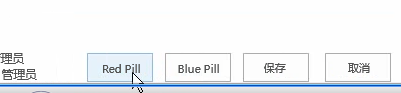
  

  

  

## 结论

Microsoft 将工作流引入 SharePoint 2007 平台，它们在 SharePoint 2010 中在体系结构、实现或过程方面大致没有变化。SharePoint 工作流中的任务也是这种情况。但 SharePoint 2013 的体系结构和实现的工作流中引入了许多变化。
  
    
    
本文讨论了与工作流任务相关的变化，它们由 SharePoint 2013 中工作流概念的变化而引发。它展示了如何使用 Visual Studio 2008 创建利用了 SharePoint 2013 中任务的简单工作流。这些任务类型适合许多开发人员，尽管自定义任务和自定义结果有时较为理想，这可以使用 Visual Studio 2008 实现，如本文所示。
  
    
    

## 其他资源
<a name="bk_addresources"> </a>


-  [SharePoint 2013 中的工作流](http://msdn.microsoft.com/zh-cn/library/jj163986.aspx)
    
  
-  [SharePoint 2013 中应用程序的授权和身份验证](http://msdn.microsoft.com/zh-cn/library/office/fp142384.aspx)
    
  
-  [如何使用客户端呈现来自定义在 SharePoint 相关应用程序中的列表视图](http://msdn.microsoft.com/zh-cn/library/jj220045.aspx)
    
  

