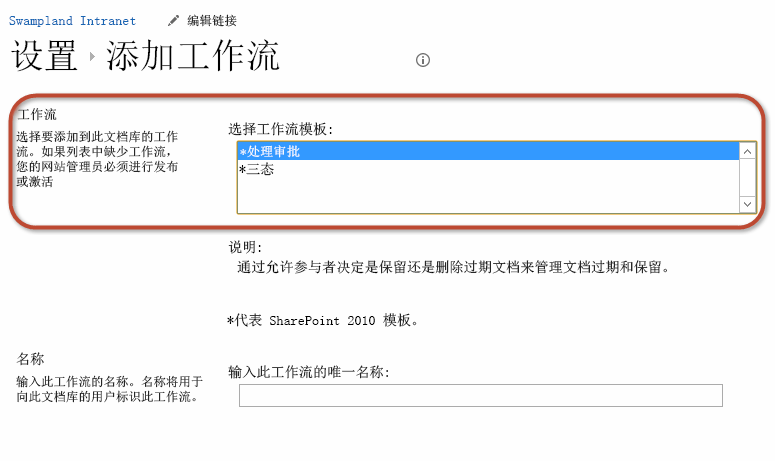
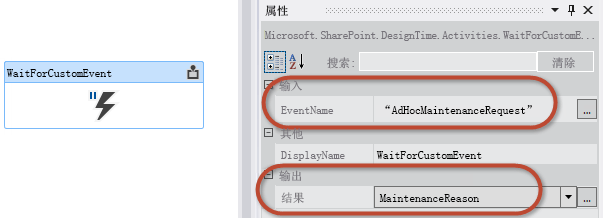

# 使用 SharePoint 2013 工作流服务客户端对象模型
演示如何使用 SharePoint 2013 客户端对象模型 (CSOM) API 创建和控制工作流管理器 1.0 工作流定义和实例。 
 **提供者：** [Andrew Connell](http://social.msdn.microsoft.com/profile/andrew%20connell%20%5bmvp%5d/)， [AndrewConnell.com](http://www.andrewconnell.com)
  
    
    


## 使用 SharePoint 2013 工作流服务客户端对象模型

SharePoint 2007 和 SharePoint 2010 中工作流实施在各版本中仍然基本相同。Microsoft 确实在 SharePoint 2010 中添加了一些新功能（如将工作流与网站关联），并相对于之前版本改进了工作流创作工具（SharePoint Designer 2010 和 Visual Studio 2010）。然而，工作流任务、工作流表单和工作流服务器端 API 的实施仍然基本未变。 
  
    
    
在 SharePoint 2010 中，Microsoft 引入了一些功能，鼓励客户将其自定义项移至 沙盒解决方案 中。这些自定义项将在独立过程中运行，适用于两种 SharePoint 部署类型：本地部署（SharePoint 安装在公司服务器上并由公司维护）和部署到云中（更具体地说是 Office 365）。 
  
    
    
在 SharePoint 2013 中，Microsoft 添加了更多功能；这些更新面向云部署。特别是，Microsoft 引入了新的 SharePoint 应用程序模型，比其中的 沙盒解决方案 更进一步；与 沙盒解决方案 不同，这些模型明确阻止服务器端代码在 SharePoint 过程中运行。Microsoft 还在 SharePoint 中建立了现有技术（如客户端对象模型 (CSOM)），并引入了新功能（如支持使用  [OAuth](http://msdn.microsoft.com/library/office/fp142382.aspx) 的应用程序标识。
  
    
    
此外，通过引入 SharePoint Server 2013，Microsoft 引进了全新的工作流体系结构和平台，反映了产品方向中的根本性转变。 
  
    
    
新体系结构中的最显著变化是 SharePoint 中不再进行 SharePoint Server 2013 中的工作流执行。相反，SharePoint Server 2013 采用了全新的执行引擎：工作流管理器 1.0。工作流管理器托管 Windows Workflow Foundation 运行时和 Windows Workflow Foundation 要求的所有必要服务。发布工作流或启动已发布工作流的新实例后，SharePoint 通知工作流管理器，反过来又处理工作流场景。当工作流在 SharePoint 中访问信息（如列表项属性或用户属性）时，它使用 OAuth 支持进行身份验证并通过改进的新 REST API 进行通信。
  
    
    
工作流体系结构中的这些更改在某些方面有着重要影响（如自定义工作流表单），如 MSDN 文章"如何：使用 Visual Studio 2012 创建自定义 SharePoint Server 2013 工作流表单"中所述。本文涉及了 Microsoft 添加到 SharePoint 2013 以支持创建自定义工作流表单的新样式的内容之一：CSOM 改进和添加工作流服务 CSOM API。
  
    
    

## SharePoint 2013 中工作流服务 CSOM API 简介

在 SharePoint 2007 和 SharePoint 2010 中，工作流 API 仅会在服务器端对象模型中表明。在 SharePoint 2013 中，此相同工作流 API 仍然存在，因为 SharePoint 2013 在 SharePoint 中添加了旧的工作流执行引擎，以便向后兼容。 
  
    
    
然而，采用工作流管理器的 SharePoint 2013 引入了新的首选工作流体系结构，其中包含全新的服务器端 API。在 SharePoint 2013 中，Microsoft 对 CSOM 进行了扩展，添加了针对新工作流体系结构的可靠 API。请注意，对 CSOM 的这项添加仅适用于新的 SharePoint 2013 和 工作流管理器 1.0 工作流体系结构，而不适用于仍然由 SharePoint 托管的旧版本。
  
    
    
工作流服务 CSOM API 与 CSOM 其余部分类似，同时在 .NET Silverlight 托管 API 和 JavaScript API（称为 JavaScript 对象模型 (JSOM)）中实施。JSOM 是开发人员在创建自定义工作流表单时必须使用的模型，因为这些表单将成为 ASP.NET Web 表单，不能有任何服务器端代码。因此，在自定义关联表单中使用工作流服务 JSOM API 以创建工作流关联，此外还用于启动表单以启动新的工作流实例。
  
    
    
然而，可能性还不止于此。工作流服务 CSOM 和 JSOM 非常可靠，让开发人员能够通过 SharePoint 2013 中的工作流进行几乎一切操作。除了创建工作流关联和实例，开发人员还可以以编程方式部署新的工作流定义，甚至与通过 CSOM 和 JSOM 与运行工作流实例进行通信，如本文其余部分所述。
  
    
    
本文重点介绍 SharePoint Sever 2013 环境中工作流表单的主题。文章基于应用了 2013 年 3 月公开更新的 SharePoint Server 2013 和 Visual Studio 2013 Office 开发人员工具。本文中的所有内容都适用于 SharePoint Server 2013 本地部署及 Office 365。
  
    
    

## 工作流服务 CSOM 和 JSOM API 组件

本文重点介绍工作流服务 CSOM API ，进而也扩展到 JSOM API；这里未讨论服务器端工作流服务 API。工作流服务 CSOM 包含用于执行不同任务的若干个不同服务。以下部分对每种服务进行了讨论。 
  
    
    

> **注释**
> 还有另外一种服务未出现在 CSOM 中，但使用服务器端 API 来替代。该服务为消息服务，用于管理消息队列和消息传输。 
  
    
    

为了使用工作流服务 CSOM 和 JSOM API，开发人员必须向其项目（如果是 CSOM）和页面（如果是 JSOM）添加必要引用。两种实施具有相同要求：
  
    
    

- 引用核心 SharePoint 2013 CSOM 和 JSOM 库：
    
  - Microsoft.SharePoint.Client.dll
    
  
  - Microsoft.SharePoint.Client.Runtime.dll
    
  
  - Microsoft.SharePoint.Client.WorkflowServices.dll
    
  

- 引用工作流服务 CSOM 和 JSOM 库：
    
  - SP.js
    
  
  - SP.Runtime.js
    
  
  - SP.WorkflowServices.js
    
  

### 工作流服务管理器

访问包含在工作流服务 CSOM API 中的所有服务的网关是工作流服务管理器。开发人员使用此对象获取以下部分中所述的其他所有服务的实例。与其他 CSOM API 实施类似， [WorkflowServicesManager](https://msdn.microsoft.com/library/Microsoft.SharePoint.WorkflowServices.WorkflowServicesManager.aspx) 依赖于核心 SharePoint 2013 CSOM，因此您必须传入有效客户端上下文和对想要连接到的 SharePoint 网站的引用，如以下 CSOM 和 JSOM 代码示例所示。
  
    
    

#### CSOM：创建 WorkflowServicesManager 实例


```

var clientContext = new ClientContext(siteCollectionUrl);
var workflowServicesManager = new WorkflowServicesManager(clientContext, clientContext.Web); 

```


#### JSOM：创建 WorkflowServicesManager 实例


```

var clientContext = SP.ClientContext.get_current();
var workflowServicesManager = SP.WorkflowServices.WorkflowServicesManager.newObject(context, context.get_web()); 

```


### 部署服务

当您使用 Visual Studio 2008 创建自定义工作流时（使用解决方案包 (*.wsp) 或作为 SharePoint 应用程序 (*.app)），您是在创建工作流定义。定义是工作流过程及在其中规定的所有业务规则和属性，如自定义关联和启动表单的位置。就定义本身而言，它们没有太大作用，因为无法在与网站、列表或文档库关联的上下文以外运行。已发布且在网站中可用的工作流定义可通过访问可新建工作流关联的页面找到，如下图所示。
  
    
    

**图 1. 添加工作流关联**

  
    
    

  
    
    

  
    
    
已发布工作流定义的集合可通过部署服务访问。通过此服务，您可以获取网站上所有当前保存并发布的定义的列表，以及发布保存的和新的定义、删除现有定义和确定适用于使用 SharePoint Designer 2013 创作的工作流的工作流操作。
  
    
    
 **WorkflowDeploymentService** 对象可通过 **WorkflowServicesManager** 类获取，如以下代码示例所示。
  
    
    

#### CSOM：获取 WorkflowDeploymentService 实例


```

var clientContext = new ClientContext(siteCollectionUrl);
var workflowServicesManager = new WorkflowServicesManager(clientContext, clientContext.Web);
var workflowDeploymentService = workflowServicesManager.GetWorkflowDeploymentService(); 

```


#### JSOM：获取 WorkflowDeploymentService 实例


```

var clientContext = SP.ClientContext.get_current();
var workflowServicesManager = SP.WorkflowServices.WorkflowServicesManager.newObject(context, context.get_web()); 
var workflowDeploymentService = workflowServicesManager.getWorkflowDeploymentService();

```


### 订阅服务

回顾之前的部分，您按定义创建工作流并将其发布到 SharePoint。若要使用这些定义，用户必须创建关联以将定义链接至特定 SharePoint 网站、列表或文档库及其他元数据。此过程与 SharePoint 2010 中的工作和操作方式基本相同，但与 SharePoint 2013 中的实施大为不同。工作流管理器 1.0 利用 Microsoft Azure 服务总线 1.0 的实例。
  
    
    
服务总线很有帮助，因为它支持发布和订阅服务（也称为 PubSub）。PubSub 是一个异步消息框架，支持发布者向存储在服务总线中的主题发送消息。任意数量的订阅者都可以请求在有消息发送到符合特定标准的主题时收到通知。 
  
    
    
SharePoint 2013 和工作流管理器 1.0 使用 PubSub 模型创建关联。工作流关联创建为对主题的订阅。例如，工作流定义的关联可能创建在列表上，并设置为在向列表添加项目时自动启动。当向列表添加项目时，SharePoint 向工作流管理器 1.0 发布一个事件，并发送到服务总线主题。系统对消息进行评估，并且注册的订阅收到事件通知。找到订阅的关联，并启动工作流。有关此过程如何工作的详细信息，请参阅 MSDN 文章  [SharePoint 2013 工作流基础](sharepoint-2013-workflow-fundamentals.md)。 
  
    
    
这应该会阐明为何工作流关联现在在 API 中（即，在内部）称为订阅。您可以使用工作流服务 CSOM 中的订阅服务来浏览现有关联和订阅，创建和删除关联和订阅，以及请求收到事件通知。
  
    
    
 [WorkflowSubscriptionService](https://msdn.microsoft.com/library/Microsoft.SharePoint.WorkflowServices.WorkflowSubscriptionService.aspx) 对象可通过 **WorkflowServicesManager** 类获取，如以下代码示例所示。
  
    
    

#### CSOM：获取 WorkflowSubscriptionService 实例


```

var clientContext = new ClientContext(siteCollectionUrl);
var workflowServicesManager = new WorkflowServicesManager(clientContext, clientContext.Web);
var workflowSubscriptionService = workflowServicesManager.GetWorkflowSubscriptionService();

```


#### JSOM：获取 WorkflowSubscriptionService 实例


```

var clientContext = SP.ClientContext.get_current();
var workflowServicesManager = SP.WorkflowServices.WorkflowServicesManager.newObject(context, context.get_web()); 
var workflowSubscriptionService = workflowServicesManager.getWorkflowSubscriptionService();

```


### 实例服务

我们将涉及的最后一项服务是实例服务。通过此服务，您可以使用工作流实例执行一些任务，如启动、暂停、恢复、终止和取消工作流实例。您还可以使用此服务收集调试信息，以及枚举所有当前运行的工作流和已完成的工作流。最后，您可以使用此服务将事件发布到当前运行的工作流，我们将在本文后面部分看到。
  
    
    
 [WorkflowInstanceService](https://msdn.microsoft.com/library/Microsoft.SharePoint.WorkflowServices.WorkflowInstanceService.aspx) 对象可通过 **WorkflowServicesManager** 类获取，如以下代码示例所示。
  
    
    

#### CSOM：获取 WorkflowInstanceService 实例


```

var clientContext = new ClientContext(siteCollectionUrl);
var workflowServicesManager = new WorkflowServicesManager(clientContext, clientContext.Web);
var workflowInstanceService = workflowServicesManager.GetWorkflowInstanceService();

```


#### JSOM：获取 WorkflowInstanceService 实例


```

var clientContext = SP.ClientContext.get_current();
var workflowServicesManager = SP.WorkflowServices.WorkflowServicesManager.newObject(context, context.get_web()); 
var workflowInstanceService = workflowServicesManager.getWorkflowInstanceService();

```


### 互操作服务

在 SharePoint 的之前版本中，特别是 SharePoint 2007 和 SharePoint 2010，SharePoint 托管 Windows Workflow Foundation 运行时。如前所述，Microsoft 通过引入对工作流管理器 1.0 的依赖放弃了 SharePoint 2013 中的此方法，此产品将工作流运行时托管在 SharePoint 以外。因此，SharePoint 中不再执行和管理工作流；相反，SharePoint 将工作流管理和执行责任转给工作流管理器 1.0。
  
    
    
然而，为了提供向后兼容，Microsoft 通过保留 Windows Workflow Foundation 运行时引擎，在 SharePoint 中保留了托管 SharePoint 2013 之前样式工作流的旧模型。因此，在 SharePoint 2010 中创建的所有工作流将仍按预期在 SharePoint 2013 环境中运行。此外，Microsoft 包含一个新活动 **InvokeSharePointWorkflow**，可用于 SharePoint 2013 工作流以在包含在 SharePoint 2013 中的 SharePoint 2010 工作流主机启动现有工作流。这样，您可以利用从之前版本迁移的现有工作流投资。
  
    
    

> **注释**
> **InvokeSharePointWorkflow** 活动是 CSOM 方法 [StartWorkflow](https://msdn.microsoft.com/library/Microsoft.SharePoint.Client.WorkflowServices.InteropService.StartWorkflow.aspx) 的包装。
  
    
    

SharePoint 2013 工作流服务 CSOM 还包含一种特殊服务，开发人员可通过该服务与那些旧工作流进行交互。通过  [InteropService](https://msdn.microsoft.com/library/Microsoft.SharePoint.Client.WorkflowServices.InteropService.aspx) ，您可以启动和停止工作流，以及启用和停用运行工作流的事件通知。
  
    
    
 [WorkflowDeploymentService](https://msdn.microsoft.com/library/Microsoft.SharePoint.Client.WorkflowServices.WorkflowDeploymentService.aspx) 对象可通过 **WorkflowServicesManager** 类获取，如以下 CSOM 和 JSOM 代码示例所示。
  
    
    

#### CSOM：获取 InteropService 实例


```

var clientContext = new ClientContext(siteCollectionUrl);
var workflowServicesManager = new WorkflowServicesManager(clientContext, clientContext.Web);
var workflowInteropService = workflowServicesManager.GetWorkflowInteropService();

```


#### JSOM：获取 InteropService 实例


```

var clientContext = SP.ClientContext.get_current();
var workflowServicesManager = SP.WorkflowServices.WorkflowServicesManager.newObject(context, context.get_web()); 
var workflowInteropService = serviceManager.getWorkflowInteropService();

```


## 示例：工作流服务 CSOM 方案

以下部分演示了如何使用工作流服务 CSOM 中的不同服务以执行自定义解决方案中的常见任务。 
  
    
    

### 安装所有工作流

工作流服务 CSOM 中的其他大部分服务都需要您引用之前发布的工作流定义。通常按工作流定义的 ID 进行引用，即 GUID。 
  
    
    
若要获取所有已发布工作流定义的列表，请首先通过使用  [GetWorkflowDeploymentService](https://msdn.microsoft.com/library/Microsoft.SharePoint.Client.WorkflowServices.WorkflowServicesManager.GetWorkflowDeploymentService.aspx) 方法获取部署服务的实例。然后，通过使用 [EnumerateDefinitions(Boolean)](https://msdn.microsoft.com/library/Microsoft.SharePoint.Client.WorkflowServices.WorkflowDeploymentService.EnumerateDefinitions.aspx) 方法检索所有工作流定义的集合。以下是示例代码：
  
    
    


```

// connect to the workflow services via a CSOM client context
var clientContext = new ClientContext(siteCollectionUrl);
var workflowServicesManager = new WorkflowServicesManager(clientContext, clientContext.Web);

// connect to the deployment service 
var workflowDeploymentService = workflowServicesManager.GetWorkflowDeploymentService();

// get all installed workflows
var publishedWorkflowDefinitions = workflowDeploymentService.EnumerateDefinitions(true);
clientContext.Load(publishedWorkflowDefinitions);
clientContext.ExecuteQuery();

// display list of all installed workflows
foreach (var workflowDefinition in publishedWorkflowDefinitions) {
  Console.WriteLine("{0} - {1}", workflowDefinition.Id.ToString(), workflowDefinition.DisplayName);
}

```


### 获取所有关联和订阅

若要启动新工作流实例，您需要首先获取对现有工作流关联的引用。以下示例建立在之前代码示例的基础上，演示了如何获取网站中特定工作流定义的所有工作流关联的列表。 
  
    
    
使用以上示例获取工作流定义后，使用  [GetWorkflowSubscriptionService](https://msdn.microsoft.com/library/Microsoft.SharePoint.Client.WorkflowServices.WorkflowServicesManager.GetWorkflowSubscriptionService.aspx) 方法创建订阅服务的实例。接下来，使用 [EnumerateSubscriptionsByDefinition](https://msdn.microsoft.com/library/Microsoft.SharePoint.Client.WorkflowServices.WorkflowSubscriptionService.EnumerateSubscriptionsByDefinition.aspx) 方法（传入工作流定义的 ID）获取特定工作流中存在的所有关联的列表。请注意，可通过几种方法获取工作流关联，包括：
  
    
    

-  [EnumerateSubscriptions](https://msdn.microsoft.com/library/Microsoft.SharePoint.Client.WorkflowServices.WorkflowSubscriptionService.EnumerateSubscriptions.aspx)
    
  
-  [EnumerateSubscriptionsByDefinition](https://msdn.microsoft.com/library/Microsoft.SharePoint.Client.WorkflowServices.WorkflowSubscriptionService.EnumerateSubscriptionsByDefinition.aspx)
    
  
-  [EnumerateSubscriptionsByEventSource](https://msdn.microsoft.com/library/Microsoft.SharePoint.Client.WorkflowServices.WorkflowSubscriptionService.EnumerateSubscriptionsByEventSource.aspx)
    
  
-  [EnumerateSubscriptionsByList](https://msdn.microsoft.com/library/Microsoft.SharePoint.Client.WorkflowServices.WorkflowSubscriptionService.EnumerateSubscriptionsByList.aspx)
    
  
以下代码示例演示了获取关联和订阅。
  
    
    


```

// connect to the workflow services via a CSOM client context
var clientContext = new ClientContext(siteCollectionUrl);
var workflowServicesManager = new WorkflowServicesManager(clientContext, clientContext.Web);

// connect to the deployment service
var workflowDeploymentService = workflowServicesManager.GetWorkflowDeploymentService();

// get all installed workflows
var publishedWorkflowDefinitions = workflowDeploymentService.EnumerateDefinitions(true);
clientContext.Load(publishedWorkflowDefinitions);
clientContext.ExecuteQuery();

// find the first workflow definition
var firstWorkflowDefinition = publishedWorkflowDefinitions.First();

// connect to the subscription service
var workflowSubscriptionService = workflowServicesManager.GetWorkflowSubscriptionService();

// get all workflow associations
var workflowAssociations = workflowSubscriptionService.EnumerateSubscriptionsByDefinition(firstWorkflowDefinition.Id);
clientContext.Load(workflowAssociations);
clientContext.ExecuteQuery();

foreach (var association in workflowAssociations) {
  Console.WriteLine("{0} - {1}",
    association.Id, association.Name);
}

```


### 创建工作流关联

创建新工作流关联（也可以称为订阅）需要进行一些额外工作才能将关联实际发布到 SharePoint 中。这是因为每次订阅都需要额外的信息，通常在关联页面上收集。此元数据包含以下内容：
  
    
    

- 关联所基于的工作流定义的 ID。
    
  
- 创建工作流关联所在的 SharePoint 网站、列表或文档库的 ID。
    
  
- 关联的显示名称。 
    
  
- 启动选项（添加或更新列表项时是手动启动还是自动启动）。
    
  
- 存储此关联的所有历史记录列表消息的列表的 ID。
    
  
- 存储此关联的所有任务的列表的 ID。
    
  
- 或者，应将所有名称/值对的集合发送到工作流。这些通常是从自定义关联表单传入的字段。
    
  

### 创建自定义工作流关联


1. 若要创建自定义关联，请首先使用  [GetWorkflowSubscriptionService](https://msdn.microsoft.com/library/Microsoft.SharePoint.Client.WorkflowServices.WorkflowServicesManager.GetWorkflowSubscriptionService.aspx) 方法获取对订阅服务的引用。
    
  ```
  
// connect to the deployment service
var workflowDeploymentService = workflowServicesManager.GetWorkflowDeploymentService();

// get all installed workflows
var publishedWorkflowDefinitions = workflowDeploymentService.EnumerateDefinitions(true);
clientContext.Load(publishedWorkflowDefinitions);
clientContext.ExecuteQuery();

// find the first workflow definition
var firstWorkflowDefinition = publishedWorkflowDefinitions.First();

// connect to the subscription service
var workflowSubscriptionService = workflowServicesManager.GetWorkflowSubscriptionService();

  ```

2. 创建  [WorkflowSubscription](https://msdn.microsoft.com/library/Microsoft.SharePoint.Client.WorkflowServices.WorkflowSubscription.aspx) 类的新对象实例。
    
  
3. 按以下代码示例所述，为 **WorkflowSubscription** 对象设置所需属性。在示例中，代码注释说明了每种属性设置。请注意，为了可读性，与 CSOM 工作流服务不相关的一些属性已排除在外。已省略以下属性：
    
1. **listId**。创建关联所在列表的 ID。
    
  
2. **historyListId**。存储关联的所有历史记录列表消息的列表的 ID。
    
  
3. **taskListId**。存储关联的所有任务的列表的 ID。
    
  
4. 创建关联后，必须使用  [PublishSubscriptionForList](https://msdn.microsoft.com/library/Microsoft.SharePoint.Client.WorkflowServices.WorkflowSubscriptionService.PublishSubscriptionForList.aspx) 方法将其发布到 SharePoint，如以下代码示例所示：
    
  ```
  
// create a new association / subscription
WorkflowSubscription newSubscription = new WorkflowSubscription(clientContext) {
  DefinitionId = firstWorkflowDefinition.Id,
  Enabled = true,
  Name = "New Workflow Association"
};


var startupOptions = new List<string>();
// automatic start
startupOptions.Add("ItemAdded");
startupOptions.Add("ItemUpdated");
// manual start
startupOptions.Add("WorkflowStart");

// set the workflow start settings
newSubscription.EventTypes = startupOptions;


// set the associated task and history lists
newSubscription.SetProperty("HistoryListId", workflowHistoryListId.ToString());
newSubscription.SetProperty("TaskListId", workflowTaskListId.ToString());

// OPTIONAL: add any association form values
newSubscription.SetProperty("Prop1","Value1");
newSubscription.SetProperty("Prop2","Value2");

// create the association
workflowSubscriptionService.PublishSubscriptionForList(newSubscription, listId);
clientContext.ExecuteQuery();

  ```


### 获取所有工作流实例

您还可以使用工作流实例服务查看 SharePoint 网站、列表或文档库中运行的所有工作流实例。返回的实例对象包含关于实例的信息，如最后更新的时间、当前状态和以前运行中可能发生的任何错误。此外，实例对象提供了通过自定义启动表单提交到工作流的名称/值对的集合。
  
    
    
为此，请通过使用  [GetWorkflowInstanceService](https://msdn.microsoft.com/library/Microsoft.SharePoint.Client.WorkflowServices.WorkflowServicesManager.GetWorkflowInstanceService.aspx) 方法启动，以获取对实例服务的引用。请注意， [WorkflowInstanceService](https://msdn.microsoft.com/library/Microsoft.SharePoint.Client.WorkflowServices.WorkflowInstanceService.aspx) 针对获取运行工作流实例的集合提供了几种方法：
  
    
    

-  [Enumerate](https://msdn.microsoft.com/library/Microsoft.SharePoint.Client.WorkflowServices.WorkflowInstanceService.Enumerate.aspx) 。接受参数形式的工作流关联（即，订阅），并且可以用于获取基于指定关联创建的所有实例。
    
  
-  [EnumerateInstancesForSite](https://msdn.microsoft.com/library/Microsoft.SharePoint.Client.WorkflowServices.WorkflowInstanceService.EnumerateInstancesForSite.aspx) ：获取在 SharePoint 网站上启动的所有工作流实例的列表，该网站是在创建原始 **WorkflowServiceManager** 对象时设置。
    
  
-  [EnumerateInstancesForListItem](https://msdn.microsoft.com/library/Microsoft.SharePoint.Client.WorkflowServices.WorkflowInstanceService.EnumerateInstancesForListItem.aspx) 。接受列表 ID 和项目 ID；使用此方法可获取在特定列表项上创建的所有工作流实例。
    
  
每种方法都有一个替代 ***WithOffset()** 方法（例如， [EnumerateWithOffset](https://msdn.microsoft.com/library/Microsoft.SharePoint.Client.WorkflowServices.WorkflowInstanceService.EnumerateWithOffset.aspx) ）。通过这些替代方法，在使用整个集合会很麻烦的情况下，您可以获取工作流实例的子集。若要获取工作流实例的数量计数，请使用 [CountInstances](https://msdn.microsoft.com/library/Microsoft.SharePoint.Client.WorkflowServices.WorkflowInstanceService.CountInstances.aspx) 方法或 [CountInstancesWithStatus](https://msdn.microsoft.com/library/Microsoft.SharePoint.Client.WorkflowServices.WorkflowInstanceService.CountInstancesWithStatus.aspx) 方法。
  
    
    
以下代码示例说明了获取工作流实例：
  
    
    


```

// connect to the instance service
var workflowInstanceService = workflowServicesManager.GetWorkflowInstanceService();

// get all instances
var workflowInstances = workflowInstanceService.EnumerateInstancesForListItem(listId, listItemId);
foreach (var instance in workflowInstances)
{
  Console.WriteLine("{0} - {1} - {2}",
                    instance.Id.ToString(),
                    instance.LastUpdated,
                    instance.Status.ToString());
}
```


### 启动工作流实例

启动工作流关联的新实例涉及重复之前示例中演示的大量步骤。若要启动列表或文档库中项目上的工作流，首先获取对工作流关联和列表中项目 ID 的引用。工作流启动后，可能会向其发送信息的名称/值对的集合。在使用自定义启动表单从用户启动工作流收集数据时，会出现此情况。然后，当启动工作流或工作流启动失败并返回错误时，传入一个集合，即使是空集合。
  
    
    
基于之前的示例构建，使用  [GetWorkflowInstanceService](https://msdn.microsoft.com/library/Microsoft.SharePoint.Client.WorkflowServices.WorkflowServicesManager.GetWorkflowInstanceService.aspx) 方法获取工作流实例服务的实例。接下来，通过调用两种方法之一启动工作流。一种方法在网站上启动工作流，而另一种方法在列表项上启动工作流。
  
    
    

-  [StartWorkflow](https://msdn.microsoft.com/library/Microsoft.SharePoint.Client.WorkflowServices.WorkflowInstanceService.StartWorkflow.aspx) 。在 SharePoint 网站上启动工作流，该网站是在创建原始 [WorkflowServicesManager](https://msdn.microsoft.com/library/Microsoft.SharePoint.Client.WorkflowServices.WorkflowServicesManager.aspx) 对象时设置。使用此方法时，您必须传入工作流关联和启动表单中存在的其他任何启动属性。
    
  
-  [StartWorkflowOnListItem](https://msdn.microsoft.com/library/Microsoft.SharePoint.Client.WorkflowServices.WorkflowInstanceService.StartWorkflowOnListItem.aspx) 。在特定列表项上启动工作流。使用此方法时，您需要传入所需列表项的 ID，还有 **StartWorkflow** 方法需要的其他参数值。
    
  
以下代码示例演示了如何启动工作流实例。
  
    
    


```

// connect to the deployment service
var workflowDeploymentService = workflowServicesManager.GetWorkflowDeploymentService();

// get all installed workflows
var publishedWorkflowDefinitions = workflowDeploymentService.EnumerateDefinitions(true);
clientContext.Load(publishedWorkflowDefinitions);
clientContext.ExecuteQuery();

// find the first workflow definition
var firstWorkflowDefinition = publishedWorkflowDefinitions.First();

// connect to the subscription service
var workflowSubscriptionService = workflowServicesManager.GetWorkflowSubscriptionService();

// get all workflow associations
var workflowAssociations = workflowSubscriptionService.EnumerateSubscriptionsByDefinition(firstWorkflowDefinition.Id);
clientContext.Load(workflowAssociations);
clientContext.ExecuteQuery();

// find the first association
var firstWorkflowAssociation = workflowAssociations.First();

// connect to the instance service
var workflowInstanceService = workflowServicesManager.GetWorkflowInstanceService();

// start the workflow
var startParameters = new Dictionary<string, object>();
workflowInstanceService.StartWorkflowOnListItem(firstWorkflowAssociation, listItemId, startParameters);
clientContext.ExecuteQuery();

```


### 发布消息和事件以运行工作流

SharePoint 2013 中添加的另一个强大功能是发布自定义事件以运行工作流实例的能力。这些工作流可能包含活动 **WaitForCustomEvent**，该活动监听要发布到工作流的特定事件。事件也可以包含一个字符串作为消息的一部分，活动可以将其存储为变量。
  
    
    
若要使用工作流服务 CSOM 发布客户端的事件，首先获取对事件应发布到的特定工作流实例的引用。然后，通过实例服务，使用  [PublishCustomEvent](https://msdn.microsoft.com/library/Microsoft.SharePoint.Client.WorkflowServices.WorkflowInstanceService.PublishCustomEvent.aspx) 方法发布事件。使用此方法时，您必须传入所需的实例、事件名称和可选有效负载，如以下代码示例所示。
  
    
    


```

// connect to the instance service
var workflowInstanceService = workflowServicesManager.GetWorkflowInstanceService();

// get all instances
var workflowInstances = workflowInstanceService.EnumerateInstancesForListItem(listId, listItemId);

var targetInstance = workflowInstances.First();

// publish custom event
instanceService.PublishCustomEvent(targetInstance, "AdHocMaintenanceRequest", "Flat Tire");
clientContext.ExecuteQuery();
```

若要在工作流中接收消息，请添加 **WaitForCustomEvent** 活动并使用"属性"窗口将 **EventName** 属性设置为活动监听的事件的名称（在以上示例中，该名称为字符串"AdHocMaintenanceRequest"）。然后，将 **Result** 属性设置为存储事件有效负载的变量，如图 2 所示。
  
    
    

**图 2. 输入 EventName 和输出结果**

  
    
    

  
    
    

  
    
    
这项发布自定义事件的技术在 MSDN 代码示例中进行了演示：SharePoint 2013：根据操作和事件将工作流传送到各状态。
  
    
    

## 结论

Microsoft 向 SharePoint 2007 平台引入了工作流，SharePoint 2010 中的工作流平台基本保持不变。对于 SharePoint 工作流中的自定义表单同样如此。另一方面，SharePoint 2013 向工作流平台和体系结构引入了大量更改。
  
    
    
对 SharePoint 2013 中工作流的主要改进之一是扩展了 CSOM 以包含完整的工作流服务 API。通过这项添加，开发人员可以与工作流定义、关联和订阅进行交互，并创建这些工作流的实例且与之交互。
  
    
    

## 其他资源
<a name="bk_addresources"> </a>


-  [SharePoint 2013 中的工作流](http://msdn.microsoft.com/zh-cn/library/jj163986.aspx)
    
  
-  [什么是 Workflow Manager 1.0？](http://msdn.microsoft.com/zh-cn/library/windowsazure/jj193471%28v=azure.10%29.aspx)
    
  

