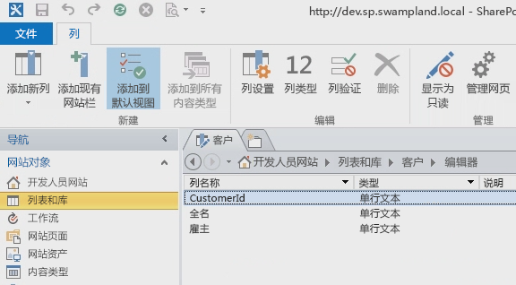
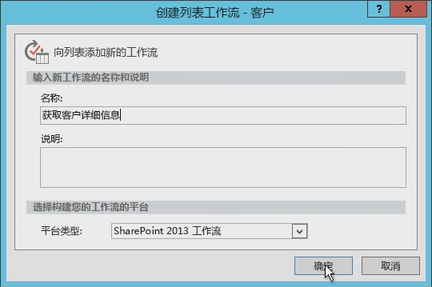
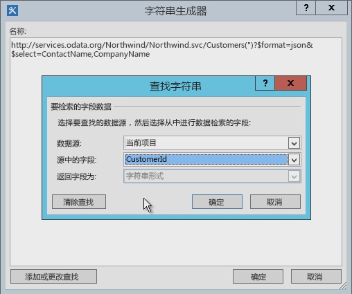
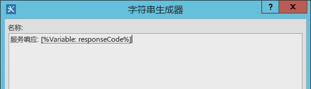
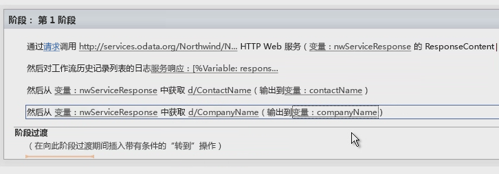
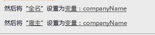

# 在 SharePoint Designer 2013 中使用 SharePoint 2013 工作流中的 Web 服务
演示如何在 SharePoint Designer 2013 工作流中使用 Web 服务。 
 **提供者：** [Andrew Connell](http://social.msdn.microsoft.com/profile/andrew%20connell%20%5bmvp%5d/)， [www.AndrewConnell.com](http://www.andrewconnell.com)
  
    
    

Microsoft 对 SharePoint Server 2013 中的工作流采取全新的方法。工作流团队与 Microsoft Azure 团队合作开发了一款名为 工作流管理器 的新产品。工作流管理器 充当 Windows Workflow Foundation 运行时最新版的主机，并提供所有必要的服务，同时利用 Microsoft Azure Service Bus 增强性能和可伸缩性。部署后，它将运行相同功能，不论是在内部部署中还是部署到云中。重要的是，SharePoint 2013 将所有工作流执行和相关任务都转移给了 SharePoint 2013 外部的 工作流管理器 服务器场。
对工作流体系结构一个较大的修改是，现在所有工作流均以声明方式在设计器界面上创作，包括使用 Visual Studio 2008 构建的工作流。在 SharePoint 的之前版本中，使用 Visual Studio 2008 开发的工作流并非独占声明。相反，它们是声明性 XAML 以及包含工作流业务逻辑的编译程序集的混合。
  
    
    

对于过去已使用 SharePoint Designer 创建工作流的客户，这并不新鲜。使用 SharePoint Designer 创作的工作流已经完全为声明性。但是，因为 SharePoint Designer 2013 工作流现在支持调用和使用 Web 服务，这一变化对使用 SharePoint Designer 2013 创建工作流的客户并无益处。
## 为什么 Web 服务对 SharePoint 2013 工作流至关重要

首先，我们来了解一下在哪些场景中使用 Web 服务有意义。在 SharePoint 2007 或 SharePoint 2010 的世界，使用 Visual Studio 创作工作流时通常需要编写自定义代码，因为这是执行计算或实施自定义业务逻辑的最佳办法。只要您遇到现成操作和活动不满足您需求的情况，您就可以在托管程序集中回退到自定义代码。
  
    
    
另一方面，对于 SharePoint Designer 2013 的非开发人员用户，这就没有那么简单。但您遇到无法处理现有工作流操作的用例时，您必须致电开发人员编写自定义操作。通常这很难，因为他们只能创建沙盒的代码（在托管环境中），或只能使用完全信任的解决方案（在内部部署中）。在其他情况下，工作流必须完全交给开发人员，以构建为完全信任的解决方案，因为您需要的无法在 SharePoint Designer 中实现。
  
    
    
好消息是：在 SharePoint 2013 的世界，当 SharePoint Designer 2013 缺少您需要的操作时，您只需创建自定义 Web 服务即可。创建自定义 Web 服务比创建自定义操作简单的多。不仅如此，自定义操作只能在其安装所在的工作流中使用（或者最好仅由 SharePoint 工作流使用），而自定义 Web 服务是可移植的，可供任意数量的客户使用。
  
    
    
也许最重要的是，在您需要访问某个现有 Web 服务时 - 可能是公共 Web 服务，也可能是由贵公司托管的专用 Web 服务 - SharePoint Designer 2013 现在提供了一个用于调用 Web 服务的操作。当您需要调用现有 Web 服务时，无需再依赖于开发人员。
  
    
    
SharePoint 2013 可以使用任何类型的 Web 服务，但使用通过  [Atom](http://msdn.microsoft.com/zh-cn/library/ff478141.aspx) 或 [JSON](http://json.org/)（JavaScript 对象标记）的标准  [OData](http://www.odata.org/) 格式接受和返回数据的 Web 服务最为简单。
  
    
    
此建议基于它们支持 SharePoint 2013 工作流创作工具（SharePoint Designer 2013 和 Visual Studio 2008）中的 OData 格式。这两个工具支持构建要提交到服务的有效负载，并处理 Web 服务返回的响应。此外，OData 格式支持与匿名 Web 服务的通信，以及使用各种类型的身份验证保护的通信。简而言之，您可完全控制每个服务调用的请求和响应。这允许您使用工作流内的一系列活动，以便首先使用一个服务进行身份验证并获取 OAuth 令牌，然后将该令牌包含在将来对使用  [OAuth 2.0](http://oauth.net/2/) 协议保护的服务的请求中。
  
    
    

## 在 SharePoint 工作流中利用 Web 服务

使用 SharePoint 2013 从工作流调用 Web 服务分为两个阶段：首先调用 Web 服务，然后与该 Web 服务交换数据。
  
    
    
在 SharePoint 2013 工作流中，您使用 SharePoint 2013 中引入的一个名为 **Call HTTP Web Service** 的新操作调用 Web 服务。该操作非常灵活，且允许您对 Web 服务轻松地发起简单调用，或者如果需要，您还可以使用 HTTP 动词创建更复杂的调用，并且可以添加 HTTP 标头。图 1 显示了 SharePoint Designer 2013 界面上的 **Call HTTP Web Service** 操作。
  
    
    

**图 1. 显示"调用 HTTP Web 服务"操作的 SharePoint Designer 2013 阶段**

  
    
    

  
    
    

  
    
    
通过 **Call HTTP Web Service** 操作，您可以指定多种请求方法中的任一种，包括 **GET**、 **PUT**、 **POST** 和 **DELETE**。这样，您就可以通知 Web 服务（特别是  [RESTful](https://msdn.microsoft.com/zh-cn/library/office/jj164022.aspx) 服务）对您在活动上使用 URI 属性指定的服务应执行哪些操作。
  
    
    
例如，要获取某个特定项目的所有属性，服务 URL 应包含该项目的唯一地址，且您应将方法设置为 **GET**。要删除该项目，流程相同，只是您应将方法设置为 **DELETE**。这同样适用于更新项目，只是您应将方法设置为 **POST**。创建项目时，将 URL 设置为要在其中创建项目的集合的唯一地址，然后将方法设置为 **POST**。创建或更新项目时，服务通常需要使用您作为内容在请求中传递的数据，然后使用 **Call HTTP Web Service** 操作的 **request** 属性进行指示。
  
    
    
使用 Web 服务的第二个阶段包括将数据提交到 Web 服务以及从中接收数据，您可使用 **Call HTTP Web Service** 操作的 **request** 或 **response** 属性执行此操作。但是请注意，数据使用 [DynamicValue](https://msdn.microsoft.com/library/azure/microsoft.activities.dynamicvalue%28v=azure.10%29.aspx) 对象作为复杂结构传递，而不是作为流传递。（有关动态值的详细信息，请参阅 [了解动态值](https://msdn.microsoft.com/library/azure/jj193505%28v=azure.10%29.aspx)。）
  
    
    
动态值数据结构的格式设置为 JavaScript 对象表示法 (JSON) 字符串。但是，Microsoft 提供了可用于存储层次结构数据以及对 Web 服务调用的响应的对象类型 **DynamicValue**，而不是让开发人员在工作流内手动创建和处理字符串。 
  
    
    
有一系列与 **DynamicValue** 类型关联的活动，可用于计算响应中的项目数量，从响应中提取值，或者构建用于更新或创建项目的新结构。请注意，SharePoint Designer 2013 不支持直接使用 **DynamicValue** 类型，相反，工作流作者将使用 **Dictionary** 类型。
  
    
    

## 为 SharePoint 2013 工作流创建 Web 服务

我们已经知道，SharePoint Designer 2013 支持调用 Web 服务，但它不支持从工作流调用自定义代码。因此，如果您想在默认操作之外扩展工作流的功能，您将需要了解如何创建 Web 服务。
  
    
    
幸运的是，有很多用于创建自定义 Web 服务的选项可用于 SharePoint 2013 工作流。具体地说， **HttpSend** 活动以及 **DynamicValue** 数据类型非常适用于创建符合 OData 协议的 RESTful Web 服务。
  
    
    
 OData 是一项协议，用于根据 REST 服务的原则创建和使用数据。制定该协议是为了使用成熟、可靠且稳固的 HTTP 协议标准化交换数据。完成 OData 规范后，不同组织在自己的技术堆栈中实施了协议。Microsoft 实施了自己的 OData 版本，并将其冠名为 [WCF 数据服务 5.0](http://msdn.microsoft.com/zh-cn/library/hh487257%28v=vs.103%29.aspx)。
  
    
    
下面讨论了 RESTful Web 服务对工作流开发人员有用的两种常见情况：
  
    
    

- 实施 OData 服务 CRUD-Q 操作
    
  
- 实施 OData 服务操作
    
  

### 实施 OData 服务 CRUD-Q 操作

Web 服务的一种常见用法是对数据库中的数据执行简单的创建、读取、更新、删除和查询 (CRUD-Q) 操作。使用 WCF 数据服务为将供工作流使用的 SharePoint 2013 工作流 WCF 数据服务创建 OData Web 服务相对比较简单。您可以在  [WCF 数据服务](https://msdn.microsoft.com/zh-cn/library/cc668792.aspx)和  [www.OData.org](http://www.odata.org) 等站点上查看关于创建 Web 服务的演练和示例。
  
    
    
假定您已具有可对其执行操作的数据库，则有四个简短步骤：
  
    
    

1. 使用 Microsoft  [实体框架](https://msdn.microsoft.com/zh-cn/data/aa937723)创建一个数据库模型。无需代码，因为这是 Visual Studio 中基于向导的创建。有关其他信息，请参阅  [Visual Studio 2010 中的实体框架 4.0 和 WCF 数据服务 4.0](https://msdn.microsoft.com/zh-cn/magazine/ee336128.aspx) 和 [实体框架设计器在 Visual Studio 2012 中功能增强](https://msdn.microsoft.com/zh-cn/magazine/jj721589.aspx)。
    
  
2. 创建新的 WCF 数据服务。同样，此 Visual Studio 向导中也不需要任何代码。有关详细信息，请参阅 [演练：在 Visual Studio 中创建和访问 WCF 数据服务](https://msdn.microsoft.com/zh-cn/library/vstudio/cc668184.aspx)。
    
  
3. 在服务代码文件中，将在步骤 1 中创建的实体模型名称设置为服务的源，然后在模型中设置实体的辅助功能和权限（两个步骤仅需在两行代码中实施）。
    
  
4. 将服务发布到 工作流管理器 可以访问的位置。
    
  

### 实施 OData 服务操作

很可能您的工作流想要运行一些不符合有限 CRUD-Q 模型的业务逻辑。例如，创建新的银行贷款时，可能有一个 OData 服务支持 CRUD-Q 操作。该服务可能也会要求客户调用服务并提供信用记录，以便它可以检索最新的利率。此类任务超出了简单 CRUD-Q 操作的功能范围，因为它会调用方法、传递整数并接收响应。
  
    
    
但是，您可以使用 OData 和 WCF 数据服务支持此方案，您可通过其实施 [服务操作](https://msdn.microsoft.com/zh-cn/zh-c/library/cc668788.aspx)。服务操作很常用，甚至会用于 SharePoint 2013 服务。例如，当 SharePoint 使用地址格式  `http://[..]/_api/web/lists/GetByTitle('ListTitle')` 检索特定列表时，地址中的 **GetByTitle()** 函数实际上是 SharePoint 2013 团队创建的服务运算符。通常情况下，开发人员可在他们使用 WCF 数据服务创建的 Web 服务中创建自定义服务操作。
  
    
    

## 使用 SharePoint Designer 2013 创建工作流

以下演练演示了如何创建调用 Northwind 数据库的 OData Web 服务的自定义工作流，您会发现该数据库公开托管在  [www.odata.org](http://www.odata.org) 站点上。在此示例中，用户输入客户 ID 并启动工作流，该工作流会提取客户 ID 并使用它来查询 Web 服务，以收集关于客户的其他信息，即用户的全名和雇主。然后工作流会提取该信息，并通过添加用户的客户名称和雇主来更新列表项。
  
    
    

### 创建客户列表

1. 在 SharePoint Designer 2013 中，创建一个自定义列表并将其命名为"客户"。
    
  
2. 将"标题"字段重命名为"客户 ID"。
    
  
3. 添加两个 **String** 类型的新字段，将其命名为"全名"和"雇主"，如图 2 中所示。
    
   **图 2. 在 SharePoint Designer 2013 中创建"客户"列表**

  

  

  

  

### 创建工作流

1. 在 SharePoint Designer 2013 导航窗格中，选择"工作流"选项。
    
  
2. 在功能区中，单击"列表工作流"按钮并从生成的下拉列表中选择"客户"。
    
  
3. 将工作流命名为"获取客户详细信息"。
    
  
4. 将"平台类型"设置为"SharePoint 2013 工作流"，如图 3 中所示。
    
   **图 3. 使用 SharePoint Designer 2013 创建新列表工作流**

  

  

  

  

### 查询 Web 服务中的客户详细信息

现在，我们已创建了工作流，我们想要将其启用以调用 Web 服务，我们可通过将"调用 HTTP Web 服务"操作添加到工作流的默认页面来执行此操作。
  
    
    

1. 单击标记为"此"的链接。
    
  
2. 在"输入 HTTP Web 服务 URL"文本框的右侧，单击生成器按钮 ( **…**) 以打开"字符串生成器"对话框。
    
  
3. 在"字符串生成器"中，输入此 URL： `http://services.odata.org/Northwind/Northwind.svc/Customers('CUSTOMERID')?$format=json&amp;$select=ContactName,CompanyName`。注意，URL 的" `$select`"部分仅检索与此列表相关的字段。 
    
  
4. 在 URL 中，找到 URL 段  `CUSTOMERID` 并将其删除。将括号和单引号保留在原处。
    
  
5. 要动态创建完整的 URL，请单击"字符串生成器"中的"添加或更改查找"按钮。
    
  
6. 在随后出现的"查找字符串"对话框中，将"数据源"设置为"当前项目"，将"源中的字段"设置为"CustomerId"，如图 4 中所示。
    
   **图 4. 动态创建 Web 服务请求的 URL**

  

  

  

  
7. 单击"确定"，然后再次单击"确定"以接受新的 URL。
    
    现在，我们已进行此设置以接收 Web 服务的结果，接下来我们需要将结果存储在另一个变量中。
    
  
8. 在"调用 HTTP Web 服务"操作中，单击操作中的"响应"链接，创建一个 **Dictionary** 类型的新变量，然后将其命名为 **nwServiceResponse**。
    
    整个"调用 HTTP Web 服务"操作可能不可见，因为它在设计器中是一个长语句。滚动到右侧，并请注意，响应状态代码存储在一个称为 **responseCode** 的变量中。这很方便，并且可以使用工作流历史记录列表写入到工作流实例的统计信息页面。
    
  
9. 在"调用 HTTP Web 服务"操作后面添加"记录到历史记录列表"操作，并将其"消息"设置为将响应的状态代码写入到日志中，如图 5 中所示。
    
   **图 5. 将 Web 服务响应代码写入到历史记录列表**

  

  

  

  

### 从响应中提取值

现在，我们已将 Web 服务响应存储在 **nwServiceResponse** 变量中，下一步是提取这些值并将其放在本地变量中。
  
    
    
为此，我们需将两个"从词典中获取项"操作添加到工作流中。请注意，我们将从中提取值的项目的路径必须与响应匹配，且必须为特定格式。一个好办法是在浏览器中输入 URL 以查看返回的响应。请注意，结果将嵌入在一个名为 **d** 的对象中。因此 Web 服务响应中字段 **CompanyName** 的路径为 `d/CompanyName`。
  
    
    

1. 将两个"从词典中获取项"操作添加到工作流中。
    
  
2. 在第一个新操作中，将"按名称或路径的项"设置为  `d/ComopanyName`。
    
  
3. 将"词典"链接设置为 **nwServiceResponse**。
    
  
4. 将"项"链接设置为名为 **CompanyName** 的新 **String** 变量。
    
  
5. 对第二个"从词典获取项"操作重复步骤 2、3 和 4，不过是使用 **ContactName**，而不是"CompanyName"，如图 6 中所示。
    
   **图 6. 从 Web 服务词典响应中提取值**

  

  

  

  

### 更新列表项

最后一步是使用两个"设置当前项中的字段"操作更新列表项。这两个操作可将列表项中的字段设置为存储在所创建变量中的值，如图 7 中所示。
  
    
    

**图 7. 更新列表项**

  
    
    

  
    
    

  
    
    
最后，我们将完成工作流阶段的"切换到容器"部分。
  
    
    

1. 添加"转到阶段"操作。
    
  
2. 选择"工作流结束"。
    
  
3. 保存并发布工作流。
    
  

### 测试工作流

1. 打开浏览器并导航到"客户"列表。
    
  
2. 在两个新列表项上添加 Northwind 服务中的两个客户 ID， **ALFKI** 和 **ANATR** 。
    
  
3. 选择每个项目，手动启动工作流，然后单击功能区上的"工作流"按钮。
    
  
4. 选择"获取客户详细信息"工作流。
    
    现在，工作流将启动并查询 Web 服务。
    
  
5. 导航回"客户"列表并刷新页面。可能需要刷新几次，工作流才能完成，但最终它应该如图 8 中所示。您应该会看到两个列表项更新为了客户的全名和雇主，它们来自 Northwind Web 服务。
    
   **图 8. 由自定义工作流更新的列表项**

  

  

  

  

## 结论

SharePoint 2013 引入了一种由新产品推动的新工作流 工作流管理器 1.0。为了确保所有自定义工作流正常运行，而不管选择的 SharePoint 2013 部署是什么，不论是内部部署还是托管在 Office 365 中，现在所有工作流都为 100% 声明性。其中增加了对从 SharePoint Designer 2013 创作的工作流调用 Web 服务的支持，这实现了比以前版本中都更灵活和强大的工作流创作流程。
  
    
    
 Microsoft 在 SharePoint Designer 2013 中增加了使用新的 **Call HTTP Web Service** 操作调用 工作流管理器 中的 Web 服务的支持。工作流管理器 还增加了对创建结构以提交到 Web 服务以及通过 **Dictionary** 变量类型使用其响应的支持。创建工作流时，使用 **Dictionary** 类型以及 SharePoint 工作流中的相关操作，它们使用外部 Web 服务。
  
    
    

## 其他资源

-  [SharePoint 2013 中的工作流](workflows-in-sharepoint-2013.md)
    
  
-  [OData](http://www.odata.org/)
    
  
-  [引入 JSON](http://json.org/)
    
  
-  [了解 SharePoint 2013 REST 服务](https://msdn.microsoft.com/zh-cn/library/office/fp142380.aspx)
    
  
-  [Visual Studio 2010 中的实体框架 4.0 和 WCF 数据服务 4.0](https://msdn.microsoft.com/zh-cn/zh-cns/magazine/ee336128.aspx)
    
  

  
    
    

