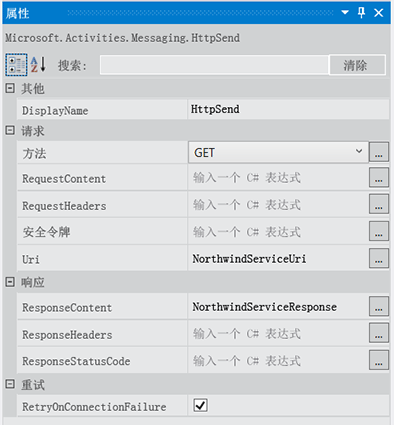
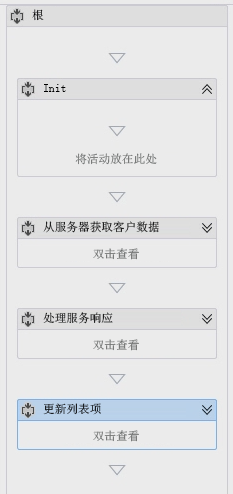
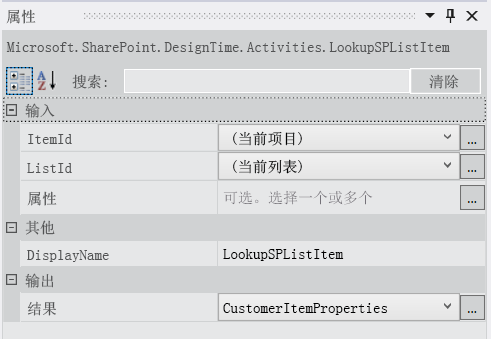
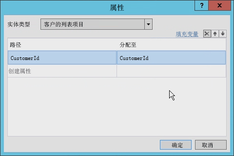
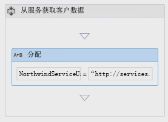
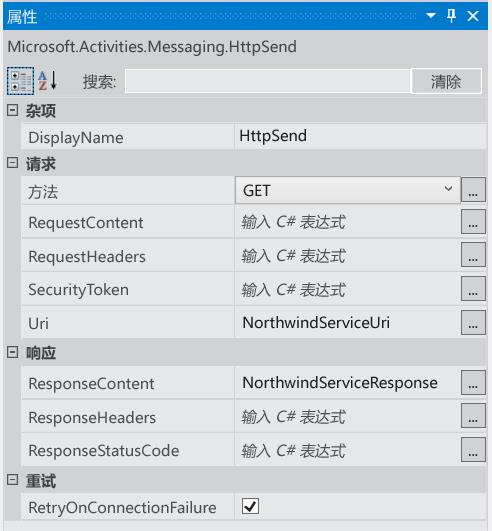
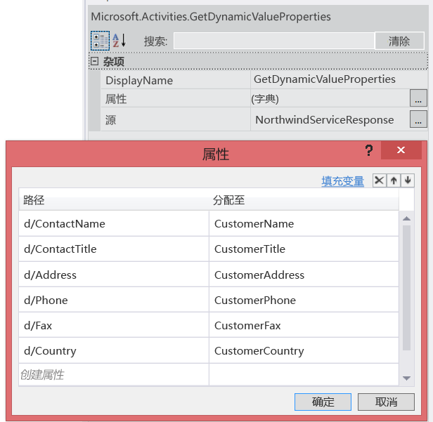
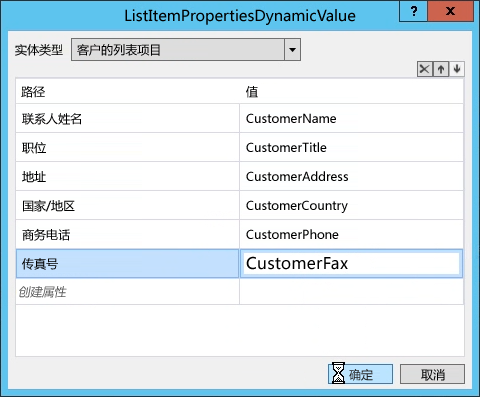
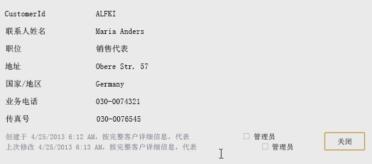

# 在 Visual Studio 2012 中使用 SharePoint 2013 工作流中的 Web 服务
演示如何在使用 Visual Studio 2008 创建的 SharePoint 2013 工作流中使用 Web 服务。
 **提供者：** [Andrew Connell](http://social.msdn.microsoft.com/profile/andrew%20connell%20%5bmvp%5d/)， [AndrewConnell.com](http://www.andrewconnell.com)
  
    
    

  
    
    

> **注释**
> 本文随附端到端代码示例，你可以用来理解文章，或用作你自己的 SharePoint 工作流项目的起点。您可以在此处的 MSDN 代码库 [在使用 Visual Studio 2012 的 SharePoint 2013 工作流中使用 Web 服务](http://code.msdn.microsoft.com/zh-cn/Working-with-Web-in-46148199)中找到可下载的代码。 
  
    
    

  
    
    
Microsoft 对 SharePoint Server 2013 中的工作流采用了与之前 SharePoint 版本中大为不同的方法。工作流团队与 Azure 团队合作创建了新产品 工作流管理器。工作流管理器 有着以高度可用且可扩展的方式托管最新版本 Windows Workflow Foundation（版本 4）运行时和所有必要服务的作用。该产品利用 Microsoft Azure 服务总线以实现性能和可扩展性，部署后（无论是本地部署还是在云中部署），运行情况相同。然后，连接 SharePoint 2013 并将其配置为不干预所有工作流执行和与 工作流管理器 服务器场相关的任务。新工作流体系结构中更重要的一项更改是 SharePoint 2013 中的所有自定义工作流都是完全声明性，包括使用 Visual Studio 2008 构建的工作流。在之前的 SharePoint 版本中，使用 Visual Studio 2008 开发的工作流不是独立声明性的，而是声明性 XAML 与已编译程序集组成配对。托管程序集包含工作流的业务逻辑。这可能会让经验丰富的 SharePoint 开发人员感到震惊，他们可能会问"那么如何在没有已编译程序集的情况下实施我的自定义业务逻辑？"。Microsoft 建议不要创建自定义 Web 服务，理想的做法是创建以 JavaScript 对象表示法 (JSON) 格式返回数据的 WCF、OData 或 RESTful Web 服务，并在此新版本中使用一些新活动和对象。
## 在 SharePoint 2013 工作流中使用 Web 服务的方案

不难设想在 SharePoint 2013 工作流中利用自定义 Web 服务的场景。使用 SharePoint 2007 或 SharePoint 2010 创作工作流的开发人员习惯于使用自定义代码，因为这些工作流本质上是编程性的。您无需向这些工作流添加自定义代码，但经常会执行此操作。
  
    
    
随着 SharePoint 2013 工作流变为完全声明性，很多已编写自定义代码的案例现在必须通过在外部 Web 服务中编写的代码处理，该服务由工作流调用和使用。
  
    
    
SharePoint 2013 工作流可以使用任何类型的 Web 服务。这就是说，最便于工作流与使用开放式数据协议 ( **OData** ) 传递数据的 Web 服务交互，此协议以 **Atom** 或 **json** 格式提供。OData 完全受 SharePoint 2013 工作流创作工具（SharePoint Designer 2013 和 Visual Studio 2008）支持，因此是最佳方法。
  
    
    
此外，还支持这两种匿名 Web 服务，以及通过不同类型的身份验证保护的服务。实际上，您可以完全控制每种服务调用的请求和响应处理。因此，举例来说，您可以在一个工作流中使用一系列活动，首先使用一种服务来进行身份验证以获取 OAuth 令牌，然后将该令牌包含在将来对使用  [OAuth 2.0](http://oauth.net/2/) 保护的服务的请求中。
  
    
    

## 在工作流中利用 Web 服务

在 SharePoint 2013 工作流中使用 Web 服务分为两个阶段。第一个阶段只需调用 Web 服务，通过使用 SharePoint 2013 引入的新 **HttpSend** 活动进行。 **HttpSend** 允许您调入最简单的 Web 服务或进行更复杂的任务，如提供 HTTP 谓词和特定 HTTP 头。图 1 显示了 **HttpSend** 活动中可用的很多属性。
  
    
    

**图 1. HttpSend 活动的"属性工具"窗口**

  
    
    

  
    
    

  
    
    
您还必须指定想要在服务请求中使用的方法类型。注意，在图 1 的"请求"块中，您可以指定方法类型（在本例中为 **GET**）。可用选项包括 **GET**、 **PUT**、 **POST** 和 **DELETE**（以及其他选项）。这是指示 Web 服务（特别是 RESTful 服务）对活动 URI 中定义的资源执行哪些操作的主要方法。
  
    
    
例如，若要获取特定项的所有属性， **Uri** 会包含该项的唯一地址，并且方法会设置为 **GET**。若要删除项， **Uri** 会保留该项的相同唯一地址，但方法会设置为 **DELETE**。更新项时同样如此，除了方法设置为 **POST**。创建项时， **Uri** 会指向将创建项的集合的唯一地址，并且方法会设置为 **POST**。创建或更新项时，服务会要求数据使用与请求中的内容一起传递的方法类型，指示使用 **HttpSend** 活动的 **RequestContent** 属性。
  
    
    
我们要介绍的使用 Web 服务的第二个阶段包括从 Web 服务提交或接收数据。无论您使用 **HttpSend** 活动的 **RequestContent** 或 **ResponseContent** 属性，都可以以复杂结构传递数据，格式为 JavaScript 对象表示法 (JSON) 字符串。好消息是，您无需手动创建和控制这些 json 字符串。Microsoft 提供了新的对象类型 [DynamicValue](http://msdn.microsoft.com/zh-cn/library/windowsazure/jj193446%28v=azure.10%29.aspx) 来替代，该对象类型可让任务更简单。
  
    
    
 **DynamicValue** 对象可存储结构层次数据，以及 Web 服务调用的响应。此外，还有一系列与 **DynamicValue** 对象相关的活动，您可以使用这些活动计数响应中的项目数、从响应中提取值或为更新或创建项构建新的结构。
  
    
    

## 为 SharePoint 2013 工作流创建 Web 服务

由于工作流中支持调用 Web 服务且缺乏对自定义代码的支持，开发人员现在需要了解如何创建服务。有大量选项可用于创建用于 SharePoint 2013 工作流中的自定义 Web 服务。 **HttpSend** 活动和 **DynamicValue** 数据类型最适合 RESTful 服务和遵守 OData 协议的服务。
  
    
    
OData 是一项协议，用于根据 REST 服务的原则创建和使用数据。制定该协议是为了使用成熟、可靠且稳固的 HTTP 协议标准化交换数据。完成 OData 规范后，不同组织在自己的技术堆栈中实施了协议。Microsoft 实施了自己的 OData 版本，并将其冠名为  [Windows Communication Foundation (WCF) 数据服务 5.0](http://msdn.microsoft.com/zh-cn/library/hh487257%28v=vs.103%29.aspx)。
  
    
    
SharePoint 2013 实施的 RESTful 服务支持 OData 实际上是因为，这些服务是使用实施 OData 3.0 规范的 WCF 数据服务（特别是 WCF 数据服务 5.0）构建。
  
    
    

### 实施 OData 服务 CRUD-Q 操作

Web 服务的一种常见用途是对数据库中的数据执行简单的创建、读取、更新、删除和查询 (CRUD-Q) 操作。通过使用 WCF，创建 OData 服务以用于 SharePoint 2013 工作流将十分简单。假定您有现有数据库，有 4 个简短步骤需要少量编码：
  
    
    

1. 使用  [Entity Framework](http://msdn.microsoft.com/zh-cn/library/bb399567%28v=vs.110%29.aspx) 创建数据库模型。无需任何代码（Visual Studio，提供向导）。
    
  
2. 创建新的 WCF 数据服务。无需任何代码（Visual Studio 提供向导）。
    
  
3. 在服务代码文件中，将实体模型（在步骤 1 中创建）名称设置为服务的源，然后在模型中设置实体的辅助功能和权限。两个步骤仅需两行代码。
    
  
4. 将服务发布到 工作流管理器 可以访问的位置。
    
  

### 实施 OData 服务操作

您想要使用 Web 服务完成的另一项任务是运行可能不适合 CRUDQ 模型的业务逻辑。例如，考虑一种 OData 服务，该服务支持新建银行贷款的 CRUD-Q 操作。假定此服务也支持消费者调用服务并提供信用评分，以获取准贷款的当前利率。这种类型的任务不属于 CRUDQ 模型，因为该任务调用方法并以整数传递以接收响应。
  
    
    
OData 和 WCF 数据服务通过向您提供 [服务操作](http://msdn.microsoft.com/zh-cn/library/cc668788%28v=vs.110%29.aspx)来支持此方案。服务操作很常见，甚至用于 SharePoint 2013 服务中，例如，使用地址  `http://[..]/_api/web/lists/GetByTitle('ListTitle')` 检索特定列表的情况。 **GetByTitle** 方法是 SharePoint 2013 团队创建的服务运算符。开发人员在使用 WCF 数据服务创建的自定义 Web 服务中创建自己的自定义服务操作。
  
    
    

## 演练：使用 Visual Studio 2012 创建工作流

以下演练显示了如何创建在 Northwind 数据库中调用 OData Web 服务的自定义工作流。您可以找到托管在  [OData.org](http://www.odata.org) 的 Northwind 数据库。
  
    
    
工作流创建完成后，用户输入客户 ID，然后启动工作流。工作流启动后，会检索其他客户信息，并为列表项更新检索到的数据。
  
    
    

1. 启动 Visual Studio 2008 并新建一个 SharePoint 承载的应用程序项目。
    
  
2. 在此项目中，新建一个自定义列表并将其命名为"客户"。
    
  
3. 在此新列表中，创建以下字段。将每个字段的默认数据类型保留为 **string**：
    
  - CustomerId（从默认"标题"字段重命名）
    
  
  - 客户名称
    
  
  - 职位
    
  
  - 地址
    
  
  - 国家/地区
    
  
  - 商务电话
    
  
  - 传真号
    
  
4. 现在，通过单击"解决方案资源管理器"中的"添加">"新项目"向项目添加工作流；然后，在"添加新项"对话框中，从"Office/SharePoint"类别选择"工作流"项目项。
    
  
5. 将工作流命名为"CompleteCustomerDetails"并单击"下一步"。
    
  
6. "自定义向导"提示后，将工作流命名为"完成客户详细信息"并将其设置为"列表"工作流。单击"下一步"。
    
  
7. 在向导的下一页中，选中复选框以创建关联，选择"客户"列表，然后为工作流历史记录和任务列表选择"新建"。单击"下一步"。
    
  
8. 在向导的最后一页上，选中复选框以手动启动工作流；将自动启动选项保留为 **未** 选中。单击"完成"。
    
  
9. 此时，Visual Studio 会显示包含单个 **Sequence** 活动的工作流设计器图面。
    
  
10. 将"序列"活动的名称更改为"根"。
    
  
11. 在根活动中添加另外 4 个 **Sequence** 活动，并进行如下命名：
    
  - 初始
    
  
  - 从服务获取客户数据
    
  
  - 处理服务响应
    
  
  - 更新列表项
  
    
    

    
  
12. 此时，工作流将如图 2 所示显示。
    
   **图 2. 完成具有 4 个空序列的客户详细信息工作流**

  

  

  

  

### 获取用户输入的客户 ID

工作流需要进行的第一个操作是检索用户输入的客户 ID。为此，您需要创建两个变量。
  
    
    

1. 单击工作流设计器底部附近的"变量"选项卡，创建两个变量
    
  - **CustomerItemProperties**（数据类型 = **DynamicValue**；范围 = **Init**）。使用此变量存储活动返回的结果集，该活动会获取列表项的所有属性。
    
    > **注释**
      > 默认情况下， **DynamicValue** 数据类型不显示。若要查找类型，请选择"变量类型"列中的"浏览类型"选项。在对话框顶部的搜索框中，输入"DynamicValue"，然后选择 **Microsoft.Activities.DynamicValue**。 
  - **CustomerId**（数据类型 = **String**；范围 = **Root**）：使用此变量可存储用户输入的客户 ID。
    
  
2. 在工具箱的"SP - 列表"部分中找到"LookupSpListItem"活动，并将其拖至"初始"序列。按图 3 所示设置活动属性。
    
   **图 3. LookupSPListItem 活动的"属性工具"窗口**

  

  

    此活动指示 工作流管理器 使用 SharePoint REST API 检索当前列表项的属性，并将 **JSON** 响应存储在刚刚创建的 **DynamicValue** 变量中。
    
  
3. 通过单击"LookupSpListItem"活动中的获取属性链接，从列表项检索客户 ID。执行此操作会向设计图画添加"GetDynamicValueProperties"活动。
    
  
4. 在"属性"对话框中，单击省略号（"…"）打开图 4 中显示的属性选择器。在向导中，将"实体类型"设置为"客户列表项"，然后通过将"路径"和"分配到"设置为 CustomerId（之前创建的变量），添加属性 CustomerId，如下图所示。
    
  
5. 单击"创建属性"，并在"路径"列中输入"CustomerId"。
    
  
6. 在"分配到"列中，输入之前创建的变量"CustomerId"。图 4 显示了完整的"属性"对话框。
    
   **图 4. GetDynamicValueProperties 活动的属性对话框。**

  

  

  

  

### 调用 Northwind OData Web 服务

工作流现在具有对客户 ID 的引用，因此下一步是调用 Web 服务。为此，我们将主要使用"从服务获取客户数据"序列。
  
    
    

1. 选择"从服务获取客户数据"序列并创建两个新变量：
    
  - **NorthwindServiceUri**（数据类型 = **String**；范围 ="从服务获取客户数据"）。此变量存储用于查询 Web 服务的 URI。
    
  
  - **NorthwindServiceResponse**（数据类型 = **DynamicValue**；范围 = **Root**）：此变量将存储 Web 服务响应。
    
  
2. 若要创建 URL 以查询 Web 服务，首先在工作流工具箱中找到"分配"活动并将其拖至"从服务获取客户数据"序列。请注意，"分配"活动有两部分代表名称/值对。
    
  
3. 将"分配"活动的左侧部分设置为"NorthwindServiceUri"。
    
  
4. 将活动的右侧部分设置为字符串  `"http://services.odata.org/Northwind/Northwind.svc/Customers('" + CustomerId + "')?$format=json"`。图 5 显示了完整的活动。
    
   **图 5. 分配用于设置包含 OData 服务的变量的活动**

  

  

  

  
5. 将 **HttpSend** 活动从工具箱拖至"从服务获取客户数据"序列，紧跟"分配"活动。
    
  
6. 使用图 6 中显示的值设置"HttpSend"活动的属性。
    
   **图 6. HttpSend 属性**

  

  

  

  

### 处理 Northwind OData Web 服务响应

提出 Web 服务请求并将结果存储在本地变量中后，下一步是处理响应。响应中的每个值都需要添加到不同变量中。
  
    
    

1. 为此演练开始时创建的每个字段创建一个变量（客户 ID 字段除外），如下所示：
    
  - 客户名称
    
  
  - 职位
    
  
  - 地址
    
  
  - 国家/地区
    
  
  - 商务电话
    
  
  - 传真号
    
  
2. 根据各个字段名称为每个变量命名。
    
  
3. 所有变量的类型应为 **String**；所有变量应限定为 **Root**。
    
  
4. 将 **GetDynamicValueProperties** 活动添加到"处理服务请求"序列中。
    
  
5. 在"属性"窗口中，将"源"值设置为 **NorthwindServiceResponse**，如图 7 中所示。
    
  
6. 单击"属性"属性上的省略号（"…"）按钮，然后按图 7 所示在"路径"和"分配到"列中提供值。请注意，"分配到"列中的值是为每个"客户"列表字段创建的变量。
    
   **图 7. GetDynamicValueProperties 的"属性工具"窗口和"属性"对话框的内容**

  

  

  

  

### 更新客户列表项

最后一步是更新列表项。
  
    
    

1. 将 **UpdateListItem** 活动添加到"更新列表项"序列，并使用"属性"窗口设置以下值：
    
  - "ListId"：（当前列表）
    
  
  - ItemId：（当前项）
    
  
2. 单击 **ListItemPropertiesDynamicValues** 属性上的省略号（"…"）按钮，在生成的对话框中，将"实体类型"设置为"客户列表项"。
    
  
3. 最后，针对从 Web 服务提取的每个值，将列表项上的值设置为工作流中的变量，如图 8 所示。
    
   **图 8. 设置了值的 ListItemPropertiesDynamicValue 对话框**

  

  

  

  

### 测试工作流

工作流现已完成，应该会正常运行。若要测试其稳定性，应进行测试。
  
    
    

1. 按"F5"开始调试；Visual Studio 可构建和部署 SharePoint 承载的应用程序。
    
  
2. 浏览器打开后，导航至"客户"列表，使用"客户 ID""ALFKI"创建一条客户记录（如图 9 所示），然后保存该项。
    
   **图 9. 新列表项**

  

  

  

  
3. 接下来，手动启动工作流，然后返回列表项。不断刷新页面，以查看工作流更新列表项，如图 10 所示
    
   **图 10. 更新的列表项**

  

  

    请注意，列表项是由 SharePoint 承载的应用程序代表启动工作流的人员更新。但是，在此演练中，工作流是由管理员启动。
    
  

## 结论

SharePoint 2013 引入了新的工作流体系结构，新产品 工作流管理器 1.0 对其起到促进作用。为了确保所有自定义工作流在任何 SharePoint 2013 部署选择（本地或在 Office 365 中承载）下都能运行，所有工作流现在都是完全声明性。因此，之前作为自定义代码在 SharePoint 之前版本中的由 Visual Studio 创作的工作流中实施的自定义业务逻辑不再受支持。
  
    
    
Microsoft 引入了对在 工作流管理器 中使用新 **HttpSend** 活动调用 Web 服务的支持。工作流管理器 还引入了对创建结构以提交 Web 服务，以及使用称为 **DynamicValue** 数据类型的响应的支持。创建工作流时，使用此数据类型及相关操作来促进通过使用外部 Web 服务在 SharePoint 2013 工作流中创建和利用稳固的业务流程。
  
    
    

## 其他资源

-  [在工作流中处理复杂数据](http://msdn.microsoft.com/zh-cn/library/windowsazure/jj193446%28v=azure.10%29.aspx)
    
  
-  [SharePoint 2013 中的工作流](http://msdn.microsoft.com/zh-cn/library/jj163986.aspx)
    
  

