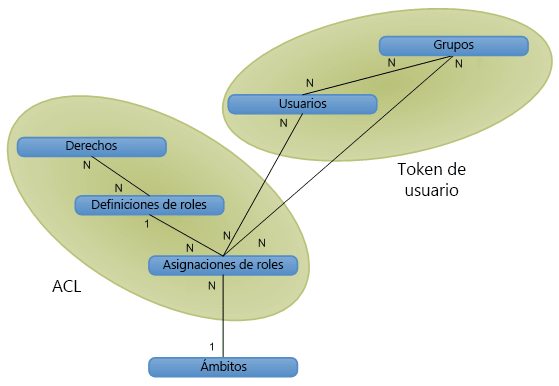

# Autorización, usuarios, grupos y el modelo de objetos de SharePoint 2013

En SharePoint 2013, el acceso a sitios web, listas, carpetas y elementos de lista se controla con un sistema de pertenencia basado en roles por el que se asignan roles a los usuarios que les permiten obtener acceso a los objetos de SharePoint 2013.
  
    
    

Para conceder a un usuario acceso a un objeto, agréguelo a un grupo que ya tenga permisos en el objeto. Otra posibilidad es crear un objeto de asignación de roles, establecer el usuario para la asignación de roles, enlazar, de forma opcional, la asignación de roles a la definición de roles correspondiente con permisos base y después agregar la asignación a la colección de asignaciones de roles para el elemento de lista, la carpeta, la lista o el sitio web. Si no enlaza la asignación de roles a una definición de roles cuando asigne un usuario a un rol, el usuario carecerá de permisos.
A continuación se explican las distintas formas que SharePoint 2013 proporciona para controlar el acceso a sus objetos:
  
    
    

- Los objetos pueden usar, bien los mismos permisos que el sitio web, la lista o la carpeta primarios al heredar tanto los roles como los usuarios disponibles en el objeto primario, o bien permisos únicos. 
    
  
- Cada sitio, lista, carpeta y elemento proporciona colecciones de asignaciones de roles, lo que permite administrar los accesos de usuario a objetos de forma precisa.
    
  
- Los grupos constan de usuarios y pueden o no asignarse a roles. SharePoint 2013 incluye los tres grupos siguientes de forma predeterminada:
    
  - **owners** (administrador)
    
  
  - **members** (colaborador)
    
  
  - **visitors** (lector)
    
  

    Cuando crea un sitio web con permisos únicos con la interfaz de usuario, se le dirige a una página donde puede asignar usuarios a estos grupos como parte del aprovisionamiento del sitio.
    
  
- El acceso anónimo permite a los usuarios contribuir de forma anónima a las listas y encuestas, así como ver las páginas de forma anónima. Además, puede conceder acceso a "todos los usuarios autenticados" para permitir a todos los miembros de su dominio tener acceso a un sitio web sin tener que habilitar el acceso anónimo. 
    
  
- Los derechos de creación de sitios ( **CreateSSCSite** y **ManageSubwebs**) controlan si los usuarios pueden crear sitios web, subsitios o áreas de trabajo de nivel superior.
    
  
Los usuarios se convierten en miembros de un objeto de SharePoint indirectamente mediante un grupo que tiene una asignación de roles o directamente mediante una asignación de roles. Además, los usuarios pueden ser miembros de un grupo de dominio de Microsoft Windows NT que se agrega a un grupo o un rol. Una definición de roles se asocia a un usuario o grupo con un solo derecho o un conjunto de derechos correspondientes a los valores de la enumeración  [Microsoft.SharePoint.SPBasePermissions](https://msdn.microsoft.com/library/Microsoft.SharePoint.SPBasePermissions.aspx) . Cada usuario o grupo tiene un miembro [ID](https://msdn.microsoft.com/library/Microsoft.SharePoint.SPMember.ID.aspx) único.Puede usar el modelo de objetos para crear o modificar asignaciones y definiciones de roles de un modo diferente al del procedimiento que consiste en usar las funciones de los archivos addrole.aspx y editrole.aspx. A diferencia de estas páginas presentadas en la interfaz de usuario, el modelo de objetos no aplica la dependencia de derechos; por lo tanto, puede crear una definición de roles con una combinación de derechos arbitraria. Recuerde que debe planear de forma minuciosa al usar el modelo de objetos para personalizar definiciones y permisos de roles, ya que si la definición de roles no se planea bien y no se asignan los derechos debidamente, la experiencia del usuario se puede ver afectada negativamente.Para obtener más información acerca de los derechos de SharePoint 2013, vea  [SPBasePermissions](https://msdn.microsoft.com/library/Microsoft.SharePoint.SPBasePermissions.aspx) .
## Directiva de seguridad

Una directiva de seguridad ofrece una forma de aplicar una seguridad uniforme en todas las colecciones de sitios de una aplicación web (servidor virtual). Con la directiva, se puede asignar un rol o una colección de derechos a usuarios individuales de SharePoint 2013, así como a grupos de dominio con la autenticación de Windows o los sistemas de autenticación acoplable, pero no a grupos de SharePoint. Cada entrada de directiva especifica los derechos de un usuario o grupo de la aplicación web.
  
    
    
La directiva se establece en el nivel lógico de la aplicación web o en el nivel de la zona. Un usuario puede tener, por ejemplo, directivas diferentes en  `http://Server` y `http://Server.extranet.microsoft.com` aunque las dos aplicaciones web tengan el mismo contenido.
  
    
    
Los derechos se pueden conceder o denegar con la directiva. La concesión de un derecho le da ese derecho al usuario o grupo en todos los objetos protegidos de la aplicación web independientemente de los permisos locales del objeto. La denegación de un derecho anula su concesión, con lo cual el derecho se bloquea activamente para el usuario o grupo en todos los objetos protegidos de la aplicación web. La denegación de todos los derechos de un usuario impide que el usuario pueda tener acceso al contenido, aunque el usuario tenga permisos explícitos en determinado contenido: la directiva invalida los permisos de nivel de sitio.
  
    
    
En los roles de directiva, los usuarios y grupos se identifican mediante su identificador de seguridad (SID) y su nombre de inicio de sesión o usuario. La aplicación de una función de directiva es similar a la administración de permisos para un sitio web, una lista, una carpeta o un documento: puede agregar usuarios o grupos y asignarlos a una o más definiciones de roles. Cada aplicación web tiene sus propios roles de directiva. Otra diferencia entre los roles de directiva y la administración de permisos es que los administradores centrales pueden denegar un derecho a un usuario en toda una aplicación web.
  
    
    

> **NOTA**
> Los roles de directiva de administración central difieren de las definiciones de roles para una colección de sitios. 
  
    
    

## Usuarios, grupos y entidades de seguridad

Un usuario individual ( [SPUser](https://msdn.microsoft.com/library/Microsoft.SharePoint.SPUser.aspx) ) obtiene acceso a un objeto de SharePoint directamente con una asignación individual de roles o indirectamente con la pertenencia a un grupo de dominio o a un grupo de SharePoint ( [SPGroup](https://msdn.microsoft.com/library/Microsoft.SharePoint.SPGroup.aspx) ) que tiene una asignación de roles. En una asignación de roles directa, el usuario es la entidad de seguridad ( [SPPrincipal](https://msdn.microsoft.com/library/Microsoft.SharePoint.SPPrincipal.aspx) ). En una asignación de roles que corresponde a un grupo de dominio o a un grupo de SharePoint, el grupo de dominio o el grupo de SharePoint es la entidad de seguridad.
  
    
    
SharePoint Server admite usuarios de Windows (por ejemplo,  _DOMINIO_ \\ _alias_de_usuario_ ) como usuarios externos (con la autenticación acoplable). La identidad del usuario se mantiene con el sistema de administración de identidades (por ejemplo, el servicio de directorio de Active Directory). El perfil de usuario (que incluye el nombre para mostrar, la dirección de correo electrónico y otros datos del usuario) se incluye en el ámbito del nivel de la colección de sitios. La modificación de un nombre para mostrar repercute en toda la colección de sitios.
  
    
    
Un grupo es una colección de usuarios a través de la que SharePoint Server administra la seguridad. La administración basada en el usuario es muy sencilla para sitios simples, pero se complica a medida que crece el número de los recursos protegidos de forma exclusiva. Por ejemplo, un usuario puede tener el rol **Contribute** para la lista 1, el rol **Read** para la lista 2 y el rol **Design** para la lista 3. Este modelo no se escala correctamente si hay, por ejemplo, 50.000 usuarios, lo que daría lugar a listas de control de acceso (ACL) con 50.000 entradas de control de acceso (ACE) en cada objeto protegido de forma exclusiva.
  
    
    
Los grupos suponen una respuesta a los problemas de uso y escalabilidad de la administración de permisos basados en los usuarios. La administración basada en grupos puede ser más abstracta o más difícil de conceptualizar, pero facilita la administración de sitios complejos con muchos objetos protegidos de forma exclusiva. Por ejemplo, cuando se agrega un usuario a un grupo que ya tiene el rol correspondiente en varios objetos del sistema. La comprobación de permisos para grupos se escala mejor porque es necesario almacenar muchos menos ACE de grupo.
  
    
    
SharePoint Server admite dos tipos de grupos: grupos de dominio y grupos de SharePoint. Los grupos de dominio permanecen fuera del control de SharePoint Server; los usuarios no pueden usar SharePoint Server para definir, examinar ni modificar la pertenencia a grupos de dominio. Los grupos de SharePoint se incluyen en el ámbito del nivel de la colección de sitios y se pueden usar únicamente en la colección de sitios. Los grupos de dominio se pueden usar en cualquier parte del ámbito del servicio de directorio de Active Directory.
  
    
    
Una entidad de seguridad es un usuario o un grupo que se usa para controlar la seguridad. Si agrega un usuario a un sitio, el usuario será la entidad de seguridad, pero si agrega un grupo al sitio, este será la entidad de seguridad. La clave para escalar la seguridad en SharePoint Server consiste en mantener un número razonable de entidades de seguridad por ámbito. El uso de grupos permite reducir el número de entidades de seguridad que se pueden usar para conceder acceso a un número mucho mayor de usuarios.
  
    
    

## Vista de alto nivel de relaciones de objetos: ámbitos, usuarios, grupos y roles

En la figura 1 se muestra una vista de alto nivel del sistema de administración de seguridad de SharePoint Server en un diagrama lógico de base de datos. Cada cuadro representa un objeto de seguridad del sistema. Las líneas representan las relaciones entre los objetos. Las anotaciones **1** y **N** representan el tipo de relación. En la figura se ve cómo se estructuran los datos de permisos en un token de usuario y una ACL.
  
    
    

**Figura 1. Relaciones del objeto de autorización**

  
    
    

  
    
    

  
    
    
Un ámbito representa un objeto o un conjunto de objetos protegidos de forma exclusiva. Puede asignar el ámbito de nivel de sitio, lista, carpeta o elemento.
  
    
    
Los usuarios y los grupos tienen una relación de varios a varios (de N a N). Cada usuario ( [SPUser](https://msdn.microsoft.com/library/Microsoft.SharePoint.SPUser.aspx) ) puede pertenecer a varios grupos y cada grupo ( [SPGroup](https://msdn.microsoft.com/library/Microsoft.SharePoint.SPGroup.aspx) ) puede contener varios usuarios.
  
    
    
Los derechos y las definiciones de roles también tienen una relación de varios a varios (de N a N). Así, cada derecho ( [SPBasePermissions](https://msdn.microsoft.com/library/Microsoft.SharePoint.SPBasePermissions.aspx) ) puede formar parte de varias definiciones de roles. Por ejemplo, el derecho **Insert List Items** se incluye en las definiciones de roles **Contributor**, **Designer** y **Administrator**. Cada definición de roles ( [SPRoleDefinition](https://msdn.microsoft.com/library/Microsoft.SharePoint.SPRoleDefinition.aspx) ) también puede contener varios derechos (por ejemplo, **Contributor** incluye los derechos para insertar, actualizar y eliminar elementos de lista).
  
    
    
Las definiciones de roles y las asignaciones de roles ( [SPRoleAssignment](https://msdn.microsoft.com/library/Microsoft.SharePoint.SPRoleAssignment.aspx) ) tienen una relación de uno a varios (de 1 a N). Cada definición de roles se usa en varias asignaciones de roles. Los lectores de la lista 1 y los lectores de la lista 2 pueden ser distintos, pero sus asignaciones de roles pueden compartir una única definición de roles: **Reader**.
  
    
    
Los usuarios o grupos y las asignaciones de roles tienen una relación de varios a varios (de N a N). Cada usuario o grupo puede ser miembro de varias asignaciones de roles en un objeto determinado. Por ejemplo, un usuario puede tener el rol **Designer** y el rol **Administrator** en el mismo objeto.
  
    
    
Los ámbitos y las asignaciones de roles tienen una relación de uno a varios (de 1 a N). Cada ámbito tiene varias asignaciones de roles, pero cada asignación de roles tiene solo un ámbito. Por ejemplo, un usuario puede ser un lector en la lista de eventos, y otro usuario, un colaborador en la lista de eventos, pero ninguna de estas asignaciones de roles se aplica a la lista de anuncios. El único modo en que dos listas pueden compartir la misma asignación de roles es con la herencia de sus permisos del contenedor primario, en cuyo caso el ámbito de seguridad es el contenedor y no las dos listas.
  
    
    

## Tokens de usuario y listas de control de acceso

Para agilizar la comprobación de los permisos, SharePoint Server implementa tokens de usuario y ACL en su modelo de seguridad. El token de usuario identifica el proceso de autenticación aplicado al usuario. Un usuario de Windows tiene un token complejo: una cadena única para el usuario (SID) y una lista de todos los grupos de dominio de Windows para el usuario (por ejemplo,  _DOMINIO_\\Departamento 15688). Un usuario que no tenga la autenticación de Windows puede tener un token muy sencillo con una cadena única para el nombre de usuario o un token complejo con una pertenencia a un grupo o rol, según se exprese en la autenticación de Windows. La pertenencia a un grupo de SharePoint para cada usuario se expresa con un token de usuario de modo que, con la lectura de dicho token de usuario, SharePoint Server identifique todos los grupos del usuario actual.
  
    
    
Una ACL es un objeto binario que determina los derechos que los usuarios y grupos tienen sobre un objeto concreto. Una ACL consta de varias ACE, siendo cada entidad de seguridad (usuario o grupo) una ACE de la ACL. Los derechos, las definiciones de roles y las asignaciones de roles se estructuran en una ACL en relación con cada ámbito para que SharePoint Server sepa qué puede hacer cada usuario o grupo en un ámbito determinado.
  
    
    

## Cambios de modelos de objetos: objetos de seguridad obsoletos pero compatibles con versiones anteriores

En SharePoint 2013, todos los ámbitos de objetos comparten la misma experiencia de administración de permisos básica. SharePoint 2013 administra los permisos con definiciones de roles, lo que permite una experiencia uniforme a nivel de listas, carpetas y elementos. Los siguientes objetos de seguridad usados en Windows SharePoint Services 2.0 han quedado obsoletos, pero siguen funcionando para la compatibilidad con versiones anteriores:
  
    
    

-  [Microsoft.SharePoint.SPPermission](https://msdn.microsoft.com/library/Microsoft.SharePoint.SPPermission.aspx)
    
  
-  [Microsoft.SharePoint.SPPermissionCollection](https://msdn.microsoft.com/library/Microsoft.SharePoint.SPPermissionCollection.aspx)
    
  
-  [Microsoft.SharePoint.SPRights](https://msdn.microsoft.com/library/Microsoft.SharePoint.SPRights.aspx)
    
  
-  [Microsoft.SharePoint.SPRole](https://msdn.microsoft.com/library/Microsoft.SharePoint.SPRole.aspx)
    
  
-  [Microsoft.SharePoint.SPRoleCollection](https://msdn.microsoft.com/library/Microsoft.SharePoint.SPRoleCollection.aspx)
    
  
Para asignar usuarios a los roles, use miembros de las clases  [Microsoft.SharePoint.SPRoleAssignment](https://msdn.microsoft.com/library/Microsoft.SharePoint.SPRoleAssignment.aspx) y [Microsoft.SharePoint.SPRoleAssignmentCollection](https://msdn.microsoft.com/library/Microsoft.SharePoint.SPRoleAssignmentCollection.aspx) . La enumeración [SPBasePermisssions](https://msdn.microsoft.com/library/Microsoft.SharePoint.SPBasePermisssions.aspx) , que reemplazó a [SPRights](https://msdn.microsoft.com/library/Microsoft.SharePoint.SPRights.aspx) , incluye permisos adicionales. La enumeración [SPBasePermisssions](https://msdn.microsoft.com/library/Microsoft.SharePoint.SPBasePermisssions.aspx) también incluye permisos heredados que se asignan a los mismos valores constantes que los permisos anteriores en [SPRights](https://msdn.microsoft.com/library/Microsoft.SharePoint.SPRights.aspx) . El concepto de grupo de SharePoint se asigna a los objetos [SPGroup](https://msdn.microsoft.com/library/Microsoft.SharePoint.SPGroup.aspx) y [SPGroupCollection](https://msdn.microsoft.com/library/Microsoft.SharePoint.SPGroupCollection.aspx) existentes que representan los grupos entre sitios.
  
    
    

### Roles de directivas: crear o modificar directivas de seguridad para zonas URL

Para crear o modificar directivas de seguridad para zonas URL, use las siguientes clases y sus miembros:
  
    
    

-  [Microsoft.SharePoint.Administration.SPPolicy](https://msdn.microsoft.com/library/Microsoft.SharePoint.Administration.SPPolicy.aspx)
    
  
-  [Microsoft.SharePoint.Administration.SPPolicyCollection](https://msdn.microsoft.com/library/Microsoft.SharePoint.Administration.SPPolicyCollection.aspx)
    
  
-  [Microsoft.SharePoint.Administration.SPPolicyRole](https://msdn.microsoft.com/library/Microsoft.SharePoint.Administration.SPPolicyRole.aspx)
    
  
-  [Microsoft.SharePoint.Administration.SPPolicyRoleCollection](https://msdn.microsoft.com/library/Microsoft.SharePoint.Administration.SPPolicyRoleCollection.aspx)
    
  
-  [Microsoft.SharePoint.Administration.SPPolicy.SPPolicyRoleBindingCollection](https://msdn.microsoft.com/library/Microsoft.SharePoint.Administration.SPPolicy.SPPolicyRoleBindingCollection.aspx)
    
  
-  [Microsoft.SharePoint.Administration.SPPolicyPermissions](https://msdn.microsoft.com/library/Microsoft.SharePoint.Administration.SPPolicyPermissions.aspx)
    
  

## Roles de invitado (acceso limitado) para adaptar recursos compartidos

El concepto de rol de invitado se basa en adaptar los recursos compartidos a la plataforma. Por ejemplo, la estructura de temas y navegación del sitio web se debe usar para representar la página para una vista de lista. Este concepto se amplía para incluir los permisos de nivel de carpeta y lista.
  
    
    
En el modelo de objetos de SharePoint se sigue llamando rol **Guest** por motivos de compatibilidad semántica con el modelo de objetos anterior aunque ahora, en la interfaz de usuario, este rol se llama **Acceso limitado**. 
  
    
    

### Extensiones de carpetas y elementos

Si se conceden permisos a un usuario en una carpeta, también se le concede el rol **Guest** en la lista primaria de esa carpeta y en el sitio web primario de la lista (en cada ámbito protegido de forma única sobre la carpeta hasta llegar al primer sitio web antecesor único). Esto también se aplica a los elementos de lista: al concederle a un usuario permisos en un elemento, también se le concede el rol **Guest** en todas las carpetas, listas y sitios web primarios hasta llegar al sitio web antecesor único.
  
    
    

## Quitar usuarios de un ámbito o de todos los ámbitos

Al quitar un usuario de un ámbito, también se quita de todos los ámbitos protegidos de forma única que están por debajo del ámbito actual. Por ejemplo, al quitar un usuario de un sitio web, también se quita de las listas protegidas de forma única que hay en el sitio.
  
    
    
El único modo de quitar un usuario de todos los ámbitos es eliminarlo de la colección de sitios, con lo que se quita al usuario de todos los roles de todos los ámbitos que se encuentran en la colección de sitios.
  
    
    

## Recursos adicionales

-  [Autenticación, autorización y seguridad en SharePoint 2013](authentication-authorization-and-security-in-sharepoint-2013.md)
    
  
-  [Rol, herencia, elevación de privilegios y cambios de contraseña en SharePoint 2013](role-inheritance-elevation-of-privilege-and-password-changes-in-sharepoint-2013.md)
    
  
-  [Identidad basada en notificaciones en SharePoint 2013](claims-based-identity-in-sharepoint-2013.md)
    
  
-  [Identidad y conceptos basados en notificaciones en SharePoint 2013](claims-based-identity-and-concepts-in-sharepoint-2013.md)
    
  
-  [Configuración, administración y recursos en SharePoint 2013](configuration-administration-and-resources-in-sharepoint-2013.md)
    
  

