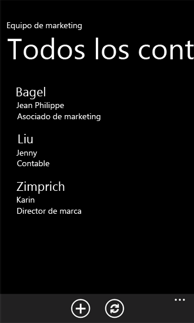
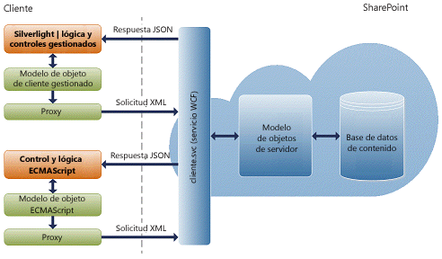
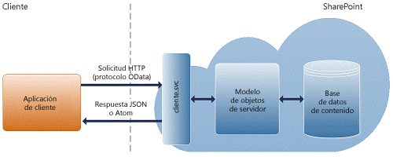

# Creación de aplicaciones de Windows Phone con acceso a SharePoint 2013
Obtenga información sobre cómo crear Complementos de SharePoint que integran SharePoint 2013 y dispositivos móviles como Windows Phone 8 y Windows Phone 7.
## Introducción a la creación de aplicaciones móviles con SharePoint 2013

SharePoint 2013 proporciona una oportunidad emocionante para que los desarrolladores creen aplicaciones móviles que se desplacen con los usuarios, interactivas y atractivas, y que estén disponibles cuando y donde los usuarios quieran trabajar con ellas. Puede combinar aplicaciones Windows Phone 8 y Windows Phone 7 con aplicaciones y servicios de SharePoint local o con servicios de SharePoint remoto y aplicaciones que se ejecuten en la nube (como las que utiliza SharePoint Online) para crear aplicaciones eficaces que amplíen la funcionalidad más allá del tradicional escritorio o equipo portátil en un entorno realmente portátil y mucho más accesible.
  
    
    
Las nuevas características de movilidad ofrecidas por SharePoint 2013 se basan en tecnologías y herramientas de Microsoft existentes como SharePoint, Windows Phone, Visual Studio y Silverlight. Los desarrolladores familiarizados con estas tecnologías y sus herramientas relacionadas podrán crear aplicaciones móviles con tecnología SharePoint para Windows Phone sin mucho esfuerzo de aprendizaje. En esta sección, veremos algunos tipos de aplicaciones móviles que funcionan con SharePoint que puede crear para Windows Phone 8 y Windows Phone 7, y las maneras más comunes de personalizar estas aplicaciones. SharePoint 2013 proporciona un marco de trabajo y herramientas para desarrolladores, lo que incluye plantillas de proyectos de Visual Studio 2010, para crear soluciones móviles que interactúan con datos de SharePoint en instalaciones de SharePoint local y en la nube, con SharePoint Online. La figura 1 muestra cómo podría ser una aplicación de lista simple en Windows Phone.
  
    
    

**Figura 1. Elementos de lista de SharePoint en una aplicación de Windows Phone**

  
    
    

  
    
    

  
    
    

  
    
    

  
    
    

## ¿Qué aptitudes necesita para crear aplicaciones móviles?

En esta sección, se supone que está familiarizado con SharePoint, .NET Framework, el sistema de desarrollo de Visual Studio y Visual C#. También es conveniente tener alguna experiencia en el desarrollo de aplicaciones de Windows Phone 8 o Windows Phone 7 con Silverlight y ayuda estar familiarizado con XAML, StackPanel y los controles Pivot para Windows Phone, y conceptos como extinción y el enlace de datos de Silverlight. Si está familiarizado con el desarrollo de aplicaciones de Windows Phone con Silverlight, se recomienda que consulte los siguientes recursos.
  
    
    

-  [Desarrollo de una aplicación de Windows Phone de principio al fin](http://msdn.microsoft.com/es-es/library/gg680270%28v=pandp.11%29.aspx)
    
  
-  [Interfaz de usuario de Windows Phone](http://msdn.microsoft.com/es-es/library/windowsphone/develop/ff967556%28v=vs.105%29.aspx)
    
  
-  [Inicio rápido: Creación de una interfaz de usuario con XAML para Windows Phone](http://msdn.microsoft.com/es-es/library/windowsphone/develop/jj207025%28v=vs.105%29.aspx)
    
  
-  [Arquitectura de control Pivot para Windows Phone](http://msdn.microsoft.com/es-es/library/windowsphone/develop/ff941097%28v=vs.105%29.aspx)
    
  

## Introducción al desarrollo de aplicaciones móviles con SharePoint 2013

Puede crear una amplia variedad de aplicaciones móviles con SharePoint 2013. En esta sección se describe las novedades o lo que ha cambiado en la versión de SharePoint 2013 que simplifica el desarrollo de aplicaciones móviles para desarrolladores.
  
    
    

### Plantilla de aplicación SharePoint 2013 para Windows Phone

Este es el tipo más sencillo de aplicación móvil que puede crear para mostrar una lista normal en el teléfono. SharePoint 2013 ofrece una plantilla de Visual Studio que le permite crear aplicaciones rápidamente desde la lista de SharePoint para Windows Phone. Por ejemplo, puede crear una aplicación del tipo "Lista de tareas pendientes" para Windows Phone que incorpore la lista de tareas de SharePoint en Windows Phone y podrá utilizar su teléfono para actualizar el estado de una tarea sobre la marcha. Otro ejemplo es hacer que el catálogo de productos de una lista de inventario de SharePoint esté disponible en el teléfono para el personal de ventas. La instalación del SDK de SharePoint para Windows Phone hace que estén disponibles dos plantillas de aplicación de SharePoint para Windows Phone en Visual Studio 2010 o Visual Studio 2010 Express para Windows Phone. (Consulte  [Cómo: Configurar un entorno de desarrollo de aplicaciones móviles para SharePoint](how-to-set-up-an-environment-for-developing-mobile-apps-for-sharepoint.md)). Con la plantilla de aplicación de lista de SharePoint para Windows Phone, puede seguir los pasos de un asistente para crear una aplicación funcional de Windows Phone que puede tener acceso y manipular datos de una lista de SharePoint.
  
    
    

### Modelo de objetos de movilidad nuevo y mejorado en SharePoint 2013

SharePoint 2013 agrega varias clases nuevas en los modelos de objetos de servidor y cliente para habilitar los escenarios de movilidad de SharePoint que se han descrito anteriormente en este artículo.
  
    
    
Para habilitar aplicaciones con reconocimiento de ubicación, hay una nueva clase de tipo de campo nativo, **SPFieldGeoLocation**, junto con varias clases asociadas para estructurar el valor de los campos de ubicación y su representación. Estas clases también se pueden llamar desde el modelo de objetos de cliente SharePoint 2013 para Silverlight. El nuevo tipo de campo también tiene una definición que se agrega al archivo fldtypes.xml estándar de SharePoint y nuevos controles de usuario para representar el campo en los formularios Nuevo, Editar y Mostrar. Para obtener información general, consulte  [Integración de funciones de ubicación y asignación en SharePoint 2013](integrating-location-and-map-functionality-in-sharepoint-2013.md).
  
    
    
Para habilitar la autenticación de SharePoint 2013 para usuarios de Windows Phone, el modelo de objetos de cliente incluye una nueva clase **Authenticator** y varias clases asociadas. Para obtener información general, consulte [Información general del modelo de objetos de autenticación de clientes móviles de SharePoint 2013](overview-of-the-sharepoint-2013-mobile-client-authentication-object-model.md).
  
    
    
Para habilitar las notificaciones automáticas de eventos en una granja de servidores de SharePoint a los usuarios de Windows Phone, el modelo de objetos de servidor incluye nuevas clases, cada una de ellas también se puede llamar desde el modelo de objetos de cliente. Estas clases incluyen métodos que permiten a las aplicaciones del teléfono registrarse con aplicaciones de servidor de SharePoint 2013 para recibir notificaciones sobre los tipos de eventos especificados. También hay métodos que usan las aplicaciones de servidor para enviar notificaciones a los suscriptores registrados. Para obtener información general, consulte  [Crear una aplicación de lista de SharePoint de Windows Phone para recibir notificaciones push](how-to-configure-and-use-push-notifications-in-sharepoint-2013-apps-for-windows.md#BKMK_NotificationPhoneApp).
  
    
    
Con SharePoint 2013, no está limitado a desarrollar aplicaciones móviles para Windows Phone 8 y Windows Phone 7. Con la interfaz de programación de JavaScript y la nueva interfaz de programación de Representational State Transfer (REST) proporcionada por SharePoint 2013, puede crear aplicaciones para dispositivos móviles Windows Phone; puede interactuar con sitios de SharePoint mediante JavaScript que se ejecuta como scripts en el explorador o de forma remota usando cualquier tecnología que admita capacidades REST estándar. La siguiente sección proporciona una visión general de interfaces de programación de REST y JavaScript.
  
    
    

#### Arquitectura del modelo de objetos ECMAScript (JavaScript, JScript)

SharePoint Foundation 2010 introdujo los modelos de objetos de cliente, lo que permitió a los desarrolladores establecer una comunicación remota con SharePoint mediante la tecnología de programación web de su elección: .NET Framework, Silverlight o JavaScript.
  
    
    
En SharePoint Foundation 2010, los modelos de objetos de cliente proporcionan las API que permiten a los desarrolladores interactuar con sitios de SharePoint desde el script que se ejecuta en el explorador, desde el código (basado en .NET Framework 3.5 o posterior) que se ejecuta en una aplicación administrada de .NET Framework o desde el código que se ejecuta en una aplicación de Silverlight 2.0. El proxy .js y los archivos administrados .dll que componen los modelos de objetos de cliente se basan en el servicio web client.svc y controlan el procesamiento por lotes, la serialización de solicitudes y el análisis de respuestas. La figura 2 muestra una vista general de la arquitectura del modelo de objetos de cliente de SharePoint.
  
    
    

**Figura 2. Arquitectura del modelo de objetos de clientes de SharePoint**

  
    
    

  
    
    

  
    
    
Para aprender a usar el modelo de objetos de cliente de JavaScript con datos de SharePoint, consulte  [Modelo de objetos de cliente de ECMAScript](http://channel9.msdn.com/learn/courses/SharePoint2010Developer/ClientObjectModel/ECMAScriptClientObjectModel)
  
    
    

#### Extremos REST en SharePoint 2013

Para usar las capacidades REST integradas en SharePoint 2013, puede crear una solicitud HTTP RESTful con Open Data Protocol (OData) estándar que corresponde a la API del modelo de objetos de cliente que quiera. El servicio web client.svc administra la solicitud HTTP y envía la respuesta correspondiente, en formato Atom o Notación de objetos de JavaScript (JSON). La aplicación cliente debe analizar esa respuesta. La figura 3 muestra una vista general de la arquitectura REST de SharePoint.
  
    
    

**Figura 3. Arquitectura REST de SharePoint**

  
    
    

  
    
    

  
    
    
Actualmente, el servicio REST de SharePoint 2013 es de solo lectura. Es decir, solo están disponibles los extremos REST que representan una operación HTTP GET
  
    
    
De forma predeterminada, las respuestas de servicio REST de SharePoint 2013 se formatean con el protocolo Atom, según la especificación OData. Además, el servicio REST admite los encabezados HTTP Accept que permiten a los desarrolladores especificar que la respuesta se devuelva en formato JSON. Para obtener más información sobre los servicios REST en SharePoint 2013, consulte  [Cómo programar con el servicio REST de SharePoint 2013](use-odata-query-operations-in-sharepoint-rest-requests.md).
  
    
    
El servicio REST de SharePoint 2013 admite los siguientes operadores de consulta de OData:
  
    
    

- Filter
    
  
- Take
    
  
- Expand
    
  

## Empezar a desarrollar aplicaciones móviles para SharePoint 2013

Los siguientes procedimientos e información general profundizan en la información específica que necesita para empezar a desarrollar aplicaciones móviles:
  
    
    

-  [Cómo: Configurar un entorno de desarrollo de aplicaciones móviles para SharePoint](how-to-set-up-an-environment-for-developing-mobile-apps-for-sharepoint.md)
    
  
-  [Información de plantillas de aplicaciones de SharePoint 2013 para Windows Phone en Visual Studio](overview-of-windows-phone-sharepoint-2013-application-templates-in-visual-studio.md)
    
  
-  [Arquitectura de la plantilla de aplicaciones de listas de SharePoint en Windows Phone](architecture-of-the-windows-phone-sharepoint-list-application-template.md)
    
  
-  [Cómo: Crear una aplicación de lista de SharePoint 2013 para Windows Phone](how-to-create-a-windows-phone-sharepoint-2013-list-app.md)
    
  
-  [Cómo: Almacenar y recuperar elementos de lista de SharePoint en un Windows Phone](how-to-store-and-retrieve-sharepoint-list-items-on-a-windows-phone.md)
    
  
-  [Cómo: Implementar lógica de negocios y validación de datos en una aplicación de Windows Phone para SharePoint 2013](how-to-implement-business-logic-and-data-validation-in-a-windows-phone-app-for-s.md)
    
  
-  [Cómo hacer compatibles y convertir los tipos de archivos de SharePoint 2013 para las aplicaciones de Windows Phone](how-to-support-and-convert-sharepoint-2013-field-types-for-windows-phone-apps.md)
    
  
-  [Cómo personalizar consultas de elementos de listas y filtrar datos para aplicaciones de Windows Phone](how-to-customize-list-item-queries-and-filter-data-for-windows-phone-apps.md)
    
  
-  [Cómo personalizar la interfaz de usuario de una aplicación de lista de SharePoint 2013 para Windows Phone](how-to-customize-the-user-interface-of-a-sharepoint-2013-list-app-for-windows-ph.md)
    
  
-  [Cómo: Utilizar varias listas de SharePoint 2013 en una aplicación de Windows Phone](how-to-use-multiple-sharepoint-2013-lists-in-a-windows-phone-app.md)
    
  
-  [Cómo: Configurar y usar las notificaciones de inserción en aplicaciones de SharePoint 2013 para Windows Phone](how-to-configure-and-use-push-notifications-in-sharepoint-2013-apps-for-windows.md)
    
  
-  [Integración de funciones de ubicación y asignación en SharePoint 2013](integrating-location-and-map-functionality-in-sharepoint-2013.md)
    
  
-  [Cómo crear una aplicación móvil en SharePoint 2013 que contenga datos de un origen de datos externo](how-to-create-a-mobile-app-in-sharepoint-2013-that-contains-data-from-an-externa.md)
    
  
-  [Cómo: integrar mapas con las aplicaciones para Windows Phone y listas de SharePoint 2013](how-to-integrate-maps-with-windows-phone-apps-and-sharepoint-2013-lists.md)
    
  
-  [Cómo crear aplicaciones móviles impulsadas por búsquedas con las interfaces REST de navegación y registro de eventos](how-to-build-search-driven-mobile-apps-with-the-navigation-and-event-logging-res.md)
    
  

## Recursos adicionales

  
    
    

-  [Modelos de programación en SharePoint 2013](programming-models-in-sharepoint-2013.md)
    
  
-  [Cómo: Configurar un entorno de desarrollo de aplicaciones móviles para SharePoint](how-to-set-up-an-environment-for-developing-mobile-apps-for-sharepoint.md)
    
  
-  [Windows Phone SDK 8.0](http://www.microsoft.com/es-es/download/details.aspx?id=35471)
    
  
-  [Microsoft SharePoint SDK para Windows Phone 8](http://www.microsoft.com/es-es/download/details.aspx?id=36818)
    
  
-  [Windows Phone SDK 7.1](http://www.microsoft.com/es-es/download/details.aspx?id=27570)
    
  
-  [Microsoft SharePoint SDK para Windows Phone 7.1](http://www.microsoft.com/es-es/download/details.aspx?id=30476)
    
  
-  [Acerca de Expression Blend](http://msdn.microsoft.com/es-es/library/cc296376%28Expression.40%29.aspx)
    
  

