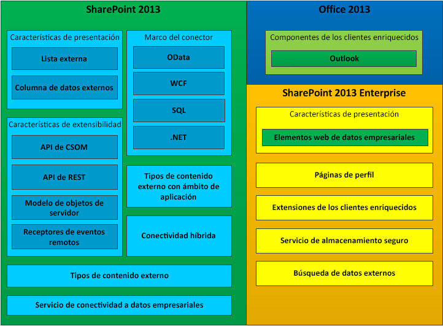

# Servicios de conectividad empresarial de SharePoint 2013
Obtenga información sobre qué es Servicios de conectividad empresarial (BCS), qué puede hacer con él y la información que necesita para comenzar a desarrollar aplicaciones de BCS en SharePoint 2013.
Puede usar SharePoint 2013 como un concentrador para crear soluciones enriquecidas de productividad y colaboración que funcionan con diferentes sistemas externos. Servicios de conectividad empresarial (BCS) proporciona la infraestructura que permite a SharePoint 2013 traer datos de esos sistemas externos a un sistema central. Gracias a su manera flexible y extensible de describir el origen de datos del sistema externo y cómo interactuar con él, BCS resulta un argumento convincente para usar SharePoint 2013 como interfaz centralizada para trabajar con sistemas empresariales heredados, además de las nuevas Complementos de SharePoint.
  
    
    

## ¿Qué puede hacer BCS?

BCS proporciona mecanismos para que usuarios avanzados, desarrolladores y profesionales de TI de unidades de negocio hagan lo siguiente mucho más fácilmente:
  
    
    

- Exponer datos externos de aplicaciones empresariales, servicios web y servicios de OData en SharePoint Server 2013 y en aplicaciones de Office de cliente enriquecidas.
    
  
- Proporcionar funcionalidades y comportamientos de tipo Office (como Contactos, Tareas y Citas) a datos y servicios externos.
    
  
- Proporcionar una interacción completa con los datos, incluida la funcionalidad de reescritura desde aplicaciones de Office y SharePoint Server a los datos de sistema externos subyacentes y objetos empresariales.
    
  
- Habilitar el uso sin conexión de datos y procesos externos.
    
  
- Conecte el mundo desestructurado de documentos y personas con los datos estructurados correctos almacenados en sistemas externos.
    
  

## Componentes de BCS

La figura 1 muestra las características incluidas en SharePoint 2013 y Office 2013.
  
    
    

**Figura 1. Conjunto de características de los Servicios de conectividad empresarial**

  
    
    

  
    
    

  
    
    

  
    
    

  
    
    

## Uso de tipos de contenido externos en BCS

Los tipos de contenido externos son el núcleo de BCS. Permiten habilitar y reutilizar los metadatos y comportamientos de una entidad empresarial, como un Cliente o un Pedido, desde una ubicación central. Permiten a los usuarios interactuar con esos datos externos y procesarlos de una forma mucho más significativa.
  
    
    
Considere una entidad empresarial, por ejemplo, un cliente. Quiere poder extraer datos de su base de datos propietaria y trabajar con ellos en SharePoint. También quiere poder permitir al personal de ventas que utilice los datos sin conexión en Outlook 2013. O quizás quiera que el usuario pueda elegir un cliente en una lista de clientes de un documento de contrato de pedidos que se encuentra dentro de Microsoft Word. Para que todo esto sea posible, puede crear un único tipo de contenido externo y reutilizarlo allá donde lo necesite.
  
    
    
Para obtener más información sobre cómo usar los tipos de contenido externos en BCS, vea  [Tipos de contenido externo en SharePoint 2013](external-content-types-in-sharepoint-2013.md).
  
    
    

## Desarrollo de soluciones con BCS

Puede crear un amplio espectro de soluciones en SharePoint 2013 usando BCS. Abarcan desde soluciones simples que utilizan las funcionalidades nativas con ninguna o muy poca personalización, soluciones intermedias que implican personalizar las características de SharePoint 2013 y Office 2013, y soluciones avanzadas que habilitan escenarios complejos y aplicaciones enriquecidas que amplían su funcionalidad. Las soluciones avanzadas conllevan la escritura de código mediante Visual Studio. Pueden ser soluciones completas de principio a fin o componentes de código reutilizables que están incluidos en una solución intermedia.
  
    
    
BCS permite a los usuarios empresariales la capacidad de abordar rápida y fácilmente una amplia variedad de necesidades de datos externos usando un explorador web y una aplicación de cliente de Microsoft Office, como Word o Excel. Sin escribir código, los usuarios pueden ensamblar soluciones compuestas mediante las características de BCS, como listas externas y columnas de datos externos, y componentes de BCS reutilizables, creados por desarrolladores y aprobados por TI, de aplicaciones de cliente de Office y sitios de SharePoint. Estas soluciones permiten a los usuarios empresariales (y a sus equipos) trabajar con datos externos tan fácilmente como con datos de SharePoint, ya sea sin conexión o conectados, o directamente en Office 2013.
  
    
    
Para obtener más información sobre cómo comenzar, vea  [Cómo configurar un entorno de desarrollo para BCS en SharePoint 2013](setting-up-a-development-environment-for-bcs-in-sharepoint-2013.md).
  
    
    

## Uso de OData con Servicios de conectividad empresarial en SharePoint 2013

Open Data Protocol (OData) es un protocolo web que permite exponer datos en Internet usando tecnologías como HTTP, Notación de objetos de JavaScript (JSON) y AtomPub. El acceso a los datos se realiza a través de direcciones URL especialmente construidas. Esta arquitectura permite interactuar con los datos usando diversas tecnologías.
  
    
    
Para más información, vea  [Uso de orígenes OData con Servicios de conectividad empresarial en SharePoint 2013](using-odata-sources-with-business-connectivity-services-in-sharepoint-2013.md).
  
    
    

## En esta sección

-  [Novedades en Servicios de conectividad empresarial en SharePoint 2013](what-s-new-in-business-connectivity-services-in-sharepoint-2013.md)
    
  
-  [Introducción a los Servicios de conectividad empresarial en SharePoint 2013](get-started-with-business-connectivity-services-in-sharepoint-2013.md)
    
  
-  [Tipos de contenido externo en SharePoint 2013](external-content-types-in-sharepoint-2013.md)
    
  
-  [Uso de orígenes OData con Servicios de conectividad empresarial en SharePoint 2013](using-odata-sources-with-business-connectivity-services-in-sharepoint-2013.md)
    
  
-  [Alertas y eventos externos en SharePoint 2013](external-events-and-alerts-in-sharepoint-2013.md)
    
  
-  [Agregar en ámbito tipos de contenido externo en SharePoint 2013](add-in-scoped-external-content-types-in-sharepoint-2013.md)
    
  
-  [Introducción al uso del modelo de objetos de cliente con datos externos en SharePoint 2013](get-started-using-the-client-object-model-with-external-data-in-sharepoint-2013.md)
    
  
-  [Referencia a los programadores de Servicios de conectividad empresarial para SharePoint 2013](business-connectivity-services-programmers-reference-for-sharepoint-2013.md)
    
  

## Recursos adicionales

-  [Agregar capacidades de SharePoint 2013](add-sharepoint-2013-capabilities.md)
    
  
-  [Cómo configurar un entorno de desarrollo para BCS en SharePoint 2013](setting-up-a-development-environment-for-bcs-in-sharepoint-2013.md)
    
  
-  [Información general sobre el desarrollo de SharePoint 2013](sharepoint-2013-development-overview.md)
    
  

