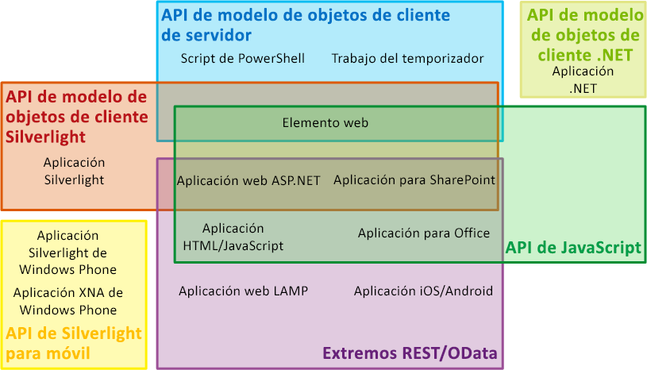
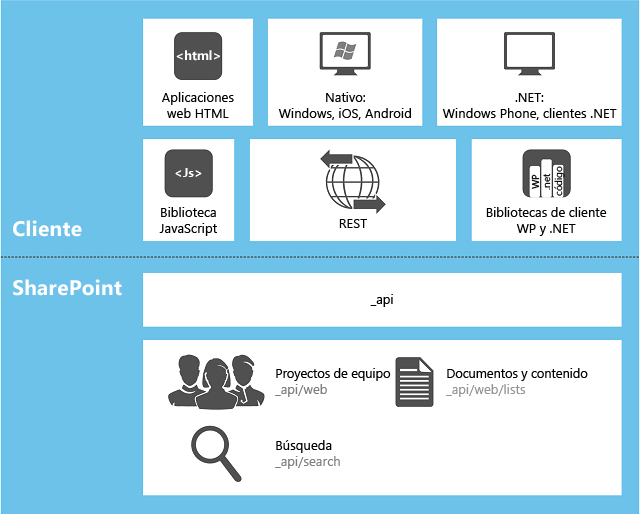

# Elegir el conjunto de API correcto en SharePoint 2013
Información sobre los distintos conjuntos de API proporcionados en SharePoint 2013, que incluyen los diversos modelos de objetos de cliente, el modelo de objetos de servidor y el servicio web REST/OData.
**Vea el vídeo: estrategia de SharePoint 2013 para el modelo de objetos de cliente (CSOM) y REST de SharePoint**

  
    
    

  
    
    

  
    
    

  
    
    

  
    
    

## Factores que determinan el conjunto de API para usar

Puede elegir entre varios conjuntos de API que puede usar para obtener acceso a la plataforma de SharePoint 2013. La conveniencia de elegir uno u otro depende de varios factores:
  
    
    

- **El tipo de aplicación.** Entre las distintas posibilidades se incluyen las siguientes categorías, aunque no son las únicas y tampoco se excluyen entre sí: Complemento de SharePoint, elementos web de páginas de SharePoint, aplicaciones de Silverlight que se usen en PC o dispositivos móviles cliente, aplicaciones de ASP.NET que se han expuesto en SharePoint con un IFrame, JavaScript que se usen en páginas de sitios de SharePoint, páginas de aplicaciones de SharePoint, aplicaciones de Microsoft .NET Framework que se usen en PC cliente, scripts de Windows PowerShell y trabajos del temporizador que se usen en servidores de SharePoint.
    
  
- **Las habilidades del usuario.** Se sorprenderá de cómo consigue crear aplicaciones en SharePoint 2013 sin necesidad de asimilar cantidades ingentes de información sobre programación de SharePoint. También puede pasar directamente al desarrollo de SharePoint si ya tiene experiencia en alguno de los siguientes modelos de programación:
    
  - JavaScript
    
  
  - ASP.NET
    
  
  - REST/OData
    
  
  - .NET Framework
    
  
  - Windows Phone
    
  
  - Silverlight
    
  
  - Windows PowerShell
    
  
- **El dispositivo en el que se usa el código.** Entre las distintas posibilidades disponibles se encuentran los servidores de granjas de servidores de SharePoint, los servidores externos (por ejemplo, en la nube), los PC cliente y los dispositivos móviles.
    
  
Este tema proporciona una descripción general de los distintos conjuntos de API que proporciona SharePoint 2013. La Figura 1 muestra qué conjuntos de API pueden usarse para desarrollar cada una de las 13 aplicaciones comunes relacionadas con SharePoint. Para muchas de ellas, puede elegir más de una API.
  
    
    

**Figura 1: Conjuntos de API de SharePoint y tipos de extensión de SharePoint seleccionados**

  
    
    

  
    
    

  
    
    

  
    
    
La siguiente tabla proporciona una guía sobre qué conjunto de API usar para una lista seleccionada de proyectos de extensibilidad de SharePoint comunes. Las secciones restantes de este tema describen los distintos conjuntos de API.
  
    
    

|**Si desea usar esto...**|**...use estas API**|
|:-----|:-----|
|Cree una aplicación web ASP.NET que haga tareas de crear/leer/actualizar/eliminado (CRUD) a través de un firewall en los datos de SharePoint o los datos externos que aparecen en SharePoint con un tipo de contenido externo de Servicios de conectividad empresarial de Microsoft (BCS)    |Modelo de objetos de cliente JavaScript    |
|Cree una aplicación web de ASP.NET que haga tareas CRUD en datos de SharePoint o datos externos que aparecen en SharePoint con un tipo de contenido externo BCS pero que no necesita llamar a SharePoint a través de un firewall    |Modelo de objetos de cliente .NET Framework, modelo de objetos de cliente Silverlight o extremos REST/OData    |
|Cree una aplicación web de LAMP que haga tareas CRUD en datos de SharePoint o datos externos que aparecen en SharePoint con un tipo de contenido externo BCS    |Extremos REST/OData    |
|Cree una aplicación de Windows Phone que haga tareas CRUD en datos de SharePoint    |Modelo de objetos de cliente móvil    |
|Cree una aplicación de Windows Phone que use el Servicio de alerta de notificaciones de Microsoft para que envíe avisos al dispositivo móvil sobre eventos en SharePoint    |Modelo de objetos de servidor y modelo de objetos de cliente móvil    |
|Cree una aplicación iOS o Android que haga tareas CRUDQ en datos de SharePoint    |Extremos REST/OData    |
|Cree una aplicación de .NET Framework que haga tareas CRUD en datos de SharePoint    |Modelo de objetos de cliente .NET Framework    |
|Cree una aplicación de Silverlight que haga tareas CRUD en datos de SharePoint    |Modelo de objetos de cliente Silverlight    |
|Cree una aplicación HTML/ JavaScript que haga tareas CRUD en datos de SharePoint    |Modelo de objetos de cliente JavaScript    |
|Cree un Complemento de Office que funcione con SharePoint    |Modelo de objetos de cliente JavaScript    |
|Cree un comando personalizado de Windows PowerShell    |Modelo de objetos de servidor    |
|Cree un trabajo de temporizador    |Modelo de objetos de servidor    |
|Cree una extensión de Administración central    |Modelo de objetos de servidor    |
|Cree una personalización de marca uniforme en una granja completa de servidores de SharePoint    |Modelo de objetos de servidor    |
|Cree un elemento web personalizado, una página de aplicación o un control de usuario de ASP.NET    |Modelo de objetos de servidor    > **IMPORTANTE**> Si las funciones que desea ofrecer a los clientes no están orientadas a la administración de SharePoint en un ámbito más amplio que la colección de sitios, le recomendamos, en lugar de usar el modelo de objetos de servidor, crear un Complemento de SharePoint que incluya una aplicación web remota de ASP.NET con elementos web personalizados y controles de usuario según sea necesario. Vea las dos filas superiores de esta tabla.           |
   

## Modelo de objetos de servidor

El conjunto de API de mayor tamaño se encuentra en el modelo de objetos de servidor de las clases administradas. En el nivel de SharePoint Foundation 2013, este modelo de objetos contiene las clases y los miembros que habilitan el control de programación de la estructura básica de la lista y el sitio de SharePoint Foundation. La mayor parte de estas clases se encuentran en el espacio de nombres  [Microsoft.SharePoint](https://msdn.microsoft.com/library/Microsoft.SharePoint.aspx) . También, puede extender prácticamente todos los componentes de SharePoint Foundation con el modelo de objetos de servidor, incluidos flujos de trabajo, alertas, elementos web, búsqueda básica y Servicios de conectividad empresarial de Microsoft (BCS). El modelo de objetos de servidor también incluye un extenso conjunto de API que habilitan las extensiones del sistema de seguridad y administración de SharePoint Foundation, que incluye copias de seguridad, diagnósticos y acciones de mantenimiento de la granja, registros, administración de aplicaciones web y de la granja, actualizaciones, implementaciones, y acciones de almacenamiento en la memoria caché y personalización de Windows PowerShell.
  
    
    
En el nivel de SharePoint Server 2013, puede agregar muchas otras clases para habilitar la programación de administración de contenido empresarial (ECM, Enterprise Content Management), perfiles de usuario, taxonomía, búsqueda avanzada y otras características de SharePoint Server 2013.
  
    
    
Si desea hacer una consulta en una colección del tipo **IEnumerable**,  [LINQ a objetos](http://msdn.microsoft.com/es-es/library/bb397919.aspx) le permitirá hacer consultas en cualquier colección que se encuentre almacenada en la memoria. Pero, existe un [proveedor de LINQ para SharePoint](http://msdn.microsoft.com/library/3fa2dc5f-d308-4337-aefd-191a5df8dbbe%28Office.15%29.aspx) que permite hacer consultas directas en las listas de las bases de datos de contenido de SharePoint. Aunque, en un sentido estricto, este proveedor no se encuentra disponible para ningún otro conjunto de API de los que incluye este tema, existen formas de usar la sintaxis de LINQ en la mayoría de los demás.
  
    
    
Cuando haga la instalación de SharePoint 2013, se instalarán también en la memoria caché global de ensamblados de cada servidor los ensamblados que definen las clases de servidor integradas. Cuando programe en el modelo de objetos de servidor, los ensamblados se instalarán como soluciones de granja de servidores en la memoria caché global de ensamblados.
  
    
    

> **NOTA**
> El desarrollo de nuevos soluciones de espacio aislado en SharePoint 2013 está en desuso para desarrollar Complementos de SharePoint, pero soluciones de espacio aislado aún puede instalarse en las colecciones de sitios en SharePoint 2013. Los ensamblados de estas soluciones permanecen en el paquete, salvo cuando en realidad se usan, en el momento en que se instalan temporalmente en una carpeta del servidor. Para más información, vea  [¿Dónde se implementan los ensamblados en las soluciones de espacio aislado?](http://msdn.microsoft.com/library/dadbb20b-1bf7-442c-9eeb-bd9f01dbda45%28Office.15%29.aspx). 
  
    
    

### Limitaciones de uso del modelo de objetos de servidor

La lógica personalizada de Complementos de SharePoint siempre se distribuye "en sentido descendente" al cliente o "en sentido ascendente" a la nube (o "alrededor", hacia algún servidor externo a la granja de servidores de SharePoint). En todos esos modelos de distribución, es necesario usar un modelo de objetos de cliente o los extremos REST/OData (no puede usar el modelo de objetos de servidor en un Complemento de SharePoint). Por ejemplo, si una aplicación contiene páginas hospedadas en SharePoint, dichas páginas pueden obtener acceso a los datos de SharePoint a través del modelo de objetos de cliente de JavaScript. Estas páginas también podrían exponer aplicaciones de Silverlight que usen el modelo de objetos de cliente de SharePoint 2013Silverlight. Para más información sobre Complementos de SharePoint, vea  [Aspectos importantes del panorama de desarrollo y arquitectura de los complementos para SharePoint](http://msdn.microsoft.com/library/ae96572b-8f06-4fd3-854f-fc312f7f2d88%28Office.15%29.aspx).
  
    
    

## Modelos de objetos de cliente para código administrado

SharePoint 2013 dispone de tres modelos de objetos de cliente para código administrado: .NET, Silverlight y móvil.
  
    
    

### El modelo de objetos de cliente de .NET

El modelo de objetos de SharePoint 2013 para .NET Framework se usa en aplicaciones de .NET Framework que se usan en clientes de Windows que no son teléfonos, por ejemplo, cualquiera de los siguientes:
  
    
    

- El PC de un usuario.
    
  
- Un servidor externo a la granja de servidores de SharePoint 2013.
    
  
- Un rol web o de trabajo de Microsoft Azure.
    
  
Casi todas las clases del modelo de objetos de servidor de la lista y el sitio principal cuentan con su clase correspondiente en el modelo de objetos de cliente de .NET Framework. Del mismo modo, el modelo de objetos de cliente de .NET Framework también expone un conjunto completo de API para ampliar otras características, incluidas algunas características de SharePoint Server 2013 como ECM, taxonomía, perfiles de usuario, búsqueda avanzada, análisis, BCS, etc.
  
    
    
Para obtener un mejor rendimiento, las líneas de código que se escriben en el modelo de objetos de cliente de .NET Framework se envían al servidor de SharePoint en lotes, se convierten en código de servidor y se usan. Posteriormente, se devuelven al cliente los resultados que se han consultado y el nuevo estado de todas las variables. Como desarrollador, determine si los lotes se usan de forma sincrónica o asincrónica. En el primer caso, la aplicación de .NET Framework no podrá continuar hasta que el servidor devuelva los resultados. En el segundo, el procesamiento del cliente se reanudará de forma inmediata y la interfaz de usuario del mismo (IU) seguirá respondiendo con normalidad.
  
    
    
Si lo desea, para hacer una consulta en cualquier objeto **IEnumerable** (por ejemplo, en los objetos de SharePoint 2013 que implementan **IEnumerable**) puede usar la sintaxis de consulta de LINQ en el código de cliente. Pero, si opta por este método tenga en cuenta que usará  [LINQ a objetos](http://msdn.microsoft.com/es-es/library/bb397919.aspx) en lugar del [proveedor de LINQ para SharePoint](http://msdn.microsoft.com/library/3fa2dc5f-d308-4337-aefd-191a5df8dbbe%28Office.15%29.aspx), por lo que la documentación de este último no resultará relevante para el código de cliente.
  
    
    
Los ensamblados del modelo de objetos de cliente de .NET Framework deben instalarse en el cliente. Se incluyen en un paquete redistribuible que puede conseguir en  [Componentes de cliente de SharePoint](http://www.microsoft.com/en-us/download/details.aspx?id=35585).
  
    
    
Para obtener ejemplos del uso del modelo de objetos de .NET Framework, vea  [Realizar operaciones básicas con código de biblioteca de cliente de SharePoint 2013](http://msdn.microsoft.com/library/5a69c9e3-73bf-4ed5-bc19-182056bdb394%28Office.15%29.aspx).
  
    
    

> **NOTA**
> También puede usar los extremos REST/OData de SharePoint en una aplicación .NET Framework. Para ver una comparación del modelo de objetos de cliente .NET Framework con los extremos REST/OData de SharePoint, vea la sección  [Extremos REST/OData](#RESTOData) que aparece después en este artículo.
  
    
    

### Modelo de objetos de cliente de Silverlight

El modelo de objetos de SharePoint 2013 para Silverlight se usa en las aplicaciones de Silverlight, independientemente de la ubicación del archivo .xap compilado. Puede encontrarse en una biblioteca de activos de un sitio web de SharePoint 2013, en un PC cliente, en el almacenamiento en nube o en un servidor externo. Por lo general, en SharePoint 2013 las aplicaciones de Silverlight se exponen en un  [SilverlightWebPart](https://msdn.microsoft.com/library/Microsoft.SharePoint.WebPartPages.SilverlightWebPart.aspx) . El modelo de objetos de cliente de Silverlight de SharePoint 2013 es prácticamente idéntico al modelo de objetos de cliente de .NET Framework, y es compatible con las mismas áreas de extensibilidad. La principal diferencia radica en que, en la versión de Silverlight, todos los lotes de comandos se envían al servidor de forma asincrónica, por lo que la IU de la aplicación permanece activa.
  
    
    
Los ensamblados del modelo de objetos de cliente de Silverlight pueden guardarse en cualquier servidor de SharePoint 2013, en %ProgramFiles%\\Common Files\\Microsoft Shared\\web server extensions\\15\\TEMPLATE\\LAYOUTS\\ClientBin. Aunque no es necesario, si lo desea puede instalarlos en el PC donde se inicia la aplicación de Silverlight y empaquetarlos en el archivo .xap de la aplicación.
  
    
    
Los archivos .xap de Silverlight también pueden guardarse en Complementos de SharePoint, incluidas las aplicaciones que se hospedan en SharePoint. En este último caso, el archivo .xap se implementa en una biblioteca de la web de la aplicación. Para más información sobre las webs de aplicaciones, vea  [Hospedar webs, webs de complementos y componentes de SharePoint en SharePoint 2013](http://msdn.microsoft.com/library/b791cdf5-8aa2-47fa-bc4c-aee437354759%28Office.15%29.aspx). Las posibilidades que este procedimiento plantea para las aplicaciones pueden incluir código de SharePoint personalizado muy interesantes para las aplicaciones de Silverlight, en cuanto, especialmente teniendo en cuenta que no se admite código de servidor en Complementos de SharePoint. Del mismo modo, permite a los desarrolladores de Silverlight usar sus habilidades para crear aplicaciones de SharePoint 2013 con una curva de aprendizaje mínima.
  
    
    

> **NOTA**
> También puede usar los extremos REST/OData de SharePoint en una aplicación Silverlight. Para ver una comparación del modelo de objetos de cliente Silverlight con los extremos REST/OData de SharePoint, vea la sección  [Extremos REST/OData](#RESTOData) que aparece después en este artículo.
  
    
    

### Modelo de objetos de móviles

Existe una versión especial del modelo de objetos de cliente de Silverlight disponible para los teléfonos con Windows Phone. Incluye algunas API adicionales que solo son relevantes para los teléfonos, como las que habilitan las aplicaciones de los teléfonos para registrar las notificaciones de los Servicios de notificaciones de inserción de Microsoft. Aunque admite todas las funciones principales de SharePoint 2013, no es compatible con las áreas de extensibilidad que no son principales y sí admiten los otros dos modelos de objetos de cliente de código administrado. Para obtener acceso a esas áreas adicionales, use los extremos REST/OData de SharePoint en su aplicación móvil. Vea la sección  [Extremos REST/OData](#RESTOData) después en este artículo.
  
    
    
Puede guardar los ensamblados del modelo de objetos de móviles en cualquier servidor de SharePoint 2013, en %ProgramFiles%\\Common Files\\Microsoft Shared\\web server extensions\\15\\TEMPLATE\\LAYOUTS\\ClientBin. Se empaquetan en el archivo .xap de la aplicación para Windows Phone.
  
    
    

## Modelo de objetos JavaScript

SharePoint 2013 ofrece un modelo de objetos de JavaScript que puede usar en archivos .js independientes o en script en línea, e incluye las mismas funciones que los modelos de objetos de cliente de .NET Framework y Silverlight. Al igual que este último, el modelo de objetos de Silverlight, el modelo de objetos de JavaScript permite incluir código de SharePoint personalizado en una aplicación de un modo muy eficaz, dado que no se admite código de servidor personalizado en Complementos de SharePoint. También permite a los desarrolladores web usar las aptitudes de JavaScript existentes para crear aplicaciones de SharePoint con una curva de aprendizaje mínima.
  
    
    
Tal como ocurre con los modelos de objetos de cliente de código administrado, la infraestructura de JavaScript para SharePoint 2013 interactúa con los servidores de la granja de servidores en lotes, que siempre se usan de forma asincrónica. También, ahora ya puede obtener acceso a los datos de SharePoint a través de los dominios de JavaScript (aunque únicamente podrá obtener acceso a aquellos datos que se encuentren ubicados en la misma colección del sitio primario), posibilidad que no permitían las versiones anteriores de SharePoint. Para más información, vea  [Cómo obtener acceso a los datos de SharePoint 2013 desde aplicaciones con la biblioteca entre dominios](http://msdn.microsoft.com/library/bc37ff5c-1285-40af-98ae-01286696242d%28Office.15%29.aspx). El servidor devuelve los datos en Notación de objetos de JavaScript (JSON).
  
    
    
El modelo de objetos de JavaScript se define en un conjunto de archivos *.js, que se encuentran ubicados en %ProgramFiles%\\Common Files\\Microsoft Shared\\web server extensions\\15\\TEMPLATE\\LAYOUTS en todos los servidores.
  
    
    
Para obtener ejemplos del uso del modelo de objetos de .NET Framework, vea  [Completar operaciones básicas con código de biblioteca de JavaScript en SharePoint 2013](http://msdn.microsoft.com/library/29089af8-dbc0-49b7-a1a0-9e311f49c826%28Office.15%29.aspx).
  
    
    

> **NOTA**
> También puede usar los extremos REST/OData de SharePoint en una aplicación JavaScript. Para ver una comparación del modelo de objetos de cliente JavaScript con los extremos REST/OData de SharePoint, vea la siguiente sección  [Extremos REST/OData](#RESTOData). 
  
    
    

## Extremos REST/OData

Para aquellos escenarios en que es necesario obtener acceso a entidades de SharePoint desde tecnologías de cliente que no usan JavaScript y no se encuentran integradas en las plataformas .NET Framework o Silverlight, SharePoint 2013 ofrece la implementación de un servicio web de transferencia de estado representacional (REST, Representational State Transfer), que usa el  [protocolo OData](http://www.odata.org/) para hacer las tareas de creación, lectura, actualización, eliminación y consulta (CRUDQ, Create, Read, Update, Delete, and Query) en datos de lista de SharePoint. Además, prácticamente todas las API de los modelos de objetos de cliente disponen de su correspondiente extremo de REST. Esto permite al código interactuar directamente con los artefactos SharePoint a través de cualquier tecnología compatible con las capacidades estándar de REST. Para usar las capacidades de REST que se encuentran integradas en SharePoint 2013, el código construye una solicitud HTTP RESTful para un extremo correspondiente a la API del modelo de objetos de cliente que el usuario especifica. El servicio web de client.svc controla la solicitud HTTP y emite una respuesta en formato Atom o JSON.
  
    
    
Para más información sobre el uso del servicio web REST/OData, vea el nodo  [Cómo programar con el servicio REST de SharePoint 2013](use-odata-query-operations-in-sharepoint-rest-requests.md); para ejemplos, vea el tema  [Procedimiento para realizar operaciones básicas con extremos REST de SharePoint 2013](http://msdn.microsoft.com/library/e3000415-50a0-426e-b304-b7de18f2f7d9%28Office.15%29.aspx).
  
    
    

### Comparar programación REST/OData con programación de modelos de objetos de clientes

En algunas situaciones, puede resultar mejor usar los extremos REST incluso en aplicaciones para las que se encuentra disponible un modelo de objetos de SharePoint, especialmente para desarrolladores que no tienen experiencia en desarrollo en Windows. En la siguiente tabla, se muestra una comparación de las características principales de estas opciones de programación para un desarrollador que crea una aplicación en una plataforma Windows o con una plataforma que admite JavaScript.
  
    
    

|**Característica**|**Modelos de objetos de .NET Framework o Silverlight**|**Modelo de objetos de JavaScript**|**Extremos REST/OData llamados desde JavaScript o una plataforma Windows**|
|:-----|:-----|:-----|:-----|
|Programación orientada a objetos    |Sí    |Sí    |No    |
|Procesamiento por lotes    |Sí    |Sí    |Sí    |
|API para procesamiento condicional y control de excepciones    |Yes    |No    |No    |
|Disponibilidad de sintaxis de LINQ    |Sí    |No    |No    |
|Combinar datos de lista de diferentes aplicaciones web de SharePoint    |Sí    |No    |Sí    |
|Familiaridad con desarrolladores REST/OData experimentados    |No    |No    |Sí    |
|Similitud con programación que no pertenece a Windows o JavaScript    |No    |Sí    |Sí    |
|Escritura segura para campos de elemento de lista    |No (excepto con LINQ)    |No    |Sí, desde plataforma Windows           No, desde JavaScript    |
|Aprovechar jQuery, Reserva de color y otras bibliotecas JavaScript    |No    |Sí    |No, desde plataforma Windows           Sí, desde JavaScript    |
   

## Marco de WCF Data Services

SharePoint 2013 admite  [WCF Data Services](http://msdn.microsoft.com/es-es/library/cc668792.aspx) como proveedor de LINQ, por si prefiere usar la sintaxis de LINQ en las aplicaciones cliente .NET Framework o Silverlight. Puede seleccionar listdata.svc (solo para los datos de lista), como en las versiones anteriores de SharePoint Foundation, o seleccionar client.svc (compatible con la interfaz de OData) para obtener acceso a los datos de lista y también a todas las entidades de SharePoint. Para más información, vea [Consultas a SharePoint Foundation con los servicios de datos de ADO.NET](http://msdn.microsoft.com/library/3e3e16f7-620a-4710-a3f3-19d0236f4b4a%28Office.15%29.aspx).
  
    
    
La figura 2 muestra la relación existente entre las distintas API de cliente, los diversos tipos de aplicaciones cliente y SharePoint. Las distintas direcciones URL _api* son las relativas a la granja de servidores de las API de extremos de REST. Para más información, vea el tema  [Información sobre el servicio REST de SharePoint 15](get-to-know-the-sharepoint-2013-rest-service.md#bk_learnmore).
  
    
    

**Figura 2: Aplicaciones cliente y API de SharePoint**

  
    
    

  
    
    

  
    
    

  
    
    

  
    
    

## Conjuntos de API en desuso

Existen dos conjuntos de API compatibles con el marco de SharePoint 2013 para compatibilidad con versiones anteriores, pero que recomendamos no usar para proyectos nuevos: los  [servicios web de ASP.NET (asmx)](http://msdn.microsoft.com/library/c587ee90-1f88-43f3-b1a7-5f3072d038f8%28Office.15%29.aspx) y las [llamadas a procedimiento remoto (RPC) de forma directa al archivo owssvr.dll](http://msdn.microsoft.com/library/4aa5c82b-90fb-4be5-b30c-d35ecae42a81%28Office.15%29.aspx).
  
    
    

## Recursos adicionales

-  [Información general sobre el desarrollo de SharePoint 2013](sharepoint-2013-development-overview.md)
    
  
-  [Modelos de programación en SharePoint 2013](programming-models-in-sharepoint-2013.md)
    
  
-  [Complementos para SharePoint comparadas con las soluciones de SharePoint](sharepoint-add-ins-compared-with-sharepoint-solutions.md)
    
  
-  [Cómo programar con el servicio REST de SharePoint 2013](use-odata-query-operations-in-sharepoint-rest-requests.md)
    
  
-  [Procedimiento para realizar operaciones básicas con extremos REST de SharePoint 2013](http://msdn.microsoft.com/library/e3000415-50a0-426e-b304-b7de18f2f7d9%28Office.15%29.aspx)
    
  
-  [Realizar operaciones básicas con código de biblioteca de cliente de SharePoint 2013](http://msdn.microsoft.com/library/5a69c9e3-73bf-4ed5-bc19-182056bdb394%28Office.15%29.aspx)
    
  
-  [Completar operaciones básicas con código de biblioteca de JavaScript en SharePoint 2013](http://msdn.microsoft.com/library/29089af8-dbc0-49b7-a1a0-9e311f49c826%28Office.15%29.aspx)
    
  
-  [Consultas a SharePoint Foundation con los servicios de datos de ADO.NET](http://msdn.microsoft.com/library/3e3e16f7-620a-4710-a3f3-19d0236f4b4a%28Office.15%29.aspx)
    
  

  
    
    
