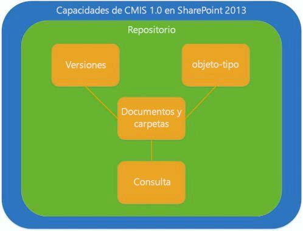
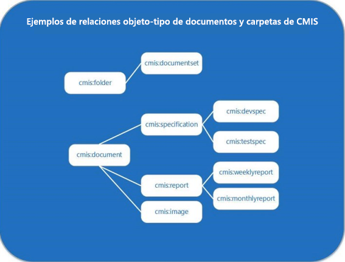

# Servicios de interoperabilidad de administración de contenido (CMIS) en SharePoint 2013
Infórmese sobre la implementación de SharePoint 2013 de la versión 1.0 del estándar Servicios de interoperabilidad de administración de contenido (CMIS) de OASIS.
## Introducción a CMIS en SharePoint 2013

El cumplimiento de SharePoint Server con la versión 1.0 del  [estándar Servicios de interoperabilidad de administración de contenido (CMIS) de OASIS](https://www.oasis-open.org/committees/tc_home.php?wg_abbrev=cmis) permite la integración entre los repositorios de contenido de SharePoint Server y otros repositorios de administración de contenido empresarial (ECM) en una empresa. CMIS permite compartir información a través de protocolos de Internet entre sistema de documentos, publicadores y repositorios tanto dentro de la empresa como entre compañías, y todo en un formato de proveedor neutral. El estándar CMIS admite operaciones de administración de documentos básicas, como crear, leer, actualizar, eliminar, proteger y desproteger, así como de administración de versiones de documentos y sus metadatos. CMIS está disponible en cualquier sitio local de SharePoint 2013 después de activar la función **Productor de Servicios de interoperabilidad de administración de contenido (CMIS)** en la sección **Administrar las características del sitio** en **Configuración del sitio**. En SharePoint 2013, el productor de CMIS de SharePoint está disponible, pero se encuentra desactivado de manera predeterminada en todos los sitios locales.
  
    
    
CMIS ofrece interoperabilidad entre las API que lo admiten, pero no sustituye a las API nativas. Los objetos que CMIS admite incluyen los objetos con los que suelen trabajar los desarrolladores de SharePoint Server, como documentos y carpetas, pero, probablemente, los desarrolladores que escriban aplicaciones compatibles con CMIS tendrán que seguir escribiendo código personalizado de SharePoint Server. CMIS puede ahorrarle un 60 o 70 % de tiempo de desarrollo para las soluciones que lo implementan, así que se puede considerar una herramienta más del cuadro de herramientas de desarrollo.
  
    
    

## Análisis de la implementación de CMIS en SharePoint 2013

Algunas partes de la especificación de CMIS son obligatorias, pero muchas otras son opcionales. Muchos proveedores, incluido Microsoft, implementan las partes obligatorias del estándar y algunos de los componentes opcionales. En la ilustración 1 se ven las capacidades detalladas en la especificación CMIS 1.0 que están implementadas en SharePoint 2013.
  
    
    
Ilustración 1. Capacidades de CMIS 1.0 implementadas en SharePoint 2013.
  
    
    

  
    
    

  
    
    
El modelo de datos de CMIS define un repositorio que contiene los otros tipos de datos de CMIS, incluidos los tipos de objetos, el control de versiones, documentos y carpetas, y las funciones de consulta.
  
    
    

### Repositorios de CMIS y bibliotecas de documentos de SharePoint

El repositorio de CMIS es el contenedor del resto del modelo de datos de CMIS. En SharePoint 2013, la biblioteca de documentos es el equivalente al repositorio de CMIS (en el Productor de CMIS de SharePoint 2013 no se admiten listas). El acceso al repositorio suele ser el punto de partida de una aplicación cliente. Por ejemplo, pensemos en un sitio de SharePoint Server que contiene varias bibliotecas de documentos, que son equivalentes a repositorios en CMIS. La especificación de CMIS describe un servicio obligatorio, **getRepositories**, que en SharePoint Server obtiene todos los repositorios válidos (bibliotecas de documentos) en el objeto  [SPWeb](https://msdn.microsoft.com/library/Microsoft.SharePoint.SPWeb.aspx) actual. Un desarrollador puede conectarse a los repositorios llamando al servicio **getRepositories** o al servicio **getRepositoryInfo**; **getRepositoryInfo** obtiene el repositorio especificado por el desarrollador.
  
    
    
El repositorio de CMIS contiene las otras capacidades de CMIS que SharePoint Server admite, incluidos los tipos de objeto de documento y carpeta especificados por CMIS, las capacidades de control de versiones de CMIS (que reflejan las capacidades nativas de control de versiones de SharePoint Server) y la capacidad de consulta de CMIS, que usa una sintaxis de tipo SQL para consultar datos concretos a los repositorios de CMIS.
  
    
    

### Documentos, carpetas y otros tipos de objetos de CMIS

CMIS define una capacidad de tipo de objeto que es equivalente a la idea de los tipos de contenido en SharePoint Server (concretamente, la clase [SPContentType](https://msdn.microsoft.com/library/Microsoft.SharePoint.SPContentType.aspx) ). Cada tipo de objeto de CMIS de solo lectura consta de atributos y definiciones de propiedades. Los atributos definen si un objeto se puede consultar o versionar, por ejemplo. CMIS admite las definiciones de propiedades para las propiedades que están asociadas a tipos de objetos equivalentes en SharePoint 2013 según corresponda. Por ejemplo, un objeto de documento o de carpeta de CMIS puede tener una propiedad **LastModifiedBy**, que usa esta sintaxis:  `cmis:LastModifiedBy`. Una propiedad **Author** asociada con un objeto **Document** se escribe como `cmis:Author`. El estándar CMIS define cuatro tipos de objetos, que son los tipos básicos. En la tabla 1 se describen los tipos de objetos de CMIS, si son compatibles con SharePoint 2013 y su función equivalente en SharePoint (si existe).
  
    
    

  
    
    

**Tabla 1. Valores de tipo de objeto de CMIS y sus equivalentes de SharePoint 2013**

|**Tipo de objeto de CMIS**|**¿Se admite en SharePoint Server?**|**Función equivalente de SharePoint 2013**|**Descripción**|
|:-----|:-----|:-----|:-----|
|documento    |sí    |Objetos **Document**   |El tipo de objeto "documento" de CMIS se asigna directamente al objeto **Document** en SharePoint Server.   Los documentos tienen propiedades y una secuencia de contenido unida a ellos, se pueden versionar y admiten las operaciones básicas de creación, lectura, actualización y eliminación (CRUD).    |
|carpeta    |sí    |Objetos  [SPFolder](https://msdn.microsoft.com/library/Microsoft.SharePoint.SPFolder.aspx)   |El tipo de objeto "carpeta" de CMIS se asigna directamente al objeto **SPFolder** en SharePoint Server.   Las carpetas pueden contener documentos y otras carpetas, y deben tener una sola carpeta principal. Las carpetas tienen propiedades unidas a ellas y admiten las mismas operaciones de CRUD que admite el objeto de documento.    Las carpetas de CMIS no se pueden versionar.    |
|directiva    |no    |ninguna    |El tipo de objeto "directiva" de CMIS no es equivalente al concepto de directiva en SharePoint ni a ningún objeto de directiva definido en el modelo de objetos de SharePoint.    |
|relación    |no    |ninguna    |No se admite.    |
   

  
    
    
CMIS no ofrece métodos para crear, modificar ni eliminar tipos de objeto. Los desarrolladores que quieran crear, modificar o eliminar un tipo de objeto de SharePoint Server de documento o carpeta pueden usar el modelo de objetos privado de SharePoint Server.
  
    
    
En la ilustración 2 se ve un ejemplo de las relaciones que pueden existir entre los tipos de objeto de documento y carpeta de CMIS. En la ilustración se usan las etiquetas que se pueden encontrar en un escenario de administración de documentos de SharePoint Server. Por ejemplo, un tipo de objeto de CMIS denominado **cmis:folder** es el principal de un tipo de objeto denominado **cmis:documentset**. El **cmis:documentset** puede contener objetos de documento organizados en un objeto [DocumentSet](https://msdn.microsoft.com/library/Microsoft.Office.DocumentManagement.DocumentSets.DocumentSet.aspx) de , aunque no es necesario.
  
    
    
El tipo de objeto "documento" de CMIS también admite relaciones de tipo primario-secundario, tal como se ve aquí, donde el tipo de objeto **cmis:document** es el principal de los tipos de objeto **cmis:specification**, **cmis:report** y **cmis:image**. Estos documentos podrían estar organizados en conjuntos de documentos de SharePoint Server, pero CMIS no define construcciones de este tipo. Lo que CMIS hace es reorganizar objetos individuales como si formaran parte del tipo de objeto de documento o carpeta, o como subconjunto de cualquiera de estos dos tipos de objeto.
  
    
    
Ilustración 2. Ejemplos del tipo de objeto de documento y del tipo de objeto de carpeta de CMIS
  
    
    

  
    
    

  
    
    

  
    
    

  
    
    

### Consulta de CMIS en SharePoint 2013

La consulta es una parte opcional de la especificación de CMIS que SharePoint Server admite. La consulta de CMIS usa una sintaxis simplificada de tipo SQL. Todas las consultas de CMIS se incluyen en el ámbito de un repositorio, de modo que todos los resultados de consulta se devuelven desde el único repositorio en cuyo ámbito se engloba la consulta. Al ejecutar varias consultas en varios repositorios, se devuelven resultados de un repositorio para cada consulta realizada, lo cual hace que se devuelvan resultados de varios repositorios. En la tabla 2 se recogen ejemplos de instrucciones de consulta básicas de CMIS.
  
    
    

  
    
    

**Tabla 2. Ejemplos de sintaxis de consulta de CMIS**

|**Instrucción de consulta de CMIS**|**Descripción**|
|:-----|:-----|
| `SELECT * FROM cmis:document`   |Selecciona todos los documentos de un repositorio.    |
| `SELECT cmis:name, cmis:author FROM cmis:document WHERE cmis:author='Tina Makovec'`   |Selecciona el nombre y el autor de cualquier documento del repositorio donde el autor sea igual a Tina Makovec.    |
| `SELECT * FROM cmis:document WHERE CONTAINS('4Q13')`   |Este es un ejemplo de una búsqueda de texto completo donde se usa CONTAINS. Esta consulta devuelve los documentos que haya en el repositorio con la palabra 4Q13.    |
   

  
    
    
SharePoint Server no admite combinaciones, pero la especificación CMIS 1.0 sí. Los repositorios de CMIS que no son de SharePoint pueden admitir combinaciones en su implementación de la consulta de CMIS. Todos los repositorios que admiten la consulta de CMIS permiten ordenar, seleccionar qué propiedades devolver y la paginación.
  
    
    

### Control de versiones de CMIS y control de versiones de SharePoint

El control de versiones de CMIS es idéntico al control de versiones de documentos en SharePoint Server: en CMIS solo se admiten operaciones de control de versiones principales y secundarias, así como de protección y desprotección, para los documentos.
  
    
    
Las carpetas no se pueden versionar.
  
    
    

### Compatibilidad con el registro de cambios de CMIS

CMIS incluye un concepto de registro de cambios. Los registros de cambios de CMIS admiten eventos básicos de creación, actualización y eliminación que están unidos a un id. de objeto y a propiedades. Las propiedades se desencadenan cuando se produce un evento de creación, actualización o eliminación. El registro de cambios también admite la paginación: así, los desarrolladores pueden almacenar su propio registro de cambios donde quieran.
  
    
    

## Autenticación y CMIS en SharePoint 2013

De manera predeterminada, SharePoint Server admite la autenticación para Anonymous AuthN, Basic AuthN, NTLM AuthN, Digest AuthN, Transición de protocolo Kerberos/Delegación restringida, notificaciones de Windows, Claims MultiAuth y modo mixto de notificaciones.
  
    
    
No se admite OAuth entrante.
  
    
    

## El Productor de CMIS en SharePoint 2013

El Productor de CMIS está disponible, de manera predeterminada, en SharePoint Server para las implementaciones locales. El productor crea extremos conformes con CMIS con los que pueden interoperar los servicios web del consumidor conformes a CMIS. La compatibilidad de CMIS y la función del Productor de CMIS están disponibles en todas las implementaciones locales de SharePoint Server donde la función del Productor de CMIS esté activada. CMIS no se admite en SharePoint Online.
  
    
    

## Escenarios de CMIS e ideas de aplicaciones

Con las capacidades de CMIS que hay en SharePoint 2013, los desarrolladores pueden crear aplicaciones que incorporen datos conformes a CMIS procedentes de SharePoint Server y de otras aplicaciones conformes a CMIS. Como CMIS es un formato de proveedor neutral, los desarrolladores pueden escribir código que produzca extremos compatibles con CMIS que se pueden compartir con aplicaciones de consumidor conformes a CMIS sin tener que escribir código en la API de la aplicación nativa. Por ejemplo, el Productor de CMIS predeterminado de SharePoint 2013 puede compartir un repositorio de CMIS (por ejemplo, una biblioteca de documentos de SharePoint Server) con una aplicación de edición de fotos de otro proveedor. Un usuario puede abrir un archivo de imagen que esté almacenado en el repositorio de CMIS del productor de la aplicación de edición de fotos y desprotegerlo en SharePoint Server desde dentro de la aplicación de edición de fotos. Después de hacer los cambios y guardarlos, el usuario puede, desde la aplicación de edición de fotos, proteger la última versión en la biblioteca de documentos de SharePoint Server. Como la especificación de CMIS define el control de versiones en términos de versiones principales y secundarias en el mismo modo que SharePoint, el usuario de la aplicación de edición de fotos guarda los cambios en una versión dentro del repositorio de CMIS usando una lógica de control de versiones idéntica a la lógica de SharePoint Server.
  
    
    
Al crear una aplicación, puede usar código que implemente un diccionario que inicialice todos los parámetros. Los parámetros se usan para autenticar en repositorios y especifican datos como el enlace que está en uso (por ejemplo, REST, AtomPub, SOAP), la dirección URL para que el servidor obtenga acceso al extremo REST, el nombre de usuario, la contraseña y la clase del proveedor de autenticación (por ejemplo, Basic AuthN). Cuando los parámetros están configurados, el desarrollador puede usar la llamada **getRepositories** para conectar con cada repositorio.
  
    
    
CMIS permite el desarrollo de una amplia gama de aplicaciones que consumen datos de varios productores de CMIS. CMIS está diseñado para admitir los escenarios a los que se suelen enfrentar las empresas al administrar contenido en varios sistema de administración de contenido en entornos híbridos enriquecidos, entre otros: 
  
    
    

- Migración de datos a los sistemas de administración de contenido de una empresa y desde ellos.
    
  
- Interfaces de usuario gráficas (GUI) en aplicaciones que leen datos de varios repositorios de contenido.
    
  
- Un elemento web de SharePoint que use CMIS para resumir datos personales de varios sistemas de administración de contenido heredado dentro de una empresa.
    
  
- Una aplicación móvil que pueda obtener acceso a documentos desde cualquier sistema de ECM.
    
  
- Una aplicación de edición de fotos que guarde archivos en un repositorio de CMIS con funciones de ECM habilitadas, como la capacidad de proteger y desproteger archivos.
    
  
- Un sistema de línea de negocio (LOB) que exporte datos de informe a un repositorio de ECM.
    
  
- Una aplicación de aprobación de contratos que use elementos de la interfaz de usuario de SharePoint (UI) para administrar un proceso de aprobación central y que permita que el contrato se publique en varios sistemas diferentes.
    
  

### Ejemplo: aplicación financiera de Contoso

Pensemos que un elemento web de SharePoint Server que consume datos de varios proveedores de datos de CMIS es una aplicación: la aplicación financiera de Contoso. Esta aplicación reúne y tabula datos financieros que están distribuidos en tres servidores: un servidor de IBM, un servidor que ejecuta SharePoint Server y un servidor interno de Contoso. La aplicación de SharePoint Server usa un elemento web para mostrar datos de los tres orígenes dentro de cualquier página de SharePoint Server. La aplicación no necesita código personalizado específico de ninguna implementación del repositorio de CMIS (la biblioteca de documentos de SharePoint Server).
  
    
    

## CMIS y el modelo de objetos de SharePoint

El modelo de objetos de SharePoint ofrece a los desarrolladores más opciones de ampliación que no son compatibles con CMIS, como las API de administración de tipos de objetos, la administración de columnas de sitios o repositorios, consultas que usan palabras clave y sintaxis que son específicas de SharePoint, el etiquetado temático y las entradas de control de acceso (ACE). 
  
    
    
La implementación de CMIS en SharePoint Server usa la propiedad  [BlockedFileExtensions](https://msdn.microsoft.com/library/Microsoft.SharePoint.Administration.SPWebApplication.BlockedFileExtensions.aspx) para obtener una lista de extensiones de archivo que no se pueden subir ni bajar de los sitios de la aplicación web. CMIS respeta los [tipos de archivos que SharePoint bloquea de manera predeterminada](http://technet.microsoft.com/es-es/library/cc262496.aspx).
  
    
    
Los desarrolladores pueden escribir clientes de CMIS en cualquier lenguaje. Por ejemplo, un desarrollador de SharePoint puede usar el modelo de objetos del lado cliente .NET (CSOM) o el modelo de objetos de JavaScript (JSOM) para crear un cliente. También podría usar código del lado servidor para desarrollar una aplicación de SharePoint que esté autohospedada en Microsoft Azure o que esté hospedada por el proveedor en cualquier servidor, como Internet Information Services (IIS) o Microsoft Azure.
  
    
    

## Buscar e interoperar con implementaciones de CMIS de código abierto

Existen muchos proyectos de código abierto que se pueden probar con la implementación de SharePoint 2013 del estándar CMIS 1.0. Algunos ejemplos son el  [proyecto Apache Chemistry](http://chemistry.apache.org); el  [proyecto Open CMIS](http://chemistry.apache.org/java/opencmis.mdl), que prueba las implementaciones de cliente y de servidor de CMIS con Java; el proyecto  [DotCMIS](http://chemistry.apache.org/dotnet/dotcmis.mdl) para el cliente .NET, el [cmislib, una biblioteca de clientes de CMIS para el proyecto Python](http://code.google.com/p/cmislib/); y el  [phpclient, una biblioteca de clientes de CMIS para PHP](http://chemistry.apache.org/php/phpclient.mdl).
  
    
    
El  [área de trabajo de CMIS](http://chemistry.apache.org/java/developing/tools/dev-tools-workbench.mdl) es una aplicación de cliente de escritorio de CMIS para desarrolladores que permite explorar repositorios de CMIS y probar de forma interactiva proyectos de desarrollo de CMIS para Open CMIS. El área de trabajo se puede configurar a través de las propiedades del sistema. Desde el cuadro de diálogo de inicio de sesión para expertos, los desarrolladores también pueden configurar propiedades adicionales.
  
    
    

## Funciones de CMIS 1.1

CMIS 1.1 no se admite en SharePoint 2013, pero la última versión de la especificación de CMIS incluirá funciones nuevas que merece la pena conocer. Algunos aspectos destacados son:
  
    
    

- **Type mutability**: capacidad de crear y modificar tipos de contenido.
    
  
- **Repository features**: capacidad de ampliar el servicio **getRepositoryInfo** para publicar una lista de extensiones en los estándares que admite.
    
  
- **Retention and hold**: servicios para hacer que un documento no se elimine durante un período de tiempo o indefinidamente.
    
  
- **Browser binding**: un nuevo enlace opcional que se ha diseñado especialmente para admitir aplicaciones que se ejecutan en un explorador web. El enlace usa JSON en lugar XML, y siempre usa los comandos HTTP GET y POST.
    
  
- **Secondary object types**: conjuntos de propiedades con nombre que se pueden agregar y quitar de forma dinámica de los objetos de CMIS.
    
  
- **cmis:item type**: nuevo tipo de modelo de datos de nivel superior para repositorios que tienen que exponer tipos de objetos a través de CMIS que no se ajustan a la definición del modelo de CMIS para los tipos de objeto de documento, carpeta, directiva o relación.
    
  
- **Bulk update properties**: método para admitir las actualizaciones masivas de propiedades en un conjunto de objetos dentro de una única llamada de servicio.
    
  
- **Append to a stream**: compatibilidad para anexar contenido a una secuencia. Esta función permite a los clientes partir en llamadas más pequeñas los paquetes de subida de contenido de documentos muy grandes.
    
  

## Recursos adicionales

-  [Agregar capacidades de SharePoint 2013](add-sharepoint-2013-capabilities.md)
    
  
-  [Administrar los tipos de archivos bloqueados](http://technet.microsoft.com/es-es/library/cc262496.aspx)
    
  
-  [Especificación de interoperabilidad de administración de contenido (CMIS) de OASIS, versión 1.0](http://docs.oasis-open.org/cmis/CMIS/v1.0/os/cmis-spec-v1.0.mdl)
    
  
-  [Especificación de interoperabilidad de administración de contenido (CMIS) de OASIS, versión 1.1](http://docs.oasis-open.org/cmis/CMIS/v1.1/cs01/CMIS-v1.1-cs01.mdl) (no compatible con SharePoint 2013)
    
  

  
    
    

