# Crear aplicaciones de flujo de trabajo de SharePoint con Visual Studio 2012
Recorrido por el proceso de creación de un Complemento de SharePoint de flujo de trabajo mediante Microsoft Visual Studio 2012.
## Requisitos previos
<a name="bmPreReq"> </a>

En este escenario de desarrollo se da por supuesto que tiene instaladas y emparejadas una granja de servidores de SharePoint Server 2013 y una granja de servidores de Administrador de flujos de trabajo 1.0. Estas dos granjas de servidores pueden encontrarse en el mismo equipo servidor o en equipos independientes. En este escenario también se da por supuesto que el desarrollo del flujo de trabajo tiene lugar de forma remota (es decir, en un equipo independiente de los equipos servidores) y usa Microsoft Visual Studio 2012 o una versión posterior.
  
    
    

- En las plataformas de servidor:
    
  - Windows Server 2008 R2.
    
  
  - Microsoft SharePoint Server 2013
    
  
  - Administrador de flujos de trabajo 1.0
    
  
- En la plataforma de desarrollo:
    
  - Microsoft Visual Studio 2012 o posterior.
    
  
  - Office Developer Tools para Visual Studio 2013.
    
    > **NOTA**
      > Solo se requiere Office Developer Tools para Visual Studio 2013 cuando se usa Visual Studio 2012. Las versiones posteriores de Visual Studio incluyen Office Developer Tools. 
Para obtener ayuda sobre cómo instalar y configurar el entorno de desarrollo del flujo de trabajo de SharePoint, consulte lo siguiente:
  
    
    

-  [Preparación para instalar y configurar un entorno de desarrollo de flujo de trabajo de SharePoint](prepare-to-set-up-and-configure-a-sharepoint-workflow-development-environment.md)
    
  
-  [Configuración de flujos de trabajo en SharePoint Server 2013](http://technet.microsoft.com/es-es/library/jj658586%28v=office.15%29)
    
  
-  [Serie de vídeos: instalar y configurar el flujo de trabajo en SharePoint Server 2013](http://technet.microsoft.com/es-es/library/dn201724%28v=office.15%29)
    
  

## Introducción
<a name="bmGetStarted"> </a>

Un escenario de flujo de trabajo común en la configuración empresarial es el proceso de revisión y aprobación de documentos. En este tutorial, crearemos un Complemento de SharePoint que automatiza el enrutamiento, las notificaciones y la aprobación (o el rechazo) de un documento mediante el flujo de trabajo de SharePoint. Crearemos este flujo de trabajo mediante el Diseñador de flujo de trabajo de SharePoint en Microsoft Visual Studio 2012.
  
    
    
A continuación se muestra un diagrama de flujo que describe el curso del flujo de trabajo que vamos a crear.
  
    
    

**Figura 1. Diagrama de flujo que muestra el flujo de trabajo de aprobación de documentos.**

  
    
    

  
    
    
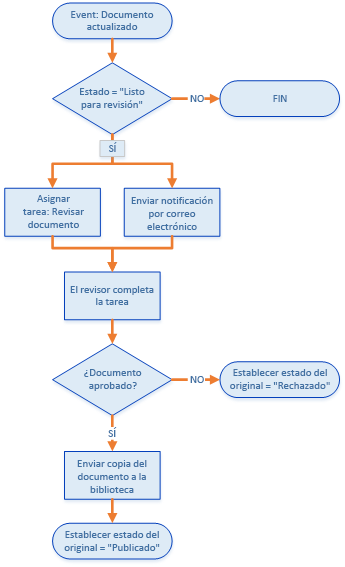
  
    
    
En resumen, el flujo de trabajo hace lo siguiente: 
  
    
    

  
    
    

1. Un evento de cambio de documento asociado a una biblioteca de documentos específica inicia la instancia de flujo de trabajo.
    
  
2. Si el estado del documento está establecido en "Listo para revisión", el flujo de trabajo asigna una tarea a un revisor acordado previamente y, después, envía al revisor una notificación por correo electrónico sobre la tarea.
    
  
3. Si el revisor no puede aprobar el documento, el archivo de documento permanece en la biblioteca de borradores de documentos, pero su estado se establece en "Rechazado".
    
  
4. Si el revisor aprueba el documento, el flujo de trabajo copia el documento en una biblioteca de documentos publicados. El archivo original permanece en la biblioteca de borradores de documentos, pero su estado se establece en "Publicado".
    
  

    
> **IMPORTANTE**
> Antes de iniciar este tutorial, asegúrese de que tiene un entorno de desarrollo de flujo de trabajo correctamente instalado y configurado. Para obtener más información, consulte  [Preparación para instalar y configurar un entorno de desarrollo de flujo de trabajo de SharePoint](prepare-to-set-up-and-configure-a-sharepoint-workflow-development-environment.md). Además, asegúrese de que tiene una instancia de SharePoint Server 2013 con la que puede desarrollar el flujo de trabajo. Para obtener más información, vea  [Instalación de SharePoint 2013](http://technet.microsoft.com/es-es/library/cc303424.aspx). 
  
    
    


## Preparar el entorno
<a name="bmPrepare"> </a>

El primer paso consiste en preparar el sitio de SharePoint con las bibliotecas de documentos que va a usar el flujo de trabajo.
  
    
    

1. Inicie Visual Studio 2012 y cree un nuevo proyecto con la plantilla **Aplicación para SharePoint 2013**, tal como se muestra en la figura 2. 
    
    > **NOTA**
      > En este tutorial, el archivo de la solución se denomina "DocApprovalWorkflow1". Se recomienda usar el mismo nombre. Sin embargo, si asigna un nombre diferente a la solución, asegúrese de realizar los ajustes necesarios en las instrucciones que se indican a continuación. 

   **Figura 2. Crear un proyecto nuevo en Visual Studio 2012**

  

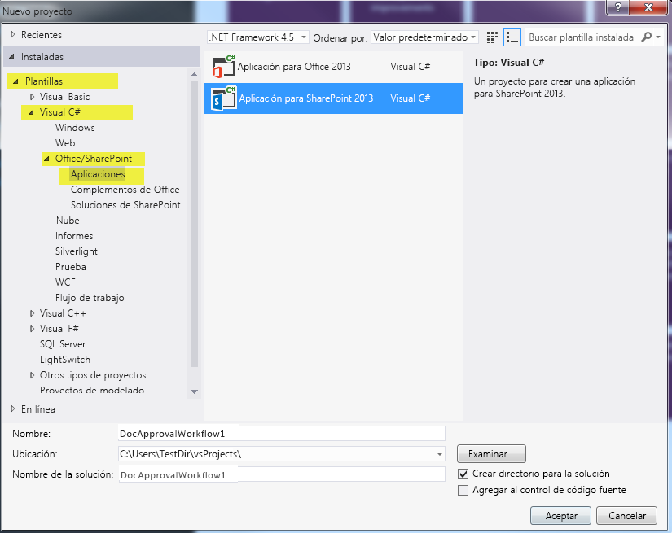
  

  

  
2. En el sitio de SharePoint asociado, cree dos nuevas bibliotecas de documentos de la siguiente manera:
    
  - En el **Explorador de soluciones**, haga clic con el botón secundario en el icono "DocApprovalWorkflow1" y seleccione **Agregar** > **Nuevo elemento** y, después, seleccione **Lista**.
    
  
  - En el **Asistente para la personalización de SharePoint** que aparece, escriba "Borradores de documentos" en el campo de nombre. Después, seleccione "Biblioteca de documentos" en la lista desplegable que aparece bajo el primer botón de radio, como se muestra en la figura 3.
    
  
  - Haga clic en **Siguiente**, seleccione la configuración predeterminada y haga clic en **Finalizar**.
    
   **Figura 3. Asistente para la personalización de SharePoint para la configuración de lista.**

  

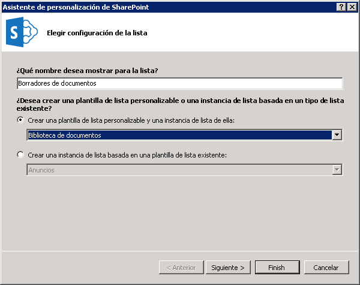
  

  

  
3. Cree la segunda biblioteca de documentos siguiendo los pasos que se indicaron anteriormente, pero asígnele a esta segunda biblioteca el nombre "Documentos publicados".
    
  
4. Agregue dos columnas personalizadas a **las dos** bibliotecas de documentos que acaba de crear:
    
  - Cree una columna personalizada denominada "Aprobador" y conviértala en un tipo de columna de lista de **Persona o grupo**.
    
  
  - Cree una columna personalizada denominada "Estado del documento" y conviértala en un tipo de columna de lista de **Opción** (consulte la figura 4).
    
  
5. En la columna **Estado del documento**, agregue cinco opciones expandiendo la propiedad **Type** de la cuadrícula de propiedades y haciendo clic en el botón de puntos suspensivos ( **...**) en la propiedad **Items**. Seleccione los valores de opción del cuadro de diálogo que aparece, tal como se muestra en la figura 4.
    
  - Borrador en curso
    
  
  - Listo para revisión
    
  
  - Aprobado para su publicación
    
  
  - Rechazado
    
  
  - Publicación:
    
  

   ****

  

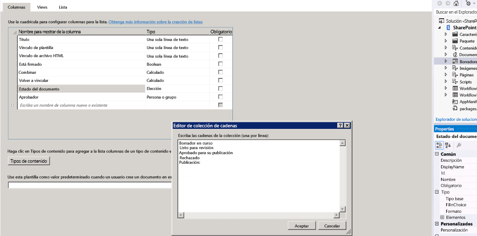
  

  

  

## Crear el flujo de trabajo básico
<a name="bmCreateWorkflow"> </a>

Ahora ya puede crear el flujo de trabajo en sí mismo.
  
    
    

1. En Visual Studio, cree un nuevo flujo de trabajo. Para ello, haga clic con el botón secundario en el icono **DocApprovalWorkflow1** (en el **Explorador de soluciones**), seleccione **Agregar** > **Nuevo elemento** y, después, seleccione **Flujo de trabajo** (consulte la figura 5).
    
   **Figura 5. Agregar nuevo elemento en el Asistente para flujo de trabajo.**

  

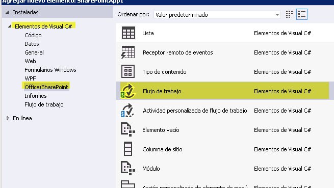
  

  

  
2. Cuando se le pida, asígnele al flujo de trabajo el nombre "DocumentApprovalWorkflow" y seleccione **Flujo de trabajo de lista** como tipo de flujo de trabajo (consulte la figura 6).
    
   **Figura 6. Especificar el nombre y el tipo de flujo de trabajo.**

  

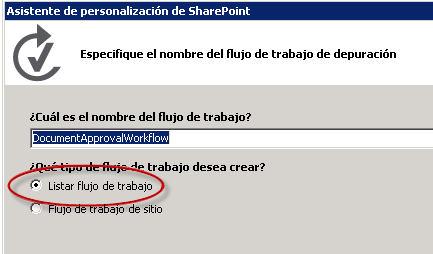
  

  

  
3. En el **Asistente para la personalización de SharePoint**, asocie el nuevo flujo de trabajo con la biblioteca de borradores de documentos. Después, cree una nueva lista de historial y una nueva lista de tareas de flujo de trabajo, como se muestra en la figura 7. Después haga clic en **Siguiente**.
    
   **Figura 7. Finalización del Asistente para la personalización de SharePoint para el nuevo flujo de trabajo.**

  

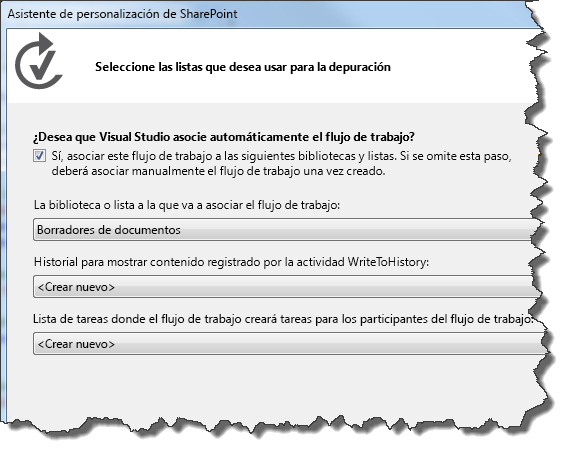
  

  

  
4. Establezca el flujo de trabajo para que se inicie automáticamente cuando se cambie un elemento de la biblioteca de borradores de documentos. También puede dejar seleccionada la casilla para iniciar manualmente el flujo de trabajo. De este modo, puede probar fácilmente el flujo de trabajo sin necesidad de cambiar de un documento. Consulte la figura 8.
    
   **Figura 8. Establecimiento de los parámetros de activación para el flujo de trabajo.**

  

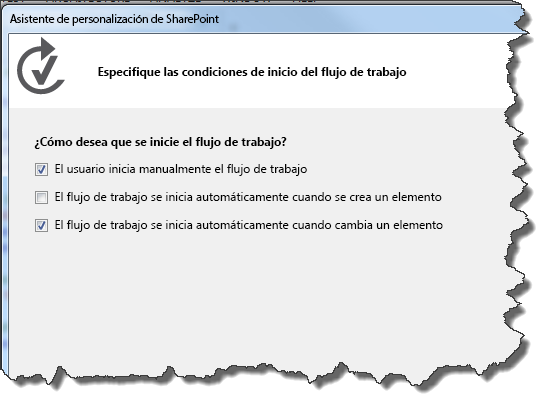
  

    
    > **NOTA**
      > Puede cambiar el tipo de asociación de flujo de trabajo después de crear el flujo de trabajo mediante la cuadrícula de propiedades con el flujo de trabajo seleccionado en el **Explorador de soluciones** (consulte la figura 9). Después, haga clic en **Finalizar**. 

   **Figura 9. Cuadrícula de propiedades del flujo de trabajo.**

  

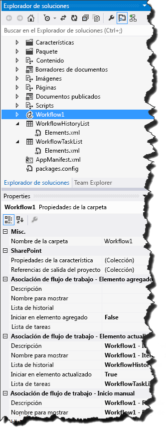
  

  

  
5. Por último, configure SharePoint Server para que administre el correo electrónico saliente mediante el servicio SMTP. Para obtener instrucciones, consulte  [Configurar el correo electrónico saliente para una granja de servidores de SharePoint 2013](http://technet.microsoft.com/es-es/library/cc263462.aspx). Esto es necesario para permitir que el flujo de trabajo envíe notificaciones de correo electrónico relacionadas con tareas de flujo de trabajo.
    
  

## Implementar la lógica de flujo de trabajo
<a name="bmImplementLogic"> </a>

Ahora que hemos configurado SharePoint Server y creado el flujo de trabajo básico, podemos diseñar la lógica de flujo de trabajo.
  
    
    

1. Abra el Diseñador de flujo de trabajo haciendo doble clic en el elemento de proyecto de flujo de trabajo en el **Explorador de soluciones**. Verá la superficie del Diseñador de flujo de trabajo (y el cuadro de herramientas de flujo de trabajo). El diseñador está rellenado con una fase de flujo de trabajo inicial denominada **Secuencia**.
    
  
2. El primer paso consiste en tomar la actividad **LookupSPListItem** del cuadro de herramientas (consulte la figura 10) y colocarla en la fase **Secuencia** en la superficie del diseñador. Usamos esta actividad para obtener el estado del documento en un momento dado, que la actividad **LookupSPListItem** devuelve como un objeto [DynamicValue](http://msdn.microsoft.com/es-es/library/windowsazure/microsoft.activities.dynamicvalue%28v=azure.10%29.aspx) que contiene un conjunto de propiedades de elemento de lista de SharePoint como pares clave-valor.
    
   **Figura 10. Selector de actividad de LookupSPListItem.**

  

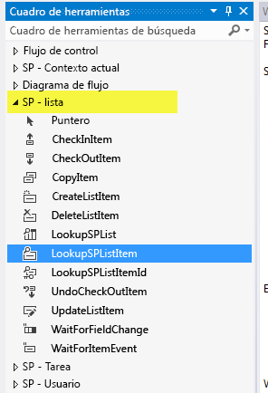
  

  

1. Para configurar la actividad **LookupSPListItem**, haga clic en ella en el diseñador para seleccionarla. De este modo se activa la cuadrícula de propiedades de la actividad.
    
  
2. Use los cuadros combinados de la cuadrícula de propiedades para configurar la actividad **LookupSPListItem** para que use "elemento actual" para **ItemId** y "lista actual" como **ListId**, como se muestra en la figura 11.
    
   **Figura 11. Configuración de las propiedades de LookupSPListItem.**

  

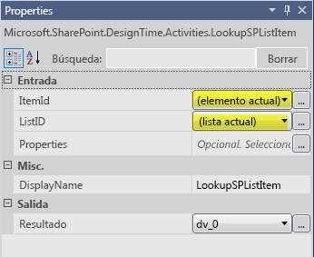
  

  

  
3. En el icono de actividad **LookupSPListItem**, haga clic en el vínculo **Obtener propiedades**. De este modo se completan dos pasos importantes:
    
1. En primer lugar, se crea una variable de tipo **DynamicValue** que se enlaza con el argumento out (denominado _Result_) de la actividad **LookupSPListItem**. Las propiedades del elemento de lista se almacenan en esta variable.
    
  
2. En segundo lugar, se agrega una nueva actividad denominada **GetDynamicValueProperties** (consulte la figura 12) y la variable **DynamicValue** recién creada se establece como el argumento in de esta nueva actividad. Esta actividad le permite extraer las propiedades del elemento de lista de la variable **DynamicValue**.
    
  
4. En la actividad **GetDynamicValueProperties**, haga clic en  *Definir...*  para abrir un cuadro de diálogo que le permite elegir las propiedades que quiere extraer. Para seleccionar las propiedades consulte la figura 12, que muestra una parte de la superficie del diseñador combinada con el cuadro de diálogo **Propiedades** abierto.
    
   **Figura 12. Selección de las propiedades DynamicValue que se van a extraer.**

  

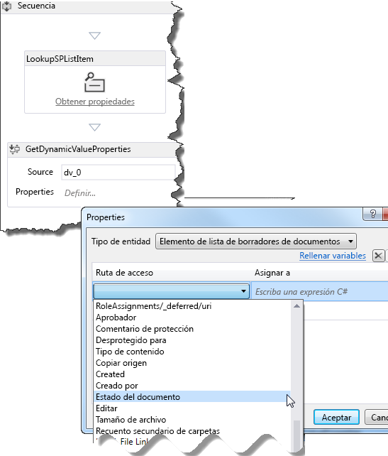
  

  

1. Para el **Tipo de entidad**, seleccione **List Item of Draft Documents** (Elemento de lista de borradores de documentos).
    
  
2. En la cuadrícula de datos, en la columna **Ruta de acceso**, haga clic en  *Crear propiedad*  para abrir un cuadro combinado que contiene las propiedades disponibles para los elementos de lista de la biblioteca de borradores de documentos. Seleccione **Estado del documento** en el cuadro combinado.
    
  
3. En la fila siguiente de la cuadrícula de datos, vuelva a hacer clic en  *Crear propiedad*  ; esta vez, seleccione **Aprobador** en el cuadro combinado.
    
  
4. Ahora haga clic en el vínculo **Rellenar Variables** en el cuadro de diálogo. De este modo se crea una variable del tipo de datos adecuado para cada fila y se asigna en la columna **Asignar a** de la cuadrícula de datos, como se muestra en la figura 13.
    
   **Figura 13. Obtención de las propiedades de estado del documento y aprobador.**

  

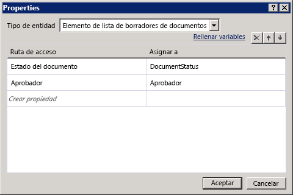
  

  

  
5. Ahora ya tenemos los valores del elemento de lista que necesitamos. El paso siguiente consiste en configurar el flujo de trabajo para comprobar si el documento está "listo para revisión" y tomar la acción adecuada en caso de que así sea.
    
1. En el cuadro de herramientas, arrastre la actividad **If** a la superficie del Diseñador de flujo de trabajo. (Encontrará la actividad **If** en la sección **Flujo de control** del cuadro de herramientas).
    
  
2. Establezca la condición **If** en `DocumentStatus.Equals("Ready for Review")`, como se muestra en la figura 14.
    
   **Figura 14. Creación de una cláusula If/Then para desencadenar una tarea.**

  

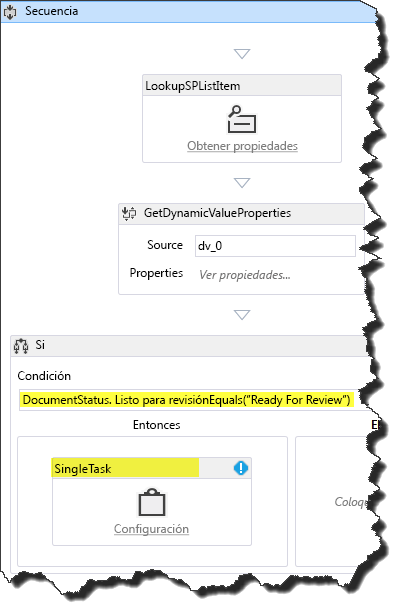
  

  

  
3. Después, desde la sección **SP - Tarea** del cuadro de herramientas, arrastre una actividad **SingleTask** y colóquela en el cuadro **Then** de la actividad **If**. En efecto, ha configurado el flujo de trabajo de modo que **If** (si) el documento está listo para su revisión **Then** (entonces) se completará esta tarea.
    
  
6. El siguiente paso consiste en configurar la tarea que acabamos de crear mediante el cuadro de diálogo de configuración que se muestra en la figura 15.
    
   **Figura 15. Cuadro de diálogo de configuración de tareas.**

  

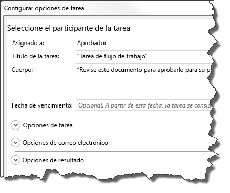
  

  

1. En primer lugar, asignamos la tarea a un aprobador. Para ello, haga clic en el vínculo **Configurar** del icono de actividad **SingleTask**.
    
  
2. Establezca el campo **Asignado a:** en "Aprobador".
    
  
3. Observe que el campo **Título de tarea:** se rellena automáticamente con "Tarea de flujo de trabajo".
    
  
4. En el campo **Cuerpo:**, escriba un mensaje sencillo con instrucciones para el aprobador, como "Revise este documento para aprobarlo para su publicación".
    
  
5. Haga clic en **Aceptar** para guardar.
    
  

    Observe que en este momento hay un error de validación en la actividad **SingleTask**. Con el icono **SingleTask** seleccionado, consulte la propiedad **AssignedTo** en la cuadrícula de propiedades y observe que tiene un icono de error. Mueva el puntero sobre el nombre de la propiedad para ver una descripción del problema en la información sobre herramientas. Verá que la propiedad **AssignedTo** espera un valor **String**, pero la variable **Approver** es del tipo de datos **Int32**.
    
    Para corregir este error, convierta la variable en un tipo de datos **String** anexando ".ToString()" a "Approver" en la fila **AssignedTo** de la cuadrícula de propiedades, como se muestra en la figura 16.
    

   **Figura 16. Conversión de la variable "Approver" en un tipo de datos de cadena en la cuadrícula de propiedades.**

  

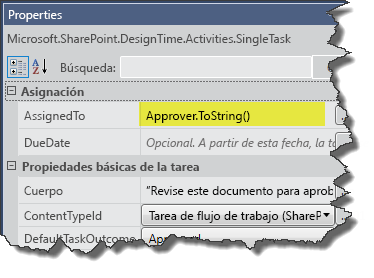
  

    Llegados a este punto del tutorial, ha creado y configurado una tarea de flujo de trabajo que hace dos cosas: Establece un documento para su revisión, pero también envía un correo electrónico al encargado de la tarea (el "aprobador", en este caso) en el que le notifica que se le ha asignado una tarea y espera que emprenda acciones.
    
  
7. Echemos un vistazo a la cuadrícula de propiedades de la actividad **SingleTask**. Desplácese a la parte inferior de la cuadrícula de propiedades y observe que en la sección **Salida** hay dos propiedades, **Outcome** y **TaskItemId**, que son argumentos out.
    
    Fíjese en el nombre de la variable **Outcome**:  _outcome_0_ (o similar). Usamos esta variable para comprobar el resultado de la tarea, es decir, si el aprobador ha aprobado o rechazado el documento.
    
    > **NOTA**
      > El argumento out **Outcome** devuelve un valor **Int32** correspondiente al índice del resultado, es decir, **0** para "Aprobado" y **1** para "Rechazado". Estos enteros son los valores predeterminados que se proporcionan en la columna de sitio de SharePoint predefinida denominada "Resultado de la tarea".
8. Ahora, para que el flujo de trabajo compruebe el resultado de la tarea, debemos agregar otra actividad **If** y colocarla después de la actividad **SingleTask**, pero dentro del área **Then**, como se muestra en la figura 17. Si la condición **If** se establece en " `outcome_0 == 0`", nos indica si el documento se ha aprobado.
    
   **Figura 17. Adición de la actividad If para comprobar el estado de la tarea.**

  

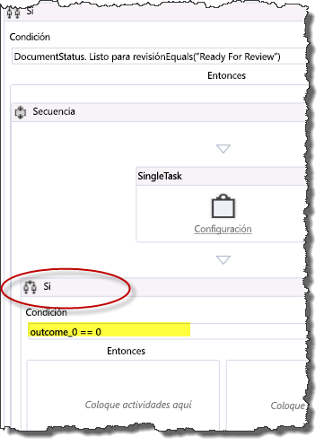
  

  

  
9. Si el aprobador ha establecido la tarea en "Aprobado", el estado del documento se actualiza a "Aprobado para la publicación" y el archivo del documento se copia en la biblioteca de documentos publicados. En cambio, si el aprobador ha rechazado el documento, es necesario establecer el estado del documento en "Rechazado".
    
1. En esta nueva actividad **If**, arrastre una actividad **UpdateListItem** al cuadro **Then**.
    
  
2. Configure la actividad **UpdateListItem** en su cuadrícula de propiedades de modo que **ItemId** esté establecido en "(elemento actual)" y **ListId** en "(lista actual)", como se muestra en la figura 18.
    
  
3. Después, con la actividad **UpdateListItem** seleccionada, haga clic en el botón de puntos suspensivos ( **...**) adyacente al campo **ListItemPropertiesDynamicValue** de la cuadrícula de propiedades. Esta acción abre un cuadro de diálogo que permite especificar las propiedades del elemento de lista que quiere actualizar.
    
   **Figura 18. Establecimiento de las propiedades del elemento de lista que se van a actualizar**

  

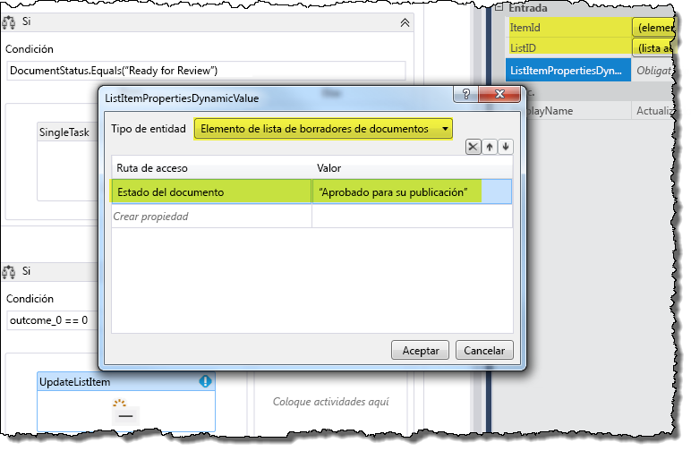
  

  

  
4. En el cuadro de diálogo, use primero el cuadro combinado para establecer el **Tipo de entidad** en **List Item of Draft Documents** (Elemento de lista de borradores de documentos), como se muestra en la figura 18. Después, en la cuadrícula de datos, haga clic en **Crear propiedad** y seleccione "Estado del documento" en la lista desplegable. A continuación, en la columna **Valor**, escriba "Aprobado para publicación" (incluidas las comillas) y haga clic en **Aceptar**.
    
  
10. En el área **Then** de la actividad **If** actual, arrastre una actividad **CopyItem** y colóquela directamente debajo de la actividad **UpdateListItem**, tal como se muestra en la figura 19.
    
   **Figura 19. Adición de una actividad CopyItem al flujo de trabajo.**

  

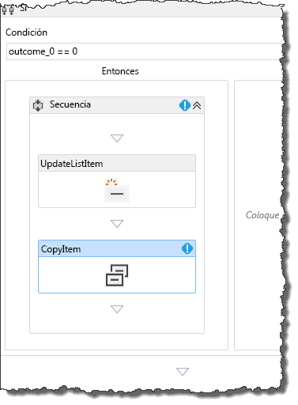
  

    Después, configure las propiedades de la actividad **CopyItem** en la cuadrícula de propiedades, como se muestra en la figura 20. Los valores de las propiedades aparecen resaltados.
    

   **Figura 20. Configuración de la actividad CopyItem.**

  

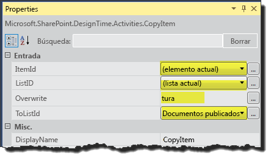
  

    
    > **NOTA**
      > En este tutorial damos por supuesto que todos los documentos publicados salen de la biblioteca de borradores de documentos. Por lo tanto, no es necesario preocuparse de controlar los nombres de archivo duplicados. 
11. Por último, tenemos que agregar una actividad para controlar los casos en los que el revisor rechace el documento. Para ello, es necesario agregar una actividad **UpdateListItem** en el área **Else** de la actividad **If** actual. Configure esta actividad **UpdateListItem** de la misma manera en que configuró la anterior en el paso 9(c). La única diferencia es que ahora queremos establecer el estado del documento en "Rechazado", como se muestra en la figura 21.
    
   **Figura 21. Configuración de las propiedades de la actividad UpdateListItem para documentos rechazados.**

  

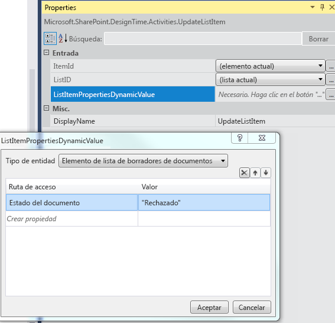
  

  

  
De este modo se completa la "Creación de un flujo de trabajo de aprobación de documentos de SharePoint". En la figura 22 se muestra el flujo de trabajo completo.
  
    
    

**Figura 22. Flujo de trabajo completo de aprobación de documentos de SharePoint.**

  
    
    

  
    
    
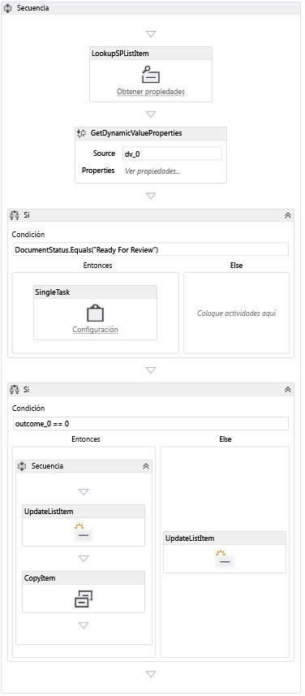
  
    
    

  
    
    

  
    
    

## Empaquetar e implementar el flujo de trabajo
<a name="bk_deploy"> </a>

A continuación se indica una serie de recursos que proporcionan orientación para empaquetar e implementar el flujo de trabajo como un Complemento de SharePoint:
  
    
    

-  [Implementación e instalación de aplicaciones para SharePoint: métodos y opciones](http://msdn.microsoft.com/es-es/library/fp179933.aspx)
    
  
-  [Publicar aplicaciones para SharePoint](http://msdn.microsoft.com/es-es/library/jj164070.aspx)
    
  
-  [Procedimiento Procedimiento para crear e implementar flujos de trabajo declarativos en soluciones de espacio aislado](http://msdn.microsoft.com/es-es/library/gg615452%28v=office.14%29.aspx) (mediante SharePoint Designer 2013)
    
  

> **PRECAUCIóN**
> Los Complementos de SharePoint que contienen flujos de trabajo integrados (que se pueden asociar con listas en el sitio web primario) se diferencian de las aplicaciones de flujo de trabajo normales cambiando la etiqueta siguiente a **true** en el archivo `workflowmanifest.xml` del paquete de la aplicación:
  
    
    


```XML

<SPIntegratedWorkflow xmlns="http://schemas.microsoft.com/sharepoint/2014/app/integratedworkflow">
    <IntegratedApp>true</IntegratedApp>
</SPIntegratedWorkflow>

```


## Recursos adicionales
<a name="bk_addresources"> </a>


-  [Flujos de trabajo de SharePoint 2013](workflows-in-sharepoint-2013.md)
    
  
-  [Preparación para instalar y configurar un entorno de desarrollo de flujo de trabajo de SharePoint](prepare-to-set-up-and-configure-a-sharepoint-workflow-development-environment.md)
    
  
-  [Procedimientos recomendados de desarrollo de flujo de trabajo de SharePoint](sharepoint-workflow-development-best-practices.md)
    
  
-  [Desarrollar de flujos de trabajo de SharePoint 2013 mediante Visual Studio](develop-sharepoint-2013-workflows-using-visual-studio.md)
    
  

  
    
    

