# Creación de un flujo de trabajo con permisos elevados mediante la plataforma de flujo de trabajo de SharePoint 2013
Obtenga información sobre cómo crear un flujo de trabajo con permisos elevados con la plataforma de flujo de trabajo de SharePoint 2013.
## SharePoint Server 2013Catálogo de aplicaciones y flujo de trabajo
<a name="section1"> </a>

En este artículo se describe cómo crear flujos de trabajo de SharePoint 2013 que tienen acceso a objetos de SharePoint que requieren permisos elevados. Estas soluciones usan dos características: la concesión de permisos a la aplicación de flujo de trabajo y el ajuste de acciones con el paso de la aplicación.
  
    
    

> **IMPORTANTE**
> En este artículo se supone que se ha instalado y configurado la plataforma de flujo de trabajo de SharePoint 2013 y que se ha configurado SharePoint 2013 para aplicaciones. Para obtener más información sobre el flujo de trabajo de SharePoint 2013 y las aplicaciones para SharePoint 2013, incluía la instalación y la configuración, consulte  [Flujo de trabajo de SharePoint 2013](http://technet.microsoft.com/sharepoint/jj556245.aspx) y [Install and manage apps for SharePoint 2013](http://msdn.microsoft.com/library/733647a3-a5d3-475b-967d-3bb627c2a0c2.aspx). 
  
    
    


### Información general de la creación de un flujo de trabajo con permisos elevados

Imagínese que, como administrador de SharePoint, le gustaría definir algunos procesos para administrar solicitudes de usuario para la compra de aplicaciones en la Tienda Office. En el caso más sencillo, quiere enviar un correo electrónico de confirmación cuando un usuario solicita una aplicación. Además, también podría querer agregar una estructura al proceso de aprobación de la solicitud.
  
    
    
De forma predeterminada, el flujo de trabajo no tiene permisos para tener acceso al catálogo de solicitudes de la aplicación. Las listas del catálogo de SharePoint requieren permisos de propietario (control total). Por lo general, los flujos de trabajo se ejecutan con un nivel equivalente al permiso de escritura.
  
    
    
Para resolver esto, tiene que crear un flujo de trabajo con permisos elevados haciendo lo siguiente en el sitio de la Colección de sitios:
  
    
    

1. Permitir el flujo de trabajo con permisos de aplicación.
    
  
2. Conceder permiso de control total al flujo de trabajo.
    
  
3. Desarrollar el flujo de trabajo para ajustar acciones dentro de un paso de aplicación.
    
  

### Permitir que un flujo de trabajo con permisos de aplicación en un sitio de SharePoint Server 2013

El primer paso es permitir que el flujo de trabajo use permisos de aplicación. Configure el flujo de trabajo para que use los permisos de aplicación en la página **Configuración del sitio** del sitio de SharePoint Server 2013 donde se ejecutará el flujo de trabajo. El siguiente procedimiento configura el sitio de SharePoint Server 2013 para permitir que el flujo de trabajo use permisos de aplicación.
  
    
    

> **IMPORTANTE**
> El procedimiento debe completarlo un usuario con permisos de **Propietario del sitio**. 
  
    
    


### Para permitir el flujo de trabajo con permisos de aplicación


1. Haga clic en el icono **Configuración** como se muestra en la figura.
    
   **Figura: Abrir la página Configuración del sitio**

  

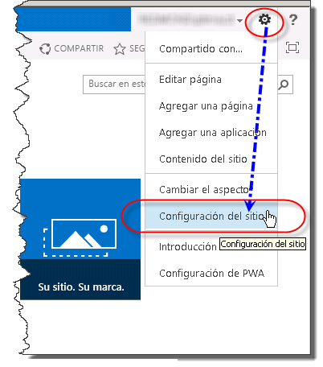
  

  

  
2. Vaya a **Configuración del sitio**.
    
  
3. En la sección **Acciones del sitio**, seleccione **Administrar las características del sitio**.
    
  
4. Busque la característica denominada **Los flujos de trabajo pueden usar permisos de aplicación**, como se muestra en la figura y luego haga clic en **Activar**.
    
    > **PRECAUCIóN**
      > Esta característica no se activará a menos que se hayan configurado correctamente la plataforma de flujo de trabajo de SharePoint 2013 y las aplicaciones de SharePoint. 

   **Figura: La característica del sitio, "Los flujos de trabajo pueden usar permisos de aplicación"**

  

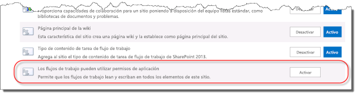
  

  

  

### Conceder permiso de control total a un flujo de trabajo

Para que el flujo de trabajo funcione correctamente, debe conceder control total en el sitio. El siguiente procedimiento concede el permiso de control total al flujo de trabajo.
  
    
    

> **IMPORTANTE**
>  El procedimiento supone lo siguiente:


- El procedimiento debe completarlo un usuario con permisos de **Propietario del sitio**. 


- El flujo de trabajo ya debe estar publicado en el sitio de SharePoint Server 2013.
  
    
    


### Para conceder permiso de control total a un flujo de trabajo


1. Haga clic en el icono **Configuración** como se muestra en la figura.
    
   **Figura: Abrir la página Configuración del sitio**

  


  

  

  
2. Vaya a **Configuración del sitio**.
    
  
3. En la sección **Usuarios y permisos**, seleccione **Permisos de aplicaciones del sitio**.
    
  
4. Copie la sección **cliente** de ** Identificador de la aplicación**. Es el identificador entre la última "|" y el símbolo "@", como se muestra en la figura.
    
   **Figura: Seleccionar el identificador de la aplicación**

  

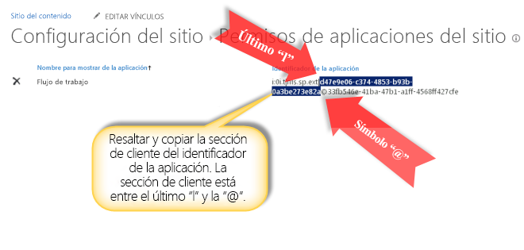
  

  

  
5. Vaya a la página **Conceder permiso a una aplicación**. Esto debe realizarse a través de la página appinv.aspx del sitio.
    
    Ejemplo: http://{nombredehost}/{la colección de sitios}/_layouts/15/appinv.aspx. 
    
    > **NOTA**
      > La "aplicación" en este paso hace referencia a la aplicación de flujo de trabajo en general, no solo a un flujo de trabajo específico. No se puede controlar el acceso de los flujos de trabajo individuales. Al habilitar los permisos de la aplicación, estos se habilitan para todos los flujos de trabajo de la colección de sitios. 

    Para obtener más información sobre cómo configurar un flujo de trabajo, consulte el  [artículo del blog de Sympraxis Consulting: Looping Through Content in a SharePoint 2013 Site Workflow (Enlazar en bucle el contenido en un flujo de trabajo del sitio de SharePoint 2013)](http://sympmarc.com/2016/01/14/looping-through-content-in-a-sharepoint-2013-site-workflow-part-1-introduction)
    
    La figura siguiente muestra un ejemplo.
    

   **Figura: Página appinv.aspx y ejemplo de dirección URL**

  

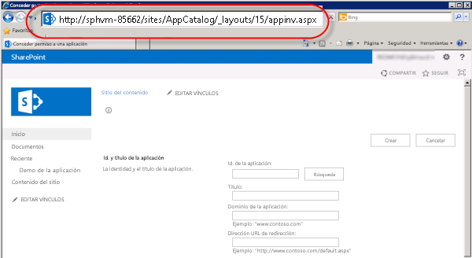
  

  

  
6. Pegue el identificador de cliente en el campo **Id. de la aplicación** y luego haga clic en **Búsqueda**, como se muestra en la figura.
    
  
7. Pegue el siguiente XML de **Solicitud de permisos** para conceder permiso de control total.
    
  ```
  
<AppPermissionRequests>
    <AppPermissionRequest Scope="http://sharepoint/content/sitecollection/web" Right="FullControl" />
</AppPermissionRequests>

  ```


> **PRECAUCIóN**
> En el valor **Ámbito** anterior no hay marcadores de posición. Es un valor literal. Escríbalo exactamente como aparece aquí.

La figura siguiente muestra un ejemplo de la página completada.
    

   **Figura: Búsqueda de un identificador de la aplicación**

  

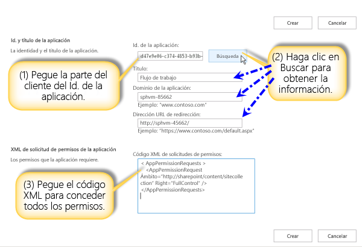
  

  

  
8. Haga clic en **Crear**.
    
  
9. Luego se le pedirá que confíe en la aplicación de flujo de trabajo, como se muestra en la figura. Haga clic en **Confiar**.
    
   **Figura: Confiar en la aplicación de flujo de trabajo**

  

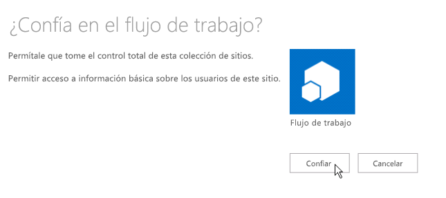
  

  

  

### Ajuste de acciones dentro de un paso de aplicación

Por último, tiene que ajustar las acciones de flujo de trabajo dentro de un paso de aplicación. El procedimiento siguiente encapsula una acción **Enviar un correo electrónico** dentro de un paso de aplicación. El flujo de trabajo de este ejemplo envía un mensaje de correo electrónico de confirmación desde una lista personalizada.
  
    
    

### Para ajustar acciones dentro de un paso de aplicación


1. Abra el sitio del catálogo de aplicaciones en SharePoint Designer 2013.
    
  
2. Cree una nueva lista personalizada en la que se va a ejecutar el flujo de trabajo. En este ejemplo, el nombre de la lista es **Demostración de la aplicación**.
    
  
3. En la ventana de navegación, haga clic en **Flujos de trabajo**.
    
  
4. Cree un nuevo flujo de trabajo de lista para la lista Demostración de la aplicación, como se muestra en la figura.
    
   **Figura: Crear un nuevo flujo de trabajo de lista**

  

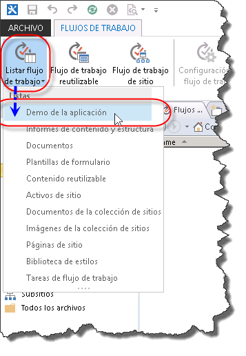
  

  

  
5. Inserte un **Paso de aplicación**, como se muestra en la figura.
    
   **Figura: Agregar un paso de aplicación**

  

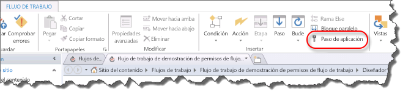
  

  

  
6. Inserte una acción **Enviar un correo electrónico** en el **Paso de aplicación**.
    
  
7. Haga clic en el botón **libreta de direcciones**. En el campo **Para**, seleccione **Búsqueda de flujo de trabajo para un usuario** y haga clic en **agregar** como se muestra en la figura.
    
   **Figura: Seleccionar la búsqueda de flujo de trabajo para un usuario**

  

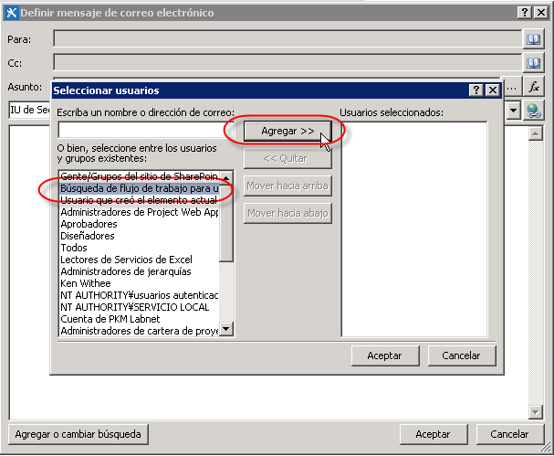
  

  

  
8. Escriba el campo **Creado por** como el valor de búsqueda, como se muestra en la figura.
    
   **Figura: Cuadro de diálogo de búsqueda de persona**

  

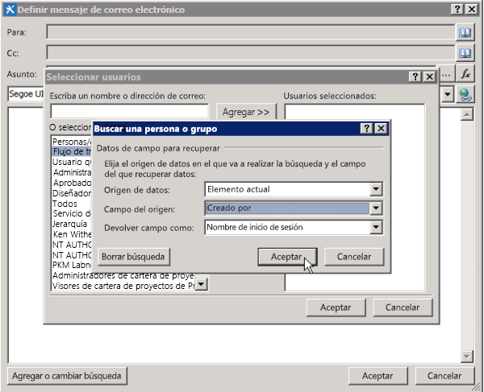
  

  

  
9. Escriba Correo electrónico de la lista Demostración de la aplicación en el cuerpo del mensaje de correo electrónico.
    
  
10. Haga clic en **Aceptar** para volver al flujo de trabajo. En la figura se muestra el flujo de trabajo completado.
    
   **Figura: Acción de correo electrónico en el paso de aplicación**

  

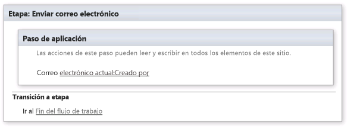
  

  

  
11. Haga clic en el icono **Configuración del flujo de trabajo** de la cinta de opciones, como se muestra en la figura.
    
   **Figura: Icono Configuración del flujo de trabajo en la cinta**

  

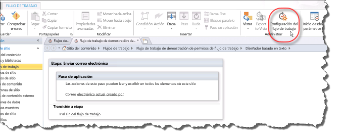
  

  

  
12. Desactive la casilla junto a **Actualizaciones automáticas al estado de flujo de trabajo para el nombre de la fase actual** y luego haga clic en **Publicar**, como se muestra en la figura.
    
   **Figura: Desactivar la casilla de actualizaciones automáticas y luego publicar**

  

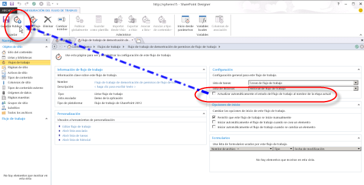
  

  

  

## Comprender cómo funciona
<a name="section2"> </a>

Para comprender porqué se requiere elevar permisos para un flujo de trabajo, considere la posibilidad de que los flujos de trabajo son fundamentalmente aplicaciones para SharePoint y que siguen las mismas reglas de autorización que el modelo de aplicaciones. La configuración de flujo de trabajo predeterminada es que los permisos efectivos del flujo de trabajo son una intersección de permisos de usuario y permisos de la aplicación, como se muestra en la figura.
  
    
    

**Figura: Diagrama de permisos**

  
    
    

  
    
    
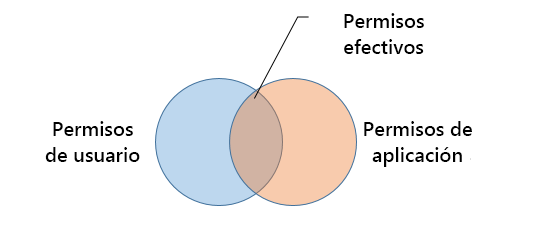
  
    
    
Hay dos razones por las que es necesario conceder permisos para crear un flujo de trabajo en la lista de solicitud de aplicación. Son las siguientes:
  
    
    

- De forma predeterminada, el flujo de trabajo solo tiene permiso de escritura.
    
  
- El usuario no tiene permisos.
    
  
El primer paso para resolver este problema es permitir a la aplicación que autorice usando solo su identidad y omitiendo al usuario. Esto se realiza habilitando la característica de paso de aplicación. El segundo paso concede permiso de control total al flujo de trabajo.
  
    
    
El siguiente diagrama ilustra el cambio de permisos
  
    
    

**Figura: Matriz de permisos**

  
    
    

  
    
    
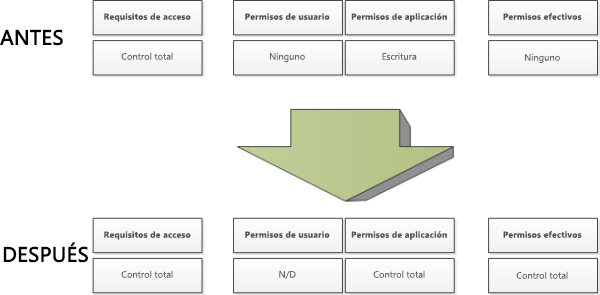
  
    
    

  
    
    

  
    
    

## Recursos adicionales
<a name="section3"> </a>


-  [Flujo de trabajo en SharePoint 2013](http://technet.microsoft.com/es-es/sharepoint/jj556245.aspx)
    
  
-  [Install and manage apps for SharePoint 2013](http://msdn.microsoft.com/library/733647a3-a5d3-475b-967d-3bb627c2a0c2.aspx)
    
  
-  [What's new in workflow in SharePoint Server 2013](http://msdn.microsoft.com/library/6ab8a28b-fa2f-4530-8b55-a7f663bf15ea.aspx)
    
  
-  [Getting started with SharePoint Server 2013 workflow](http://msdn.microsoft.com/library/cc73be76-a329-449f-90ab-86822b1c2ee8.aspx)
    
  
-  [Desarrollo de flujos de trabajo en SharePoint Designer y Visio](workflow-development-in-sharepoint-designer-and-visio.md)
    
  
-  [Referencia rápida sobre acciones de flujo de trabajo (plataforma de flujo de trabajo de SharePoint 2013)](workflow-actions-quick-reference-sharepoint-2013-workflow-platform.md)
    
  
-  [Artículo del blog del equipo de SharePoint Designer: empaquetar flujo de trabajo e implementar el escenario](http://blogs.msdn.com/b/sharepointdesigner/archive/2012/08/30/packaging-list-site-and-reusable-workflow-and-how-to-deploy-the-package.aspx)
    
  
-  [Artículo del blog de Sympraxis Consulting: Looping Through Content in a SharePoint 2013 Site Workflow (Enlazar en bucle el contenido en un flujo de trabajo del sitio de SharePoint 2013)](http://sympmarc.com/2016/01/14/looping-through-content-in-a-sharepoint-2013-site-workflow-part-1-introduction)
    
  

