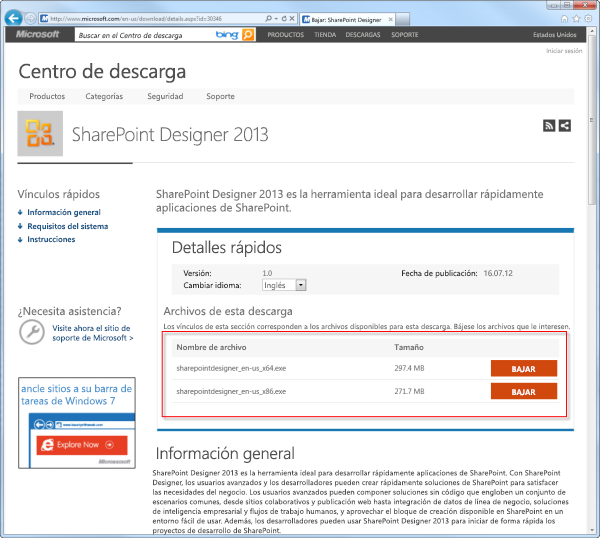
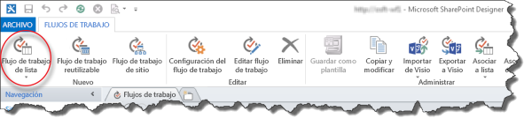
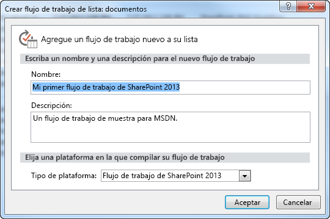
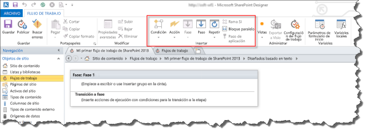

# Creación de un flujo de trabajo mediante SharePoint Designer 2013 y la plataforma de flujo de trabajo de SharePoint 2013
Información sobre cómo instalar, abrir y crear un flujo de trabajo con SharePoint Designer 2013 y la plataforma Flujo de trabajo de SharePoint 2013. 
||
|:-----|
||
   

## Instalar SharePoint Designer 2013

SharePoint Designer 2013 se descarga gratuitamente. Para descargar e instalar SharePoint Designer 2013 haga lo siguiente: 
  
    
    

### Para instalar SharePoint Designer 2013

1. Abra su explorador y vaya al centro de descarga de Microsoft:  [http://www.microsoft.com/download](http://www.microsoft.com/download.aspx). 
    
  
2. Escriba SharePoint Designer 2013 en el campo de búsqueda.
    
  
3. Haga clic en el vínculo de "SharePoint Designer 2013". 
    
  
4. Lea la información general, los requisitos del sistema y las instrucciones de instalación. Asegúrese de que su sistema sea compatible. 
    
  
5. Seleccione su tipo de plataforma: 64 bits ( **x64**) o 32 bits ( **x86**) tal como se muestra en la ilustración. 
    
  
6. Siga las instrucciones para instalar SharePoint Designer 2013.
    
  

**Ilustración: página de descarga de SharePoint Designer 2013**

  
    
    

  
    
    

  
    
    

  
    
    

  
    
    

## Abrir SharePoint Designer 2013 y conectar a un sitio de SharePoint 2013

SharePoint Designer 2013 se instala como una aplicación de Office 2013. Para abrir SharePoint Designer 2013 y conectarse a un sitio de SharePoint 2013, haga lo siguiente: 
  
    
    

### Para abrir SharePoint Designer 2013 y conectarse a un sitio de SharePoint 2013

1. Para abrir SharePoint Designer 2013, selecciónelo en el menú **Inicio**. Haga clic en el icono **Inicio**, **Todos los programas**, **Microsoft Office 2013** y después en **SharePoint Designer 2013**. 
    
  
2. Haga clic en **Abrir sitio web** en la página de inicio de SharePoint Designer 2013.
    
  
3. Escriba el sitio de SharePoint 2013 al que quiere conectarse. Por ejemplo, http://www.contoso.com/sites/a-sharepoint-site.
    
  
4. Haga clic en **Abrir** para abrir el sitio.
    
  
5. En caso necesario, escriba sus credenciales. (Si no hay seguridad integrada con el equipo en el que ha iniciado sesión, se le pedirá que introduzca sus credenciales). Asegúrese de usar credenciales que tengan acceso al sitio de SharePoint 2013.
    
  

## Crear un flujo de trabajo de lista basado en la plataforma Flujo de trabajo de SharePoint 2013

SharePoint Designer 2013 se puede usar para muchas tareas importantes. El panel de navegación se usa para cambiar entre distintos aspectos de SharePoint Designer 2013. Para crear un nuevo flujo de trabajo de lista basado en la plataforma Flujo de trabajo SharePoint 2013, haga lo siguiente:
  
    
    

### Para crear un flujo de trabajo basado en la plataforma Flujo de trabajo de SharePoint 2013

1. Haga clic en el nodo Flujos de trabajo del panel de navegación.
    
  
2. Haga clic en la lista desplegable **Flujo de trabajo de lista** de la sección **Nuevo** de la cinta de opciones, tal como se muestra en la ilustración.
    
  
3. Seleccione la lista que desea asociar al nuevo flujo de trabajo.
    
  
4. En el cuadro de diálogo **Crear un flujo de trabajo de la lista**, escriba un nombre y una descripción para el flujo de trabajo y después asegúrese de que el **Tipo de plataforma** está establecido en **Flujo de trabajo de SharePoint 2013**, tal como se muestra en la ilustración.
    
    > **NOTA**
      > Si no ve Flujo de trabajo de SharePoint 2013 entre las opciones disponibles de tipo de plataforma, significa que Administrador de flujos de trabajo no está configurado para funcionar con la granja de servidores de SharePoint Server 2013. 
5. Haga clic en **Aceptar** para crear el flujo de trabajo.
    
  

**Ilustración: Botón de la cinta de opciones para crear un nuevo flujo de trabajo de lista**

  
    
    

  
    
    

  
    
    

  
    
    

  
    
    

**Ilustración: Cuadro de diálogo Crear flujo de trabajo de la lista**

  
    
    

  
    
    

  
    
    

  
    
    

  
    
    
Ahora que el flujo de trabajo está creado, puede agregar acciones, condiciones, fases, pasos y bucles para compilar el flujo de trabajo. Estos componentes de flujo de trabajo están disponibles en la cinta de opciones de SharePoint Designer 2013, tal como se muestra en la ilustración. 
  
    
    

**Ilustración: Elementos de flujo de trabajo para la plataforma Flujo de trabajo de SharePoint 2013**

  
    
    

  
    
    

  
    
    

    
> **NOTA**
> El procedimiento anterior se usa para crear un flujo de trabajo de lista. Se puede crear un flujo de trabajo reutilizable o un flujo de trabajo del sitio siguiendo el mismo procedimiento pero con un cambio. En vez de seleccionar el botón Flujo de trabajo de lista en la cinta de opciones, seleccione el botón **Flujo de trabajo reutilizable** o **Flujo de trabajo del sitio** en el momento de crear el flujo de trabajo.
  
    
    

Para más información sobre los componentes disponibles en el desarrollo de flujos de trabajo, vea  [Referencia rápida sobre acciones de flujo de trabajo (plataforma de flujo de trabajo de SharePoint 2013)](workflow-actions-quick-reference-sharepoint-2013-workflow-platform.md).
  
    
    

## Recursos adicionales

-  [What's new in workflow in SharePoint Server 2013](http://msdn.microsoft.com/library/6ab8a28b-fa2f-4530-8b55-a7f663bf15ea.aspx)
    
  
-  [Getting started with SharePoint Server 2013 workflow](http://msdn.microsoft.com/library/cc73be76-a329-449f-90ab-86822b1c2ee8.aspx)
    
  
-  [Desarrollo de flujos de trabajo en SharePoint Designer y Visio](workflow-development-in-sharepoint-designer-and-visio.md)
    
  

  
    
    

