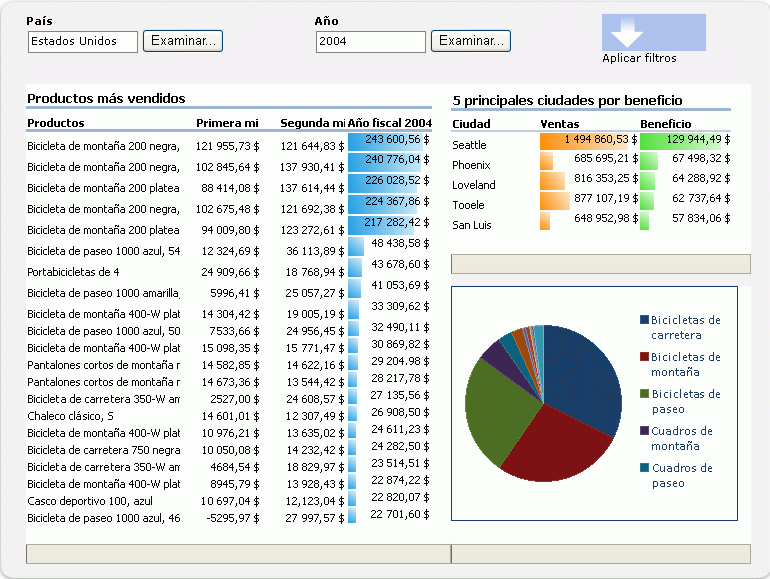
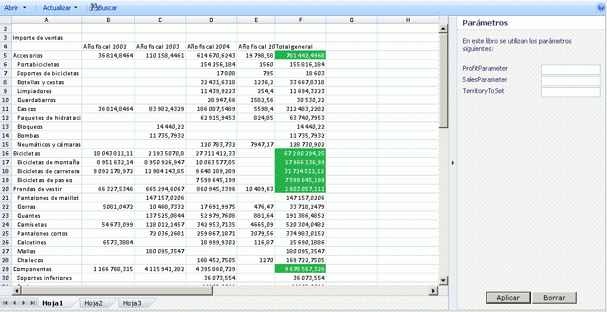

# Introducción a Excel Services

Servicios de Excel es una aplicación de servicio que le permite cargar, calcular y mostrar libros de Microsoft Excel en Microsoft SharePoint 2013. Servicios de Excel se incorporó por primera vez en Microsoft Office SharePoint Server 2007.
  
    
    

Mediante Servicios de Excel, puede reutilizar y compartir libros de Excel en portales y paneles de SharePoint 2013. Por ejemplo, los analistas financieros, planeadores de negocios o ingenieros pueden crear contenido en Excel y compartirlo con otras personas usando un portal y un panel de SharePoint 2013 sin necesidad de escribir código personalizado. Puede controlar qué datos se deben mostrar y puede mantener una sola versión del libro de Excel. 
Existen cuatro interfaces principales para Servicios de Excel: 
  
    
    

- Un elemento web Excel Web Access, que permite ver e interactuar con un libro activo mediante un explorador 
    
  
- Servicios web de Excel para acceso mediante programación
    
  
- Un modelo de objetos de ECMAScript (JavaScript, JScript) para automatizar y personalizar, así como dirigir el control de Excel Web Access y ayudar a crear soluciones integradas y más atractivas, y también la capacidad para usar funciones definidas por el usuario para extender el modelo de objetos de ECMAScript (JavaScript, JScript).
    
  
- Una API de transferencia de estado representacional (REST, Representational State Transfer) para obtener acceso a partes del libro directamente a través de una dirección URL
    
  

> **NOTA**
> La característica de vista interactiva de Excel se deshabilitó. Para obtener información sobre cómo quitar esta característica del sitio web, consulte  [Eliminación de vista interactiva de Excel desde una página Web](removing-excel-interactive-view-from-a-webpage.md). 
  
    
    

También puede ampliar Excel Calculation Services mediante el uso de funciones definidas por el usuario (UDF).
> **NOTA**
> Para obtener más información acerca de Excel Calculation Services, consulte  [Arquitectura de Excel Services](excel-services-architecture.md). 
  
    
    

El uso de Servicios de Excel le permite ver libros interactivos en directo mediante solo un explorador. Esto significa que puede guardar libros de Excel e interactuar con ellos desde dentro de sitios de portal.También podrá interactuar con datos basados en Excel; podrá ordenar, filtrar, expandir o contraer tablas dinámicas y pasar parámetros. Todo lo cual permite realizar un análisis de los libros publicados. Puede interactuar con un libro sin cambiar el libro publicado, lo que resulta útil para autores y consumidores de informes.Servicios de Excel admite libros que están conectados a orígenes de datos externos. Puede insertar cadenas de conexión en orígenes de datos externos del libro, o puede guardarlos de un modo central en un archivo de biblioteca de conexión de datos.También puede hacer que las celdas seleccionadas en las hojas de cálculo puedan editarse convirtiéndolas para ello en rangos con nombre (parámetros). Al guardar en Servicios de Excel los elementos elegidos para que puedan visualizarse, estos aparecerán en el panel **Parámetros** de Excel Web Access. Puede cambiar los valores de estos rangos con nombre en el panel **Parámetros** y actualizar el libro. También puede usar el elemento web de filtro del portal para filtrar varios elementos web (Excel Web Access y otros tipos de elementos web) juntos.Sin embargo, no puede usar Servicios de Excel para crear nuevos libros o editar libros existentes. Para crear un libro y usarlo con Servicios de Excel, puede usar Microsoft Excel 2013.
> **NOTA**
> Microsoft Excel Online, que forma parte de Office Online, también admite libros de Excel en el explorador. Para obtener más información sobre Excel Online, vea  [Introducción al nuevo Office](http://office.microsoft.com/es-es/support/getting-started-with-office-2013-FX102809998.aspx).. 
  
    
    

Servicios de Excel también dispone de un servicio web. Puede usar Servicios web de Excel para cargar libros, establecer valores en celdas y rangos, actualizar conexiones de datos externos, calcular hojas de cálculo y extraer resultados calculados (incluidos valores de celdas, todo el libro calculado o una instantánea del libro). En SharePoint 2013, también puede guardar, guardar una copia y participar en sesiones de edición de colaboración mediante Servicios web de Excel.
> **NOTA**
> Para obtener más información sobre las instantáneas, consulte  [How to: Get an Entire Workbook or a Snapshot](how-to-get-an-entire-workbook-or-a-snapshot.md). 
  
    
    

Servicios de Excel admite UDF, que puede usar para ampliar las capacidades de Excel Calculation Services, por ejemplo, para implementar bibliotecas de cálculo personalizadas o leer datos de servicios web y orígenes de datos que no admite Servicios de Excel de manera nativa.Servicios de Excel está diseñado para ser un servidor robusto, escalable y para la empresa, que proporciona fidelidad en las características y en los cálculos con Excel.
## Situaciones y características

Servicios de Excel admite muchas situaciones y características diferentes, algunas de las cuales se describen en esta sección. 
  
    
    

### Portal de inteligencia empresarial y análisis de libros

Un portal de inteligencia empresarial muestra cuadros de mandos e informes y permite a los usuarios explorar datos mediante el uso de un explorador. La característica **Centro de inteligencia empresarial** de SharePoint Server incluye un portal de inteligencia empresarial y funcionalidades de panel. En la figura 1, se muestra un panel del centro de informes con una biblioteca de informes, un gráfico e indicadores de rendimiento clave (KPI) ya configurados.
  
    
    
Servicios de Excel también le permite calcular datos del servidor. Servicios de Excel participa del **Centro de inteligencia empresarial** y ofrece la posibilidad de calcular y exponer contenido basado en Excel en paneles de inteligencia empresarial integrados. Puede mostrar un libro de Excel mediante el uso del elemento web de Excel Web Access o conectarse a orígenes de datos externos e interactuar en mayor medida con los datos del libro.
  
    
    
 En la figura 1 se muestra un panel con un elemento web de filtro y libros de Excel mostrados mediante el uso de elementos web de Excel Web Access.
  
    
    

**Figura 1. Panel con filtrado y contenido de Excel**

  
    
    

  
    
    

  
    
    
Además de participar en paneles integrados, Servicios de Excel también puede usarse para mostrar la totalidad o parte de los libros de Excel para permitir a los usuarios interactuar con ese contenido en la conocida interfaz de usuario de Excel. En la figura 2 se muestra la visualización de un rango y las celdas expuestas de la entrada del usuario mediante parámetros. La designación de celdas específicas como parámetros permite a los usuarios cambiar los valores de esas celdas en una hoja de cálculo mediante el uso de cuadros de edición del panel derecho. Posteriormente, Servicios de Excel recalcula la hoja de cálculo en función de los nuevos valores.
  
    
    
Si desea usar determinadas funcionalidades de Excel o analizar un libro mediante el uso de todas las funcionalidades de Excel, debe hacer clic en **Abrir en Excel** para abrir un libro en Excel. También puede abrir un libro en Excel para imprimirlo y trabajar sin conexión.
  
    
    

    
> **NOTA**
> Para abrir un libro mediante el comando **Abrir en Excel**, debe tener derechos de "apertura". Para obtener más información, consulte la siguiente sección sobre la **administración de libros** y el tema sobre los [permisos de usuarios y niveles de permisos (Office SharePoint Server)](http://technet.microsoft.com/es-es/library/cc721640.aspx) en [TechNet](http://technet.microsoft.com/es-es/library/cc263215.aspx). Los usuarios que no dispongan de derechos de "apertura" pueden seguir abriendo una instantánea en Excel. 
  
    
    

**Figura 2. Uso del panel Parámetros**

  
    
    

  
    
    

  
    
    
También puede analizar, crear tablas dinámicas e interactuar con datos mediante el uso de Excel Web Access.
  
    
    
Para obtener más información sobre Servicios de Excel y las funciones de inteligencia empresarial de SharePoint 2013, consulte la documentación sobre inteligencia empresarial en la ayuda de SharePoint Server. 
  
    
    

### Administración de libros

La administración de libros y las capacidades de bloqueo de Servicios de Excel le permiten:
  
    
    

- Mantener solo una copia de un libro creado y cambiado por un autor de confianza en un lugar central y seguro, en lugar de mantener varias copias en el equipo de cada usuario. La versión correcta de la hoja de cálculo resulta fácil de encontrar, compartir y usar desde Excel, SharePoint u otras aplicaciones. 
    
  
- Asegurar y proteger los modelos del libro y los datos back-end. Puede conceder a los usuarios derechos de solo vista para limitar el acceso al libro. Por ejemplo, puede impedir que los usuarios abran un libro mediante Excel o controlar qué información se les permite ver en un libro. Los usuarios tendrán acceso basado en el explorador al contenido de un libro que el autor desea compartir, pero no podrán abrir el libro en el cliente Excel ni ver fórmulas, contenido auxiliar u otro tipo de propiedad intelectual que pueda incluir el libro. 
    
  
- Crear instantáneas de un libro.
    
  
Servicios de Excel está optimizado para gran cantidad de usuarios y libros. También puede ayudar a realizar un equilibrio de carga del cálculo en el conjunto o granja de servidores.
  
    
    
Para obtener más información sobre la administración de libros mediante Servicios de Excel, consulte la documentación de SharePoint Server en  [TechNet](http://technet.microsoft.com/es-es/library/ee424405.aspx) o en la Ayuda de SharePoint Server.
  
    
    

### Acceso mediante programación a través de aplicaciones .NET personalizadas

Puede crear aplicaciones personalizadas, por ejemplo, aplicaciones ASP.NET, que:
  
    
    

- Llamen a Servicios web de Excel para obtener acceso, parametrizar y calcular libros.
    
  
- Abran, actualicen datos externos, establezcan celdas o rangos, recalculen, participen en sesiones de edición de colaboración con otras aplicaciones o personas, guarden y guarden como. 
    
  
- Usen flujos de trabajo personalizados para programar operaciones de cálculo o enviar notificaciones por correo electrónico. (Esto usa funcionalidades de SharePoint y no es una parte nativa de Servicios de Excel.)
    
  

### Funciones definidas por el usuario (UDF)

También puede usar las UDF de Servicios de Excel, que permiten usar fórmulas en una celda para llamar a funciones personalizadas escritas en código administrado e implementadas en SharePoint Server.
  
    
    
Para obtener más información acerca de las UDF de Servicios de Excel, vea  [Understanding Excel Services UDFs](understanding-excel-services-udfs.md).
  
    
    

### ECMAScript (JavaScript, JScript)

También puede usar el modelo de objetos de JavaScript en Servicios de Excel para automatizar, personalizar y dirigir el control de elementos web de Excel Web Access. Puede usar el modelo de objetos de JavaScript para crear soluciones integradas y más atractivas.
  
    
    

### Funciones de JavaScript definidas por el usuario (UDF)

Las UDF de ECMAScript (JavaScript, JScript), una características nueva en Servicios de Microsoft Excel y Microsoft SharePoint 2013, permiten agregar funciones personalizadas a Excel cuando se usa un libro insertado de Excel con OneDrive o un elemento web de Excel Web AccessExcel Web Access en SharePoint. Además de las funciones integradas que usa en Excel, puede agregar sus propias funciones personalizadas con las UDF de JavaScript, a las que se las puede llamar desde dentro de fórmulas en .
  
    
    
Las UDF de JavaScript son similares a las  [UDF](http://msdn.microsoft.com/es-es/library/ms499792.aspx) que se pueden crear para Microsoft Excel. La diferencia es que las UDF de JavaScript solo se usan en libros insertados en una página web y solo existen en esa página web.
  
    
    

### Modelo de objetos de JavaScript

Ahora, la API JSOM de Servicios de Excel incluye lo siguiente:
  
    
    

- La capacidad de recargar el libro insertado. Ahora puede restablecer el libro insertado en los datos en el archivo del libro subyacente.
    
  
- Objetos flotantes creados por el usuario. El objeto EwaControl tiene nuevos métodos que le permiten agregar o quitar los objetos flotantes que cree.
    
  
- Más control sobre el área visible del control Ewa.
    
  
- Evento SheetChanged. Este evento se genera cuando cambia algo en una hoja, como actualizar celdas, eliminar o borrar celdas, copiar, cortar o pegar rangos y acciones de deshacer o rehacer.
    
  
- Habilitar la validación de datos. Ahora puede validar los datos proporcionados por un usuario.
    
  

### API de REST

Puede usar la API de REST de Servicios de Excel para obtener acceso a elementos o partes del libro directamente a través de una dirección URL. Los mecanismos de detección integrados en la API de REST de Servicios de Excel permiten a los desarrolladores y usuarios explorar el contenido del libro manualmente o mediante programación. 
  
    
    
Para obtener más información acerca de la API de REST de Servicios de Excel, vea  [API REST de Servicios de Excel](excel-services-rest-api.md).
  
    
    

### ODATA de REST

Con las nuevas funciones de OData en la API de REST de Servicios de Excel, que son nuevas en Servicios de Microsoft Excel y Microsoft SharePoint 2013, puede solicitar las tablas dentro de un libro de Excel como OData. Por ejemplo, para solicitar metadatos de Excel sobre los recursos disponibles en el libro de SampleWorkbook.xlsx mediante una llamada REST, use la siguiente sintaxis.
  
    
    
http://<NombreServidor>/_vti_bin/ExcelRest.aspx/Docs/Documents/SampleWorkbook.xlsx/model Para obtener más información sobre la API de REST, consulte la 
  
    
    
documentación de  [API de REST de Excel Services 2010](http://msdn.microsoft.com/es-es/library/ee556413.aspx) en la documentación del SDK de SharePoint 2013.
  
    
    
Para solicitar metadatos sobre los recursos disponibles en el libro SampleWorkbook.xlsx mediante OData, use la misma sintaxis REST reemplazando /Model por /Odata, como se muestra en la siguiente solicitud. 
  
    
    
http://<NombreServidor>/_vti_bin/ExcelRest.aspx/Docs/Documents/sampleWorkbook.xlsx/OData
  
    
    
Desde allí puede usar opciones de consulta de sistema de OData para obtener información específica sobre las tablas del libro.
  
    
    

## Recursos adicionales

-  [Excel Services Development Roadmap](excel-services-development-roadmap.md)
    
  
-  [Arquitectura de Excel Services](excel-services-architecture.md)
    
  
-  [Información general de las funciones definidas por el usuario de JavaScript](javascript-user-defined-functions-overview.md)
    
  
-  [Uso de OData con Excel Services el resto en SharePoint 2013](using-odata-with-excel-services-rest-in-sharepoint-2013.md)
    
  
-  [Tutorial: Desarrollar una aplicación personalizada mediante Excel Web Services](walkthrough-developing-a-custom-application-using-excel-web-services.md)
    
  
-  [Frequently Asked Questions About Excel Services UDFs](frequently-asked-questions-about-excel-services-udfs.md)
    
  
-  [Características no admitidas en Excel Services](http://msdn.microsoft.com/library/5868e672-4786-4fed-9168-07ff538f6f5c%28Office.15%29.aspx)
    
  
-  [Blogs de Excel Services](excel-services-blogs-forums-and-resources.md)
    
  

