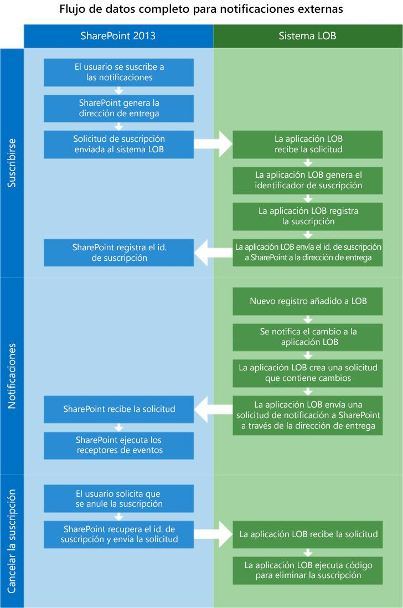
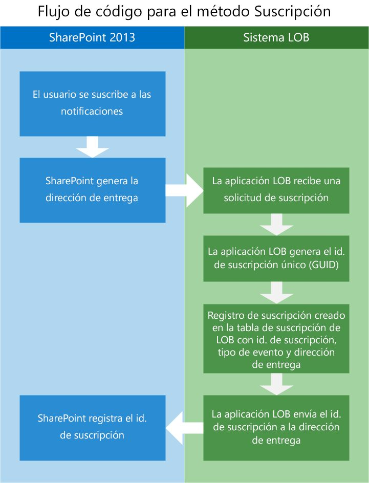
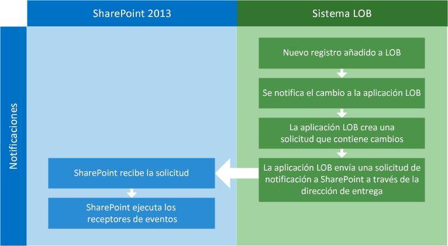
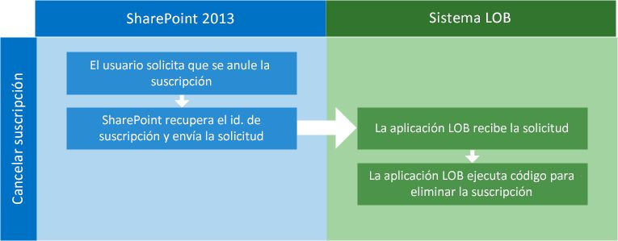

# Alertas y eventos externos en SharePoint 2013
Obtenga información sobre los conceptos de creación de receptores de eventos remotos en SharePoint 2013 que se pueden vincular a las listas externas y ejecutar cuando se actualizan los datos externos que representa la lista.
## ¿Qué son los receptores de eventos?
<a name="Externalevents_overview"> </a>

Un receptor de eventos es un fragmento de código administrado que responde a los eventos desencadenadores de SharePoint como agregar, mover, eliminar, proteger y desproteger. Cuando estos eventos se producen, y se cumplen los criterios del receptor de eventos, se ejecuta el código que se ha escrito para proporcionar funcionalidad adicional. Cuando se configuran objetos de SharePoint, como listas, flujos de trabajo y características, para que esperen a que se produzcan estos eventos, se denominan hosts del evento. 
  
    
    
Los receptores de eventos le permiten realizar lógica de negocios cuando se produce un evento específico. Básicamente, estos son los enlaces que permiten crear código para controlar ciertas condiciones, realizar notificaciones, actualizar otros sistemas, etc. Cuando se crean receptores de eventos, se genera un archivo DLL. Puede colocar dicho archivo DLL en la caché global de ensamblados, para que los receptores de eventos se invoquen en respuesta a los cambios en un sistema externo.
  
    
    
El ejemplo siguiente contiene un receptor de eventos externos simple en C# que se ejecuta cuando se agrega un nuevo elemento a la lista.
  
    
    


```cs

public class EntryContentEventReceiver : SPItemEventReceiver
{
   public override void ItemAdded(SPItemEventProperties properties)
   {
      base.ItemAdded(properties);

      // properties.ExternalNotificationMessage holds the message sent by the external 
      // system.
   }
```

Los receptores de eventos externos también pueden ampliarse para trabajar con un receptor de eventos de entidad y como receptores de eventos remotos, implementados como un servicio local o en Microsoft Azure. 
  
    
    

## ¿Qué son los receptores de eventos remotos?
<a name="WhatIsARemoteEventReceiver"> </a>

Los receptores de eventos remotos son una novedad en SharePoint 2013. En una solución tradicional de SharePoint, se utiliza un receptor de eventos para controlar eventos como la creación o eliminación de listas o de elementos de listas por parte de los usuarios. En una Complemento de SharePoint, se utiliza un receptor de eventos remotos para controlar eventos similares. Los receptores de eventos remotos funcionan de forma similar a los receptores de eventos normales, excepto que los receptores de eventos remotos controlan eventos que ocurren cuando una Complemento de SharePoint se encuentra en un sistema diferente de su aplicación web host.
  
    
    
Servicios de conectividad empresarial (BCS) usa los receptores de eventos remotos conectados a entidades y listas externas para permitirle escribir código que pueda reaccionar a cambios en los datos alojados en el sistema externo.
  
    
    
Para adaptarse a esta característica, se han agregado dos estereotipos al esquema del modelo de BDC: **EventSubscriber** y **EventUnsubscriber**.
  
    
    

> **NOTA**
> Los receptores de eventos no se admiten en soluciones de espacio aislado. 
  
    
    


## ¿Qué características y funciones proporciona la nueva infraestructura externa de receptores de eventos?
<a name="FeaturesAddedWithRER"> </a>

Mediante el uso y la ampliación de las características de los receptores de eventos de SharePoint 2013, BCS puede agregar alertas, receptores de eventos de listas externas y receptores de entidad para proporcionar una funcionalidad ampliada.
  
    
    

- **Alertas:** las alertas han sido una parte integral de SharePoint en varias versiones, pero hasta SharePoint 2013, no funcionaban con listas externas. Ahora, un usuario puede crear alertas en una lista externa que tienen el mismo comportamiento que las alertas en una lista de SharePoint estándar.
    
  
- **Receptores de eventos de listas externas:** ahora los receptores de eventos se pueden vincular a las listas externas del mismo modo que a las listas de estándar. Esto proporciona un mecanismo de extensibilidad que le permite escribir código que se ejecute a horas específicas.
    
  
- **Receptores de eventos de entidad:** los receptores de eventos de entidad proporcionan flexibilidad, ya que le permiten escribir código más sólido que, a su vez, permite otras operaciones como ofrecer contexto de usuario para el filtrado de datos. Esto abre las puertas a una personalización mejorada y una seguridad personalizada.
    
  
Los eventos remotos en SharePoint 2013 hacen posible varios escenarios interesantes. Por ejemplo, podría tener una aplicación "Seguimiento de clientes potenciales" que permite a un equipo de ventas recibir una notificación cuando se introducen nuevos clientes potenciales en una aplicación externa de clientes potenciales. Cuando se introduce un nuevo cliente potencial, SharePoint recibe una notificación a través del sistema de notificaciones que forma parte de la aplicación de clientes potenciales. SharePoint recibe la notificación y, a continuación, crea nuevas tareas para los vendedores especificados para realizar el seguimiento de cada nuevo cliente potencial. Mediante la configuración de la aplicación de entrada de clientes potenciales en el sistema externo para que envíe una notificación a SharePoint cuando se crea cada nuevo cliente potencial, SharePoint se mantiene completamente al día.
  
    
    

## Requisitos previos para usar receptores de eventos para las listas externas
<a name="bkmk_Prerequisites"> </a>

Para usar receptores de eventos para listas externas, necesita lo siguiente:
  
    
    

- SharePoint 2013
    
  
- Visual Studio 2012
    
  
Para obtener más información acerca de cómo configurar un entorno de desarrollo de SharePoint 2013, consulte  [Configurar un entorno de desarrollo general para SharePoint 2013](set-up-a-general-development-environment-for-sharepoint-2013.md).
  
    
    

## Configuración del sistema externo para notificar eventos externos a SharePoint
<a name="Externalevents_components"> </a>

Para que funcionen los eventos externos, debe estar instalado y configurado un cierto número de componentes tanto en el host de SharePoint como en el sistema externo.
  
    
    
Tiene que configurar el sistema externo, de modo que pueda hacer lo siguiente:
  
    
    

- **Determinar cuándo cambian los datos subyacentes.** Para que el sistema externo sepa cuándo se han realizado cambios, debe crear un mecanismo de sondeo de cambios específicos. Puede hacer esto utilizando un servicio programado que sondea el origen de datos a determinados intervalos de tiempo.
    
  
- **Recibir y registrar las solicitudes para suscripciones a notificaciones de cambio.** El sistema externo debe implementar un almacén de suscripción para que pueda almacenar quién debe recibir las notificaciones de cambio. Probablemente, la solución más sencilla es una tabla de base de datos. La tabla (o cualquier mecanismo que elija) debe registrar el identificador de suscripción, la dirección de entrega, el tipo de evento y el nombre de la entidad.
    
  
- **Enviar notificaciones a los extremos de la Transferencia de estado representacional (REST).** Para permitir que los suscriptores de SharePoint sepan que se ha producido un cambio, la aplicación del sistema externo necesita enviar una HTTP WebRequest a la dirección de entrega registrada en el almacén de suscripción. Esta dirección de entrega es un extremo RESTful que ha generado SharePoint durante el proceso de suscripción.
    
  

## Configuración de SharePoint 2013 para permitir la comunicación con sistemas externos
<a name="bkmk_configureSP"> </a>

Para permitir la comunicación con el sistema externo, SharePoint debe configurarse con lo siguiente:
  
    
    

- Un modelo BDC con los estereotipos **EventSubscriber** y **EventUnsubscriber** ya configurados
    
  
- Receptores de eventos
    
  

### ¿Cómo se habilitan los eventos externos?

Puede habilitar los eventos externos en SharePoint 2013 mediante **Configuración del sitio** o agregando el siguiente identificador de la característica personalizada a su proyecto.
  
    
    

```XML

<ActivationDependency FeatureTitle="BCSEvents" FeatureId="60c8481d-4b54-4853-ab9f-ed7e1c21d7e4" />
```

Los eventos de un sistema externo se habilitan cuando SharePoint crea la dirección de entrega y la envía al sistema externo durante el proceso de suscripción.
  
    
    

## Flujo general de eventos externos entre SharePoint y sistemas externos
<a name="bkmk_overallflow"> </a>

En la figura 1, observe que hay tres pasos diferentes implicados al usar receptores de eventos externos: suscripción, notificación y cancelación de la suscripción.
  
    
    

**Figura 1. Flujo completo de los datos para notificaciones externas**

  
    
    

  
    
    

  
    
    

  
    
    

  
    
    

## EventSubscriber: suscripción a las notificaciones
<a name="bkmk_eventsubscriber"> </a>

Para que un usuario (objeto de SharePoint) reciba notificaciones cuando los datos subyacentes han cambiado, el usuario debe suscribirse a las notificaciones para una entidad. Para ello, el esquema del modelo BDC se ha ampliado para incluir el estereotipo **Subscribe**. Este estereotipo se usa en SharePoint para que el sistema externo sepa que el remitente solicita una notificación de cambios en los datos subyacentes.
  
    
    
La figura 2 muestra el flujo de información entre SharePoint y el sistema externo durante el proceso de suscripción.
  
    
    

**Figura 2. Flujo del proceso de suscripción**

  
    
    

  
    
    

  
    
    
A continuación se describe el flujo general del proceso de suscripción:
  
    
    

  
    
    

1. **El usuario solicita una suscripción para las notificaciones.** Mediante una interfaz de usuario personalizada (un botón en una página o una cinta), SharePoint inicia una solicitud a la aplicación del sistema externo para recibir notificaciones.
    
  
2. **SharePoint genera una dirección de entrega.** Como parte del proceso de suscripción, SharePoint crea un extremo de REST donde se entregarán las notificaciones.
    
  
3. **La solicitud de suscripción se envía al sistema externo.** A continuación, SharePoint encapsula la información del solicitante junto con la dirección URL de REST generada dinámicamente y envía una solicitud web al sistema externo.
    
  
4. **El sistema externo recibe la solicitud.** Existen diferentes posibilidades para implementar un almacén de suscripción. En este ejemplo, se usa una tabla de base de datos de SQL Server.
    
  
5. **El sistema externo genera un identificador de suscripción.** Se genera un nuevo **subscriptionId** mediante el código de la aplicación de línea de negocio (LOB). El **subscriptionId** debe ser un GUID.
    
  
6. **El sistema externo registra la suscripción.** La aplicación del sistema externo registra el **subscriptionId**, la dirección de entrega, el tipo de evento y demás información que se envía desde SharePoint al almacén de suscripción.
    
  
7. **El sistema externo devuelve el identificador de suscripción a SharePoint.** Para que SharePoint enrute correctamente las actualizaciones que envía el sistema externo, el **subscriptionId** se envía de vuelta a SharePoint y SharePoint registra esa información en su base de datos.
    
    El modelo BDC está trabajando con la importación de la función **Subscribe**. En este ejemplo se muestran los metadatos de la importación de funciones.
    


  ```XML
  FunctionImport
 
<EntityType Name="EntitySubscribe">
   <Key>
      <PropertyRef Name="SubscriptionId" />
   </Key>
   <Property Name="SubscriptionId" Type="Edm.Int32" Nullable="false" 
      p6:StoreGeneratedPattern="Identity" 
      xmlns:p6="http://schemas.microsoft.com/ado/2009/02/edm/annotation" />
   <Property Name="EntityName" Type="Edm.String" MaxLength="250" FixedLength="false" 
      Unicode="true" />
   <Property Name="DeliveryURL" Type="Edm.String" MaxLength="250" FixedLength="false" 
      Unicode="true" />
   <Property Name="EventType" Type="Edm.Int32" />
   <Property Name="UserId" Type="Edm.String" MaxLength="50" FixedLength="false" 
      Unicode="true" />
   <Property Name="SubscribeTime" Type="Edm.Binary" MaxLength="8" FixedLength="true" 
      p6:StoreGeneratedPattern="Computed" 
      xmlns:p6="http://schemas.microsoft.com/ado/2009/02/edm/annotation" />
   <Property Name="SelectColumns" Type="Edm.String" MaxLength="10" FixedLength="false" 
      Unicode="true" />
</EntityType>

  ```


### Ejemplo de código: el modelo BDC con Subscribe

A continuación se muestra un ejemplo de un modelo BDC con el método **Subscribe** agregado.
  
    
    

```XML

<Method Name="SubscribeCustomer" DefaultDisplayName="Customer Subscribe" IsStatic="true">
   <Properties>
     <Property Name="ODataEntityUrl" Type="System.String">/EntitySubscribes</Property>
     <Property Name="ODataHttpMethod" Type="System.String">POST</Property>
     <Property Name="ODataPayloadKind" Type="System.String">Entry</Property>
     <Property Name="ODataFormat" Type="System.String">application/atom+xml</Property>
     <Property Name="ODataServiceOperation" Type="System.Boolean">false</Property>
   </Properties>
   <AccessControlList>
      <AccessControlEntry Principal="NT Authority\\Authenticated Users">
         <Right BdcRight="Edit" />
         <Right BdcRight="Execute" />
         <Right BdcRight="SetPermissions" />
         <Right BdcRight="SelectableInClients" />
      </AccessControlEntry>
   </AccessControlList>
   <Parameters>
      <Parameter Direction="In" Name="@DeliveryURL">
         <TypeDescriptor TypeName="System.String" Name="DeliveryURL" >
            <Properties>
               <Property Name="IsDeliveryAddress" Type="System.Boolean">true</Property>
            </Properties>
         </TypeDescriptor>
      </Parameter>
      <Parameter Direction="In" Name="@EventType">
         <TypeDescriptor TypeName="System.Int32" Name="EventType" >
            <Properties>
               <Property Name="IsEventType" Type="System.Boolean">true</Property>
            </Properties>
         </TypeDescriptor>
      </Parameter>
      <Parameter Direction="In" Name="@EntityName">
         <TypeDescriptor TypeName="System.String" Name="EntityName" >
            <DefaultValues>
               <DefaultValue MethodInstanceName="SubscribeCustomer" 
                  Type="System.String">Customers</DefaultValue>
            </DefaultValues>
      </TypeDescriptor>
    </Parameter>
    <Parameter Direction="In" Name="@SelectColumns">
      <TypeDescriptor TypeName="System.String" Name="SelectColumns" >
        <DefaultValues>
          <DefaultValue MethodInstanceName="SubscribeCustomer" Type="System.String">*</DefaultValue>
        </DefaultValues>
      </TypeDescriptor>
    </Parameter>
    <Parameter Direction="Return" Name="SubscribeReturn">
      <TypeDescriptor Name="SubscribeReturnRootTd" TypeName="Microsoft.BusinessData.Runtime.DynamicType">
        <TypeDescriptors>
          <TypeDescriptor Name="SubscriptionId" TypeName="System.String" >
            <Properties>
              <Property Name="SubscriptionIdName" Type="System.String">Default</Property>
            </Properties>
            <Interpretation>
              <ConvertType LOBType="System.Int32" BDCType="System.String"/>
            </Interpretation>
          </TypeDescriptor>
          <TypeDescriptor Name="DeliveryURL" TypeName="System.String" />
          <TypeDescriptor Name="SelectColumns" TypeName="System.String" >
          </TypeDescriptor>
          <TypeDescriptor Name="EntityName" TypeName="System.String" />
          <TypeDescriptor Name="EventType" TypeName="System.Int32" />
          <TypeDescriptor Name="UserId" TypeName="System.String" />
          <!--TypeDescriptor Name="SubscribeTime" TypeName="System." /-->
        </TypeDescriptors>
      </TypeDescriptor>
    </Parameter>
  </Parameters>
  <MethodInstances>
    <MethodInstance Type="EventSubscriber" ReturnParameterName="SubscribeReturn" ReturnTypeDescriptorPath="SubscribeReturnRootTd" Default="true" Name="SubscribeCustomer" DefaultDisplayName="Customer Subscribe">
      <AccessControlList>
        <AccessControlEntry Principal="NT Authority\\Authenticated Users">
          <Right BdcRight="Edit" />
          <Right BdcRight="Execute" />
          <Right BdcRight="SetPermissions" />
          <Right BdcRight="SelectableInClients" />
        </AccessControlEntry>
      </AccessControlList>
    </MethodInstance>
  </MethodInstances>
</Method>
```

En la tabla 1 se enumeran los atributos importantes del modelo BDC que son necesarios para que funcione el estereotipo **Subscribe**.
  
    
    

**Tabla 1. Atributos del modelo BDC**


|**Atributo**|**Descripción**|
|:-----|:-----|
|**IsDeliveryAddress** <br/> |Una marca **Boolean** que se usa en un **TypeDescriptor** para indicar si la dirección de entrega suministrada se usará para entregar notificaciones. <br/> |
|**IsEventType** <br/> |Una marca **Boolean** que se usa en un **TypeDescriptor** para indicar si el tipo de evento suministrado se usará como el tipo de evento. Los tipos de evento válidos son **ItemAdded**, **ItemUpdated**, **ItemDeleted**, y así sucesivamente.  <br/> |
|**SubscriptionIdName** <br/> |Una cadena que se usa en un **TypeDescriptor** que representa el nombre de una parte de **subscriptionId**.  <br/> |
   

## Notificaciones
<a name="bkmk_notifications"> </a>

En SharePoint 2013, la infraestructura de control de eventos se ha mejorado para permitir que los orígenes de datos externos notifiquen a SharePoint cuándo se ha modificado la información en el sistema externo. A continuación, cuando SharePoint recibe una notificación, los receptores de eventos que están asociados a la entidad o la lista externa de SharePoint pueden ejecutar el código para llevar a cabo las acciones especificadas.
  
    
    
Cuando se crea una suscripción, el sistema externo necesita una forma de indicarle a SharePoint los cambios realizados en una entidad determinada. Se espera que el sistema externo entregue notificaciones a la dirección de entrega que proporcionó SharePoint al sistema externo durante el proceso de suscripción mediante una carga con formato Atom de OData.
  
    
    
La figura 3 muestra el flujo de comunicación entre el sistema externo y SharePoint cuando se agrega un nuevo registro a los datos en el sistema externo.
  
    
    

**Figura 3. Proceso de notificación**

  
    
    

  
    
    

  
    
    

  
    
    

1. **Se agrega un nuevo registro al sistema externo.** En este ejemplo, se agrega un nuevo registro al sistema externo con la interfaz de usuario de la aplicación o directamente en la base de datos.
    
  
2. **Se notifica el cambio a la aplicación del sistema externo.** La aplicación del sistema externo debe ser consciente de los cambios que tienen lugar en los datos subyacentes. Hay varias formas de hacerlo. Puede usar desencadenadores SQL que se desencadenen cuando cambian los datos en tablas específicas, o puede crear un mecanismo de sondeo para consultar si se han producido cambios en el almacén de datos. Existen otras formas de lograr esto, pero cada una deberá evaluarse en función del rendimiento.
    
  
3. **El sistema externo envía la solicitud de notificación a SharePoint a través de la dirección de entrega.** Para comunicar los cambios, debe enviarse una solicitud con formato Atom a la dirección de entrega almacenada en el almacén de suscripciones de la aplicación LOB.
    
  

### Carga de la notificación

Para construir la notificación, el sistema LOB tiene que crear una carga HTTP que incluya todos los detalles del elemento que ha cambiado o solo la identidad del elemento que ha cambiado.
  
    
    

- **Identidad:** cuando la carga se envía como una identidad, se espera que la carga solo contenga información acerca de la identidad del elemento modificado. Por ejemplo, para un cliente en una entidad Clientes, la carga solo contendría el identificador del cliente que ha cambiado.
    
  
- **Elemento completo:** en este caso, la carga es un registro completo que ha cambiado en el sistema externo. En el ejemplo de cliente, se incluye todo el registro modificado del cliente.
    
  

> **NOTA**
> El elemento completo solo se admite cuando se utiliza el conector OData. 
  
    
    

El tipo de carga que envía el sistema externo debe indicarse durante el proceso de suscripción.
  
    
    
El siguiente ejemplo muestra la propiedad del modelo BDC que se usa para las notificaciones.
  
    
    


```XML

<Property Name="NotificationParserType" Type="System.String">
   ODataEntryContentNotificationParser
</Property>

```

Si no se especifica, la carga predeterminada es una carga de identidad.
  
    
    

### Dirección de entrega de notificaciones (dirección virtual)

El proceso de suscripción iniciado desde SharePoint tiene como resultado la creación, por parte de SharePoint, de una dirección virtual, lo que permite un punto de entrada para que el sistema externo envíe las notificaciones. El sistema externo usa la dirección de entrega para enviar dichas notificaciones. La dirección de entrega también se pasa al sistema externo durante la solicitud de suscripción.
  
    
    

## EventUnsubscriber: eliminación de una suscripción de la lista de notificaciones
<a name="bkmk_eventunsubscriber"> </a>

La operación **Unsubscribe** elimina una suscripción de la lista de notificaciones.
  
    
    
 La figura 4 muestra que el método **UnSubscribe** es mucho más simple. Dado que el identificador de suscripción se envió de vuelta a SharePoint, y SharePoint lo registró, todo lo que se necesita es enviar la solicitud de cancelación de la suscripción con el identificador de suscripción correcto.
  
    
    

**Figura 4. Flujo de código del método de cancelación de suscripción**

  
    
    

  
    
    

  
    
    

### Modelo BDC para cancelar la suscripción

El siguiente ejemplo de código XML muestra cómo crear un modelo BDC que cancela la suscripción de las notificaciones de eventos del sistema externo.
  
    
    

```XML

<Method Name="UnSubscribeExpenseReport" DefaultDisplayName="ExpenseReport
    Unsubscribe">
    <Properties>
        <Property Name="ODataEntityUrl" Type="System.String">
            /Subscriptions(@ID)</Property>
        <Property Name="ODataHttpMethod" Type="System.String">DELETE</Property>
        <Property Name="ODataPayloadKind" Type="System.String">Property</Property>
        <Property Name="ODataServiceOperation" Type="System.Boolean">false</Property>
    </Properties>
    <AccessControlList>
        <AccessControlEntry Principal="NT Authority\\Authenticated Users">
            <Right BdcRight="Edit" />
            <Right BdcRight="Execute" />
            <Right BdcRight="SetPermissions" />
            <Right BdcRight="SelectableInClients" />
        </AccessControlEntry>
    </AccessControlList>
    <Parameters>
        <Parameter Name="@ID" Direction="In">
            <TypeDescriptor Name="ID" TypeName="System.Int32">
                <Properties>
                    <Property Name="SubscriptionIdName" Type="System.String">ID</Property>
                </Properties>
                <Interpretation>
                    <ConvertType LOBType="System.Int32" BDCType="System.String" />
                </Interpretation>
            </TypeDescriptor>
        </Parameter>
    </Parameters>
    <MethodInstances>
        <MethodInstance Name="UnSubscribeExpenseReport" DefaultDisplayName="ExpenseReport 
             Unsubscribe" Type="EventUnsubscriber" Default="true">
            <AccessControlList>
                <AccessControlEntry Principal="NT Authority\\Authenticated Users">
                    <Right BdcRight="Edit" />
                    <Right BdcRight="Execute" />
                    <Right BdcRight="SetPermissions" />
                    <Right BdcRight="SelectableInClients" />
                </AccessControlEntry>
            </AccessControlList>
        </MethodInstance>
    </MethodInstances>
</Method>


<Method IsStatic="false" Name="Unsubscribe">
    <AccessControlList>
        <AccessControlEntry Principal="NT AUTHORITY\\Authenticated Users">
            <Right BdcRight="Edit" />
            <Right BdcRight="Execute" />
            <Right BdcRight="SetPermissions" />
            <Right BdcRight="SelectableInClients" />
        </AccessControlEntry>
    </AccessControlList>
    <Parameters>
        <Parameter Direction="In" Name="subscriptionId">
            <TypeDescriptor TypeName="System.String" Name="subscriptionId" 
                IsSubscriptionId="true" />
         </Parameter>
    </Parameters>
    <MethodInstances>
        <MethodInstance Type="EventUnsubscriber" Default="true" Name="Unsubscribe" 
            DefaultDisplayName="UnSubscriber">
            <Properties>
                <Property Name="LastDesignedOfficeItemType" Type="System.String">None</Property>
            </Properties>
            <AccessControlList>
                <AccessControlEntry Principal=" NT AUTHORITY\\Authenticated Users ">
                    <Right BdcRight="Edit" />
                    <Right BdcRight="Execute" />
                    <Right BdcRight="SetPermissions" />
                    <Right BdcRight="SelectableInClients" />
                </AccessControlEntry>
            </AccessControlList>
        </MethodInstance>
    </MethodInstances>
</Method>

```


## Ejemplo de código: adjuntar un receptor de eventos a una lista externa
<a name="AttachingRER"> </a>

El código siguiente proporciona un ejemplo de cómo adjuntar un receptor de eventos a una lista externa. Una vez adjuntado, el receptor de eventos escucha las notificaciones del sistema externo sobre las actualizaciones, adiciones y eliminaciones que se realizan en los datos nativos.
  
    
    

```XML

private static void AddEventReceiver(string siteUrl, string listTitle)
{ 
   string assembly = "SampleEventReceiver, Culture=neutral, Version=1.0.0.0, 
      PublicKeyToken=1bfafa687d2e46a7";
   string className = "SampleEventReceiver.EntryContentEventReceiver"; 
   
   try
   {
      using (SPSite site = new SPSite(siteUrl)) 
      { 
         using (SPWeb web = site.OpenWeb()) 
         {
            SPList list = web.Lists[listTitle]; 
            list.EventReceivers.Add(SPEventReceiverType.ItemAdded, 
               assembly, className); 
         }
      }
   }
   catch (Exception e) 
   { 
      Console.WriteLine(e); 
   }
}

```


## Más allá de los conceptos básicos: aprenda más sobre el uso de receptores de eventos externos
<a name="Externalevents_Learnmore"> </a>

Para obtener más información acerca de alertas y eventos externos, consulte lo siguiente.
  
    
    

**Tabla 2. Conceptos avanzados para trabajar con los receptores de eventos externos**


|**Artículo**|**Descripción**|
|:-----|:-----|
| [Procedimientos: Crear un servicio de datos OData para su uso como un sistema externo de BCS](how-to-create-an-odata-data-service-for-use-as-a-bcs-external-system.md) <br/> |Aprenda cómo crear un servicio Windows Communication Foundation (WCF) direccionable mediante Internet que use OData para enviar notificaciones a SharePoint 2013 cuando cambian los datos subyacentes. Estas notificaciones se usan para desencadenar eventos vinculados a listas externas.  <br/> |
   

## Recursos adicionales
<a name="Externalevents_Addres"> </a>


-  [Novedades en Servicios de conectividad empresarial en SharePoint 2013](what-s-new-in-business-connectivity-services-in-sharepoint-2013.md)
    
  
-  [Servicios de conectividad empresarial de SharePoint 2013](business-connectivity-services-in-sharepoint-2013.md)
    
  
-  [Referencia a los programadores de Servicios de conectividad empresarial para SharePoint 2013](business-connectivity-services-programmers-reference-for-sharepoint-2013.md)
    
  
-  [Cómo crear receptores de eventos externos](how-to-create-external-event-receivers.md)
    
  

