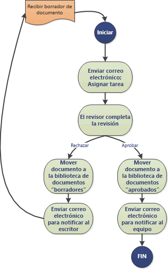
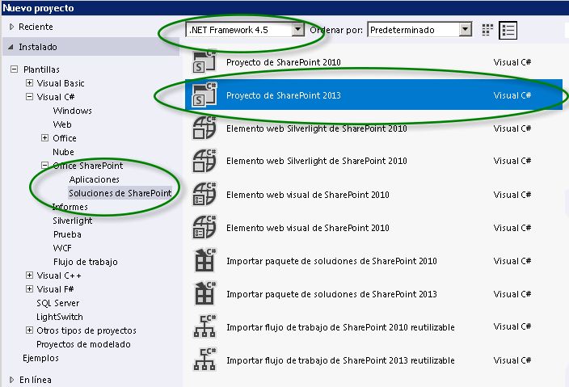
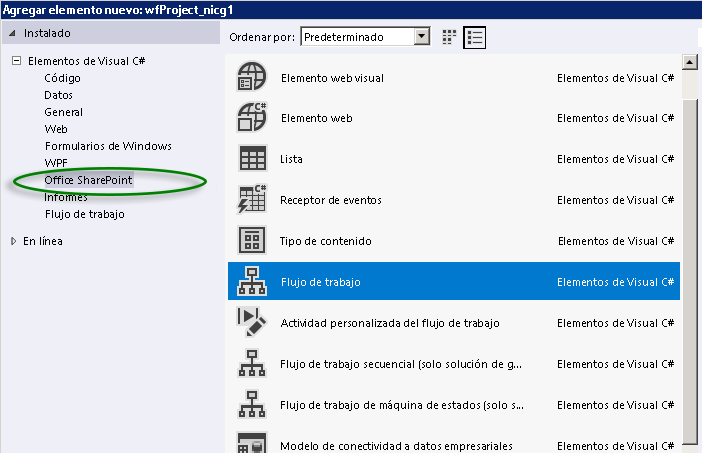
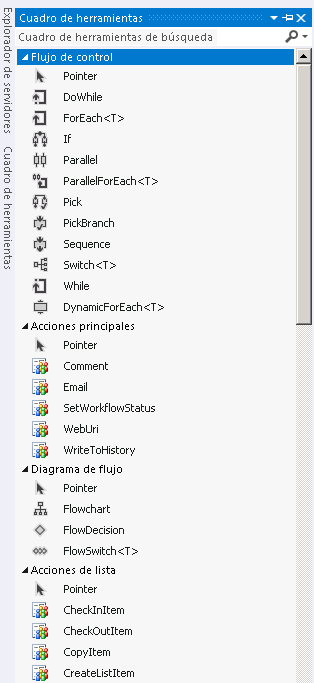

# Introducción a los flujos de trabajo de SharePoint 2013
Obtenga información sobre el nuevo Cliente del Administrador de flujos de trabajo 1.0, que proporciona la infraestructura para los flujos de trabajo de SharePoint 2013, y sobre cómo se integran los flujos de trabajo de SharePoint con el nuevo modelo para aplicaciones para SharePoint.
> **IMPORTANTE**
> Para obtener instrucciones para la instalación y configuración de SharePoint Server 2013 y Microsoft Azure, consulte  [Instalar y configurar el Administrador de flujos de trabajo de SharePoint 2013](set-up-and-configure-sharepoint-2013-workflow-manager.md). 
  
    
    

## Información general sobre flujos de trabajo de SharePoint 2013

Los flujos de trabajo de SharePoint 2013 permiten modelar y automatizar procesos empresariales. Estos procesos empresariales pueden ser tan simples como un proceso de aprobación de documentos con un único aprobador (mostrado en la figura 1), tan complejos como un catálogo de productos para clientes con llamadas a servicios web y compatibilidad con bases de datos o tan formidables como prácticamente cualquier proceso empresarial estructurado, lleno de condiciones, bucles, entradas de usuario, tareas y acciones personalizadas.
  
    
    

**Figura 1. Flujo de trabajo simple de SharePoint**

  
    
    

  
    
    

  
    
    

  
    
    
SharePoint 2013 marca la introducción de Cliente del Administrador de flujos de trabajo 1.0 como eficaz y novedosa base para flujos de trabajo de Visual Studio. Creado en Windows Workflow Foundation 4, Cliente del Administrador de flujos de trabajo 1.0 ofrece ventajas con respecto a las versiones anteriores que reflejan el compromiso de SharePoint con el modelo para aplicaciones para SharePoint y la informática en la nube. Para ver detalles de estos cambios, consulte  [Novedades en flujos de trabajo para SharePoint 2013](what-s-new-in-workflows-for-sharepoint-2013.md) y [Aspectos básicos de los flujos de trabajo de SharePoint 2013](sharepoint-2013-workflow-fundamentals.md).
  
    
    
Quizás lo más importante para los creadores de flujos de trabajo sea que la forma de crear flujos de trabajo se ha mejorado y simplificado en gran medida. No solo los flujos de trabajo ahora son totalmente declarativos (es decir, flujos de trabajo sin código basados en el diseñador), sino que se han simplificado y perfeccionado los entornos principales de creación de flujos de trabajo, Visual Studio 2012 y SharePoint Designer 2013.
  
    
    
Las mejoras fundamentales de los flujos de trabajo de SharePoint 2013 incluyen lo siguiente. Para obtener información más detallada sobre las novedades de los flujos de trabajo de SharePoint 2013, consulte  [Novedades en flujos de trabajo para SharePoint 2013](what-s-new-in-workflows-for-sharepoint-2013.md).
  
    
    

- Conectividad mejorada para permitir la ejecución de flujos de trabajo en la nube. De hecho, en SharePoint 2013 hay una paridad del 100 % entre flujos de trabajo locales y basados en Office 365.
    
  
- En SharePoint 2013 hay interoperabilidad completa con los flujos de trabajo de SharePoint 2010, que se habilita mediante el  [Interoperabilidad de flujos de trabajo de SharePoint ](sharepoint-2013-workflow-fundamentals.md#bkm_InteropBridge).
    
  
- Expresividad de creación mejorada mediante eventos y estructuras de acción, servicios web y programación clásica de Visual Studio, todo en un entorno declarativo sin código.
    
  
- Escalabilidad y robustez coherentes con los requisitos de Office 365 y el Modelo de aplicación de nube.
    
  
- Conectividad mejorada para fomentar sistemas integrados altamente funcionales. Puede llamar a los flujos de trabajo y controlarlos desde cualquier sistema externo. Además, el flujo de trabajo puede realizar llamadas a servicios web a cualquier origen de streaming o datos mediante protocolos como HTTP, SOAP, Open Data Protocol (OData) y Transferencia de estado representacional (REST).
    
  
- Capacidades de creación mejoradas para no desarrolladores en SharePoint Designer 2013 y posibilidad de crear lógica de flujo de trabajo en Visio.
    
  
- Desarrollo de flujos de trabajo mejorado, y aún así simplificado, en Visual Studio, lo que incluye compatibilidad con acciones de flujo de trabajo personalizadas, desarrollo rápido en un entorno declarativo, desarrollo en un solo paso y compatibilidad con el desarrollo de Complementos de SharePoint.
    
  
- Compatibilidad plena con las Complementos de SharePoint basadas en flujos de trabajo, en las que los flujos de trabajo actúan como el nivel intermedio para la administración de procesos empresariales.
    
  

## Cliente del Administrador de flujos de trabajo 1.0 y el modelo para aplicaciones para SharePoint

Visual Studio 2012 está optimizado para desarrollar Complementos de SharePoint basadas en flujos de trabajo y para aprovechar la enorme eficacia y flexibilidad del modelo para aplicaciones para SharePoint. Puede usar el modelo de objetos de flujos de trabajo de SharePoint para habilitar la lógica de flujo de trabajo subyacente en una aplicación de SharePoint de tal forma que los usuarios finales experimenten la propia superficie de la aplicación mientras que, por debajo, esta se basa en la lógica de flujo de trabajo.
  
    
    
Además, Visual Studio 2012 es ideal para desarrollar Complementos de Office, que pueden ejecutar flujos de trabajo desde el interior de una aplicación de Microsoft Office.
  
    
    

## Creación de flujos de trabajo de SharePoint 2013

Hay dos entornos de creación principales para Cliente del Administrador de flujos de trabajo 1.0: SharePoint Designer 2013 y Visual Studio. Además, los trabajadores de la información no técnicos pueden usar Visio para crear lógica de flujo de trabajo que luego usted puede importar a SharePoint Designer y ensamblar en un proyecto de flujo de trabajo de SharePoint.
  
    
    
No obstante, los entornos de creación principales son Visual Studio 2012 y SharePoint Designer 2013. Para ayudarle a decidir cuál de ellos se ajusta mejor a sus necesidades, consulte la matriz de decisión de  [Comparación de SharePoint Designer y Visual Studio](develop-sharepoint-2013-workflows-using-visual-studio.md#bkm_Comparing).
  
    
    

## SharePoint Designer 2013 como herramienta de creación de flujos de trabajo

En muchos aspectos, SharePoint Designer 2013 es la herramienta de creación preferida para flujos de trabajo de SharePoint. Aunque algunas tareas avanzadas (como la creación de acciones personalizadas, por ejemplo) exigen la intervención de un desarrollador con Visual Studio, SharePoint Designer 2013 proporciona el acceso más flexible al desarrollo de flujos de trabajo al segmento más amplio de creadores de flujos de trabajo.
  
    
    

## Crear un flujo de trabajo mediante Visual Studio 2012

Visual Studio 2012 tiene integrados tipos de proyecto de flujo de trabajo de SharePoint 2013. Para crear un proyecto de flujo de trabajo de SharePoint en Visual Studio, siga estos pasos.
  
    
    

### Para crear un flujo de trabajo con Visual Studio

1. Abra Visual Studio 2012 y cree un nuevo proyecto. En el cuadro de diálogo **Nuevo proyecto**, elija **Plantillas**, **Visual C#**, **Office SharePoint**, **Soluciones de SharePoint** y **Proyecto de SharePoint 2013**, como se muestra en la figura 2.
    
   **Figura 2. Cuadro de diálogo Nuevo proyecto**

  

  

  

  
2. Con el proyecto creado, elija **Agregar nuevo elemento** en el menú **Proyecto** y luego **Flujo de trabajo** en el elemento **Office SharePoint**, como se muestra en la figura 3.
    
   **Figura 3. Cuadro de diálogo Agregar nuevo elemento**

  

  

  

  
3. Una vez creado el proyecto de flujo de trabajo, aparece una superficie de diseñador en la que crear el flujo de trabajo. El entorno de desarrollo de flujos de trabajo incluye un cuadro de herramientas personalizado con una gran paleta de elementos de creación de flujos de trabajo.
    
   **Figura 4. Cuadro de herramientas de creación de flujos de trabajo de Visual Studio**

  

  

  

  

## Recursos adicionales

Para obtener más información sobre **Complementos de SharePoint**, consulte lo siguiente:
  
    
    

-  [Complementos de SharePoint](http://msdn.microsoft.com/library/cd1eda9e-8e54-4223-93a9-a6ea0d18df70%28Office.15%29.aspx)
    
  
-  [Tres formas de concebir las opciones de diseño de complementos para SharePoint](http://msdn.microsoft.com/library/0942fdce-3227-496a-8873-399fc1dbb72c%28Office.15%29.aspx)
    
  
-  [Aspectos importantes del panorama de desarrollo y arquitectura de los complementos para SharePoint](http://msdn.microsoft.com/library/ae96572b-8f06-4fd3-854f-fc312f7f2d88%28Office.15%29.aspx)
    
  
-  [Trabajar con datos externos en SharePoint 2013](http://msdn.microsoft.com/library/1534a5f4-1d83-45b4-9714-3a1995677d85%28Office.15%29.aspx)
    
  
Para obtener más información sobre el desarrollo de flujos de trabajo mediante **Visual Studio 2012** y **SharePoint Designer 2013**, consulte lo siguiente:
  
    
    

-  [Desarrollar de flujos de trabajo de SharePoint 2013 mediante Visual Studio](develop-sharepoint-2013-workflows-using-visual-studio.md)
    
  
-  [Desarrollo de flujos de trabajo en SharePoint Designer y Visio](workflow-development-in-sharepoint-designer-and-visio.md)
    
  
Para obtener más información sobre Windows Workflow Foundation 4, consulte lo siguiente: 
  
    
    

-  [Introducción a Windows Workflow Foundation (WF) en .NET 4 de un desarrollador](http://msdn.microsoft.com/es-es/library/ee342461.aspx)
    
  
-  [Novedades de Windows Workflow Foundation](http://msdn.microsoft.com/es-es/library/dd489410%28v=vs.110%29.aspx)
    
  
-  [Guía de Windows Workflow Foundation para principiantes](http://msdn.microsoft.com/es-es/netframework/first-steps-with-wf.aspx)
    
  
-  [El modo de flujos de trabajo: Windows Workflow Foundation](http://msdn.microsoft.com/es-es/library/dd851337.aspx)
    
  
-  [Introducción al motor de reglas de Windows Workflow Foundation](http://msdn.microsoft.com/es-es/library/dd554919.aspx)
    
  
-  [Integración de Windows Workflow Foundation con Windows Communication Foundation](http://msdn.microsoft.com/es-es/library/cc626077.aspx)
    
  

