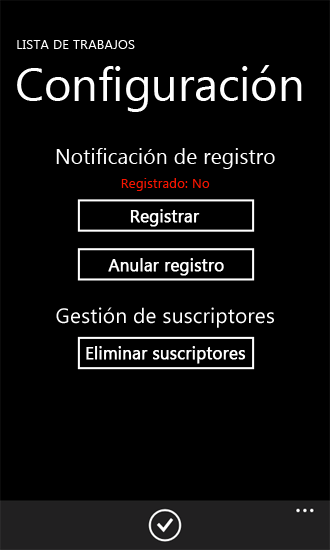
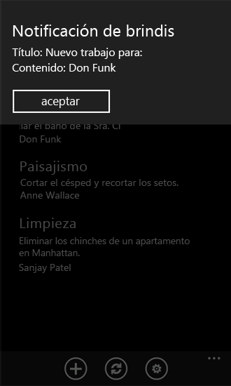
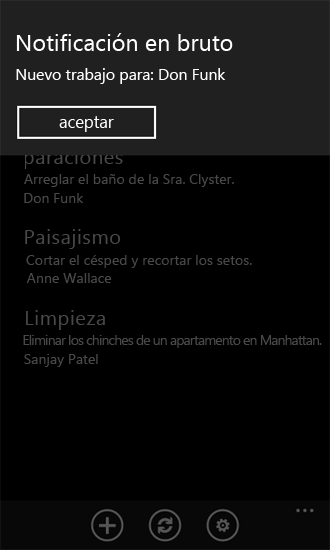
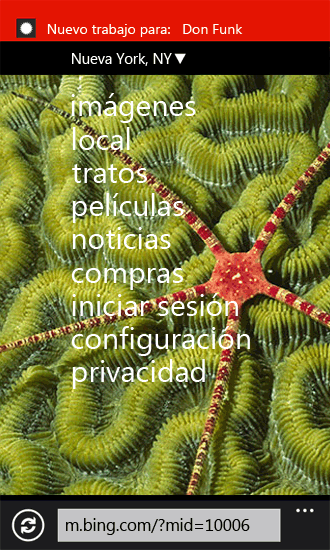

# Cómo: Configurar y usar las notificaciones de inserción en aplicaciones de SharePoint 2013 para Windows Phone
Crear una solución en SharePoint Server para enviar notificaciones push y desarrollar una aplicación de Windows Phone para recibir las notificaciones.
Con el Servicio de notificaciones push de Microsoft (MPNS), las aplicaciones de Windows Phone pueden recibir notificaciones a través de Internet de los eventos desencadenados en Microsoft SharePoint Server. La aplicación de teléfono no tiene que sondear el servidor por los cambios, por ejemplo, en los elementos de una lista basada en la aplicación de teléfono. La aplicación puede registrarse para recibir notificaciones del servidor y un receptor de eventos puede iniciar una notificación y enviarla a la aplicación receptora para su control. La notificación push se retransmite a dispositivos Windows Phone por MPNS.
  
    
    

Windows Phone 7 no admite la ejecución de varias aplicaciones simultáneamente. A diferencia de los componentes del sistema operativo Windows Phone, en el teléfono solo se puede ejecutar una aplicación a la vez. Puede producirse un evento relevante para una aplicación de teléfono determinada (como, por ejemplo, un elemento de lista que se agrega a una lista) cuando la aplicación no se está ejecutando en primer plano en el teléfono (es decir, cuando la aplicación está cerrada o desechada). Podría desarrollar un servicio en segundo plano en el teléfono con una tarea periódica que comprobaría los cambios en la lista en el servidor, pero este enfoque consumiría recursos (como energía de batería y ancho de banda de red) en el teléfono. Con MPNS y los componentes que admiten notificaciones integradas en el sistema operativo Windows Phone 7, el propio teléfono puede recibir una notificación relevante en el contexto de una aplicación determinada, incluso cuando no se está ejecutando dicha aplicación y el usuario puede tener la oportunidad de iniciar la aplicación correspondiente en respuesta a la notificación. (Para obtener más información sobre las notificaciones push, consulte  [Información general de las notificaciones push para Windows Phone](http://msdn.microsoft.com/es-es/library/ff402558%28VS.92%29.aspx) en MSDN Library).
En este tema, se crea una solución de servidor para enviar notificaciones push a una aplicación de teléfono basada en un cambio en la lista en el que se basa la aplicación. Luego, creará la aplicación de teléfono para recibir estas notificaciones.
  
    
    


## Crear una solución de servidor para enviar notificaciones push basadas en un evento de elemento de lista
<a name="BKMK_ServerSideSolution"> </a>

La solución del servidor puede ser una aplicación de SharePoint implementada en un objeto **SPWeb** aislado o una solución de granja de servidores de SharePoint empaquetadas como un paquete de soluciones de SharePoint (es decir, un archivo .wsp) que contiene una función con ámbito web. En los procedimientos de esta sección, desarrollará una solución sencilla de SharePoint que crea una lista de destino que usará una aplicación de Windows Phone y activará el mecanismo de notificación push en el servidor. En la siguiente sección, desarrollará la aplicación de Windows Phone para recibir notificaciones de la solución del servidor.
  
    
    

### Para crear el proyecto del servidor


1. Inicie Visual Studio 2012 con la opción **Ejecutar como administrador**.
    
  
2. Seleccione **Archivo**, **Nuevo**, **Proyecto**.
    
    Se abrirá el cuadro de diálogo **Nuevo proyecto**.
    
  
3. En el cuadro de diálogo **Nuevo proyecto**, expanda el nodo **SharePoint** en **Visual C#**y luego elija el nodo **15**.
    
  
4. En el panel **Plantillas**, seleccione **Proyecto de SharePoint 2013** y especifique un nombre para el proyecto, comoPushNotificationsList.
    
  
5. Presione el botón **Aceptar**. Aparece el Asistente para la personalización de SharePoint. Este asistente le permite seleccionar el sitio de destino para el desarrollo y la depuración del proyecto y el nivel de confianza de la solución.
    
  
6. Especifique la dirección URL de un sitio de SharePoint Server. Seleccione un sitio que podrá usar más adelante en el desarrollo de la aplicación de la lista de SharePoint para Windows Phone.
    
  
7. Seleccione **Implementar como solución de granja de servidores** y luego haga clic en **Finalizar** para crear el proyecto.
    
  
Luego agregue un archivo de clase al proyecto y cree un par de clases para encapsular y administrar las notificaciones push.
  
    
    

### Para crear las clases para administrar las notificaciones push


1. En el **Explorador de soluciones**, elija el nodo que representa el proyecto (llamado PushNotificationsList si ha seguido la convención de nomenclatura usada en estos procedimientos).
    
  
2. En el menú **Proyecto**, seleccione **Agregar clase**. Se abrirá el cuadro de diálogo **Agregar elemento nuevo** con la plantilla C# **Class** ya seleccionada.
    
  
3. Especifique PushNotification.cs como el nombre del archivo y haga clic en **Agregar**. El archivo de clase se agregará a la solución y se abrirá para edición.
    
  
4. Sustituya el contenido del archivo con el código siguiente.
    
  ```cs
  
using System;
using System.Collections.Generic;
using System.IO;
using System.Linq;
using System.Net;
using System.Text;
using Microsoft.SharePoint;

namespace PushNotificationsList
{
    internal static class WP7Constants
    {
        internal static readonly string[] WP_RESPONSE_HEADERS = 
            {
                "X-MessageID",
                "X-DeviceConnectionStatus",
                "X-SubscriptionStatus",
                "X-NotificationStatus"
            };
    }

    public enum TileIntervalValuesEnum
    {
        ImmediateTile = 1,
        Delay450SecondsTile = 11,
        Delay900SecondsTile = 21,
    }

    public enum ToastIntervalValuesEnum
    {
        ImmediateToast = 2,
        Delay450SecondsToast = 12,
        Delay900SecondsToast = 22,
    }

    public enum RawIntervalValuesEnum
    {
        ImmediateRaw = 3,
        Delay450SecondsRaw = 13,
        Delay900SecondsRaw = 23
    }

    public enum NotificationTypeEnum
    {
        Tile = 1,
        Toast = 2,
        Raw = 3
    }

    class PushNotification
    {
        public PushNotificationResponse PushToast(SPPushNotificationSubscriber subscriber, string toastTitle, string toastMessage, string toastParam, ToastIntervalValuesEnum intervalValue)
        {
            // Construct toast notification message from parameter values.
            string toastNotification = "<?xml version=\\"1.0\\" encoding=\\"utf-8\\"?>" +
            "<wp:Notification xmlns:wp=\\"WPNotification\\">" +
               "<wp:Toast>" +
                    "<wp:Text1>" + toastTitle + "</wp:Text1>" +
                    "<wp:Text2>" + toastMessage + "</wp:Text2>" +
                    "<wp:Param>" + toastParam + "</wp:Param>" +
               "</wp:Toast> " +
            "</wp:Notification>";

            return SendPushNotification(NotificationTypeEnum.Toast, subscriber, toastNotification, (int)intervalValue);
        }

        public PushNotificationResponse PushRaw(SPPushNotificationSubscriber subscriber, string rawMessage, RawIntervalValuesEnum intervalValue)
        {
            return SendPushNotification(NotificationTypeEnum.Raw, subscriber, rawMessage, (int)intervalValue);
        }

        private PushNotificationResponse SendPushNotification(NotificationTypeEnum notificationType, SPPushNotificationSubscriber subscriber, string message, int intervalValue)
        {
            // Create HTTP Web Request object.
            string subscriptionUri = subscriber.ServiceToken;
            HttpWebRequest sendNotificationRequest = (HttpWebRequest)WebRequest.Create(subscriptionUri);

            // MPNS expects a byte array, so convert message accordingly.
            byte[] notificationMessage = Encoding.Default.GetBytes(message);
            
            // Set the notification request properties.
            sendNotificationRequest.Method = WebRequestMethods.Http.Post;
            sendNotificationRequest.ContentLength = notificationMessage.Length;
            sendNotificationRequest.ContentType = "text/xml";
            sendNotificationRequest.Headers.Add("X-MessageID", Guid.NewGuid().ToString());

            switch (notificationType)
            {
                case NotificationTypeEnum.Tile:
                    sendNotificationRequest.Headers.Add("X-WindowsPhone-Target", "token");
                    break;
                case NotificationTypeEnum.Toast:
                    sendNotificationRequest.Headers.Add("X-WindowsPhone-Target", "toast");
                    break;
                case NotificationTypeEnum.Raw:
                    // A value for the X-WindowsPhone-Target header is not specified for raw notifications.
                    break;
            }            

            sendNotificationRequest.Headers.Add("X-NotificationClass", intervalValue.ToString());

            // Merge byte array payload with headers.
            using (Stream requestStream = sendNotificationRequest.GetRequestStream())
            {
                requestStream.Write(notificationMessage, 0, notificationMessage.Length);
            }

            string statCode = string.Empty;
            PushNotificationResponse notificationResponse;

            try
            {
                // Send the notification and get the response.
                HttpWebResponse response = (HttpWebResponse)sendNotificationRequest.GetResponse();
                statCode = Enum.GetName(typeof(HttpStatusCode), response.StatusCode);

                // Create PushNotificationResponse object.
                notificationResponse = new PushNotificationResponse((int)intervalValue, subscriber.ServiceToken);
                notificationResponse.StatusCode = statCode;
                foreach (string header in WP7Constants.WP_RESPONSE_HEADERS)
                {
                    notificationResponse.Properties[header] = response.Headers[header];
                }                
            }
            catch (Exception ex)
            {
                statCode = ex.Message;
                notificationResponse = new PushNotificationResponse((int)intervalValue, subscriber.ServiceToken);
                notificationResponse.StatusCode = statCode;
            }

            return notificationResponse;
        }
    }     

    /// <summary>
    /// Object used for returning notification request results.
    /// </summary>
    class PushNotificationResponse
    {
        private DateTime timestamp;
        private int notificationIntervalValue;
        private string statusCode = string.Empty;
        private string serviceToken;
        private Dictionary<string, string> properties;

        public PushNotificationResponse(int numericalIntervalValue, string srvcToken)
        {
            timestamp = DateTime.UtcNow;
            notificationIntervalValue = numericalIntervalValue;
            serviceToken = srvcToken;
            properties = new Dictionary<string, string>();
        }

        public DateTime TimeStamp
        {
            get { return timestamp; }
        }

        public int NotificationIntervalValue
        {
            get { return notificationIntervalValue; }
        }

        public string StatusCode
        {
            get { return statusCode; }
            set { statusCode = value; }
        }

        public string ServiceToken
        {
            get { return serviceToken; }
        }

        public Dictionary<string, string> Properties
        {
            get { return properties; }
        }
    }
}
  ```

5. Guarde el archivo.
    
  
En este código, los métodos **PushToast** y **PushRaw** reciben argumentos de parámetro adecuados para el tipo de notificación para enviar, los procesan y luego llaman al método **SendPushNotification**, que se encarga de enviar la notificación mediante el Servicio de notificaciones push de Microsoft. (En este ejemplo de código, no se ha implementado ningún método para enviar notificaciones de icono). La clase **PushNotificationResponse** simplemente es un mecanismo para encapsular el resultado recibido de la solicitud de notificación. En este caso, la clase agrega información al objeto (convertido en un objeto **HttpWebResponse**) devuelto por el método **GetResponse** del objeto **HttpWebRequest**. El receptor de eventos que se crea en el siguiente procedimiento usa esta clase **PushNotificationResponse** para actualizar una lista de resultados de notificaciones en el servidor.
  
    
    
Ahora, cree una clase de receptor de eventos que enviará notificaciones push a dispositivos que se han registrado para recibirlos. (Enlazará este receptor de eventos a la lista de trabajos que se creará en un procedimiento posterior).
  
    
    

### Para crear la clase de receptor de eventos para una lista


1. En el **Explorador de soluciones**, elija el nodo que representa el proyecto.
    
  
2. En el menú **Proyecto**, haga clic en **Agregar clase**. Aparece el cuadro de diálogo **Agregar nuevo elemento** con la plantilla **Clase** de C# ya seleccionada.
    
  
3. Especifique ListItemEventReceiver.cs como el nombre del archivo y haga clic en **Agregar**. El archivo de clase se agregará a la solución y se abrirá para edición.
    
  
4. Reemplace el contenido del archivo con el código siguiente.
    
  ```cs
  
using System;
using System.Security.Permissions;
using System.Text;
using Microsoft.SharePoint;
using Microsoft.SharePoint.Utilities;

namespace PushNotificationsList
{
    /// <summary>
    /// List Item Events
    /// </summary>
    public class ListItemEventReceiver : SPItemEventReceiver
    {
        internal static string ResultsList = "Push Notification Results";

        /// <summary>
        /// An item was added.
        /// </summary>
        public override void ItemAdded(SPItemEventProperties properties)
        {
            SPWeb spWeb = properties.Web;
            SPPushNotificationSubscriberCollection pushSubscribers = spWeb.PushNotificationSubscribers;
            PushNotification pushNotification = new PushNotification();

            SPListItem listItem = properties.ListItem;

            string jobAssignment = "[Unassigned]";

            // This event receiver is intended to be associated with a specific list,
            // but the list may not have an "AssignedTo" field, so using try/catch here.
            try
            {
                jobAssignment = listItem["AssignedTo"].ToString();
            }
            catch { }

            PushNotificationResponse pushResponse = null;

            foreach (SPPushNotificationSubscriber ps in pushSubscribers)
            {
                // Send a toast notification to be displayed on subscribed phones on which the app is not running.
                pushResponse = pushNotification.PushToast(ps, "New job for:", jobAssignment, string.Empty, ToastIntervalValuesEnum.ImmediateToast);
                UpdateNotificationResultsList(spWeb, ps.User.Name, pushResponse);

                // Also send a raw notification to be displayed on subscribed phones on which the app is running when the item is added.
                pushResponse = pushNotification.PushRaw(ps, string.Format("New job for: {0}", jobAssignment), RawIntervalValuesEnum.ImmediateRaw);
                UpdateNotificationResultsList(spWeb, ps.User.Name, pushResponse);
            }

            base.ItemAdded(properties);
        }

        private void UpdateNotificationResultsList(SPWeb spWeb, string subscriberName, PushNotificationResponse pushResponse)
        {
            SPList resultsList = spWeb.Lists.TryGetList(ResultsList);

            if (resultsList == null)
                return;

            try
            {
                SPListItem resultItem = resultsList.Items.Add();
                resultItem["Title"] = subscriberName;
                resultItem["Notification Time"] = pushResponse.TimeStamp;
                resultItem["Status Code"] = pushResponse.StatusCode;
                resultItem["Service Token"] = pushResponse.ServiceToken;

                StringBuilder builder = new StringBuilder();
                foreach (string key in pushResponse.Properties.Keys)
                {
                    builder.AppendFormat("{0}: {1}; ", key, pushResponse.Properties[key]);
                }
                resultItem["Headers"] = builder.ToString();

                resultItem["Interval Value"] = pushResponse.NotificationIntervalValue;
                resultItem.Update();
            }
            catch
            {
                // Could log to ULS here if adding list item fails.
            }
        }
    }
}
  ```

5. Guarde el archivo.
    
  
En este código, después de agregar un elemento a la lista a la que está enlazado el receptor de eventos, se enviarán notificaciones push a los suscriptores que se hayan registrado para recibir notificaciones. El valor del campo Asignado a del elemento de la lista agregado está incluido en el mensaje de notificación enviado a los suscriptores. Para la notificación del sistema, se establecen los valores del parámetro **toastTitle** (para el método **PushToast** definido en el procedimiento anterior) y el parámetro **toastMessage**. Estos valores corresponden a las propiedades **Text1** y **Text2** del esquema XML que define las notificaciones del sistema.
  
    
    
Simplemente se pasa una cadena vacía como valor del parámetro **toastParam**, que corresponde a la propiedad **Param** en el esquema XML para las notificaciones del sistema. Puede usar este parámetro para especificar, por ejemplo, que se abra una página de la aplicación de teléfono cuando el usuario haga clic en la notificación en el teléfono. En la aplicación de teléfono de ejemplo desarrollado más adelante en este tema para recibir estas notificaciones desde el servidor, no se usa la propiedad **Param**. Simplemente se abre el formulario de lista (List.xaml) en la aplicación cuando el usuario hace clic en la notificación.
  
    
    

> **NOTA**
> La propiedad **Param** para las notificaciones del sistema solo se admite en el sistema operativo Windows Phone 7.1 o posterior.
  
    
    

Para la notificación sin procesar en este ejemplo, se pasa una cadena que contiene el valor del campo Asignado a del elemento de lista agregada.
  
    
    
Tenga en cuenta que la notificación del sistema se mostrará en teléfonos suscritos (si no se está ejecutando la aplicación de teléfono al que va dirigida la notificación) y el mensaje mostrado se truncará si tiene más de aproximadamente 41 caracteres. Los notificaciones sin procesar en MPNS están limitadas a 1024 bytes (1 kilobyte). (El número exacto de caracteres que se pueden enviar depende del tipo de codificación utilizado, como UTF-8). Las notificaciones de icono también están sujetas a limitaciones de tamaño. No se pueden enviar grandes cantidades de datos con cualquiera de los tipos de notificaciones. El mejor uso de estas notificaciones no es como un mecanismo de transferencia de datos, sino como una forma de enviar mensajes cortos a teléfonos suscritos para que se pueden realizar determinadas acciones en el teléfono. Dichas acciones, como actualizar una lista en el teléfono con datos del servidor pueden implicar grandes cantidades de datos, según el diseño de la aplicación de Windows Phone.
  
    
    
El objeto **PushNotificationResponse** devuelto desde una solicitud de notificación se pasa al método **UpdateNotificationResultsList**. Este método agrega información sobre la solicitud a una lista de SharePoint denominada resultados de notificaciones push (si existe la lista). Esto simplemente es una demostración de una forma de utilizar el objeto devuelto. Puede colocar el objeto devuelto para usos más sofisticados en una solución de producción. Por ejemplo, puede examinar si en el objeto devuelto existen códigos de estado concretos cuando se envía una notificación a un usuario determinado (por ejemplo, el usuario designado para la asignación en el campo Asignado a) y realizar la acción apropiada. En una aplicación de producción, probablemente no se almacenaría toda esta información en una lista en el servidor. La información se almacena aquí para ayudarle a comprender las propiedades asociadas a las notificaciones de MPNS.
  
    
    
Luego, cree una lista simple de SharePoint denominada trabajos, que contenga una categoría de trabajo, una descripción de una y la persona a quien se asigna la tarea. Asimismo, cree una lista auxiliar, denominada Resultados de notificaciones push, para almacenar la información relacionada con las solicitudes de notificaciones que se envían a los teléfonos suscritos.
  
    
    
En el siguiente procedimiento, se crea una clase **ListCreator**, que incluye un método **CreateJobsList** para crear y configurar la lista de tareas cuando se activa la solución en el servidor. La clase también agrega el receptor de eventos **ItemAdded** (creado anteriormente, en la clase **ListItemEventReceiver**) a la colección **EventReceivers** asociada a la lista. La clase **ListCreator** también incluye un método para crear la lista Resultados de notificaciones push de SharePoint.
  
    
    

### Para crear una clase para agregar y configurar las listas


1. En el **Explorador de soluciones**, elija el nodo que representa el proyecto (de nuevo, denominado PushNotificationsList si ha seguido la convención de nomenclatura usada en estos procedimientos).
    
  
2. En el menú **Proyecto**, haga clic en **Agregar clase**. Aparece el cuadro de diálogo **Agregar nuevo elemento** con la plantilla **Clase** de C# ya seleccionada.
    
  
3. Especifique ListCreator.cs como el nombre del archivo y haga clic en **Agregar**. El archivo de clase se agregará a la solución y se abrirá para edición.
    
  
4. Reemplace el contenido del archivo con el código siguiente.
    
  ```cs
  
using System;
using System.Collections.Generic;
using System.Linq;
using System.Text;
using System.Xml;
using Microsoft.SharePoint;

namespace PushNotificationsList
{
    class ListCreator
    {
        internal void CreateJobsList(SPWeb spWeb)
        {
            string listTitle = "Jobs";
            string listDescription = "List of jobs and assignments.";
            Dictionary<string, SPFieldType> columns = new Dictionary<string, SPFieldType>();

            // The "Title" column will be added based on the GenericList template. That field
            // will be used as the category name for the job (e.g., Shopping), so only need to add
            // the remaining fields.
            columns.Add("Description", SPFieldType.Text);
            columns.Add("AssignedTo", SPFieldType.Text);

            // Creating list (or retrieving GUID for list if it already exists).
            Guid listId = CreateCustomList(spWeb, listTitle, listDescription, columns, false);
            if (listId.Equals(Guid.Empty))
                return;

            SPList list = spWeb.Lists[listId];

            // Add event receiver (if the current Jobs list is not already associated with the receiver).
            bool ReceiverExists = false;
            string receiverClassName = "PushNotificationsList.ListItemEventReceiver";

            for (int i = 0; i < list.EventReceivers.Count; i++)
            {
                SPEventReceiverDefinition rd = list.EventReceivers[i];
                if (rd.Class == receiverClassName &amp;&amp; rd.Type == SPEventReceiverType.ItemAdded)
                {
                    ReceiverExists = true;
                    break;
                }
            }

            if (ReceiverExists == false)
            {
                SPEventReceiverDefinition eventReceiver = list.EventReceivers.Add();
                // Must specify information here for this specific assembly.
                eventReceiver.Assembly = "PushNotificationsList,
                    Version=1.0.0.0, Culture=Neutral,
                    PublicKeyToken=[YOUR TOKEN VALUE HERE]";
                eventReceiver.Class = receiverClassName;
                eventReceiver.Name = "ItemAdded Event";
                eventReceiver.Type = SPEventReceiverType.ItemAdded;
                eventReceiver.SequenceNumber = 10000;
                eventReceiver.Synchronization = SPEventReceiverSynchronization.Synchronous;
                eventReceiver.Update();
            }
        }

        internal void CreateNotificationResultsList(SPWeb spWeb)
        {
            string listTitle = "Push Notification Results";
            string listDescription = "List for results from push notification operations.";

            Dictionary<string, SPFieldType> columns = new Dictionary<string, SPFieldType>();
            columns.Add("Notification Time", SPFieldType.Text);
            columns.Add("Status Code", SPFieldType.Text);
            columns.Add("Service Token", SPFieldType.Text);
            columns.Add("Headers", SPFieldType.Text);
            columns.Add("Interval Value", SPFieldType.Integer);

            // Creating the list for storing notification results.
            CreateCustomList(spWeb, listTitle, listDescription, columns, true);
        }

        /// <summary>
        /// Creates a SharePoint list (based on the Generic List template).
        /// </summary>
        /// <param name="spWeb">The target Web site for the list.</param>
        /// <param name="listTitle">The title of the list.</param>
        /// <param name="listDescription">A description for the list.</param>
        /// <param name="columns">A Dictionary object containing field names and types.</param>
        /// <param name="replaceExistingList">Indicates whether to overwrite an existing list of the same name on the site.</param>
        /// <returns>A GUID for the created (or existing) list.</returns>
        internal Guid CreateCustomList(SPWeb spWeb, string listTitle, string listDescription, Dictionary<string, SPFieldType> columns, bool replaceExistingList)
        {
            SPList list = spWeb.Lists.TryGetList(listTitle);

            if (list != null)
            {
                if (replaceExistingList == true)
                {
                    try
                    {
                        list.Delete();
                    }
                    catch
                    {
                        return Guid.Empty;
                    }
                }
                else
                {
                    return list.ID;
                }
            }

            try
            {
                Guid listId = spWeb.Lists.Add(listTitle, listDescription, SPListTemplateType.GenericList);
                list = spWeb.Lists[listId];
                SPView view = list.DefaultView;

                foreach (string key in columns.Keys)
                {
                    list.Fields.Add(key, columns[key], false);
                    view.ViewFields.Add(key);
                }
                
                list.Update();
                view.Update();

                return listId;
            }
            catch
            {
                return Guid.Empty;
            }
        }
    }
}
  ```


    Asegúrese de especificar el valor de Token de clave pública correspondiente para identificar el ensamblado. Para agregar una herramienta a Visual Studio para obtener el valor del Token de clave pública para el ensamblado, consulte  [Cómo: crear una herramienta para obtener la clave pública de un ensamblado](http://msdn.microsoft.com/es-es/library/ee539398.aspx) en MSDN Library. Tenga en cuenta que debe compilar el proyecto al menos una vez para poder obtener el valor del Token de clave pública para el ensamblado de salida.
    
  
5. Guarde el archivo.
    
  
En este código, el método **CreateJobsList** de la clase **ListCreator** crea la lista (o se obtiene la lista si existe en el servidor) y enlaza el receptor de eventos creado en el procedimiento anterior a la lista agregando a la clase **EventReceivers** asociada a la lista. El método **CreateNotificationResultsList** crea la lista de resultados de notificaciones push.
  
    
    
Luego agregue una característica al proyecto para realizar operaciones de inicialización en el servidor cuando se implemente y se active la solución. Agregue una clase de receptor de eventos a la característica para controlar los eventos **FeatureActivated** y **FeatureDeactivating**.
  
    
    

### Para agregar una característica a un proyecto


1. En Visual Studio 2012, en el menú **Ver**, seleccione **Otras ventanas** y luego haga clic en **Explorador de empaquetado**.
    
  
2. En el **Explorador de empaquetado**, haga clic en el nodo que representa el proyecto y haga clic en **Agregar característica**. Una característica nueva (denominada "Feature1" de forma predeterminada) se agrega a su proyecto, en un nodo **Características** (en el **Explorador de soluciones**).
    
  
3. Ahora, en el **Explorador de soluciones**, en el nodo **Características**, hacer clic con el botón derecho en la característica recién agregada (es decir, **Feature1**) y haga clic en **Agregar receptor de eventos**. Un archivo de clase de receptor de eventos (Feature1.EventReceiver.cs) se agregará a la característica y se abrirá para su edición.
    
  
4. Dentro de la implementación (delimitada por llaves de apertura y cierre) de las clases **Feature1EventReceiver**, agregue el código siguiente.
    
  ```cs
  
internal const string PushNotificationFeatureId = "41E1D4BF-B1A2-47F7-AB80-D5D6CBBA3092";
  ```


    Esta variable de cadena almacena el identificador de la Característica de notificaciones push en el servidor.
    
    > **SUGERENCIA**
      > Puede obtener una lista de identificadores únicos para las características en un SharePoint Server ejecutando el siguiente cmdlet de Windows PowerShell: >  `Get-SPFeature | Sort -Property DisplayName`> La Característica de notificaciones push aparece como "PhonePNSubscriber" en los resultados devueltos por este cmdlet. 
5. Se crea el archivo de clase de receptor de eventos con algunas declaraciones del método predeterminado de control de eventos de la característica. Las declaraciones de método en el archivo están inicialmente comentadas. Reemplace el método **FeatureActivated** en el archivo con el código siguiente.
    
  ```cs
  public override void FeatureActivated(SPFeatureReceiverProperties properties)
{
    base.FeatureActivated(properties);
    SPWeb spWeb = (SPWeb)properties.Feature.Parent;

    ListCreator listCreator = new ListCreator();
    listCreator.CreateJobsList(spWeb);
    listCreator.CreateNotificationResultsList(spWeb);

    // Then activate the Push Notification Feature on the server.
    // The Push Notification Feature is not activated by default in a SharePoint Server installation.
    spWeb.Features.Add(new Guid(PushNotificationFeatureId), false);
}
  ```

6. Reemplazar el método **FeatureDeactivating** en el archivo con el código siguiente.
    
  ```cs
  
public override void FeatureDeactivating(SPFeatureReceiverProperties properties)
{
    base.FeatureDeactivating(properties);
    SPWeb spWeb = (SPWeb)properties.Feature.Parent;

    // Deactivate the Push Notification Feature on the server
    // when the PushNotificationsList Feature is deactivated.
    spWeb.Features.Remove(new Guid(PushNotificationFeatureId), false);
}
  ```

7. Guarde el archivo.
    
  
En la implementación del controlador de eventos **FeatureActivated** aquí, se crea una instancia de la clase **ListCreator** y se llama a sus métodos **CreateJobsList** y **CreateNotificationResultsList** utilizando **SPWeb** donde la característica se ha implementado y activado como la ubicación en la que se crean las listas. Además, dado que la funcionalidad de notificaciones push no está habilitada de forma predeterminada en una instalación estándar de SharePoint Server, el controlador de eventos activa la característica de notificaciones push en el servidor. En el controlador de eventos **FeatureDeactivating** se desactiva la funcionalidad de notificaciones push cuando se ha desactivado la aplicación. No es necesario controlar este evento. es posible que quiera desactivar las notificaciones push en el servidor al desactivar la aplicación, dependiendo de las circunstancias de su instalación y de si otras aplicaciones en el sitio de destino usan notificaciones push.
  
    
    

## Crear una aplicación de lista de SharePoint de Windows Phone para recibir notificaciones push
<a name="BKMK_NotificationPhoneApp"> </a>

En esta sección, se crea una aplicación de Windows Phone desde la plantilla de aplicación de lista de SharePoint de Windows Phone, especificando la lista de SharePoint que creó en la sección anterior como lista de destino para la aplicación. Luego, se desarrolla una clase **Notifications** para suscribirse a notificaciones push, implementar controladores de eventos de notificaciones y almacenar la información relacionada con las notificaciones en el teléfono. Se agrega una página XAML para la aplicación con controles que permitan a los usuarios registrar o anular el registro de notificaciones push.
  
    
    
Para seguir los procedimientos descritos en esta sección, en primer lugar siga los pasos del procedimiento descrito en  [Cómo: Crear una aplicación de lista de SharePoint 2013 para Windows Phone](how-to-create-a-windows-phone-sharepoint-2013-list-app.md) para crear un proyecto Visual Studio a partir de la plantilla de aplicación de lista de SharePoint de Windows Phone, usando la lista de trabajos que creó en la sección anterior como la lista de SharePoint de destino para el proyecto. Para los fines de los procedimientos descritos en esta sección, se supone que el nombre especificado para el proyecto esSPListAppForNotifications.
  
    
    

### Para crear la clase para administrar las suscripciones y las notificaciones recibidas


1. En el **Explorador de soluciones**, elija el nodo que representa el proyecto (llamado SPListAppForNotifications).
    
  
2. En el menú **Proyecto**, haga clic en **Agregar clase**. Aparece el cuadro de diálogo **Agregar nuevo elemento** con la plantilla **Clase** de C# ya seleccionada.
    
  
3. Especifique "Notifications.cs" como el nombre del archivo y haga clic en **Agregar**. El archivo de clase se agregará a la solución y abierto para edición.
    
  
4. Reemplace el contenido del archivo con el código siguiente.
    
  ```cs
  
using System;
using System.Linq;
using System.Net;
using System.Windows;
using Microsoft.Phone.Notification;
using Microsoft.SharePoint.Client;
using System.Diagnostics;
using System.Collections.Generic;
using Microsoft.Phone.Shell;
using System.IO;
using System.IO.IsolatedStorage;

namespace SPListAppForNotifications
{
    public class Notifications
    {
        static HttpNotificationChannel httpChannel;
        private const string RegStatusKey = "RegistrationStatus";
        public static string DeviceAppIdKey = "DeviceAppInstanceId";
        public static string ChannelName = "JobsListNotificationChannel";
        public static ClientContext Context { get; set; }

        public static void OpenNotificationChannel(bool isInitialRegistration)
        {
            try
            {
                // Get channel if it was created in a previous session of the app.
                httpChannel = HttpNotificationChannel.Find(ChannelName);

                // If channel is not found, create one.
                if (httpChannel == null)
                {
                    httpChannel = new HttpNotificationChannel(ChannelName);

                    // Add event handlers. When the Open method is called, the ChannelUriUpdated event will fire.
                    // A call is made to the SubscribeToService method in the ChannelUriUpdated event handler.                    
                    AddChannelEventHandlers();
                    httpChannel.Open();
                }
                else
                {
                    // The channel exists and is already open. Add handlers for channel events.
                    // The ChannelUriUpdated event won't fire in this case.
                    AddChannelEventHandlers();

                    // If app instance is registering for first time
                    // (instead of just starting up again), then call SubscribeToService.
                    if (isInitialRegistration)
                    {
                        SubscribeToService();
                    }
                }
            }
            catch (Exception ex)
            {                
                ShowMessage(ex.Message, "Error Opening Channel");
                CloseChannel();
            }
        }

        private static void AddChannelEventHandlers()
        {
            httpChannel.ChannelUriUpdated += new EventHandler<NotificationChannelUriEventArgs>(httpChannel_ChannelUriUpdated);
            httpChannel.ErrorOccurred += new EventHandler<NotificationChannelErrorEventArgs>(httpChannel_ExceptionOccurred);
            httpChannel.ShellToastNotificationReceived += new EventHandler<NotificationEventArgs>(httpChannel_ShellToastNotificationReceived);
            httpChannel.HttpNotificationReceived += new EventHandler<HttpNotificationEventArgs>(httpChannel_HttpNotificationReceived);
        }

        private static void httpChannel_ChannelUriUpdated(object sender, NotificationChannelUriEventArgs e)
        {
            UpdateChannelUriOnServer();
            SubscribeToService();
        }

        private static void httpChannel_ExceptionOccurred(object sender, NotificationChannelErrorEventArgs e)
        {
            // Simply showing the exception error.
            ShowMessage(e.Message, "Channel Event Error");
        }

        static void httpChannel_ShellToastNotificationReceived(object sender, NotificationEventArgs e)
        {
            if (e.Collection != null)
            {
                Dictionary<string, string> collection = (Dictionary<string, string>)e.Collection;
                ShellToast toast = new ShellToast();
                toast.Title = collection["wp:Text1"];
                toast.Content = collection["wp:Text2"];

                // Note that the Show method for a toast notification won't
                // display the notification in the UI of the phone when the app
                // that calls the method is running (as the foreground app on the phone).
                // toast.Show();
               //Toast and Raw notification will be displayed if user is running the app. Be default only Toast notification
               // will be displayed when the app is tombstoned                                               

                // Showing the toast notification with the ShowMessage method.
                ShowMessage(string.Format("Title: {0}\\r\\nContent: {1}", toast.Title, toast.Content), "Toast Notification");
            }
        }

        static void httpChannel_HttpNotificationReceived(object sender, HttpNotificationEventArgs e)
        {
            Stream messageStream = e.Notification.Body;
            string message = string.Empty;

            // Replacing NULL characters in stream.
            using (var reader = new StreamReader(messageStream))
            {
                message = reader.ReadToEnd().Replace('\\0', ' ');
            }

            // Simply displaying the raw notification.
            ShowMessage(message, "Raw Notification");
        }

        private static void SubscribeToService()
        {
            Guid deviceAppInstanceId = GetSettingValue<Guid>(DeviceAppIdKey, false);

            Context.Load(Context.Web, w => w.Title, w => w.Description);

            PushNotificationSubscriber pushSubscriber = Context.Web.RegisterPushNotificationSubscriber(deviceAppInstanceId, httpChannel.ChannelUri.AbsoluteUri);

            Context.Load(pushSubscriber);

            Context.ExecuteQueryAsync
                (
                    (object sender, ClientRequestSucceededEventArgs args) =>
                        {
                            SetRegistrationStatus(true);

                            // Indicate that tile and toast notifications can be
                            // received by phone shell when phone app is not running.
                            if (!httpChannel.IsShellTileBound)
                                httpChannel.BindToShellTile();

                            if (!httpChannel.IsShellToastBound)
                                httpChannel.BindToShellToast();

                            ShowMessage(
                                string.Format("Subscriber successfully registered: {0}", pushSubscriber.User.LoginName),
                                "Success");
                        },
                    (object sender, ClientRequestFailedEventArgs args) =>
                        {
                            ShowMessage(args.Exception.Message, "Error Subscribing");
                        });
        }

        private static void UpdateChannelUriOnServer()
        {
            Guid deviceAppInstanceId = GetSettingValue<Guid>(DeviceAppIdKey, false);

            Context.Load(Context.Web, w => w.Title, w => w.Description);            

            PushNotificationSubscriber subscriber = Context.Web.GetPushNotificationSubscriber(deviceAppInstanceId);

            Context.Load(subscriber);

            Context.ExecuteQueryAsync(
                    (object sender1, ClientRequestSucceededEventArgs args1) =>
                    {
                        subscriber.ServiceToken = httpChannel.ChannelUri.AbsolutePath;
                        subscriber.Update();
                        Context.ExecuteQueryAsync(
                            (object sender2, ClientRequestSucceededEventArgs args2) =>
                                {
                                    ShowMessage("Channel URI updated on server.", "Success");
                                },
                            (object sender2, ClientRequestFailedEventArgs args2) =>
                                {
                                    ShowMessage(args2.Exception.Message, "Error Upating Channel URI");
                                });
                    },
                   (object sender1, ClientRequestFailedEventArgs args1) =>
                   {
                       // This condition can be ignored. Getting to this point means the subscriber
                       // doesn't yet exist on the server, so updating the Channel URI is unnecessary.
                       //ShowMessage("Subscriber doesn't exist on server.", "DEBUG");
                   });
        }

        public static void UnSubscribe()
        {
            Context.Load(Context.Web, w => w.Title, w => w.Description);
            Guid deviceAppInstanceId = GetSettingValue<Guid>(DeviceAppIdKey, false);

            Context.Web.UnregisterPushNotificationSubscriber(deviceAppInstanceId);

            Context.ExecuteQueryAsync
                (
                    (object sender, ClientRequestSucceededEventArgs args) =>
                    {
                        CloseChannel();
                        SetRegistrationStatus(false);
                        //SetInitializationStatus(false);
                        ShowMessage("Subscriber successfully unregistered.", "Success");
                    },
                    (object sender, ClientRequestFailedEventArgs args) =>
                    {
                        ShowMessage(args.Exception.Message, "Error Unsubscribing");
                    });
        }

        public static void ClearSubscriptionStore()
        {
            Context.Load(Context.Web, w => w.Title, w => w.Description);
            List subscriptionStore = Context.Web.Lists.GetByTitle("Push Notification Subscription Store");
            Context.Load(subscriptionStore);
            ListItemCollection listItems = subscriptionStore.GetItems(new CamlQuery());
            Context.Load(listItems);

            Context.ExecuteQueryAsync
                (
                    (object sender1, ClientRequestSucceededEventArgs args1) =>
                    {
                        foreach (ListItem listItem in listItems.ToList())
                        {
                            listItem.DeleteObject();                            
                        }                        
                        Context.ExecuteQueryAsync(
                                (object sender2, ClientRequestSucceededEventArgs args2) =>
                                {
                                    // Close channel if open and set registration status for current app instance.
                                    CloseChannel();
                                    SetRegistrationStatus(false);

                                    ShowMessage("Subscriber store cleared.", "Success");
                                },
                                (object sender2, ClientRequestFailedEventArgs args2) =>
                                {
                                    ShowMessage(args2.Exception.Message, "Error Deleting Subscribers");
                                });
                    },
                    (object sender1, ClientRequestFailedEventArgs args1) =>
                    {
                        ShowMessage(args1.Exception.Message, "Error Loading Subscribers List");
                    });
        }

        private static void CloseChannel()
        {
            if (httpChannel == null) return;
            try
            {
                httpChannel.UnbindToShellTile();
                httpChannel.UnbindToShellToast();
                httpChannel.Close();
            }
            catch (Exception ex)
            {
                ShowMessage(ex.Message, "Error Closing Channel");
            }
        }

        public static void SaveDeviceAppIdToStorage()
        {
            if (!IsolatedStorageSettings.ApplicationSettings.Contains(DeviceAppIdKey))
            {
                Guid DeviceAppId = Guid.NewGuid();
                SetSettingValue<Guid>(DeviceAppIdKey, DeviceAppId, false);
            }
        }

        public static bool GetRegistrationStatus()
        {
            bool status = GetSettingValue<bool>(RegStatusKey, false);
            return status;
        }

        private static void SetRegistrationStatus(bool isRegistered)
        {
            SetSettingValue<bool>(RegStatusKey, isRegistered, false);
        }

        private static T GetSettingValue<T>(string key, bool fromTransientStorage)
        {
            if (fromTransientStorage == false)
            {
                if (IsolatedStorageSettings.ApplicationSettings.Contains(key))
                    return (T)IsolatedStorageSettings.ApplicationSettings[key];
                return default(T);
            }

            if (PhoneApplicationService.Current.State.ContainsKey(key))
                return (T)PhoneApplicationService.Current.State[key];
            return default(T);
        }

        private static void SetSettingValue<T>(string key, T value, bool toTransientStorage)
        {
            if (toTransientStorage == false)
            {
                if (IsolatedStorageSettings.ApplicationSettings.Contains(key))
                    IsolatedStorageSettings.ApplicationSettings[key] = value;
                else
                    IsolatedStorageSettings.ApplicationSettings.Add(key, value);

                IsolatedStorageSettings.ApplicationSettings.Save();
            }
            else
            {
                if (PhoneApplicationService.Current.State.ContainsKey(key))
                    PhoneApplicationService.Current.State[key] = value;
                else
                    PhoneApplicationService.Current.State.Add(key, value);
            }
        }

        // Method for showing messages on UI thread coming from a different originating thread.
        private static void ShowMessage(string message, string caption)
        {
            Deployment.Current.Dispatcher.BeginInvoke(() =>
            {
                MessageBox.Show(message, caption, MessageBoxButton.OK);
            });
        }
    }
}
  ```

5. Guarde el archivo.
    
  
En este código, el método **OpenNotificationChannel** crea un canal de notificación para recibir notificaciones de MPNS. Los controladores de eventos se adjuntan al objeto de canal para tratar los eventos de notificaciones y luego se abre el canal. En este ejemplo, se implementa el evento **HttpNotificationReceived** (para recibir notificaciones sin procesar). Se pueden recibir notificaciones sin formato solo cuando se ejecuta la aplicación de teléfono. El controlador para el evento **ShellToastNotificationReceived** (para recibir notificaciones del sistema) también se implementa aquí para mostrar su uso. Se pueden recibir notificaciones de icono solo cuando no se está ejecutando la aplicación de teléfono suscrito, por lo que no es necesario implementar un controlador de eventos en la aplicación para recibir notificaciones de icono.
  
    
    
El método **SubscribeToService** ejecuta el método **RegisterPushNotificationSubscriber** del objeto **SPWeb** de forma asincrónica (pasando un valor para identificar la aplicación de teléfono y un valor URI asociado con el canal de notificación) para registrar con el SharePoint Server para recibir notificaciones push. Si el registro se realiza correctamente, se establece el shell de Windows Phone para recibir una notificación del sistema (y mostrarla) y las notificaciones de icono en el canal de notificaciones concreto registrado con SharePoint Server cuando no se está ejecutando la propia aplicación de teléfono.
  
    
    
El método **UnSubscribe** en este código llama al método **UnregisterPushNotificationSubscriber** del objeto SPWeb. Las instrucciones de desarrollo de aplicaciones de Windows Phone recomiendan que los usuarios puedan elegir si desean suscribirse a notificaciones push o no. En un procedimiento posterior, agregará un mecanismo para que el usuario registre o anule el registro de notificaciones y ese estado de registro se conservará entre las sesiones de la aplicación, lo que hace innecesario registrarse cada vez que se inicia la aplicación. El método **GetRegistrationStatus** estará disponible para que la aplicación de teléfono puede determinar si el usuario se ha registrado (en una sesión anterior) para recibir notificaciones push y se vuelva a abrir el canal de notificaciones. **SaveDeviceAppIdToStorage** guarda el identificador (representado como un GUID) de la instancia de aplicación en un teléfono Windows determinado para el almacenamiento aislado.
  
    
    
Aquí se incluye el método **ClearSubscriptionStore** como una demostración de una forma de borrar los suscriptores del almacén de suscripciones en SharePoint Server. Los suscriptores de notificaciones push se almacenan en una lista de SharePoint denominada "Almacén de suscripción de notificaciones push". Se agrega un botón para llamar a este método de la clase **Notifications** a la página de configuración de las notificaciones que agregó en la aplicación en un procedimiento posterior.
  
    
    
Tenga en cuenta que las operaciones que implican el acceso a SharePoint Server para configurar o preparar notificaciones (como el método **RegisterPushNotificationSubscriber**) puede tardar tiempo en completarse, según las condiciones de la red y la accesibilidad del servidor. Por lo tanto, estas operaciones se ejecutan de forma asincrónica (en concreto, usando el método **ExecuteQueryAsync** de un objeto **ClientContext**) para permitir que la aplicación siga otros procesos y mantenga la capacidad de respuesta de la interfaz de usuario.
  
    
    
Luego, se agrega una página a la aplicación con controles que permiten al usuario registrar o anular el registro de notificaciones push desde el servidor.
  
    
    

### Para agregar una página de configuración de la notificación a la aplicación


1. En el **Explorador de soluciones**, elija el nodo que representa el proyecto (denominado SPListAppForNotifications si sigue la convención de nomenclatura en estos procedimientos).
    
  
2. En el menú **Proyecto**, haga clic en **Agregar nuevo elemento**. Aparece el cuadro de diálogo **Agregar nuevo elemento**.
    
  
3. En el panel **Plantillas**, elija la plantilla **página vertical de Windows Phone**. Especifique Settings.xaml como el nombre del archivo de la página y haga clic en **Agregar**. La página se agrega al proyecto y se abre para edición.
    
  
4. En la vista XAML de la página, reemplace el contenido entre el corchete de cierre de la etiqueta XML que define el elemento **PhoneApplicationPage** y la etiqueta de cierre del elemento ( `</phone:PhoneApplicationPage>`), con el marcado siguiente.
    
  ```
  
<Grid x:Name="LayoutRoot" Background="Transparent">
    <Grid.RowDefinitions>
        <RowDefinition Height="Auto"/>
        <RowDefinition Height="*"/>
    </Grid.RowDefinitions>

    <!--TitlePanel contains the name of the application and page title-->
    <StackPanel x:Name="TitlePanel" Grid.Row="0" Margin="12,17,0,28">
        <TextBlock x:Name="ApplicationTitle" Text="JOBS LIST" Style="{StaticResource PhoneTextNormalStyle}"/>
        <TextBlock x:Name="PageTitle" Text="Settings" Margin="9,-7,0,0" Style="{StaticResource PhoneTextTitle1Style}"/>
    </StackPanel>

    <!--ContentPanel - place additional content here-->
    <Grid x:Name="ContentPanel" Grid.Row="1" Margin="12,0,12,0">
        <StackPanel Margin="0,5,0,5">
            <StackPanel Orientation="Vertical" Margin="0,5,0,5">
                <TextBlock TextWrapping="Wrap" HorizontalAlignment="Center" Style="{StaticResource PhoneTextTitle2Style}">Notification Registration</TextBlock>
                <StackPanel Orientation="Vertical" Margin="0,5,0,5">
                    <TextBlock x:Name="txtRegistrationStatus" TextWrapping="Wrap" HorizontalAlignment="Center" Text="Registered: No" Style="{StaticResource PhoneTextAccentStyle}" Foreground="{StaticResource PhoneAccentBrush}" />
                    <Button x:Name="btnRegister" Content="Register" Height="71" Width="260" Click="OnRegisterButtonClick" />
                    <Button x:Name="btnUnregister" Content="Unregister" Height="71" Width="260" Click="OnUnregisterButtonClick" />
                </StackPanel>
            </StackPanel>
            <StackPanel Orientation="Vertical" Margin="0,5,0,5">
                <TextBlock TextWrapping="Wrap" HorizontalAlignment="Center" Style="{StaticResource PhoneTextTitle2Style}">Subscriber Management</TextBlock>
                <Button x:Name="btnDeleteSubscribers" Content="Delete Subscribers" Height="71" Width="260" Click="OnDeleteSubscribersButtonClick" />
            </StackPanel>
        </StackPanel>
    </Grid>
</Grid>
 
<!--Sample code showing usage of ApplicationBar-->
<phone:PhoneApplicationPage.ApplicationBar>
    <shell:ApplicationBar IsVisible="True" IsMenuEnabled="False">
        <shell:ApplicationBarIconButton x:Name="btnOK" IconUri="/Images/appbar.check.rest.png" Text="OK" Click="OnOKButtonClick" />
    </shell:ApplicationBar>
</phone:PhoneApplicationPage.ApplicationBar>
  ```

5. Con el archivo Settings.xaml seleccionado en el **Explorador de soluciones**, presioneF7para abrir el archivo de código subyacente asociado, Settings.xaml.cs, para su edición.
    
  
6. Reemplace el contenido del archivo de código subyacente con el código siguiente.
    
  ```cs
  
using System;
using System.Collections.Generic;
using System.Linq;
using System.Net;
using System.Windows;
using Microsoft.Phone.Controls;
using Microsoft.SharePoint.Client;

namespace SPListAppForNotifications
{
    public partial class Settings : PhoneApplicationPage
    {
        private const string RegisteredYesText = "Registered: Yes";
        private const string RegisteredNoText = "Registered: No";

        public Settings()
        {
            InitializeComponent();
        }

        protected override void OnNavigatedTo(System.Windows.Navigation.NavigationEventArgs e)
        {
            this.txtRegistrationStatus.Text = (Notifications.GetRegistrationStatus()) ? RegisteredYesText : RegisteredNoText;
        }

        private void OnOKButtonClick(object sender, EventArgs e)
        {
            NavigationService.Navigate(new Uri("/Views/List.xaml", UriKind.Relative));
        }

        private void OnRegisterButtonClick(object sender, RoutedEventArgs e)
        {
            Notifications.OpenNotificationChannel(true);
            // Navigating back to List form. User will be notified when process is complete.
            NavigationService.Navigate(new Uri("/Views/List.xaml", UriKind.Relative));
        }

        private void OnUnregisterButtonClick(object sender, RoutedEventArgs e)
        {
            Notifications.UnSubscribe();
            // Navigating back to List form. User will be notified when process is complete.
            NavigationService.Navigate(new Uri("/Views/List.xaml", UriKind.Relative));
        }

        private void OnDeleteSubscribersButtonClick(object sender, RoutedEventArgs e)
        {            
            Notifications.ClearSubscriptionStore();
            // Navigating back to List form. User will be notified when process is complete.
            NavigationService.Navigate(new Uri("/Views/List.xaml", UriKind.Relative));
        }
    }
}
  ```

7. Guarde el archivo.
    
  
8. Para agregar el archivo de imagen (appbar.check.rest.png) al proyecto en el botón (btnOK) **ApplicationBar** declarado en el archivo Settings.xaml, elija el nodo de la carpeta de imágenes en el **Explorador de soluciones**.
    
  
9. En el menú **Proyecto**, haga clic en **Agregar elemento existente**. Se abre una ventana del **Explorador de archivos**.
    
  
10. Vaya a la carpeta en la que se instalaron las imágenes de iconos de Windows Phone estándar de Windows Phone SDK 7.1.
    
    > **NOTA**
      > Las imágenes con un primer plano claro y un fondo oscuro se encuentran en %PROGRAMFILES%(x86) \\Microsoft SDKs\\Windows Phone\\v7.1\\Icons\\dark en una instalación estándar del SDK. 
11. Elija el archivo de imagen denominado appbar.check.rest.png y haga clic en **Agregar**. La imagen se agrega al proyecto en el nodo de imágenes.
    
  
12. En el **Explorador de soluciones**, elija el archivo de imagen que acaba de agregar y, en la **ventana Propiedades** del archivo, establezca la propiedad **Acción de compilación** del archivo de imagen a "Contenido" y establezca la propiedad **Copiar en el directorio de salida** en "Copiar si es posterior".
    
  
Luego agregue un botón al formulario de lista (List.xaml) en el proyecto e implemente el controlador de eventos **Click** del botón para desplazarse a la página de configuración creada en los pasos anteriores. Modifique también el controlador de eventos **OnViewModelInitialization** para abrir un canal de notificaciones (si el usuario ha elegido suscribirse a las notificaciones push).
  
    
    

### Para modificar el formulario de lista


1. En el **Explorador de soluciones**, en el nodo **Vistas**, haga doble clic en el archivo List.xaml. El archivo se abre para su edición.
    
  
2. Agregue el marcado para declarar un botón adicional en el elemento del archivo **ApplicationBar**, como en el ejemplo siguiente.
    
  ```
  
...
    <phone:PhoneApplicationPage.ApplicationBar>
        <shell:ApplicationBar IsVisible="True" IsMenuEnabled="True">
            <shell:ApplicationBarIconButton x:Name="btnNew" 
                   IconUri="/Images/appbar.new.rest.png" Text="New" 
                    Click="OnNewButtonClick" />
            <shell:ApplicationBarIconButton x:Name="btnRefresh" 
                    IconUri="/Images/appbar.refresh.rest.png" Text="Refresh" IsEnabled="True" 
                    Click="OnRefreshButtonClick" />
            <shell:ApplicationBarIconButton x:Name="btnSettings" IconUri="/Images/appbar.feature.settings.rest.png" Text="Settings" IsEnabled="True" Click="OnSettingsButtonClick" />
        </shell:ApplicationBar>
    </phone:PhoneApplicationPage.ApplicationBar>
...
  ```

3. Con el archivo List.xaml seleccionado en el **Explorador de soluciones**, presioneF7para abrir el archivo de código subyacente asociado, List.xaml.cs, para su edición.
    
  
4. Dentro del bloque de código (delimitado por llaves de apertura y cierre) que implementa la clase parcial **ListForm**, agregue el siguiente controlador de eventos en el archivo.
    
  ```cs
  
private void OnSettingsButtonClick(object sender, EventArgs e)
{
    NavigationService.Navigate(new Uri("/Settings.xaml", UriKind.Relative));
}
  ```

5. Busque la clase **OnViewModelInitialization** en el archivo List.xaml.cs y agregue una llamada al método **OpenNotificationChannel** de la clase **Notifications** creada anteriormente. La implementación modificada del controlador debe ser similar al código siguiente.
    
  ```cs
  
private void OnViewModelInitialization(object sender, InitializationCompletedEventArgs e)
{
    this.Dispatcher.BeginInvoke(() =>
    {
        //If initialization has failed, show error message and return
        if (e.Error != null)
        {
            MessageBox.Show(e.Error.Message, e.Error.GetType().Name, MessageBoxButton.OK);
            return;
        }

        App.MainViewModel.LoadData(((PivotItem)Views.SelectedItem).Name);
        this.DataContext = (sender as ListViewModel);
    });

    // Open notification channel here if user has chosen to subscribe to notifications.
    if (Notifications.GetRegistrationStatus() == true)
        Notifications.OpenNotificationChannel(false);
}
  ```

6. Guarde el archivo.
    
  
7. Para agregar al proyecto el archivo de imagen (appbar.feature.settings.rest.png) para el botón (btnSettings) **ApplicationBar** declarado en el archivo List.xaml, elija el nodo de la carpeta imágenes en el **Explorador de soluciones**.
    
  
8. En el menú **Proyecto**, haga clic en **Agregar elemento existente**. Se abre una ventana del **Explorador de archivos**.
    
  
9. Vaya a la carpeta en la que se instalaron las imágenes de iconos de Windows Phone estándar de Windows Phone SDK 7.1. (Consulte la nota en el procedimiento anterior para la ubicación de los archivos de imagen en una instalación estándar de SDK).
    
  
10. Elija el archivo de imagen denominado appbar.feature.settings.rest.png y haga clic en **Agregar**. La imagen se agrega al proyecto en el nodo de imágenes.
    
  
11. En el **Explorador de soluciones**, elija el archivo de imagen que acaba de agregar y, en la **ventana Propiedades** del archivo, establezca la propiedad **Acción de compilación** del archivo de imagen a "Contenido" y establezca la propiedad **Copiar en el directorio de salida** en "Copiar si es posterior".
    
  
Por último, agregue código al controlador de eventos **Application_Launching** en el archivo App.xaml.cs para preparar la aplicación para que reciba notificaciones push mediante las propiedades y métodos de la clase **Notifications** creada anteriormente.
  
    
    

### Para agregar código al archivo App.xaml.cs


1. En el **Explorador de soluciones**, en el nodo que representa el proyecto, elija al archivo.
    
  
2. PresioneF7para abrir el archivo de código subyacente asociado, App.xaml.cs, para su edición.
    
  
3. Busque el controlador de eventos **Application_Launching** en el archivo. (Para los nuevos proyectos creados con la plantilla de aplicación de lista de SharePoint de Windows Phone, se incluye la firma del método que controla el evento **Application_Launching**, pero no se implementa ninguna lógica en el método).
    
  
4. Reemplace el controlador de eventos **Application_Launching** con el código siguiente.
    
  ```cs
  
private void Application_Launching(object sender, LaunchingEventArgs e)
{
    // Get set up for notifications.
    Notifications.Context = App.DataProvider.Context;
    Notifications.SaveDeviceAppIdToStorage();
}
  ```

5. Guarde el archivo.
    
  
Si compila el proyecto e implementa la aplicación en el emulador de Windows Phone para ejecutarlo, haga clic en el botón **Configuración** de la **Barra de aplicaciones** para mostrar una página desde la que puede registrar las notificaciones push (figura 1).
  
    
    

**Figura 1. Página de configuración del registro de notificaciones**

  
    
    

  
    
    

  
    
    
Si ha implementado y activado la solución PushNotificationsList (desarrollada en la sección [Crear una solución de servidor para enviar notificaciones push basadas en un evento de elemento de lista](#BKMK_ServerSideSolution) anteriormente en este tema) a su SharePoint Server de destino y si el registro de notificaciones desde el teléfono es correcto, puede agregar un elemento a la lista de trabajos en el servidor y debería recibir una notificación del sistema (figura 2) y, si la aplicación se ejecuta en el teléfono cuando el elemento se agrega a la lista, una notificación sin procesar (figura 3).
  
    
    

**Figura 2. Notificación del sistema (la aplicación está en ejecución)**

  
    
    

  
    
    

  
    
    
El mensaje mostrado cuando la aplicación recibe una notificación del sistema mientras se ejecuta depende de la forma en que se ha implementado el controlador de eventos **ShellToastNotificationReceived** en la aplicación. En la clase **Notifications** de este ejemplo, el título y el contenido del mensaje solo se muestran al usuario.
  
    
    

**Figura 3. Notificación sin procesar**

  
    
    

  
    
    

  
    
    
Si la aplicación no se está ejecutando cuando el elemento se agrega a la lista, el teléfono debería mostrar una notificación del sistema (figura 4).
  
    
    

**Figura 4. Notificación del sistema (la aplicación no está en ejecución)**

  
    
    

  
    
    

  
    
    
Cuando se agrega un elemento a la lista de tareas de SharePoint, el código en el receptor de eventos asociado a la lista intenta enviar notificaciones a través de MPNS a teléfonos suscritos, pero, según las condiciones de la red y otros factores, es posible que un teléfono no reciba una notificación determinada. Puede buscar en la lista de resultados de notificaciones push en el servidor, especialmente los valores de las columnas de encabezados y el código de estado, para determinar el estado y los resultados relacionados con cada notificación.
  
    
    

## Recursos adicionales
<a name="SP15Configurepushnot_addlresources"> </a>


-  [Creación de aplicaciones de Windows Phone con acceso a SharePoint 2013](build-windows-phone-apps-that-access-sharepoint-2013.md)
    
  
-  [Introducción a las notificaciones push Windows Phone](http://msdn.microsoft.com/es-es/library/ff402558%28VS.92%29.aspx)
    
  
-  [Cómo: Configurar un entorno de desarrollo de aplicaciones móviles para SharePoint](how-to-set-up-an-environment-for-developing-mobile-apps-for-sharepoint.md)
    
  
-  [Windows Phone SDK 8.0](http://www.microsoft.com/es-es/download/details.aspx?id=35471)
    
  
-  [Microsoft SharePoint SDK para Windows Phone 8](http://www.microsoft.com/es-es/download/details.aspx?id=36818)
    
  
-  [Windows Phone SDK 7.1](http://www.microsoft.com/es-es/download/details.aspx?id=27570)
    
  
-  [Microsoft SharePoint SDK para Windows Phone 7.1](http://www.microsoft.com/es-es/download/details.aspx?id=30476)
    
  

