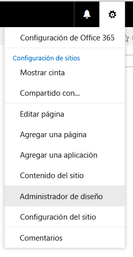

# Cómo crear un diseño de página en SharePoint 2013
Cuando se usa el Administrador de diseño para crear un diseño de página, se crean dos archivos: un archivo .aspx que SharePoint usa, y una versión HTML de ese diseño de página que puede editar en su editor HTML. El archivo HTML y el diseño de página se asocian para que siempre que edite y guarde el archivo HTML, los cambios se sincronicen con el diseño de página asociado.
## Introducción a los diseños de página
<a name="Introduction"> </a>

Cuando se usa el Administrador de diseño para crear un diseño de página, se crean dos archivos: un archivo .aspx que SharePoint usa, y una versión HTML de ese diseño de página que puede editar en su editor HTML. El archivo HTML y el diseño de página se asocian para que siempre que edite y guarde el archivo HTML, los cambios se sincronicen con el diseño de página asociado.
  
    
    
Cuando se crea una página maestra, el archivo HTML se carga y se convierte en una página maestra. Sin embargo, a diferencia de una página maestra, un archivo HTML no se convierte directamente en un diseño de página. El motivo es que la finalidad principal de un diseño de página es contener campos de página, y estos campos de página deben agregarse cuando el diseño de página se crea en el Administrador de diseño.
  
    
    
Al crear un diseño de página:
  
    
    

- Se crean un archivo .aspx y un archivo HTML con el mismo nombre en la Galería de páginas maestras.
    
  
- Todo el marcado que SharePoint requiere se agrega al archivo .aspx para que el diseño de página se represente correctamente.
    
  
- Otro marcado, como los comentarios, las etiquetas **<div>**, los fragmentos de código y los marcadores de posición de contenido, se agregan al archivo HTML.
    
  
- Los campos de página únicos del tipo de archivo se agregan automáticamente al diseño de página. En la cinta de la Galería de fragmentos de página hay otros campos de página disponibles para agregar.
    
  
- El archivo HTML y el archivo .aspx están asociados, por lo que los cambios que se realicen en el archivo HTML se sincronizan con el archivo .aspx al guardar el archivo HTML. Otro marcado, como los comentarios, las etiquetas **<div>**, los fragmentos de código y los marcadores de posición de contenido, se agregan al archivo HTML.
    
  

> **NOTA**
> La sincronización es unidireccional. Los cambios que se realicen en el diseño de página HTML se sincronizan con el archivo .aspx asociado, pero si elige editar el archivo .aspx directamente, esos cambios no se sincronizarán con el archivo HTML. Todos los diseños de página HTML (y todas las páginas maestras HTML) tienen una propiedad denominada **Archivo asociado**, establecida en **True** de forma predeterminada, que crea la asociación y la sincronización entre los archivos.
  
    
    

Por ejemplo, si tiene un par de archivos asociados (HTML y .aspx) y edita el archivo .aspx sin romper la asociación, se guardan los cambios del archivo .aspx, pero no puede protegerlo ni publicarlo, por lo que los cambios no se guardan de una forma útil. Los cambios que se realicen en el archivo HTML invalidan el archivo .aspx. Si protege o publica el archivo HTML, los cambios del archivo HTML invalidan los cambios realizados en el archivo .aspx. Los cambios del archivo .aspx se pierden.
  
    
    
Si usted es desarrollador y se siente cómodo trabajando con ASP.NET, puede elegir trabajar solo con el archivo .aspx rompiendo la asociación entre los archivos. Para romper la asociación entre el archivo HTML y el archivo .aspx, en el Administrador de diseño, elija **Editar propiedades** para el archivo HTML y después, desactive la casilla **Archivo asociado**. Más adelante puede volver a asociar los archivos; para ello, edite las propiedades y seleccione esta casilla. En este caso, los cambios guardados en el archivo HTML volverán a sobrescribir el archivo .aspx.
  
    
    

## Descripción de la relación entre los campos de página y un tipo de contenido
<a name="UnderstandingPageFields"> </a>

Cada diseño de página está asociado con un tipo de contenido, normalmente uno de los tipos de contenido del grupo Diseño de página. Por ejemplo, el tipo de contenido Página de artículo que está asociado con el diseño de página Página de artículo, y ambos están incluidos en un sitio de publicación.
  
    
    
Un tipo de contenido está formado por columnas de sitio, que en conjunto definen un esquema de tipos de datos permitidos. Puede saber si las columnas de sitio son únicas para el tipo de contenido actual porque la columna Origen está en blanco; esto significa que estas columnas de sitio están definidas por el tipo de contenido actual y no se heredan de un tipo de contenido principal.
  
    
    
Para cualquier diseño de página dado, las columnas de sitio que conforman el tipo de contenido se corresponden directamente con los campos de página que están disponibles para dicho diseño de página. El primer grupo de campos de página de la cinta es el de los campos de página que se agregan automáticamente a la página cuando se crea. SharePoint agrega estos campos automáticamente porque son únicos para este tipo de contenido y, por lo tanto, es probable que se crearan específicamente para que los use el diseño de página en lugar de ser metadatos generales de SharePoint.
  
    
    
Antes de crear un diseño de página en el Administrador de diseño, debe crear primero un tipo de contenido que defina los campos de página que quiere para ese diseño de página
  
    
    

## Descripción de la relación entre los marcadores de posición de contenido en un diseño de página y una página maestra
<a name="UnderstandingContentPlaceholders"> </a>

Un diseño de página y una página maestra deben tener un conjunto idéntico de marcadores de posición de contenido para que la página se represente correctamente. Esto no es un problema si usa el Administrador de diseño para crear páginas maestras y diseños de página, porque se agrega el conjunto correcto de marcadores de posición de contenido a cada archivo cuando se crea. Así se garantiza que todos los diseños de página funcionen en todos los canales que usen una página maestra diferente. No tiene que conocer la mayoría de estos marcadores de posición de contenido ni trabajar con ellos. Existen porque SharePoint los necesita para representar la página correctamente.
  
    
    
Pero si edita un diseño de página HTML y agrega manualmente un marcador de posición de contenido, debe agregar el mismo marcador de posición de contenido a todas las páginas maestras que necesiten trabajar con ese diseño de página. Este no es un escenario habitual.
  
    
    
Si usa el Administrador de diseño para crear diseños de página y páginas maestras, el escenario más habitual es que trabaje solo con los siguientes marcadores de posición de contenido:
  
    
    

- **PlaceHolderMain** La página maestra incluye un marcador de posición de contenido con `ID="PlaceholderMain"`, que contiene la etiqueta **DefaultContentBlock** **<div>** con un cuadro amarillo que muestra **Esta área se rellenará con el contenido que cree en sus diseños de página**. No ponga ningún contenido dentro de este marcador de posición en la página maestra. El diseño de página incluye un marcador de posición de contenido con el mismo identificador. Solo debe poner el marcado dentro de este marcador y no poner ningún marcado fuera de él en un diseño de página. Los identificadores de los dos marcadores de posición ( **PlaceholderMain**) deben coincidir.
    
  
- **PlaceHolderAdditionalPageHead** Cuando se trabaja con un diseño de página, normalmente no se insertan elementos en la etiqueta **<head>** del diseño de página. En su lugar, se agregan elementos al marcador de posición de contenido con `id="PlaceHolderAdditionalPageHead"`. Cuando una página de contenido se representa en el explorador, esta página adicional se combina al final del encabezado de la página maestra. 
    
  

## Crear un diseño de página
<a name="CreatePageLayout"> </a>

Antes de comenzar, debe saber con qué tipo de contenido y página maestra se asociará el diseño de página.
  
    
    

### Para crear un diseño de página


1. Vaya a su sitio de publicación.
    
  
2. En la esquina superior derecha de la página, elija el icono de engranaje y, después, elija **Administrador de diseño**.
    
   **Icono de engranaje**

  


  

  

  
3. En el Administrador de diseño, en el panel de navegación izquierdo, elija **Editar diseños de página**.
    
  
4. Elija **Crear un diseño de página**.
    
  
5. En el cuadro de diálogo **Crear un diseño de página**, escriba el nombre del diseño de página.
    
  
6. Seleccione una página maestra.
    
    La página maestra que seleccione se mostrará en la vista previa para este diseño de página. Esta página maestra también determina qué marcadores de contenido se agregarán al diseño de página.
    
    > **NOTA**
      > Después de elegir esta página maestra, no puede mostrar una vista previa del diseño de página con una página maestra diferente, aunque aplique una página maestra diferente al sitio activo. 
7. Seleccione un tipo de contenido. El tipo de contenido de este diseño de página determina qué campos de página estarán disponibles para este diseño de página en la Galería de fragmentos de código.
    
  
8. Elija **Aceptar**.
    
    En este momento, SharePoint crea un archivo HTML y un archivo .aspx con el mismo nombre.
    
    En el Administrador de diseño, el archivo HTML aparece ahora con una columna Estado que muestra uno de dos posibles estados:
    
  - **Advertencias o errores**
    
  
  - **Conversión correcta**
    
  
9. Haga clic en el vínculo de la columna Estado para mostrar una vista previa del archivo y para ver los errores o advertencias acerca de la página maestra.
    
    La página de vista previa es una vista previa activa del lado del servidor de su diseño de página. En la parte superior de la vista previa se muestran las advertencias o errores que tenga que resolver editando el archivo HTML en un editor HTML. Deben corregirse los errores para que la vista previa muestre el diseño de página correctamente.
    
    Para obtener más información sobre como resolver errores y advertencias, consulte  [Cómo: resolver errores y advertencias durante la vista previa de una página en SharePoint 2013](how-to-resolve-errors-and-warnings-when-previewing-a-page-in-sharepoint-2013.md).
    
    Para obtener más información sobre cómo mostrar una vista previa del diseño de página, consulte  [Cómo: cambiar la página de vista previa en el Administrador de diseño de SharePoint 2013](how-to-change-the-preview-page-in-sharepoint-2013-design-manager.md).
    
    La página de vista previa también contiene un vínculo **Fragmentos de código** en la esquina superior derecha. Este vínculo abre la Galería de fragmentos de código, donde puede comenzar a reemplazar los bocetos de controles de su diseño por los controles dinámicos de SharePoint. Para obtener más información, consulte [Fragmentos de código del Administrador de diseño de SharePoint 2013](sharepoint-2013-design-manager-snippets.md).
    
  
10. Para corregir los errores, edite el archivo HTML que reside directamente en el servidor usando un editor HTML para abrirlo y editarlo en la unidad asignada. Cada vez que guarde el archivo HTML, los cambios realizados se sincronizan con el archivo .aspx asociado.
    
  
11. La vista previa del diseño de página muestra los campos de página que se agregaron automáticamente al diseño de página. Estos campos de página son columnas de sitio que son únicas para el tipo de contenido actual. Ahora ya está listo para aplicar estilos al diseño de página según sus bocetos HTML originales.
    
  

## Determinar dónde deben ir los estilos de un diseño de página
<a name="WhereStyles"> </a>

Al crear los bocetos HTML para su sitio, puede que tenga archivos HTML que representan diferentes clases de página, como una página de artículo o una página de detalles de elemento que contiene un elemento web para mostrar los detalles de un elemento de un catálogo. Después de crear el diseño de página que representa esa clase de página, está listo para transferir los estilos desde el boceto HTML a la versión HTML del diseño de página.
  
    
    
Puede poner simplemente los estilos de uno o varios diseños de página en la misma hoja de estilos a la que está vinculada la página maestra. Pero si quiere reducir al mínimo el tamaño de los archivos CSS que se cargan con cada página, puede usar hojas de estilos diferentes para los diferentes diseños de página. En este caso, es importante saber que en la etiqueta **<head>** de un diseño de página un vínculo a una hoja de estilos. En su lugar, el vínculo debe ir en el marcador de posición de contenido llamado **PlaceHolderAdditionalPageHead**. 
  
    
    

> **NOTA**
> En este marcado, el atributo  `ms-design-css-conversion="no"` excluye la hoja de cálculo del tema. Además, el vínculo a la hoja de estilos debe aparecer después de las líneas comentadas **<!--SPM**. 
  
    
    


```HTML

<!--MS:<asp:ContentPlaceHolder id="PlaceHolderAdditionalPageHead" runat="server">-->
            <!--SPM:<%@Register Tagprefix="SharePoint" Namespace="Microsoft.SharePoint.WebControls" Assembly="Microsoft.SharePoint, Version=15.0.0.0, Culture=neutral, PublicKeyToken=71e9bce111e9429c"%>-->
            <!--SPM:<%@Register Tagprefix="Publishing" Namespace="Microsoft.SharePoint.Publishing.WebControls" Assembly="Microsoft.SharePoint.Publishing, Version=15.0.0.0, Culture=neutral, PublicKeyToken=71e9bce111e9429c"%>-->
<link href="MyPageLayout.css" rel="stylesheet" type="text/css" ms-design-css-conversion="no" />
        <!--ME:</asp:ContentPlaceHolder>-->

```

Cuando un visitante del sitio visita una página que usa este diseño de página, este encabezado de página adicional se combina al final del encabezado de la página maestra, de modo que los estilos del diseño de página se aplican después de los estilos de la página maestra.
  
    
    
De esta manera, cada diseño de página tiene su propia hoja de estilos. Por ejemplo, puede tener una etiqueta **<div>** con `id="xyz"` en una página que aparece a la izquierda, y en otro diseño de página aparece a la derecha.
  
    
    
Cada diseño de página puede tener también una o varias hojas de estilos específicas del canal de dispositivo. Por ejemplo, quizás quiera que un diseño de página tenga un diseño diferente para teléfonos y para escritorios. Para ello, puede incluir uno o varios paneles de canal de dispositivo dentro de **PlaceHolderAdditionalPageHead**, y cada panel de canal incluye un vínculo a una hoja de estilos con estilos específicos para cada canal. De esta manera, por ejemplo, una etiqueta **<div>** con `id="abc"` puede mostrar texto grande en un canal y texto pequeño en otro canal diferente.
  
    
    
Los siguientes son escenarios habituales en los que se ponen vínculos a hojas de estilos para los diseños de página.
  
    
    

### Vínculos a estilos desde una página maestra

El escenario más sencillo es incluir estilos para uno o varios diseños de página en la misma hoja de estilos con la que está vinculada la página maestra. En la página maestra, coloque el vínculo al archivo .css justo antes de la etiqueta **</head>** de cierre, para que invalide las hojas de estilos predeterminadas de SharePoint, como corev15.css.
  
    
    

```HTML

<head>
…
<link rel="stylesheet" type="text/css" href="MyStyleSheet.css" />
</head>

```


### Vínculos a estilos desde un diseño de página

Si quiere minimizar el tamaño de los archivos CSS que se cargan con cada página, puede tener archivos CSS diferentes para cada diseño de página. En este escenario, los estilos de un diseño de página van en el marcador de posición de contenido llamado **PlaceHolderAdditionalPageHead**.
  
    
    

```HTML

<!--MS:<asp:ContentPlaceHolder id="PlaceHolderAdditionalPageHead" runat="server">-->
            <!--SPM:<%@Register Tagprefix="SharePoint" Namespace="Microsoft.SharePoint.WebControls" Assembly="Microsoft.SharePoint, Version=15.0.0.0, Culture=neutral, PublicKeyToken=71e9bce111e9429c"%>-->
            <!--SPM:<%@Register Tagprefix="Publishing" Namespace="Microsoft.SharePoint.Publishing.WebControls" Assembly="Microsoft.SharePoint.Publishing, Version=15.0.0.0, Culture=neutral, PublicKeyToken=71e9bce111e9429c"%>-->
<link href="MyPageLayout.css" rel="stylesheet" type="text/css" ms-design-css-conversion="no" />
        <!--ME:</asp:ContentPlaceHolder>-->

```


### Vínculos a estilos en el diseño de página por canal de dispositivo

Si tiene diferentes canales de dispositivo, probablemente querrá que sus diseños de página se representen de forma diferente para los distintos canales. En este escenario, se incluye uno o varios paneles de canal de dispositivo en **PlaceHolderAdditionalPageHead** y después, se incluye un vínculo a los archivos CSS específicos de cada canal dentro de cada panel de canal.
  
    
    

```HTML

<!--MS:<asp:ContentPlaceHolder id="PlaceHolderAdditionalPageHead" runat="server">-->
<div data-name="DeviceChannelPanel">
    <!--CS: Start Device Channel Panel Snippet-->
    <!--SPM:<%@Register Tagprefix="Publishing" Namespace="Microsoft.SharePoint.Publishing.WebControls" Assembly="Microsoft.SharePoint.Publishing, Version=15.0.0.0, Culture=neutral, PublicKeyToken=71e9bce111e9429c"%>-->
    <!--MS:<Publishing:DeviceChannelPanel runat="server" IncludedChannels="Channel1">-->
…..
<link rel="stylesheet" type="text/css" href="MyStyleSheet.css" ms-design-css-conversion="no" />
    <!--ME:</Publishing:DeviceChannelPanel>-->
    <!--CE: End Device Channel Panel Snippet-->
</div><div data-name="DeviceChannelPanel">
    <!--CS: Start Device Channel Panel Snippet-->
    <!--SPM:<%@Register Tagprefix="Publishing" Namespace="Microsoft.SharePoint.Publishing.WebControls" Assembly="Microsoft.SharePoint.Publishing, Version=15.0.0.0, Culture=neutral, PublicKeyToken=71e9bce111e9429c"%>-->
    <!--MS:<Publishing:DeviceChannelPanel runat="server" IncludedChannels="Channel2">-->
…..
<link rel="stylesheet" type="text/css" href="CSS5.css" />
    <!--ME:</Publishing:DeviceChannelPanel>-->
    <!--CE: End Device Channel Panel Snippet-->
</div>

```


## Descripción del marcado en el diseño de página HTML
<a name="UnderstandMarkup"> </a>

Cuando se crea un diseño de página, se crea el archivo .aspx que SharePoint usa y se agrega marcado HTML a la versión HTML del diseño de página. Cuando se edita el diseño de página HTML en el editor HTML, puede resultar útil comprender la finalidad de parte de este marcado. La mayor parte es similar al marcado que se agrega a una página maestra HTML. Para obtener más información, consulte  [Cómo convertir un archivo HTML en una página maestra en SharePoint 2013](how-to-convert-an-html-file-into-a-master-page-in-sharepoint-2013.md).
  
    
    
El marcado que es único para los diseños de página son los campos de página que se agregan al diseño de página en función del tipo de contenido con el que el diseño de página está asociado. Los campos de página aparecen dentro del marcador de posición de contenido con  `id="PlaceHolderMain"`. Por ejemplo, el siguiente marcado de **PlaceHolderMain** contiene dos campos de página que representan los campos **Title** y **Page Image** del tipo de contenido asociado.
  
    
    


```HTML

<!--MS:<asp:ContentPlaceHolder ID="PlaceHolderMain" runat="server">-->
            <div>
                <!--CS: Start Page Field: Title Snippet-->
                <!--SPM:<%@Register Tagprefix="PageFieldTextField" Namespace="Microsoft.SharePoint.WebControls" Assembly="Microsoft.SharePoint, Version=15.0.0.0, Culture=neutral, PublicKeyToken=71e9bce111e9429c"%>-->
                <!--SPM:<%@Register Tagprefix="Publishing" Namespace="Microsoft.SharePoint.Publishing.WebControls" Assembly="Microsoft.SharePoint.Publishing, Version=15.0.0.0, Culture=neutral, PublicKeyToken=71e9bce111e9429c"%>-->
                <!--MS:<Publishing:EditModePanel runat="server" CssClass="edit-mode-panel">-->
                    <!--MS:<PageFieldTextField:TextField FieldName="fa564e0f-0c70-4ab9-b863-0177e6ddd247" runat="server">-->
                    <!--ME:</PageFieldTextField:TextField>-->
                <!--ME:</Publishing:EditModePanel>-->
                <!--CE: End Page Field: Title Snippet-->
            </div>
            <div>
                <!--CS: Start Page Field: Page Image Snippet-->
                <!--SPM:<%@Register Tagprefix="PageFieldRichImageField" Namespace="Microsoft.SharePoint.Publishing.WebControls" Assembly="Microsoft.SharePoint.Publishing, Version=15.0.0.0, Culture=neutral, PublicKeyToken=71e9bce111e9429c"%>-->
                <!--MS:<PageFieldRichImageField:RichImageField FieldName="3de94b06-4120-41a5-b907-88773e493458" runat="server">-->
                    <!--PS: Start of READ-ONLY PREVIEW (do not modify)--><div id="ctl02_label" style="display:none">Page Image</div><div id="ctl02__ControlWrapper_RichImageField" class="ms-rtestate-field" style="display:inline" aria-labelledby="ctl02_label"><div align="left" class="ms-formfieldcontainer"><div class="ms-formfieldlabelcontainer" nowrap="nowrap"><span class="ms-formfieldlabel" nowrap="nowrap">Page Image</span></div><div class="ms-formfieldvaluecontainer"><div class="ms-rtestate-field"></div></div></div></div><!--PE: End of READ-ONLY PREVIEW-->
                <!--ME:</PageFieldRichImageField:RichImageField>-->
                <!--CE: End Page Field: Page Image Snippet-->
            </div>
        <!--ME:</asp:ContentPlaceHolder>-->

```


## Recursos adicionales
<a name="AdditionalResources"> </a>


-  [Información general sobre el Administrador de diseño de SharePoint 2013](overview-of-design-manager-in-sharepoint-2013.md)
    
  
-  [Cómo convertir un archivo HTML en una página maestra en SharePoint 2013](how-to-convert-an-html-file-into-a-master-page-in-sharepoint-2013.md)
    
  
-  [Fragmentos de código del Administrador de diseño de SharePoint 2013](sharepoint-2013-design-manager-snippets.md)
    
  

