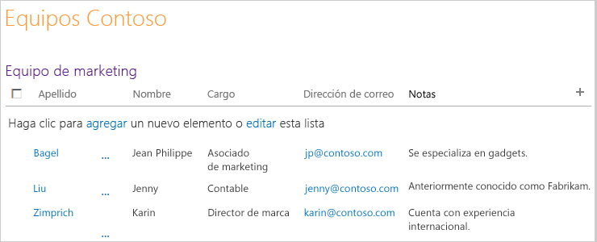
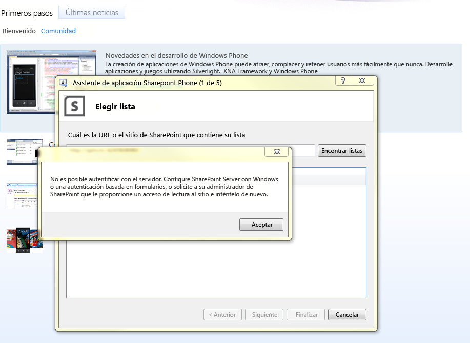
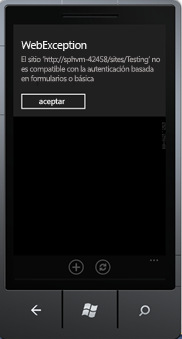
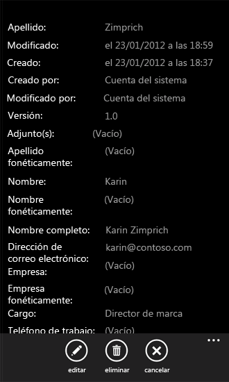

# Cómo: Crear una aplicación de lista de SharePoint 2013 para Windows Phone
Crear una aplicación de Windows Phone en Visual Studio basada en la plantilla de aplicación de lista de SharePoint de Windows Phone.
La instalación del SDK de SharePoint para Windows Phone hace que estén disponibles dos plantillas de aplicación de SharePoint para Windows Phone en Visual Studio 2010 o en Visual Studio 2010 Express para Windows Phone. (Consulte  [Cómo: Configurar un entorno de desarrollo de aplicaciones móviles para SharePoint](how-to-set-up-an-environment-for-developing-mobile-apps-for-sharepoint.md)). Con la plantilla de aplicación de lista de SharePoint para Windows Phone, puede seguir los pasos de un asistente para crear una aplicación funcional de Windows Phone que puede tener acceso y manipular datos de una lista de SharePoint.
  
    
    

> **IMPORTANTE**
> Si está desarrollando una aplicación para Windows Phone 8, debe usar Visual Studio Express 2012 en vez de Visual Studio 2010 Express. Excepto para el entorno de desarrollo, toda la información de este artículo se aplica a la creación de aplicaciones para Windows Phone 8 y Windows Phone 7. > Para obtener más información, consulte  [Cómo: Configurar un entorno de desarrollo de aplicaciones móviles para SharePoint](how-to-set-up-an-environment-for-developing-mobile-apps-for-sharepoint.md). 
  
    
    

Si desea ver una demostración de la creación de una aplicación móvil antes de comenzar este artículo sobre procedimientos, vea el siguiente vídeo.
  
    
    

**Creación de aplicaciones móviles con una demostración de SharePoint 2013**

  
    
    

  
    
    

  
    
    

  
    
    

  
    
    

## Crear la aplicación de lista de SharePoint para Windows Phone

En la aplicación de lista de SharePoint para Windows Phone, puede tener acceso a la mayoría de las listas que están disponibles en Complementos de SharePoint. Para los fines de este ejemplo de aplicación de Windows Phone, se usan listas de SharePoint con datos de ejemplo de una empresa ficticia denominada Contoso, Ltd. Para que ver los pasos para crear la primera iteración de la aplicación de lista de SharePoint, se usa una lista de contactos de SharePoint que contiene información sobre miembros del equipo de marketing de Contoso, como se muestra en la figura 1.
  
    
    

**Figura 1. Lista de contactos del equipo de marketing de Contoso**

  
    
    

  
    
    

  
    
    

### Para crear una aplicación de lista de SharePoint para Windows Phone

1. Inicie Visual Studio 2010 con la opción **Ejecutar como administrador**.
    
  
2. Seleccione **Archivo**, **Nuevo**, **Proyecto**. 
    
    Se abrirá el cuadro de diálogo **Nuevo proyecto**.
    
  
3. En el cuadro de diálogo **Nuevo proyecto**, expanda el nodo **Visual C#** y luego elija el nodo **Silverlight para Windows Phone**. (Asegúrese de que la versión de .NET Framework de destino está establecida en 4).
    
    > **NOTA**
      > Las plantillas instaladas por el SDK de SharePoint para Windows Phone solo funcionan en proyectos C#. Las plantillas no están disponibles para proyectos de Visual Basic. 
4. En el panel **Plantillas**, elija la plantilla **Aplicación de lista de SharePoint para Windows Phone** y asigne un nombre al proyecto, por ejemplo,ContosoSPListApp.
    
  
5. Mientras se está ejecutando el **Asistente de la aplicación SharePoint Phone**, puede producirse el error se muestra en la figura 2. Este error se produce porque la cuenta que está utilizando el desarrollador mientras se ejecuta el **Asistente de la aplicación SharePoint Phone** no tiene permisos suficientes.
    
   **Figura 2. Mensaje de error del asistente SPList**

  

  

    Puede solucionar este error si proporciona privilegios necesarios a la cuenta con la que el desarrollador ejecuta el Asistente SPList. Vuelva a ejecutar el **Asistente Splist** después de tener suficientes derechos.
    
  
6. Seleccione el botón **Aceptar**. Aparece el **Asistente de la aplicación SharePoint Phone**, en el que podrá elegir una lista de SharePoint y configurar las propiedades de dicha lista para determinar cómo aparece en la aplicación de Windows Phone.
    
  
7. Especifique la dirección URL de un sitio SharePoint de destino en la red (es decir, una instalación local de SharePoint Server).
    
  
8. Elija **Buscar listas**. Si la cuenta con la que se ejecuta Visual Studio tiene acceso al sitio de destino especificado, el **Asistente de la aplicación de SharePoint Phone** muestra las listas que están disponibles en ese sitio.
    
  
9. Seleccione una de las listas disponibles, como una lista de contactos (se muestra con datos de ejemplo en una vista personalizada en la figura 1).
    
  
10. Elija **Siguiente**. El asistente mostrará las vistas disponibles asociadas con la lista seleccionada.
    
    Las vistas que muestra el asistente son las vistas que han creado los usuarios (o aprovisionadas por SharePoint Server) y están asociados a una lista determinada en el servidor. Algunas listas de SharePoint solo tienen una vista asociada de forma predeterminada. Una lista de contactos, de forma predeterminada, está asociada con una vista de todos los contactos. Una lista de anuncios, de forma predeterminada, está asociada con una vista de todos los elementos. Una listas de tareas, de forma predeterminada, está asociada con seis vistas, incluida una vista de todas las tareas y una vista de tareas activas. Para cada vista que seleccione en esta etapa del asistente, se crea un control **PivotItem** y se agrega al control **Pivot** en el código XAML que define la interfaz de usuario de la aplicación de Windows Phone.
    
  
11. Seleccione la casilla junto a cada vista que quiere incluir en la aplicación de Windows Phone.
    
  
12. Elija **Siguiente**. El asistente muestra las acciones disponibles en relación con la lista seleccionada en la aplicación de Windows Phone.
    
    Las opciones son **Nueva**, **Mostrar**, **Editar** y **Eliminar**. Si desea poder editar o eliminar elementos de lista en la aplicación, en esta fase del asistente debe elegir la operación **Mostrar**. (Las casillas de las operaciones **Editar** y **Eliminar** están deshabilitadas a menos que se seleccione la operación **Mostrar**).
    
  
13. Active la casilla situada junto a cada acción que quiere tener disponible para la lista seleccionada en la aplicación de Windows Phone.
    
  
14. Elija **Siguiente**. El asistente muestra los campos asociados con la lista seleccionada en el sitio SharePoint.
    
    > **NOTA**
      > En el Asistente de la lista de SharePoint, no estará disponible la selección de un campo personalizado para dispositivos móviles. Sin embargo, puede escribir código personalizado para tener acceso a cualquier campo personalizado. Un campo no puede estar asociado con este tipo de contenido. Si se habilitan varios tipos de contenido para la lista, todos los campos estará disponibles para que los desarrolladores los usen en sus aplicaciones del teléfono. 
15. Active la casilla junto a cada campo que quiera incluir en la lista, como aparecerá en la aplicación de Windows Phone.
    
    > **NOTA**
      > Enumere los campos diseñados en SharePoint Server en función de si la información que requieren ya está seleccionada. No se pueden borrar en el asistente. 
16. Elija **Siguiente**. El asistente le permitirá ordenar los campos que ha seleccionado en el paso anterior.
    
  
17. Ordene los campos según sus necesidades. Para ello, seleccione campos individuales y elija las flechas arriba o abajo para subirlos o bajarlos en la lista.
    
  
18. Elija **Finalizar**. Visual Studio creará los archivos necesarios para el proyecto y abrirá el archivo List.xaml para editarlo.
    
  

## Ejecute la aplicación de Windows Phone generada por el Asistente de la aplicación SharePoint Phone

El proyecto generado por el **Asistente de la aplicación SharePoint Phone** puede generarse tal cual para crear una aplicación de lista de SharePoint para Windows Phone simple, pero funcional. La aplicación se puede modificar y desarrollar aún más, pero, por ahora, un usuario puede tocar (o, en el emulador de Windows Phone, hacer clic en) un elemento de lista determinado y la aplicación muestra todos los campos asociados a dicho elemento (los campos que seleccionó en el asistente para incluir en la aplicación). Un usuario también puede agregar nuevos elementos de lista, eliminarlos y editar los valores de estos campos. No se admite el inicio de sesión de varios usuarios en una única aplicación. Sin embargo, un desarrollador puede escribir código que cierre la sesión del usuario actual cuando otro usuario intente iniciar sesión en la misma aplicación móvil.
  
    
    
El destino de la implementación de la solución se establece de forma predeterminada para el emulador de Windows Phone. Puede ejecutar el proyecto en Visual Studio tal cual, (presionando F5 para iniciar el proyecto en el contexto del depurador o presionando CTRL + F5 para iniciar el proyecto sin depurar). El emulador de Windows Phone se inicia, se carga el sistema operativo Windows Phone, se implementa en el emulador y se inicia la aplicación. Si inicia con el código generado por el asistente, al ejecutar la aplicación de la lista de SharePoint en el emulador, se le solicitarán las credenciales para la lista de SharePoint especificada en el sitio de destino. Proporcione las credenciales de una cuenta que tenga permisos suficientes para tener acceso a la lista y elija **Iniciar sesión** en el emulador. En el emulador, se mostrará la página principal de la aplicación de Windows Phone (definida en el archivo List.xaml del proyecto). Según los campos elegidos y el orden especificado para dichos campos en los pasos anteriores, debería ver los elementos de la lista especificada. En función de los datos en la lista representada por la figura 1, verá una lista de elementos en el emulador como se muestra en la figura 3.
  
    
    

**Figura 3. Elementos de lista de SharePoint en una aplicación de Windows Phone**

  
    
    

  
    
    

  
    
    
Mientras se ejecuta una aplicación de Windows Phone, puede producirse el error de autenticación que se muestra en la figura 4. Esto sucede porque la aplicación móvil de SharePoint requiere **Autenticación básica de formulario**. Esta opción no está habilitada de forma predeterminada.
  
    
    

**Figura 4. Error de autenticación de aplicación de Windows Phone**

  
    
    

  
    
    

  
    
    
Puede resolver este error al elegir **Autenticación básica de formulario** en Administración central.
  
    
    

### Para habilitar la autenticación básica

1. Vaya a **Administración central**. Asegúrese de tener derechos de administrador en el servidor.
    
  
2. Elija **Administrar aplicaciones web** en **Administración de aplicaciones**.
    
  
3. Elija la aplicación web (que tiene en el sitio de SharePoint) a la que tiene acceso desde la aplicación móvil.
    
  
4. Elija **Proveedores de autenticación** en la cinta.
    
  
5. Elija **Proveedores de autenticación** en la cinta.
    
  
6. En el cuadro de diálogo **Proveedor de autenticación**, elija **Predeterminado** para editar la autenticación.
    
  
7. En la ventana del modelo **Editar autenticación**, elija **Autenticación básica** en tipos de **Solicitudes de autenticación**.
    
  
Si ha basado la aplicación de Windows Phone en los datos de una lista de contactos, como se muestra en la figura 1, puede elegir un elemento determinado y la aplicación presentará una página con una vista del elemento (definida por DisplayForm.xaml en el proyecto) que mostrará todos los campos disponibles para el elemento en la aplicación, como se muestra en la figura 5. (En este ejemplo, se seleccionaron todos los campos asociados a una lista de contactos de SharePoint en el Asistente de la aplicación SharePoint Phone y se ha conservado el orden predeterminado de esos campos).
  
    
    

**Figura 5. Vista DisplayForm de un elemento de lista de contactos**

  
    
    

  
    
    

  
    
    
Observe los botones **Editar** y **Eliminar** de la barra de la aplicación en esta página de la aplicación. Estas operaciones se implementan para los métodos de Microsoft.SharePoint.Phone.Application.dll (que es una de las bibliotecas que instala el SDK de SharePoint de Windows Phone). Si elige el botón **Editar**, se muestra un control **Page** de Windows Phone (es decir, un objeto de una instancia de una clase heredera de la clase **Microsoft.Phone.Controls.PhoneApplicationPage**). Si edita cualquiera de los campos y elige el botón **Enviar** de esa página en la aplicación, el método **UpdateItem** subyacente de **EditItemViewModelBase** ejecuta la clase (que, en última instancia, ejecuta el método **Update** de un objeto **ListItem** del modelo de objetos de cliente de SharePoint Silverlight) para guardar los cambios en la lista de SharePoint.
  
    
    

## Recursos adicionales

-  [Creación de aplicaciones de Windows Phone con acceso a SharePoint 2013](build-windows-phone-apps-that-access-sharepoint-2013.md)
    
  
-  [Cómo: Configurar un entorno de desarrollo de aplicaciones móviles para SharePoint](how-to-set-up-an-environment-for-developing-mobile-apps-for-sharepoint.md)
    
  
-  [Windows Phone SDK 8.0](http://www.microsoft.com/es-es/download/details.aspx?id=35471)
    
  
-  [Microsoft SharePoint SDK para Windows Phone 8](http://www.microsoft.com/es-es/download/details.aspx?id=36818)
    
  
-  [Windows Phone SDK 7.1](http://www.microsoft.com/es-es/download/details.aspx?id=27570)
    
  
-  [Microsoft SharePoint SDK para Windows Phone 7.1](http://www.microsoft.com/es-es/download/details.aspx?id=30476)
    
  

