# Crear formularios de flujo de trabajo personalizados de SharePoint Server 2013 con Visual Studio 2012
Cree formularios de flujo de trabajo en SharePoint Server 2013. En este artículo se usa SharePoint Server 2013 con la actualización pública de marzo de 2013 y Office Developer Tools para Visual Studio 2012. Todo el contenido del artículo sirve para implementaciones locales de SharePoint Server 2013 y para Office 365.
 **Ofrecido por:** [Andrew Connell](http://social.msdn.microsoft.com/profile/andrew%20connell%20%5bmvp%5d/),  [www.AndrewConnell.com](http://www.andrewconnell.com)
  
    
    

Desde el lanzamiento de Microsoft SharePoint 2007, la plataforma SharePoint ha permitido el uso de flujos de trabajo para automatizar los procesos de negocio. La plataforma de flujos de trabajo de SharePoint está integrada en Windows Workflow Foundation, que forma parte de .NET Framework. Mientras que Workflow Foundation proporciona muchas capacidades para crear flujos de trabajo personalizados y administrar procesos de negocio automatizados, SharePoint también agrega la integración del usuario final. Esta integración se implementa en dos partes: 
- **Tareas** asignadas a los usuarios y grupos que se pueden crear y supervisar desde los flujos de trabajo.
    
  
- **Formularios** que recopilan información de los usuarios cuando los flujos de trabajo están asociados con un tipo de contenido (por ejemplo, un sitio, una lista o una biblioteca) o cuando se inicia un flujo de trabajo.
    
  

## Formularios de flujo de trabajo en SharePoint 2007 y SharePoint 2010
<a name="sec1"> </a>

La implementación de los flujos de trabajo en SharePoint 2007 y SharePoint 2010 mejoró en forma continua de versión en versión. En concreto, Microsoft agregó funciones nuevas en SharePoint 2010, como la capacidad de asociar flujos de trabajo a sitios. Además, mejoró las herramientas de creación de flujos de trabajo, SharePoint Designer 2010 y Visual Studio 2010 en comparación con las versiones anteriores. Sin embargo, en SharePoint 2013, la implementación de las tareas de flujo de trabajo y los formularios de flujo de trabajo ha cambiado muy poco.
  
    
    
Antes de SharePoint Server 2013, los desarrolladores tenían dos opciones para crear formularios de flujo de trabajo. En SharePoint 2007, se recomendaban por igual los formularios de InfoPath y los formularios web de ASP.NET. Ambos tenían ventajas y desventajas. En SharePoint 2010, se aconsejaba a los desarrolladores que usaran los formularios web de ASP.NET, ya que esto es lo que las herramientas de desarrollo de SharePoint presentes en Visual Studio 2010 creaban usando las plantillas de elemento de proyecto de formularios de flujo de trabajo de asociación e iniciación, pero la implementación era muy parecida a la de SharePoint 2007.
  
    
    

## Cambios en los formularios de flujo de trabajo en SharePoint 2013
<a name="sec2"> </a>

SharePoint Server 2013 ha introducido una arquitectura y una plataforma de flujo de trabajo nuevas que reflejan los cambios fundamentales en el concepto de SharePoint. El cambio principal es que los flujos de trabajo de SharePoint Server 2013 ya no se administran ni se ejecutan desde el motor en tiempo de ejecución de SharePoint. Ahora, SharePoint Server 2013 usa un nuevo componente llamado Administrador de flujos de trabajo, que hospeda el tiempo de ejecución de Windows Workflow Foundation y los servicios que necesita Workflow Foundation. Lo importante es que Administrador de flujos de trabajo se ejecuta fuera de SharePoint. Cuando se publica un flujo de trabajo o se inicia una nueva instancia de un flujo de trabajo publicado, SharePoint notifica a Administrador de flujos de trabajo, que, a su vez, procesa los episodios del flujo de trabajo. Cuando el flujo de trabajo necesita obtener acceso a información de SharePoint, como propiedades de elemento de lista o propiedades de usuario, lo que hace es autenticar al usuario con el modelo de autorización OAuth y comunicarse a través de las API de REST que se introdujeron en la versión SharePoint Server 2013.
  
    
    
La instrucción general para hacer personalizaciones en la plataforma SharePoint también cambió en la versión SharePoint Server 2013, aunque este cambio se inició con SharePoint 2010 y soluciones de espacio aislado. En SharePoint Server 2013, Microsoft introdujo funciones que alejaban las personalizaciones del servidor de SharePoint y las acercaban al explorador del cliente y a otros recursos externos. Entre estas funciones se incluyen el nuevo modelo de aplicaciones de SharePoint, la compatibilidad para asignar a las aplicaciones una identidad, la autenticación usando el modelo de autorización OAuth y mejoras en el modelo de objetos del lado cliente (CSOM) y las API de REST.
  
    
    
¿Cómo afecta esto a los formularios de flujo de trabajo? Recordemos que a partir de SharePoint 2010, Microsoft empezó a aconsejar a los desarrolladores usar los formularios web de ASP.NET al crear formularios en flujos de trabajos elaborados con Visual Studio. Este método exige que el código del lado servidor procese el formulario y administre la comunicación entre el formulario y el motor del flujo de trabajo. Sin embargo, en SharePoint Server 2013, esto solo es posible en el desarrollo de soluciones (es decir, la implementación de paquetes *.WSP). El nuevo modelo de aplicaciones de SharePoint introducido en SharePoint Server 2013 no permite que el código del lado servidor se ejecute en el proceso de SharePoint.
  
    
    
Para solucionar esta limitación, Microsoft amplió CSOM e incluyó una API para interactuar con el motor de flujos de trabajo. Para conectar una granja de servidores de SharePoint Server 2013 a la granja de servidores de Administrador de flujos de trabajo, hay que instalar el Cliente del Administrador de flujos de trabajo en los servidores de SharePoint. Este componente sirve como proxy que SharePoint usa para comunicarse con la granja de servidores de Administrador de flujos de trabajo. La API de Workflow Services CSOM es el componente del lado cliente que se usa para interactuar eficazmente con el nuevo motor de flujos de trabajo. Para más información sobre Workflow Services CSOM de SharePoint Server 2013, vea  [Trabajar con el modelo de objetos de SharePoint 2013 flujo de trabajo de servicios de cliente del lado](working-with-the-sharepoint-2013-workflow-services-client-side-object-model.md).
  
    
    
Entonces, ¿cómo se benefician los formularios de flujo de trabajo de SharePoint? Al crear flujos de trabajo de SharePoint Server 2013 con Visual Studio 2012, se crean formularios de flujo de trabajo usando los formularios web de ASP.NET. Puede implementar estos formularios como solución de SharePoint o (y esto es lo importante) dentro de una . Esto le da acceso a todos los controles de servidor que ya están implementados en el servidor, como los controles web de ASP.NET y otros controles útiles de SharePoint que se necesitan a veces. También puede usar el nuevo Workflow Services CSOM para realizar todas las tareas necesarias de asociación e iniciación de formularios, entre otras:
  
    
    

- Crear historiales y listas de tareas de flujo de trabajo
    
  
- Crear una nueva asociación de flujo de trabajo en un sitio, una lista o una biblioteca de documentos
    
  
- Iniciar una nueva instancia de una asociación de flujo de trabajo existente
    
  
El Workflow Services CSOM es muy eficaz y deja mucho margen para innovar en los flujos de trabajo, y todo desde el explorador o una máquina remota.
  
    
    

## Formularios de flujo de trabajo disponibles en SharePoint Server 2013
<a name="sec3"> </a>

Antes del lanzamiento de SharePoint Server 2013, se podían crear tres tipos de formularios de flujo de trabajo personalizados: **Iniciación**, **Asociación** y **Edición de tareas**. De estos tres tipos de formularios, los formularios de edición de tareas han perdido relevancia como solución de formularios personalizados. La pérdida de relevancia de los formularios de edición de tareas empezó en SharePoint 2010 porque en las herramientas de desarrollo de Visual Studio 2010 SharePoint no existía ningún elemento de proyecto para los formularios de tarea, pues para representar tareas se usaban formularios de edición y de visualización de listas estándar.
  
    
    
SharePoint Server 2013 mejora la forma de trabajar con las tareas de flujo de trabajo porque se pueden crear botones de resultado personalizados para escenarios específicos. También se puede personalizar la representación y el comportamiento de determinadas columnas de los elementos de tareas usando la nueva representación de lado de cliente (CSR), que se introdujo en SharePoint Server 2013. CSR usa JavaScript ejecutado en el cliente. Estos temas se tratan en el artículo  [Trabajar con tareas en los flujos de trabajo de SharePoint 2013 con Visual Studio 2012](working-with-tasks-in-sharepoint-2013-workflows-using-visual-studio-2012.md). También encontrará más información en el artículo  [Personalizar una vista de lista en complementos de SharePoint mediante representación del lado cliente](http://msdn.microsoft.com/library/8d5cabb2-70d0-46a0-bfe0-9e21f8d67d86%28Office.15%29.aspx).
  
    
    

### Los formularios de iniciación de flujo de trabajo

Cuando un usuario inicia manualmente un flujo de trabajo cuya definición está asociada con el formulario, se abre un formulario de iniciación. Cuando el flujo de trabajo arranca, aparece el formulario de iniciación y se le pide al usuario que introduzca la información necesaria para el flujo de trabajo. Por ejemplo, el usuario podría introducir una justificación para un flujo de trabajo que inicia una aprobación de un nuevo gasto de negocio.
  
    
    
Algo importante sobre los formularios de iniciación es que solo se muestran cuando se inicia un flujo de trabajo manualmente. Los flujos de trabajo que están configurados para iniciarse automáticamente no iniciarán el formulario de iniciación al arrancar. Esta condición puede crear complicaciones para los flujos de trabajo que esperan que se pasen datos desde el formulario. Recuerde que si los flujos de trabajo están configurados para iniciarse automáticamente y el flujo de trabajo requiere entradas de usuario, debe usar un formulario de asociación, no uno de iniciación.
  
    
    

### Los formularios de asociación de flujo de trabajo

Los formularios de asociación se muestran a los administradores cuando deciden agregar o asociar un flujo de trabajo a una determinada lista o biblioteca de documentos. Use los formularios de asociación para permitir a un administrador especificar parámetros, valores predeterminados y otra información relativa al flujo de trabajo según corresponda a los elementos de la lista o biblioteca.
  
    
    
Este formulario de asociación predeterminado permite al administrador seleccionar la definición del flujo de trabajo, indicar el nombre para mostrar de la asociación, especificar las listas que serán los contenedores de los elementos de tarea e historial creados por el flujo de trabajo seleccionado en la asociación y especificar las condiciones en las que el flujo de trabajo puede iniciarse (manual o automáticamente) cuando se creen o actualicen elementos de lista o biblioteca.
  
    
    
También puede crear formularios de asociación personalizados. Si tiene un formulario de asociación personalizado en una definición de flujo de trabajo, SharePoint redirige al usuario al formulario personalizado cuando el formulario predeterminado está completo. Use el formulario personalizado para recopilar información de configuración que pueda necesitar el flujo de trabajo, como llamar a un servicio web externo que obligue al autor de la llamada a pasar una clave única de API o autenticarse con ella para el acceso. Este es el tipo de información que un desarrollador no debe incluir en el código fuente del flujo de trabajo. Este escenario se ve cuando se incluye un flujo de trabajo en una aplicación vendida a través de la Tienda SharePoint. En este caso, cada cliente necesita su propia cuenta con el servicio remoto. Esta es la información de usuario que se recopilaría cuando se crea la asociación de flujo de trabajo.
  
    
    
Otro escenario común se da cuando necesitamos recopilar información que el iniciador del flujo de trabajo normalmente enviaría para los flujos de trabajo que se inician automáticamente. Como hemos explicado, los formularios de iniciación solo se muestran cuando los flujos de trabajo se inician manualmente. En cambio, cuando se configuran para iniciarse automáticamente, si el flujo de trabajo espera datos en algunos campos del formulario, la solución preferida es usar un formulario de asociación personalizado. 
  
    
    
Luego, en el formulario de iniciación, estos valores predeterminados estarían presentes al iniciar el flujo de trabajo manualmente. Cuando se hace automáticamente, el flujo de trabajo podría detectar que no se han transmitido datos desde el formulario de iniciación y revertir a los valores especificados en el formulario de asociación.
  
    
    

## Tutorial: Crear e implementar un formulario de asociación personalizado
<a name="sec4"> </a>

En este tutorial enseñamos a crear un formulario de asociación personalizado y a usarlo para recopilar la información que se pasa al flujo de trabajo. Antes de empezar, asegúrese de que tiene acceso a un sitio para desarrolladores de SharePoint Server 2013.
  
    
    

### Crear el formulario de asociación personalizado


1. Cree un flujo de trabajo personalizado con Visual Studio 2012. 
    
  
2. En Visual Studio, cree un nuevo proyecto de aplicación de SharePoint Server 2013 y configúrelo como aplicación hospedada en SharePoint.
    
  
3. Agregue una nueva lista **Anuncio** al proyecto. Esta lista se asociará con el flujo de trabajo, y los eventos de la lista desencadenarán el flujo de trabajo.
    
  
4. Agregue un elemento de flujo de trabajo al proyecto haciendo clic con el botón secundario en el **Explorador de soluciones** del proyecto y seleccionando **Agregar** y **Nuevo elemento**. En el cuadro de diálogo **Agregar nuevo elemento**, seleccione el elemento de proyecto **Flujo de trabajo** en la categoría **Office/SharePoint**. Escriba "MuestraFlujoDeTrabajo" como nombre y luego haga clic en **Siguiente**. Cuando se lo pida el Asistente para la personalización de SharePoint, establezca el nuevo elemento como **Flujo de trabajo de lista**.
    
  
5. La siguiente página del **Asistente para la personalización de SharePoint**, que se ve en la ilustración 1, le permite crear automáticamente una asociación de flujo de trabajo. Sin embargo, al crear un formulario de asociación personalizado, **no** hay que elegir esta opción. Anule la selección de esta casilla y haga clic en **Finalizar**.
    
   **Ilustración 1. Anular la selección de la opción para asociar el flujo de trabajo automáticamente.**

  

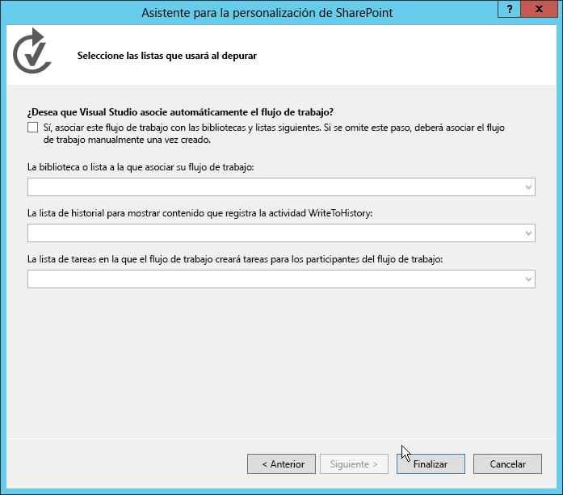
  

  

  
6. Luego agregue el formulario al proyecto de Visual Studio haciendo clic con el botón secundario en el elemento de flujo de trabajo dentro del **Explorador de soluciones**. Después seleccione **Agregar** y **Nuevo elemento**. 
    
    Este último paso es importante porque le dice al cuadro de diálogo **Agregar nuevo elemento** que el contexto es un elemento de flujo de trabajo. Esto, a su vez, hará que el cuadro de diálogo **Agregar nuevo elemento** muestre las dos plantillas de elemento de proyecto de formulario (formulario de iniciación y formulario de asociación) como opciones, tal como se muestra en la ilustración 2.
    

   **Ilustración 2. Seleccionar la plantilla de formulario de asociación.**

  

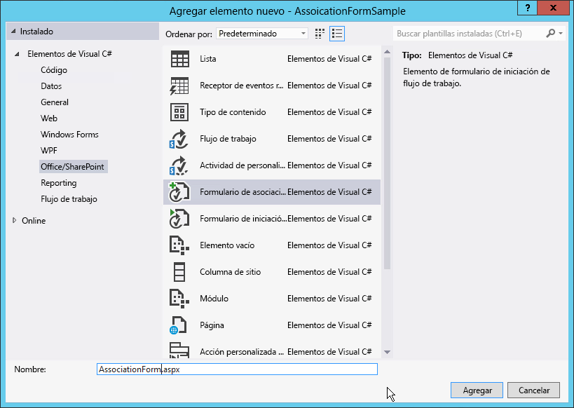
  

  

  
7. Seleccione el elemento **Formulario de asociación de flujo de trabajo** y quite el "1" del nombre del campo. Haga clic en Agregar para completar el proceso.
    
  

### Actualizar HTML y JavaScript en el formulario de asociación predeterminado

Una vez que el nuevo formulario se agrega al proyecto, Visual Studio lo abre automáticamente. En este momento, solo tiene que hacer dos cosas en el formulario para que sea compatible con el flujo de trabajo:
  
    
    

- Actualizar el formulario HTML para que refleje los elementos de datos que quiere obtener del usuario e indicar cómo se debe representar el formulario.
    
  
- Actualizar el JavaScript predeterminado para extraer los valores del formulario actualizado y hacer coincidir los nombres de propiedad con los nombres de los argumentos que ha creado en el flujo de trabajo.
    
  

1. Abra el formulario para ver el código.
    
  
2. Busque el control de servidor que se muestra en el siguiente fragmento de código:
    
  ```
  
<WorkflowServices:WorkflowAssociationFormContextControl ID="WorkflowAssociationFormContextControl1" runat="server" />
  ```


    Este control de servidor realiza dos tareas importantes. Primero, agrega las bibliotecas de JavaScript que necesita el formulario de asociación. Luego, toma los valores del formulario que envió el formulario anterior y los escribe en la página como controles de entrada HTML ocultos. La página anterior era el formulario de asociación predeterminado de SharePoint, donde el usuario especificó la definición del flujo de trabajo, el nombre de la asociación, el historial, la lista de tareas del flujo de trabajo y las opciones de inicio. Este formulario usaba un HTTP POST para mover al formulario de asociación personalizado que se ha agregado al flujo de trabajo. Como se trata de un HTTP POST, los valores no son accesibles en el formulario, pues toda la lógica personalizada se debe implementar sin código del lado cliente. Por lo tanto, SharePoint ofrece este control de servidor para extraer esos valores de la canalización de la solicitud HTTP y agregarlos a esta página.
    
  
3. Desplácese hacia abajo en el archivo de código fuente hasta que encuentre la tabla HTML de ejemplo y reemplácela por la siguiente:
    
  ```XML
  <table>
    <tr>
      <td colspan="2">
        String:<br /><textarea id="strInput" rows="1" columns="50"/>
      </td>
    </tr>
    <tr>
        <td><button id="Save" onclick="return runAssocWFTask()">Save</button></td>
        <td><button id="Cancel" onclick="location.href = cancelRedirectUrl; return false;">Cancel</button></td>
    </tr>
</table>

  ```


    Esta tabla muestra un cuadro de texto HTML simple que se usa para pasar información a la asociación de flujo de trabajo. El formulario tiene dos botones, que se usan para guardar o cancelar el flujo de trabajo. Al hacer clic en el botón **Guardar**, el flujo de trabajo llama a la función **runAssocWfTask()** de JavaScript, que está unas líneas más abajo en el archivo de código fuente. Tenemos que modificar ese siguiente.
    
  

### Actualizar Workflow Services JSOM para crear la asociación de flujo de trabajo

Inmediatamente después de la sección del formulario HTML del archivo de código fuente, hay un bloque  _ecmascriptshort_ de código de unas 200 líneas. Este bloque de código ilustra la nueva implementación de la API del modelo de objetos del lado cliente de Workflow Services JavaScript (JSOM) en SharePoint Server 2013. En su mayor parte, este código de JavaScript no cambia porque se encarga de cosas importantes:
  
    
    

- Determina si es necesario crear una nueva lista de tareas de flujo de trabajo asociado y, si es así, la crea.
    
  
- Determina si es necesario crear un nuevo historial de flujo de trabajo asociado y, si es así, lo crea.
    
  
- Crea una nueva asociación de flujo de trabajo con el nombre especificado, la definición del flujo de trabajo, las opciones de inicio y listas asociadas.
    
  
Al crear los formularios de asociación personalizados, hay que prestar especial atención cuando los valores del formulario se recopilan y se pasan a la nueva asociación. Trataremos esto en el proceso siguiente.
  
    
    

1. En el bloque de script del JSOM de la asociación de flujo de trabajo, busque la función **associateWF()** de JavaScript.
    
  
2. Dentro del bloque de script de esta función, busque la línea que define una nueva matriz llamada **metadata**: 
  
    
    
 `var metadata = new Object();`
    
  
3. Luego agregue una colección de pares nombre-valor que representen los campos de formulario que quiere pasar a SharePoint. Para el formulario personalizado de este tutorial, necesita el siguiente JavaScript, así que tiene que actualizar el bloque que establece la variable **metadata** del modo siguiente:
    
  ```XML
  
var strInputValue = document.getElementById("strInput").value;
if (strInputValue) {
  metadata['AssociationFormValue'] = strInputValue;
}
  ```

4. Ahora el formulario de asociación personalizado está completo.
    
  

### Usar los valores del formulario de asociación en el flujo de trabajo

Con el formulario completo, el siguiente paso es configurar el flujo de trabajo para que use los valores que se pasan desde el formulario de asociación. Cuando se pasa un valor desde el formulario de asociación, se pasa como un valor de configuración. Para obtenerlo, use una actividad especial para extraer el valor de configuración de los metadatos de asociación del flujo de trabajo y almacenarlo en una variable para usarlo después.
  
    
    

1. Abra el flujo de trabajo en Visual Studio, vaya a la pestaña **Variables** y cree una nueva variable de cadena denominada **AssociationFormValue**, tal como se muestra en la ilustración 3.
    
   **Ilustración 3. Crear la variable AssociationFormValue.**

  

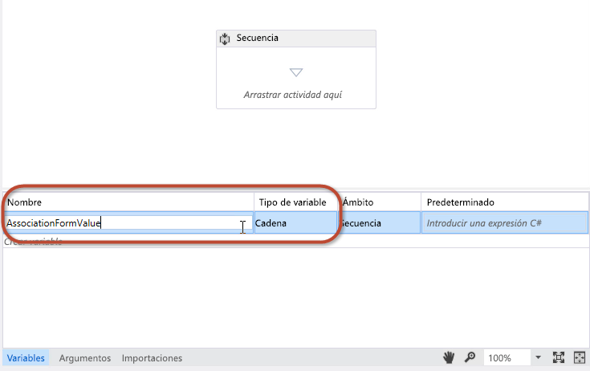
  

  

  
2. Arrastre y coloque una actividad **ObtenerValorConfiguración** en la superficie de diseño visual y establezca la propiedad **Name** en el nombre de la propiedad de metadatos usada en el formulario, tal como se ve en la ilustración 4.
    
   **Ilustración 4.**

  

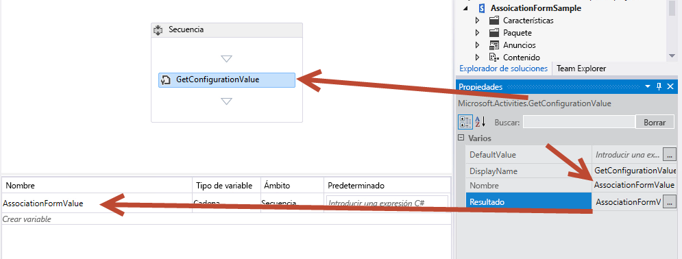
  

  

  
3. Establezca la propiedad **Result** en el nombre de la variable, como se muestra en la ilustración 4.
    
    Esta actividad extrae el valor de propiedad **AssociationFormValue** de los metadatos del flujo de trabajo y lo almacena en la variable local. Para ver el contenido de la variable, agregue una actividad **EscribirEnHistorial** al flujo de trabajo y establezca su propiedad **Message** para que escriba el valor de la variable en el historial.
    
  
4. Ha completado los pasos necesarios para asociar los valores del formulario con el flujo de trabajo. Guarde su trabajo y pruebe el formulario.
    
  

### Probar el formulario de asociación personalizado


1. Para probar el flujo de trabajo, presione **F5** o haga clic en el botón **Inicio** de Visual Studio. En este tutorial se supone que existe una instalación local de SharePoint Server 2013, de modo que Visual Studio inicia la utilidad Host del servicio de pruebas del administrador de flujos de trabajo e implementa el flujo de trabajo en el sitio para desarrolladores.
    
  
2. Cree la asociación yendo a la lista **Anuncios** y luego, en la cinta de opciones, seleccione la pestaña **Lista** y haga clic en **Configuración del sitio**, en el botón **Configuración del flujo de trabajo** y, por último, en el vínculo **Agregar un flujo de trabajo**. Ahora verá el formulario de asociación de SharePoint.
    
  
3. En el formulario de asociación, seleccione el flujo de trabajo que quiere probar y póngale un nombre.
    
  
4. Elija crear listas de tareas e historiales nuevos, establezca el flujo de trabajo para que se inicie manualmente y luego haga clic en **Siguiente**.
    
  
5. Como se ha especificado un formulario personalizado de asociación en la definición del flujo de trabajo, se abre el formulario de asociación personalizado que se muestra en la ilustración 5.
    
   **Ilustración 5. Formulario de asociación de flujo de trabajo personalizado.**

  

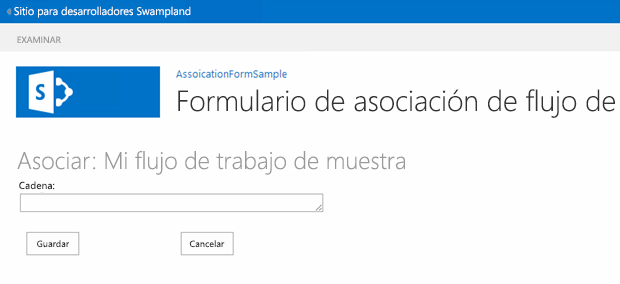
  

  

  
6. Escriba un valor en el campo de formulario y haga clic en **Guardar**. Esto crea la asociación y almacena el valor personalizado en los metadatos para la asociación de flujo de trabajo.
    
  
7. Para comprobar si el flujo de trabajo puede extraer el valor de las opciones de configuración, vuelva a la lista **Anuncios** lista y cree un nuevo elemento. Después de crear el elemento, inicie manualmente el flujo de trabajo personalizado. Cuando lo haya iniciado, vaya a la página de estado de la instancia del flujo de trabajo del elemento y confirme el valor que se ha escrito en el historial, como se ve en la ilustración 6.
    
   **Ilustración 6. Página de estado del flujo de trabajo.**

  


  

  

  

## Tutorial: Crear un formulario de iniciación personalizado
<a name="sec4"> </a>

En este tutorial se explica cómo crear un formulario de asociación personalizado y cómo usarlo para recopilar información del usuario cuando el flujo de trabajo se inicia manualmente.
  
    
    

### Crear un nuevo proyecto de flujo de trabajo


1. Empiece por crear un flujo de trabajo personalizado con Visual Studio 2012 y asegúrese de que tiene acceso a un sitio para desarrolladores de SharePoint Server 2013.
    
  
2. Cree un nuevo proyecto de SharePoint que esté configurado como aplicación hospedada en SharePoint.
    
  
3. Agregue una nueva lista **Anuncio** al proyecto. Usaremos esta lista como contenedor para los elementos que se usan para desencadenar el flujo de trabajo.
    
  
4. Luego agregue un elemento de flujo de trabajo al proyecto haciendo clic con el botón secundario en el icono del proyecto en **Explorador de soluciones** y seleccionando **Agregar** y **Nuevo elemento**. Luego, en el cuadro de diálogo **Agregar nuevo elemento**, seleccione el elemento de proyecto **Flujo de trabajo**. 
    
  
5. Ponga el nombre "MuestraFlujoDeTrabajoFormularioInic" al nuevo flujo de trabajo y haga clic en **Siguiente**.
    
  
6. Cuando se le pida, establezca el nuevo elemento de flujo de trabajo para que sea un **Flujo de trabajo de lista** asociado con la lista **Anuncios**; establezca el flujo de trabajo para que se inicie manualmente. (Recuerde que el formulario de iniciación no se mostrará si el flujo de trabajo se inicia automáticamente).
    
  
7. En este punto, el proyecto aparece en **Explorador de soluciones** como se muestra en la ilustración 7. Algunos elementos, como **WorkflowHistoryList** y **WorkflowTaskList**, se agregaron automáticamente cuando se creó la asociación.
    
   **Ilustración 7. Apariencia del proyecto en el Explorador de soluciones.**

  

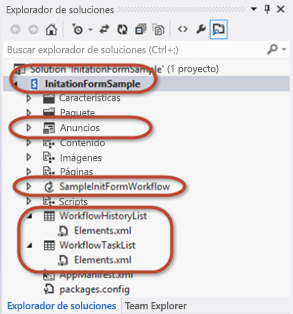
  

  

  

### Agregar argumentos para recopilar los valores del formulario de iniciación

El formulario de iniciación de flujo de trabajo les pide a los usuarios dos datos que necesita para que el flujo de trabajo se inicie: una cadena aleatoria más un usuario que se selecciona con el control del selector de personas. Para que esto se pueda hacer, tiene que configurar dos argumentos cuyos valores tomará la API de Workflow Services CSOM del formulario cuando se envíe.
  
    
    

1. En el diseñador de flujos de trabajo, haga clic en la pestaña **Argumentos**, en la parte inferior de la pantalla, y cree dos argumentos, como se ve en la ilustración 8. Póngales los nombres **UserLoginName** y **SomeRandomString**. 
    
   **Ilustración 8. Configuración de los argumentos de formulario de iniciación.**

  

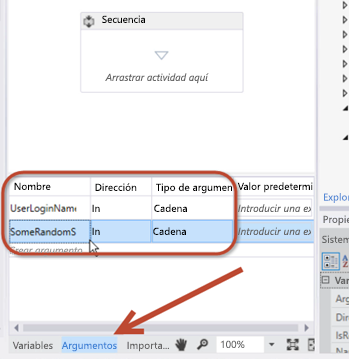
  

  

  
2. Establezca el **Tipo de argumento** en **String** y la **Dirección** en **In** para ambos, como se muestra en la ilustración 8.
    
    Podemos ver la propiedad **Direction** como si fuera una propiedad de una clase .NET. Cuando la dirección se establece en **In**, la propiedad tendría un método **Set** público, pero un método **Get** privado. Cuando la dirección se establece en **Out**, la propiedad tendría un **Get** público, pero un **Set** privado. Por último, cuando se establece en **In/Out**, tanto el método **Get** como el método **Set** son públicos.
    
  
3. Para ver el contenido de estos dos argumentos, agregue un par de actividades **EscribirEnHistorial** al flujo de trabajo y configure cada una de ellas para que escriba el contenido de los argumentos en el historial.
    
    Puede usar estos argumentos igual que las variables, pero recuerde que al establecer la **Dirección**, está dictando su capacidad de lectura y escritura. La ilustración 9 muestra el aspecto que podría tener una de estas actividades cuando se configura:
    

   **Ilustración 9. Configuración de una actividad EscribirEnHistorial para probar argumentos**

  

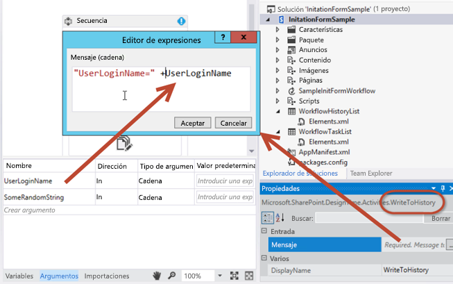
  

  

  

### Agregar el elemento de proyecto del formulario de iniciación

Una vez que el flujo de trabajo está configurado para aceptar dos argumentos de entrada del formulario, el paso siguiente es agregar el formulario al proyecto.
  
    
    

1. Haga clic con el botón secundario en el elemento de flujo de trabajo en el **Explorador de soluciones** y seleccione **Agregar** y **Nuevo elemento**.
    
  
2. Seleccione el elemento de proyecto **Formulario de iniciación del flujo de trabajo** y quite el número "1" del nombre, de modo que el formulario se llame "InitForm.aspx", y haga clic en **Agregar**. Esto hace que Visual Studio agregue la nueva página ASPX al módulo **Páginas** que ya está presente en el árbol del proyecto. Así nos aseguramos de que el formulario se aprovisionará a la subcarpeta **Páginas** en la aplicación. Visual Studio también ha modificado propiedades en el elemento de flujo de trabajo.
    
  
3. Seleccione el elemento de flujo de trabajo **MuestraFlujoDeTrabajoFormularioInic** en **Explorador de soluciones** y en la cuadrícula **Propiedades** fíjese en las propiedades que se han establecido en el formulario de iniciación. Una de ellas apunta en realidad a la ruta de acceso relativa del sitio del formulario que se acaba de agregar al módulo **Páginas**.
    
  

### Revisar y actualizar el formulario de iniciación predeterminado

Cuando agregó el nuevo formulario de iniciación al proyecto, Visual Studio 2012 automáticamente. Como pasaba con el formulario de asociación, este nuevo formulario de iniciación necesita que se hagan dos tareas:
  
    
    

- Actualizar el formulario HTML para especificar los elementos de datos del usuario que deben recopilarse, así como especificar cómo se debe presentar el formulario.
    
  
- Actualizar el bloque de JavaScript predeterminado para extraer del formulario los valores introducidos por el usuario y hacer coincidir los nombres de propiedad con los nombres de los argumentos que hemos creado en el flujo de trabajo.
    
  

> **NOTA**
> En el archivo de código fuente, fíjese en que el primer marcador de posición de contenido de ASP.NET, **PlaceHolderAdditionalPageHead**, contiene referencias a la biblioteca de Workflow Services CSOM ( **sp.workflowservices.js** ) y las bibliotecas centrales del CSOM de SharePoint Server 2013 ( **sp.js** y **sp.runtime.js** ). Inmediatamente después de esta sección de código, hay un comentario del lado servidor que contiene una nota comentada. Esta nota, que se ve en la ilustración 10, es irrelevante y debe pasarse por alto.
  
    
    


**Ilustración 10. Comentario de código que se puede omitir.**

  
    
    

  
    
    
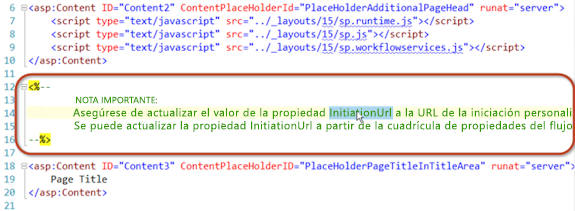
  
    
    

### Actualizar el formulario HTML


1. Desplácese hacia abajo en el archivo de código fuente del formulario hasta llegar al marcador de posición de contenido de ASP.NET llamado  `PlaceHolderMain`. Verá que la primera parte de esta sección contiene una tabla HTML que tiene tres campos de formulario. Solo necesitamos dos.
    
  
2. Actualice esta tabla HTML sustituyéndola por la siguiente:
    
  ```
  
<table>
  <tr>
    <td>
      String:<br />
      <input type="text" id="strInput" />
    </td>
  </tr>
  <tr>
    <td>
      User Picker:<br />
      <SharePoint:PeopleEditor AllowEmpty="false" ValidatorEnabled="true" MultiSelect="false" ID="peoplePicker" runat="server" />
    </td>
  </tr>
  <tr>
    <td>
      <input type="button" name="startWorkflowButton" value="Start" onclick="StartWorkflow()" />
      <input type="button" name="cancelButton" value="Cancel" onclick="RedirFromInitForm()" />
      <br />
    </td>
  </tr>
</table>

  ```

Ahora, la tabla contiene dos controles de entrada. La primera es un cuadro de texto HTML estándar cuyo id. es **strInput**. El segundo es un control de selector de personas de SharePoint cuyo id. es **peoplePicker**. Este último es un control del lado servidor; sin embargo, se permite en la página porque se ha implementado en todos los PC de SharePoint Server 2013. Además, se hace referencia al control en la parte superior del formulario de iniciación.
  
    
    
Ahora fíjese en los dos botones del formulario, **Inicio** ("botónIniciarFlujoDeTrabajo") y **Cancelar** ("botónCancelar"). Al hacer clic en el botón Iniciar, se llama a la función **StartWorkflow()** de JavaScript. La función en sí se encuentra en un bloque de script más abajo en el archivo del formulario y es lo siguiente que debemos cambiar.
  
    
    

### Actualizar el bloque de código JSOM para iniciar el flujo de trabajo


1. Busque el bloque de código de JavaScript que sigue inmediatamente a la tabla HTML que acabamos de modificar. El código que hay en el bloque de script casi no lo cambiaremos.
    
    Este código demuestra la gran fuerza y la flexibilidad que hay en la API del modelo de objetos del lado cliente (JSOM) de Workflow Services JavaScript que se ha implementado en SharePoint Server 2013. Desde un nivel superior, el código realiza los pasos siguientes.
    
  
2. Busque la línea de código siguiente:  `var wfParams = new Object();`
    
  
3. Inmediatamente después de esta línea, sustituya el código existente por su propio código para extraer valores de los dos campos de formulario HTML que creamos antes: **strInput** y **peoplePicker**. Para ello, agregue la siguiente referencia a la biblioteca de jQuery en el elemento **PlaceHolderAdditionalPageHead** del formato HTML. Así es más fácil obtener los valores del formulario.
    
  ```
  
<script type="text/javascript" src="../Scripts/jquery-1.8.2.min.js"></script>
  ```

4. Ahora vuelva a la parte del bloque de script JSOM donde se recopilan los parámetros del formulario. Sustituya el JavaScript existente por el código siguiente:
    
  ```
  var wfParams = new Object();
// get people picker value
var html = $("ctl00_PlaceHolderMain_peoplePicker_upLevelDiv");
wfParams['UserLoginName'] = $("#divEntityData", html).attr("key");

// get string input
var strInputValue = $("strInput").value;
wfParams['SomeRandomString'] = strInputValue

  ```

5. Guarde los cambios.
    
  
El código que hemos modificado en el paso anterior hace muchas tareas:
  
    
    

- Obtiene estos tres parámetros de la cadena de consulta que hay en la dirección URL:
    
  - El id. del elemento con el que se asociará la nueva instancia de flujo de trabajo, guardado en la variable de JavaScript **[itemId]**.
    
  
  - El id. de la asociación de flujo de trabajo que hay en el sitio, la lista o la biblioteca de documentos actuales, guardado en la variable de JavaScript **[subscriptionId]**.
    
  
  - La dirección URL de la que ha venido el usuario, guardada en la variable de JavaScript **[redirectUrl]**. Aquí es a donde se llevará al usuario cuando complete el formulario y se inicie el flujo de trabajo.
    
  
- Crea una matriz de propiedades que se enviará al flujo de trabajo y que se guarda en la variable de JavaScript **[wfParams]**. Estos son los valores que tendrá que recopilar del formulario y el segundo de los dos pasos mínimos necesarios para editar el formulario de iniciación personalizado.
    
  
- Obtiene las referencias a un contexto de cliente de SharePoint CSOM, así como los servicios de flujo de trabajo necesarios.
    
  
- Una vez conectado el script al servicio de suscripción de servicios de flujo de trabajo (al que se hace referencia en la variable **[subscriptionService]** ), realiza una de las siguientes tareas:
    
  
- 
  - Si el script obtuvo un id. de elemento a partir de la cadena de consulta en el primer paso, luego inicia una instancia nueva del flujo de trabajo en el elemento de lista especificado llamando a la función **[startWorkflowOnListItem()]** desde el servicio de la instancia de los servicios de flujo de trabajo.
    
  
  - Si no se encuentra ningún id., se inicia una nueva instancia del flujo de trabajo en el sitio actual llamando a la función **[startWorkflow()]** desde el servicio de la instancia de los servicios de flujo de trabajo.
    
  

### Probar el formulario de iniciación personalizado

Pruebe el flujo de trabajo presionando F5 o haciendo clic en el botón **Inicio** de Visual Studio 2012. Si va a probar una instalación local de SharePoint Server 2013, Visual Studio 2012 iniciará la utilidad Host del servicio de pruebas del administrador de flujos de trabajo e implementará el flujo de trabajo en el sitio para desarrolladores. Tras unos momentos, se abrirá el sitio para desarrolladores.
  
    
    
Vaya a la lista **Anuncios** y cree un elemento nuevo. Después de crear el elemento, inicie el flujo de trabajo personalizado.
  
    
    
Como la definición del flujo de trabajo contiene una referencia a un formulario de iniciación, primero se lleva al usuario a ese formulario. Introduzca los valores necesarios y haga clic en el botón **Inicio**. Esto desencadena el JavaScript en la página, que inicia la instancia del flujo de trabajo, como se muestra en la ilustración 11.
  
    
    

**Ilustración 11. Desencadenar el flujo de trabajo.**

  
    
    

  
    
    
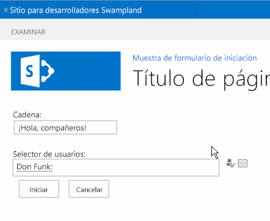
  
    
    
Después de iniciar el flujo de trabajo, la página redirige al usuario a la página de origen. Deje pasar un momento para que el flujo de trabajo se inicie y luego vuelva al elemento y vea la página de estado de la instancia del flujo de trabajo. Fíjese en que el historial contiene los valores enviados en el formulario que después se enviaron a SharePoint cuando se creó la instancia del flujo de trabajo usando Workflow Services JSOM.
  
    
    

**Ilustración 12. Finalización del flujo de trabajo**

  
    
    

  
    
    
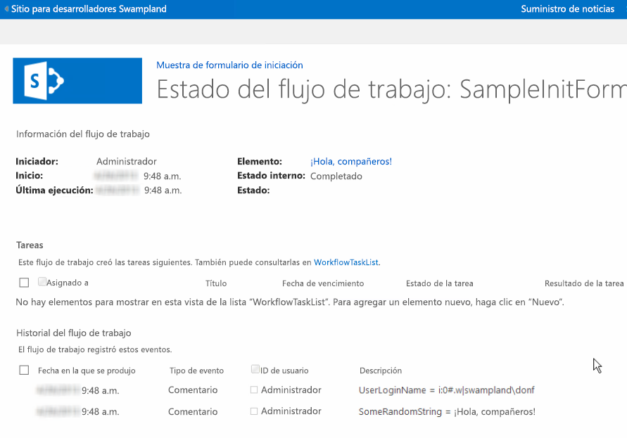
  
    
    

  
    
    

  
    
    

## Conclusión
<a name="sec6"> </a>

SharePoint 2013 ha introducido varias mejoras en los flujos de trabajo. En este artículo se detallan los cambios relacionados con los formularios de flujo de trabajo que han resultado de los cambios hechos en la arquitectura del flujo de trabajo de SharePoint Server 2013. También se ha explicado cómo crear formularios personalizados de asociación y de iniciación que se pueden usar para cumplir los estrictos requisitos de la automatización del proceso de negocio de hoy en día usando Visual Studio 2012.
  
    
    

## Recursos adicionales
<a name="sec7"> </a>


-  [Formularios de inicio y de asociación de flujo de trabajo (SharePoint Foundation)](http://msdn.microsoft.com/es-es/library/office/ms481192%28v=office.14%29.aspx)
    
  
-  [Trabajar con el modelo de objetos de SharePoint 2013 flujo de trabajo de servicios de cliente del lado](working-with-the-sharepoint-2013-workflow-services-client-side-object-model.md)
    
  
-  [Personalizar una vista de lista en complementos de SharePoint mediante representación del lado cliente](http://msdn.microsoft.com/library/8d5cabb2-70d0-46a0-bfe0-9e21f8d67d86%28Office.15%29.aspx)
    
  

