# Cómo: Crear flujos de trabajo de SharePoint 2013 con Visual Studio
Obtenga información sobre los conceptos básicos de la creación de un flujo de trabajo de SharePoint en la nueva plataforma de flujo de trabajo de SharePoint 2013.
 **Proporcionado por:** [Andrew Connell](http://social.msdn.microsoft.com/profile/andrew%20connell%20%5bmvp%5d/),  [AndrewConnell.com](http://www.andrewconnell.com)
  
    
    

  
    
    

> **NOTA**
> Este artículo incluye un ejemplo de código completo que puede usar para seguir el artículo o como un inicio de sus propios proyectos de flujo de trabajo de SharePoint. Puede encontrar el código para descargarlo aquí: VÍNCULO. 
  
    
    

  
    
    

  
    
    
Microsoft ha adoptado un enfoque muy diferente a los flujos de trabajo en SharePoint 2013 que en versiones anteriores. Los flujos de trabajo de SharePoint se basan en Windows Workflow Foundation 4 y su ejecución está controlada por un nuevo componente denominado Administrador de flujos de trabajo, que se ejecuta externamente a SharePoint.Administrador de flujos de trabajo actúa como host para la función de Windows Workflow Foundation en tiempo de ejecución y todos los servicios necesarios en una forma altamente disponible y escalable. Aprovecha el Bus de servicio de rendimiento y escalabilidad y, una vez implementado, se ejecuta exactamente igual en una implementación local, como cuando se implementa en un servicio basado en la nube, como Office 365, porque está configurado para entregar toda la ejecución del flujo de trabajo y las tareas relacionadas en la granja de servidores de Administrador de flujos de trabajo.El cambio fundamental en la arquitectura de flujo de trabajo requería algunos cambios en las dos herramientas de creación de flujo de trabajo principal para crear flujos de trabajo personalizados: Visual Studio y SharePoint Designer. En este artículo se explica cómo utilizar Visual Studio 2012 como la herramienta de creación para crear flujos de trabajo personalizados para su uso en el flujo de trabajo de implementaciones de **sp15allshort** en el sistema local o en implementaciones de Office 365
## Tipos de flujos de trabajo en Visual Studio 2012

Mientras que SharePoint Designer 2013 solo pueden crear flujos de trabajo formados por fases, Visual Studio admite otro eficaz tipo de flujo de trabajo: el flujo de trabajo de máquina de estados. De hecho, a continuación, los entornos de desarrollo de flujo de trabajo Visual Studio 2012 (y Visual Studio 2013) admiten tres tipos de creación de flujos de trabajo: secuenciales, diagrama de flujo y máquina de estados.
  
    
    

### Secuencial

Un flujo de trabajo secuencial es aquel que sigue una ruta específica. Puede haber ramas de decisión, bucles y el flujo de trabajo puede no tener un punto de terminación, pero la ruta de acceso predecible es fácil de seguir en el proceso de diseño. De hecho, es cómo empiezan todos los flujos de trabajo cuando se usa la plantilla de proyecto **Flujo de trabajo** en Visual Studio.
  
    
    
Un flujo de trabajo secuencial contiene una sola actividad **Secuencia** y cualquier número de actividades dentro de ella. Algunas de ellas podrían ser otras actividades **Secuencia** que se utilizan para agrupar una serie de pasos más pequeños.
  
    
    

### Diagrama de flujo

En un flujo de trabajo de diagrama de flujo, la ruta de ejecución puede realizar la transición a distintas secciones del flujo de trabajo según las condiciones especificadas, como se muestra en la Figura 1. La actividad del diagrama de flujo, junto con las actividades FlowDescision y FlowSwitch asociadas, normalmente se colocan dentro de una actividad de secuencia y actúan como una instrucción **if** tradicional o como una instrucción **switch** en los lenguajes de programación comunes.
  
    
    
La construcción de una fase dentro de un flujo de trabajo de SharePoint Designer 2013 se basa en los principios de un diagrama de flujo. Estos tipos de flujos de trabajo, a diferencia de un flujo de trabajo secuencial, no siguen una ruta de acceso determinada. En su lugar, lo que sucede durante el flujo de trabajo indica la ruta que sigue.
  
    
    

**Figura 1. Flujo de trabajo de diagrama de flujo en Visual Studio 2012**

  
    
    

  
    
    
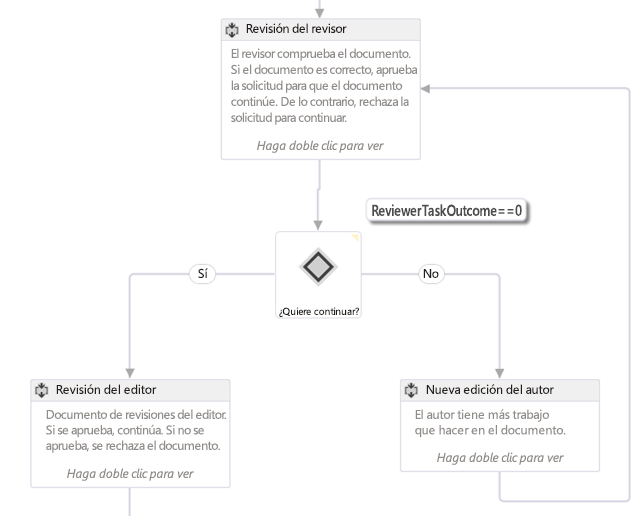
  
    
    

    
> **NOTA**
> Aquí puede encontrar el flujo de trabajo que se muestra en la figura 1 como un ejemplo de flujo de trabajo en MSDN:  [SharePoint 2013: flujo de trabajo de aprobación que usa un formulario de iniciación personalizado](http://code.msdn.microsoft.com/officeapps/SharePoint-2013-Approval-f5ac5eb2). 
  
    
    

### Máquina de estados

Los flujos de trabajo de máquina de estados, como los flujos de trabajo de diagrama de flujo, normalmente no siguen una ruta de ejecución concreta. En su lugar, están formados por dos o más estados, como se muestra en la figura 2. 
  
    
    

**Figura 2. Flujo de trabajo de máquina de estados en Visual Studio 2012**

  
    
    

  
    
    
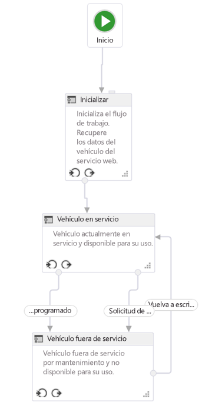
  
    
    

    
> **NOTA**
> Aquí puede encontrar el flujo de trabajo que se muestra en la figura 1 como un ejemplo de flujo de trabajo en MSDN:  [SharePoint 2013: enrutar flujos de trabajo a estados en función de las acciones y los eventos](http://code.msdn.microsoft.com/officeapps/SharePoint-2013-Route-25a25d87). 
  
    
    

Considere cada estado como un flujo de trabajo más pequeño que contiene varias actividades de flujo de trabajo. Puede establecer el inicio de determinadas actividades cuando el flujo de trabajo entre o salga de un estado determinado. Lo que es interesante de las máquinas de estados son las transiciones que pueden definirse. Cada estado puede tener una o varias transiciones que indican al motor de flujos de trabajo cómo pasar de un estado a otro. 
  
    
    
El flujo de trabajo siempre va a estar en uno de los estados de un flujo de trabajo de la máquina de estados. Una transición determinará al desencadenador del flujo de trabajo que pase de un estado a otro. Muchas personas dan prioridad a los flujos de trabajo de máquina de estados sobre los otros tipos de flujos de trabajo porque se pueden crear para que reflejen con fidelidad procesos empresariales reales. Sin embargo, estos tipos de flujos de trabajo pueden complicarse rápidamente.
  
    
    

## Interfaz de desarrollo de flujo de trabajo de Visual Studio 2012

Al agregar un nuevo flujo de trabajo a un proyecto de SharePoint, la plantilla agrega una actividad de secuencia que actúa como el contenedor principal. Si quiere crear un flujo de trabajo de máquina de estados o un diagrama de flujo simplemente elimine esta actividad predeterminada y arrastre una actividad StateMachine o Flowchart a la superficie de diseño.
  
    
    
Antes de crear un flujo de trabajo personalizado, los desarrolladores deben comprender bien en la superficie de diseño y las ventanas de herramientas que proporciona Visual Studio 2012. Muchos de los elementos son muy comunes, como se muestra en la figura 3:
  
    
    

**Figura 3. Interfaz de creación de flujos de trabajo de Visual Studio 2012**

  
    
    

  
    
    
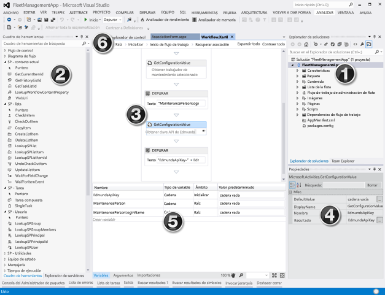
  
    
    
La interfaz de desarrollo de flujo de trabajo, es decir, el diseñador de flujo de trabajo, tiene los siguientes elementos clave:
  
    
    

  
    
    

1. **Explorador de soluciones**, muestra el proyecto como un árbol de archivos.
    
  
2. **Cuadro de herramientas de flujo de trabajo**, contiene todas las actividades que puede usar para ensamblar un flujo de trabajo. Arrastrar y colocar desde el cuadro de herramientas a la superficie del diseñador.
    
  
3. **Superficie del diseñador de flujo de trabajo**, es donde ensamblar y vincular los elementos de flujo de trabajo.
    
  
4. **Cuadrícula de propiedades**, muestra las propiedades de una actividad seleccionada o de un elemento del **Explorador de soluciones**. Use esta opción para establecer o cambiar los valores de propiedad.
    
  
5. **Panel de resultados**, muestra información sobre elementos de actividad de flujo de trabajo: importar, argumentos y variables.
    
  
6. **Fichas de exploración de la ruta de navegación**, permite acercarse y alejarse en diversas partes de un flujo de trabajo en desarrollo.
    
  
El **Panel de resultados** (el nº. 5 en la figura 3) es importante, ya que permite ver todas las variables del flujo de trabajo en el ámbito actual. La especificación del ámbito funciona del mismo modo que en el diseño estándar de programación orientada a objetos: una variable en la raíz del ámbito es accesible a todos los ámbitos inferiores (por ejemplo, los métodos de una clase), pero una variable dentro de un ámbito inferior (por ejemplo, un método en una clase) solo es accesible dentro de ese ámbito y sus elementos secundarios, pero no dentro de los ámbitos paralelos o del principal.
  
    
    
Haga clic en la ficha **Argumentos** para ver una lista de los argumentos que se usan para pasar valores al flujo de trabajo, como los que se pasan de un formulario de inicio.
  
    
    

## Cómo crear un flujo de trabajo personalizado

Para crear un flujo de trabajo personalizado con Visual Studio 2012 o posterior, asegúrese de que tiene acceso a un sitio para desarrolladores de SharePoint 2013. En este tutorial, se recomienda usar una instalación local de SharePoint 2013. Esto es porque los flujos de trabajo probados localmente pueden escribir información de depuración en la utilidad de la consola de Host de servicio de prueba mediante la actividad **WriteLine**. Esta utilidad se incluye con Office Developer Tools para Visual Studio 2013, que forman parte de la instalación predeterminada de Visual Studio 2012 y posteriormente en las ediciones Professional, Premium y Ultimate.
  
    
    

### Crear un nuevo proyecto de aplicación

1. En Visual Studio, cree un nuevo proyecto Complementos de SharePoint y configúrelo para que sea una aplicación hospedada de SharePoint.
    
  
2. En este proyecto, agregue una nueva instancia de lista **Anuncio**. Esta lista se utiliza como un contenedor para los elementos que se usarán para probar el flujo de trabajo.
    
  
3. Agregue un elemento de flujo de trabajo al proyecto, para ello haga clic con el botón secundario en el icono del proyecto en el **Explorador de soluciones** y luego seleccione **Agregar**, **Nuevo elemento**.
    
  
4. En el cuadro de diálogo **Agregar nuevo elemento**, seleccione el elemento de proyecto **Flujo de trabajo** desde la categoría **Office/SharePoint** y asígnele el nombre "Mi primer flujo de trabajo". Haga clic en **Siguiente**.
    
  
5. Cuando el **Asistente para la personalización de SharePoint** le pida un nombre, deje el predeterminado y luego establézcalo en **Flujo de trabajo de lista**. Haga clic en **Siguiente**.
    
  
6. En la siguiente página del asistente, active la casilla para crear una asociación. Seleccione la lista **Anuncios** que acaba de crear; seleccione **<Crear nueva>** en la tarea y aparecerá el historial de flujos de trabajo necesarios, luego haga clic en **Siguiente**.
    
  
7. En la última página del asistente, active la casilla para iniciar el flujo de trabajo manualmente, dejando las dos opciones de inicio automático desactivadas. Haga clic en **Finalizar**. Visual Studio agrega automáticamente los elementos necesarios al proyecto y carga el archivo Workflow.xaml en el diseñador, como se muestra en la figura 4.
    
   **Figura 4. Superficie del diseñador predeterminada después de agregar el elemento de flujo de trabajo**

  

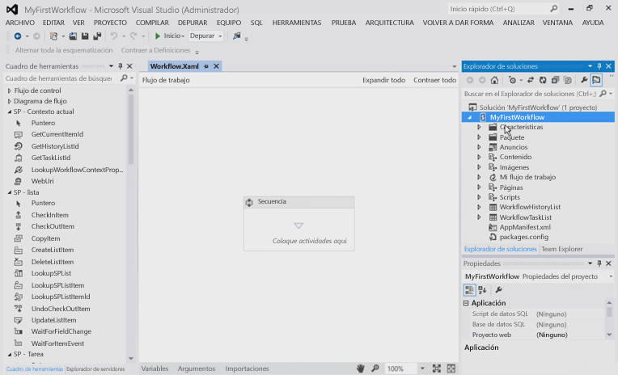
  

  

  

### Organizar los pasos de flujo de trabajo

Para automatizar un proceso empresarial determinado, los flujos de trabajo pueden contener cualquier número de actividades que se agrupan en un paso o una **secuencia**. Sin embargo, si se agrupan demasiadas actividades en una única **secuencia**, el flujo de trabajo se convierte en confuso y difícil de seguir y depurar. Es como si en un lenguaje de programación común se aconseja crear métodos muy largos y complejos. En su lugar, deberá agrupar actividades que funcionen conjuntamente para realizar una tarea específica en una secuencia normal.
  
    
    
En este ejemplo de flujo de trabajo se ilustra la práctica de segmentar los flujos de trabajo. En el nuevo proyecto, en la superficie de diseño de la actividad de secuencia predeterminada existente, agregue dos nuevas actividades de secuencia y cámbieles el nombre a "Secuencia secundaria 1" y "Secuencia secundaria 2", como se muestra en la figura 5. Cambie también el nombre de la actividad de la secuencia original a "Raíz", aunque no se muestra en la figura 5.
  
    
    

**Figura 5. Agregar secuencias secundarias a la secuencia predeterminada o raíz**

  
    
    

  
    
    
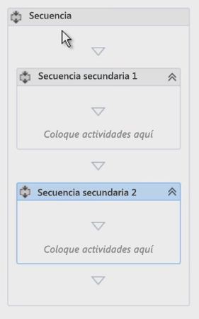
  
    
    

  
    
    

  
    
    

### Comentar el flujo de trabajo con anotaciones

Cuando se usa un lenguaje de programación común como C#, NET o C++, el código se puede comentar utilizando los especificadores de comentario adecuados. Los comentarios del código son importante para las pruebas y para mantener un código base. Visual Studio permite también comentar el desarrollo de flujos de trabajo proporcionando una característica denominada **annotations**.
  
    
    
Puede comentar una actividad de flujo de trabajo determinada seleccionando la actividad, para ello, seleccione **Anotaciones** y luego **Agregar anotación**. Un pequeño icono de comillas angulares invertidas en el lado derecho de la barra de título de la actividad indica que tiene una anotación. Desplace el puntero sobre el icono o haga clic en él para ver el mensaje (se muestra en la figura 6). Tiene la opción de anclar la anotación de la actividad para que siempre esté visible, como se muestra en la figura 6. 
  
    
    

**Figura 6. Anotación en una actividad**

  
    
    

  
    
    
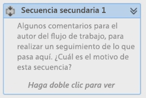
  
    
    

  
    
    

  
    
    

### Obtener valores de elementos de lista

Una tarea común que encontrará al crear flujos de trabajo es obtener propiedades de un elemento de lista. Para realizar esta tarea, use la actividad **LookupSPListItem**. Esta actividad hace una llamada el servicio web usando la API de REST de SharePoint 2013 para buscar información en el elemento de lista. El siguiente procedimiento muestra cómo hacerlo:
  
    
    
En primer lugar, arrastre una actividad **LookupSPListItem** desde el cuadro de herramientas y colóquela en la actividad **Secuencia secundaria 1**.
  
    
    
Después de agregar la actividad al diseñador, tiene que establecer un par de propiedades: **ListId** y **ItemId**. Estas propiedades se pueden establecer para buscar información en cualquier lista, pero con los métodos abreviados para **lista actual** y **elemento actual** piden a Administrador de flujos de trabajo que busque estos valores automáticamente.
  
    
    
Dado que se está haciendo una llamada de servicio web, el valor devuelto por esta actividad que se refleja en la propiedad **Result** es de tipo **DynamicValue**. Por lo tanto, necesita una variable de ese tipo de datos en la que se va a almacenar el resultado de salida de la llamada de servicio web. Esto es bastante fácil ya que al hacer clic en el vínculo **Obtener propiedades** de la actividad **LookupSPListItem** mucho de esto se hace automáticamente:
  
    
    

- En primer lugar, crea una nueva variable de tipo **DynamicValue**.
    
  
- Luego, establece esta nueva variable para que sea el origen de la propiedad **Result** en la actividad **LookupSPListItem**.
    
  
- A continuación, agrega una actividad **GetDynamicValueProperties** al flujo de trabajo para que se pueda recuperar el valor de la variable.
    
  
- Por último, enlaza la variable a la propiedad **Source** de la actividad **GetDynamicValueProperties**.
    
  
Por supuesto, se puede hacer todo esto manualmente, pero las herramientas simplifican el proceso. Si es necesario, puede cambiar los nombres de las variables.
  
    
    
Por supuesto, el objetivo es obtener algunos valores del elemento de lista que desencadenaron el flujo de trabajo: ahora, la columna Asignado a es donde los valores de estas propiedades se enlazan a variables que creadas anteriormente o use el vínculo Rellenar variables que creará automáticamente las variables.
  
    
    

1. En la propiedad **Properties** de la actividad **GetDynamicValueProperties**, haga clic en el botón de puntos suspensivos [ **...**] para abrir el cuadro de diálogo **Propiedades**, que se muestra en la figura 7.
    
   **Figura 7. Extraer valores con el cuadro de diálogo Propiedades**

  

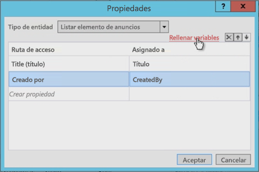
  

  

  
2. Después de cambiar el **Tipo de entidad** para que coincida con el tipo del elemento; en este caso, el elemento de lista **elemento Lista de anuncios**.
    
  
3. Seleccione las dos propiedades que se van a recuperar: los campos **Title** y **Created By**.
    
  
4. La columna **Asignar a** es donde se enlazan estas propiedades a las variables que se han creado. Como alternativa, puede usar el vínculo **Rellenar variables**, que asigna automáticamente las variables.
    
  
Observe en la figura 7 cómo la herramienta crea las variables e incluso coinciden con los tipos de datos correctamente. Además, observe cómo el campo **Creado por** es un número entero. ¿No es realmente útil mostrar al usuario que es un número para el autor? Esto se tratará más adelante en el flujo de trabajo.
  
    
    

### Obtener propiedades de usuario

Otra tarea común en el desarrollo de flujos de trabajo personalizados es buscar usuarios. Por ejemplo, el flujo de trabajo actualmente sabe quién ha creado el elemento de anuncio, pero solo lo conoce por su Id. Este Id. es el identificador del usuario que se ha agregado a la **Lista de información de usuarios** del sitio, que es una copia en caché de la información de su perfil. Lo que realmente quiere es su nombre o su nombre de inicio de sesión.
  
    
    
Para obtener información de usuario, haga lo siguiente:
  
    
    

1. Cambie el nombre de la primera secuencia ( **Secuencia secundaria 1**) a "Obtener propiedades de elemento" y el nombre de la segunda secuencia a "Obtener propiedades de autor".
    
    > **NOTA**
      > Asegúrese de que la variable contiene el identificador de usuario que se aplica a todo el flujo de trabajo y no solo a la secuencia en la que se estaba trabajando. Cambie el ámbito de la variable, como se muestra en la figura 8. 

   **Figura 8. Cambio del ámbito de la variable**

  

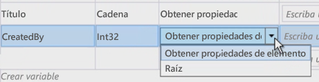
  

  

  
2. Ahora, para obtener la información del usuario, arrastre y coloque una actividad **LookupSpUser** en el flujo de trabajo y cambie su nombre a "Obtener autor del anuncio". Esta actividad llamará a la API de REST de SharePoint y pasará un identificador específico. Compruebe el aspecto que tiene el servicio REST con el explorador y vaya a `http://../_api/web/SiteUsers`. Tome nota también de las propiedades devueltas ya que las necesitará en un momento.
    
  
3. Observe que cada usuario tiene una dirección URL específica que incluye su identificador para obtener la información del usuario. Observe también que es probable que la actividad llame al operador del servicio **GetUserById** y pase el identificador del usuario para su búsqueda. Introdúzcalo especificando que la propiedad **PrincipalId** de la actividad **LookupSPUser** sea la variable **CreatedBy**, que es el número entero del autor del elemento de anuncio.
    
  
4. Al igual que la actividad **LookupSPListItem**, la actividad **LookupSPUser** devuelve un valor de tipo **DynamicValue**, por lo tanto, cree una variable de ese tipo para asociarla a nuestra respuesta y enlazar esta variable a las propiedades **Result** de la actividad **LookupSPUser**, como se muestra en la figura 9.
    
   **Figura 9. Actualizar la salida de la actividad LookupSPUser**

  

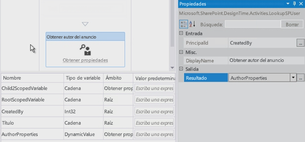
  

  

  
5. Al igual que hizo anteriormente, use una actividad **GetDynamicValueProperties** para extraer los resultados de la actividad del valor **AuthorProperties**. Sin embargo, observe que ahora **Entity Type** no tiene una opción que se pueda establecer. Esto no supone ningún problema, ya que la respuesta del servicio web real de **LookupSPUser** puede verse en el explorador. Para verla, escriba la ruta de acceso a la propiedad que está buscando, que, en este caso, es `d/results/(0)/LoginName`. A continuación, escriba otra para mostrar el nombre del autor, como se muestra en la figura 10.
    
   **Figura 10. Recuperar valores de la actividad LookupSPUser**

  

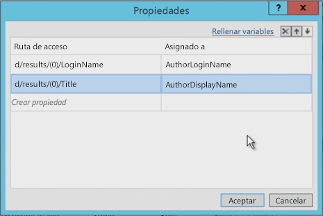
  

  

  

### Probar el flujo de trabajo

Por último, pruebe el flujo de trabajo. Empiece agregando dos actividades **WriteLine**. Estas permiten mostrar el contenido de las dos variables. Al probar el flujo de trabajo, la utilidad de la consola de Host de servicio de prueba escribirá los dos valores, como se muestra en la figura 11.
  
    
    

**Figura 11. Prueba usando la consola de Host de servicio de prueba**

  
    
    

  
    
    
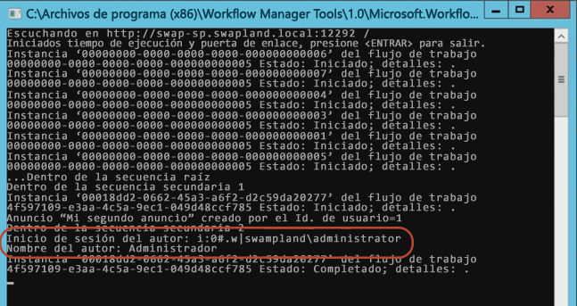
  
    
    

  
    
    

  
    
    

## Conclusión

En este artículo primero se han explicado los distintos tipos de flujos de trabajo que se pueden crear con Visual Studio 2012 y versiones posteriores para SharePoint 2013 cuando se ha conectado a una granja de servidores de Workflow Manager. Luego, se ha mostrado cómo crear un flujo de trabajo que no solo recoge los valores del elemento de lista que ha desencadenado el flujo de trabajo, sino también se ha mostrado cómo realizar una tarea común como obtener el nombre de inicio de sesión de un usuario y el nombre para mostrar con la actividad **LookupSPUser**. Además, en el artículo se han tratado unas prácticas recomendadas para mantener organizados flujos de trabajo y agregarles comentarios con anotaciones.
  
    
    

## Recursos adicionales

-  [Flujos de trabajo de SharePoint 2013](workflows-in-sharepoint-2013.md)
    
  
-  [Procedimientos recomendados de desarrollo de flujo de trabajo de SharePoint](sharepoint-workflow-development-best-practices.md)
    
  
-  [Ejemplos de flujos de trabajo de SharePoint 2013](sharepoint-2013-workflow-samples.md)
    
  

  
    
    

