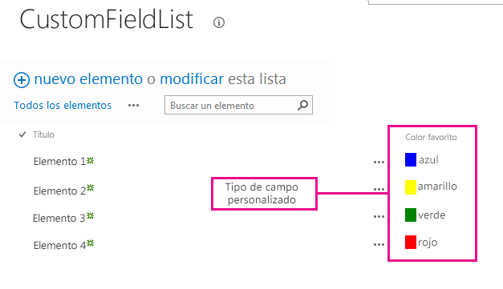
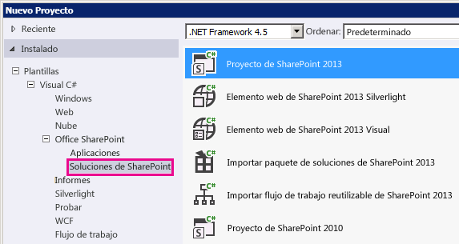

# Cómo: Personalizar un tipo de campo mediante la representación del lado cliente
Obtenga información sobre cómo personalizar un tipo de campo con la tecnología de representación del lado cliente de SharePoint 2013.
La representación del lado cliente proporciona un mecanismo que puede usar para crear su propio resultado para un conjunto de controles hospedados en una página de SharePoint. Este mecanismo le permite usar tecnologías muy conocidas, como HTML y JavaScript para definir la lógica de representación de tipos de campos personalizados. En la representación del lado cliente puede especificar sus propios recursos de JavaScript y hospedarlos en las opciones de almacenamiento de datos disponibles en su solución de granja de servidores, como la carpeta _layouts.
  
    
    


## Requisitos previos para usar los ejemplos de este artículo
<a name="SP15CustomizeafieldtypeusingCSR_Prereq"> </a>

Para realizar los pasos de este ejemplo, necesita los siguientes elementos:
  
    
    

- Microsoft Visual Studio 2012
    
  
- Office Developer Tools para Visual Studio 2012
    
  
- Un entorno de desarrollo de SharePoint 2013.
    
  
Para obtener información sobre cómo configurar el entorno de desarrollo de SharePoint, consulte  [Configurar un entorno de desarrollo general para SharePoint 2013](set-up-a-general-development-environment-for-sharepoint-2013.md).
  
    
    

### Conceptos básicos para comprender la representación del lado cliente para los tipos de campo

La siguiente tabla muestra una lista de artículos útiles que pueden ayudarle a entender los conceptos y los pasos necesarios en un escenario de acciones personalizadas.
  
    
    

**Tabla 1. Conceptos básicos para la representación del lado cliente para tipos de campo**


|**Título del artículo**|**Descripción**|
|:-----|:-----|
| [Crear soluciones de granjas de servidores en SharePoint 2013](build-farm-solutions-in-sharepoint-2013.md) <br/> |Obtenga información sobre el desarrollo, el empaquetado y la implementación extensiones administrativas en SharePoint 2013 con soluciones de granja de servidores.  <br/> |
| [Tipos de campos personalizados](http://msdn.microsoft.com/es-es/library/ms446361.aspx) <br/> |Obtenga información sobre cómo crear tipos de campos personalizados. Al almacenar información comercial en SharePoint 2013, puede haber ocasiones en las que los datos no se ajustan a los tipos de campos que están disponibles en SharePoint Foundation. O, es posible que solo quiera personalizar los tipos de campos. Los campos personalizados pueden incluir la validación y la representación de campos personalizados.  <br/> |
   

## Ejemplo de código: Personalizar el proceso de representación de un tipo de campo personalizado en un formulario de vista
<a name="SP15CustomizeafieldtypeusingCSR_Codeexample"> </a>

Siga estos pasos para personalizar la representación de un tipo de campo personalizado:
  
    
    

1. Cree el proyecto de solución de granja de servidores.
    
  
2. Agregue una clase para el tipo de campo personalizado.
    
  
3. Agregue una definición XML para el tipo de campo personalizado.
    
  
4. Agregue un archivo JavaScript para la lógica de representación del tipo de campo personalizado.
    
  
La figura 1 muestra un formulario de vista con un tipo de campo representado personalizado.
  
    
    

**Figura 1. Campo de cliente representado personalizado en un formulario de vista**

  
    
    

  
    
    

  
    
    

### Para crear el proyecto de solución de granja de servidores


1. Abra Visual Studio 2012 como administrador (haga clic con el botón derecho en el icono de Visual Studio 2012 en el menú **Inicio** y luego elija **Ejecutar como administrador** ).
    
  
2. Cree un nuevo proyecto con la plantilla **Proyecto de SharePoint 2013**
    
    La figura 2 muestra la ubicación de la plantilla **Proyecto SharePoint 2013** en Visual Studio 2012, en **Plantillas**, **Visual C#**, **Office SharePoint**, **Soluciones de SharePoint**.
    

   **Figura 2. Plantilla de Visual Studio de proyectos de SharePoint 2013**

  


  

  

  
3. Indique la dirección URL del sitio web de SharePoint que quiere usar para la depuración.
    
  
4. Seleccione la opción **Implementar como solución de granja de servidores**.
    
  

### Para agregar una clase al tipo de campo personalizado


1. Haga clic con el botón secundario en el proyecto de solución de granja de servidores y agregue una clase nueva. Asigne al archivo de clase el nombre FavoriteColorFieldType.cs.
    
  
2. Copie el código siguiente y péguelo en el archivo FavoriteColorFieldType.cs. El código realiza las siguientes tareas:
    
  - Declara una clase **FavoriteColorField** que se hereda de **SPFieldText**.
    
  
  - Proporciona dos constructores para la clase **FavoriteColorField**.
    
  
  - Reemplaza la propiedad **JSLink**.
    
    > **NOTA**
      > La propiedad JSLink no es compatible con las listas de encuesta o de eventos. Un calendario de SharePoint es una lista de eventos. 

  ```cs
  
using System;
using System.Collections.Generic;
using System.Linq;
using System.Text;
using System.Threading.Tasks;

// Additional references for this sample.
using Microsoft.SharePoint;
using Microsoft.SharePoint.WebControls;

namespace Microsoft.SDK.SharePoint.Samples.WebControls
{
    /// <summary>
    /// The FavoriteColorField custom field type 
    /// inherits from SPFieldText.
    /// Users can input the color in the field 
    /// just like in any other text field.
    /// But the field will provide additional 
    /// rendering logic when displaying 
    /// the field in a view form.
    /// </summary>
    public class FavoriteColorField : SPFieldText
    {
        // The solution deploys the JavaScript 
        // file to the CSRAssets folder 
        // in the WFE's layouts folder.
        private const string JSLinkUrl = 
            "~site/_layouts/15/CSRAssets/CSRFieldType.js";

        // You have to provide constructors for SPFieldText.
        public FavoriteColorField(
            SPFieldCollection fields, 
            string name) :
            base(fields, name)
        {

        }
        public FavoriteColorField(
            SPFieldCollection fields, 
            string typename, 
            string name) :
            base(fields, typename, name)
        {

        }

        /// <summary>
        /// Override the JSLink property to return the 
        /// value of our custom JavaScript file.
        /// </summary>
        public override string JSLink
        {
            get
            {
                return JSLinkUrl;
            }
            set
            {
                base.JSLink = value;
            }
        }
    }
}            

  ```


### Para agregar una definición XML para el tipo de campo personalizado


1. Haga clic con el botón secundario en el proyecto de solución de granja de servidores y agregue una carpeta asignada de SharePoint. En el cuadro de diálogo, seleccione la carpeta **{SharePointRoot}\\Template\\XML**.
    
  
2. Haga clic con el botón secundario en la carpeta XML creada en el último paso y agregue un nuevo archivo XML. Asigne al archivo XML el nombre fldtypes_FavoriteColorFieldType.xml.
    
  
3. Copie el siguiente marcado y péguelo en el archivo XML. El marcado realiza las siguientes tareas:
    
  - Proporciona el nombre de tipo para el tipo de campo.
    
  
  - Especifica el nombre completo de la clase para el tipo de campo. Es la clase que ha creado en el procedimiento anterior.
    
  
  - Proporciona atributos adicionales para el tipo de campo.
    
  

  ```XML
  
<?xml version="1.0" encoding="utf-8" ?>
<FieldTypes>
  <FieldType>
    <Field Name="TypeName">FavoriteColorField</Field>
    <Field Name="TypeDisplayName">Favorite color field</Field>
    <Field Name="TypeShortDescription">Favorite color field</Field>
    <Field Name="FieldTypeClass">Microsoft.SDK.SharePoint.Samples.WebControls.FavoriteColorField, $SharePoint.Project.AssemblyFullName$</Field>
    <Field Name="ParentType">Text</Field>
    <Field Name="Sortable">TRUE</Field>
    <Field Name="Filterable">TRUE</Field>
    <Field Name="UserCreatable">TRUE</Field>
    <Field Name="ShowOnListCreate">TRUE</Field>
    <Field Name="ShowOnSurveyCreate">TRUE</Field>
    <Field Name="ShowOnDocumentLibrary">TRUE</Field>
    <Field Name="ShowOnColumnTemplateCreate">TRUE</Field>
  </FieldType>
</FieldTypes>
  ```


### Para agregar un archivo JavaScript a la lógica de representación del tipo de campo personalizado


1. Haga clic con el botón secundario en el proyecto de solución de granja de servidores y agregue la carpeta asignada de diseños de SharePoint. Agregue una nueva carpeta CSRAssets a la carpeta de diseños agregada recientemente.
    
  
2. Haga clic con el botón secundario en la carpeta CSRAssets que ha creado en el último paso y agregue un nuevo archivo JavaScript. Asigne al archivo JavaScript el nombre CSRFieldType.js.
    
  
3. Copie el siguiente código y péguelo en el archivo JavaScript. El código realiza las siguientes tareas:
    
  - Crea una plantilla para el campo cuando se muestra en un formulario de vista.
    
  
  - Registra la plantilla.
    
  
  - Proporciona la lógica de representación para el tipo de campo cuando se muestra en un formulario de vista.
    
  

  ```
  
(function () {
    var favoriteColorContext = {};

    // You can provide templates for:
    // View, DisplayForm, EditForm and NewForm
    favoriteColorContext.Templates = {};
    favoriteColorContext.Templates.Fields = {
        "FavoriteColorField": {
            "View": favoriteColorViewTemplate
        }
    };

    SPClientTemplates.TemplateManager.RegisterTemplateOverrides(
        favoriteColorContext
        );
})();

// The favoriteColorViewTemplate provides the rendering logic
// the custom field type when it is displayed in the view form.
function favoriteColorViewTemplate(ctx) {
    var color = ctx.CurrentItem[ctx.CurrentFieldSchema.Name];
    return "<span style='background-color : " + color +
        "' >&amp;nbsp;&amp;nbsp;&amp;nbsp;&amp;nbsp;</span>&amp;nbsp;" + color;
}
  ```


### Para crear y ejecutar la solución


1. Presione la tecla F5.
    
    > **NOTA**
      > Al presionar F5, Visual Studio crea la solución, la implementa y abre el sitio web de SharePoint donde se ha implementado. 
2. Cree una lista personalizada y agregue una nueva columna de campo Color favorito.
    
  
3. Agregue un elemento a la lista y proporcione un valor a la columna Color favorito.
    
  
4. La figura 3 muestra la página de la columna Crear con el nuevo tipo de campo personalizado.
    
   **Figura 3. Crear una nueva columna de tipo de campo personalizado**

  


  

  

  

****


|**Problema**|**Solución**|
|:-----|:-----|
|El tipo de campo **FavoriteColorField** no está instalado correctamente. Vaya a la página de configuración de la lista para eliminar este campo. <br/> |Ejecute el siguiente comando desde un símbolo del sistema con privilegios elevados: **iisreset /noforce**. <br/> > **PRECAUCIóN**> Si va a implementar la solución en un entorno de producción, espere el momento idóneo para restablecer el servidor web mediante **iisreset /noforce**.          |
   

## Pasos siguientes
<a name="SP15CustomizeafieldtypeusingCSR_Nextsteps"> </a>

Este artículo muestra cómo personalizar el proceso de representación de un tipo de campo personalizado. En el paso siguiente, puede obtener más detalles sobre los tipos de campos personalizados. Para obtener más información, consulte lo siguiente:
  
    
    

-  [Cómo: crear un tipo de campo personalizado](http://msdn.microsoft.com/es-es/library/bb862248.aspx)
    
  
-  [Tutorial: Crear un tipo de campo personalizado](http://msdn.microsoft.com/es-es/library/bb861799.aspx)
    
  
-  [Personalizar una vista de lista en complementos de SharePoint mediante representación del lado cliente](http://msdn.microsoft.com/library/8d5cabb2-70d0-46a0-bfe0-9e21f8d67d86%28Office.15%29.aspx)
    
  

## Recursos adicionales
<a name="SP15CustomizeafieldtypeusingCSR_AddResources"> </a>


-  [Configurar un entorno de desarrollo general para SharePoint 2013](set-up-a-general-development-environment-for-sharepoint-2013.md)
    
  
-  [Crear sitios para SharePoint](build-sites-for-sharepoint.md)
    
  
-  [Novedades para desarrolladores de SharePoint 2013](what’s-new-for-developers-in-sharepoint-2013.md)
    
  
-  [Agregar capacidades de SharePoint 2013](add-sharepoint-2013-capabilities.md)
    
  
-  [Crear soluciones de granjas de servidores en SharePoint 2013](build-farm-solutions-in-sharepoint-2013.md)
    
  
