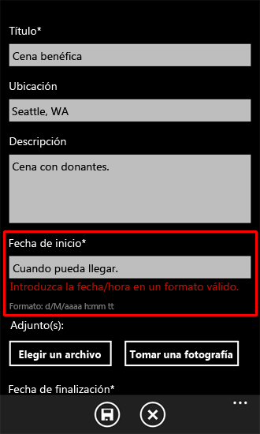
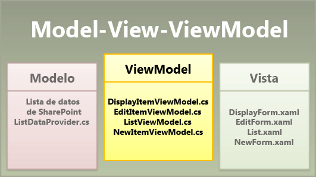
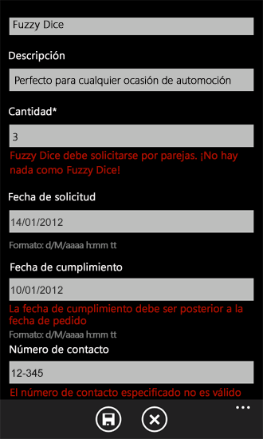

# Cómo: Implementar lógica de negocios y validación de datos en una aplicación de Windows Phone para SharePoint 2013
Implemente la validación de datos en una aplicación de Windows Phone creada con la plantilla Aplicación de lista de SharePoint para Windows Phone.
En una aplicación de Windows Phone prevista para su uso en producción, es probable que necesite validar los datos especificados por los usuarios para, por ejemplo, aplicar la lógica de negocios relevante para sus circunstancias particulares, o para asegurarse de que el formato de los valores especificados es el adecuado, o simplemente para detectar errores antes de guardar los valores en una lista de SharePoint. Los proyectos basados en la plantilla Aplicación de lista de SharePoint para Windows Phone incluyen una lógica predeterminada de validación de datos, pero dichos proyectos también ofrecen un mecanismo para que los desarrolladores puedan implementar una validación de datos personalizada.
  
    
    


> **IMPORTANTE**
> Si está desarrollando una aplicación para Windows Phone 8, debe usar Visual Studio Express 2012 en lugar de Visual Studio 2010 Express. Excepto para el entorno de desarrollo, toda la información de este artículo se aplica a la creación de aplicaciones para ambos Windows Phone 8 y Windows Phone 7. > Para obtener más información, consulte  [Cómo: Configurar un entorno de desarrollo de aplicaciones móviles para SharePoint](how-to-set-up-an-environment-for-developing-mobile-apps-for-sharepoint.md). 
  
    
    


## Reglas predeterminadas de validación de datos
<a name="BKMK_DefaultValidation"> </a>

Algunos tipos de datos para campos de las listas de SharePoint se asocian de forma predeterminada con la validación de datos o un formato simple. Si escribe una dirección URL no válida para un campo basado en el tipo de campo hipervínculo o imagen en una lista de SharePoint e intenta guardar los cambios, aparecerá un mensaje que indica que la dirección que escribió no es válida. Si escribe un nombre de cliente como un valor para un campo basado en un tipo de campo de fecha y hora, recibirá un mensaje solicitándole que especifique una fecha dentro de un intervalo válido para el campo.
  
    
    

> **NOTA**
> La validación de entrada de fechas se realiza con respecto al formato de fecha de SharePoint. Si se requiere el formato de fecha de la configuración regional del teléfono, personalice el campo y agregue las validaciones correspondientes. 
  
    
    

Algunas de estas reglas básicas de validación también se aplican de forma predeterminada en una aplicación de Windows Phone creada a partir de la plantilla Aplicación de lista de SharePoint para Windows Phone. Si escribe cualquier cosa que no sea un valor de fecha en un campo que está enlazado a un campo de SharePoint de tipo fecha y hora en el formulario de edición de una aplicación de Windows Phone basada en una lista de SharePoint, aparecerá un mensaje de error de validación cuando el foco se desplace desde el control **TextBox** asociado al campo. (Vea la figura 1).
  
    
    

**Figura 1. Indicación de error de validación en una aplicación de Windows Phone**

  
    
    

  
    
    

  
    
    
El cuadro de texto con la etiqueta "Start Time" del formulario de edición está enlazado a un campo de fecha y hora en la lista de SharePoint en la que se basa esta aplicación de ejemplo. La indicación de error de validación (en rojo) que se muestra en la figura 1 aparece si se escribe una fecha no válida en el cuadro de texto (y posteriormente el cuadro de texto pierde el foco) porque la propiedad **ValidatesOnNotifyDataErrors** del objeto **Binding**, asociado con la propiedad **Text** del control **TextBox**, está establecida en **True** en la declaración de XAML que define **TextBox** en el archivo EditForm.xaml.
  
    
    


```XML

<StackPanel Orientation="Vertical" Margin="0,5,0,5">
   <TextBlock TextWrapping="Wrap" HorizontalAlignment="Left" 
                    Style="{StaticResource PhoneTextNormalStyle}">Start Time*
   </TextBlock>
   <TextBox Height="Auto" Style="{StaticResource TextValidationTemplate}"
    FontSize="{StaticResource PhoneFontSizeNormal}" Width="470" 
        HorizontalAlignment="Left" Name="txtEventDate"
    Text="{Binding [EventDate], Mode=TwoWay, ValidatesOnNotifyDataErrors=True,
                       NotifyOnValidationError=True}"
    TextWrapping="Wrap" />
   <TextBlock FontSize="16" TextWrapping="Wrap" HorizontalAlignment="Left"
    Style="{StaticResource PhoneTextSubtleStyle}" Text="{Binding DateTimeFormat}" />
</StackPanel>
```

(Si la propiedad **ValidatesOnNotifyDataErrors** se establece en **False**, el usuario no recibe ninguna indicación de que los datos especificados no son válidos hasta que se elige el botón **Guardar**. En ese momento, el usuario verá aparecer un mensaje de error sobre errores de validación, porque la validación de formato en los valores de fecha especificados aún se lleva a cabo por la clase base de la que se deriva la clase **EditItemViewModel**).
  
    
    
Pero es posible que algunos campos no proporcionen ninguna notificación de datos no válidos en la aplicación de Windows Phone. Y las plantillas de proyectos de Visual Studio bien diseñadas están necesariamente generalizadas para que se puedan utilizar como punto de partida para muchas aplicaciones diferentes. La plantilla Aplicación de lista de SharePoint para Windows Phone no puede incluir reglas de validación pertinentes para contextos específicos y, a la vez, conservar su valor como plantilla generalizada. Según las necesidades y circunstancias en las que se utilizará su aplicación particular de Windows Phone, es probable que desee implementar sus propias reglas personalizadas de validación de datos.
  
    
    

## Implementación de reglas personalizadas de validación de datos
<a name="BKMK_CustomValidation"> </a>

Puede validar los datos especificados por los usuarios de la aplicación de Windows Phone de varias maneras. Un proyecto creado con la plantilla Aplicación de lista de SharePoint para Windows Phone incluye clases que actúan como intermediarios entre los formularios (es decir, las vistas) de los datos de la aplicación de Windows Phone (por ejemplo, el archivo EditForm.xaml) y los propios datos de la lista de SharePoint en la que se basa la aplicación. Estas clases se pueden considerar implementaciones del componente ViewModel del  [patrón de diseño de vista de modelo](http://blogs.msdn.com/b/johngossman/archive/2005/10/08/478683.aspx) (figura 2). (Para obtener más información acerca de cómo se ajusta la plantilla Aplicación de lista de SharePoint para Windows Phone al patrón de diseño de software MVVM, consulte [Arquitectura de la plantilla de aplicaciones de listas de SharePoint en Windows Phone](architecture-of-the-windows-phone-sharepoint-list-application-template.md)).
  
    
    

> **NOTA**
> Las plantillas de lista de SharePoint no incluyen validaciones predeterminadas (por ejemplo, el porcentaje completado en una lista de tareas de SharePoint, la verificación de publicación para una lista Discusión de grupo y la validación de tipo de campo decimal de SP), pero se pueden implementar. 
  
    
    


**Figura 2. Archivos de plantilla en el componente ViewModel**

  
    
    

  
    
    

  
    
    
En las aplicaciones diseñadas según el patrón MVVM, la validación de datos se controla normalmente en la capa de datos (es decir, en el componente Model). En los proyectos creados con la plantilla Aplicación de lista de SharePoint para Windows Phone, un mecanismo extensible para la validación de datos se ha "subido" una capa y se ha implementado en el componente ViewModel, para facilitar a los desarrolladores la administración de la validación de datos. Por lo tanto, en los proyectos basados en la plantilla, el lugar más adecuado para el código personalizado que valida la entrada del usuario o, en otros casos, administra los datos está en estas clases ViewModel. En términos de validación de datos, la clase **EditItemViewModel** y la clase **NewItemViewModel** (las clases asociadas con los formularios que con mayor probabilidad impliquen editar y actualizar los datos de la lista) proporcionan una implementación abierta de un método de validación (llamada **Validate**) que reemplaza al método de validación básico de la clase de la que se derivan estas dos clases.
  
    
    


```cs

public override void Validate(string fieldName, object value)
   {
      base.Validate(fieldName, value);
   }
```

Este método proporciona un cómodo mecanismo que permite al desarrollador agregar lógica de validación personalizada dirigida a campos individuales. El enfoque general es comprobar el valor del argumento **fieldName** que se pasa al método **Validate** para identificar el campo que desee asociar con el código de validación personalizada. Por ejemplo, puede utilizar una instrucción **switch** en la implementación de este método para proporcionar la lógica de validación específica para distintos campos en el formulario de edición (EditForm.xaml) de la aplicación de Windows.
  
    
    
En el siguiente ejemplo de código, se supone que una instalación de SharePoint Server tiene una lista de pedidos de productos creada con la plantilla Lista personalizada. La lista se ha creado con las columnas y tipos de campo que se muestra en la tabla 1.
  
    
    

**Tabla 1. Lista de pedidos de productos**


|**Columna**|**Tipo**|**Obligatorio**|
|:-----|:-----|:-----|
|Product (es decir, Título)  <br/> |Una línea de texto (Text)  <br/> |Sí  <br/> |
|Description  <br/> |Una línea de texto (Text)  <br/> |No  <br/> |
|Quantity  <br/> |Número  <br/> |Sí  <br/> |
|Order Date  <br/> |Fecha y hora (DateTime)  <br/> |No  <br/> |
|Fulfillment Date  <br/> |Fecha y hora (DateTime)  <br/> |No  <br/> |
|Contact Number  <br/> |Una línea de texto (Text)  <br/> |No  <br/> |
   
De nuevo, para el objetivo de este ejemplo, suponga que se aplican las siguientes reglas de validación simples, basadas en la lógica de negocios empleada en la empresa ficticia Contoso, Ltd., para un determinado sistema de administración de pedidos de productos:
  
    
    

- Las fechas de entrega de los pedidos deben ser posteriores a la fecha en la que se realizó el pedido.
    
  
- Si un cliente desea realizar un pedido de un producto llamado Fuzzy Dice, los dados se deben pedir por pares. Según las reglas peculiares de Contoso, Ltd., simplemente no existe nada llamado Fuzzy Die.
    
  
- En la lista Product Orders, el tipo de campo de los números de teléfono es "Una línea de texto" (es decir, Text), que puede ser cualquier texto (hasta 255 caracteres de forma predeterminada). En este ejemplo, se aplicará una regla de validación de formato que requiera que los datos se especifiquen en uno de los formatos de número de teléfono comunes, por ejemplo, "(555) 555-5555".
    
  

### Para implementar las reglas de validación personalizadas


1. Suponiendo que ha creado una lista de SharePoint basada en la plantilla Lista personalizada que incluya las columnas y los tipos especificados en la tabla 1, cree una aplicación de Windows Phone mediante la plantilla Aplicación de lista de SharePoint para Windows Phone en Visual Studio siguiendo los pasos detallados en  [Cómo: Crear una aplicación de lista de SharePoint 2013 para Windows Phone](how-to-create-a-windows-phone-sharepoint-2013-list-app.md).
    
  
2. En el **Explorador de soluciones**, en la carpeta ViewModels del proyecto, haga doble clic en el archivo EditItemViewModel.cs (o seleccione el archivo y presione F7) para abrir el archivo para su edición.
    
  
3. Agregue las siguientes directivas **using** a la lista de directivas en la parte superior del archivo.
    
  ```cs
  
using System.Globalization;
using System.Text.RegularExpressions;
  ```

4. Reemplace la implementación predeterminada del método **Validate** del archivo con el siguiente código.
    
  ```cs
  
public override void Validate(string fieldName, object value)
{
    string fieldValue = value.ToString();
    if (!string.IsNullOrEmpty(fieldValue)) //Allowing for blank fields.
    {
        bool isProperValue = false;

        switch (fieldName)
        {
            case "Quantity":
                // Enforce ordering Fuzzy Dice in pairs only.
                int quantityOrdered;
                isProperValue = Int32.TryParse(fieldValue, out quantityOrdered);
                if (isProperValue)
                {
                    if ((quantityOrdered % 2) != 0) // Odd number of product items ordered.
                    {
                        if ((string)this["Title"] == "Fuzzy Dice")
                        {
                            AddError("Item[Quantity]", "Fuzzy Dice must be ordered in pairs. 
                                                                   No such thing as a Fuzzy Die!");
                        }
                        else
                        {
                            // Restriction on ordering in pairs doesn't apply to other products.
                            RemoveAllErrors("Item[Quantity]");
                        }
                    }
                    else
                    {
                        RemoveAllErrors("Item[Quantity]");
                    }
                }
                break;
            case "Fulfillment_x0020_Date":
                // Determine whether fulfillment date is later than order date.
                DateTime fulfillmentDate;
                isProperValue = DateTime.TryParse(fieldValue, CultureInfo.CurrentCulture, 
                              DateTimeStyles.AssumeLocal, out fulfillmentDate);
                if (isProperValue)
                {
                    DateTime orderDate;
                    isProperValue = DateTime.TryParse((string)this["Order_x0020_Date"], 
                               CultureInfo.CurrentCulture, DateTimeStyles.AssumeLocal, out orderDate);

                    if (fulfillmentDate.CompareTo(orderDate) > 0)
                    {
                        RemoveAllErrors("Item[Fulfillment_x0020_Date]");
                    }
                    else
                    {
                        AddError("Item[Fulfillment_x0020_Date]", 
                                "Fulfillment Date must be later than Order Date.");
                    }
                }
                break;
            case "Contact_x0020_Number":
                // Check that contact number is in an appropriate format.
                Regex rx = new Regex(@"^\\(?([0-9]{3})\\)?[-. ]?([0-9]{3})[-. ]?([0-9]{4})$");
                if (rx.IsMatch(fieldValue))
                {
                    RemoveAllErrors("Item[Contact_x0020_Number]");
                }
                else
                {
                    //Specified Contact Number is not a valid phone number.
                    AddError("Item[Contact_x0020_Number]", "Specified Contact Number is invalid.");
                }
                break;
            default:
                // Not adding custom validation for other fields.
                break;
        }
    }

    //And then proceed with default validation from base class.
    base.Validate(fieldName, value);
}
  ```


    Tenga en cuenta que los nombres de campo especificados en este ejemplo de código se basan en las propiedades de la lista de ejemplo Product Orders especificada en la tabla 1. (Observe que en el esquema XML de los campos de la lista en SharePoint Server, los espacios en los nombres de los campos han sido sustituidos por la cadena "_x0020_" para el atributo **Name** del elemento **Field** que define un campo determinado. La plantilla utiliza el atributo **Name** para un elemento **Field** tal y como se define en el esquema XML en el servidor, no el atributo **DisplayName**). Puede identificar los nombres de campo de aquellos campos para los que desea implementar la lógica de validación observando las declaraciones **Binding** de las propiedades **Text** de los objetos **TextBox** definidos en EditForm.xaml o examinando la cadena **ViewFields** de la clase **CamlQueryBuilder** en el archivo ListProvider.cs.
    
  
5. Guarde el archivo.
    
  
El código de validación personalizada de este ejemplo se ejecuta solo si el argumento **value** pasado al método **Validate** no es una cadena nula o vacía. Como se indica en la tabla 1, no es necesario que los campos Fulfillment Date y Contact Number contengan datos (ya que la lista está definida para el propósito de este ejemplo en SharePoint Server), por lo que queremos permitir que estos campos estén en blanco. Una comprobación simple para determinar si el argumento **value** es null no es suficiente, ya que el valor pasado podría ser una cadena de longitud cero (que no equivale a un valor nulo), y para este ejemplo no queremos invalidar las cadenas de longitud cero para los campos que pueden estar en blanco. La lógica de validación para los campos Fulfillment Date y Quantity incluye comprobaciones adicionales de los valores que se pasan para asegurarse de que son del tipo apropiado. Si la comprobación inicial aquí (antes de la instrucción **switch**) solo confirmó que el valor pasado no era null (en lugar de comprobar la condición más limitada de ser una cadena de longitud cero), dichas validaciones aún no se ejecutarían si el valor fuera una cadena de longitud cero, pero la lógica para validar los datos del campo **Contact Number** *aún se ejecutaría*  si el valor pasado fuera una cadena de longitud cero. Y, en este ejemplo, queremos permitir que el campo Contact Number esté en blanco (una cadena de longitud cero), especialmente cuando un usuario comienza a editar un elemento de lista abriendo el formulario de edición.
  
    
    
Si compila el proyecto y lo implementa en el emulador de Windows Phone para ejecutarlo, puede probar su lógica de validación introduciendo datos que infrinjan las reglas de negocio en los campos de la lista en el formulario de edición de la aplicación. (Vea la figura 3).
  
    
    

**Figura 3. Indicaciones de error de validación personalizada**

  
    
    

  
    
    

  
    
    
El código en este ejemplo, si solo se incluye en el archivo EditItemViewModel.cs, aplica estas reglas de validación a los datos especificados por los usuarios únicamente en el formulario de edición. Si desea aplicar las reglas de validación tanto cuando los usuarios  *agregan*  nuevos elementos como al editarlos, debe incluir la misma lógica de validación en el método **Validate** en el archivo NewItemViewModel.cs (o, preferiblemente, cree un archivo de clase independiente con una función que contenga esta lógica de validación y llame a dicha función desde los métodos **Validate** en los archivos EditItemViewModel.cs y NewItemViewModel.cs).
  
    
    
La lógica de validación en este ejemplo aplica determinadas reglas del negocio indicando al usuario que los datos especificados no están en un formato permitido por las reglas, pero los datos especificados no se interceptan ni se modifican en este código. Para interceptar y, por ejemplo, dar formato a los números de teléfono de una forma coherente antes de guardar los datos en la lista de SharePoint, puede implementar la conversión de datos personalizada para los números de teléfono especificados. Para obtener una explicación de la conversión de datos personalizada para los campos de elemento de lista, consulte  [Cómo hacer compatibles y convertir los tipos de archivos de SharePoint 2013 para las aplicaciones de Windows Phone](how-to-support-and-convert-sharepoint-2013-field-types-for-windows-phone-apps.md).
  
    
    

## Recursos adicionales
<a name="SP15Implementbuslogic_addlresources"> </a>


-  [Creación de aplicaciones de Windows Phone con acceso a SharePoint 2013](build-windows-phone-apps-that-access-sharepoint-2013.md)
    
  
-  [Enlace de datos de Silverlight](http://msdn.microsoft.com/es-es/library/cc278072.aspx)
    
  
-  [Cómo: Configurar un entorno de desarrollo de aplicaciones móviles para SharePoint](how-to-set-up-an-environment-for-developing-mobile-apps-for-sharepoint.md)
    
  
-  [Windows Phone SDK 8.0](http://www.microsoft.com/es-es/download/details.aspx?id=35471)
    
  
-  [Microsoft SharePoint SDK para Windows Phone 8](http://www.microsoft.com/es-es/download/details.aspx?id=36818)
    
  
-  [Windows Phone SDK 7.1](http://www.microsoft.com/es-es/download/details.aspx?id=27570)
    
  
-  [Microsoft SharePoint SDK para Windows Phone 7.1](http://www.microsoft.com/es-es/download/details.aspx?id=30476)
    
  

