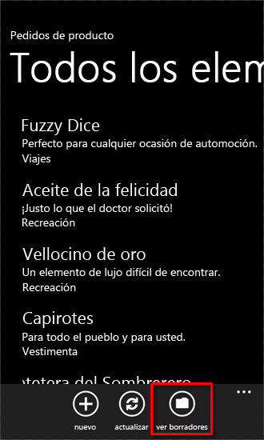
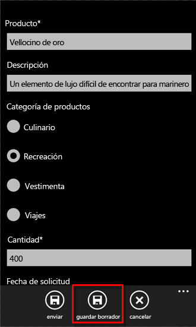
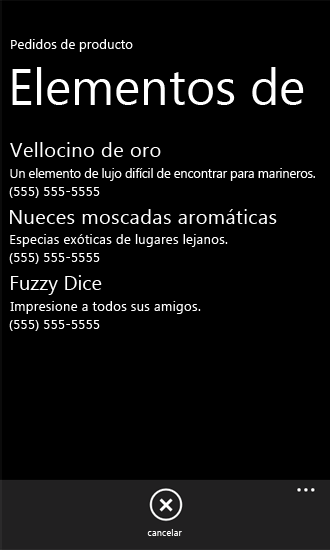
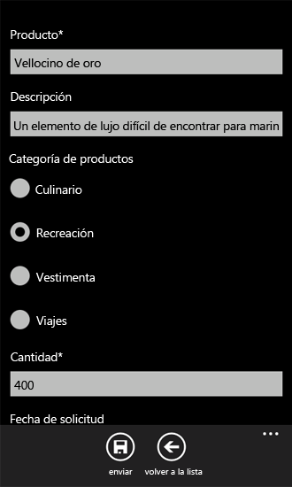

# Cómo: Almacenar y recuperar elementos de lista de SharePoint en un Windows Phone
Infórmese sobre el ciclo de vida de las aplicaciones de Windows Phone y el almacenamiento local de los datos de red.
Una de las cuestiones más importantes en el desarrollo de aplicaciones de Windows Phone es la administración de la información de estado en la aplicación global y en los elementos de datos o páginas individuales dentro de la aplicación. Si está desarrollando aplicaciones de Windows Phone, debe tener en cuenta que los usuarios de las aplicaciones pueden perder la conectividad a los recursos de red (como las listas de SharePoint). La infraestructura de desarrollo de las aplicaciones de Windows Phone proporciona mecanismos para controlar la información de estado en las distintas fases del ciclo de vida de una aplicación.
  
    
    


> **IMPORTANTE**
> Si está desarrollando una aplicación para Windows Phone 8, debe usar Visual Studio Express 2012 en lugar de Visual Studio 2010 Express. Excepto el entorno de desarrollo, toda la información de este artículo se aplica a la creación de aplicaciones para Windows Phone 8 y Windows Phone 7. > Para obtener más información, consulte  [Cómo: Configurar un entorno de desarrollo de aplicaciones móviles para SharePoint](how-to-set-up-an-environment-for-developing-mobile-apps-for-sharepoint.md). 
  
    
    


## Almacenar localmente datos de lista de SharePoint en Windows Phone
<a name="BKMK_StoringDataLocally"> </a>

En Windows Phone, no se ejecuta más de una aplicación a la vez y cuando un usuario cambia a otra aplicación en el teléfono (presionando el botón **Inicio** en el teléfono, por ejemplo), se desactiva la aplicación que se esté ejecutando en ese momento o, en la terminología de desarrollo de Windows Phone,se marca como excluida. Si el usuario vuelve a la aplicación desactivada (presionando el botón **Atrás**), la aplicación se puede reactivar pero, si no proporciona una lógica para gestionar la información de estado de la aplicación a lo largo del ciclo de vida de la aplicación, la información de estado no se conserva de forma predeterminada en la transición de la activación a la desactivación y viceversa. (Para obtener más información sobre el ciclo de vida de las aplicaciones de Windows Phone, consulte  [Introducción al modelo de ejecución para Windows Phone](http://msdn.microsoft.com/es-es/library/ff817008%28v=VS.92%29.aspx).)
  
    
    
Para las aplicaciones de Windows Phone, la clase **PhoneApplicationService** expone los eventos de ciclo de vida estándar que se pueden usar para administrar el estado de la aplicación. En los proyectos creados a partir de la plantilla Aplicación de lista de SharePoint de Windows Phone (al igual que en los proyectos creados a partir de todas las plantillas **Silverlight para Windows Phone**), estos eventos estándar de ciclo de vida de aplicación de Windows Phone se declaran en el archivo App.xaml y se asocian con los controladores de eventos en el archivo de código subyacente, App.xaml.cs. Las declaraciones del archivo App.xaml correspondientes a las aplicaciones de la lista de SharePoint deben parecerse al siguiente marcado.
  
    
    


```

<Application.ApplicationLifetimeObjects>
    <!--Required object that handles lifetime events for the application-->
    <shell:PhoneApplicationService 
        Launching="Application_Launching" Closing="Application_Closing"Activated="Application_Activated" Deactivated="Application_Deactivated"/>
</Application.ApplicationLifetimeObjects>
```

Los controladores de eventos **Application_Activated** y **Application_Deactivated** declarados en el archivo App.xaml se implementan en el archivo de código subyacente App.xaml.cs con una lógica predeterminada que almacena en caché la información de estado de la aplicación para usarla en la aplicación del teléfono mientras no se cierre la aplicación. La implementación de los controladores de estos eventos usa la propiedad **State** (que proporciona acceso a un objeto **Dictionary**) de la clase **PhoneApplicationService** para almacenar datos. Los datos almacenados en esta propiedad **State** son transitorios. Es decir, se conservarán cuando la aplicación esté desactivada o se excluya, pero no después de cerrarse. Al controlar los eventos de ciclo de vida de la aplicación en los proyectos, es importante tener en cuenta que, si una aplicación de Windows se desactiva cuando un usuario cambia a otra aplicación, el sistema operativo de Windows Phone podría cerrarla (dependiendo de las circunstancias). Los datos presentes en el teléfono que no se guardaran en el almacenamiento persistente se perderían aunque se hubieran guardado en el almacenamiento transitorio usando la propiedad **State** de **PhoneApplicationService**.
  
    
    
En una aplicación de Windows Phone que obtiene datos de una lista de SharePoint, los datos usados en el teléfono de una sesión a otra se pueden recuperar desde el servidor que ejecuta SharePoint Server (si está disponible). Sin embargo, es posible que la conectividad continua a un SharePoint Server no esté disponible para un dispositivo de Windows Phone debido a las variaciones en la cobertura del servicio según la ubicación y otros factores. Si quiere proporcionar a los usuarios de la aplicación acceso a los datos en caso de pérdida de la conectividad con el servidor que ejecuta SharePoint Server o si lo único que quiere es guardar datos en un almacenamiento persistente entre sesiones de la aplicación, independientemente de la disponibilidad del servidor, puede aprovechar los eventos **Closing** y **Launching** de la clase **PhoneApplicationService**.
  
    
    
Los controladores **Application_Launching** y **Application_Closing** de estos eventos se declaran en App.xaml y se definen en el archivo App.xaml.cs, pero no se implementan. Para gestionar el almacenamiento y la recuperación de la información de estado de las aplicaciones en el contexto del cierre de aplicaciones, puede proporcionar una implementación para que el controlador de eventos **Application_Closing** almacene datos en el almacenamiento aislado designado para la aplicación de modo que los datos se conserven entre las sesiones de la aplicación y luego puede proporcionar una implementación para que el controlador de eventos **Application_Launching** recupere los datos del almacenamiento aislado cuando se inicie una nueva sesión de la aplicación aunque la conectividad al servidor que ejecuta SharePoint Server, que es el origen de datos original, no esté disponible.
  
    
    

> **SUGERENCIA**
> Los datos deben cifrarse antes de guardarse en un dispositivo local. Para obtener más información sobre cómo cifrar los datos, consulte  [Cómo: Cifrar datos en una aplicación de Windows Phone](http://msdn.microsoft.com/es-es/library/hh487164%28v=vs.92%29.aspx). 
  
    
    


### Para implementar controladores de eventos para almacenar y recuperar el estado de una aplicación


1. Cree una aplicación de Windows Phone mediante la plantilla Aplicación de lista de SharePoint de Windows Phone en Visual Studio siguiendo los pasos descritos en  [Cómo: Crear una aplicación de lista de SharePoint 2013 para Windows Phone](how-to-create-a-windows-phone-sharepoint-2013-list-app.md).
    
  
2. En el **Explorador de soluciones**, elija el archivo App.xaml.
    
  
3. Presione F7 para abrir el archivo de código subyacente, App.xaml.cs, y editarlo.
    
  
4. Busque la implementación (vacía) del controlador de eventos **Application_Launching** y reemplace el controlador por el código siguiente.
    
  ```cs
  
private void Application_Launching(object sender, LaunchingEventArgs e)
{
    if (IsolatedStorageSettings.ApplicationSettings.Contains(DataProvider.ListTitle))
    {
        App.MainViewModel = (ListViewModel)IsolatedStorageSettings.ApplicationSettings
                                              [DataProvider.ListTitle];                
        App.MainViewModel.Initialize();
    }
}
  ```

5. Busque la implementación (vacía) del controlador de eventos **Application_Closing** y reemplace este controlador por el código siguiente.
    
  ```cs
  
private void Application_Closing(object sender, ClosingEventArgs e)
{
    if (IsolatedStorageSettings.ApplicationSettings.Contains(DataProvider.ListTitle))
    {
        IsolatedStorageSettings.ApplicationSettings[DataProvider.ListTitle] = App.MainViewModel;
    }
    else
    {
        IsolatedStorageSettings.ApplicationSettings.Add(DataProvider.ListTitle, App.MainViewModel);
    }
    IsolatedStorageSettings.ApplicationSettings.Save();
}
  ```

6. Guarde el archivo.
    
  
Con estas implementaciones definidas, ejecute la aplicación para inicializar el ViewModel principal en la aplicación con los datos del servidor que ejecuta SharePoint Server. Salga de la aplicación en el teléfono (presionando el botón **Atrás** para pasar de la primera página de la aplicación) para desencadenar el evento **Application_Closing**. Si luego ejecuta la aplicación sin conectividad al servidor, el ViewModel que se guardó en el objeto **IsolatedStorageSettings** **Dictionary** (en el evento **Application_Closing**) se recupera y se inicializa. Los elementos de la lista de SharePoint que se guardaron en el almacenamiento aislado en una sesión anterior de la aplicación se muestran en el formulario Lista (List.xaml) de la aplicación.
  
    
    

## Implementar un mecanismo para editar los elementos de lista sin conexión
<a name="BKMK_ImplementingOfflineEditing"> </a>

Si sigue el método descrito en la sección anterior para implementar controladores para los eventos **Closing** y **Launching** en la aplicación, los datos de la lista de SharePoint que se recuperaron del servidor cuando estaba disponible la conectividad se pueden mostrar en la aplicación aunque se pierda la conectividad con el servidor en una sesión posterior de la aplicación, ya que los elementos de la lista se recuperan del almacenamiento persistente local existente en el teléfono. Sin embargo, basándonos en la implementación de la sección anterior, los elementos de lista que están disponibles para mostrarse en el modo sin conexión de esta forma no se puede editar ni volver a guardar en el servidor a menos que se restaure la conectividad. En el siguiente proceso, agregaremos un mecanismo a la aplicación para que esta permita almacenar localmente versiones editadas de los elementos de lista cuando la conectividad no esté disponible. Cuando la conectividad con el servidor esté disponible de nuevo, podrá recuperar estos elementos de lista modificados y guardar los cambios en el servidor.
  
    
    
En los procedimientos de esta sección, se supone que está trabajando en el contexto de un proyecto de aplicación de Windows Phone creado a partir de la plantilla Aplicación de lista de SharePoint de Windows Phone y que la aplicación se basa en una lista Pedidos de productos creada a partir de la plantilla Lista personalizada en el servidor y contiene las columnas y los tipos de campo que se muestra en la tabla 1.
  
    
    

**Tabla 1. Lista de de ejemplo Pedidos de productos**


|**Columna**|**Tipo**|**Obligatoria**|
|:-----|:-----|:-----|
|Producto (por ejemplo, Título)  <br/> |Una línea de texto (Text)  <br/> |Sí  <br/> |
|Descripción  <br/> |Una línea de texto (Text)  <br/> |No  <br/> |
|Cantidad  <br/> |Número  <br/> |Sí  <br/> |
|Fecha del pedido  <br/> |Fecha y hora (DateTime)  <br/> |No  <br/> |
|Fecha de suministro  <br/> |Fecha y hora (DateTime)  <br/> |No  <br/> |
|Número de contacto  <br/> |Una línea de texto (Text)  <br/> |No  <br/> |
   

### Para implementar una clase que permita la edición de elementos en el modo sin conexión


1. Partiendo de un proyecto de Visual Studio que se creó basándose en la lista Pedidos de productos representada en la tabla 1, en el **Explorador de soluciones** elija el nodo que represente el proyecto (por ejemplo,SPListAppLocalStorage).
    
  
2. En el menú **Proyecto**, elija **Agregar clase**. 
    
    Aparece el cuadro de diálogo **Agregar nuevo elemento** con la plantilla **Clase** de C# seleccionada.
    
  
3. Asigne el nombre DraftItemStore.cs al archivo de clase y luego elija **Agregar**.
    
    El archivo de clase se agrega al proyecto y se abre para que lo editemos.
    
  
4. Reemplace el contenido del archivo de clase por el código siguiente.
    
  ```cs
  
using System;
using System.Net;
using System.Windows;
using System.Collections.Generic;
using System.IO.IsolatedStorage;

namespace SPListAppLocalStorage // Based on project name by default.
{
    public class DraftItemStore
    {
        const string DraftsKey = "Drafts";

        public static void AddDraftItem(string id, EditItemViewModel model)
        {
            Dictionary<string, EditItemViewModel> draftCollection = GetDraftItemCollection();
            draftCollection[id] = model;
            SaveDrafts(draftCollection);
        }

        public static void RemoveDraftItem(string id)
        {
            Dictionary<string, EditItemViewModel> draftCollection = GetDraftItemCollection();
            draftCollection.Remove(id);
            SaveDrafts(draftCollection);
        }

        public static void SaveDrafts(Dictionary<string, EditItemViewModel> draft)
        {
            if (IsolatedStorageSettings.ApplicationSettings.Contains(DraftsKey))
            {
                IsolatedStorageSettings.ApplicationSettings[DraftsKey] = draft;
            }
            else
            {
                IsolatedStorageSettings.ApplicationSettings.Add(DraftsKey, draft);
            }
        }

        public static List<EditItemViewModel> Drafts
        {
            get
            {
                Dictionary<string, EditItemViewModel> draftCollection = GetDraftItemCollection();

                List<EditItemViewModel> modelCollection = new List<EditItemViewModel>();
                foreach (KeyValuePair<string, EditItemViewModel> entry in draftCollection)
                {
                    modelCollection.Add(entry.Value);
                }

                return modelCollection;
            }
        }

        public static Dictionary<string, EditItemViewModel> GetDraftItemCollection()
        {
            Dictionary<string, EditItemViewModel> draftCollection = null;
            if (IsolatedStorageSettings.ApplicationSettings.Contains(DraftsKey))
                draftCollection = (Dictionary<string,
                EditItemViewModel>)IsolatedStorageSettings.ApplicationSettings[DraftsKey];

            if (draftCollection == null)
                draftCollection = new Dictionary<string, EditItemViewModel>();

            return draftCollection;
        }

        public static EditItemViewModel GetDraftItemById(string id)
        {
            Dictionary<string, EditItemViewModel> draftCollection = GetDraftItemCollection();
            return !draftCollection.ContainsKey(id) ? null : draftCollection[id];
        }
    }
}
  ```


    El espacio de nombres especificado en este código se basa en el nombre del proyecto (SPListAppLocalStorage en este caso). Si quiere, puede especificar un espacio de nombres diferente basado en el nombre del proyecto.
    
  
5. Guarde el archivo.
    
  
Una instancia específica de la clase **EditItemViewModel** representa un elemento de lista de SharePoint que se está editando en el teléfono. Un elemento de lista que se editó se puede considerar un "elemento de borrador" antes de que se guarden en el servidor los cambios realizado en el elemento. En el código de esta clase, el método **AddDraftItem** agrega una instancia determinada de la clase **EditItemViewModel** (es decir, un elemento de borrador) como valor a un objeto **Dictionary**, con lo que el **EditItemViewModel** existente en **Dictionary** se asocia con una clave basándose en el identificador del elemento de lista en cuestión. (SharePoint Server asigna un identificador a cada uno de los elementos de una lista. En un proyecto basado en la plantilla Aplicación de lista de SharePoint de Windows Phone, este identificador se almacena en la propiedad **ID** de la clase dada **ViewModel**, como **EditItemViewModel** o **DisplayItemViewModel**, que representa el elemento de lista). El método **RemoveDraftItem** elimina un **EditItemViewModel** del objeto **Dictionary** basándose en un identificador especificado. Ambos métodos usan el método **GetDraftItemCollection** para recuperar el objeto **Dictionary** que contiene los objetos **EditItemViewModel** del almacenamiento aislado y el método **SaveDrafts** para volver a guardar el objeto **Dictionary** modificado (con un elemento de borrador agregado o eliminado del mismo) en el almacenamiento aislado. Primero, el método **GetDraftItemCollection** determina si un objeto **Dictionary** de "Borradores" se guardó en el almacenamiento aislado. En caso afirmativo, el método devuelve ese objeto **Dictionary**. De lo contrario, el método inicializa y devuelve un nuevo objeto **Dictionary**. La propiedad **Drafts** de la clase ofrece acceso al **Dictionary** de los borradores de elemento devolviendo una lista (es decir, un objeto basado en la **List<T>** genérica) de borradores de elementos como objetos **EditItemViewModel**. El método **GetDraftItemById** devuelve un elemento de borrador dado desde el objeto **Dictionary** basándose en un valor de identificador especificado.
  
    
    
Ahora puede agregar elementos a la interfaz de usuario de la aplicación de teléfono y configurarlos para que usen la clase **DraftItemStore** a fin de editar los elementos de lista sin conexión. A continuación, le enseñaremos a:
  
    
    

- Agregar y configurar una página de Windows Phone para mostrar todos los elementos de lista que se guardaron como elementos de borrador en el almacenamiento aislado dentro del teléfono.
    
  
- Agregar y configurar otra página, enlazada a un **EditItemViewModel**, para editar un elemento de borrador individual análogo al formulario de edición (EditForm.xaml) para los elementos de lista.
    
  
- Agregue un método, **SaveAsDraft**, a la clase **EditItemViewModel** que ejecuta el método **AddDraftItem** de la clase **DraftItemStore** implementada en el procedimiento anterior.
    
  
- Agregar un botón **ApplicationBar** al archivo EditForm.xaml para llamar al método **SaveAsDraft**.
    
  
- Agregar un botón **ApplicationBar** al archivo List.xaml para desplazarse a la página que muestra todos los elementos de lista guardados como borradores.
    
  

### Para agregar una página para mostrar todos los elementos de borrador guardados en el teléfono


1. En el **Explorador de soluciones**, elija la carpeta **Vistas**.
    
  
2. En el menú **Proyecto**, elija **Agregar nuevo elemento**. 
    
    Se abre el cuadro de diálogo **Agregar nuevo elemento**.
    
  
3. En el cuadro de diálogo **Agregar nuevo elemento**, en el nodo **Visual C#**, elija el nodo **Silverlight para Windows Phone**.
    
  
4. En el panel **Plantillas**, elija la plantilla **Página vertical de Phone Landscape**.
    
  
5. Asigne el nombre Drafts.xaml al archivo y luego elija **Agregar**. 
    
    El archivo se agrega al proyecto en el nodo **Vistas** y se abre para que lo editemos.
    
  
6. En el panel XAML del diseñador, reemplace el contenido del archivo por el siguiente XAML.
    
  ```
  
<phone:PhoneApplicationPage
    x:Class="SPListAppLocalStorage.Views.Drafts"
    xmlns="http://schemas.microsoft.com/winfx/2006/xaml/presentation"
    xmlns:x="http://schemas.microsoft.com/winfx/2006/xaml"
    xmlns:phone="clr-namespace:Microsoft.Phone.Controls;assembly=Microsoft.Phone"
    xmlns:shell="clr-namespace:Microsoft.Phone.Shell;assembly=Microsoft.Phone"
    xmlns:d="http://schemas.microsoft.com/expression/blend/2008"
    xmlns:mc="http://schemas.openxmlformats.org/markup-compatibility/2006"
    FontFamily="{StaticResource PhoneFontFamilyNormal}"
    FontSize="{StaticResource PhoneFontSizeNormal}"
    Foreground="{StaticResource PhoneForegroundBrush}"
    SupportedOrientations="Portrait" Orientation="Portrait"
    mc:Ignorable="d" d:DesignHeight="696" d:DesignWidth="480"
    shell:SystemTray.IsVisible="True">

    <!--LayoutRoot is the root grid where all page content is placed-->
    <Grid x:Name="LayoutRoot" Background="Transparent">
        <Grid.RowDefinitions>
            <RowDefinition Height="Auto"/>
            <RowDefinition Height="*"/>
        </Grid.RowDefinitions>

        <!--TitlePanel contains the name of the application and page title-->
        <StackPanel x:Name="TitlePanel" Grid.Row="0" Margin="12,17,0,28">
            <TextBlock x:Name="ApplicationTitle" Text="Product Orders" 
                                    Style="{StaticResource PhoneTextNormalStyle}"/>
            <TextBlock x:Name="PageTitle" Text="Draft Items" Margin="9,-7,0,0" 
                                      Style="{StaticResource PhoneTextTitle1Style}"/>
        </StackPanel>

        <!--ContentPanel - place additional content here-->
        <Grid x:Name="ContentPanel" Grid.Row="1" Margin="12,0,12,0">
            <ListBox x:Name="lstBoxDraftItems" ItemsSource="{Binding}"
                                  SelectionChanged="lstBoxDraftItems_SelectionChanged">
                <ListBox.ItemTemplate>
                    <DataTemplate>
                        <StackPanel>
                            <TextBlock Text="{Binding [Title]}" Style="
                                           {StaticResource PhoneTextTitle2Style}"></TextBlock>
                            <TextBlock Text="{Binding [Description]}" Style="
                                            {StaticResource PhoneTextNormalStyle}"></TextBlock>
                            <TextBlock Text="{Binding [Contact_x0020_Number]}" Style="
                                           {StaticResource PhoneTextNormalStyle}"></TextBlock>
                        </StackPanel>
                    </DataTemplate>
                </ListBox.ItemTemplate>
            </ListBox>
        </Grid>
    </Grid>
 
    <phone:PhoneApplicationPage.ApplicationBar>
        <shell:ApplicationBar IsVisible="True" IsMenuEnabled="True">
            <shell:ApplicationBarIconButton x:Name="btnCancel" 
             IconUri="/Images/appbar.cancel.rest.png" Text="Cancel" Click="OnCancelButtonClick" />
        </shell:ApplicationBar>
    </phone:PhoneApplicationPage.ApplicationBar>

</phone:PhoneApplicationPage>
  ```


    El valor de la designación del espacio de nombres  `<x:Class>` en este código ("SPListAppLocalStorage.Views.Drafts") puede variar según el nombre del proyecto.
    
  
7. Con el archivo Drafts.xaml seleccionado en el **Explorador de soluciones**, presione F7 para abrir el archivo de código subyacente asociado, Drafts.xaml.cs, para su edición.
    
  
8. Reemplace el contenido del archivo por el código siguiente.
    
  ```cs
  
using System;
using System.Collections.Generic;
using System.Linq;
using System.Net;
using System.Windows;
using System.Windows.Controls;
using System.Windows.Documents;
using System.Windows.Input;
using System.Windows.Media;
using System.Windows.Media.Animation;
using System.Windows.Shapes;
using Microsoft.Phone.Controls;

namespace SPListAppLocalStorage.Views
{
    public partial class Drafts : PhoneApplicationPage
    {
        public Drafts()
        {
            InitializeComponent();
            this.Loaded += new RoutedEventHandler(Drafts_Loaded);
        }

        private void lstBoxDraftItems_SelectionChanged(object sender, SelectionChangedEventArgs e)
        {
            ListBox lstBox = sender as ListBox;
            if (lstBox.SelectedIndex == -1)
                return;

            EditItemViewModel selectedDraftItem = lstBox.SelectedItem as EditItemViewModel;
            NavigationService.Navigate(new Uri(string.Format("/Views/DraftItemEditForm.xaml?ID={0}",
                                                   selectedDraftItem.ID), UriKind.Relative));

            lstBox.SelectedIndex = -1;
        }

        void Drafts_Loaded(object sender, RoutedEventArgs e)
        {
            this.DataContext = DraftItemStore.Drafts;
        }

        private void OnCancelButtonClick(object sender, EventArgs e)
        {
            // Navigate back to initial List View form.
            NavigationService.Navigate(new Uri("/Views/List.xaml", UriKind.Relative));
        }
    }
}
  ```

9. Guarde los archivos.
    
  

### Para agregar una página para editar elementos de borrador individuales


1. En el **Explorador de soluciones**, elija la carpeta **Vistas**.
    
  
2. En el menú **Proyecto**, elija **Agregar nuevo elemento**. 
    
    Se abre el cuadro de diálogo **Agregar nuevo elemento**.
    
  
3. En el cuadro de diálogo **Agregar nuevo elemento**, en el nodo **Visual C#**, elija el nodo **Silverlight para Windows Phone**.
    
  
4. En el panel **Plantillas**, elija la plantilla **Página vertical de Phone Landscape**.
    
  
5. Asigne el nombre DraftItemEditForm.xaml al archivo y luego elija **Agregar**. 
    
    El archivo se agrega al proyecto en el nodo **Vistas** y se abre para que lo editemos.
    
  
6. En el panel XAML del diseñador, reemplace el contenido del archivo por el siguiente XAML.
    
  ```
  
<phone:PhoneApplicationPage
    x:Class="SPListAppLocalStorage.DraftItemEditForm"
    xmlns="http://schemas.microsoft.com/winfx/2006/xaml/presentation"
    xmlns:x="http://schemas.microsoft.com/winfx/2006/xaml"
    xmlns:phone="clr-namespace:Microsoft.Phone.Controls;assembly=Microsoft.Phone"
    xmlns:shell="clr-namespace:Microsoft.Phone.Shell;assembly=Microsoft.Phone"
    xmlns:d="http://schemas.microsoft.com/expression/blend/2008"
    xmlns:mc="http://schemas.openxmlformats.org/markup-compatibility/2006"
    mc:Ignorable="d" d:DesignWidth="480" d:DesignHeight="696"
    FontFamily="{StaticResource PhoneFontFamilyNormal}"
    FontSize="{StaticResource PhoneFontSizeNormal}"
    Foreground="{StaticResource PhoneForegroundBrush}"
    SupportedOrientations="Portrait" Orientation="Portrait"
    shell:SystemTray.IsVisible="True" x:Name="DraftItemEditPage">

    <!--LayoutRoot is the root grid where all page content is placed-->
    <Grid x:Name="LayoutRoot" Background="Transparent"
        xmlns:x="http://schemas.microsoft.com/winfx/2006/xaml" 
             xmlns:controls="clr-namespace:Microsoft.Phone.Controls;assembly=
                Microsoft.Phone.Controls">
        <StackPanel>
            <ProgressBar Background="Red" x:Name="progressBar" Opacity="1" 
                                    HorizontalAlignment="Center" VerticalAlignment="Top" 
                                    Height="15" Width="470" IsIndeterminate="{Binding IsBusy}" 
                                    Visibility="{Binding ShowIfBusy}" />
            <ScrollViewer HorizontalScrollBarVisibility="Auto" Height="700">
                <Grid x:Name="ContentPanel" Width="470">
                    <StackPanel Margin="0,5,0,5">
                        <StackPanel Orientation="Vertical" Margin="0,5,0,5">
                            <TextBlock TextWrapping="Wrap" HorizontalAlignment="Left" 
                                Style="{StaticResource PhoneTextNormalStyle}">Product*</TextBlock>
                            <TextBox Style="{StaticResource TextValidationTemplate}" 
                         FontSize="{StaticResource   PhoneFontSizeNormal}" Width="470" 
                         HorizontalAlignment="Left" Name="txtTitle" Text="{Binding [Title], 
                                   Mode=TwoWay,ValidatesOnNotifyDataErrors=True,NotifyOnValidationError=True}" 
                                                                         TextWrapping="Wrap" />
                        </StackPanel>
                        <StackPanel Orientation="Vertical" Margin="0,5,0,5">
                            <TextBlock TextWrapping="Wrap" HorizontalAlignment="Left" 
                               Style="{StaticResource PhoneTextNormalStyle}">Description</TextBlock>
                            <TextBox Style="{StaticResource TextValidationTemplate}" 
                               FontSize="{StaticResource PhoneFontSizeNormal}" Width="470" 
                                HorizontalAlignment="Left" Name="txtDescription" 
                                                           Text="{Binding [Description],
                                                           Mode=TwoWay, ValidatesOnNotifyDataErrors=True, 
                                                           NotifyOnValidationError=True}" 
                                       TextWrapping="Wrap" />
                        </StackPanel>
                        <StackPanel Orientation="Vertical" Margin="0,5,0,5">
                            <TextBlock TextWrapping="Wrap" HorizontalAlignment="Left" 
                               Style="{StaticResource PhoneTextNormalStyle}">
                                                           Product Category</TextBlock>
                            <ListBox MaxHeight="400" Width="Auto" x:Name="lstBoxProduct_x0020_Category"
                                              ItemsSource="{Binding [Product_x0020_Category]}">
                                <ListBox.ItemTemplate>
                                    <DataTemplate>
                                        <RadioButton FontSize="{StaticResource PhoneFontSizeNormal}" 
                                          HorizontalAlignment="Left" GroupName="Product_x0020_Category" 
                                                                 Content="{Binding Name}" 
                               IsChecked="{Binding IsChecked, Mode=TwoWay}" />
                                    </DataTemplate>
                                </ListBox.ItemTemplate>
                            </ListBox>
                        </StackPanel>
                        <StackPanel Orientation="Vertical" Margin="0,5,0,5">
                            <TextBlock TextWrapping="Wrap" HorizontalAlignment="Left" 
                                       Style="{StaticResource PhoneTextNormalStyle}">Quantity*</TextBlock>
                            <TextBox Style="{StaticResource TextValidationTemplate}" 
                                   FontSize="{StaticResource PhoneFontSizeNormal}" Width="470" 
                                      HorizontalAlignment="Left" Name="txtQuantity" Text="{Binding [Quantity], 
                                        Mode=TwoWay, ValidatesOnNotifyDataErrors=True, 
                                           NotifyOnValidationError=True}"
                                             TextWrapping="Wrap" />
                        </StackPanel>
                        <StackPanel Orientation="Vertical" Margin="0,5,0,5">
                            <TextBlock TextWrapping="Wrap" HorizontalAlignment="Left" 
                                Style="{StaticResource PhoneTextNormalStyle}">Order Date</TextBlock>
                            <TextBox Height="Auto" Style="{StaticResource TextValidationTemplate}"
                                               FontSize="{StaticResource PhoneFontSizeNormal}" Width="470"  
                                                         HorizontalAlignment="Left" Name="txtOrder_x0020_Date" 
                         Text="{Binding [Order_x0020_Date], Mode=TwoWay, ValidatesOnNotifyDataErrors=True, 
                                           NotifyOnValidationError=True}" TextWrapping="Wrap" />
                            <TextBlock FontSize="16" TextWrapping="Wrap" HorizontalAlignment="Left" 
                                                 Style="{StaticResource PhoneTextSubtleStyle}" 
                                                             Text="{Binding DateTimeFormat}" />
                        </StackPanel>
                        <StackPanel Orientation="Vertical" Margin="0,5,0,5">
                            <TextBlock TextWrapping="Wrap" HorizontalAlignment="Left" 
                         Style="{StaticResource PhoneTextNormalStyle}">Fulfillment Date</TextBlock>
                            <TextBox Height="Auto" Style="{StaticResource TextValidationTemplate}"
                                          FontSize="{StaticResource PhoneFontSizeNormal}" Width="470" 
                                          HorizontalAlignment="Left" Name="txtFulfillment_x0020_Date" 
                        Text="{Binding [Fulfillment_x0020_Date], Mode=TwoWay, 
                     ValidatesOnNotifyDataErrors=True, NotifyOnValidationError=True}" 
                         TextWrapping="Wrap" />
                            <TextBlock FontSize="16" TextWrapping="Wrap" HorizontalAlignment="Left"
                                                    Style="{StaticResource PhoneTextSubtleStyle}" Text="{Binding
                                                           DateTimeFormat}" />
                        </StackPanel>
                        <StackPanel Orientation="Horizontal">
                            <TextBlock TextWrapping="Wrap" Width="150" HorizontalAlignment="Left"
                                                  Style="{StaticResource PhoneTextNormalStyle}">Rush 
                                                                   :</TextBlock>
                            <CheckBox Name="txtRush" FontSize="{StaticResource PhoneFontSizeNormal}" 
                                          HorizontalAlignment="Left" IsChecked="{Binding [Rush], Mode=TwoWay, 
                               ValidatesOnNotifyDataErrors=True, NotifyOnValidationError=True}" />
                        </StackPanel>
                        <StackPanel Orientation="Vertical" Margin="0,5,0,5">
                            <TextBlock TextWrapping="Wrap" HorizontalAlignment="Left" 
                        Style="{StaticResource PhoneTextNormalStyle}">Contact Number</TextBlock>
                            <TextBox Style="{StaticResource TextValidationTemplate}" 
                                   FontSize="{StaticResource PhoneFontSizeNormal}" Width="470"
                                              HorizontalAlignment="Left" Name="txtContact_x0020_Number"
                                                         Text="{Binding [Contact_x0020_Number], 
                                                         Mode=TwoWay, ValidatesOnNotifyDataErrors=True, 
                                                         NotifyOnValidationError=True}" 
                                                                           TextWrapping="Wrap" />
                        </StackPanel>
                    </StackPanel>
                </Grid>
            </ScrollViewer>
        </StackPanel>
    </Grid>

    <phone:PhoneApplicationPage.ApplicationBar>
        <shell:ApplicationBar IsVisible="True" IsMenuEnabled="True">
            <shell:ApplicationBarIconButton x:Name="btnSubmit" 
                                IconUri="/Images/appbar.save.rest.png" 
                                Text="Submit" Click="OnSubmitButtonClick"/>
            <shell:ApplicationBarIconButton x:Name="btnBack" 
                                IconUri="/Images/appbar.back.rest.png" 
                                 Text="Back to List" Click="OnBackButtonClick"/>
        </shell:ApplicationBar>
    </phone:PhoneApplicationPage.ApplicationBar>

</phone:PhoneApplicationPage>
  ```


    El XAML para definir esta página se parece al del archivo EditForm.xaml. Puede copiar el archivo EditForm.xaml para usarlo como punto de partida del archivo DraftItemEditForm.xaml y luego realizar en el archivo las modificaciones que se indican en este marcado.
    
  
7. Con el archivo DraftItemEditForm.xaml seleccionado en el **Explorador de soluciones**, presione F7 para abrir el archivo de código subyacente asociado, DraftItemEditForm.xaml.cs, para su edición.
    
  
8. Reemplace el contenido del archivo por el código siguiente.
    
  ```cs
  
using System;
using System.Collections.Generic;
using System.Linq;
using System.Net;
using System.Windows;
using System.Windows.Controls;
using System.Windows.Documents;
using System.Windows.Input;
using System.Windows.Media;
using System.Windows.Media.Animation;
using System.Windows.Shapes;
using Microsoft.Phone.Controls;
using Microsoft.SharePoint.Client;
using Microsoft.Phone.Tasks;
using System.Device.Location;
using Microsoft.Phone.Shell;
using Microsoft.SharePoint.Phone.Application;

namespace SPListAppLocalStorage
{
    public partial class DraftItemEditForm : PhoneApplicationPage
    {
        EditItemViewModel viewModel;

        /// <summary>
        /// Constructor for Draft Item Edit Form.
        /// </summary>
        public DraftItemEditForm()
        {
            InitializeComponent();
        }

        protected override void OnNavigatedTo(System.Windows.Navigation.NavigationEventArgs e)
        {
 // Include initialization of ViewModel here rather than in constructor to be able to use QueryString value.
            if (viewModel == null)
            {
                viewModel = DraftItemStore.GetDraftItemById(NavigationContext.QueryString["ID"].ToString());
            }

            viewModel.Initialize();
            this.DataContext = viewModel;

            base.OnNavigatedTo(e);
            viewModel.ItemUpdated += new EventHandler<ItemUpdatedEventArgs>(OnItemUpdated);
        }

        protected override void OnNavigatedFrom(System.Windows.Navigation.NavigationEventArgs e)
        {
            base.OnNavigatedFrom(e);
            viewModel.ItemUpdated -= new EventHandler<ItemUpdatedEventArgs>(OnItemUpdated);
        }

        private void OnViewModelInitialization(object sender, InitializationCompletedEventArgs e)
        {
            this.Dispatcher.BeginInvoke(() =>
            {
                // If initialization has failed show error message and return.
                if (e.Error != null)
                {
                    MessageBox.Show(e.Error.Message, e.Error.GetType().Name, MessageBoxButton.OK);
                    return;
                }

                // Set Page's DataContext to current ViewModel instance.
                this.DataContext = (sender as EditItemViewModel);
            });
        }

        private void OnCancelButtonClick(object sender, EventArgs e)
        {
            NavigationService.Navigate(new Uri("/Views/List.xaml", UriKind.Relative));
        }

        private void OnSubmitButtonClick(object sender, EventArgs e)
        {
            viewModel.UpdateItem();
        }

        private void OnItemUpdated(object sender, ItemUpdatedEventArgs e)
        {
            this.Dispatcher.BeginInvoke(() =>
            {
                if (e.Error != null)
                {
                    MessageBox.Show(e.Error.Message, e.Error.GetType().Name, MessageBoxButton.OK);
                    return;
                }

                // Remove Draft Item from local storage if update to server succeeds.
                DraftItemStore.RemoveDraftItem(viewModel.ID.ToString());
                this.NavigationService.Navigate(new Uri("/Views/List.xaml", UriKind.Relative));
            });
        }

        private void OnBackButtonClick(object sender, EventArgs e)
        {
            NavigationService.Navigate(new Uri("/Views/List.xaml", UriKind.Relative));
        }
    }
}
  ```


    Como puede ver, el espacio de nombres usado en este archivo se basa en el nombre del proyecto (SPListAppLocalStorage).
    
  
9. Agregue la imagen appbar.back.rest.png al proyecto para el botón **ApplicationBar** (btnBack) declarado en el archivo DraftItemEditForm.xaml. En el **Explorador de soluciones**, elija el nodo de la carpeta **Imágenes** en el proyecto.
    
  
10. En el menú **Proyecto**, elija **Agregar elemento existente**. 
    
  
11. En el explorador que se abre, vaya a la carpeta en la que Windows Phone SDK 7.1 instaló las imágenes de iconos estándar de Windows Phone.
    
    > **NOTA**
      > Cuando la instalación del SDK es estándar, las imágenes que tienen un primer plano claro y un fondo oscuro están en  `%PROGRAMFILES%(x86)\\Microsoft SDKs\\Windows Phone\\v7.1\\Icons\\dark`. 
12. Elija el archivo de imagen denominado appbar.back.rest.png y seleccione **Agregar**. La imagen se agrega al proyecto en el nodo **Imágenes**.
    
  
13. En el **Explorador de soluciones**, elija el archivo de imagen que acaba de agregar y, en la **ventana Propiedades** del archivo, establezca la propiedad **Acción de compilación** del archivo de imagen en **Contenido** y la propiedad **Copiar en el directorio de salida** en **Copiar si es posterior**.
    
  
14. Guarde los archivos.
    
  

### Para agregar un botón ApplicationBar al formulario de edición para guardar un elemento como borrador


1. En el **Explorador de soluciones**, seleccione el archivo EditItemViewModel.cs en el nodo **ViewModels** en el proyecto. Presione F7 para abrir el archivo para su edición.
    
  
2. Dentro del bloque de código (delimitado por llaves de apertura y cierre) que implementa la clase **EditItemViewModel**, agregue el siguiente método público en el archivo.
    
  ```cs
  
public void SaveAsDraft()
{
    DraftItemStore.AddDraftItem(this.ID.ToString(), this);
}
  ```

3. En el **Explorador de soluciones**, en el nodo **Vistas** del proyecto, haga doble clic en el archivo EditForm.xaml.
    
    El archivo se abre para su edición en el diseñador.
    
  
4. En el panel XAML del diseñador, agregue otro botón a la etiqueta  `<shell:ApplicationBar>` (además de los botones existentes **Enviar** y **Cancelar**), tal como se muestra en el siguiente XAML.
    
  ```
  
<phone:PhoneApplicationPage.ApplicationBar>
    <shell:ApplicationBar IsVisible="True" IsMenuEnabled="True">
        <shell:ApplicationBarIconButton x:Name="btnSubmit" 
              IconUri="/Images/appbar.save.rest.png" 
              Text="Submit" Click="OnBtnSubmitClick"/>
        <shell:ApplicationBarIconButton x:Name="btnSaveDraft"            IconUri="/Images/appbar.save.rest.png" Text="Save Draft"            Click="OnSaveDraftButtonClick"/>
        <shell:ApplicationBarIconButton x:Name="btnCancel" 
                      IconUri="/Images/appbar.cancel.rest.png" 
                      Text="Cancel" Click="OnCancelButtonClick"/>
    </shell:ApplicationBar>
</phone:PhoneApplicationPage.ApplicationBar>
  ```

5. Con el archivo EditForm.xaml seleccionado en el **Explorador de soluciones**, presione F7 para abrir el archivo de código subyacente asociado, EditForm.xaml.cs, para su edición.
    
  
6. Dentro del bloque de código (delimitado por llaves de apertura y cierre) que implementa la clase parcial **EditForm**, agregue el siguiente controlador de eventos en el archivo.
    
  ```cs
  
private void OnSaveDraftButtonClick(object sender, EventArgs e)
{
    viewModel.SaveAsDraft();
}
  ```

7. Guarde los archivos.
    
  

### Para agregar un botón ApplicationBar al formulario de vista de lista para mostrar todos los elementos de borrador


1. En el **Explorador de soluciones**, en el nodo **Vistas**, haga doble clic en el archivo List.xaml. 
    
    El archivo se abre para su edición en el diseñador.
    
  
2. En el panel XAML del diseñador, agregue otro botón a la etiqueta **<shell:ApplicationBar>** (además de los botones existentes **Nuevo** y **Actualizar**), tal como se muestra en el siguiente XAML.
    
  ```
  
<phone:PhoneApplicationPage.ApplicationBar>
    <shell:ApplicationBar IsVisible="True" IsMenuEnabled="True">
        <shell:ApplicationBarIconButton x:Name="btnNew" 
        IconUri="/Images/appbar.new.rest.png" Text="New" 
                    Click="OnNewButtonClick"/>
        <shell:ApplicationBarIconButton x:Name="btnRefresh" 
                   IconUri="/Images/appbar.refresh.rest.png" 
        Text="Refresh" IsEnabled="True" Click="OnRefreshButtonClick"/>
        <shell:ApplicationBarIconButton x:Name="btnDrafts"            IconUri="/Images/appbar.folder.rest.png"            Text="View Drafts" IsEnabled="True"            Click="OnDraftsButtonClick"/>
    </shell:ApplicationBar>
</phone:PhoneApplicationPage.ApplicationBar>
  ```

3. Agregue una imagen de icono al proyecto para el botón **Borradores**. En el **Explorador de soluciones**, elija el nodo de la carpeta **Imágenes** en el proyecto.
    
  
4. En el menú **Proyecto**, elija **Agregar elemento existente**. 
    
  
5. En el explorador que se abre, vaya a la carpeta en la que Windows Phone SDK 7.1 instaló las imágenes de iconos estándar de Windows Phone.
    
    > **NOTA**
      > Cuando la instalación del SDK es estándar, las imágenes que tienen un primer plano claro y un fondo oscuro están en  `%PROGRAMFILES%(x86)\\Microsoft SDKs\\Windows Phone\\v7.1\\Icons\\dark`. 
6. Elija el archivo de imagen denominado appbar.folder.rest.png y luego seleccione **Agregar**. 
    
    La imagen se agrega al proyecto en el nodo **Imágenes**.
    
  
7. En el **Explorador de soluciones**, elija el archivo de imagen que acaba de agregar y, en la **ventana Propiedades**, establezca la propiedad **Acción de compilación** del archivo de imagen en **Contenido** y la propiedad **Copiar en el directorio de salida** en **Copiar si es posterior**.
    
  
8. En el **Explorador de soluciones**, elija el archivo List.xaml en el nodo **Vistas** y presione F7. El archivo de código subyacente asociado, List.xaml.cs, se abre para que lo editemos.
    
  
9. Agregue el siguiente controlador de eventos al archivo, dentro del bloque de código (delimitado por llaves de apertura y cierre) que implementa la clase parcial **ListForm**.
    
  ```cs
  
private void OnDraftsButtonClick(object sender, EventArgs e)
{
    NavigationService.Navigate(new Uri("/Views/Drafts.xaml", UriKind.Relative));
}
  ```

10. Guardar todos los archivos de la solución y presione F6 para compilarla.
    
  
Si inicia el proyecto y lo implementa en un emulador de Windows Phone, verá un botón **Ver borradores** en la **ApplicationBar** del formulario de lista (figura 1), que muestra todos los elementos de lista almacenados como borradores.
  
    
    

**Figura 1. Formulario de lista modificado con el botón Ver borradores**

  
    
    

  
    
    

  
    
    
Al principio, como no hay borradores guardados, la página donde se muestran los borradores estará vacía. Elija un elemento en el formulario de lista (para mostrar el formulario de visualización [DisplayForm.xaml] de un elemento) y luego elija el botón **Editar** para mostrar el formulario de edición. Si pierde conectividad con SharePoint Server, puede elegir el botón **Guardar borrador** en el formulario de edición (figura 2) para guardar en el almacenamiento aislado los cambios realizados en el elemento de lista.
  
    
    

**Figura 2. Formulario de edición modificado con el botón Guardar borrador**

  
    
    

  
    
    

  
    
    
Cuando el servidor vuelva a estar disponible, podrá elegir el botón **Ver borradores** en el formulario de lista para mostrar la página Borradores (figura 3).
  
    
    

**Figura 3. Página Borradores con elementos guardados como borradores en el almacenamiento aislado**

  
    
    

  
    
    

  
    
    
Si elige un elemento en la página Borradores, se muestra el formulario de edición de elementos de borrador (DraftItemEditForm.xaml) (figura 4) y podemos realizar más cambios antes de hacer clic en el botón **Enviar** para guardar el elemento editado en el servidor. En este momento, el elemento se quita del almacenamiento aislado porque ya no se considera un elemento de borrador después de guardarlo con los cambios en el servidor.
  
    
    

**Figura 4. Formulario de edición de elementos de borrador**

  
    
    

  
    
    

  
    
    
Observe la similitud entre el formulario de edición de elementos de borrador (figura 4) y el formulario de edición estándar (figura 2) en esta aplicación. La experiencia de edición de elementos como elementos de borrador será muy parecida a la experiencia de edición de elementos dentro del formulario de edición.
  
    
    

## Recursos adicionales
<a name="SP15StoreSPlist_addlresources"> </a>


-  [Creación de aplicaciones de Windows Phone con acceso a SharePoint 2013](build-windows-phone-apps-that-access-sharepoint-2013.md)
    
  
-  [Almacenamiento local de datos para Windows Phone](http://msdn.microsoft.com/library/fdf7e973-5de5-4cfa-bf63-1e65c90744cc%28Office.15%29.aspx)
    
  
-  [Cómo: Conservar y restaurar el estado de la aplicación para Windows Phone](http://msdn.microsoft.com/library/342e97c1-ff92-4cb2-81fa-e46f87c3cfc2%28Office.15%29.aspx)
    
  
-  [Windows Phone SDK 8.0](http://www.microsoft.com/es-es/download/details.aspx?id=35471)
    
  
-  [Microsoft SharePoint SDK para Windows Phone 8](http://www.microsoft.com/es-es/download/details.aspx?id=36818)
    
  
-  [Cómo: Configurar un entorno de desarrollo de aplicaciones móviles para SharePoint](how-to-set-up-an-environment-for-developing-mobile-apps-for-sharepoint.md)
    
  
-  [Windows Phone SDK 7.1](http://www.microsoft.com/es-es/download/details.aspx?id=27570)
    
  
-  [Microsoft SharePoint SDK para Windows Phone 7.1](http://www.microsoft.com/es-es/download/details.aspx?id=30476)
    
  

