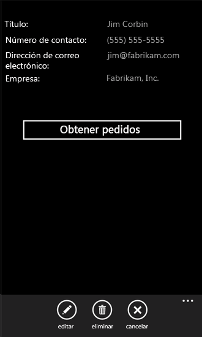
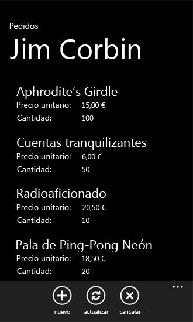

# Cómo: Utilizar varias listas de SharePoint 2013 en una aplicación de Windows Phone
Crear aplicaciones para Windows Phone que usen datos de varias listas de SharePoint.
Puede usar varias listas de SharePoint en la aplicación de varias maneras. Al crear una aplicación de Windows Phone basada en la plantilla de aplicación de lista de SharePoint de Windows Phone, especifique un lista de SharePoint de destino único, pero la arquitectura del proyecto resultante es lo suficientemente extensible para dar cabida a la integración de varias listas.
  
    
    


> **IMPORTANTE**
> Si está desarrollando una aplicación para Windows Phone 8, debe usar Visual Studio Express 2012 en vez de Visual Studio 2010 Express. Excepto para el entorno de desarrollo, toda la información de este artículo se aplica a la creación de aplicaciones para Windows Phone 8 y Windows Phone 7. > Para obtener más información, consulte  [Cómo: Configurar un entorno de desarrollo de aplicaciones móviles para SharePoint](how-to-set-up-an-environment-for-developing-mobile-apps-for-sharepoint.md). 
  
    
    


## Crear una solución de listas de SharePoint basadas en el mismo esquema
<a name="BKMK_SameSchemaProject"> </a>

Si tiene dos listas de SharePoint basadas en el mismo esquema, puede aprovechar las ventajas de las clases implementadas en la plantilla de aplicación de lista de SharePoint de Windows Phone y crear objetos de esas clases específicas de cada lista.
  
    
    
Suponga que tiene dos listas de SharePoint basadas en la plantilla de lista de contactos. Una lista, denominada, por ejemplo, Equipo de marketing, contiene los miembros del equipo de marketing de la organización y la otra lista, Equipo de ingeniería, contiene los miembros de un equipo de ingeniería. Si crea un proyecto mediante la plantilla de aplicación de lista de SharePoint de Windows Phone y especifica la lista Equipo de marketing como la lista de destino en el que quiere basar el proyecto, se crea una instancia de la clase **ListDataProvider** (denominada **DataProvider** de forma predeterminada) en la implementación de la clase **App** en el archivo App.xaml.cs en el proyecto. Este objeto representa la lista (es decir, Equipo de marketing) como origen de datos para la aplicación, proporcionando operaciones para tener acceso y manipular elementos de la lista. También se crea una instancia de la clase **ListViewModel** de la lista en la que se basa la aplicación. Este objeto tiene un miembro de la propiedad (que también pasa a denominarse **DataProvider**) que se puede establecer para una instancia determinada de la clase **ListDataProvider**, estableciendo el origen de datos para la instancia de clase **ListViewModel**.
  
    
    
Puede crear una instancia adicional de la **ListDataProvider** clase en el proyecto para servir como origen de datos de la segunda lista (equipo de ingeniería) en el archivo App.xaml.cs. El objeto se denomina **SecondaryDataProvider** en el código siguiente.
  
    
    


```cs

private static ListDataProvider m_SecondaryDataProvider;

public static ListDataProvider SecondaryDataProvider
{
    get
    {
        if (m_SecondaryDataProvider != null)
            return m_SecondaryDataProvider;

        m_SecondaryDataProvider = new ListDataProvider();
        m_SecondaryDataProvider.ListTitle = "Engineering Team";
        m_SecondaryDataProvider.SiteUrl = new Uri("http://contoso:2012/sites/samplesite/");

        return m_SecondaryDataProvider;
    }
}
```

Luego, puede crear una instancia de otro objeto de la clase **ListViewModel** (denominado, por ejemplo, **SecondaryViewModel**) y asignar el objeto **SecondaryDataProvider** a su propiedad **DataProvider**, como en el siguiente código.
  
    
    


```cs

private static ListViewModel m_SecondaryViewModel;

public static ListViewModel SecondaryViewModel
{
    get
    {
        if (m_SecondaryViewModel == null)
            m_SecondaryViewModel = new ListViewModel { DataProvider = App.SecondaryDataProvider };

        return m_SecondaryViewModel;
    }
    set
    {
        m_SecondaryViewModel = value;
    }
}
```

Si los mismos campos y vistas de las dos listas son adecuadas para los fines (y, de nuevo, si las dos listas tienen las mismas columnas y campos), no es necesario realizar cambios en la implementación de la clase **ListDataProvider** (en el archivo ListDataProvider.cs).
  
    
    
Sin embargo, para mostrar o modificar los datos de la segunda lista en su proyecto, deberá agregar la vista de formularios al proyecto al que están enlazados y configurados para este **SecondaryViewModel**. Por ejemplo, puede agregar una carpeta denominada "SecondaryViews" al proyecto y agregar un archivo SecondaryList.xaml a dicha carpeta con formato similar al del archivo List.xaml predeterminado generado por la plantilla de la lista principal en el proyecto. Tenga en cuenta que debe diferenciar el formulario de lista secundario del formulario de lista principal de la aplicación especificando un valor para distinguir el atributo **x:Class** del elemento **PhoneApplicationPage** en el archivo SecondaryList.xaml.
  
    
    


```

<phone:PhoneApplicationPage
    x:Class="MultipleSPListApp.SecondaryViews.ListForm"
    xmlns="http://schemas.microsoft.com/winfx/2006/xaml/presentation"
    xmlns:x="http://schemas.microsoft.com/winfx/2006/xaml"
    xmlns:phone="clr-namespace:Microsoft.Phone.Controls;assembly=Microsoft.Phone"
    xmlns:shell="clr-namespace:Microsoft.Phone.Shell;assembly=Microsoft.Phone"
    xmlns:d="http://schemas.microsoft.com/expression/blend/2008"
    xmlns:mc="http://schemas.openxmlformats.org/markup-compatibility/2006"
    mc:Ignorable="d" d:DesignWidth="480" d:DesignHeight="696"
    FontFamily="{StaticResource PhoneFontFamilyNormal}"
    FontSize="{StaticResource PhoneFontSizeNormal}"
    Foreground="{StaticResource PhoneForegroundBrush}"
    SupportedOrientations="PortraitOrLandscape" Orientation="Portrait"
    shell:SystemTray.IsVisible="True" x:Name = "ListViewPage">
...
</phone:PhoneApplicationPage>
```

En el archivo de código subyacente asociado, SecondaryList.xaml.cs, reemplace todas las referencias a "App.MainViewModel" con referencias a "App.SecondaryViewModel". Por ejemplo, el constructor del archivo debe ser como el siguiente.
  
    
    


```cs

public ListForm()
    {
        InitializeComponent();
        this.DataContext = App.SecondaryViewModel;
    }
```

Reemplace también todas las referencias a "App.DataProvider" en el archivo de código subyacente con referencias a "App.SecondaryDataProvider" y actualice las rutas de navegación para que apunten a las páginas XAML secundarias correspondientes. Si agrega también un Nuevo formulario secundario al proyecto (denominado, por ejemplo, SecondaryNewForm.xaml en la carpeta SecondaryViews del proyecto), el controlador en el archivo SecondaryList.xaml.cs para el evento **OnNewButtonClick** parecería el código siguiente.
  
    
    


```cs

private void OnNewButtonClick(object sender, EventArgs e)
    {
        // Instantiate a new instance of NewItemViewModel and go to NewForm.
        App.SecondaryViewModel.CreateItemViewModelInstance = new NewItemViewModel { DataProvider = App.SecondaryDataProvider };
        NavigationService.Navigate(new Uri("/SecondaryViews/SecondaryNewForm.xaml", UriKind.Relative));
    }
```

Por último, puede agregar un botón a la **ApplicationBar** en el archivo List.xaml para mostrar la página SecondaryList.xaml.
  
    
    


```

...
    <phone:PhoneApplicationPage.ApplicationBar>
        <shell:ApplicationBar IsVisible="True" IsMenuEnabled="True">
            <shell:ApplicationBarIconButton x:Name="btnNew" IconUri="/Images/appbar.new.rest.png" Text="New" Click="OnNewButtonClick"/>
            <shell:ApplicationBarIconButton x:Name="btnRefresh" IconUri="/Images/appbar.refresh.rest.png" Text="Refresh" IsEnabled="True" Click="OnRefreshButtonClick"/>
            <!--Add the following button to navigate to the secondary list (Engineering Team).-->
            <shell:ApplicationBarIconButton x:Name="btnSecondaryList" IconUri="/Images/appbar.upload.rest.png" Text="Engineering" IsEnabled="True" Click="OnSecondaryListButtonClick"/>
        </shell:ApplicationBar>
    </phone:PhoneApplicationPage.ApplicationBar>
...
```

En el archivo de código subyacente asociado, List.xaml.cs, agregue un controlador para el evento **OnSecondaryListButtonClick** declarado en el archivo List.xaml.
  
    
    


```cs

private void OnSecondaryListButtonClick(object sender, EventArgs e)
{
    NavigationService.Navigate(new Uri("/SecondaryViews/SecondaryList.xaml", UriKind.Relative));
}
```

Luego, los usuarios de la aplicación pueden desplazarse entre la lista Equipo de marketing y Equipo de ingeniería. Puesto que los esquemas de lista subyacentes son iguales, los objetos **DataProvider** y **MainViewModel** predeterminados generados por la plantilla y los objetos **SecondaryDataProvider** y **SecondaryViewModel** agregados controlan todas las transacciones de datos sin necesidad de modificaciones en el archivo ListDataProvider.cs.
  
    
    

## Crear una solución de listas de SharePoint basadas en esquemas distintos
<a name="BKMK_DifferentSchemasProject"> </a>

El enfoque de la sección anterior funciona según se ejecuta (es decir, para listas de SharePoint basadas en el mismo esquema), pero para los desarrolladores está disponible la clase **ListDataProvider** para la personalización con el fin de controlar varias listas de SharePoint que no se basan en el mismo esquema o no incluyen las mismas columnas y campos de clase en la plantilla de aplicación de lista de SharePoint de Windows Phone.
  
    
    
Como se muestra en la sección anterior, suponga que tiene una lista de SharePoint, Equipo de marketing (basada en la plantilla de lista de contactos), que contiene los miembros del equipo de marketing. Suponga también que tiene una segunda lista, denominada pedidos (basada en la plantilla de lista Personalizada), que contiene las columnas y tipos de campo que se muestran en la tabla 1.
  
    
    

**Tabla 1. Columnas y campos de la lista de pedidos**


|**Columna**|**Tipo de campo**|**Obligatorio**|
|:-----|:-----|:-----|
|Producto (por ejemplo, Título)  <br/> |Una línea de texto (Text)  <br/> |Sí  <br/> |
|Precio unitario  <br/> |Moneda  <br/> |Sí  <br/> |
|Cantidad  <br/> |Número  <br/> |No (el valor predeterminado es cero)  <br/> |
|Valor del pedido  <br/> |Calculado (Precio unitario * Cantidad)  <br/> |No  <br/> |
|Fecha de pedido  <br/> |Fecha y hora (Datetime)  <br/> |No  <br/> |
|Estado del pedido  <br/> |Opción  <br/> |No  <br/> |
|Cliente  <br/> |Una línea de texto (Text)  <br/> |No  <br/> |
   
Como en el ejemplo de la sección anterior, puede crear una instancia de otro objeto **ListDataProvider** y otro objeto **ListViewModel** para administrar la lista de pedidos. Suponga que el objeto **ListDataProvider** de la instancia se denomina **OrdersListDataProvider**, como en el siguiente código.
  
    
    


```cs

private static ListDataProvider m_OrdersListDataProvider;

public static ListDataProvider OrdersListDataProvider
{
    get
    {
        if (m_OrdersListDataProvider != null)
            return m_OrdersListDataProvider;

        m_OrdersListDataProvider = new ListDataProvider();
        m_OrdersListDataProvider.ListTitle = "Orders";
        m_OrdersListDataProvider.SiteUrl = new Uri("http://contoso:2012/sites/samplesite/"); // Specify a URL here for your server.

        return m_OrdersListDataProvider;
    }
}
```

Y suponga que el objeto **ListViewModel** de la instancia de la lista de pedidos se denomina **OrdersListViewModel**, como en el siguiente código.
  
    
    


```cs

private static ListViewModel m_OrdersListViewModel;

public static ListViewModel OrdersListViewModel
{
    get
    {
        if (m_OrdersListViewModel == null)
            m_OrdersListViewModel = new ListViewModel { DataProvider = App.OrdersListDataProvider };

        return m_OrdersListViewModel;
    }
    set
    {
        m_OrdersListViewModel = value;
    }
}
```

El esquema de la lista de pedidos difiere de la lista Equipo de marketing. Puede adoptar las diferencias agregando código al archivo ListDataProvider.cs, específicamente a la clase **CamlQueryBuilder**.
  
    
    


```cs

public static class CamlQueryBuilder
{
    static Dictionary<string, string> ViewXmls = new Dictionary<string, string>()
    {   
        {"View1",   @"<View><Query><OrderBy><FieldRef Name='Title' />
                    <FieldRef Name='FirstName'  /></OrderBy></Query><RowLimit>30</RowLimit><ViewFields>{0}</ViewFields></View>"},
      {"View2",   @"<View><Query><OrderBy><FieldRef Name='ID' /></OrderBy></Query><RowLimit>30</RowLimit>
     <ViewFields>{0}</ViewFields></View>"}
    };

    static string View1Fields = @"<FieldRef Name='Title'/><FieldRef Name='FirstName'/>
   <FieldRef Name='JobTitle'/><FieldRef Name='Email'/><FieldRef Name='Comments'/>";
    static string View2Fields = @"<FieldRef Name='Title'/><FieldRef Name='Unit_x0020_Price'/><FieldRef Name='Quantity'/>
            <FieldRef Name='Order_x0020_Value'/><FieldRef Name='Order_x0020_Date'/>
            <FieldRef Name='Status'/><FieldRef Name='Customer'/>";

    public static CamlQuery GetCamlQuery(string viewName)
    {
        string viewXml = ViewXmls[viewName];
        // Add ViewFields to the ViewXml depending on the view.
        switch (viewName)
        {
            case "View2":
                viewXml = string.Format(viewXml, View2Fields);
                break;
            case "View1":
            default:
                viewXml = string.Format(viewXml, View1Fields);
                break;
        }
        return new CamlQuery { ViewXml = viewXml };
    }
}
```

En este caso, se agrega una segunda entrada con un valor de clave "View2" al objeto **ViewXmls** **Dictionary** de la lista de pedidos. (Tenga en cuenta que los valores de la clave de los elementos agregados a **ViewXmls** **Dictionary** en la clase **CamlQueryBuilder** debe ser únicos (en la solución) para que la lógica de almacenamiento en caché de la plantilla funcione correctamente). Las variables de cadena ( **View1Fields** y **View2Fields**) se utilizan para almacenar la lista de campos de cada vista. Luego, dependiendo del valor del parámetro **viewName** pasado al método **GetCamlQuery**, se crea la cadena XML de consulta CAML adecuada.
  
    
    
A continuación, como en la sección anterior, puede crear formularios de vista de la lista, enlazado en este momento a los objetos **OrdersListViewModel** y **OrdersListDataProvider**. Como ejemplo, el código XAML para un formulario de lista específico de la lista de pedidos, denominada OrdersList.xaml, que se parecería al marcado en el archivo List.xaml generado por la plantilla de la lista principal de la aplicación, excepto en que denominaría al control **PivotItem** que representa "View2" (en lugar de la predeterminada, la "vista 1") y establecería la declaración **Binding** para el atributo **ItemsSource** del control **ListBox** en la lista de elementos se representan a la "View2" como en el siguiente marcado (que solo muestra el marcado de la cuadrícula de la raíz de la página).
  
    
    


```

...
    <Grid x:Name="LayoutRoot" Background="Transparent" xmlns:x="http://schemas.microsoft.com/winfx/2006/xaml" xmlns:controls="clr-namespace:Microsoft.Phone.Controls;assembly=Microsoft.Phone.Controls">
        <!--Pivot Control-->
        <ProgressBar x:Name="progressBar" Opacity="1" HorizontalAlignment="Center" VerticalAlignment="Top" 
               Height="30" Width="470" IsIndeterminate="{Binding IsBusy}" Visibility="{Binding ShowIfBusy}" />
        <Grid x:Name="ContentPanel" Grid.Row="0" Width="470">
            <controls:Pivot Name="Views" Title="Orders" LoadedPivotItem="OnPivotItemLoaded">
                <!--Pivot item-->
                <controls:PivotItem Name="View2" Header="All Orders">
                    <!--Double line list with text wrapping-->
                    <ListBox x:Name="lstBox1" Margin="0,0,-12,0" SelectionChanged="OnSelectionChanged" ItemsSource="{Binding [View2]}">
                        <ListBox.ItemTemplate>
                            <DataTemplate>
                                <StackPanel Orientation="Vertical" Margin="10">
                                    <TextBlock Name="txtTitle" Text="{Binding [Title]}" TextWrapping="NoWrap" 
                                          Style="{StaticResource PhoneTextTitle2Style}" />
                                    <TextBlock Name="txtUnitPrice" Text="{Binding [Unit_x0020_Price]}" 
                                         TextWrapping="NoWrap" Style="{StaticResource PhoneTextNormalStyle}" />
                                    <TextBlock Name="txtQuantity" Text="{Binding [Quantity]}"
                                         TextWrapping="NoWrap" Style="{StaticResource PhoneTextNormalStyle}" />
                                </StackPanel>
                            </DataTemplate>
                        </ListBox.ItemTemplate>
                    </ListBox>
                </controls:PivotItem>
            </controls:Pivot>
        </Grid>
    </Grid>
...
```

Un buen método para crear marcado XAML adecuado es utilizar la plantilla de aplicación de lista de SharePoint de Windows Phone para generar un proyecto independiente basado en la lista de pedidos y luego copiar el XAML generado desde ese proyecto al proyecto con varias listas, teniendo cuidado al cambiar el nombre del control **PivotItem** (cuyo valor predeterminado es "View1") a "View2" y cambiar la declaración **Binding** del control **ListBox** como se muestra aquí. También necesitará cambiar todas las referencias en el archivo de código subyacente asociado para que el formulario especifique los objetos **ListViewModel** y **DataProvider** correspondientes (como, por ejemplo, **OrdersListViewModel** y **OrdersListDataProvider**).
  
    
    
Este enfoque funciona porque en el archivo de código subyacente asociado (denominado, en este caso, OrdersList.xaml.cs), varios controladores de eventos que llaman a métodos del objeto **ListDataProvider** (aquí, **OrdersListDataProvider**) para tener acceso a los datos de la lista usan el nombre del control **PivotItem** como una forma de especificar la vista adecuada que hay que usar. Por ejemplo, el controlador de eventos **OnPivotItemLoaded** llama al método **LoadData** del objeto **OrdersListViewModel** de la desde la clase **ListViewModel** (y, a su vez, este método llama al método **LoadData** del objeto **OrdersListDataProvider**), pasando el nombre del control **PivotItem** (aquí, "View2") como valor del parámetro **ViewName** al método. Finalmente, este mismo valor (como valor del parámetro **viewName**) se pasa al método **GetCamlQuery** mostrado anteriormente en la implementación de modificación de la clase **CamlQueryBuilder**.
  
    
    

## Un enfoque alternativo para una solución de listas de SharePoint basadas en esquemas distintos
<a name="BKMK_DifferentSchemasAlternative"> </a>

Como alternativa al enfoque de la sección anterior, puede usar la plantilla de aplicación de lista de SharePoint de Windows Phone para crear un proyecto de aplicación de Windows Phone en una solución de Microsoft Visual Studio 2010 basada en una determinada lista de SharePoint y, a continuación, agregar proyectos generados basados en otras listas a esa misma solución. Este enfoque le permite aprovechar las ventajas de la plantilla para generar formularios específicos de cada lista de SharePoint. Puede personalizar la solución según sus necesidades para controlar cómo los usuarios interactúan con las listas. Los procedimientos de esta sección muestran este enfoque.
  
    
    
Para los siguientes procedimientos, suponga que tiene una lista de SharePoint denominada pedidos (basada en la plantilla de lista personalizada), con las columnas y tipos de campo, como se muestran en la tabla 1 en la sección anterior. Además, suponga que tiene otra lista de SharePoint (de nuevo, basada en la plantilla de lista personalizada), denominada clientes, con las columnas y tipos de campo que se muestra en la tabla 2.
  
    
    

**Tabla 1. Columnas y campos de la lista de clientes**


|**Columna**|**Tipo de campo**|**Obligatorio**|
|:-----|:-----|:-----|
|Nombre del cliente (por ejemplo, Título)  <br/> |Una línea de texto (Text)  <br/> |Sí  <br/> |
|Número de contacto  <br/> |Una línea de texto (Text)  <br/> |No  <br/> |
|Dirección de correo electrónico  <br/> |Una línea de texto (Text)  <br/> |No  <br/> |
|Empresa  <br/> |Una línea de texto (Text)  <br/> |No  <br/> |
   
En los procedimientos siguientes, se crea una aplicación de Windows Phone que utiliza ambas listas. La lista principal de la aplicación es la lista de clientes. Al mostrar los detalles de un cliente determinado en el formulario de presentación, se incluye un botón en dicho formulario que permite a los usuarios mostrar todos los pedidos (desde la lista de pedidos) asociados a ese cliente.
  
    
    

### Para crear los proyectos componentes de la solución


1. Cree una aplicación de Windows Phone con la plantilla de aplicación de lista de SharePoint de Windows Phone, especificando una lista de SharePoint definida basada en las columnas y tipos de campo se muestran en la tabla 2. En los procedimientos de esta sección, se supone que el nombre de la lista en el proyecto es "Customers" y el nombre del proyecto es "CustomersSPListApp". (Consulte  [Cómo: Crear una aplicación de lista de SharePoint 2013 para Windows Phone](how-to-create-a-windows-phone-sharepoint-2013-list-app.md) para obtener información sobre cómo crear una aplicación basada en la plantilla de aplicación de lista de SharePoint de Windows Phone).
    
  
2. En Visual Studio, elija **Archivo**, **Agregar**, **Nuevo proyecto**. 
    
    Aparece el cuadro de diálogo **Agregar nuevo proyecto**.
    
  
3. En el cuadro de diálogo **Agregar nuevo proyecto**, en el nodo **Visual C#**, elija el nodo **Silverlight para Windows Phone**.
    
  
4. En el panel **Plantillas**, elija la plantilla de aplicación de lista de SharePoint de Windows Phone.
    
  
5. Asigne un nombre a la aplicación, por ejemplo, OrdersSPListAppy luego elija **Aceptar**.
    
  
6. Siga el procedimiento descrito en  [Cómo: Crear una aplicación de lista de SharePoint 2013 para Windows Phone](how-to-create-a-windows-phone-sharepoint-2013-list-app.md) para crear otro proyecto de aplicación de Windows Phone, especificando una lista definida de SharePoint basada en las columnas y los tipos de campo que se muestran en la tabla 1 como lista de destino para el proyecto. Ahora debería tener dos proyectos en la solución denominados "CustomersSPListApp" y "OrdersSPListApp" (si se siguen las convenciones de nomenclatura de este procedimiento).
    
  
7. En el **Explorador de soluciones**, elija el nodo del proyecto CustomerSPListApp.
    
  
8. En el menú **Proyecto**, elija **Agregar referencia**. 
    
    Aparece el cuadro de diálogo **Agregar referencia**.
    
  
9. En la ficha **Proyectos**, elija el proyecto OrdersSPListApp de la solución y luego haga clic en el botón **Aceptar**. El proyecto se agrega al nodo **Referencias** del proyecto CustomersSPListApp.
    
  
A continuación, configure los dos proyectos de la solución. Básicamente, configure el proyecto OrdersSPListApp (basado en la lista de pedidos) para que funcione como un proyecto de "búsqueda" para el proyecto CustomerSPListApp (basado en la lista de clientes).
  
    
    

### Para configurar el proyecto OrdersSPListApp


1. Cambie las rutas de navegación en los formularios de la vista del proyecto OrdersSPListApp para que incluyan el espacio de nombres principal del proyecto ("OrdersSPListApp") y la designación "componente". Por ejemplo, en el controlador del evento OnNewButtonClick en el archivo List.xaml.cs del proyecto OrdersSPListApp, cambie la llamada al método Navegar del objeto NavigationService de este:
    
     `NavigationService.Navigate(new Uri("/Views/NewForm.xaml", UriKind.Relative));`
    
    A este:
    
     `NavigationService.Navigate(new Uri("/OrdersSPListApp;component/Views/NewForm.xaml", UriKind.Relative));`
    
    La forma más sencilla de realizar estos cambios es con el comando **Reemplazo rápido** del proyecto OrdersSPListApp.
    
1. En el **Explorador de soluciones**, elija el nodo del proyecto OrdersSPListApp.
    
  
2. Presione Ctrl + H para mostrar el cuadro de diálogo **Reemplazo rápido**.
    
  
3. En el cuadro de texto **Buscar**, especifique el siguiente texto exactamente tal y como aparece aquí:
    
    Uri("/Views/
    
  
4. En el cuadro de texto **Reemplazar con**, especifique el siguiente texto exactamente como aparece aquí:
    
    Uri("/OrdersSPListApp;component/Views/
    
  
5. Asegúrese de que **Proyecto actual** está seleccionado en la lista desplegable **Buscar en**.
    
  
6. Elija **Reemplazar todo**.
    
  
7. Guarde todos los archivos modificados en el proyecto.
    
  
2. Agregue una propiedad de miembro al archivo App.xaml.cs del proyecto OrdersSPListApp. En el **Explorador de soluciones**, en el nodo del proyecto OrdersSPListApp, elija el archivo.
    
  
3. Presione F7 para abrir el archivo de código subyacente asociado, App.xaml.cs, para su edición.
    
  
4. En el bloque de código (delimitado por llaves) que implementa la clase parcial **App**, agregue el código siguiente.
    
  ```cs
  
public static string CustomerName { get; set; }
  ```

5. En el **Explorador de soluciones**, en el nodo del proyecto OrdersSPListApp, elija el archivo List.xaml.
    
  
6. Presione F7 para abrir el archivo de código subyacente asociado, List.xaml.cs, para su edición.
    
  
7. Modifique el controlador de eventos **OnNavigatedTo** del archivo para analizar la propiedad **QueryString** del objeto **NavigationContext** para establecer el valor de la variable **CustomerName** declarada en el paso 4. También puede establecer la propiedad **Header** del control **PivotItem** en el formulario de lista para que coincida con el nombre del cliente para la comodidad de los usuarios. El controlador de modificación debe ser como sigue.
    
  ```cs
  protected override void OnNavigatedTo(System.Windows.Navigation.NavigationEventArgs e)
{
    base.OnNavigatedTo(e);

    if (this.NavigationContext.QueryString.ContainsKey("CustomerName"))
    {
        App.CustomerName = NavigationContext.QueryString["CustomerName"];
    }

    // Also set the value of the Header property for the PivotItem to match the customer name.
    if (!string.IsNullOrWhiteSpace(App.CustomerName))
    {
        this.View1.Header = App.CustomerName;
    }

    App.MainViewModel.ViewDataLoaded += new EventHandler<ViewDataLoadedEventArgs>(OnViewDataLoaded);
    App.MainViewModel.InitializationCompleted += new EventHandler<InitializationCompletedEventArgs>(OnViewModelInitialization);
}
  ```

8. Agregue la variable **CustomerName** como un argumento en la llamada al método **LoadData** en el controlador de eventos **OnPivotItemLoaded** en el archivo List.xaml.cs. La implementación del controlador de eventos **OnPivotItemLoaded** debe ser como sigue.
    
  ```cs
  
private void OnPivotItemLoaded(object sender, PivotItemEventArgs e)
{
    if (!App.MainViewModel.IsInitialized)
    {
        //Initialize ViewModel and Load Data for PivotItem upon initialization.
        App.MainViewModel.Initialize();
    }
    else
    {
        //Load Data for the currently loaded PivotItem.
        App.MainViewModel.LoadData(e.Item.Name, App.CustomerName);
    }
}
  ```


    El método **LoadData** de la clase **ListViewModel** de la plantilla está definido para que pueda aceptar parámetros opcionales.
    
  
9. Agregue también la variable **CustomerName** como argumento en la llamada al método **LoadData**en el controlador de eventos **OnViewModelInitialization**. La implementación del controlador de eventos **OnViewModelInitialization** debe ser como sigue.
    
  ```cs
  
private void OnViewModelInitialization(object sender, InitializationCompletedEventArgs e)
{
    this.Dispatcher.BeginInvoke(() =>
    {
        //If initialization has failed, show error message and return.
        if (e.Error != null)
        {
            MessageBox.Show(e.Error.Message, e.Error.GetType().Name, MessageBoxButton.OK);
            return;
        }
        App.MainViewModel.LoadData(((PivotItem)Views.SelectedItem).Name, App.CustomerName);
        this.DataContext = (sender as ListViewModel);
    });
}
  ```

10. Agregue la variable **CustomerName** como un argumento en la llamada al método **RefreshData** en el controlador de eventos **OnRefreshButtonClick** en el archivo List.xaml.cs. La implementación del controlador de eventos **OnRefreshButtonClick** debe ser como sigue.
    
  ```cs
  
private void OnRefreshButtonClick(object sender, EventArgs e)
{
    if (Views.SelectedItem == null)
        return;

    if (!App.MainViewModel.IsInitialized)
    {
        //Initialize ViewModel and Load Data for PivotItem upon completion.
        App.MainViewModel.Initialize();
    }
    else
    {   //Refresh Data for the currently loaded PivotItem.
        App.MainViewModel.RefreshData(((PivotItem)Views.SelectedItem).Name, App.CustomerName);
    }
}
  ```


    Como para el método **LoadData**, el método **RefreshData** también se define para que pueda aceptar parámetros opcionales. Observe que en los tres pasos anteriores, el único cambio en los controladores de eventos generado por la plantilla es la adición de la variable **CustomerName** como argumento en la llamada a los métodos **LoadData** o **RefreshData**.
    
  
11. Cuando los usuarios eligen el botón **Nuevo** en la lista de formularios de la lista de pedidos de la aplicación, el campo Cliente en el formulario Nuevo ya deben contener el nombre del cliente, porque se ha filtrado la lista de pedidos que se muestra al usuario basándose en el nombre del cliente. Los nuevos pedidos agregados de esa lista filtrada deben asociarse con el nombre del cliente filtrado en la lista. Para pasar el valor de la variable **CustomerName** al formulario nuevo modifique el evento **OnNewButtonClick** para que incluya el valor como una cadena de consulta en la ruta de navegación en el nuevo formulario, como se muestra en el siguiente código.
    
  ```cs
  
private void OnNewButtonClick(object sender, EventArgs e)
{
    //Instantiate a new instance of NewItemViewModel and go to NewForm.
    App.MainViewModel.CreateItemViewModelInstance = new NewItemViewModel { DataProvider = App.DataProvider };
    
    if (!string.IsNullOrWhiteSpace(App.CustomerName))
    {
        NavigationService.Navigate(new Uri("/OrdersSPListApp;component/Views/NewForm.xaml?CustomerName=" + 
                                                                            App.CustomerName, UriKind.Relative));
    }
    else
    {
        NavigationService.Navigate(new Uri("/OrdersSPListApp;component/Views/NewForm.xaml", UriKind.Relative));
    }
}
  ```

12. En el controlador de eventos **OnNavigatedTo** para el formulario Nuevo, compruebe la cadena de consulta para un nombre de cliente y, si está disponible, asigne al campo Cliente de ViewModel al formulario. En el **Explorador de soluciones**, en el proyecto OrdersSPListApp, elija el archivo NewForm.xaml y presione F7 para abrir el archivo de código subyacente asociado, NewForm.xaml.cs, para su edición.
    
  
13. Modifique el controlador de eventos **OnNavigatedTo** en el archivo para que coincida con el código siguiente.
    
  ```cs
  
protected override void OnNavigatedTo(System.Windows.Navigation.NavigationEventArgs e)
{
    base.OnNavigatedTo(e);

    if (this.NavigationContext.QueryString.ContainsKey("CustomerName"))
    {
        this.viewModel["Customer"] = NavigationContext.QueryString["CustomerName"];
    }

    viewModel.ItemCreated += new EventHandler<ItemCreatedEventArgs>(OnItemCreated);
}
  ```

14. En la clase **CamlQueryBuilder** del archivo ListDataProvider.cs en el proyecto OrdersSPListApp, agregue una cláusula **WHERE** para el campo Cliente de la consulta CAML utilizado para obtener elementos de la lista de pedidos para filtrar la lista basada en un nombre de cliente determinado (de la variable **CustomerName**). Agregue un parámetro al método **GetCamlQuery** en la clase para pasar el nombre del cliente. La clase **CamlQueryBuilder** modificada debe ser como la siguiente.
    
  ```cs
  
public static class CamlQueryBuilder
{
    static Dictionary<string, string> ViewXmls = new Dictionary<string, string>()
    {   
        {"View1", @"<View><Query>{0}</Query><RowLimit>30</RowLimit><ViewFields>{1}</ViewFields></View>"}
    };

    static string ViewFields = @"<FieldRef Name='Title'/><FieldRef Name='Unit_x0020_Price'/><FieldRef Name='Quantity'/><FieldRef Name='Order_x0020_Value'/><FieldRef Name='Order_x0020_Date'/><FieldRef Name='Status'/><FieldRef Name='Customer'/>";

    public static CamlQuery GetCamlQuery(string viewName, string customerName)
    {
        string queryClause = string.Empty;

        // Create appropriate Query Clause, depending on customerName parameter.
        if (string.IsNullOrWhiteSpace(customerName))
        {
            queryClause = "<OrderBy><FieldRef Name='ID' /></OrderBy>";
        }
        else
        {
            queryClause = string.Format("<Where><Eq><FieldRef Name='Customer' /><Value Type='Text'>{0}</Value></Eq></Where>", customerName);
        }

        // Add Query Clause and ViewFields to ViewXml.
        string viewXml = ViewXmls[viewName];
        viewXml = string.Format(viewXml, queryClause, ViewFields);

        return new CamlQuery { ViewXml = viewXml };
    }
}
  ```

15. Modifique el método **LoadDataFromServer** del archivo ListDataProvider.cs para comprobar el argumento **CustomerName** y pasar el argumento al método **GetCamlQuery**. El método modificado debe ser como el siguiente.
    
  ```cs
  
private void LoadDataFromServer(string ViewName, Action<LoadViewCompletedEventArgs>
                                              loadItemCompletedCallback, params object[] filterParameters)
{
    string customerName = string.Empty;
    string cacheKey = ViewName;

    // Parse the optional parameters:
    if (filterParameters.Length > 0)
    {
        customerName = filterParameters[0].ToString();
        cacheKey += "-" + customerName;
    }

    CamlQuery query = CamlQueryBuilder.GetCamlQuery(ViewName, customerName);
    ListItemCollection items = Context.Web.Lists.GetByTitle(ListTitle).GetItems(query);
    Context.Load(items);
    Context.Load(items, listItems => listItems.Include(item => item.FieldValuesAsText));

    Context.ExecuteQueryAsync(
        delegate(object sender, ClientRequestSucceededEventArgs args)
        {
            base.CacheView(cacheKey, items);
            loadItemCompletedCallback(new LoadViewCompletedEventArgs { ViewName = ViewName, Items = base.GetCachedView(cacheKey) });
        },
        delegate(object sender, ClientRequestFailedEventArgs args)
        {
            loadItemCompletedCallback(new LoadViewCompletedEventArgs { Error = args.Exception });
        });
}
  ```

16. Del mismo modo, modifique el método **LoadData** del archivo ListDataProvider.cs para procesar el parámetro **CustomerName**.
    
  ```cs
  
public override void LoadData(string ViewName, Action<LoadViewCompletedEventArgs>
                                                           loadViewCompletedCallback, params object[] filterParameters)
{
    string customerName = string.Empty;
    string cacheKey = ViewName;

    // Parse the optional parameters:
    if (filterParameters.Length > 0)
    {
        customerName = filterParameters[0].ToString();
        cacheKey += "-" + customerName;
    }

    List<ListItem> CachedItems = GetCachedView(cacheKey);
    if (CachedItems != null)
    {
        loadViewCompletedCallback(new LoadViewCompletedEventArgs { ViewName = ViewName, Items = CachedItems });
        return;
    }

    LoadDataFromServer(ViewName, loadViewCompletedCallback, filterParameters);
}
  ```

17. Agregue un botón **Cancelar** al elemento **ApplicationBar** del archivo List.xaml en el proyecto OrdersSPListApp. En el **Explorador de soluciones**, en el nodo OrdersSPListApp, elija el archivo List.xaml y luego presione MAYÚS + F7 para abrir el archivo y editarlo en el diseñador.
    
  
18. Agregue código XAML para declarar un botón **Cancelar** dentro de la etiqueta `<phone:PhoneApplicationPage.ApplicationBar>`, como se muestra en el siguiente marcado.
    
  ```
  
<phone:PhoneApplicationPage.ApplicationBar>
    <shell:ApplicationBar IsVisible="True" IsMenuEnabled="True">
        <shell:ApplicationBarIconButton x:Name="btnNew" 
                 IconUri="/Images/appbar.new.rest.png" Text="New" Click="OnNewButtonClick"/>
        <shell:ApplicationBarIconButton x:Name="btnRefresh" IconUri="/Images/appbar.refresh.rest.png" 
                 Text="Refresh" IsEnabled="True" Click="OnRefreshButtonClick"/>
        <shell:ApplicationBarIconButton x:Name="btnCancel" IconUri="/Images/appbar.cancel.rest.png" Text="Cancel" IsEnabled="True" Click="OnCancelButtonClick" />
    </shell:ApplicationBar>
</phone:PhoneApplicationPage.ApplicationBar>
  ```

19. Con el archivo List.xaml seleccionado en el **Explorador de soluciones**, presione F7 para abrir el archivo de código subyacente asociado, List.xaml.cs, para su edición.
    
  
20. Dentro del bloque de código (delimitado por llaves) que implementa la clase parcial **ListForm**, agregue el siguiente controlador al evento **OnCancelButtonClick**.
    
  ```cs
  
private void OnCancelButtonClick(object sender, EventArgs e)
{
    NavigationService.Navigate(new Uri("/CustomersSPListApp;component/Views/DisplayForm.xaml", UriKind.Relative));
}
  ```

21. Guarde los archivos del proyecto.
    
  
Ahora, falta agregar un botón al formulario Mostrar del proyecto CustomersSPListApp para mostrar los pedidos asociados a un cliente determinado.
  
    
    

### Para configurar el proyecto CustomersSPListApp


1. En el **Explorador de soluciones**, en el nodo del proyecto CustomersSPListApp, elija el archivo DisplayForm.xaml.
    
  
2. Presione Mayús + F7 (o haga doble clic en el archivo) para abrir el archivo para editarlo en el diseñador.
    
  
3. Agregue las declaraciones XAML a un control **Button** dentro de un control **StackPanel** tras el último contenedor de control **StackPanel** para el último campo del elemento de lista, como en el marcado siguiente.
    
  ```
  
...
    <Grid x:Name="LayoutRoot" Background="Transparent" xmlns:x="http://schemas.microsoft.com/winfx/2006/xaml" xmlns:controls="clr-namespace:Microsoft.Phone.Controls;assembly=Microsoft.Phone.Controls">
        <StackPanel>
            <ProgressBar Background="Red" x:Name="progressBar" Opacity="1" HorizontalAlignment="Center" 
              VerticalAlignment="Top" Height="15" Width="470" IsIndeterminate="{Binding IsBusy}" 
               Visibility="{Binding ShowIfBusy}" />
            <ScrollViewer HorizontalScrollBarVisibility="Auto" Height="700">
                <Grid x:Name="ContentPanel" Width="470">
                    <StackPanel Margin="0,5,0,5">
                        <StackPanel HorizontalAlignment="Left" Orientation="Horizontal" Margin="0,5,0,5">
                            <TextBlock TextWrapping="Wrap" Width="150" HorizontalAlignment="Left" 
                                           Style="{StaticResource PhoneTextNormalStyle}">Title :</TextBlock>
                            <TextBlock Width="310" HorizontalAlignment="Left" Name="txtTitle"
                                    Text="{Binding [Title]}" TextWrapping="Wrap" Style="{StaticResource PhoneTextSubtleStyle}" />
                                   </StackPanel>
                        <StackPanel HorizontalAlignment="Left" Orientation="Horizontal" Margin="0,5,0,5">
                            <TextBlock TextWrapping="Wrap" Width="150" HorizontalAlignment="Left" 
                                       Style="{StaticResource PhoneTextNormalStyle}">Contact Number :</TextBlock>
                            <TextBlock Width="310" HorizontalAlignment="Left" Name="txtContact_x0020_Number"
                                       Text="{Binding [Contact_x0020_Number]}" TextWrapping="Wrap" 
                                       Style="{StaticResource PhoneTextSubtleStyle}" />
                        </StackPanel>
                        <StackPanel HorizontalAlignment="Left" Orientation="Horizontal" Margin="0,5,0,5">
                            <TextBlock TextWrapping="Wrap" Width="150" HorizontalAlignment="Left" 
                                     Style="{StaticResource PhoneTextNormalStyle}">E-mail Address :</TextBlock>
                            <TextBlock Width="310" HorizontalAlignment="Left" Name="txtE_x002d_mail_x0020_Address" 
                                 Text="{Binding [E_x002d_mail_x0020_Address]}" TextWrapping="Wrap" 
                                             Style="{StaticResource PhoneTextSubtleStyle}" />
                        </StackPanel>
                        <StackPanel HorizontalAlignment="Left" Orientation="Horizontal" Margin="0,5,0,5">
                            <TextBlock TextWrapping="Wrap" Width="150" HorizontalAlignment="Left" 
                                     Style="{StaticResource PhoneTextNormalStyle}">Company :</TextBlock>
                            <TextBlock Width="310" HorizontalAlignment="Left" Name="txtCompany" 
                                     Text="{Binding [Company]}" TextWrapping="Wrap" Style="{StaticResource PhoneTextSubtleStyle}" />
                        </StackPanel>
                        <StackPanel Margin="0,60,0,5"><Button Content="Get Orders" Height="70" Name="OrdersButton" Width="400" Click="OnButtonOrdersClick" /></StackPanel>
                    </StackPanel>
                </Grid>
            </ScrollViewer>
        </StackPanel>
    </Grid>
...
  ```

4. Con el archivo DisplayForm.xaml seleccionado en el **Explorador de soluciones**, presione F7 para abrir el archivo de código subyacente asociado, DisplayForm.xaml.cs, para su edición.
    
  
5. Dentro del bloque de código (delimitado por llaves) que implementa la clase parcial **DisplayForm**, agregue el siguiente controlador al evento **OnButtonOrdersClick**.
    
  ```cs
  
private void OnOrdersButtonClick(object sender, RoutedEventArgs e)
{
    this.NavigationService.Navigate(new Uri("/OrdersSPListApp;component/Views/List.xaml?CustomerName=" + 
                                                                 viewModel["Title"], UriKind.Relative));
}
  ```

6. Guarde el archivo.
    
  
Si genera la solución y la implementa en el emulador de Windows Phone, aparece el formulario Lista para la lista Clientes. Si selecciona un elemento de la lista para mostrar el formulario Mostrar para un cliente determinado, verá un botón para recuperar los pedidos asociados a ese cliente (figura 1).
  
    
    

**Figura 1. Formulario Mostrar clientes**

  
    
    

  
    
    

  
    
    
Cuando elija el botón **Obtener pedidos** en este formulario Mostrar, se mostrarán los pedidos del cliente en el formulario de lista del proyecto OrdersSPListApp en la solución (figura 2).
  
    
    

**Figura 1. Formulario Lista de pedidos**

  
    
    

  
    
    

  
    
    
Desde este formulario (el formulario Lista de la lista Pedidos) puede agregar, editar o eliminar los pedidos de un cliente. Si elige el botón **Cancelar**, volverá al formulario Lista de la lista Clientes. En una única aplicación de teléfono, puede administrar los elementos de lista de dos listas de SharePoint.
  
    
    

## Recursos adicionales
<a name="SP15Usemultlists_addlresources"> </a>


-  [Cómo: Configurar y usar las notificaciones de inserción en aplicaciones de SharePoint 2013 para Windows Phone](how-to-configure-and-use-push-notifications-in-sharepoint-2013-apps-for-windows.md)
    
  
-  [Cómo: Configurar un entorno de desarrollo de aplicaciones móviles para SharePoint](how-to-set-up-an-environment-for-developing-mobile-apps-for-sharepoint.md)
    
  
-  [Windows Phone SDK 8.0](http://www.microsoft.com/es-es/download/details.aspx?id=35471)
    
  
-  [Microsoft SharePoint SDK para Windows Phone 8](http://www.microsoft.com/es-es/download/details.aspx?id=36818)
    
  
-  [Windows Phone SDK 7.1](http://www.microsoft.com/es-es/download/details.aspx?id=27570)
    
  
-  [Microsoft SharePoint SDK para Windows Phone 7.1](http://www.microsoft.com/es-es/download/details.aspx?id=30476)
    
  

