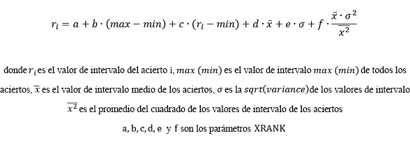

# Referencia de sintaxis del lenguaje de consulta de palabra clave (KQL)
Obtenga información sobre cómo construir consultas de KQL para Buscar en SharePoint 2013. Esta referencia de sintaxis describe los elementos de las consultas de KQL y cómo usar las restricciones de propiedad y los operadores en las consultas de KQL.
## Elementos de una consulta de KQL

Una consulta de palabras clave consta de uno o varios de los siguientes elementos: 
  
    
    

- Palabras clave de texto libre (palabras o frases) 
    
  
- Restricciones de propiedad 
    
  
Es posible combinar elementos de consulta de palabras clave con uno o varios de los operadores disponibles.
  
    
    
Si la consulta de KQL contiene solo operadores o está vacía, no es válida. Las consultas de KQL no distinguen entre mayúsculas y minúsculas, pero los operadores sí (mayúsculas).
  
    
    

> **NOTA**
> El límite de longitud de una consulta de KQL varía en función de cómo se cree. Si crea la consulta de KQL usando el front-end de búsqueda de SharePoint predeterminado, el límite de longitud es de 2.048 caracteres. Sin embargo, las consultas de KQL que se crean mediante programación usando el modelo de objetos Query tienen un límite de longitud predeterminado de 4.096 caracteres. Puede aumentar este límite hasta 20.480 caracteres usando la propiedad  [MaxKeywordQueryTextLength](https://msdn.microsoft.com/library/Microsoft.Office.Server.Search.Administration.SearchServiceApplication.MaxKeywordQueryTextLength.aspx) o la propiedad [DiscoveryMaxKeywordQueryTextLength](https://msdn.microsoft.com/library/Microsoft.Office.Server.Search.Administration.SearchServiceApplication.DiscoveryMaxKeywordQueryTextLength.aspx) (para exhibición de documentos electrónicos).
  
    
    

## Construcción de consultas de texto libre con KQL

Cuando se crea una consulta de KQL usando expresiones de texto libre, la Buscar en SharePoint 2013 ofrece resultados que coincidan con los términos elegidos para la consulta en función de los términos almacenados en el índice de texto completo. Esto incluye valores de propiedades administradas donde  [FullTextQueriable](https://msdn.microsoft.com/library/Microsoft.Office.Server.Search.Administration.ManagedProperty.FullTextQueriable.aspx) se define como **true**.
  
    
    
Las consultas de KQL de texto libre no distinguen mayúsculas de minúsculas, pero los operadores deben estar en mayúsculas. Puede crear consultas de KQL mediante una o varias de las siguientes expresiones de texto libre:
  
    
    

- Una **word** (incluye uno o más caracteres sin espacios ni signos de puntuación)
    
  
- Una **phrase** (incluye dos o más palabras juntas, separadas por espacios; sin embargo, las palabras deben ir entre comillas dobles)
    
  
Para construir consultas complejas, puede combinar varias expresiones de texto libre con operadores de consultas de KQL. Si hay varias expresiones de texto libre sin operadores entre ellos, la consulta se comporta como si usara el operador **AND**.
  
    
    

### Usar palabras en la consulta de KQL de texto libre

Cuando se usan palabras en una consulta de KQL de texto libre, la Buscar en SharePoint 2013 devuelve los resultados en los que sus palabras coincidan exactamente con los términos almacenados en el índice de texto completo. Se puede especificar parte de una palabra, desde el principio de esta, usando el operador comodín (*) para habilitar la coincidencia de prefijos. En la coincidencia de prefijos, la Buscar en SharePoint 2013 devuelve resultados con los términos que contienen la palabra seguida de cero o más caracteres.
  
    
    
Por ejemplo, las siguientes consultas de KQL devuelven elementos de contenido que contienen los términos "federated" y "search": 
  
    
    
 `federated search`
  
    
    
 `federat* search`
  
    
    
 `search fed*`
  
    
    
Las consultas de KQL no admiten la coincidencia de sufijos.
  
    
    

### Usar frases en la consulta de KQL de texto libre

Cuando se usan frases en una consulta de KQL de texto libre, la Buscar en SharePoint 2013 devuelve solo los elementos en los que las palabras de la frase estén situadas una al lado de la otra. Para especificar una frase en una consulta de KQL, debe usar comillas dobles. 
  
    
    
Las consultas de KQL no admiten la coincidencia de sufijos, por lo que no puede usar el operador comodín antes de una frase en consultas de texto libre. Sin embargo, puede usar el operador comodín después de una frase.
  
    
    

## Consultas de restricción de propiedad en KQL

Al utilizar KQL, puede construir consultas que utilicen restricciones de propiedad para acotar la búsqueda de la consulta de modo que devuelva únicamente resultados en función de una condición especificada.
  
    
    

### Especificación de restricciones de propiedad

Una restricción de propiedad básica consta de lo siguiente:
  
    
    
 `<Property Name><Property Operator><Property Value>`
  
    
    
La Tabla 1 muestra algunos ejemplos de sintaxis de restricciones de propiedad válida en consultas de KQL.
  
    
    

**Tabla 1. Sintaxis de restricción de propiedad válida**

|**Sintaxis**|**Devuelve**|
|:-----|:-----|
| `author:"John Smith"`   |Devuelve elementos de contenido creados por John Smith.    |
| `filetype:docx`   |Devuelve documentos de Microsoft Word.    |
| `filename:budget.xlsx`   |Devuelve elementos de contenido con el nombre de archivo  `budget.xlsx`.    |
   
La restricción de propiedad no debe incluir espacios en blanco entre el nombre de propiedad, el operador de propiedad y el valor de propiedad; de lo contrario, se trata como una consulta de texto libre. La longitud de una restricción de propiedad está limitada a 2.048 caracteres. 
  
    
    
En los ejemplos siguientes, los espacios en blanco hacen que la consulta devuelva elementos de contenido que contienen los términos "author" y "John Smith", en lugar de elementos de contenido creados por John Smith:
  
    
    
 `author: "John Smith"`
  
    
    
 `author :"John Smith"`
  
    
    
 `author : "John Smith"`
  
    
    
En otras palabras, las restricciones de propiedad anteriores equivalen a lo siguiente:
  
    
    
 `author "John Smith"`
  
    
    

### Especificar nombres de propiedad para las restricciones de propiedad

Debe especificar un nombre de propiedad administrada válido para la restricción de propiedad. De forma predeterminada, Buscar en SharePoint 2013 incluye varias propiedades administradas para documentos.
  
    
    
Para especificar una restricción de propiedad para un valor de propiedad rastreada, en primer lugar debe asignar la propiedad rastreada a una propiedad administrada. Consulte **Propiedades administradas y rastreadas** en [Planeación de la experiencia de búsqueda de los usuarios finales](http://technet.microsoft.com/es-es/library/cc263089.aspx). 
  
    
    
La propiedad administrada debe ser  [Queryable](https://msdn.microsoft.com/library/Microsoft.Office.Server.Search.Administration.ManagedProperty.Queryable.aspx) para poder buscar esa propiedad administrada en un documento. Además, la propiedad administrada puede ser [Retrievable](https://msdn.microsoft.com/library/Microsoft.Office.Server.Search.Administration.ManagedProperty.Retrievable.aspx) para poder recuperarla. Sin embargo, la propiedad administrada no tiene que ser [Retrievable](https://msdn.microsoft.com/library/Microsoft.Office.Server.Search.Administration.ManagedProperty.Retrievable.aspx) para realizar búsquedas de propiedades.
  
    
    

### Operadores de propiedad que se admiten en las restricciones de propiedad

Buscar en SharePoint 2013 admite varios operadores de propiedad para las restricciones de propiedad, como se muestra en la tabla 2. 
  
    
    

**Tabla 2. Operadores de propiedad válidos para las restricciones de propiedad**

|**Operador**|**Descripción**|**Tipo de propiedad administrada admitido**|
|:-----|:-----|:-----|
|:    |Devuelve resultados donde el valor especificado en la restricción de propiedad es igual al valor de propiedad almacenado en la base de datos de almacén de propiedades, o bien coincide con términos individuales del valor de propiedad almacenado en el índice de texto completo.    | [Text](https://msdn.microsoft.com/library/Microsoft.Office.Server.Search.Administration.ManagedDataType.Text.aspx)    [DateTime](https://msdn.microsoft.com/library/Microsoft.Office.Server.Search.Administration.ManagedDataType.DateTime.aspx)    [Integer](https://msdn.microsoft.com/library/Microsoft.Office.Server.Search.Administration.ManagedDataType.Integer.aspx)    [Decimal](https://msdn.microsoft.com/library/Microsoft.Office.Server.Search.Administration.ManagedDataType.Decimal.aspx)    [Double](https://msdn.microsoft.com/library/Microsoft.Office.Server.Search.Administration.ManagedDataType.Double.aspx)    [YesNo](https://msdn.microsoft.com/library/Microsoft.Office.Server.Search.Administration.ManagedDataType.YesNo.aspx)   |
|=    |Devuelve resultados de la búsqueda donde el valor de propiedad es igual al valor especificado en la restricción de propiedad.    > **NOTA**> No se recomienda combinar el operador **=** junto con el asterisco ( *****) cuando se hace coincidencia exacta.           | [Text](https://msdn.microsoft.com/library/Microsoft.Office.Server.Search.Administration.ManagedDataType.Text.aspx)    [DateTime](https://msdn.microsoft.com/library/Microsoft.Office.Server.Search.Administration.ManagedDataType.DateTime.aspx)    [Integer](https://msdn.microsoft.com/library/Microsoft.Office.Server.Search.Administration.ManagedDataType.Integer.aspx)    [Decimal](https://msdn.microsoft.com/library/Microsoft.Office.Server.Search.Administration.ManagedDataType.Decimal.aspx)    [Double](https://msdn.microsoft.com/library/Microsoft.Office.Server.Search.Administration.ManagedDataType.Double.aspx)    [YesNo](https://msdn.microsoft.com/library/Microsoft.Office.Server.Search.Administration.ManagedDataType.YesNo.aspx)   |
|<    |Devuelve resultados donde el valor de propiedad es menor que el valor especificado en la restricción de propiedad.    | [DateTime](https://msdn.microsoft.com/library/Microsoft.Office.Server.Search.Administration.ManagedDataType.DateTime.aspx)    [Integer](https://msdn.microsoft.com/library/Microsoft.Office.Server.Search.Administration.ManagedDataType.Integer.aspx)    [Decimal](https://msdn.microsoft.com/library/Microsoft.Office.Server.Search.Administration.ManagedDataType.Decimal.aspx)    [Double](https://msdn.microsoft.com/library/Microsoft.Office.Server.Search.Administration.ManagedDataType.Double.aspx)   |
|>    |Devuelve resultados de la búsqueda donde el valor de propiedad es mayor que el valor especificado en la restricción de propiedad.    | [DateTime](https://msdn.microsoft.com/library/Microsoft.Office.Server.Search.Administration.ManagedDataType.DateTime.aspx)    [Integer](https://msdn.microsoft.com/library/Microsoft.Office.Server.Search.Administration.ManagedDataType.Integer.aspx)    [Decimal](https://msdn.microsoft.com/library/Microsoft.Office.Server.Search.Administration.ManagedDataType.Decimal.aspx)    [Double](https://msdn.microsoft.com/library/Microsoft.Office.Server.Search.Administration.ManagedDataType.Double.aspx)   |
|<=    |Devuelve resultados de la búsqueda donde el valor de propiedad es menor o igual al valor especificado en la restricción de propiedad.    | [DateTime](https://msdn.microsoft.com/library/Microsoft.Office.Server.Search.Administration.ManagedDataType.DateTime.aspx)    [Integer](https://msdn.microsoft.com/library/Microsoft.Office.Server.Search.Administration.ManagedDataType.Integer.aspx)    [Decimal](https://msdn.microsoft.com/library/Microsoft.Office.Server.Search.Administration.ManagedDataType.Decimal.aspx)    [Double](https://msdn.microsoft.com/library/Microsoft.Office.Server.Search.Administration.ManagedDataType.Double.aspx)   |
|>=    |Devuelve resultados de la búsqueda donde el valor de propiedad es mayor o igual al valor especificado en la restricción de propiedad.    | [DateTime](https://msdn.microsoft.com/library/Microsoft.Office.Server.Search.Administration.ManagedDataType.DateTime.aspx)    [Integer](https://msdn.microsoft.com/library/Microsoft.Office.Server.Search.Administration.ManagedDataType.Integer.aspx)    [Decimal](https://msdn.microsoft.com/library/Microsoft.Office.Server.Search.Administration.ManagedDataType.Decimal.aspx)    [Double](https://msdn.microsoft.com/library/Microsoft.Office.Server.Search.Administration.ManagedDataType.Double.aspx)   |
|<>    |Devuelve resultados de la búsqueda donde el valor de propiedad no es igual al valor especificado en la restricción de propiedad.    | [DateTime](https://msdn.microsoft.com/library/Microsoft.Office.Server.Search.Administration.ManagedDataType.DateTime.aspx)    [Integer](https://msdn.microsoft.com/library/Microsoft.Office.Server.Search.Administration.ManagedDataType.Integer.aspx)    [Decimal](https://msdn.microsoft.com/library/Microsoft.Office.Server.Search.Administration.ManagedDataType.Decimal.aspx)    [Text](https://msdn.microsoft.com/library/Microsoft.Office.Server.Search.Administration.ManagedDataType.Text.aspx)    [Double](https://msdn.microsoft.com/library/Microsoft.Office.Server.Search.Administration.ManagedDataType.Double.aspx)    [YesNo](https://msdn.microsoft.com/library/Microsoft.Office.Server.Search.Administration.ManagedDataType.YesNo.aspx)   |
|..    |Devuelve resultados de la búsqueda donde el valor de propiedad entra en el rango del valor especificado en la restricción de propiedad.    Por ejemplo, el intervalo A..B representa un conjunto de valores de A a B en el que A y B están incluidos. En los intervalos de fechas, esto significa desde el día de comienzo A al día de finalización B.    | [DateTime](https://msdn.microsoft.com/library/Microsoft.Office.Server.Search.Administration.ManagedDataType.DateTime.aspx)    [Integer](https://msdn.microsoft.com/library/Microsoft.Office.Server.Search.Administration.ManagedDataType.Integer.aspx)    [Decimal](https://msdn.microsoft.com/library/Microsoft.Office.Server.Search.Administration.ManagedDataType.Decimal.aspx)    [Double](https://msdn.microsoft.com/library/Microsoft.Office.Server.Search.Administration.ManagedDataType.Double.aspx)   |
   

### Especificar los valores de propiedad

Debe especificar un valor de propiedad que sea un tipo de datos válido para el tipo de la propiedad administrada. En la tabla 3 se enumeran estas asignaciones de tipos.
  
    
    

**Tabla 3. Asignaciones de tipos de datos válidas para los tipos de propiedades administradas**

|**Tipo administrado**|**Tipo de datos**|
|:-----|:-----|
| [Text](https://msdn.microsoft.com/library/Microsoft.Office.Server.Search.Administration.ManagedDataType.Text.aspx)   | [String](https://msdn.microsoft.com/library/System.String.aspx)   |
| [Integer](https://msdn.microsoft.com/library/Microsoft.Office.Server.Search.Administration.ManagedDataType.Integer.aspx)   | [Int64](https://msdn.microsoft.com/library/System.Int64.aspx)   |
| [Double](https://msdn.microsoft.com/library/Microsoft.Office.Server.Search.Administration.ManagedDataType.Double.aspx)   | [System.Double](https://msdn.microsoft.com/library/System.Double.aspx)   |
| [Decimal](https://msdn.microsoft.com/library/Microsoft.Office.Server.Search.Administration.ManagedDataType.Decimal.aspx)   | [Decimal](https://msdn.microsoft.com/library/System.Decimal.aspx)   |
| [DateTime()](https://msdn.microsoft.com/library/Microsoft.Office.Server.Search.Administration.ManagedDataType.DateTime.aspx)   | [DateTime](https://msdn.microsoft.com/library/System.DateTime.aspx)   |
| [YesNo](https://msdn.microsoft.com/library/Microsoft.Office.Server.Search.Administration.ManagedDataType.YesNo.aspx)   | [Boolean](https://msdn.microsoft.com/library/System.Boolean.aspx)   |
   

#### Valores de propiedad de texto

Para los valores de propiedad de texto, el comportamiento de la selección de resultados depende de si la propiedad está almacenada en el índice de texto completo o en el índice de búsqueda. 
  
    
    

#### Valores de propiedad en el índice de texto completo

Los valores de propiedad se almacenan en el índice de texto completo cuando la propiedad **FullTextQueriable** se establece en **true** para una propiedad administrada. Solo se puede configurar para propiedades de cadena. Los valores de propiedad especificados en la consulta se comparan con los términos individuales almacenados en el índice de texto completo. Use la propiedad [NoWordBreaker](https://msdn.microsoft.com/library/Microsoft.Office.Server.Search.Administration.ManagedProperty.NoWordBreaker.aspx) para especificar si debe coincidir con todo el valor de propiedad.
  
    
    
Por ejemplo, si busca un elemento de contenido creado por Paul Shakespear, la siguiente consulta de KQL devuelve los resultados que coincidan:
  
    
    
 `author:Shakespear`
  
    
    
 `author:Paul`
  
    
    
También se admite la coincidencia de prefijos. Puede usar el operador de carácter comodín (*), pero no es necesario al especificar palabras individuales. Si se retoma el ejemplo anterior, la siguiente consulta de KQL devuelve elementos de contenido creados por Paul Shakespear como coincidencias. 
  
    
    
 `author:Shakesp*`
  
    
    
Al especificar una frase para el valor de propiedad, se seleccionarán los resultados que contengan la frase especificada dentro del valor de propiedad almacenado en el índice de texto completo. El siguiente ejemplo de consulta devuelve los elementos de contenido con el texto "Advanced Search" en el título, como "Advanced Search XML", "Learning About the Advanced Search Web Part", etc.:
  
    
    
 `title:"Advanced Search"`
  
    
    
La coincidencia de prefijos también se admite en frases especificadas en los valores de propiedad, pero debe usarse el operador de carácter comodín (*) en la consulta y solo se admite al final de la frase, como se muestra a continuación:
  
    
    
 `title:"Advanced Sear*"`
  
    
    
Las siguientes consultas no devuelven los resultados esperados:
  
    
    
 `title:"Advan* Search"`
  
    
    
 `title:"Advanced Sear"`
  
    
    

#### Valores numéricos para propiedades

En los valores de propiedad numéricos, entre los que se incluyen los tipos administrados **Integer**, **Double** y **Decimal**, la restricción de propiedad se compara con el valor completo de la propiedad. 
  
    
    

### Valores de fecha u hora de propiedades

KQL proporciona el tipo de datos **datetime** para la fecha y la hora. En las consultas se admiten los siguientes formatos compatibles con ISO 8601:
  
    
    

- AAAA-MM-DD
    
  
- AAAA-MM-DDThh:mm:ss
    
  
- AAAA-MM-DDThh:mm:ssZ
    
  
- AAAA-MM-DDThh:mm:ssfrZ
    
  
En estos formatos de **datetime**:
  
    
    

-  _YYYY_ especifica un año de cuatro dígitos.
    
    > **NOTA**
      > Se admiten solo cuatro dígitos. 
-  _MM_ especifica un mes de dos dígitos. Por ejemplo, 01 = enero.
    
  
-  _DD_ especifica un día del mes de dos dígitos (de 01 a 31).
    
  
-  _T_ especifica la letra "T".
    
  
-  _hh_ especifica una hora de dos dígitos (de 00 a 23). No se permite la indicación a.m./p.m.
    
  
-  _mm_ especifica un minuto de dos dígitos (de 00 a 59).
    
  
-  _ss_ especifica a un segundo de dos dígitos (de 00 a 59).
    
  
-  _fr_ especifica una fracción de segundos opcional, ss; de 1 a 7 detrás del **.** después de los segundos. Por ejemplo, 2012-09-27T11:57:34.1234567.
    
  
Todos los valores de fecha y hora deben especificarse según el formato UTC (hora universal coordinada), también conocido como zona horaria GMT (hora del meridiano de Greenwich). El identificador de zona horaria UTC (un carácter final "Z") es opcional.
  
    
    

#### Intervalos de fecha relevantes admitidos por KQL

KQL permite crear consultas de búsqueda que admiten consultas de intervalos de "día" relativos, con palabras clave reservadas como se muestra en la tabla 4. Use comillas dobles ("") para los intervalos de fechas con un espacio entre sus nombres.
  
    
    

|**Nombre del intervalo de fechas**|**Descripción**|
|:-----|:-----|
|today    |Representa el tiempo desde el comienzo del día actual hasta el final del día actual.    |
|yesterday    |Representa el tiempo desde el comienzo del día hasta el final del día que precede al día actual.    |
|this week    |Representa el tiempo desde el comienzo de la semana actual hasta el final de la semana actual. La referencia cultural en la que se ha formulado el texto de la consulta se tiene en cuenta para determinar el primer día de la semana.    |
|this month    |Representa el tiempo desde el comienzo del mes actual hasta el final del mes actual.    |
|last month    |Representa todo el mes que precede al mes actual.    |
|this year    |Representa el tiempo desde el comienzo del años actual hasta el final del año actual.    |
|last year    |Representa todo el año que precede al año actual.    |
   

### Usar varias restricciones de propiedad en una consulta de KQL

La Buscar en SharePoint 2013 admite el uso de varias restricciones de propiedad dentro de la misma consulta de KQL. Puede usar la misma propiedad para más de una restricción de propiedad, o bien una propiedad distinta para cada restricción de propiedad. 
  
    
    
Al usar varias instancias de la misma restricción de propiedad, los resultados seleccionados se basan en la unión de las restricciones de propiedad en la consulta de KQL. Entre los resultados seleccionados se incluirán elementos de contenido creados por John Smith o Jane Smith, como se muestra a continuación:
  
    
    
 `author:"John Smith" author:"Jane Smith"`
  
    
    
Esto es prácticamente lo mismo que usar el operador booleano **OR**, como se muestra a continuación:
  
    
    
 `author:"John Smith" OR author:"Jane Smith"`
  
    
    
Al usar restricciones de propiedad diferentes, los resultados seleccionados se basan en una intersección de las restricciones de propiedad en la consulta de KQL, como se muestra a continuación:
  
    
    
 `author:"John Smith" filetype:docx`
  
    
    
Los resultados incluirían documentos de Microsoft Word creados por John Smith. Esto es prácticamente lo mismo que usar el operador booleano **AND**, como se muestra a continuación:
  
    
    
 `author:"John Smith" AND filetype:docx`
  
    
    

## Operadores de KQL para consultas complejas

La sintaxis de KQL incluye varios operadores que puede utilizar para construir consultas complejas. 
  
    
    

### Operadores booleanos

Use operadores booleanos para ampliar o acotar su búsqueda. Puede utilizar operadores booleanos con expresiones de texto libre y restricciones de propiedad en consultas de KQL. La tabla 5 muestra los operadores booleanos admitidos.
  
    
    

**Tabla 5. Operadores booleanos admitidos en KQL**

|**Operador**|**Descripción**|
|:-----|:-----|
|**AND**   |Devuelve resultados de búsqueda que incluyen todas las expresiones de texto libre o restricciones de propiedad especificadas con el **AND**. Debe especificar una expresión de texto libre válida y/o una restricción de propiedad válida tanto antes como después del operador **AND**. Esto es lo mismo que usar el carácter ("+").    |
|**NOT**   |Devuelve resultados de búsqueda que no incluyen las expresiones de texto libre o restricciones de propiedad especificadas. Debe especificar una expresión de texto libre válida y/o una restricción de propiedad válida después del operador **NOT**. Esto es lo mismo que usar el carácter menos ("-").    |
|**OR**   |Devuelve resultados de búsqueda que incluyen una o más de las expresiones de texto libre o restricciones de propiedad especificadas. Debe especificar una expresión de texto libre válida y/o una restricción de propiedad válida tanto antes como después del operador **OR**.    |
   

  
    
    

### Operadores de proximidad

Use operadores de proximidad para ofrecer resultados en los que los términos de búsqueda especificados están próximos entre sí. Los operadores de proximidad pueden usarse solo con expresiones de texto libre; no se admiten con restricciones de propiedad en consultas de KQL. Existen dos operadores de proximidad: **NEAR** y **ONEAR**.
  
    
    

#### Operador NEAR

El operador **NEAR** ofrece resultados en los que los términos de búsqueda especificados están próximos entre sí, sin mantener el orden de los términos. La sintaxis de **NEAR** es la siguiente:
  
    
    
 `<expression> NEAR(n=4) <expression>`
  
    
    
Donde  _n_ es un parámetro opcional que indica la distancia máxima entre los términos. El valor de _n_ es un entero >= 0 con un valor predeterminado de **8**.
  
    
    
El parámetro  _n_ puede especificarse como `n=v` donde _v_ representa el valor, o abreviado solamente a _v_; como  `NEAR(4)` donde _v_ es 4.
  
    
    
Por ejemplo:
  
    
    
 `"acquisition" NEAR "debt"`
  
    
    
Esta consulta devolverá elementos en los que los términos "acquisition" y "debt" aparecen dentro del mismo elemento, donde una instancia de "acquisition" está seguida por hasta otros ocho términos y luego una instancia del término "debt"; o viceversa. El orden de los términos no es importante para los resultados.
  
    
    
Si necesita una distancia más pequeña entre los términos, puede especificarlo. La siguiente consulta ofrecerá resultados en los que los términos "acquisition" y "debt" aparecen dentro del mismo elemento, con una distancia máxima de tres entre los términos. De nuevo, el orden de los términos no afecta a los resultados.
  
    
    
 `"acquisition" NEAR(n=3) "debt"`
  
    
    

> **NOTA**
> En SharePoint 2013 , el operador **NEAR** ya no mantiene el orden de los tokens. Además, el operador **NEAR** ahora recibe un parámetro opcional que indica la distancia de token máxima. Sin embargo, el valor predeterminado aún es **8**. Si debe utilizar el comportamiento anterior, use **ONEAR** en su lugar.
  
    
    

#### Operador ONEAR

El operador **ONEAR** ofrece resultados en los que los términos de búsqueda especificados están próximos entre sí, al tiempo que mantiene el orden de los términos. La sintaxis de **ONEAR** es la siguiente, donde _n_ es un parámetro opcional que indica la distancia máxima entre los términos. El valor de _n_ es un entero >= 0 con un valor predeterminado de **8**.
  
    
    
 `<expression> ONEAR(n=4) <expression>`
  
    
    
El parámetro  _n_ puede especificarse como `n=v` donde _v_ representa el valor, o abreviado solamente a _v_; como  `ONEAR(4)` donde _v_ es 4.
  
    
    
Por ejemplo, la siguiente consulta ofrece resultados en los que los términos "acquisition" y "debt" aparecen dentro del mismo elemento, donde una instancia de "acquisition" está seguida por hasta otros ocho términos y luego una instancia del término "debt". El orden de los términos **debe** coincidir para incluir un elemento en los resultados.
  
    
    
 `"acquisition" ONEAR "debt"`
  
    
    
Si necesita una distancia menor entre los términos, puede especificarlo. Esta consulta devuelve elementos en los que los términos "acquisition" y "debt" aparecen en el mismo elemento, con una distancia máxima de 3 entre los términos. El orden de los términos **debe** coincidir para incluir un elemento en los resultados.
  
    
    
 `"acquisition" ONEAR(n=3) "debt"`
  
    
    

### Operadores de sinónimos

Utilice el operador **WORDS** para especificar que los términos de la consulta son sinónimos y que los resultados devueltos deben coincidir con alguno de los términos especificados. Puede utilizar el operador **WORDS** con expresiones de texto libre solamente; no está admitido con restricciones de propiedad en consultas de KQL.
  
    
    
El siguiente ejemplo de consulta ofrece resultados que contienen el término "TV" o bien el término "television". Este comportamiento es el mismo que si hubiera usado la siguiente consulta:
  
    
    
 `WORDS(TV, Television)`
  
    
    
 `TV OR Television`
  
    
    
Estas consultas difieren en cómo se clasifican los resultados. Cuando utiliza el operador **WORDS**, los términos "TV" y "television" se tratan como sinónimos en lugar de como términos distintos. Por lo tanto, las instancias de cualquiera de los términos se clasifican como si fueran el mismo término. Por ejemplo, un elemento de contenido que tuviera una instancia del término "television" y cinco instancias del término "TV" sería clasificado del mismo modo que un elemento de contenido con seis instancias del término "TV".
  
    
    

### Operador comodín

Use el operador comodín (el carácter asterisco, " ***** ") para habilitar la coincidencia de prefijos. En su consulta puede especificar parte de una palabra, desde el principio de esta, seguida por el operador comodín, de la manera siguiente. Esta consulta ofrecería resultados que incluyen términos que empiezan con "serv", seguidos por ninguno o más caracteres, como servi, servidor, servicio, entre otros.
  
    
    
 `serv*`
  
    
    

### Operadores de inclusión y exclusión

Puede especificar si los resultados que se devuelven deben incluir o excluir contenido que coincida con el valor especificado en la expresión de texto libre o la restricción de propiedad, utilizando los operadores de inclusión y exclusión, descritos en la tabla 6.
  
    
    

**Tabla 6. Operadores para incluir y excluir contenido en los resultados**

|**Nombre**|**Operador**|**Comportamiento**|
|:-----|:-----|:-----|
|Inclusión    |" **+** "   |Incluye contenido con valores que coinciden con la inclusión    Este es el comportamiento predeterminado si no se especifica ningún carácter. Esto lo mismo que usar el operador **AND**.    |
|Exclusión    |" **-** "   |Excluye contenido con valores que coinciden con la exclusión. Esto lo mismo que usar el operador **NOT**.    |
   

### Operador de clasificación dinámica

Use el operador **XRANK** para aumentar la clasificación dinámica de elementos en función de ciertas ocurrencias de términos dentro del _match expression_, sin cambiar qué elementos coinciden con la consulta. Una expresión **XRANK** contiene un componente que debe coincidir, la _match expression_ y uno o varios componentes que contribuyen solo a la clasificación dinámica, la _rank expression_. Al menos **uno** de los parámetros, excepto _n_, debe especificarse para que una expresión **XRANK** sea válida.
  
    
    
Las  _Match expressions_ pueden ser cualquier expresión de KQL válida, incluidas las expresiones **XRANK** anidadas. Las _Rank expressions_ pueden ser cualquier expresión de KQL válida sin expresiones **XRANK**. Si sus consultas de KQL tienen varios operadores **XRANK**, el valor de la clasificación dinámica final se calcula como una suma de aumentos entre todos los operadores **XRANK**.
  
    
    

> **NOTA**
> Use paréntesis para indicar explícitamente el orden de cálculo de las consultas de KQL que tienen más de un operador en el mismo nivel **XRANK**. 
  
    
    

Puede usar el operador **XRANK** en los siguientes ejemplos:
  
    
    
 `<match expression> XRANK(cb=100, rb=0.4, pb=0.4, avgb=0.4, stdb=0.4, nb=0.4, n=200) <rank expression>`
  
    
    
El cálculo de la clasificación dinámica del operador **XRANK** se basa en esta fórmula:
  
    
    

  
    
    

  
    
    
La tabla 7 muestra los parámetros básicos disponibles para el operador **XRANK**:
  
    
    

**Tabla 7. Parámetros de los operadores XRANK**

|**Parámetro**|**Valor**|**Descripción**|
|:-----|:-----|:-----|
| _n_   | _<integer_value>_   |Especifica el número de resultados del cual se computan estadísticas.    Este parámetro no afecta el número de resultados al que contribuye la clasificación dinámica; es solo un medio de excluir elementos irrelevantes de los cálculos de estadísticas.    Valor predeterminado: **0**. Un valor cero significa *todos los documentos*  .   |
| _nb_   | _<float_value>_   |El parámetro  _nb_ se refiere al aumento normalizado. Este parámetro especifica el factor que se multiplica con el producto de la puntuación promedio y de variación de los valores de clasificación del conjunto de resultados.    _f_ en la fórmula XRANK.   |
   
Normalmente, el aumento normalizado,  _nb_, es el único parámetro que se modifica. Este parámetro proporciona el control necesario para promover o degradar un elemento determinado, sin tener en cuenta la desviación estándar. 
  
    
    
Los siguientes parámetros avanzados también están disponibles, si bien es cierto que no suelen utilizarse.
  
    
    

**Tabla 8. Parámetros avanzados para XRANK**

|**Parámetro**|**Valor**|**Descripción**|
|:-----|:-----|:-----|
| _cb_   | _<float_value>_   |El parámetro  _cb_ se refiere al aumento constante.   Valor predeterminado: **0**.    _a_ en la fórmula XRANK.   |
| _stdb_   | _<float_value>_   |El parámetro  _stdb_ se refiere al aumento de desviación estándar.   Valor predeterminado: **0**.    _e_ en la fórmula XRANK.   |
| _avgb_   | _<float_value>_   |El parámetro  _avgb_ se refiere al aumento promedio.   Valor predeterminado: **0**.    _d_ en la fórmula XRANK.   |
| _rb_   | _<float_value>_   |El parámetro  _rb_ se refiere al aumento de rango. Este factor se multiplica con el rango de valores de clasificación en el conjunto de resultados.   Valor predeterminado: **0**.    _b_ en la fórmula XRANK.   |
| _pb_   | _<float_value>_   |El parámetro  _pb_ se refiere al aumento de porcentaje. Este factor se multiplica con la propia clasificación del elemento en comparación con el valor mínimo del corpus.   Valor predeterminado: **0**.    _c_ en la fórmula XRANK.   |
   

#### Ejemplos

 **Ejemplo 1.** La siguiente expresión ofrece como resultados los elementos cuyo índice de texto completo predeterminado contiene "cat" o "dog". La expresión incrementa la clasificación dinámica de aquellos elementos con un incremento constante de 100 para elementos que también contienen "thoroughbred".
  
    
    
 `(cat OR dog) XRANK(cb=100) thoroughbred`
  
    
    
 **Ejemplo 2.** La siguiente expresión ofrece como resultados los elementos cuyo índice de texto completo predeterminado contiene "cat" o "dog". La expresión incrementa la clasificación dinámica de aquellos elementos con un incremento normalizado de 1,5 para elementos que también contienen "thoroughbred".
  
    
    
 `(cat OR dog) XRANK(nb=1.5) thoroughbred`
  
    
    
 **Ejemplo 3.** La siguiente expresión ofrece como resultados los elementos cuyo índice de texto completo predeterminado contiene "cat" o "dog". La expresión incrementa la clasificación dinámica de aquellos elementos con un incremento constante de 100 y un incremento normalizado de 1,5 para elementos que también contienen "thoroughbred".
  
    
    
 `(cat OR dog) XRANK(cb=100, nb=1.5) thoroughbred`
  
    
    
 **Ejemplo 4.** La siguiente expresión ofrece como resultados todos los elementos que contienen el término "animals" y aumenta la clasificación dinámica de la siguiente manera:
  
    
    

- La clasificación dinámica de los elementos que contienen el término "dogs" aumenta 100 puntos.
    
  
- La clasificación dinámica de los elementos que contienen el término "cats" aumenta 200 puntos.
    
  
- La clasificación dinámica de los elementos que contienen tanto "dogs" como "cats" aumenta 300 puntos.
    
  
 `(animals XRANK(cb=100) dogs) XRANK(cb=200) cats`
  
    
    

### Paréntesis

Puede combinar distintas partes de una consulta de palabra clave utilizando el carácter paréntesis de apertura " **(** " y el carácter paréntesis de cierre " **)** ". Cada paréntesis de apertura " **(** " debe tener su paréntesis de cierre correspondiente " **)** ". Los espacios en blanco antes o después del paréntesis no afectan a la consulta.
  
    
    

## Recursos adicionales

-  [Generar consultas de búsqueda en SharePoint 2013](building-search-queries-in-sharepoint-2013.md)
    
  
