# Información general sobre el modelo de páginas de SharePoint 2013
Obtenga información sobre el modelo de páginas revisado (incluidas las páginas maestras y los diseños de página) rediseñado para SharePoint 2013.
## Introducción al modelo de páginas

Antes de diseñar o personalizar la marca para un sitio de SharePoint, asegúrese de conocer los conceptos básicos de las partes de un sitio de SharePoint y cómo se ensambla una página de SharePoint. En este artículo se proporciona información general y visual de las partes que se deben considerar a la hora de planear cómo colocar la marca del sitio. Este artículo se aplica específicamente a los sitios de publicación de SharePoint 2013.
  
    
    

## Páginas maestras, diseños de páginas y páginas

SharePoint usa plantillas para definir y representar las páginas que se muestran en un sitio. La estructura de una página de SharePoint incluye tres elementos principales:
  
    
    

- Las páginas maestras definen los elementos de marco compartidos (el cromo) para todas las páginas de su sitio.
    
  
- Los diseños de páginas definen el diseño para una clase específica de páginas.
    
  
- Las páginas son creadas a partir de un diseño de página por autores que agregan contenido a campos de página.
    
  

**Figura 1. Página maestra, diseño de página y página**

  
    
    

  
    
    
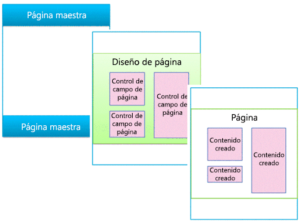
  
    
    

### Páginas maestras

Una página maestra define el cromo (los elementos de marco compartidos) de su sitio. Estos elementos pueden incluir el encabezado y el pie, la navegación superior, las rutas de navegación, el cuadro de búsqueda, el logotipo del sitio y otros elementos de personalización de marca. La página maestra permanece igual mientras los usuarios navegan por el sitio.
  
    
    

**Figura 2. Página maestra**

  
    
    

  
    
    
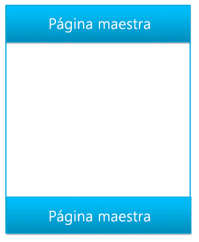
  
    
    
Una página maestra también define regiones llamadas marcadores de posición de contenido que se completan con contenido de regiones coincidentes en diseños de páginas. Lo más frecuente es que el cuerpo de una página maestra contenga únicamente un solo marcador de posición de contenido (llamado **PlaceHolderMain**, que se crea automáticamente), y todo el contenido del diseño de una página aparece dentro de este marcador de posición de contenido (el marcador de posición de contenido **PlaceHolderMain** aparece marcado en rojo en la Figura 3).
  
    
    

**Figura 3. Página maestra con diseño de página marcado**

  
    
    

  
    
    
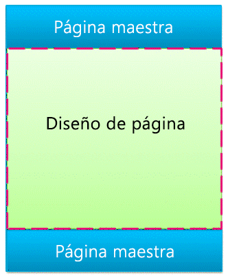
  
    
    
Cuando esté viendo una vista previa de una página maestra en el Administrador de diseño, verá el siguiente mensaje. Esta etiqueta **
** se encuentra dentro del marcador de posición de contenido principal. De forma más sencilla, la página maestra define el cromo de una página, y el diseño de página define el cuerpo contenido en el marcador de posición de contenido principal.
  
    
    

**Figura 4. Mensaje de vista previa de página maestra**

  
    
    

  
    
    
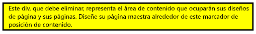
  
    
    

  
    
    

  
    
    

### Diseños de página

Un diseño de página es una plantilla para un tipo específico de página en su sitio, como la página de un artículo o una página de detalles de productos. Como su nombre implica, puede considerar que el diseño de una página define el diseño o la estructura del cuerpo de una página.
  
    
    

**Figura 5. Diseño de página**

  
    
    

  
    
    
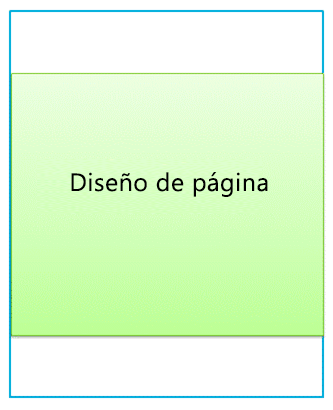
  
    
    
Los diseños de páginas definen regiones o áreas de contenido que se asignan a marcadores de posición de contenido en la página maestra (en rojo en la Figura 6). Nuevamente, la situación más frecuente es que el diseño de una página defina una sola región de contenido que se asigna a un solo marcador de posición de contenido creado automáticamente en una página maestra.
  
    
    

**Figura 6. Región de contenido y marcador de posición de contenido**

  
    
    

  
    
    
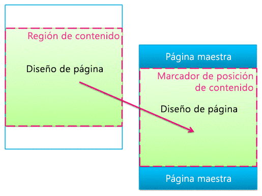
  
    
    

  
    
    

  
    
    

### Controles de campos de página

El objetivo principal del diseño de una página es ordenar los campos de página. Cuando diseña el diseño de una página, inserta, posiciona y aplica estilo a elementos denominados controles de campos de página. Estos controles tendrán contenido a través del tiempo cuando un autor cree una página basada en ese diseño de página. Además de los campos de página, los diseños de páginas también pueden contener zonas de elementos web, a las que pueden agregar elementos web los autores de contenido. (Las páginas maestras no pueden contener zonas de elementos web).
  
    
    
Con un control de campo de página, puede definir los estilos usados por el contenido. Los autores pueden agregar contenido a una página, pero el diseñador tiene el control definitivo sobre la manera en que se representa el contenido.
  
    
    

**Figura 7. Diseño de página con controles de campos de página**

  
    
    

  
    
    
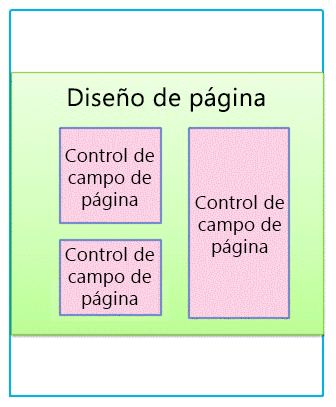
  
    
    
Todo diseño de página está asociado con un tipo de contenido en la biblioteca Páginas de un sitio. Un tipo de contenido es un esquema de columnas y tipos de datos. Para cualquier diseño de página, los campos de página que están disponibles para ese diseño corresponden directamente a las columnas definidas para el tipo de contenido de ese diseño de página.
  
    
    

### Relación de páginas maestras y diseños de páginas

En conjunto, una página maestra y un diseño de página crean una página de contenido.
  
    
    

**Figura 8. Página maestra con diseño de página**

  
    
    

  
    
    
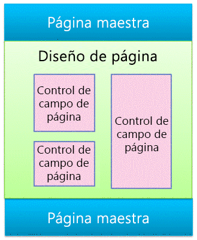
  
    
    
La página maestra define el cromo para todas las páginas del sitio; por lo tanto, a menudo muchos diseños de páginas (y por lo tanto, muchas páginas creadas a partir de esos diseños de páginas) están asociados con una página maestra.
  
    
    

**Figura 9. Una página maestra ligada a tres diseños de página**

  
    
    

  
    
    
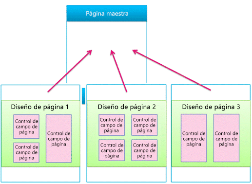
  
    
    
Pero, su sitio posiblemente use varias páginas maestras. Por ejemplo, además de la página maestra predeterminada, también puede tener una o más páginas maestras que estén dirigidas a dispositivos específicos como teléfonos inteligentes o tabletas. En este caso, un diseño de página también es usado por muchas páginas maestras (vea la sección sobre canales de dispositivo).
  
    
    
Puede usar una página maestra por canal por sitio de SharePoint.
  
    
    

### Páginas

Los autores pueden crear páginas y agregar contenido a los campos de página, y pueden agregar elementos web a cualquier zona de elementos web o editores de texto enriquecido. Las páginas están estructuradas de forma que los autores de contenido no puedan hacer cambios fuera de los campos de página.
  
    
    

**Figura 10. Página con contenido creado**

  
    
    

  
    
    
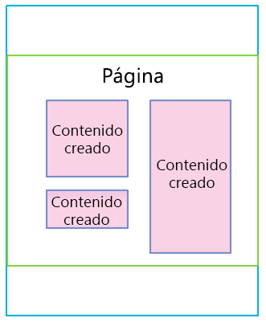
  
    
    
La página representada es lo que ven las personas que visitan el sitio. Cuando el explorador solicita una página, la página maestra se combina con un diseño de página para crear una página de contenido, y el contenido para esa página se combina en campos de página de dicha página en la biblioteca Páginas.
  
    
    

**Figura 11. Página representada en el explorador**

  
    
    

  
    
    
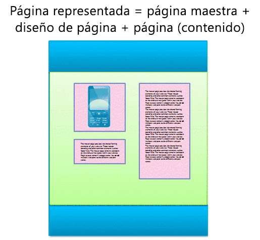
  
    
    

**Figura 12. Página maestra, diseño de página y página**

  
    
    

  
    
    
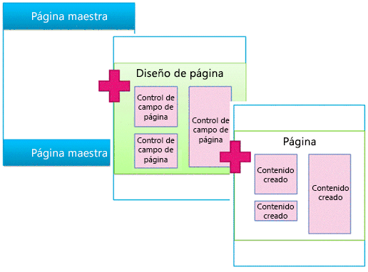
  
    
    

  
    
    

  
    
    

## Elementos web y plantillas de visualización controlados por búsqueda

En la sección anterior se explicó el modelo de páginas de SharePoint en términos de páginas maestras, diseños de páginas (con campos de página), y páginas. Estos elementos son los más frecuentes en un sitio de publicación en el que los autores regularmente crean y publican nuevo contenido. Sin embargo, a la hora de exponer el contenido en el sitio entran un par de elementos más en juego. Tanto si está conectado a un catálogo externo como si solo quiere mostrar un conjunto determinado de resultados de búsqueda, los elementos web controlados por búsqueda le ayudarán a lograr su objetivo.
  
    
    
En el escenario de páginas controladas por búsqueda, una página de SharePoint contiene estos tres elementos principales:
  
    
    

- Páginas maestras
    
  
- Diseños de página:
    
  - Diseños de página normales que creó para tipos de contenido específicos, tal y como se describía anteriormente en este artículo
    
  
  - Diseños de página de categoría y detalles del artículo que se crean mediante la publicación entre sitios de un catálogo
    
  
- Páginas
    
  
- Elementos web controlados por búsqueda, como el elemento web de búsqueda de contenido
    
  
- Plantillas de visualización para controlar qué propiedades administradas aparecen en los resultados de búsqueda de un elemento web controlado por búsqueda, y controlan el estilo y comportamiento de dichos resultados de búsqueda:
    
  - Plantillas de visualización de control, que controlan el diseño de los resultados de búsqueda y cualquier elemento común a todos los resultados como paginado, orden y otros vínculos
    
  
  - Plantillas de visualización de elementos, que controlan de qué manera se muestra cada resultado de búsqueda y se repite para cada resultado
    
  

**Figura 13. Página maestra, diseño de página y página con elemento web**

  
    
    

  
    
    
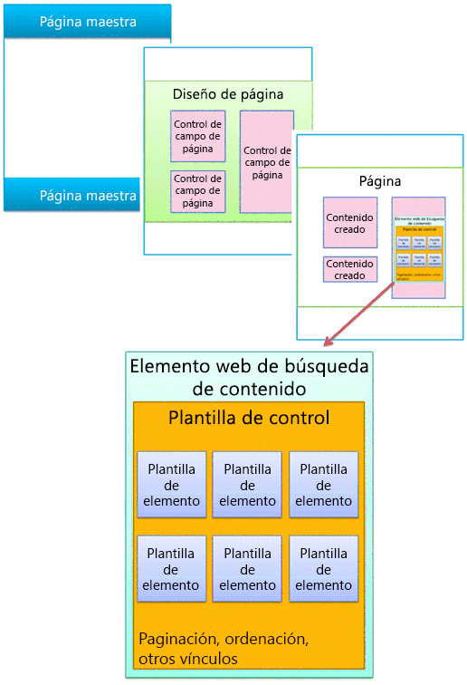
  
    
    

### Elementos web controlados por búsqueda

Con elementos web controlados por búsqueda, puede presentar dinámicamente información almacenada en el índice de búsqueda. La presentación de datos en el elemento web Búsqueda de contenido está controlada por plantillas de visualización, que residen en la Galería de página maestra junto con páginas maestras y diseños de páginas.
  
    
    
SharePoint Server 2013 incluye varias plantillas de visualización listas para usar, como las listas y presentaciones con diapositiva para sus elementos web Búsqueda de contenido. Cuando configura un elemento web Búsqueda de contenido en el explorador, elige qué plantillas de visualización se usarán.
  
    
    

**Figura 14. Panel de herramienta del elemento web Búsqueda de contenido**

  
    
    

  
    
    

  
    
    
Los elementos web Búsqueda de contenido usan dos tipos de elementos de visualización, control y elemento. Como parte del diseño o la personalización de marca de su sitio, puede crear plantillas de visualización personalizadas que usen diseños, estilos y comportamientos definidos por usted.
  
    
    

**Figura 15. Dos diagramas de elementos web Búsqueda de contenido**

  
    
    

  
    
    
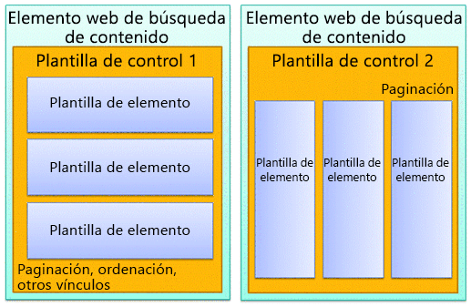
  
    
    

  
    
    

  
    
    

### Plantilla de visualización de control

La plantilla de control determina la estructura y el diseño generales de cómo desea presentar los resultados de búsqueda, como una lista con paginado o una diapositiva. Cada elemento web Búsqueda de contenido usa una plantilla de control.
  
    
    
La plantilla de control también incluye funciones comunes a todos los resultados de búsqueda, incluidos el paginado, la ordenación, las opciones de vista y los separadores.
  
    
    

**Figura 16. Plantilla de control marcada en elemento web y página web**

  
    
    

  
    
    
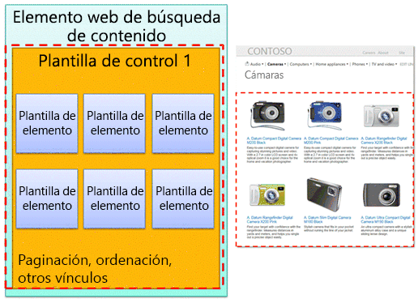
  
    
    

  
    
    

  
    
    

### Plantilla de visualización de elementos

La plantilla de elemento determina de qué manera se muestra cada resultado del conjunto, y la plantilla se repite para cada resultado. Una plantilla de elemento puede mostrar una imagen, una imagen con texto, un vídeo y otro contenido.
  
    
    
La plantilla de visualización de elementos también determina qué propiedades administradas y valores mostrará el elemento web Búsqueda de contenido. En este ejemplo, la plantilla de elemento muestra tres propiedades administradas: una imagen de tamaño pequeño, un nombre de producto como un hipervínculo, y una breve descripción de texto.
  
    
    

**Figura 17. Plantillas de elementos marcadas en elemento web y página web**

  
    
    

  
    
    
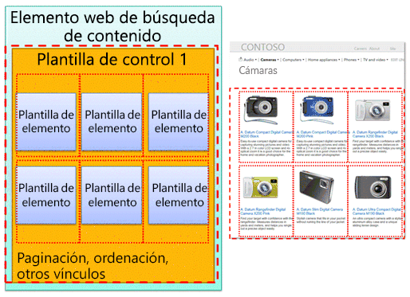
  
    
    

  
    
    

  
    
    

## Canales de dispositivos y paneles de canales de dispositivos

En SharePoint 2013, puede usar canales de dispositivos para representar un solo sitio de publicación de varias maneras con el uso de diseños diferentes para distintos dispositivos. Crea un solo sitio y es el autor del contenido del sitio una sola vez. Después, dicho sitio y ese contenido pueden asignarse para usar diferentes páginas maestras y hojas de estilos para un dispositivo específico o un grupo específico de dispositivos.
  
    
    
Cuando diseñe para más de un dispositivo, tenga en cuenta estos elementos:
  
    
    

- Canales de dispositivos:
    
  - Con el uso de diferentes páginas maestras y CSS por canal, se puede presentar contenido de páginas idéntico de diferentes maneras para dispositivos específicos (por ejemplo, Windows Phone) o grupos de dispositivos (todos los teléfonos inteligentes).
    
  
- Diseños de página:
    
  - Si el contenido no cambia, se usan los mismos diseños de página para todos los canales de dispositivo, aunque se les pueden aplicar diferentes estilos en función de las hojas de estilos CSS de las diferentes páginas maestras de cada canal.
    
  
  - Si desea incluir contenido únicamente para dispositivos específicos, use paneles de canales de dispositivos.
    
  
- Páginas
    
  

### Canales de dispositivo

Cuando crea un canal de dispositivo, especifica las subcadenas de agentes de usuarios para los dispositivos a los que desea que el canal esté dirigido. Esto permite un control preciso sobre qué dispositivos (o exploradores) captura cada canal. Después, asigna una página maestra a ese canal; a su vez, cada página maestra se vincula a su propia hoja de estilos donde el diseño y los estilos están optimizados para ese tipo de dispositivo.
  
    
    

**Figura 18. Dos canales de dispositivo con páginas maestras separadas**

  
    
    

  
    
    
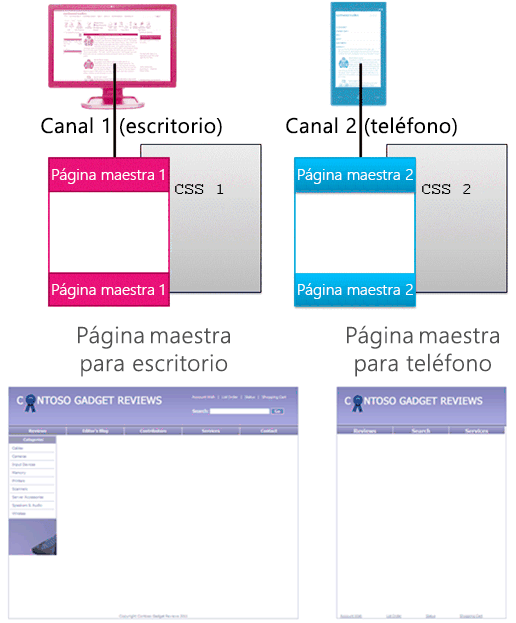
  
    
    
Puede lograr muchas cosas con solo usar las CSS. Es posible que las páginas maestras de dos canales diferentes (por ejemplo, escritorio y teléfono) sean idénticas excepto en que se vinculan a hojas de estilos diferentes. Los archivos de CSS simplemente usan estilos diferentes para los mismos elementos de páginas.
  
    
    

### Relación de páginas maestras y diseños de páginas

A diferencia de las páginas maestras, usted no especifica diseños de páginas diferentes para canales de dispositivo diferentes. Todos los diseños de páginas funcionan con todos los canales que crea. De esta manera, un diseño de página se aplica a una gran cantidad de canales de dispositivo y páginas maestras.
  
    
    
Esta es una de las principales ventajas de los canales de dispositivo: el diseño cambia (la página maestra y CSS), pero el contenido permanece igual (páginas y diseños de páginas). No obstante, puede modificar qué contenido de una página de diseño se muestra en los diferentes canales usando paneles de canales de dispositivo (vea la sección siguiente).
  
    
    

**Figura 19. Un diseño de página funcionando con dos páginas maestras**

  
    
    

  
    
    
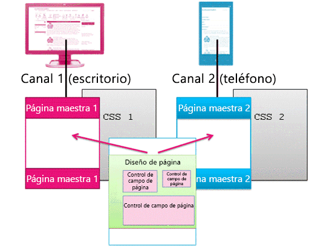
  
    
    

  
    
    

  
    
    

### Paneles de canales de dispositivo

Un panel de canales de dispositivo es un control que puede agregar a una página maestra, un diseño de página o una plantilla de visualización para controlar qué contenido se representa en cada canal. Un panel de canales es básicamente un contenedor que especifica uno o más canales; si uno o más de estos canales están activos cuando se representa la página, también se representa todo el contenido del panel de canales. Un panel de canales puede incluir cualquier tipo de contenido y es una forma fácil de incluir contenido específico para canales específicos.
  
    
    
Posiblemente la situación más común para el uso de paneles de canales sea incluir selectivamente partes del diseño de una página para canales específicos. Por ejemplo, puede tener un diseño de página con campos de texto separados para un saludo extenso y un saludo breve. Al colocar los campos de páginas dentro de paneles de canales, puede visualizar el saludo breve únicamente para teléfonos y el saludo extenso únicamente para PC de escritorio. El contenido de un panel de canales de dispositivo no se muestra a los canales que no incluye, y el contenido del panel de canales de dispositivo no se representa, lo que evita el tráfico de bytes.
  
    
    

**Figura 20. Diseño de página con paneles de canales**

  
    
    

  
    
    
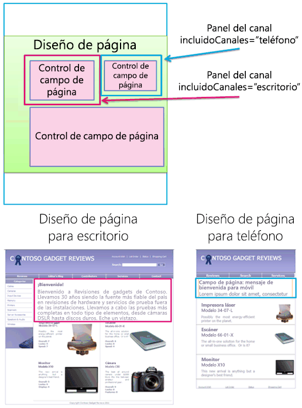
  
    
    
También puede usar paneles de canales en páginas maestras. Por ejemplo, si tiene una página maestra que puede adaptarse a dos dispositivos diferentes (o dos exploradores diferentes) con tan solo cambios mínimos, puede usar paneles de canales para retener el contenido en la página maestra específica para cada uno de esos dispositivos.
  
    
    
O bien, puede usar un panel de canales dentro de la plantilla de visualización de elementos de un elemento web Búsqueda de contenido, para visualizar propiedades administradas adicionales para ese elemento desde el catálogo únicamente para PC de escritorio y no para teléfonos.
  
    
    

**Figura 21. Diseño de página y plantillas de elementos con paneles de canales**

  
    
    

  
    
    
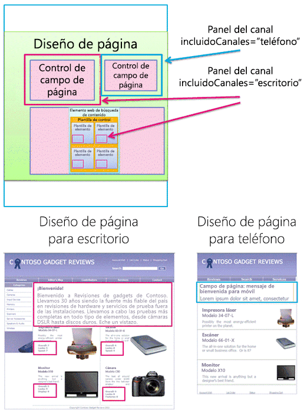
  
    
    

  
    
    

  
    
    

## Recursos adicionales

-  [Información general sobre el Administrador de diseño de SharePoint 2013](overview-of-design-manager-in-sharepoint-2013.md)
    
  
-  [Crear sitios para SharePoint](build-sites-for-sharepoint.md)
    
  
-  [Plantillas para mostrar del Administrador de diseño de SharePoint 2013](sharepoint-2013-design-manager-display-templates.md)
    
  
-  [Canales de dispositivos del Administrador de diseño de SharePoint 2013](sharepoint-2013-design-manager-device-channels.md)
    
  

