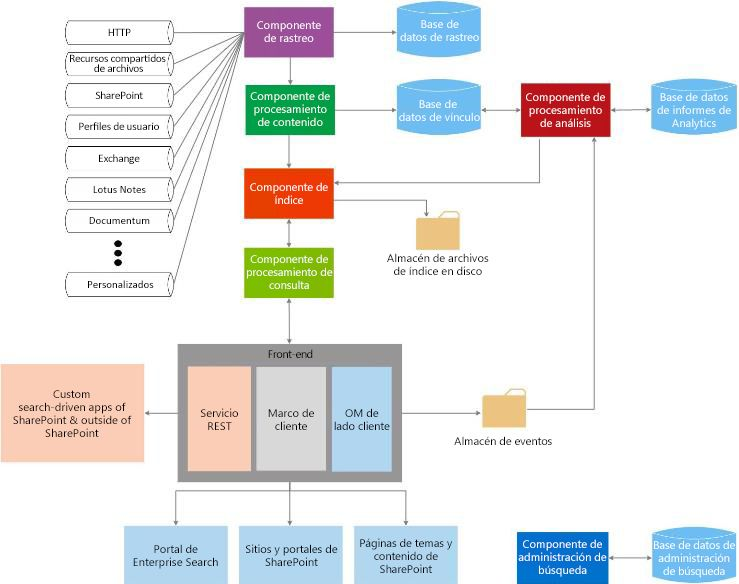

# Buscar en SharePoint 2013
Comprender los bloques de creación de extensibilidad en Buscar en SharePoint 2013 y cómo se pueden usar para adaptarse a los casos de uso.
Buscar en SharePoint 2013 permite a los usuarios buscar información pertinente de manera más rápida y fácil que nunca y facilita a los administradores de búsquedas la personalización de la experiencia de búsqueda. También proporciona varios conjuntos de API que permiten personalizaciones y soluciones más avanzadas.
  
    
    

Consulte los siguientes artículos para obtener una buena introducción sobre conceptos de desarrollo generales de SharePoint 2013. Le resultará útil revisar lo siguiente antes de continuar:
-  [Configurar un entorno de desarrollo general para SharePoint 2013](set-up-a-general-development-environment-for-sharepoint-2013.md)
    
  
-  [Elegir el conjunto de API correcto en SharePoint 2013](choose-the-right-api-set-in-sharepoint-2013.md)
    
  
-  [Complementos para SharePoint comparadas con las soluciones de SharePoint](sharepoint-add-ins-compared-with-sharepoint-solutions.md)
    
  
-  [Decidir entre SharePoint complementos y soluciones de SharePoint](deciding-between-sharepoint-add-ins-and-sharepoint-solutions.md)
    
  

## Introducción a la arquitectura de búsqueda

Buscar en SharePoint 2013 incluye una gran variedad de mejoras y características nuevas. Con esta versión, se ha rediseñado Buscar en SharePoint 2013 de modo que sea una plataforma de búsqueda empresarial única. La arquitectura de búsqueda consta de las siguientes áreas:
  
    
    

-  [Rastreo y procesamiento de contenido](#bk_crawl)
    
  
-  [Indice](#bk_index)
    
  
-  [Procesamiento de consultas](#bk_query)
    
  
-  [Administración de búsquedas](#bk_searchadmin)
    
  
-  [Análisis](#bk_analytics)
    
  
Estas áreas constan de componentes y bases de datos que funcionan conjuntamente para realizar la operación de búsqueda. En la figura 1 se proporciona una visión general de las diferentes áreas de la arquitectura de búsqueda. Sus componentes y bases de datos trabajan conjuntamente para realizar la operación de búsqueda. 
  
    
    

**Figura 1. Interacción de componentes de búsqueda**

  
    
    

  
    
    

  
    
    
Para obtener una vista más detallada, consulte  [Diagramas técnicos: Búsqueda](http://technet.microsoft.com/es-es/library/cc263199.aspx#search) e [Introducción a la búsqueda en SharePoint Server 2013](http://technet.microsoft.com/es-es/library/jj219738.aspx).
  
    
    

### Rastreo y procesamiento de contenido

La arquitectura de rastreo y procesamiento de contenido consta de lo siguiente:
  
    
    
 **Componente de rastreo**
  
    
    
 Rastrea los orígenes de contenido para recopilar propiedades rastreadas y metadatos de los elementos rastreados y enviar esta información al componente de procesamiento de contenido.
  
    
    
 **Base de datos de rastreo**
  
    
    
 Contiene información sobre los elementos rastreados, como la hora del último rastreo, el identificador del último rastreo y el tipo de actualización durante el último rastreo.
  
    
    
 **Componente de procesamiento de contenido**
  
    
    
 Rastrea los orígenes de contenido para recopilar propiedades rastreadas y metadatos de los elementos rastreados y enviar esta información al componente de índice.
  
    
    

### Indice

El componente de índice recibe los elementos procesados del componente de procesamiento de contenido y los escribe en el índice de búsqueda. Este componente también controla las consultas entrantes, recupera la información del índice de búsqueda y devuelve el conjunto de resultados al componente de procesamiento de consultas.
  
    
    

### Procesamiento de consultas

El componente de procesamiento de consultas analiza y procesa las consultas de búsqueda y los resultados. La consulta procesada se envía al componente de índice que, a su vez, devuelve un conjunto de resultados de búsqueda para la consulta.
  
    
    

### Administración de búsquedas

La administración de búsquedas está formada por el componente de administración de búsquedas y su base de datos correspondiente.
  
    
    
 **Componente de administración de búsquedas**
  
    
    
 Ejecuta los procesos de sistema de búsqueda y agrega e inicia nuevas instancias de los componentes de búsqueda.
  
    
    
 **Base de datos de administración de búsqueda**
  
    
    
Almacena datos de configuración de búsqueda.
  
    
    

### Análisis

La arquitectura de análisis consiste en el componente de procesamiento de análisis, la base de datos de informes de análisis y la base de datos de vínculos.
  
    
    
 **Componente de procesamiento de análisis**
  
    
    
Realiza análisis de búsquedas y de uso.
  
    
    
 **Base de datos de vínculos**
  
    
    
Almacena la información que extrae el componente de procesamiento de contenido e información de búsqueda mediante clic.
  
    
    
 **Base de datos de informes de análisis**
  
    
    
Almacena los resultados de los análisis de uso.
  
    
    
 **Almacén de eventos**
  
    
    
Almacena los eventos de utilización que se capturan en el front-end.
  
    
    

## Puntos de extensibilidad de búsqueda

La arquitectura de Buscar en SharePoint 2013 proporciona varios puntos de extensibilidad que permiten admitir escenarios de personalización. En esta sección, describiremos estos puntos y le mostraremos dónde puede encontrar más información de desarrollo para estos escenarios.
  
    
    

### Marco del conector

El componente de rastreo rastrea el contenido mediante la invocación de conectores o controladores de protocolo que interactúan con orígenes de contenido para recuperar datos. Buscar en SharePoint 2013 incluye un marco de conector que puede usar para personalizar y crear conectores para rastrear orígenes de contenido nuevo. Para obtener información detallada sobre la arquitectura del marco de conector y cómo extenderla, consulte  [Buscar marco de conectores en SharePoint 2013](search-connector-framework-in-sharepoint-2013.md).
  
    
    

### Procesamiento de contenido personalizado

Dentro del componente de procesamiento de contenido, puede usar la llamada del servicio web de enriquecimiento de contenido para modificar las propiedades administradas de los elementos rastreados antes de que se agreguen al índice de búsqueda. Esta llamada del servicio web llama a cualquier servicio web de enriquecimiento de contenido externo que cree. Para obtener más información, vea  [Procesamiento de contenido personalizado con la llamada del servicio web de Enriquecimiento de contenido](custom-content-processing-with-the-content-enrichment-web-service-callout.md). Para ver una implementación paso a paso de un servicio web de enriquecimiento de contenido, consulte  [Cómo: usar la llamada de servicio web de enriquecimiento de contenido de SharePoint Server](how-to-use-the-content-enrichment-web-service-callout-for-sharepoint-server.md). Otro buen recurso es la entrada de blog  [Customize the SharePoint 2013 search experience with a Content Enrichment web service](http://blogs.msdn.com/b/sharepointdev/archive/2012/11/13/customize-the-sharepoint-2013-search-experience-with-a-content-enrichment-web-service.aspx) (Personalizar la experiencia de búsqueda de SharePoint 2013 con un servicio web de enriquecimiento contenido).
  
    
    

### API de consulta

Buscar en SharePoint 2013 tiene varias API de consulta, lo que le ofrece muchas formas de obtener acceso a los resultados de búsqueda. De este modo, puede devolver resultados de búsqueda en una gran variedad de tipos de soluciones personalizadas.
  
    
    
La tabla 1 muestra las API que puede usar al programa Buscar en SharePoint 2013 y dónde encontrarlas.
  
    
    

**Tabla 1. Las API de búsqueda**

|**Nombre de la API**|**Biblioteca de clases o esquema y ruta de acceso**|
|:-----|:-----|
|Modelo de objetos de cliente de .NET (CSOM)    |Microsoft.SharePoint.Client.Search.dll          %ProgramFiles%\\Common Files\\Microsoft Shared\\web server extensions\\15\\ISAPI    |
|Silverlight CSOM    |Microsoft.SharePoint.Client.Search.Silverlight.dll          %ProgramFiles%\\Common Files\\Microsoft Shared\\web server extensions\\15\\TEMPLATE\\LAYOUTS\\ClientBin    |
|JavaScript CSOM    |SP.search.js          %ProgramFiles%\\Common Files\\Microsoft Shared\\web server extensions\\15\\TEMPLATE\\LAYOUTS    |
|Extremos del servicio de transferencia de estado representacional (REST)    |http://server/_api/search/query          http://server/_api/search/suggest    |
|Modelo de objetos de servidor    |Microsoft.Office.Server.Search.dll          %ProgramFiles%\\Common Files\\Microsoft Shared\\web server extensions\\15\\ISAPI    |
   
Para obtener más información, vea  [Usar las API de consulta de búsqueda en SharePoint 2013](using-the-sharepoint-2013-search-query-apis.md).
  
    
    

### Análisis

Para ayudar a identificar y exponer el contenido que los usuarios consideren que es el más útil y pertinente, el componente de procesamiento de análisis analiza tanto el propio contenido como el modo en que los usuarios interactúan con el mismo. Estos análisis se realizan mediante trabajos del temporizador que son responsables de llevar a cabo tareas del ciclo de vida de análisis, como iniciar, detener, pausar y reanudar un trabajo de análisis cuando se solicite. Puede manipular estos trabajos del temporizador a través del espacio de nombres  [Microsoft.Office.Server.Search.Analytics](https://msdn.microsoft.com/library/Microsoft.Office.Server.Search.Analytics.aspx) . Para obtener información detallada sobre el análisis en SharePoint Server 2013, consulte [Información general del procesamiento de análisis en SharePoint Server 2013](http://technet.microsoft.com/es-es/library/jj219554.aspx).
  
    
    

### Modelos de clasificación personalizados

Los resultados de la búsqueda pueden ordenarse de distintas maneras, entre otras por puntuación. El motor de búsqueda calcula las puntuaciones mediante modelos de clasificación. SharePoint Server 2013 proporciona de manera predeterminada catorce modelos de clasificación. Sin embargo, si no está satisfecho con la manera en que se ordenan los resultados de la búsqueda, puede usar un modelo de clasificación personalizado. Para obtener más información sobre el proceso de creación de un modelo de clasificación personalizado y sus ajustes, consulte  [Personalización de los modelos de clasificación para mejorar la relevancia en SharePoint 2013](customizing-ranking-models-to-improve-relevance-in-sharepoint-2013.md).
  
    
    

### Recorte de seguridad personalizado

La búsqueda en SharePoint Server 2013 realiza el recorte de seguridad de los resultados de la búsqueda que se basan en la identidad del usuario que envía la consulta, en el momento de la consulta, usando la información de seguridad obtenida a partir del componente de rastreo. Sin embargo, en algunos casos, puede que tenga que implementar el recorte de seguridad personalizado. SharePoint Server 2013 proporciona dos interfaces para llevar a cabo esta tarea:  [ISecurityTrimmerPre](https://msdn.microsoft.com/library/Microsoft.Office.Server.Search.Query.ISecurityTrimmerPre.aspx) y [ISecurityTrimmerPost](https://msdn.microsoft.com/library/Microsoft.Office.Server.Search.Query.ISecurityTrimmerPost.aspx) .
  
    
    
La interfaz del optimizador previo ( **ISecurityTrimmerPre**) lleva a cabo la evaluación de la consulta previa, en la que se vuelve a escribir la consulta de búsqueda para agregar información de seguridad antes de que la consulta de la búsqueda se haga coincidir con el índice de búsqueda. Por el contrario, la interfaz del optimizador posterior ( **ISecurityTrimmerPost**) lleva a cabo la evaluación de la consulta posterior, en la que se eliminan los resultados de la búsqueda antes de devolverlos al usuario. Para obtener más información sobre las dos interfaces, consulte  [Recorte de seguridad personalizado para la búsqueda en SharePoint Server 2013](custom-security-trimming-for-search-in-sharepoint-server-2013.md). Para obtener información paso a paso sobre cómo implementar una interfaz de optimizador de seguridad, consulte  [Tutorial: Uso de un optimizador de seguridad personalizado para los resultados de la búsqueda de SharePoint Server](how-to-use-a-custom-security-trimmer-for-sharepoint-server-search-results.md).
  
    
    

### Elemento web Búsqueda de contenido

El elemento web de búsqueda de contenido es un elemento web que puede mostrar contenido dinámico previamente rastreado y agregado al índice de búsqueda. Cada instancia del elemento web está asociada con una consulta de búsqueda y muestra los resultados de esa consulta de búsqueda determinada. Cuando los usuarios examinan una página que contiene el elemento web de búsqueda de contenido, se emite automáticamente una consulta de búsqueda y se devuelven desde el índice de búsqueda los resultados de la búsqueda correspondientes. Puede usar el elemento web de búsqueda de contenido siempre que quiera mostrar contenido rellenado por consultas de búsqueda generadas automáticamente. En algunos casos, es aconsejable extender el elemento web de búsqueda de contenido, que se expone a través del espacio de nombres  [Microsoft.Office.Server.Search.WebControls](https://msdn.microsoft.com/library/Microsoft.Office.Server.Search.WebControls.aspx) como [ContentBySearchWebPart](https://msdn.microsoft.com/library/Microsoft.Office.Server.Search.WebControls.ContentBySearchWebPart.aspx) . Para obtener información sobre cómo extender [ContentBySearchWebPart](https://msdn.microsoft.com/library/Microsoft.Office.Server.Search.WebControls.ContentBySearchWebPart.aspx) para que el elemento web comprenda las propiedades personalizadas, vea [Segmentación de usuarios en SharePoint 2013](user-segmentation-in-sharepoint-2013.md).
  
    
    

### Aplicaciones móviles basadas en búsquedas que usan las interfaces REST de navegación y registro de eventos

SharePoint Server 2013 proporciona dos nuevas interfaces de REST: navegación y registro de eventos. Puede usarlas para crear aplicaciones móviles basadas en búsquedas para dispositivos móviles, como teléfonos y tabletas, que se ejecutan en sistemas operativos distintos de Windows. Esta característica le permite mostrar el catálogo de productos en un dispositivo móvil de manera alternativa, en lugar de usar un canal móvil. Vea  [Cómo crear aplicaciones móviles impulsadas por búsquedas con las interfaces REST de navegación y registro de eventos](how-to-build-search-driven-mobile-apps-with-the-navigation-and-event-logging-res.md) para obtener un ejemplo detallado de cómo crear una aplicación de este tipo.
  
    
    

## En esta sección

-  [Novedades en la búsqueda para desarrolladores en SharePoint 2013](what-s-new-in-sharepoint-2013-search-for-developers.md)
    
  
-  [Buscar contenido nuevo con la búsqueda de SharePoint](searching-new-content-with-sharepoint-search.md)
    
  
-  [Configurar la búsqueda en SharePoint 2013](configure-search-in-sharepoint-2013.md)
    
  
-  [Generar consultas de búsqueda en SharePoint 2013](building-search-queries-in-sharepoint-2013.md)
    
  
-  [Información general de la API de REST de SharePoint Search](sharepoint-search-rest-api-overview.md)
    
  
-  [Personalización de los resultados de búsqueda en SharePoint 2013](customizing-search-results-in-sharepoint-2013.md)
    
  
-  [Ordenar los resultados de búsqueda en SharePoint 2013](sorting-search-results-in-sharepoint-2013.md)
    
  
-  [Personalización de los modelos de clasificación para mejorar la relevancia en SharePoint 2013](customizing-ranking-models-to-improve-relevance-in-sharepoint-2013.md)
    
  
-  [Recorte de seguridad personalizado para la búsqueda en SharePoint Server 2013](custom-security-trimming-for-search-in-sharepoint-server-2013.md)
    
  
-  [Exportación e importación de configuración de búsqueda en SharePoint 2013](exporting-and-importing-search-configuration-settings-in-sharepoint-2013.md)
    
  

## Recursos adicionales

-  [Cambios entre SharePoint 2010 y SharePoint 2013](http://technet.microsoft.com/es-es/library/ff607742.aspx)
    
  
-  [Diagramas técnicos: Búsqueda](http://technet.microsoft.com/es-es/library/cc263199.aspx#search)
    
  
-  [Agregar capacidades de SharePoint 2013](add-sharepoint-2013-capabilities.md)
    
  
