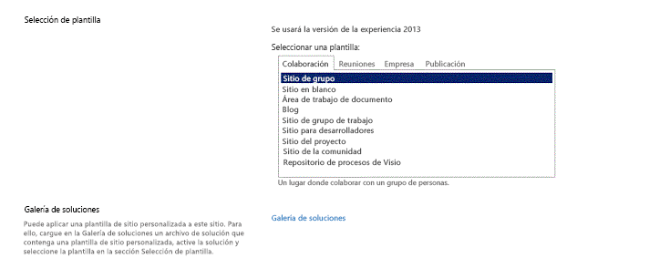

# Configurar un entorno de desarrollo general para SharePoint 2013
Obtenga información sobre los pasos para configurar un entorno de desarrollo de SharePoint mediante la instalación de SharePoint y Visual Studio.
## Cómo determinar el entorno de desarrollo de SharePoint que necesita
<a name="SP15_bk_determinedevenv"> </a>

Primero, decida qué desea crear (para obtener más información acerca de Complementos de SharePoint, consulte  [Complementos de SharePoint](http://msdn.microsoft.com/library/cd1eda9e-8e54-4223-93a9-a6ea0d18df70%28Office.15%29.aspx)):
  
    
    

- Si quiere crear soluciones de granja de servidores, le indicamos los pasos necesarios en este artículo.
    
  
- Si quiere crear Complementos de SharePoint, consulte  [Herramientas y entornos para desarrollar complementos para SharePoint](http://msdn.microsoft.com/library/6906eb86-8270-4098-8106-1e8d0d3c212e%28Office.15%29.aspx).
    
  

## Crear un entorno de desarrollo de SharePoint en una máquina virtual Microsoft Azure
<a name="SP15_bk_devenvazure"> </a>

Si tiene una suscripción de MSDN, puede aprovisionar rápidamente una máquina virtual en Azure.
  
    
    
Si no ha activado las ventajas de Microsoft Azure incluidas en la suscripción a MSDN, puede obtener más información en  [Ventajas de Microsoft Azure para suscriptores de MSDN](http://azure.microsoft.com/es-es/pricing/member-offers/msdn-benefits/).
  
    
    

> **NOTA**
> La Galería de imágenes de Microsoft Azure ya no proporciona imágenes si SharePoint y Visual Studio están preinstalados. No obstante, una máquina virtual de Microsoft Azure sigue siendo una buena opción para un equipo de desarrollo. > Inicie sesión en el  [portal de administración de Microsoft Azure](https://manage.windowsazure.com). > Cree una máquina virtual usando una de las imágenes en la galería de Windows Server 2008 R2 Service Pack 1 x64, Windows Server 2012 (o versiones posteriores). Siga las instrucciones proporcionadas por el asistente para la creación de máquinas virtuales. Se recomienda un tamaño de memoria virtual **X-Grande** para el desarrollo de SharePoint.> Una vez el equipo esté aprovisionado y en funcionamiento, complete la configuración mediante los mismos procedimientos de la sección **Crear un entorno de desarrollo de SharePoint local**. (Omita la sección acerca de cómo instalar el sistema operativo).> Una vez configurado el entorno de desarrollo, podrá obtener acceso al control de código fuente de Visual Studio en la máquina virtual mediante una conexión de punto a sitio de Azure. Consulte  [Configuración de una conexión VPN de punto a sitio a una red virtual](https://azure.microsoft.com/es-es/documentation/articles/vpn-gateway-point-to-site-create/) para obtener instrucciones para hacerlo.
  
    
    


## Crear un entorno de desarrollo de SharePoint local
<a name="SP15_bk_devenvazure"> </a>


  
    
    

### Instalar el sistema operativo para su entorno de desarrollo de Complementos de SharePoint
<a name="SP15_bk_InstallOS"> </a>

Los requisitos para un entorno de desarrollo para instalar SharePoint son menos restrictivos y costosos que los requisitos para un entorno de producción. En todos los entornos de desarrollo, se debe usar un equipo con una CPU de x64 y al menos 16 GB de RAM para instalar y ejecutar SharePoint. Es preferible 24 GB de RAM. En función de sus requisitos y de su presupuesto, puede elegir una de las siguientes opciones:
  
    
    

- Instalar SharePoint en Windows Server 2008 R2 Service Pack 1 x64 o en Windows Server 2012 (o versiones posteriores).
    
  
- Use Microsoft Hyper-V e instale SharePoint en una máquina virtual que tenga el sistema operativo invitado Windows Server 2008 R2 Service Pack 1 x64 o Windows Server 2012. En  [Procedimientos recomendados para la configuración de las máquinas virtuales de SharePoint 2013 y del entorno de Hyper-V](http://technet.microsoft.com/es-es/library/ff621103%28v=office.15%29.aspx) encontrará los pasos a seguir para configurar una máquina virtual de Microsoft Hyper-V virtual para SharePoint.
    
  

### Instalar los requisitos previos del desarrollo de aplicaciones para el sistema operativo y SharePoint 2013
<a name="SP15_bk_prereqsOS"> </a>

SharePoint requiere que el sistema operativo tenga instalados algunos requisitos previos antes de comenzar la instalación. Por este motivo, SharePoint incluye una herramienta PrerequisiteInstaller.exe que instala todos los requisitos previos automáticamente. Ejecute esta herramienta antes de ejecutar la herramienta Setup.exe.
  
    
    

1. Ejecute la herramienta PrerequisiteInstaller.exe.
    
  
2. Ejecute la herramienta Setup.exe que se incluye junto con los archivos de instalación.
    
  
3. Acepte los Términos de licencia del software de Microsoft.
    
  
4. En la página **Elija la instalación que desea**, elija **Independiente**.
    
   **Figura 2. Opción de tipo de instalación**

  


  

  

  
5. Si se producen errores en la instalación, revise el archivo de registro. Para buscar el archivo de registro, abra una ventana con el símbolo del sistema y luego escriba los siguientes comandos en este símbolo del sistema. Aparecerá asimismo un vínculo al archivo de registro cuando se complete la instalación.
    
  ```
  
cd %temp
dir /od *.log
  ```

6. Una vez completa la instalación, se le pide que inicie el Asistente para configuración de productos y tecnologías de SharePoint.
    
    > **NOTA**
      > Puede ocurrir un error en el Asistente para configuración de productos y tecnologías de SharePoint si está usando un equipo que está unido a un dominio pero no está conectado a un controlador de dominio. Si esto ocurre, conecte a un controlador de dominio directamente o mediante una conexión de red privada virtual (VPN), o inicie sesión con una cuenta local que tenga privilegios administrativos en el equipo. 
7. Una vez completado el asistente para configuración, verá la página **Selección de plantilla** del nuevo sitio de SharePoint.
    
   **Figura 3. Página de selección de la plantilla de sitio**

  


  

  

  

### Instalar Visual Studio
<a name="SP15_bk_installVS"> </a>

Cuando instala Visual Studio, obtiene todas las plantillas, herramientas y ensamblados para desarrollar SharePoint en su equipo de desarrollo local.
  
    
    
Consulte  [Instalar Visual Studio](http://msdn.microsoft.com/es-es/library/e2h7fzkw.aspx) para obtener las instrucciones de instalación de Visual Studio.
  
    
    

#### Registro detallado en Visual Studio

Siga estos pasos si desea activar el registro detallado:
  
    
    

1. Abra el Registro y vaya a **HKEY_CURRENT_USER\\Software\\Microsoft\\VisualStudio\\ _nn.n_\\SharePointTools**, donde _nn.n_ es la versión de Visual Studio, como 12.0 o 14.0.
    
  
2. Agregue una clave DWORD llamada **EnableDiagnostics**.
    
  
3. Asigne el valor **1** a la clave.
    
  
La ruta de acceso del Registro cambiará en futuras versiones de Visual Studio.
  
    
    

## Pasos siguientes
<a name="SP15_bk_devenvazure"> </a>

Si va a crear flujos de trabajo, siga con  [Instalar y configurar el Administrador de flujos de trabajo de SharePoint 2013](set-up-and-configure-sharepoint-2013-workflow-manager.md).
  
    
    

## Recursos adicionales
<a name="SP15_bk_AddlResources"> </a>


-  [Instalar Visual Studio](http://msdn.microsoft.com/es-es/library/e2h7fzkw.aspx)
    
  
-  [Herramientas y entornos para desarrollar complementos para SharePoint](http://msdn.microsoft.com/library/6906eb86-8270-4098-8106-1e8d0d3c212e%28Office.15%29.aspx)
    
  

  
    
    

