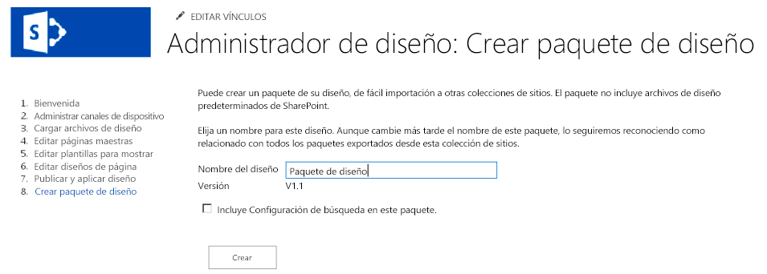

# Paquetes de diseño del Administrador de diseño de SharePoint 2013
Aprenda a crear y exportar el diseño visual de una colección de sitios de SharePoint como un paquete.
## Información general sobre los paquetes de diseño

En SharePoint 2013, Administrador de diseño puede ayudar a los diseñadores y desarrolladores web a crear y exportar el diseño visual de una colección de sitios de SharePoint como un paquete. Este paquete se puede distribuir fácilmente entre los clientes, o entre otros grupos designados, para la instalación en sus colecciones de sitios. Esta nueva característica reduce la complejidad del transporte de diseños y facilita a los clientes delegar el diseño visual de sus sitios. Por ejemplo, algunos escenarios de uso pueden incluir lo siguiente:
  
    
    

- **Nuevo diseño**: una empresa con unas capacidades limitadas para el diseño web puede contratar a una agencia proveedora para actualizar su sitio de SharePoint actual con una interpretación más moderna. La Agencia puede crear el sitio y empaquetar fácilmente el contenido para volver a importarlo en la granja de SharePoint de la compañía.
    
  
- **Publicación entre sitios**: el departamento de TI de una empresa, que usa la publicación entre sitios en SharePoint 2013, podría tener que compartir un diseño visual entre varias colecciones de sitios. Crean el sitio internamente y desean tener un método sencillo de transportar el diseño a través de varios sitios web de SharePoint. La funcionalidad del paquete de diseño a través del Administrador de dispositivos les permite exportar e importar con una complejidad y un soporte administrativo reducidos.
    
  
Este artículo puede ayudarle a comprender el empaquetado de diseño en SharePoint 2013, porque proporciona una visión general de la creación de paquetes, así como instrucciones de flujo de trabajo para la exportación e importación de paquetes. También trata los permisos necesarios para operaciones específicas y la arquitectura de los paquetes de diseño.
  
    
    

## Creación de un paquete de diseño

Un usuario crea un paquete de diseño, llamado un paquete de solución de SharePoint (archivo .wsp), en su sitio de SharePoint mediante el Administrador de diseño en **Configuración del sitio**. El paso para crear el paquete viene después de otros pasos del Administrador de diseño para la personalización de marca y publicación de un sitio de SharePoint, que incluyen la carga de archivos de diseño, la creación de una página maestra y la edición de los diseños de página. Después de publicar el sitio, la creación del archivo .wsp para su exportación es un proceso relativamente sencillo.
  
    
    
La figura 1 muestra la opción en el Administrador de diseño para nombrar y crear el paquete de diseño.
  
    
    

**Figura 1. Exportación de un paquete de diseño**

  
    
    

  
    
    

  
    
    
También puede importar un paquete de diseño de otra colección de sitios de SharePoint 2013 mediante el Administrador de diseño en la página principal, o seleccionando **Importar paquete de diseño** en **Configuración del sitio**.
  
    
    

    
> **NOTA**
> Para obtener más información acerca del Administrador de diseño y el proceso de publicación, consulte  [Información general sobre el Administrador de diseño de SharePoint 2013](overview-of-design-manager-in-sharepoint-2013.md). 
  
    
    

Hay una casilla de verificación para incluir la configuración de búsqueda en el paquete de diseño. Esta opción resulta útil si está diseñando un sitio y creando resultados condicionales, o controlando la experiencia de búsqueda. Esta configuración contiene activos como reglas de consulta, orígenes de resultados, tipos de resultados, esquemas o modelos de clasificación. Para asegurarse de que la importación de la configuración de búsqueda no da error, no debe haber nombres duplicados para los elementos de la configuración de búsqueda. Por ejemplo, si tiene una regla de consulta en una colección de sitios llamada **SampleQueryRule**, y la importa en otra colección de sitios con una regla existente llamada **SampleQueryRule**, se producirá un error al importar la configuración de búsqueda. Para evitar esto, puede cambiar el nombre o eliminar la regla de consulta en el origen o en el destino. Los orígenes de resultados y el esquema también deben tener un nombre exclusivo. Si desea incluir una configuración de búsqueda en el paquete de diseño, debe activar las características siguientes a nivel de sitio en **Administrar las características del sitio** antes de exportar el paquete de diseño:
  
    
    

- Tipos de contenido de los datos de configuración de búsqueda
    
  
- Columnas del sitio de los datos de configuración de búsqueda
    
  
- Característica de instancia de lista de configuración de búsqueda
    
  
- Característica de plantilla de configuración de búsqueda
    
  
Si desea que el diseño se publique en el destino de la importación, debe publicar todos los activos de diseño o deshabilitar el control de versiones principal en las bibliotecas de diseño correspondientes en el origen de la exportación. Administrador de diseño solo exporta la versión más reciente de cada activo desde el origen. Por ejemplo, si tiene la versión 1.1 de una página maestra en el origen, se copiará en el destino como borrador. Sin embargo, no se copiará la versión 1.0. Además, no se exportarán los archivos que estén desprotegidos.
  
    
    

## Exportación e importación de un paquete de diseño

Se puede abordar el flujo de trabajo de empaquetado de un extremo a otro de varias formas, en función de sus objetivos y los recursos de diseño disponibles. Puede decidir subcontratar una agencia de proveedor, o hacer el trabajo internamente si dispone de recursos internos. La tabla 1 ofrece un ejemplo de un flujo de trabajo y un intercambio entre un cliente y una agencia de proveedor sobre el diseño, la exportación y la importación del paquete de diseño. También proporciona los permisos necesarios para las operaciones relacionadas con el diseño y las operaciones de empaquetado.
  
    
    

**Tabla 1. Ejemplo de flujo de trabajo de un paquete de diseño**

|**Paso**|**Acción**|**Descripción**|
|:-----|:-----|:-----|
|1    |El cliente contrata una agencia de proveedor para crear un diseño visual.    | El diseñador del proveedor crea el sitio, en función de los requisitos de la compañía.   > **NOTA**>  El diseñador del proveedor debe tener el nivel de permiso **Designers** para utilizar Administrador de diseño y crear y exportar paquetes. Más concretamente, el permiso **Design** que permite ver, agregar, actualizar, eliminar, aprobar y personalizar diseños visuales.          |
|2    |El diseñador del proveedor exporta el diseño visual a un paquete de diseño.    | El diseñador del proveedor exporta el paquete de solución de SharePoint (archivo .wsp) después de completar los demás pasos de personalización de marca y publicación.    El paquete de diseño se entrega al cliente a través de un canal seguro.   |
|3    |El cliente importa el diseño visual en su colección de sitios de SharePoint 2013 especificada.    | El cliente recibe el paquete de diseño a través de un canal seguro.    A través de la página principal del Administrador de diseño o eligiendo **Importar paquete de diseño** en **Configuración del sitio**, el cliente puede importar el archivo .wsp y aplicar el paquete de diseño a la colección de sitios especificada.    > **NOTA**>  El cliente debe tener el nivel de permiso **Designers** para utilizar Administrador de diseño e importar paquetes de diseño.          |
   

## Descripción del contenido del paquete de diseño

Cuando se crea el paquete de diseño mediante Administrador de diseño, se incluyen varios archivos en el archivo .wsp. El proceso exporta archivos de varias listas y bibliotecas para formar el paquete general. Al importarlos en una colección de sitios, estos archivos se distribuyen a ubicaciones diferentes según el tipo de archivo. La tabla 2 detalla la ubicación y el tipo de archivos exportados durante el proceso de ensamblado.
  
    
    

**Tabla 2. Resumen del contenido del paquete de diseño y las ubicaciones de exportación de los archivos**

|**Ubicación de exportación**|**Activos exportados**|
|:-----|:-----|
|Bibliotecas de documentos    | Galería de páginas maestras    Galería de temas    Biblioteca de estilos    Biblioteca de activos del sitio   |
|Tipos de contenido, campos    | Tipos de contenido que heredan del tipo de contenido de página   |
|Listas    | Galería de diseño    Apariencias compuestas    Canales de dispositivo   |
   

> **NOTA**
> En SharePoint 2013, solo los archivos personalizados se incluyen en los paquetes de diseño. El proceso de empaquetado no exportará la mayoría de los archivos de sistema no personalizados predeterminados. 
  
    
    

En SharePoint 2013 no puede desinstalar un paquete de diseño importado y nunca debería intentar desactivar un paquete de diseño a través de la galería de soluciones. Si lo hace, se quitan los tipos de contenido del diseño de página y los usuarios no podrán crear subsitios. Para recuperarse de este estado, debe realizar los siguientes pasos donde el sitio A = la colección de sitios original, el sitio B = la colección de sitios con el paquete de diseño desactivado (estado incorrecto) y el sitio C = una colección de sitios en blanco que ha creado:
  
    
    

1. Exportar un paquete de diseño del sitio A
    
  
2. Importar el paquete de diseño al sitio C
    
  
3. Exportar un paquete de diseño del sitio B
    
  
4. Importar el paquete de diseño al sitio C
    
  
5. Exportar el paquete de diseño del sitio C
    
  
6. Importar el paquete de diseño al sitio B
    
  
Cualquiera de los canales de dispositivo creados junto a sus configuraciones, también se importan cuando se descarga el paquete de diseño. Sin embargo, tiene que volver a asociar páginas maestras a canales de dispositivo especificados porque estas asignaciones no se configurarán.
  
    
    
Al importar un paquete de diseño, no se establece una dirección URL de CSS alternativa, incluso si se configuró alguna en el origen de exportación. Las clases CSS deben almacenarse en un archivo externo en la Galería de páginas maestras y no en el propio archivo de página maestra.
  
    
    

## Recursos adicionales

-  [Desarrollar el diseño del sitio en SharePoint 2013](develop-the-site-design-in-sharepoint-2013.md)
    
  
-  [Información general sobre el Administrador de diseño de SharePoint 2013](overview-of-design-manager-in-sharepoint-2013.md)
    
  
-  [Novedades sobre el desarrollo de sitios de SharePoint 2013](what-s-new-with-sharepoint-2013-site-development.md)
    
  
