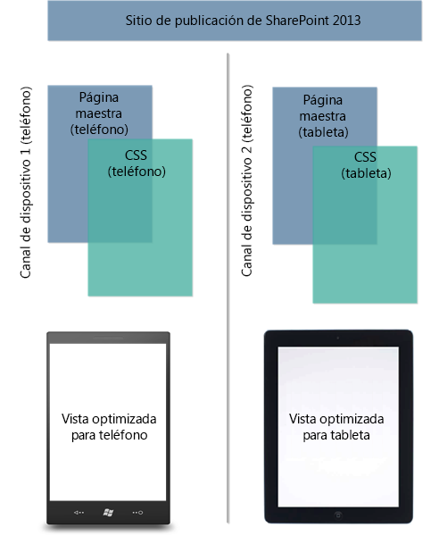
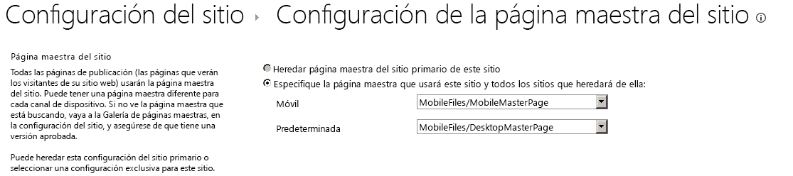

# Canales de dispositivos del Administrador de diseño de SharePoint 2013
Descubra, planee y configure una experiencia de canales de dispositivo en un sitio de SharePoint 2013.
## Introducción a los canales de dispositivo
<a name="Int"> </a>

Explorar la web en un dispositivo móvil se ha vuelto tan común que se debe optimizar un sitio de SharePoint para mejorar la legibilidad y facilidad de uso en smartphones y otros dispositivos móviles como tabletas. Con los canales de dispositivo en SharePoint 2013, puede representar un solo sitio de publicación de varias formas con diferentes diseños pensados para diferentes dispositivos. Este artículo puede ayudarle a planear el uso de la característica de canales de dispositivo en SharePoint 2013. Ofrece una descripción detallada de la propia característica y proporciona la información necesaria para crear un canal de dispositivo. Además, después de leer este artículo, sabrá qué canales de dispositivo se deben implementar y cómo implementarlos.
  
    
    
Los canales de dispositivo solo están disponibles en los sitios de publicación de SharePoint 2013. Antes de implementar canales de dispositivo, ya debe tener un conocimiento general de las partes de un sitio de SharePoint, la forma en que se ensambla una página de SharePoint, así como una descripción general del administrador de diseño. Para obtener más información sobre el modelo de páginas de SharePoint, que incluya la página maestra y los diseños de página, vea  [Información general sobre el modelo de páginas de SharePoint 2013](overview-of-the-sharepoint-2013-page-model.md). Para obtener más información sobre el administrador de diseño, vea  [Información general sobre el Administrador de diseño de SharePoint 2013](overview-of-design-manager-in-sharepoint-2013.md).
  
    
    

## ¿Qué es un canal de dispositivo?
<a name="WhatDev"> </a>

Un canal de dispositivo forma parte de la infraestructura de publicación de SharePoint 2013 que permite representar determinado contenido del sitio, dar estilo al contenido e incluso cambiar imágenes (mientras se mantiene la misma dirección URL en un grupo de dispositivos diferentes. En comparación con la versión de escritorio del sitio de SharePoint, una representación móvil se puede formatear con un ancho menor, tener mejor navegación con destinos táctiles más amplios y mostrar una pequeña cantidad de información para una mejor capacidad de uso. Puede crear un solo sitio, así como crear y editar el contenido una sola vez para todos sus distintos dispositivos móviles. Cuando un usuario explora un sitio de SharePoint desde un dispositivo móvil como un smartphone o una tableta, el explorador móvil envía al sitio una solicitud HTTP GET que incluye una cadena de agente de usuario. Esta cadena contiene información sobre el tipo de dispositivo que intenta acceder al sitio. Según la subcadena de ese dispositivo, el explorador se puede redirigir a una vista de página maestra específica. Por ejemplo, si tiene una colección de dispositivos Windows Phone e iPad, puede proporcionar a cada grupo una representación única del sitio de publicación de SharePoint mediante canales de dispositivo. A cada uno de estos canales de dispositivo se les puede dar una página maestra diferente y, de esta forma, el archivo CSS puede dar a los usuarios una experiencia de visualización más óptima. En la ilustración 1 se muestra el uso de dos canales de dispositivo para proporcionar dos representaciones de sitio únicas para un teléfono y una tableta.
  
    
    
Ilustración 1. Uso de canales de dispositivo en diferentes plataformas de dispositivos
  
    
    

  
    
    

  
    
    
Puede crear y configurar un canal de dispositivo en el menú **Configuración del sitio** en la sección **Apariencia**, o bien a través de la opción **Administrador de diseño** en la misma sección. Cuando se crea un elemento de canal de dispositivo, hay cinco campos obligatorios y opcionales para suministrar el proceso. En la tabla 1 se muestran estos campos y se describe el tipo de información que se debe proporcionar.
  
    
    

**Tabla 1. Campos obligatorios y opcionales para crear un canal de dispositivo**


|**Campo**|**Valor requerido**|**Valor**|
|:-----|:-----|:-----|
|Nombre  <br/> |Sí  <br/> |Este es el nombre del canal de diseño. Puede ser un nombre descriptivo para identificar el canal.  <br/> |
|Alias  <br/> |Sí  <br/> |El nombre de alias permite identificar el canal de dispositivo en el código, los paneles de canales de dispositivo (que se describen más adelante en este artículo), las vistas previas y otros contextos.  <br/> > **IMPORTANTE**> Si posteriormente cambia el alias del canal, tendrá que actualizar manualmente las asignaciones de páginas maestras, los paneles de canales de dispositivo y cualquier tipo de marcado o código personalizado.           |
|Descripción  <br/> |No  <br/> |Un campo para proporcionar una descripción general del canal de dispositivo.  <br/> |
|Reglas de inclusión de dispositivos  <br/> |Sí  <br/> |Un campo para proporcionar la subcadena de agente de usuario como SO Windows Phone. La redirección del dispositivo a una página maestra específica depende de lo que se especifica para este valor. Para obtener más información sobre los valores para especificar en este campo, vea la sección  [Subcadenas de agente de usuario y clasificaciones del canal de dispositivo](#PlanDeviceChannels_UserAgentSubstrings) en este artículo. <br/> |
|Activo  <br/> |No  <br/> |Al activar esta casilla se activa el canal de dispositivo. Si está trabajando en un sitio activo, no debe activar el canal antes de terminar de diseñarlo. Para hacer pruebas, puede usar la cadena de consulta  `?DeviceChannel=alias` dentro de un explorador para obtener una vista previa de su sitio para un canal específico. <br/> |
   

  
    
    

    
> **NOTA**
> Para obtener más información y pasos para crear un canal de dispositivo, vea la sección  [Crear un canal de dispositivo](sharepoint-2013-design-manager-device-channels.md#create) de este artículo.
  
    
    

Tras crear y activar un canal de dispositivo, se hace posible la redirección del dispositivo a una página maestra específica, como una versión móvil. El siguiente paso es especificar la página maestra que debe mostrarse para los dispositivos móviles en el nivel de sitio a través de la **Configuración de la página maestra del sitio** o mediante la opción **Publicar y aplicar** en el Administrador de diseño.
  
    
    

**Ilustración 2. Configuración de páginas maestras para la visualización en dispositivos móviles y la visualización predeterminada en escritorio**

  
    
    

  
    
    

  
    
    
Tal como se muestra en la figura 2, puede asignar una página maestra específica para la visualización del sitio en escritorio normal y una página maestra móvil para la redirección de dispositivos. La forma en que se representan las páginas maestras predeterminadas o móviles depende del canal de dispositivo activo y configurado. En concreto, depende de la subcadena de regla de inclusión de dispositivo que se suministra en el proceso de creación del canal de dispositivo.
  
    
    

### Subcadenas de agente de usuario y clasificaciones del canal de dispositivo
<a name="PlanDeviceChannels_UserAgentSubstrings"> </a>

Al crear un canal de dispositivo, se le solicita que proporcione una subcadena de agente de usuario que se encargue de la redirección del dispositivo a una página maestra especificada. Si no proporciona este valor en el campo **Reglas de inclusión de dispositivos**, no será posible la redirección del dispositivo y no se podrá crear el canal. En la tabla 2 se proporcionan algunos valores de subcadena de agente de usuario que se pueden usar al crear un canal de dispositivo.
  
    
    

**Tabla 2. Valores de subcadena de agente de usuario de ejemplo**


|**Dispositivo**|**Subcadenas de agente de usuario**|
|:-----|:-----|
|Windows Phone  <br/> | SO Windows Phone 7.5 (específico para el teléfono Windows Phone 7.5) <br/>  SO Windows Phone (subcadena genérica para todas las versiones de Windows Phone) <br/> |
|iPhone  <br/> |iPhone  <br/> |
|iPad  <br/> |iPad  <br/> |
|Android  <br/> |Android  <br/> |
   
En el campo **Reglas de inclusión de dispositivos**, agregue simplemente el valor o los valores de la subcadena para los dispositivos que desee incluir.
  
    
    

> **IMPORTANTE**
> Los valores de la subcadena de agente de usuario difieren de un fabricante de dispositivo a otro y, posiblemente, en un conjunto de dispositivos de marca similares, como se ve más arriba con Windows Phone. Para lograr una redirección de tráfico correcta a un grupo específico, debe proporcionar un identificador único para la subcadena de agente de usuario. Para obtener más información sobre cómo aislar una subcadena en diferentes dispositivos, vea la sección  [Planeación de la experiencia de los canales de dispositivo](sharepoint-2013-design-manager-device-channels.md#plan) de este artículo.
  
    
    

Una vez creados, los canales de dispositivo se ordenan y almacenan en una lista. Es posible admitir hasta 10 canales de dispositivo por sitio en SharePoint 2013, por lo que puede ser necesario clasificar los canales para un enrutamiento de tráfico correcto. Debe ordenar las reglas más específicas en la parte superior para darles mayor prioridad. Por ejemplo, tal vez tenga varias versiones de sistema operativo para los dispositivos Windows Phone en su organización y desea una representación de página maestra única para los dispositivos Windows Phone 7.5. Todos los demás dispositivos Windows Phone recibirían otra vista de página maestra móvil. En la tabla 3 se muestran dos combinaciones de ordenación que se podrían aplicar y los efectos en la decisión de enrutamiento.
  
    
    

> **NOTA**
> Para obtener más información sobre cómo cambiar el orden de los canales de dispositivo, vea la sección  [Crear un canal de dispositivo](sharepoint-2013-design-manager-device-channels.md#create) de este artículo.
  
    
    


**Tabla 3. Ejemplo de ordenación de canales de dispositivo**


|**Orden 1 (canales de dispositivo)**|**Orden 2 (canales de dispositivo)**|
|:-----|:-----|
|canal de dispositivo 1: SO Windows Phone 7.5  <br/> |canal de dispositivo 1: SO Windows Phone  <br/> |
|canal de dispositivo 2: SO Windows Phone  <br/> |canal de dispositivo 2: SO Windows Phone 7.5  <br/> |
|canal de dispositivo 3: predeterminado  <br/> |canal de dispositivo 3: predeterminado  <br/> |
   
Si elige el orden 1, donde la subcadena de la regla de inclusión de dispositivos se establece en **Windows Phone OS 7.5**, un usuario que explore el sitio con un dispositivo Windows Phone 7.5 se redirigirá al canal de dispositivo 1. Un usuario con cualquier otra versión de Windows Phone se redirigirá al canal de dispositivo 2, y cualquier usuario que no use Windows Phone recibirá el canal 3. Sin embargo, si elige el orden 2, que le da prioridad a la subcadena genérica de SO Windows Phone, todo el tráfico de Windows Phone se redirigirá al canal de dispositivo 1. El canal de dispositivo 2 no se invoca para dispositivos Windows Phone 7.5 debido a la priorización y la naturaleza genérica del canal de dispositivo 1. Si crea varios canales de dispositivo, es importante entender cómo afectan el orden y la clasificación a la redirección del tráfico para los grupos de dispositivos.
  
    
    

> **NOTA**
> Para obtener más información y pasos para ordenar canales de dispositivo, vea la sección  [Cambiar el orden de los canales de dispositivo](sharepoint-2013-design-manager-device-channels.md#reorder) de este artículo.
  
    
    


### Paneles de canales de dispositivo
<a name="PlanDeviceChannels_UserAgentSubstrings"> </a>

Un panel de canales de dispositivo es un contenedor que se puede usar en una página maestra o diseño de página cuando desea representar contenido específico según el alias de un canal de dispositivo determinado o un conjunto de canales. Por ejemplo, puede tener un control o elemento web que desee mostrar solo en la vista de escritorio del sitio y no en un dispositivo móvil. El panel de canales de dispositivo le permite encapsular este elemento web en el código y le permite representarlo solo a través de un canal de dispositivo designado. Una de las principales ventajas de los paneles de canales de dispositivo con respecto al uso de  `Display:None` en una clase CSS es que el contenido dentro de un panel de canales de dispositivo no se representa en absoluto en los canales no especificados. Además, los paneles de canales de dispositivo se pueden usar para reducir el tamaño de representación de una página para los dispositivos eliminando contenido voluminoso. Esto proporciona una forma de aumentar la capacidad de respuesta del sitio en los dispositivos con limitaciones de ancho de banda.
  
    
    
Un fragmento de código de panel de canales de dispositivo se puede producir en la galería de fragmentos cuando se tiene una vista previa de una página maestra o diseño de página. En el siguiente ejemplo de HTML se muestra cómo crear un panel de canales de dispositivo. En este escenario, hay un párrafo de texto insertado que se representa únicamente para un canal de dispositivo específico. El atributo **IncludedChannels** es donde se especifica el alias de su canal de dispositivo configurado. Una vez más, un alias es un nombre que se asigna durante el proceso de creación del canal de dispositivo y se puede hacer referencia a él en el código.
  
    
    

  
    
    


```HTML

<div data-name="DeviceChannelPanel">
 <!--CS: Start device channel panel snippet.-->
<!--SPM:<%@Register Tagprefix="Publishing" Namespace="Microsoft.SharePoint.Publishing.WebControls" Assembly="Microsoft.SharePoint.Publishing, Version=15.0.0.0, Culture=neutral, PublicKeyToken=62TDCXXXXXXXXXX
<!--MS:<Publishing:MobilePanel runat="server" IncludedChannels="DEFAULT">-->
<p>
This paragraph of content shows up only in the default channel, which means that you can use the same page layout for all your different devices. You can put HTML content, page fields, web parts, or CSS/JavaScript links within a device channel panel so that the content loads only on your specified channels.
</p>
<!--ME:</Publishing:MobilePanel>-->
<!--CE: End Device Channel Panel Snippet-->
</div>
```

Si desea que el contenido se muestre en más de un canal, los alias se deben separar por comas dentro de las comillas:  `IncludedChannels="alias1, alias2"`. Para obtener más información sobre el contenedor del panel de canales de dispositivo, vea  [Información general sobre el modelo de páginas de SharePoint 2013](overview-of-the-sharepoint-2013-page-model.md). Para obtener más información sobre cómo usar fragmentos de código del Administrador de diseño, vea  [Fragmentos de código del Administrador de diseño de SharePoint 2013](sharepoint-2013-design-manager-snippets.md).
  
    
    

## Planeación de la experiencia de los canales de dispositivo
<a name="plan"> </a>

Existe mucha información que debe recopilarse y varias preguntas que deben responderse antes de implementar los canales de dispositivo en una organización. Esta sección le ayudará a planear el uso de los canales de dispositivo mediante preguntas pertinentes sobre las necesidades del dispositivo y su capacidad de uso, así como orientación sobre el enfoque para la característica. Las preguntas de esta sección están pensadas para que se lean en orden y no de manera individual.
  
    
    

### ¿Qué experiencia de sitio estoy intentando lograr en el escritorio y mis dispositivos?

Como la mayoría de las organizaciones, habrá requisitos únicos de capacidad de uso en función de las necesidades de la organización. El objetivo ideal es asegurarse de que esta experiencia se traduzca de manera óptima a cualquier tipo de factor de forma, ya sea un dispositivo o el escritorio. Sin embargo, pese a la amplia generalización, sigue siendo un proceso complejo, especialmente cuando se trata de diferentes resoluciones y menos área en la pantalla para la interacción táctil. Además, quizás algunos teléfonos en su inventario requieren personalización de interfaz de usuario única que otros usuarios no deben o no pueden tener. El desarrollo web puede ser difícil en estos escenarios y más aún si no se puede dar el lujo de asignar una sola página maestra en varias marcas de dispositivos.
  
    
    
Una primera tarea debería ser anotar lo que tiene que lograr funcionalmente para crear una experiencia de usuario correcta en todos los dispositivos. ¿Qué espera poder hacer la base de usuarios con el sitio de publicación de SharePoint 2013 en su escritorio, teléfono o tableta? Puede que descubra varios problemas, como posibles limitaciones y consideraciones de dispositivos individuales que deben tenerse en cuenta. Registre toda esta información en cualquier formato; le ayudará a comprender sus objetivos específicos con la característica del canal de dispositivo y le ayudará a responder las preguntas sucesivas que se enumeran a continuación, como los dispositivos que está dispuesto a admitir y la cantidad de canales de dispositivo que se deben implementar.
  
    
    
Además, es importante recordar algunas funciones clave que proporciona la característica de canales de dispositivo y que pueden solucionar diversos problemas de planeación. Por ejemplo, la compatibilidad de varios canales de dispositivo para asignaciones de página maestra única con varios dispositivos. Asimismo, el uso de paneles de canales de dispositivo para mostrar de forma selectiva los distintos elementos de contenido en diferentes grupos de dispositivos.
  
    
    

### ¿Cuántos canales de dispositivo necesita?

Puede tener un máximo de 10 canales de dispositivo, incluido el predeterminado configurado en un sitio específico para una instalación local y un total de dos canales de dispositivo cuando usa SharePoint Online. Para su organización, sería tan sencillo como crear un canal de dispositivo único, aplicar varias reglas de inclusión de dispositivos que representen todos los dispositivos y redirigir a una página maestra específica. Idealmente es óptimo tener el menor número posible de canales de dispositivo. Sin embargo, en función de los diferentes dispositivos o la personalización única de HTML o CSS, tener un solo canal puede no ser una opción y tal vez se necesiten canales de dispositivo adicionales.
  
    
    
Para determinar el número de canales de dispositivo, debe hacer referencia a la información recopilada sobre sus objetivos del sitio en todos los dispositivos, los dispositivos que tiene previsto admitir y el nivel de personalización requerida de las preguntas anteriores. Con esta información, cree una lista de los canales que desea implementar. ¿Puede una página maestra móvil asociada a un canal de dispositivo tratar todos los requisitos? O bien, ¿necesita una asociación de página maestra diferente para tabletas y, por lo tanto, varios canales? Este es también el momento adecuado para asignar un nombre a los canales y pensar en un nombre de alias adecuado para que se pueda hacer referencia a cada canal en el código. Si más adelante cambia el alias del canal, debe actualizar todas las referencias a este.
  
    
    

### ¿Donde está una lista de todas las subcadenas de dispositivos que puedo usar?

Hay algunas subcadenas de agente de usuario genéricas de fabricante que puede usar para la redirección de dispositivos como SO Windows Phone o iPhone, tal como se muestra en la tabla 2. La subcadena necesaria en el campo **Reglas de inclusión de dispositivos** normalmente es un subconjunto de la cadena de agente de usuario mucho más grande que se proporciona cuando el dispositivo se conecta al sitio. Se recomienda buscar una cadena específica de dispositivo localizándola en el sitio web del fabricante o proveedor de software, o a través de una búsqueda general basada en web. A veces una subcadena específica de diferentes versiones puede resultar difícil de aislar debido a las similitudes en la construcción de cadenas de agente de usuario. En la tabla 4 se proporcionan dos cadenas de agente de usuario de ejemplo: para el escritorio de Windows 8 y para un dispositivo de tableta.
  
    
    

> **NOTA**
> Las siguientes cadenas son ejemplos, no cadenas originales para los dispositivos Windows cubiertos. Se proporcionan para ilustrar el concepto de aislar una subcadena si es necesario. 
  
    
    


**Tabla 4. Diferenciación entre cadenas de agente de usuario**


|**Dispositivo**|**Cadena de agente de usuario**|
|:-----|:-----|
|Escritorio de Windows 8  <br/> |(compatible; MSIE 10.0; Windows NT 6.2; WOW64; Trident/6.0)  <br/> |
|Tableta con Windows 8 (ejemplo)  <br/> |(compatible; MSIE 10.0; Windows NT 6.2; WOW64; Trident/6.0; función táctil)  <br/> |
   
Estas cadenas son muy similares en formato; la única diferencia es la inclusión de  `touch` para el ejemplo de tableta con Windows 8. En este caso concreto, si quisiera una representación de una página maestra específica para el dispositivo de tableta, debería suministrar `touch` como la subcadena al crear una regla de inclusión de dispositivo. La clave, al enfrentarse a situaciones como esta, es encontrar un punto de diferenciación entre cadenas similares. Si fuera a crear un canal de dispositivo con una regla de inclusión de dispositivo mediante un valor común como **MSIE 10.0**, no habría ninguna manera de diferenciar entre el escritorio y la tableta.
  
    
    

### ¿Es necesario usar paneles de canales de dispositivo?

No. Los paneles de canales de dispositivo son útiles cuando desea permitir, ajustar o impedir la representación de algún elemento de la interfaz de usuario en diferentes experiencias de dispositivos. Por ejemplo, puede tener texto o un control que desea que aparezca en iPhone y que no desea que aparezca en un dispositivo Android. Un motivo podría ser que el factor de forma tiene un tamaño de pantalla más pequeño y facilidad de uso se verían afectado. Independientemente de la condición, paneles de canales de dispositivo se pueden asignar a un alias de un canal de dispositivo creado y proporcionan la flexibilidad necesaria para este nivel de diferenciación. ¿Es una buena pregunta sería hay una razón para no aplicar una sola página maestra a un grupo de dispositivos en mi organización? Si es así, un panel de canales de dispositivo puede ser la mejor opción para obtener una experiencia de desarrollo más granular que satisface las necesidades de dispositivo específico. Además, puede usar paneles de canales de dispositivo para agregar CSS específica del canal a los diseños de página.
  
    
    

### ¿Puedo usar cookies para seleccionar un canal de dispositivo?

Sí, puede forzar o anular la selección de un canal de dispositivo mediante el uso de cookies. Para ello, tiene que crear una cookie de explorador denominada deviceChannel y proporcionarla con el alias de su canal de dispositivo especificado. Además, los canales de dispositivo pueden establecer una variable de JavaScript denominada **effectiveDeviceChannel** que contiene el alias de canal actual. Esta variable se puede usar para mostrar el canal que está usando en este momento. Para hacer que su sitio emita la variable de JavaScript, agréguela al contenedor de propiedades de la web raíz:
  
    
    

```

key = PublishingInformationControlIncludeEffectiveDeviceChannel, value = true
```

Esta variable se puede usar también para afectar a la representación de contenido y los elementos web en una página.
  
    
    

## Crear un canal de dispositivo
<a name="create"> </a>

Use este procedimiento para crear un nuevo canal de dispositivo.
  
    
    

### Para crear un canal de dispositivo


1. Inicie el Administrador de diseño. (Por ejemplo, en el menú **Configuración**, elija **Administrador de diseño**).
    
  
2. En la lista numerada, seleccione **Administrar canales de dispositivo**.
    
  
3. En la página Administrador de diseño: administrar canales de dispositivo, elija **Crear un canal**.
    
  
4. En la página Canales de dispositivo: nuevo elemento, en el cuadro de texto **Nombre**, escriba un nombre para el canal de dispositivo.
    
  
5. En el cuadro de texto **Alias**, escriba un alias para el canal de dispositivo. El alias debe contener caracteres alfanuméricos y no puede contener espacios. El alias se usará para hacer referencia al canal de dispositivo en el código y en otros contextos.
    
  
6. En el cuadro de texto **Descripción**, escriba una breve descripción de los dispositivos o exploradores que el canal capturará.
    
  
7. En el cuadro de texto **Reglas de inclusión de dispositivos**, escriba las subcadenas de agente de usuario para el canal. Una solicitud de una página web usará este canal si alguna de las cadenas que proporcione coincide con la cadena de agente de usuario de la solicitud.
    
  
8. Si está listo para que el canal esté disponible para representar páginas, active la casilla **Activo**.
    
  
9. Elija **Guardar**.
    
  

## Cambiar un canal de dispositivo
<a name="modify"> </a>

Use este procedimiento para cambiar un canal de dispositivo existente.
  
    
    

> **NOTA**
> No puede modificar el canal predeterminado. 
  
    
    


### Para cambiar un canal de dispositivo


1. Inicie el Administrador de diseño. (Por ejemplo, en el menú **Configuración**, elija **Administrador de diseño**).
    
  
2. En la lista numerada, seleccione **Administrar canales de dispositivo**.
    
  
3. En la página Administrador de diseño: Administrar canales de dispositivo, elija **Editar o volver a ordenar los canales existentes**.
    
  
4. En la lista **Canales de dispositivo**, seleccione el canal de dispositivo que quiera cambiar y, a continuación, en la pestaña **ELEMENTOS**, elija **Editar elemento**.
    
  
5. Para cambiar el nombre del canal de dispositivo, escriba un nombre nuevo en el cuadro de texto **Nombre**.
    
  
6. Para cambiar el alias del canal de dispositivo, escriba un alias nuevo en el cuadro de texto **Alias**.
    
    > **NOTA**
      > Si cambia el alias de un canal de dispositivo, debe cambiar manualmente el alias en los demás lugares donde lo use. Por ejemplo, debe cambiar manualmente el alias en el marcado o código personalizado y debe cambiar manualmente las asignaciones entre el canal de dispositivo y las páginas maestras. 
7. Para cambiar la descripción del canal de dispositivo, escriba una nueva descripción en el cuadro de texto **Descripción**.
    
  
8. Para cambiar las reglas de inclusión de dispositivo, modifique las cadenas en el cuadro de texto **Reglas de inclusión de dispositivos**.
    
  
9. Para activar el canal de dispositivo, active la casilla **Activo**. Para desactivar el canal, desactive la casilla **Activo**.
    
  
10. Elija **Guardar**.
    
  

## Eliminar un canal de dispositivo
<a name="delete"> </a>

Use este procedimiento para eliminar un canal de dispositivo existente.
  
    
    

> **NOTA**
> No puede eliminar el canal predeterminado. 
  
    
    


### Para eliminar un canal de dispositivo


1. Inicie el Administrador de diseño. (Por ejemplo, en el menú **Configuración**, elija **Administrador de diseño**).
    
  
2. En la lista numerada, seleccione **Administrar canales de dispositivo**.
    
  
3. En la página Administrador de diseño: Administrar canales de dispositivo, elija **Editar o volver a ordenar los canales existentes**.
    
  
4. En la lista **Canales de dispositivo**, seleccione el canal de dispositivo que quiere eliminar.
    
  
5. En la pestaña **ELEMENTOS**, elija **Eliminar elemento**.
    
  
6. Elija **Aceptar**.
    
  

## Cambiar el orden de los canales de dispositivo
<a name="reorder"> </a>

Use este procedimiento para cambiar el orden de los canales de dispositivo.
  
    
    

### Para reordenar los canales de dispositivo


1. Inicie el Administrador de diseño. (Por ejemplo, en el menú **Configuración**, elija **Administrador de diseño**).
    
  
2. En la lista numerada, seleccione **Administrar canales de dispositivo**.
    
  
3. En la página Administrador de diseño: Administrar canales de dispositivo, elija **Editar o volver a ordenar los canales existentes**.
    
  
4. En la pestaña **ELEMENTOS**, elija **Reordenar canales**.
    
  
5. En la página Reordenación de canales de dispositivos, elija el canal cuyo orden quiera cambiar y luego seleccione **Subir** o **Bajar**.
    
  
6. Una vez ordenados los canales en la forma que desee, elija **Aceptar**.
    
  

## Recursos adicionales
<a name="PlanDeviceChannels_addresources"> </a>


-  [Desarrollar el diseño del sitio en SharePoint 2013](develop-the-site-design-in-sharepoint-2013.md)
    
  
-  [Información general sobre el modelo de páginas de SharePoint 2013](overview-of-the-sharepoint-2013-page-model.md)
    
  
-  [Información general sobre el Administrador de diseño de SharePoint 2013](overview-of-design-manager-in-sharepoint-2013.md)
    
  
