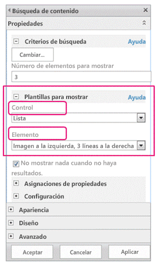

# Plantillas para mostrar del Administrador de diseño de SharePoint 2013
Obtenga información sobre las plantillas para mostrar, lo que incluye: cómo se relacionan con los elementos web de búsqueda, cómo se estructuran, cómo asignar propiedades y usar variables y jQuery y cómo crear una plantilla para mostrar personalizada en SharePoint Server 2013.
## Introducción a las plantillas para mostrar
<a name="bk_introduction"> </a>

Las plantillas para mostrar de SharePoint Server 2013 son plantillas usadas en los elementos web que emplean tecnología de búsqueda (llamados elementos web de búsqueda en este artículo) para mostrar los resultados de una consulta realizada al índice de búsqueda. Las plantillas para mostrar controlan qué propiedades administradas se muestran en los resultados de búsqueda y cómo aparecen en el elemento web. Cada plantilla para mostrar está compuesta por dos archivos: una versión HTML de la plantilla para mostrar que se puede editar en el editor HTML y un archivo .js que utiliza SharePoint.
  
    
    

> **NOTA**
> Solo los elementos web pueden usar plantillas para mostrar. El elemento web Consulta de contenido no se basa en búsquedas, así que no emplea plantillas para mostrar. 
  
    
    

Puede ver las plantillas para mostrar existentes en el Administrador de diseño, pero no crearlas del mismo modo en que crea páginas maestras y diseños de página. Para ello:
  
    
    

- Abra la  [unidad de red asignada a la Galería de páginas maestras](how-to-map-a-network-drive-to-the-sharepoint-2013-master-page-gallery.md).
    
  
- Abra una de las cuatro carpetas de la carpeta **Plantillas para mostrar**.
    
    > **NOTA**
      > La carpeta que elija dependerá del tipo de plantilla para mostrar que quiera usar. Por ejemplo, si el sitio usa publicación entre sitios, copie una plantilla para mostrar de la carpeta **Elementos web de contenido**. Para obtener más información, consulte  [Referencia de plantillas de visualización de SharePoint Server 2013](http://technet.microsoft.com/es-es/library/jj944947.aspx). 
- Copie el archivo HTML de una plantilla para mostrar existente que sea similar a la que quiere. No importa la ubicación exacta en la que copie el archivo, siempre que sea en la **Galería de páginas maestras**.
    
  
- Abra y modifique la copia en un editor HTML.
    
  
Al usar una plantilla para mostrar existente como punto de partida de una nueva plantilla, podrá beneficiarse de información de utilidad sobre el proceso de personalización en los comentarios de las plantillas para mostrar predeterminadas y dispondrá de un marco para tareas básicas como asignar campos de entrada. También se garantiza que las plantillas usen la estructura de página básica correcta.
  
    
    
Al crear una plantilla para mostrar mediante la copia del archivo HTML de una plantilla para mostrar existente en la carpeta **Plantillas para mostrar** de la **Galería de páginas maestras**:
  
    
    

- Se crea un archivo .js con el mismo nombre en la ubicación en la que haya copiado el archivo HTML.
    
  
- Todo el marcado que SharePoint Server 2013 necesita se agrega al archivo .js para que la plantilla para mostrar se visualice correctamente.
    
  
- Los archivos HTML y .js se asocian, así que cualquier modificación posterior en el archivo HTML se sincroniza con el archivo .js al guardar el primero.
    
  

> **NOTA**
> La sincronización solo va en una dirección. Los cambios en la plantilla para mostrar HTML se sincronizan en el archivo .js asociado. A diferencia de las páginas maestras y los diseños de página, al trabajar con plantillas para mostrar no se puede optar por trabajar únicamente con el archivo .js al romper la asociación entre los archivos. Es necesario introducir todo el HTML y JavaScript en el archivo HTML. 
  
    
    


## Relación entre plantillas para mostrar y elementos web de búsqueda
<a name="bk_DTandSWP"> </a>

Hay dos tipos principales de plantillas para mostrar:
  
    
    

- Las **plantillas de control** determinan la estructura general de la presentación de los resultados. Incluyen listas, listas con paginación y presentaciones de diapositivas.
    
  
- Las **plantillas de elementos** determinan cómo se visualiza cada resultado del conjunto. Incluyen imágenes, texto, vídeo y otros elementos.
    
  
Para obtener más información sobre estas y otras plantillas para mostrar, consulte  [Referencia de plantillas de visualización en SharePoint Server 2013](http://technet.microsoft.com/es-es/library/jj944947.aspx).
  
    
    
Una vez agregado un elemento web de búsqueda (como el elemento web Búsqueda de contenido) a una página, para configurarlo, se seleccionan una plantilla para mostrar de control y una de elementos, como se muestra en la figura 1.
  
    
    

**Figura 1. Panel de herramienta del elemento web Búsqueda de contenido**

  
    
    

  
    
    

  
    
    
La plantilla para mostrar de control proporciona HTML para estructurar el diseño general de la presentación de los resultados de búsqueda. Por ejemplo, la plantilla para mostrar de control puede proporcionar el HTML para un encabezado y el principio y el final de una lista. Solo se presenta una vez en el elemento web.
  
    
    
La plantilla para mostrar de elementos proporciona HTML que determina cómo se muestra cada elemento del conjunto de resultados. Por ejemplo, puede proporcionar el HTML para un elemento de lista que contiene una imagen y tres línea de texto asignadas a distintas propiedades administradas asociadas al elemento. La plantilla para mostrar de elementos se presenta una vez por cada elemento del conjunto de resultados, de modo que si este contiene diez elementos, crea su sección de HTML diez veces.
  
    
    
Si se usan juntas de esta forma, la plantilla para mostrar de control y la plantilla para mostrar de elementos se combinan para crear un bloque cohesivo de HTML que se presenta en el elemento web, como se muestra en la figura 2.
  
    
    

**Figura 2. Resultados HTML combinados de una plantilla para mostrar de control y una plantilla para mostrar de elementos**

  
    
    

  
    
    

  
    
    
Para obtener más información sobre las plantillas para mostrar, consulte la sección "Elementos web y plantillas de visualización controlados por búsqueda" de  [Información general sobre el modelo de páginas de SharePoint 2013](overview-of-the-sharepoint-2013-page-model.md).
  
    
    

## Estructura de las plantillas para mostrar
<a name="bk_DTstructure"> </a>

El archivo HTML que se usa para una plantilla para mostrar es un documento HTML totalmente formado, aunque no representa una página web HTML completa. SharePoint convierte las partes del archivo HTML de la plantilla para mostrar a JavaScript. En esta sección se describen la cuatro secciones principales de una plantilla para mostrar.
  
    
    

### Etiqueta de título

El texto de la etiqueta **<title>** de un archivo de plantilla para mostrar se usa como el nombre para mostrar de la sección **Plantillas para mostrar** del panel de edición del elemento web cuando el elemento web de búsqueda está en modo de edición. El siguiente ejemplo corresponde a la plantilla para mostrar de elementos llamada Item_Picture3Lines.html:
  
    
    

```HTML

<title>Picture on left, 3 lines on right</title>
```


### Propiedades de encabezado

Inmediatamente después de la etiqueta **<title>**, hay un conjunto de elementos personalizados limitado por el siguiente marcado:
  
    
    

```HTML
<!--[if gte mso 9]><xml>
<mso:CustomDocumentProperties>
…
</mso:CustomDocumentProperties>
</xml><![endif]-->

```

Estos elementos y sus propiedades proporcionan importante información al entorno de SharePoint sobre la plantilla para mostrar. En la tabla 1 se describen las propiedades personalizadas que se usan en las plantillas para mostrar.
  
    
    

> **NOTA**
> No todas las propiedades personalizadas se usan en cada plantilla para mostrar. Además, algunas propiedades se pueden cambiar mediante la edición de las propiedades del archivo de la plantilla para mostrar en el Administrador de diseño. 
  
    
    


**Tabla 1. Lista de entradas CustomDocumentProperties**


|**Propiedad**|**Descripción**|
|:-----|:-----|
|**TemplateHidden** <br/> |Valor booleano que indica si se oculta la plantilla para mostrar en la lista de plantillas disponibles en el elemento web. Este valor se puede cambiar en las propiedades del archivo de la plantilla para mostrar.  <br/> |
|**ManagedPropertyMapping** <br/> |Asigna campos expuestos por elementos de los resultados de búsqueda a propiedades disponibles para JavaScript. Solo se usa en plantillas de elementos.  <br/> |
|**MasterPageDescription** <br/> |Proporciona una descripción detallada de la plantilla para mostrar que se muestra a los usuarios del entorno de edición de SharePoint. Este valor se puede cambiar en las propiedades del archivo de la plantilla para mostrar.  <br/> |
|**ContentTypeId** <br/> |Id. del tipo de contenido asociado a la plantilla para mostrar.  <br/> |
|**TargetControlType** <br/> |Indica el contexto en que se emplea la plantilla de contenido. Este valor se puede cambiar en las propiedades del archivo de la plantilla para mostrar.  <br/> |
|**HtmlDesignAssociated** <br/> |Valor booleano que indica si un archivo HTML de plantilla para mostrar tiene un archivo .js asociado.  <br/> |
|**HtmlDesignConversionSucceeded** <br/> |Indica si el proceso de conversión fue correcto. SharePoint agrega de forma automática este valor al archivo, que solo se usa en plantillas para mostrar personalizadas.  <br/> |
|**HtmlDesignStatusAndPreview** <br/> |Contiene la dirección URL del archivo HTML y el texto de la columna **Estado** ( **Conversión correcta** o **Advertencias y errores**). SharePoint agrega de forma automática este valor al archivo, que solo se usa en plantillas para mostrar personalizadas.  <br/> |
   

### Bloque de scripts
<a name="bk_scriptblock"> </a>

Dentro de la etiqueta **<body>**, puede ver la siguiente etiqueta **<script>**:
  
    
    

```HTML

<script>
     $includeLanguageScript(this.url, "~sitecollection/_catalogs/masterpage/Display Templates/Language Files/{Locale}/CustomStrings.js");
</script>
```

Esta línea se incluye de forma predeterminada en todas las plantillas para mostrar. Puede agregar más líneas de código dentro de la etiqueta **<script>** para hacer referencia a archivos CSS o a otros archivos JavaScript de fuera del archivo HTML principal de la plantilla para mostrar. En la tabla 2 se muestran ejemplos de cómo incluir otros recursos.
  
    
    

**Tabla 2. Ejemplos de inclusión de recursos externos en la etiqueta <script>**


|**Si desea incluir lo siguiente:**|**Use el código siguiente:**|
|:-----|:-----|
|Un archivo JavaScript que es parte de la colección de sitios actual  <br/> | `$includeScript(this.url, "~sitecollection/_catalogs/masterpage/Display Templates/Content Web Parts/MyScripts.js");` <br/> |
|Un archivo JavaScript externo  <br/> | `$includeScript(this.url, "http://www.contoso.com/ExternalScript.js");` <br/> |
|Un archivo CSS que es parte de la colección de sitios actual  <br/> | `$includeCSS(this.url, "~sitecollection/_catalogs/masterpage/Display Templates/Content Web Parts/MyCSS.css");` <br/> |
|Un archivo CSS que está en una ubicación relativa a la plantilla para mostrar actual  <br/> | `$includeCSS(this.url,"../../MyStyles/MyCSS.css");` <br/> |
   

> **NOTA**
> Si se necesita **aprobación de contenido** para los elementos de la Galería de páginas maestras, es necesario publicar todos los archivos de recursos (incluidos archivos CSS y .js) antes ponerlos a disposición de páginas maestras y diseños de página. Para obtener más información, consulte [Requerir la aprobación de elementos en una lista o biblioteca de sitio](http://office.microsoft.com/es-es/sharepoint-help/require-approval-of-items-in-a-site-list-or-library-HA102853936.aspx?CTT=1). 
  
    
    


### Bloque DIV
<a name="bk_scriptblock"> </a>

Detrás de la etiqueta **<script>** hay una etiqueta **<div>** con un Id. De forma predeterminada, el Id. de esta etiqueta **<div>** coincide con el nombre del archivo HTML. Cualquier HTML o código que quiera que proporcione la plantilla para mostrar debe incluirse dentro de esta etiqueta **<div>**. Sin embargo, la propia etiqueta no se incluye en el marcado que se presenta en la página web en tiempo de ejecución. 
  
    
    

> **NOTA**
> Si quiere asignar un estilo CSS o un Id. al bloque de HTML presentado en la página en tiempo de ejecución, puede agregar una nueva etiqueta dentro de la primera etiqueta **<div>**. También puede asignar un estilo CSS o un Id. al HTML que rodea a la variable  `_#= ctx.RenderGroups(ctx) =#_` en la plantilla de control. La variable `_#= ctx.RenderGroups(ctx) =#_` se usa para presentar el HTML que rodea a los resultados de la consulta presentados por la plantilla de elementos.
  
    
    

En la primera etiqueta **<div>** verá código dentro de bloques de comentarios que comienzan por **<!--#_** y terminan por **_#-->**. El código JavaScript se usa dentro de estos bloques y el HTML fuera de ellos. También puede usar estos bloques para controlar el HTML con instrucciones condicionales. Para ello, use un bloque de comentarios con la instrucción condicional y el corchete de apertura seguidos del HTML, seguido todo ello de otro bloque de comentarios con el corchete de cierre. En el siguiente ejemplo, la etiqueta delimitadora se presenta en la página únicamente si el valor del objeto **linkURL** no está vacío.
  
    
    


```HTML

<!--#_
if(!linkURL.isEmpty)
{
_#-->
     <a class="cbs-pictureImgLink" href="_#= linkURL =#_" title="_#= $htmlEncode(line1.defaultValueRenderer(line1)) =#_" id="_#= pictureLinkId =#_">
<!--#_
}
_#-->

```


## Asignación de propiedades de entrada y obtención de sus valores
<a name="bk_mapproperties"> </a>

La sección de encabezado de una plantilla para mostrar de elementos tiene una propiedad de documento personalizada llamada **ManagedPropertyMapping**. Esta propiedad toma las propiedades administradas usadas por la búsqueda y las asigna a valores que la plantilla para mostrar puede utilizar. La propiedad es una lista de valores delimitados por comas con el siguiente formato: ' _nombre para mostrar de la propiedad_'{ _nombre de la propiedad_}:' _propiedad administrada_'. Por ejemplo,  `'Picture URL'{Picture URL}:'PublishingImage;PictureURL;PictureThumbnailURL'`.
  
    
    
Vamos a examinar el formato más detalladamente:
  
    
    

-  _nombre para mostrar de la propiedad_ es el nombre de la propiedad que se muestra en el panel de edición del elemento web al seleccionar la plantilla para mostrar.
    
  
-  _nombre de la propiedad_ es un identificador que usa recursos de cadena localizados para buscar el nombre de la propiedad administrada. También es el valor que aparece en la sección **Asignaciones de propiedades** del menú de configuración de elementos web. Al editar la configuración de un elemento web, puede cambiar este valor para modificar qué propiedad administrada está asociada con el campo que aparece en el elemento web.
    
  
-  _propiedad administrada_ es una cadena de una o más propiedades administradas, separadas por puntos y coma. En tiempo de ejecución, la lista se evalúa de izquierda a derecha y se asignará el primer valor que coincida con el nombre de una propiedad administrada del elemento de búsqueda actual a esta ranura. Eso permite escribir una plantilla para mostrar que pueda funcionar con varios tipos de elementos y que pueda usar una presentación coherente si hay propiedades compatibles.
    
  
Después de asignar una propiedad, puede obtener su valor en script mediante el siguiente código:  `var pictureURL = $getItemValue(ctx, "Picture URL");`
  
    
    
El segundo parámetro que se pasa a **$getItemValue()** debe coincidir con el nombre de la propiedad para mostrar entre comillas simples usado en el elemento **ManagedPropertyMapping**. En este ejemplo, **Picture URL** es el nombre de la propiedad que se pasa a **$getItemValue()**.
  
    
    
Este código devuelve un objeto de información de valor ( **valueInfoObj**). Este objeto contiene una representación sin procesar del valor de entrada, junto con el valor con un cifrado predeterminado aplicado.
  
    
    
Puede usar variables dentro de la secciones de JavaScript como haría normalmente para manipular variables y crear cadenas HTML para presentar en la página en tiempo de ejecución. Sin embargo, para hacer referencia a variables declaradas en el script directamente en el HTML, tiene que usar el siguiente formato: _#=  _nombreDeVariable_ =#_. Por ejemplo, para usar la variable **pictureURL** como el valor de una imagen, use el siguiente HTML: ``
  
    
    

## Uso de jQuery con las plantillas para mostrar
<a name="bk_jQuery"> </a>

Puede usar jQuery con las plantillas para mostrar, pero tenga en cuenta dos importantes factores:
  
    
    

- Para incluir las bibliotecas de jQuery en la plantilla para mostrar, siga las instrucciones descritas en la sección  [Bloque de scripts](#bk_scriptblock) anteriormente en este artículo.
    
  
- Si usa selectores de Id. en jQuery, utilice el siguiente código para crear una variable para el Id.:  `var containerQueryId = '#' + '_#= containerId =#_';`
    
    Para hacer referencia al selector en jQuery, use el siguiente código:  `$('_#= containerQueryId =#_')`
    
  

## Creación de una plantilla para mostrar
<a name="bk_createDT"> </a>

Para poder crear una plantilla para mostrar mediante el siguiente procedimiento, debe tener una unidad de red asignada que dirija a la **Galería de páginas maestras**. Para obtener más información, consulte  [Procedimiento para asignar una unidad de red a la Galería de páginas maestras de SharePoint 2013](how-to-map-a-network-drive-to-the-sharepoint-2013-master-page-gallery.md).
  
    
    

### Para crear una plantilla para mostrar


1. En el Explorador de Windows, abra la unidad de red asignada a la **Galería de páginas maestras**.
    
  
2. Abra la carpeta **Plantillas para mostrar** y, a continuación, la carpeta **Elementos web de contenido**.
    
  
3. Copie el archivo HTML de una plantilla para mostrar que sea similar a la que desea crear. Para ver una lista de las plantillas para mostrar predeterminadas y sus descripciones, consulte  [Referencia de plantillas de visualización en SharePoint Server 2013](http://technet.microsoft.com/es-es/library/jj944947.aspx).
    
    En este punto, SharePoint Server 2013 copia el archivo HTML en un archivo .js con el mismo nombre. Por ejemplo, si el archivo HTML copiado se llama Item_Picture3Line_copy.html, también se crea un archivo .js correspondiente llamado Item_Picture3Lines_copy.js. Si decide cambiar el nombre del archivo, el nombre del archivo .js correspondiente también cambia.
    
  
4. Para personalizar la plantilla para mostrar, edite el archivo HTML que reside en el servidor mediante el editor HTML para abrir y editar el archivo HTML en la unidad asignada. Cada vez que guarde el archivo HTML, los cambios se sincronizarán con el archivo .js asociado.
    
  
5. Vaya al sitio de publicación.
    
  
6. En la esquina superior derecha de la página, elija **Configuración** y luego **Administrador de diseño**.
    
  
7. En el Administrador de diseño, en el panel de navegación izquierdo, elija **Editar plantillas para mostrar**. El archivo HTML ahora aparece con una columna **Estado** que muestra uno de dos estados:
    
  - **Advertencias y errores**
    
  
  - **Conversión correcta**
    
  

    > **NOTA**
      > A diferencia de las páginas maestras y los diseños de página, no se puede usar la página de vista previa para obtener una vista previa de servidor activa de la plantilla para mostrar. Para obtener una vista previa de la plantilla para mostrar, tiene que agregar un elemento web Búsqueda de contenido a una página y luego aplicar la plantilla para mostrar en el panel de edición del elemento web Búsqueda de contenido. Si hay algún error en la plantilla para mostrar, el elemento web Búsqueda de contenido muestra un mensaje de error. Los errores tienen que corregirse para que la plantilla para mostrar se muestre correctamente. 
8. Para corregir cualquier error, edite el archivo HTML que reside en el servidor mediante el editor HTML para abrir y editar el archivo HTML en la unidad asignada. Guarde la plantilla para mostrar y luego vuelva a cargar la página que contiene el elemento web Búsqueda de contenido que usa la plantilla para mostrar.
    
  

## Recursos adicionales
<a name="bk_addresources"> </a>


-  [Información general sobre el Administrador de diseño de SharePoint 2013](overview-of-design-manager-in-sharepoint-2013.md)
    
  
-  [Desarrollar el diseño del sitio en SharePoint 2013](develop-the-site-design-in-sharepoint-2013.md)
    
  
-  [Cómo convertir un archivo HTML en una página maestra en SharePoint 2013](how-to-convert-an-html-file-into-a-master-page-in-sharepoint-2013.md)
    
  
-  [Cómo crear un diseño de página en SharePoint 2013](how-to-create-a-page-layout-in-sharepoint-2013.md)
    
  
-  [Capacidades de personalización de marca y diseño de SharePoint 2013 Design Manager](sharepoint-2013-design-manager-branding-and-design-capabilities.md)
    
  

