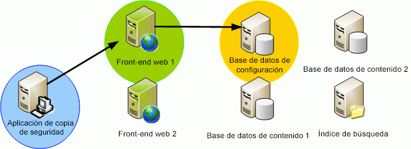

# Escritor de VSS de SharePoint 2013
 **Resumen:** obtenga información sobre las características y funciones del escritor del servicio de instantáneas de volumen (VSS) para Microsoft SharePoint 2013.
VSS, incluido en Windows Server, es la infraestructura que proporciona capacidades integradas para instantáneas. Las instantáneas creadas por VSS aumentan las soluciones de archivado de copias de seguridad en cinta del administrador de almacenamiento y proporcionan copias de alta fidelidad de un momento dado que se pueden crear y restaurar fácilmente y de forma eficaz, lo que ayuda a simplificar varios aspectos de administración de los datos y el almacenamiento. Microsoft SharePoint Foundation usa VSS para simplificar las operaciones de copia de seguridad y restauración. 
  
    
    

## Características del sistema

A continuación se enumeran las características y funciones de la solución VSS de SharePoint Foundation:
  
    
    

- **Un único escritor de referencia de VSS.** No ha habido una forma sencilla de que las aplicaciones describan sus datos a las aplicaciones de copia de seguridad. Para realizar correctamente una copia de seguridad de distintas aplicaciones de la plataforma Windows, las aplicaciones de copia de seguridad tienen un número excesivo de interfaces de programación de aplicaciones (API) para las que necesitan escribir código específico. El Escritor de VSS de SharePoint Foundation (de ahora en adelante "el Escritor de SPF-VSS") permite que las aplicaciones de copia de seguridad aprovechen el único escritor para realizar copias de seguridad de SharePoint Foundation.
    
  
- **Copia de seguridad y restauración de un conjunto o granja de servidores completa para catástrofes.** El Escritor de SPF-VSS permite a una aplicación de copia de seguridad (solicitante) tener acceso a la API de VSS para solicitar una operación de copia de seguridad o de restauración para una granja de servidores completa de SharePoint Foundation, incluida la configuración de una granja de servidores o una instalación en un sólo equipo. (El almacén de configuraciones IIS, que es principalmente el archivo `applicationhost.config`, no se incluye; deberá realizar la copia de seguridad y la restauración por separado.)
    
  
- **Granularidad de nivel de base de datos**. El Escritor de SPF-VSS permite que el solicitante seleccione todas las bases de datos, un segmento de las bases de datos (selección múltiple) o una única base de datos (selección única) para ambas operaciones de copia de seguridad y de restauración. Todas las bases de datos, excepto las bases de datos de configuración y de contenido de la Administración central, se pueden seleccionar mediante el escritor. Las bases de datos de configuración y de contenido de la Administración central pueden incluirse en la copia de seguridad y en la restauración sólo como parte de la granja completa. (El almacén de configuraciones IIS no se incluye; deberá realizar la copia de seguridad y la restauración por separado.)
    
  
- **Inventario de bases de datos.** Antes de realizar una copia de seguridad, el Escritor de SPF-VSS genera una lista plana de bases de datos seleccionadas para la copia de seguridad dentro de la granja de servidores. La lista se devuelve al solicitante para que se pueda ejecutar la copia de seguridad en la ubicación donde se encuentra físicamente la base de datos.
    
  
- **Compatibilidad con las granjas de servidores.** El escritor entiende y proporciona compatibilidad para sincronizar la copia de seguridad y la recuperación en una granja de servidores de SharePoint Foundation de forma limitada. El escritor proporciona al solicitante una lista de servidores, bases de datos y archivos asociados a la granja de servidores. El solicitante se encarga de realizar una conexión independiente a cada servidor para llamar al Escritor de SPF-VSS en ese servidor y generar la copia de seguridad o ejecutar la operación de restauración.
    
  
- **Copia de seguridad de contenido sin interrupciones.** Si una aplicación modifica un archivo durante el proceso de copia de seguridad, éste de dañará. VSS permite que se realice una instantánea rápida de los archivos en la instantánea, lo que permite que la aplicación funcione en la ubicación original sin interrupciones.
    
  
- **Copia de seguridad y recuperación de bases de datos conectables de terceros.** El Escritor de SPF-VSS ofrece una copia de seguridad conectable/extensible para soluciones de terceros integradas en SharePoint Foundation. Sin embargo, solo las bases de datos que están registradas en la base de datos de configuración se incluyen en el escritor. No se incluyen ni los archivos adicionales ni las bases de datos sin registrar.
    
  
- **Copia de seguridad y recuperación de archivos de índice de búsqueda.** Puesto que los archivos de índice de búsqueda se almacenan en el sistema de archivos, se necesita un escritor de archivos independiente para realizar la copia de seguridad de ellos. Para solucionar este problema, SharePoint Foundation incluye un escritor de búsqueda independiente que controla los archivos de índice de búsqueda. Para simplificar el proceso para los escritores de aplicaciones de copia de seguridad, SharePoint Foundation declara dependencias entre escritores de manera que la copia de seguridad y la restauración de los archivos de índice de búsqueda se realiza al mismo tiempo que la copia de seguridad de las bases de datos registradas en la granja de servidores.
    
  
- **Reversión total.** El Escritor de SPF-VSS controla todos los componentes de una implementación de SharePoint Foundation, entre los que se incluyen la base de datos de configuración, las bases de datos de contenido, así como la base de datos y el índice de búsquedas. Como se mencionó anteriormente, el escritor también tiene una dependencia del escritor de búsquedas, que controla todos los archivos de índice de búsqueda para copia de seguridad y recuperación. En el momento de la recuperación, el escritor puede revertir toda la implementación de SharePoint Foundation mediante la restauración de una copia de seguridad anterior de la granja de servidores. (El almacén de configuraciones IIS no se incluye; la copia de seguridad y la restauración deberán realizarse por separado.)
    
    > **NOTA**
      > Vea la sección acerca de la restauración en  [Solicitantes de VSS y SharePoint 2013](vss-requestors-and-sharepoint-2013.md) para obtener información importante acerca de las restauraciones.
- **Sincronización posterior a la restauración de las bases de datos.** Para asegurar que todas las bases de datos estén sincronizadas con la granja de servidores una vez completada una operación de restauración, cada una de las bases de datos se desasocia y se vuelve a asociar de forma automática a la recuperación posterior de la granja de servidores. Los administradores no necesitan ejecutar procedimientos adicionales para volver a sincronizar las bases de datos restauradas.
    
  

> **IMPORTANTE**
> Si usa alias SQL en la granja de servidores de SharePoint Foundation para conectarse al servidor SQL Server, deberá instalar los componentes de conectividad del cliente SQL en los servidores de la granja para usar VSS Writer de SPF para las operaciones de copia de seguridad y restauración. Entre los componentes se incluye el proveedor de WMI de SQL para la administración de configuración, el cual necesita VSS Writer de SPF para resolver los alias SQL en el servidor SQL Server correcto. No es necesario instalar ninguna de las herramientas de administración como SQL Management Studio. Debe usar el mismo origen de instalación (por ejemplo, un DVD de datos) que usaría para instalar el producto SQL Server completo. (No use la versión independiente de los componentes cliente. Esa versión no incluye el proveedor de WMI de SQL). Elija realizar una instalación personalizada y elija solo los componentes cliente que se van a instalar. 
  
    
    

## Funciones realizadas por el Escritor de SPF-VSS

El Escritor de SPF-VSS realiza las siguientes funciones:
  
    
    

1. Genera los componentes de SharePoint Foundation.
    
  - Genera una lista completa de todos los componentes de la granja de servidores de SharePoint Foundation.
    
  
  - No está necesariamente relacionado con el proceso de copia de seguridad o el proceso de restauración.
    
  

  

  

  
2. Realiza copias de seguridad de granja de servidores o de base de datos.
    
  - Solicita una copia de seguridad de (granja de servidores/base de datos) de SharePoint Foundation a través de VSS.
    
  

  

  

  
3. Restaura una granja de servidores o base de datos.
    
  - Solicita una recuperación de (granja de servidores/base de datos) de SharePoint Foundation a través de VSS.
    
  
  - Implementa **postRestore()** para sincronizar la tabla de sitios.
    
  

  

  

  

## Pasos siguientes

Aprenda a crear y usar un solicitante de VSS para SharePoint 2013:
  
    
    

-  [Solicitantes de VSS y SharePoint 2013](vss-requestors-and-sharepoint-2013.md)
    
  

## Recursos adicionales

-  [Introducción a SharePoint 2013 y el servicio de instantáneas de volumen](overview-of-sharepoint-2013-and-the-volume-shadow-copy-service.md)
    
  

