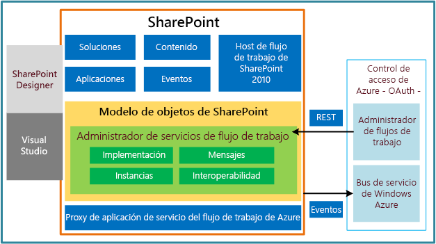

# Aspectos básicos de los flujos de trabajo de SharePoint 2013
Proporciona información general sobre la infraestructura del flujo de trabajo en SharePoint 2013, incluida una vista de la arquitectura de la plataforma y el puente de interoperabilidad del flujo de trabajo.
## Información general sobre los flujos de trabajo de SharePoint 2013

Los flujos de trabajo de SharePoint 2013 funcionan con Windows Workflow Foundation 4, cuyo diseño se modificó considerablemente desde las versiones anteriores. Windows Workflow Foundation (WF), a su vez, se ha desarrollado con la función de mensajería proporcionada por  [Windows Communication Foundation (WCF)](http://msdn.microsoft.com/es-es/library/vstudio/ms735119%28v=vs.90%29.aspx).
  
    
    
Conceptualmente, los flujos de trabajo modelan procesos de negocio estructurados. Por lo tanto, los flujos de trabajo de Windows Workflow Foundation 4 constituyen una colección estructurada de "actividades" de flujo de trabajo, y cada una de ellas representa un componente funcional de un proceso de negocio.
  
    
    
La plataforma de flujo de trabajo de SharePoint 2013 usa el modelo de actividad de Windows Workflow Foundation 4 para representar un proceso de negocio basado en SharePoint. Además, SharePoint 2013 presenta un modelo de fase/puerta de nivel superior para la creación de flujos de trabajo.
  
    
    
Es importante tener en cuenta la relación entre las actividades de flujo de trabajo y lasacciones de SharePoint. Las actividades de flujo de trabajo representan los objetos administrados subyacentes cuyos métodos impulsan los comportamientos del flujo de trabajo. Las acciones de flujo de trabajo, por otro lado, son contenedores que encapsulan las actividades subyacentes y las presentan con un formato sencillo en SharePoint Designer. Los autores del flujo de trabajo interactúan con las acciones de flujo de trabajo, mientras que el motor de ejecución del flujo de trabajo actúa en las actividades correspondientes.
  
    
    
Las actividades, que son implementaciones de clases de actividades, se implementan de manera declarativa con XAML.
  
    
    
Las actividades de flujo de trabajo se invocan con servicios web acoplados de forma imprecisa que usan API de mensajería para comunicarse con SharePoint. Estas API se han desarrollado con la función de mensajería proporcionada por  [Windows Communication Foundation (WCF)](http://msdn.microsoft.com/es-es/library/vstudio/ms735119%28v=vs.90%29.aspx).
  
    
    
El marco de mensajería es muy flexible y admite prácticamente cualquier modelo de mensajería que se necesite. Tenga en cuenta que en una granja de SharePoint 2013, Windows Workflow Foundation y WCF se hospedan en Cliente del Administrador de flujos de trabajo 1.0.
  
    
    
Tanto Cliente del Administrador de flujos de trabajo 1.0, SharePoint 2013 como SharePoint Designer 2013 proporcionan componentes fundamentales de la nueva infraestructura:
  
    
    

- **Cliente del Administrador de flujos de trabajo 1.0** posibilita la administración de las definiciones del flujo de trabajo. También hospeda los procesos de ejecución para las instancias del flujo de trabajo.
    
  
- **SharePoint 2013** proporciona el marco para los flujos de trabajo de SharePoint, que modelan los procesos de negocio basados en SharePoint que incluyen documentos, listas, usuarios y tareas de SharePoint. Además, los flujos de trabajo, las asociaciones, las actividades y otros metadatos del flujo de trabajo de SharePoint se almacenan y se administran en SharePoint 2013.
    
  
- **SharePoint Designer 2013** es la principal herramienta de usuarios profesionales para crear definiciones de flujo de trabajo y publicarlas, al igual que en las versiones anteriores. También se puede usar para empaquetar una definición de flujo de trabajo con componentes asociados de SharePoint o sin ellos.
    
  

## Arquitectura de la plataforma

En la Figura 1, se muestra una vista general del marco de flujo de trabajo de SharePoint 2013. En primer lugar, observe cómo la nueva infraestructura del flujo de trabajo presenta Cliente del Administrador de flujos de trabajo 1.0 como el nuevo host de ejecución de flujos de trabajo. Mientras que en las versiones anteriores la ejecución de flujos de trabajo se hospedaba en SharePoint, esto se modificó en SharePoint 2013. Cliente del Administrador de flujos de trabajo 1.0 es externo a SharePoint y se comunica con protocolos comunes a través del bus de servicio Microsoft Azure, con la mediación de OAuth. Más allá de eso, SharePoint incluye las características que espera ver: elementos de contenido, eventos, aplicaciones, etc. Pero observe que también existe una implementación del host de flujo de trabajos de SharePoint 2010 (es decir, el motor Windows Workflow Foundation 3) para la compatibilidad con versiones anteriores. Puede leer más sobre este tema en  [Utilizar la interoperabilidad de flujo de trabajo para SharePoint 2013](use-workflow-interop-for-sharepoint-2013.md).
  
    
    

**Figura 1. Arquitectura de alto nivel de la infraestructura del flujo de trabajo**

  
    
    

  
    
    

  
    
    
Cliente del Administrador de flujos de trabajo 1.0 se representa en SharePoint 2013 como un proxy de la aplicación de servicio de Cliente del Administrador de flujos de trabajo 1.0. Este componente permite a SharePoint comunicarse e interactuar con el servidor Cliente del Administrador de flujos de trabajo 1.0. OAuth proporciona la autenticación de servidor a servidor.
  
    
    
Los eventos de SharePoint que escucha un flujo de trabajo, como **itemCreated**, **itemUpdated**, etc., se redirigen a Cliente del Administrador de flujos de trabajo 1.0 con el bus de servicio Microsoft Azure. Para el recorrido de vuelta, la plataforma usa la API de transferencia de estado de representación (REST, Representational State Transfer) de SharePoint para la devolver la llamada a SharePoint.
  
    
    
Existen también adiciones al modelo de objetos de flujo de trabajo de SharePoint, a las que en conjunto se denomina Administrador de servicios de flujo de trabajo. El administrador de servicios permite administrar y controlar los flujos de trabajo y su ejecución. Las principales zonas de interacción para el administrador de servicios son la implementación, la mensajería, el control de instancias y la interoperabilidad (por compatibilidad con versiones anteriores) con los flujos de trabajo de SharePoint 2010.
  
    
    
Por último, encontramos el componente de creación de flujos de trabajo. SharePoint Designer ahora puede crear e implementar flujos de trabajo de SharePoint 2010 y SharePoint 2013. Visual Studio 2012 no solo proporciona una superficie de diseño para crear flujos de trabajo declarativos, sino que también permite crear soluciones y Complementos de SharePoint que integran completamente las funciones de Cliente del Administrador de flujos de trabajo 1.0.
  
    
    

## Suscripciones y asociaciones del flujo de trabajo

Como el cambio más importante en los flujos de trabajo de SharePoint 2013 es el traspaso del procesamiento de flujos de trabajo a hosts de flujos de trabajo externos, como Microsoft Azure, era esencial que los mensajes y eventos de SharePoint se conecten con la infraestructura del flujo de trabajo de Microsoft Azure. Además, era necesario que Microsoft Azure conecte la infraestructura a los datos de cliente. Las asociaciones de flujo de trabajo (basadas en el concepto de suscripciones de WF) son los componentes de la infraestructura de SharePoint que admiten estos requisitos.
  
    
    

### Servicio de publicación/suscripción de Microsoft Azure

Antes de analizar las asociaciones y suscripciones del flujo de trabajo, es necesario examinar el servicio de publicación/suscripción de Microsoft Azure, que a menudo se conoce comopub/sub o, simplemente,PubSub. PubSub es un marco de mensajería asincrónico. Los emisores del mensaje (publicadores) no envían mensajes directamente a los receptores del mensaje (suscriptores). En cambio, los mensajes son representados por los publicadores como clases que no tienen conocimiento de los suscriptores del mensaje. Los suscriptores luego leen los mensajes publicados tras identificar los mensajes de interés, independientemente del publicador, según las suscripciones que crearon.
  
    
    
Esta separación de la creación de mensajes del uso de mensajes permite una mayor escalabilidad y flexibilidad. Posibilita la mensajería multidifusión en el publicador y el uso de mensajes indiscriminado por parte del suscriptor.
  
    
    

> **NOTA**
> La función PubSub forma parte del bus de servicio Microsoft Azure, que ofrece opciones de conectividad para WCF y otros extremos de servicio. Estos incluyen los extremos REST, que pueden ubicarse detrás de los límites de la traducción de direcciones de red (NAT) o enlazarse a direcciones IP de asignación dinámica y en constante cambio, o ambos. Para más información sobre el bus de servicio Azure, consulte  [Bus de servicio](http://msdn.microsoft.com/es-es/library/ee732537.aspx). 
  
    
    

### Asociaciones del flujo de trabajo y ámbito de asociación

Las asociaciones de flujo de trabajo enlazan definiciones de flujo de trabajo a determinados ámbitos de SharePoint, con valores predeterminados específicos. Las asociaciones en sí representan un conjunto de reglas de suscripción almacenadas en el servicio de publicación/suscripción de Azure, que procesan los mensajes entrantes a fin de garantizar que se usen en las instancias de flujo de trabajo adecuadas (es decir, con suscripción).
  
    
    
De forma predeterminada, la infraestructura de mensajería admite flujos de trabajo en los ámbitos siguientes:
  
    
    

-  [SPList](https://msdn.microsoft.com/library/Microsoft.SharePoint.SPList.aspx) (para flujos de trabajo de lista)
    
  
-  [SPWeb](https://msdn.microsoft.com/library/Microsoft.SharePoint.SPWeb.aspx) (para flujos de trabajo de sitio)
    
  
A diferencia de las versiones anteriores, SharePoint 2013 no admite flujos de trabajo en el ámbito de un tipo de contenido (  [SPContentType](https://msdn.microsoft.com/library/Microsoft.SharePoint.SPContentType.aspx) ). Sin embargo, la infraestructura de mensajería es extensible, por lo que puede admitir cualquier ámbito arbitrario. Como desarrollador, puede establecer la propiedad [EventSourceId](https://msdn.microsoft.com/library/Microsoft.SharePoint.WorkflowServices.WorkflowSubscription.EventSourceId.aspx) de una instancia [WorkflowSubscription](https://msdn.microsoft.com/library/Microsoft.SharePoint.WorkflowServices.WorkflowSubscription.aspx) determinada en cualquier **guid**. Luego puede usar ese valor **EventSourceId** para llamar a **PublishEvent(Guid, String, IDictionary<String, Object>)**, que inicia una nueva instancia de flujo de trabajo del tipo **WorkflowSubscription** especificado.
  
    
    

### Servicio de flujo de trabajo en Microsoft Azure

Las asociaciones de los flujos de trabajo de SharePoint están representadas por su servicio de flujo de trabajo dentro de Microsoft Azure. Cuando una aplicación debe adquirir una asociación de flujo de trabajo y sus datos, primero debe consultar todos los servicios de flujo de trabajo disponibles en un ámbito determinado.
  
    
    
De forma similar, las instancias de flujo de trabajo transfieren de nuevo un puntero a su servicio de flujo de trabajo correspondiente. Esta es la manera en que se determina su correcta asociación.
  
    
    

### Inicio de los flujos de trabajo

Los flujos de trabajo se pueden iniciar de forma manual o automática.
  
    
    
 **Flujos de trabajo manuales**
  
    
    
Los flujos de trabajo manuales se inician cuando el servicio PubSub recibe el mensaje **StartWorkflow**. El mensaje contiene la siguiente información descriptiva:
  
    
    

- El identificador de la asociación (es decir, la instancia **WorkflowSubscription**).
    
  
- El identificador del contexto del elemento de origen. Se transfiere con el parámetro  _ItemId_ y la propiedad **EventSource** en la llamada al método **PublishEvent**.
    
  
- El tipo de evento para un inicio manual ( **WorkflowStart**).
    
  
- Parámetros adicionales de iniciación del flujo de trabajo, ya sea de la suscripción o del formulario **Init**, según corresponda. Es decir, **CorrelationId** para la suscripción y **WFInstanceId** para el formulario **Init**.
    
  
 **Flujos de trabajo de inicio automático**
  
    
    
Los flujos de trabajo de inicio automático se inician con el mensaje **Add** en el servicio PubSub. El mensaje contiene la siguiente información descriptiva:
  
    
    

- El identificador del contexto del elemento de origen.
    
  
- El evento en sí como un evento **Add** normal de SharePoint.
    
  
- Los parámetros de iniciación del flujo de trabajo.
    
  

> **NOTA**
> Si un flujo de trabajo se inicia automáticamente en un evento repetible (por ejemplo, el evento **OnItemChanged**), no podrá iniciar otro flujo de trabajo de una determinada asociación hasta que haya finalizado la ejecución de la instancia existente del flujo de trabajo de la asociación. 
  
    
    

### Suscripciones del flujo de trabajo

El complemento lógico de las asociaciones son las suscripciones, que permiten al flujo de trabajo interactuar con las asociaciones. El flujo de trabajo debe crear suscripciones en el bus de servicio Azure con los métodos **create** y **delete**.
  
    
    
Las firmas de los métodos que crean la suscripción y la instancia del flujo de trabajo especifican los parámetros (opcionales y obligatorios). La lista de parámetros está determinada por el autor del flujo de trabajo y, por lo tanto, puede variar de una definición de flujo de trabajo a la otra. La lista de parámetros de suscripción se especifica como metadatos de las definiciones de flujo de trabajo. Los parámetros de suscripción se proporcionan cuando se crea la suscripción. La lista de parámetros de inicialización se especifica en XAML como parte de la definición de flujo de trabajo. Los parámetros de inicialización se proporcionan cuando se crea la instancia del flujo de trabajo.
  
    
    
Las suscripciones se enlazan a un objeto específico de SharePoint, ya sea una instancia de **SPList** o una instancia de **SPWeb**. El tipo de objeto de la suscripción se transfiere como valor de un parámetro obligatorio cuando se crea la suscripción. El tipo de objeto define el ámbito de la suscripción, de modo que la suscripción solo pueda responder a los eventos que se producen en el objeto al que está suscrita.
  
    
    

## Interoperabilidad de flujos de trabajo de SharePoint

La interoperabilidad de flujos de trabajo de SharePoint permite llamar a flujos de trabajo de SharePoint 2010 (creados en Windows Workflow Foundation 3) desde flujos de trabajo de SharePoint 2013, basados en Windows Workflow Foundation 4. Esto permite ejecutar flujos de trabajo de la versión 2010 desde flujos de trabajo de la versión 2013.
  
    
    
Esto es importante porque quizás tenga SharePoint 2010 que podría reutilizar junto con sus flujos de trabajo de SharePoint 2013. Además, quizás quiera usar actividades o características de SharePoint 2010 que aún no están implementadas en SharePoint 2013
  
    
    
Para obtener información completa sobre la interoperabilidad de flujos de trabajo de SharePoint, consulte  [Utilizar la interoperabilidad de flujo de trabajo para SharePoint 2013](use-workflow-interop-for-sharepoint-2013.md).
  
    
    

## Recursos adicionales

-  [Introducción a los flujos de trabajo de SharePoint 2013](get-started-with-workflows-in-sharepoint-2013.md)
    
  
-  [Referencia a las acciones y actividades del flujo de trabajo para SharePoint 2013](workflow-actions-and-activities-reference-for-sharepoint-2013.md)
    
  
-  [Desarrollar de flujos de trabajo de SharePoint 2013 mediante Visual Studio](develop-sharepoint-2013-workflows-using-visual-studio.md)
    
  
-  [Desarrollo de flujos de trabajo en SharePoint Designer y Visio](workflow-development-in-sharepoint-designer-and-visio.md)
    
  
-  [Flujos de trabajo de SharePoint 2013](workflows-in-sharepoint-2013.md)
    
  
-  [Utilizar la interoperabilidad de flujo de trabajo para SharePoint 2013](use-workflow-interop-for-sharepoint-2013.md)
    
  

