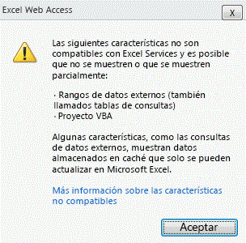
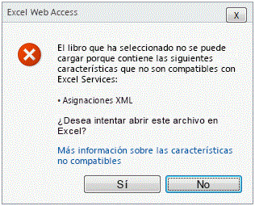

# Características admitidas y no admitidas

  
    
    

Microsoft Excel consta de múltiples funciones. Con cada lanzamiento, disminuye la diferencia de funciones entre Excel y Servicios de Excel, y además se reduce el número de características no admitidas. Pero no es posible admitir todas las características de Excel en la segunda versión de Servicios de Excel, en Microsoft SharePoint Server 2010. 
Al decidir qué características se deben admitir, se concede prioridad a las que se necesitan en los escenarios clave de Servicios de Excel y para garantizar que Servicios de Excel es un servicio para servidores que cumple con las expectativas de los clientes en términos de fiabilidad, escalabilidad y seguridad.
  
    
    

> **NOTA**
> En este tema se supone que está familiarizado con lo que se admite y lo que no en Microsoft Office SharePoint Server 2007. Puede encontrar más información sobre las características no admitidas en Office SharePoint Server 2007 en  [Características no admitidas en Excel Services](http://msdn.microsoft.com/es-es/library/ms496823.aspx). 
  
    
    

## Soporte para las nuevas características de Excel

La mayoría de las nuevas características de Microsoft Excel 2010 funcionan de alguna manera en Servicios de Excel. Algunas características se muestran de igual modo que en Excel. Además, se pueden mostrar otras que también son interactivas.
  
    
    
 **A continuación se indican las nuevas características que se pueden ver:**
  
    
    

- Minigráficos
    
  
-  [Conjunto de iconos](http://blogs.msdn.com/excel/archive/2009/08/05/icon-set-improvements-in-excel-2010.aspx) y [mejoras de la barra de datos](http://blogs.msdn.com/excel/archive/2009/08/07/data-bar-improvements-in-excel-2010.aspx)
    
  
-  [Conjuntos con nombre de tabla dinámica ](http://blogs.msdn.com/excel/archive/2009/10/05/pivottable-named-sets-in-excel-2010.aspx)
    
  
-  [Mejoras en las tablas dinámicas](http://blogs.msdn.com/excel/archive/2009/10/15/a-few-more-pivottable-improvements-in-excel-2010.aspx)
    
  
 **A continuación se indican las nuevas características que se pueden ver y con las que se puede interactuar:**
  
    
    

- Segmentación de datos
    
  
- Archivos de PowerPivot
    
  
También se admiten las nuevas funciones de Excel. Ahora se admiten imágenes incrustadas, una característica que Excel ya incorporó hace mucho tiempo, que se pueden ver en Servicios de Excel. 
  
    
    

## Características que anteriormente impedían la carga de los archivos de Excel

En Office SharePoint Server 2007, los libros de Excel que contienen características no admitidas, como las macros de VBA, los controles de formulario, etc., no se cargan en Servicios de Excel.
  
    
    
En SharePoint Server 2010, para ayudar a los usuarios a trabajar con esta limitación, Servicios de Excel omite determinadas características no admitidas. En otras palabras, en lugar de bloquear la carga de todo el archivo, Servicios de Excel carga el archivo pero no se pueden ver las características que no admite Servicios de Excel.
  
    
    
A continuación se indican las características que no impiden que Servicios de Excel cargue archivos:
  
    
    

- Comentarios de la celda.
    
  
- Referencias de fórmulas a libros externos.
    
  
- Tablas de consultas (también llamadas rangos de datos externos).
    
  
- Microsoft Visual Basic para Aplicaciones (VBA).
    
  
- Cualquier tecnología de OfficeArt. Por ejemplo, Formas, WordArt, SmartArt, organigramas, diagramas, líneas de firma, anotaciones de tinta, etc.
    
  
Tenga en cuenta que estas características continúan sin admitirse. Esto significa que no se representan, se ejecutan ni funcionan de manera similar a como lo hacen en el cliente. La mayoría de las características de la lista no se representan en Servicios de Excel. Por ejemplo, aunque en el cliente se vea una forma junto a la celda A1, en el servidor no se verá ninguna forma. Otras características, como las referencias de fórmulas y tablas de consulta, muestran los valores que se actualizaron por última vez en el cliente. En otras palabras, los valores de las celdas siguen en su lugar, pero no se pueden actualizar. 
  
    
    
Por último, el código VBA no se ejecuta en el servidor. En Office SharePoint Server 2007, Servicios de Excel no admitía la carga de archivos *.xlsm. En SharePoint Server 2010, Servicios de Excel ignora las macros de VBA. Por lo tanto, ahora los archivos *.xlsm se pueden cargar en Servicios de Excel.
  
    
    

## Ver un archivo con características ignoradas

Si Servicios de Excel puede cargar archivos y no representa ciertas características no admitidas, ¿cómo puede saber que en el archivo que está visualizando faltan algunas características? Sabe que está visualizando un archivo al que le faltan algunas características porque Servicios de Excel muestra una notificación de advertencia sobre la hoja de cálculo. En la siguiente captura de pantalla se muestra la notificación.
  
    
    

**Notificación de características no admitidas en la parte superior del libro**

  
    
    
Esta notificación es la primera indicación de que el archivo se está representando de forma diferente a como se vería en el cliente de Excel.
  
    
    
En la figura siguiente, al hacer clic en **Más información sobre las características no compatibles** se proporciona información sobre qué funciones no compatibles aparecen en el archivo.
  
    
    

**Mensaje de error de característica incompatible para VBA**

  
    
    

  
    
    

  
    
    
Las imágenes recortadas no se muestran, es decir, se trata de características que faltan. 
  
    
    

    
> **NOTA**
> En los libros que contienen características no admitidas que faltan o se ignoran y que se cargaron en el modo de vista con una barra de notificación, al intentar guardar una copia del libro se eliminan las características no admitidas. Un cuadro de diálogo advierte de ello al usuario. 
  
    
    

## Otras características no admitidas

Todas las demás características no admitidas siguen comportándose igual que en Office SharePoint Server 2007 para Servicios de Excel. Es decir, Servicios de Excel bloquea la carga de un archivo si detecta la existencia de una o más de estas características no admitidas. Se informa a los usuarios de que no se puede cargar el archivo, tal y como se muestra en la siguiente captura de pantalla. 
  
    
    

> **NOTA**
> El tema  [Características no admitidas en Excel Services](http://msdn.microsoft.com/es-es/library/ms496823.aspx) contiene más información sobre las características no admitidas.
  
    
    

> **PRECAUCIóN**
> La barra de información con la lista de características no admitidas no se muestra si el archivo se carga desde un elemento web. 
  
    
    

**Mensaje de error de característica incompatible para asignaciones XML**

  
    
    

  
    
    

  
    
    
A diferencia de los libros con vínculos externos, se bloquea la carga de los gráficos con vínculos externos. 
  
    
    

## Vea también

#### Conceptos

  
    
    
 [Introducción a Excel Services](excel-services-overview.md)
  
    
    
 [Arquitectura de Excel Services](excel-services-architecture.md)
  
    
    
 [Blogs de Excel Services](excel-services-blogs-forums-and-resources.md)
#### Otros recursos

  
    
    
 [Tutorial: Desarrollar una aplicación personalizada mediante Excel Web Services](walkthrough-developing-a-custom-application-using-excel-web-services.md)
