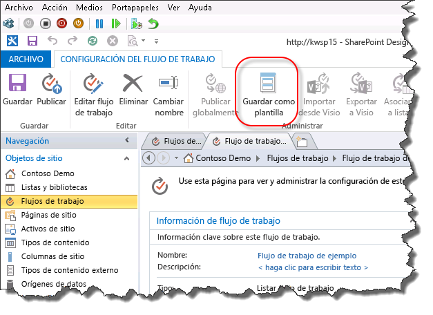
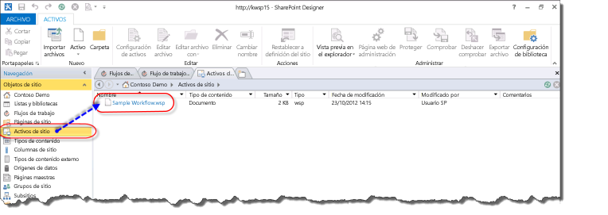
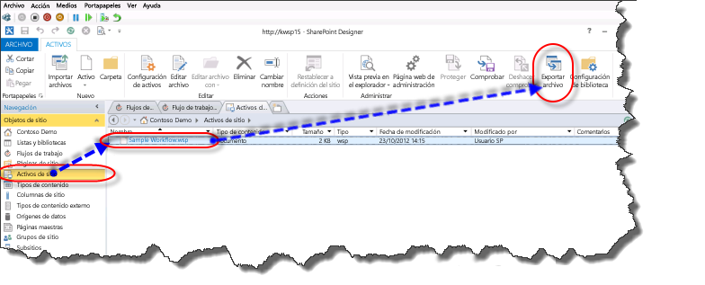
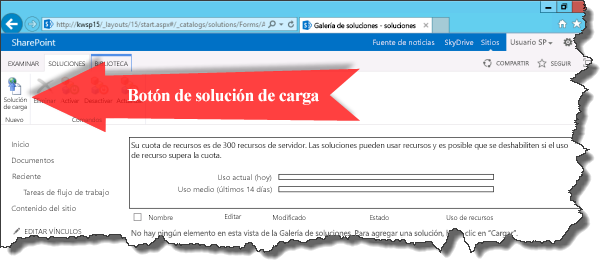
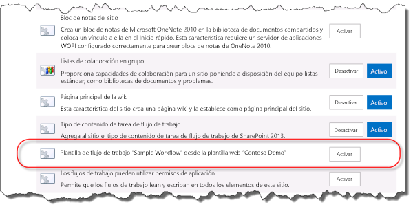

# Descripción de cómo se empaqueta e implementa un flujo de trabajo en SharePoint 2013
Obtenga información sobre cómo empaquetar e implementar un flujo de trabajo en SharePoint Server 2013 con SharePoint Designer 2013.
## Información general sobre las capacidades de empaquetado de flujo de trabajo de SharePoint Designer 2013

SharePoint Designer 2013 proporciona la capacidad para guardar un flujo de trabajo como una plantilla. Guardar un flujo de trabajo como una plantilla también se conoce como empaquetar el flujo de trabajo. Una vez guardado el flujo de trabajo como una plantilla, puede importarse a otros entornos de SharePoint Server 2013 y usarse sin tener que rediseñar el flujo de trabajo. No todos los tipos de flujo de trabajo se pueden guardar como una plantilla. En la siguiente matriz se muestran los tipos de flujo de trabajo que se pueden guardar como plantilla. 
  
    
    

**Soporte, por plataforma, para guardar un flujo de trabajo como una plantilla**

|**Tipo de flujo de trabajo**|**Plataforma de flujo de trabajo de SharePoint 2013**|**Plataforma de flujo de trabajo de SharePoint 2013**|
|:-----|:-----|:-----|
|Flujo de trabajo de lista    |No    |Sí    |
|Flujo de trabajo de sitio    |No    |Sí    |
|Flujo de trabajo reutilizable    |Sí    |Sí    |
   

  
    
    

  
    
    

> **NOTA**
> SharePoint Server 2013 contiene dos plataformas de flujo de trabajo diferentes: la plataforma de flujo de trabajo de SharePoint 2010 y la plataforma de flujo de trabajo de SharePoint 2013. Los dos plataformas están disponibles en SharePoint Server 2013. Para obtener más información sobre los dos flujos de trabajo, consulte  [Getting started with SharePoint Server 2013 workflow.](http://msdn.microsoft.com/library/cc73be76-a329-449f-90ab-86822b1c2ee8.aspx)
  
    
    

## Empaquetar un flujo de trabajo con SharePoint Designer 2013

El proceso de empaquetar un flujo de trabajo implica guardar el flujo de trabajo a un archivo de plantilla con SharePoint Designer 2013. Un paquete de flujo de trabajo está en formato de un archivo de paquete de soluciones web (WSP) y tiene una extensión .wsp. Para empaquetar un flujo de trabajo, siga estos pasos. 
  
    
    

### Empaquetar un flujo de trabajo

1. Abra un flujo de trabajo existente o desarrolle un nuevo flujo de trabajo en SharePoint Designer 2013.
    
  
2. En la ficha **Configuración de flujo de trabajo** de la cinta, haga clic en el botón **Guardar como plantilla** de la sección **Administrar** como se muestra en la figura.
    
   **Figura: Guardar el flujo de trabajo como plantilla**

  

  

  

  
3. Aparece un cuadro de diálogo informativo que indica que la plantilla se ha guardado en la biblioteca **Activos del sitio**.
    
  
4. Haga clic en la biblioteca Activos del sitio para ver la plantilla de flujo de trabajo, como se muestra en la figura.
    
   **Figura: Una plantilla de trabajo en Activos del sitio**

  

  

  

  

  
    
    

> **SUGERENCIA**
> Una plantilla de flujo de trabajo se guarda automáticamente en la biblioteca **Activos del sitio** de la colección de sitios en el que reside el flujo de trabajo.
  
    
    

## Implementar un paquete de flujo de trabajo SharePoint 2013

Puede implementar un paquete de flujo de trabajo en una granja de servidores de SharePoint o en un sitio diferente a la granja de servidores o en el sitio en el que se desarrolló. Para que la implementación de un flujo de trabajo sea correctas, se deben cumplir dos condiciones:
  
    
    

- Todas las dependencias del flujo de trabajo como listas, bibliotecas, columnas y tipos de contenido ya deben existir en el nuevo sitio.
    
  
- Cada dependencia debe tener el nombre exacto de la dependencia de origen.
    
  
Si se implementa un flujo de trabajo y las dependencias exactas no existen, el resultado generará un error.
  
    
    
Antes de implementar un flujo de trabajo, primero debe exportar la plantilla de flujo de trabajo desde el origen de la granja de servidores de SharePoint Server 2013. Para exportar una plantilla de flujo de trabajo, siga este procedimiento.
  
    
    

### Exportar una plantilla de flujo de trabajo

1. Abra SharePoint Designer 2013 y vaya a la biblioteca Activos del sitio donde se encuentra la plantilla.
    
  
2. Seleccione la plantilla de flujo de trabajo que desea exportar haciendo clic en ella.
    
  
3. Haga clic en el botón **Exportar archivo** para guardar el archivo de la plantilla en el equipo local o en una unidad de red, como se muestra en la figura.
    
   **Figura: Exportar la plantilla de flujo de trabajo de SharePoint Designer 2013**

  

  

  

  
Para implementar un paquete de flujo de trabajo, siga este procedimiento.
  
    
    

### Implementar una solución de flujo de trabajo

1. Abra Internet Explorer y vaya a la colección de sitios de SharePoint Server 2013 donde quiere implementar el flujo de trabajo.
    
  
2. Haga clic en **Acciones del sitio** y seleccione **Configuración del sitio**.
    
  
3. En la sección **Galerías de diseño web**, haga clic **Soluciones**.
    
    > **NOTA**
      > Debe estar en la página **Configuración del sitio** de la colección de sitios para poder ver la galería **Soluciones**. Si se encuentra en la página **Configuración del sitio** de un subsitio, la galería **Soluciones** no estará visible.
4. Haga clic en el botón **Cargar solución** para cargar la solución, como se muestra en la figura.
    
   **Ilustración: Botón Cargar solución**

  

  

  

  
5. Active la solución haciendo clic en el botón **Activar** como se muestra en la figura.
    
   **Figura: Cuadro de diálogo y botón Activar solución**

  

  

  

  
Después de activar una solución de flujo de trabajo para una colección de sitios, estará disponible como una característica para todos los subsitios. Para activar la característica de flujo de trabajo para un subsitio, siga este procedimiento.
  
    
    

### Activar la característica de flujo de trabajo

1. Abra **Configuración del sitio** en el sitio donde quiere activar la característica de flujo de trabajo.
    
  
2. En el grupo **Acciones del sitio**, haga clic en **Administrar características del sitio**.
    
  
3. Haga clic en **activar** junto a la característica de flujo de trabajo, como se muestra en la figura.
    
  

**Figura: Activar la característica de flujo de trabajo de sitio**

  
    
    

  
    
    

  
    
    

  
    
    

  
    
    

## Recursos adicionales

-  [Flujo de trabajo en SharePoint 2013](http://technet.microsoft.com/es-es/sharepoint/jj556245.aspx)
    
  
-  [What's new in workflow in SharePoint Server 2013](http://msdn.microsoft.com/library/6ab8a28b-fa2f-4530-8b55-a7f663bf15ea.aspx)
    
  
-  [Getting started with SharePoint Server 2013 workflow](http://msdn.microsoft.com/library/cc73be76-a329-449f-90ab-86822b1c2ee8.aspx)
    
  
-  [Desarrollo de flujos de trabajo en SharePoint Designer y Visio](workflow-development-in-sharepoint-designer-and-visio.md)
    
  
-  [Referencia rápida sobre acciones de flujo de trabajo (plataforma de flujo de trabajo de SharePoint 2013)](workflow-actions-quick-reference-sharepoint-2013-workflow-platform.md)
    
  
-  [Artículo del blog del equipo de SharePoint Designer: empaquetar flujo de trabajo e implementar el escenario](http://blogs.msdn.com/b/sharepointdesigner/archive/2012/08/30/packaging-list-site-and-reusable-workflow-and-how-to-deploy-the-package.aspx)
    
  

