# Formas de Visio en SharePoint Designer 2013: Guía de referencia rápida (plataforma de flujo de trabajo de SharePoint 2010)
Puede crear un flujo de trabajo en Microsoft Visio Professional 2013 y luego exportarlo a Microsoft SharePoint Designer 2013. Esta guía identifica las formas de Visio que se usan para crear un flujo de trabajo.Use este artículo de referencia solo si está trabajando en SharePoint Designer 2013, pero desea seguir usando la plataforma de flujo de trabajo de SharePoint 2010.Las formas de la plataforma de flujo de trabajo de SharePoint 2010 se presentan en tres galerías de símbolos: **Acciones de flujo de trabajo de SharePoint 2010**, **Condiciones de flujo de trabajo de SharePoint 2010** y **Terminadores de flujo de trabajo de SharePoint 2010:**.
## Acciones de flujo de trabajo

Las acciones de flujo de trabajo son operaciones específicas que realiza dicho flujo de trabajo. Cada flujo de trabajo debe contener al menos una acción.
  
    
    
Las acciones de esta lista se organizan en categorías basándose en su área de la aplicación en un flujo de trabajo. Por ejemplo, las acciones que afectan el comportamiento de un elemento de lista se agrupan bajo **Acciones de lista** y las acciones relacionadas con conjuntos de documentos se agrupan bajo **Acciones del conjunto de documentos**. Las categorías de acciones son:
  
    
    

-  [Acciones principales](visio-shapes-in-sharepoint-designer-2013-a-quick-reference-guide-sharepoint-2010.md#section1a) Son las acciones más utilizadas en un flujo de trabajo.
    
  
-  [Acciones del conjunto de documentos](visio-shapes-in-sharepoint-designer-2013-a-quick-reference-guide-sharepoint-2010.md#section1e) Por lo general, estas acciones se usan en flujos de trabajo asociados a una biblioteca de documentos o al tipo de contenido del documento.
    
  
-  [Acciones de lista](visio-shapes-in-sharepoint-designer-2013-a-quick-reference-guide-sharepoint-2010.md#section1b) Estas acciones realizan operaciones en los elementos de lista.
    
  
-  [Acciones relacionales](visio-shapes-in-sharepoint-designer-2013-a-quick-reference-guide-sharepoint-2010.md#section1d) La única acción de esta categoría busca un administrador de usuarios y almacena esa información en una variable.
    
  
-  [Acciones de tareas](visio-shapes-in-sharepoint-designer-2013-a-quick-reference-guide-sharepoint-2010.md#section1c) Estas acciones están asociadas con la aprobación, los comentarios y las operaciones de formularios.
    
  

> **IMPORTANTE**
> La mayoría de formas de acciones que puede insertar en un flujo de trabajo de SharePoint en Visio requieren configuración adicional cuando el flujo de trabajo se importa en SharePoint Designer. En Visio, recuerde usar la característica de comentarios de cada forma de acción para especificar la configuración o la configuración de la acción. 
  
    
    

### Acciones principales

Son las acciones utilizadas con más frecuencia y pueden usarse en cualquier tipo de flujo de trabajo o paso.
  
    
    

****

|**Forma de acción de Visio**|**Acción correspondiente en SharePoint Designer**|**Descripción de la acción**|
|:-----|:-----|:-----|
|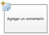|Esta acción de Visio es igual a la acción **Agregar un comentario** en SharePoint Designer 2013 y se muestra como:      > **NOTA**> Los comentarios permanecen visibles cuando el flujo de trabajo se exporta a Visio.           |**Agregar un comentario**   Use esta acción para dejar comentarios informativos en el diseñador de flujo de trabajo como referencia. Esto es especialmente útil cuando hay otros usuarios que colaboran en la creación del flujo de trabajo. Por ejemplo, si una variable del flujo de trabajo actual no tiene un nombre descriptivo, use esta acción para agregar un comentario con el fin de indicar qué hace la variable del flujo de trabajo.    |
|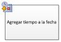|Esta acción de Visio es igual a la acción **Agregar hora a la fecha** en SharePoint Designer 2013 y se muestra como:  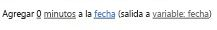|**Agregar hora a la fecha**   Use esta acción para agregar una hora concreta en minutos, horas, días, meses o años a una fecha y almacenar el valor de resultado como una variable. La fecha puede ser una fecha actual, una fecha específica o una búsqueda.    |
||Esta acción de Visio es igual a la acción **Realizar cálculo** en SharePoint Designer 2013 y se muestra como:  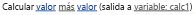|**Realizar cálculo**   Use esta acción para realizar un cálculo, como agregar, restar, multiplicar o dividir dos valores y almacenar el valor de resultado en una variable.    |
|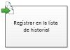|Esta acción de Visio es igual que la acción **Registrar en lista de historial** en SharePoint Designer 2013 y se muestra como:  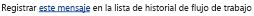|**Registrar en lista de historial**   Use esta acción para registrar un mensaje sobre el flujo de trabajo en su lista de historial. Un mensaje puede ser un resumen de un evento de flujo de trabajo o nada significativo sobre el flujo de trabajo. La lista de historial de flujo de trabajo puede ser útil para solucionar problemas con el flujo de trabajo.    |
|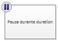|Esta acción de Visio es igual que la acción **Detener durante** en SharePoint Designer 2013 y se muestra como:  |**Detener durante**   Use esta acción para detener el flujo de trabajo durante un tiempo concreto en días, horas o minutos.    > **NOTA**> El tiempo de retraso determina el intervalo de trabajos del temporizador, que tiene un valor predeterminado de cinco minutos.           |
|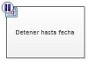|Esta acción de Visio es igual que la acción **Detener hasta fecha** en SharePoint Designer 2013 y se muestra como:  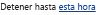|**Detener hasta fecha**   Use esta acción para detener el flujo de trabajo hasta una fecha determinada. Puede agregar una fecha actual, una fecha específica o una búsqueda.    |
|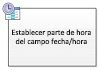|Esta acción de Visio es igual que la acción ** Establecer la parte de hora del campo Fecha y hora** en SharePoint Designer 2013 y se muestra como:  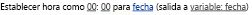|**Establecer la parte de hora del campo Fecha y hora**   Use esta acción para crear una marca de tiempo y almacenar el valor de resultado en una variable. Puede establecer el tiempo en horas y minutos y agregar una fecha actual, la fecha específica o una búsqueda.    |
|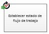| Esta acción de Visio es igual que la acción **Establecer estado de flujo de trabajo** en SharePoint Designer 2013 y se muestra como:  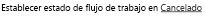 No se puede cambiar el nombre ni eliminar un valor de estado una vez que se ha creado. Sin embargo, no es necesario usarlo.    Un estado personalizado es aplicable al flujo de trabajo actual y no se puede usar en otro flujo de trabajo    Un flujo de trabajo no puede usar los valores de estado personalizados que defina en la acción si la acción se utiliza dentro de un paso de suplantación.   |**Establecer estado de flujo de trabajo**   Use esta acción para establecer el estado del flujo de trabajo. Las opciones predeterminadas son **Cancelado**, **Aprobado** y **Rechazado**.    Puede escribir un nuevo valor de estado en la lista desplegable de la acción. Una vez que escriba un valor de estado, la entrada se agrega automáticamente a la lista desplegable.    Si la acción **Establecer estado de flujo de trabajo** es el último paso del flujo de trabajo donde también se ha utilizado un valor personalizado, puede ver su valor predeterminado en la columna **Estado** de la lista al finalizar o pausar el flujo de trabajo.   |
|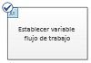|Esta acción de Visio es igual que la acción **Establecer variable de flujo de trabajo** en SharePoint Designer 2013 y se muestra como:  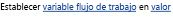|**Establecer variable de flujo de trabajo**   Use esta acción para establecer una variable de flujo de trabajo en un valor. Utilice esta acción cuando quiera que el flujo de trabajo asigne datos a una variable.    |
|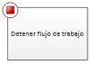|Esta acción de Visio es igual que la acción **Eliminar elemento** en SharePoint Designer 2013 y se muestra como:  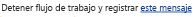|**Detener flujo de trabajo**   Use esta acción para detener la instancia actual del flujo de trabajo y registrar un mensaje en la lista **Historial del flujo de trabajo**. El mensaje que se especifique en la acción aparecerá en la columna **Descripción** del historial de flujo de trabajo tras la finalización del flujo de trabajo.   |
   

### Acciones de lista

Estas acciones se usan en los elementos de lista.
  
    
    

****

|**FORMA DE ACCIÓN DE VISIO**|**ACCIÓN CORRESPONDIENTE EN SHAREPOINT DESIGNER**|**DESCRIPCIÓN DE LA ACCIÓN**|
|:-----|:-----|:-----|
|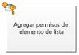|Esta acción de Visio es igual que la acción **Agregar permisos de elemento de lista** en SharePoint Designer 2013 y se muestra como:  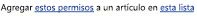    > **NOTA**> Esta acción solo está disponible dentro de un paso de suplantación.           |**Agregar permisos de elemento de lista**   Esta acción concede niveles de permisos específicos para un elemento a usuarios específicos.    |
|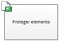|Esta acción de Visio es igual que la acción **Proteger elemento** en SharePoint Designer 2013 y se muestra como:  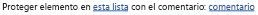|**Proteger elemento**   Esta acción protege un elemento desprotegido.    > **NOTA**> Solo puede proteger elementos de una biblioteca de documentos.           |
||Esta acción de Visio es igual que la acción **Desproteger elemento** en SharePoint Designer 2013 y se muestra como:  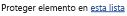|**Desproteger elemento**   Use esta acción para desproteger un elemento. El flujo de trabajo comprueba si el elemento está protegido antes de desproteger un documento.    > **NOTA**> Solo puede desproteger elementos de una biblioteca en su sitio.           |
|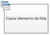|Esta acción de Visio es igual que la acción **Copiar elemento de lista** en SharePoint Designer 2013 y se muestra como:  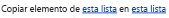|**Copiar elemento de lista**   Use esta acción para copiar un elemento de lista en otra lista. Si hay un documento en el elemento de lista, el flujo de trabajo también copia el documento en la lista de destino.    > **IMPORTANTE**> Debe tener al menos una columna similar en las listas de origen y de destino.           |
|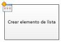|Esta acción de Visio es igual que la acción **Crear elemento de lista** en SharePoint Designer 2013 y se muestra como:  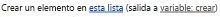|**Crear elemento de lista**   Use esta acción para crear un nuevo elemento de lista en la lista que especifique. Puede suministrar los campos y valores del nuevo elemento.    Puede usar esta acción siempre que desee un nuevo elemento que se creará con información específica.    > **NOTA**> La variable de resultado es el identificador del elemento creado en la lista.           |
|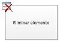|Esta acción de Visio es igual que la acción **Eliminar elemento** en SharePoint Designer 2013 y se muestra como:  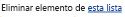|**Eliminar elemento**   Use esta acción para eliminar un elemento.    |
|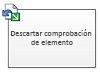|Esta acción de Visio es igual que la acción **Descartar desprotección de elemento** en SharePoint Designer 2013 y se muestra como:  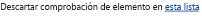|**Descartar desprotección de elemento**   Use esta acción si un elemento está desprotegido, se han realizado cambios en él y desea descartar los cambios y comprobar el elemento de nuevo.    |
|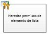|Esta acción de Visio es igual que la acción **Heredar permisos principales de elemento de lista** en SharePoint Designer 2013 y se muestra como:  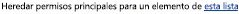    > **NOTA**> Esta acción solo está disponible en un paso de suplantación.           |**Heredar permisos de elemento de lista**   Si el elemento tiene permisos únicos, puede usar esta acción para hacer que el elemento herede los permisos principales de la lista.    |
|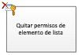|Esta acción de Visio es igual que la acción **Quitar permisos de elemento de lista** en SharePoint Designer 2013 y se muestra como:  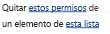    > **NOTA**> Esta acción solo está disponible en un paso de suplantación.           |**Quitar permisos de elemento de lista**   Esta acción quita los permisos de un elemento para usuarios específicos.    |
|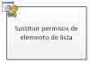|Esta acción de Visio es igual que la acción **Reemplazar permisos de elemento de lista** en SharePoint Designer 2013 y se muestra como:  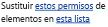    > **NOTA**> Esta acción solo está disponible en un paso de suplantación.           |**Reemplazar permisos de elemento de lista**   Reemplaza los permisos actuales de un artículo con los nuevos permisos que especifique en la acción.    |
|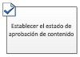|Esta acción de Visio es igual que la acción **Establecer estado de aprobación de contenido** en SharePoint Designer 2013 y se muestra como:  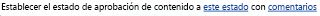    > **NOTA**> Aprobación de contenido debe estar habilitada en la lista para usar esta acción.           
|**Establecer estado de aprobación de contenido**   Si se ha habilitado aprobación de contenido en la lista, use esta acción para establecer el campo de estado de aprobación de contenido en un valor Aprobado, Rechazado o Pendiente. Puede escribir un estado personalizado en la acción.    > **NOTA**> La acción **Establecer estado de aprobación de contenido** funciona en el elemento actual que actúa el flujo de trabajo, por lo tanto, la acción no está disponible en un flujo de trabajo de sitio.          |
|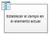|Esta acción de Visio es igual que la acción **Establecer campo en elemento actual** en SharePoint Designer 2013 y se muestra como:  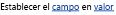|**Establecer campo en elemento actual**   Use la acción para establecer un campo en el elemento actual para un valor.    > **NOTA**> Si desea pausar el flujo de trabajo hasta que cambie el valor del campo, en su lugar use la acción **Esperar cambio de campo en elemento actual**.           La acción **Establecer campo en elemento actual** no debe utilizarse en un flujo de trabajo de sitio.   |
||Esta acción de Visio es igual que la acción **Actualizar elemento de lista** en SharePoint Designer 2013 y se muestra como:  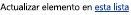|**Actualizar elemento de lista**   Use esta acción para actualizar un elemento de lista. Puede especificar los campos y los nuevos valores de esos campos.    |
|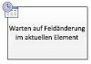|Esta acción de Visio es igual que la acción **Esperar cambio de campo en elemento actual** en SharePoint Designer 2013 y se muestra como:  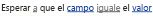|**Esperar cambio de campo en elemento actual**   Esta acción detiene el flujo de trabajo hasta que el campo en elemento actual ha cambiado a un nuevo valor.    > **NOTA**> Si desea que el flujo de trabajo cambie el valor del campo, en lugar de que el flujo de trabajo espere a que cambie el campo, utilice la acción **Establecer campo en elemento actual** en su lugar.          |
   

### Acciones de tareas

Las acciones de esta categoría pertenecen a los elementos de tareas. Estas acciones se aplican únicamente a los sitios de SharePoint que ejecutan SharePoint Server 2013.
  
    
    

****

|**FORMA DE ACCIÓN DE VISIO**|**ACCIÓN CORRESPONDIENTE EN SHAREPOINT DESIGNER**|**DESCRIPCIÓN DE LA ACCIÓN**|
|:-----|:-----|:-----|
|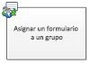|Esta acción de Visio es igual que la acción **Asignar un formulario a un grupo** en SharePoint Designer 2013 y se muestra como:  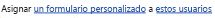|**Asignar un formulario a un grupo**   Use esta acción para crear un formulario de tareas personalizado con campos personalizados.    Puede usar esta acción para asignar una tarea a uno o más participantes o grupos donde se les solicita realizar sus tareas. Los participantes proporcionan sus respuestas en los campos formulario de tareas personalizados y, cuando se realicen con la tarea, haga clic en **Realizar tarea** en el formulario.   |
|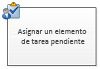|Esta acción de Visio es igual que la acción **Asignar un formulario a un grupo** en SharePoint Designer 2013 y se muestra como:  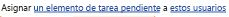|**Asignar un elemento de tarea**   Use esta acción para asignar una tarea a cada uno de los participantes, pidiéndoles realizar sus tareas y luego, cuando hayan terminado, haga clic en botón **Realizar tarea** en el formulario de tareas.   |
|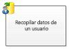|Esta acción de Visio es igual que la acción **Recopilar datos de un usuario** en SharePoint Designer 2013 y se muestra como:  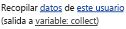|**Recopilar datos de un usuario**   Use esta acción para asignar una tarea al participante, pidiéndole que proporcione la información necesaria en un formulario de tareas personalizado y luego haga clic en el botón **Realizar tarea** en el formulario de tareas.   Esta acción tiene una cláusula de salida, es decir, el flujo de trabajo almacena la información devuelta por la acción en una variable correspondiente. El identificador del elemento de tarea completada de la acción del elemento de lista se almacena en la variable collect.    |
|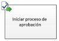|Esta acción de Visio es igual que la acción **Iniciar proceso de aprobación** en SharePoint Designer 2013 y se muestra como:  |**Iniciar proceso de aprobación**   Use esta acción para enrutar un documento para su aprobación. Los aprobadores pueden aprobar o rechazar el documento, reasignar la tarea de aprobación o solicitar cambios.    Puede asignar tareas a participantes internos y externos de la acción. Un participante externo puede ser un empleado de la organización que no es un usuario de la colección de sitios o cualquiera de fuera de la organización.    |
||Esta acción de Visio es igual que la acción **Iniciar proceso de comentarios** en SharePoint Designer 2013 y se muestra como:  |**Iniciar proceso de comentarios**   Use esta acción para asignar elementos de tarea para comentarios a los usuarios en un orden específico, serie o en paralelo. El valor predeterminado es paralelo. Los usuarios o los participantes de la tarea también pueden reasignar una tarea a otros usuarios. Cuando termine, los usuarios pueden hacer clic en el botón **Enviar comentarios** para indicar la finalización de la tarea.   Puede asignar tareas a participantes internos y externos de la acción. Un participante externo puede ser un empleado de la organización que no es un usuario de la colección de sitios o cualquiera de fuera de la organización.    |
||Esta acción de Visio es igual que la acción **Iniciar proceso de tarea personalizado** en SharePoint Designer 2013 y se muestra como:  |**Iniciar proceso de tarea personalizado**   La acción **Iniciar proceso de tarea personalizado** es una plantilla de proceso de aprobación que puede usar si otras acciones de aprobación no satisfacen sus necesidades.   |
   

### Acciones relacionales

La acción de esta categoría busca el administrador de un usuario y almacena dicha información en una variable. Esta acción solo se aplica a los sitios de SharePoint ejecuta SharePoint Server 2013.
  
    
    

****

|**FORMA DE ACCIÓN DE VISIO**|**ACCIÓN CORRESPONDIENTE EN SHAREPOINT DESIGNER**|**DESCRIPCIÓN DE LA ACCIÓN**|
|:-----|:-----|:-----|
||Esta acción de Visio es igual que la acción **Buscar administrador de un usuario** en SharePoint Designer 2013 y se muestra como:  |**Buscar administrador de un usuario**   Use esta acción para buscar el administrador de un usuario. El valor de resultado luego se almacena en una variable.    > **NOTA**> Para que esta acción funcione correctamente, debe ejecutar el servicio de perfiles de usuario en SharePoint.           |
   

### Acciones del conjunto de documentos

Algunas acciones de flujo de trabajo solo están disponibles cuando el flujo de trabajo está asociado a una biblioteca de documentos, como documentos compartidos, o para el tipo de contenido del documento.
  
    
    

****

|**FORMA DE ACCIÓN DE VISIO**|**ACCIÓN CORRESPONDIENTE EN SHAREPOINT DESIGNER**|**DESCRIPCIÓN DE LA ACCIÓN**|
|:-----|:-----|:-----|
||Esta acción de Visio es igual que la acción **Iniciar proceso de aprobación de conjunto de documentos** en SharePoint Designer 2013 y se muestra como:  |**Enviar aprobación para el conjunto de documentos**   Use esta acción para iniciar el proceso de aprobación para un conjunto de documentos.    |
||Esta acción de Visio es igual que la acción **Enviar conjunto de documentos al repositorio** en SharePoint Designer 2013 y se muestra como:  |**Enviar conjunto de documentos al repositorio**   Use esta acción para mover o copiar el conjunto de documentos al repositorio de documentos. Un repositorio de documentos puede ser una biblioteca del sitio de SharePoint o un sitio independiente como el centro de documentos, que redirige los registros a un destino específico según las reglas que defina.    |
||Esta acción de Visio es igual que la acción **Enviar documento a repositorio** en SharePoint Designer 2013 y se muestra como:  |**Enviar documento a repositorio**   Use esta acción para mover o copiar un documento a un repositorio de documentos. Un repositorio de documentos puede ser una biblioteca del sitio de SharePoint o un sitio independiente como el centro de documentos, que redirige los registros a un destino específico según las reglas que defina.    |
||Esta acción de Visio es igual que la acción **Establecer estado de aprobación de contenido del conjunto de documentos** en SharePoint Designer 2013 y se muestra como:  |**Establecer estado de aprobación de contenido para el conjunto de documentos**   Use esta acción para establecer la aprobación del contenido de un conjunto de documentos en **Aprobado**, **Rechazado** o **Pendiente**.    |
   

## Condiciones de flujo de trabajo

Una condición de flujo de trabajo es una ramificación en el flujo de trabajo. La condición de flujo de trabajo compara la entrada con un valor especificado. Si coinciden, el flujo de trabajo sigue una rama, si no es así, sigue la rama de otra.
  
    
    

> **IMPORTANTE**
> La mayoría de las formas de condición que puede insertar en un flujo de trabajo de SharePoint en Visio requieren configuración adicional cuando se importa el flujo de trabajo en SharePoint Designer. En Visio, recuerde usar la característica de comentarios de cada forma de condición para especificar los criterios de decisión de la condición. 
  
    
    

### Condiciones generales

En esta sección se describen las condiciones que están disponibles en SharePoint Designer 2013de lista y flujos de trabajo de lista reutilizables, independientemente de la lista o el tipo de contenido asociado con el flujo de trabajo.
  
    
    

****

|**FORMA DE CONDICIÓN DE VISIO**|**CONDICIÓN CORRESPONDIENTE EN SHAREPOINT DESIGNER**|**DESCRIPCIÓN DE LA CONDICIÓN**|
|:-----|:-----|:-----|
||Esta condición de Visio es la mismo que la condición **Si cualquier valor es igual al valor** en SharePoint Designer 2013 y se muestra como:  |**Comparar origen de datos**   Esta condición compara dos valores. Puede especificar si los valores deben ser iguales o distintos.    |
||Esta condición de Visio es igual que la condición **Si el campo de elemento actual es igual al valor** en SharePoint Designer 2013 y se muestra como:  |**Comparar campo del documento**   Esta condición comprueba un campo con un valor que especifique. Puede especificar si los valores deben ser iguales o distintos.    |
||Esta condición de Visio es igual que la condición **Creado por una persona especificada** en SharePoint Designer 2013 y se muestra como:  |**Creado por una persona especificada**   Esta condición comprueba si el elemento fue creado por un usuario específico. El usuario se puede especificar como una dirección de correo electrónico, como olivier@contoso.com o seleccionar usuarios de SharePoint, Exchange o Active Directory.    > **NOTA**> La dirección de correo electrónico y el nombre de usuario distinguen mayúsculas y minúsculas. Se recomienda que seleccione una dirección de correo electrónico o un nombre de usuario para ayudar a garantizar el uso de mayúsculas y minúsculas. Si escribe una dirección de correo electrónico o un nombre de usuario, debe coincidir con las mayúsculas y minúsculas de la cuenta. Por ejemplo, si creó contoso\\molly no se evaluará como true si la cuenta de usuario es Contoso\\Molly.           |
||Esta condición de Visio es igual que la condición **Creado en un intervalo de fechas específico** en SharePoint Designer 2013 y se muestra como:  |**Creado en el intervalo de fechas determinado**   Esta condición comprueba si el elemento se creó entre las fechas especificadas. Puede usar la fecha actual, una fecha específica o una búsqueda.    |
||Esta condición de Visio es igual que la condición **Modificado por una persona específica** en SharePoint Designer 2013 y se muestra como:  |**Modificado por una persona específica**   Utilice esta condición para comprobar si un elemento ha sido modificado por un usuario especificado. El usuario se puede especificar como una dirección de correo electrónico, como olivier@contoso.com o seleccionar usuarios de SharePoint, Exchange o Active Directory.    > **NOTA**> La dirección de correo electrónico y el nombre de usuario distinguen mayúsculas y minúsculas. Se recomienda que seleccione una dirección de correo electrónico o un nombre de usuario para ayudar a garantizar el uso de mayúsculas y minúsculas. Si escribe una dirección de correo electrónico o un nombre de usuario, debe coincidir con las mayúsculas y minúsculas de la cuenta. Por ejemplo, si creó contoso\\molly no se evaluará como true si la cuenta de usuario es Contoso\\Molly.           |
||Esta condición de Visio es igual que la condición **Modificado en un intervalo de fechas determinado** en SharePoint Designer 2013 y se muestra como:  |**Modificado en un intervalo de fechas determinado**   Esta condición comprueba si un elemento se ha modificado entre las fechas especificadas. Puede usar la fecha actual, una fecha específica o una búsqueda.    |
||Esta condición de Visio es igual que la condición **El campo de título contiene palabras clave** en SharePoint Designer 2013 y se muestra como:  |**El campo de título contiene palabras clave**   Esta condición comprueba si el campo **Título** de un elemento contiene una palabra específica. Puede especificar la palabra clave en el generador de cadenas, que puede ser un valor estático, una cadena dinámica o una combinación, o insertar una búsqueda en un campo o variable.   > **NOTA**> No puede buscar más de una palabra clave en la condición **El campo de título contiene palabras clave**. Sin embargo, puede usar operadores lógicos como**||**(or) o **&amp;&amp;** (and.          |
   

### Condiciones del conjunto de documentos

Algunas condiciones de flujo de trabajo solo están disponibles cuando el flujo de trabajo está asociado a una biblioteca de documentos, como documentos compartidos o para el tipo de contenido del documento.
  
    
    

|**FORMA DE CONDICIÓN DE VISIO**|**CONDICIÓN CORRESPONDIENTE EN SHAREPOINT DESIGNER**|**DESCRIPCIÓN DE LA CONDICIÓN**|
|:-----|:-----|:-----|
||Esta condición de Visio es el misma que la condición **El archivo tiene un tamaño comprendido en un intervalo de kilobytes determinado** en SharePoint Designer 2013 y se muestra como:  |**El tamaño de archivo se encuentra en un rango específico**   Esta condición comprueba si el tamaño del archivo de un documento se encuentra entre los tamaños especificados, en kilobytes. La condición no incluye los tamaños especificados en la evaluación. Puede especificar un número o usar una búsqueda para el primer y segundo tamaño en la condición.    |
||Esta condición de Visio es igual que la condición **El tipo de archivo es un tipo determinado** en SharePoint Designer 2013 y se muestra como:  |**El archivo es de un tipo específico**   Esta condición comprueba si el tipo de archivo del elemento actual es del tipo especificado, por ejemplo, docx. Puede especificar el tipo de archivo como una cadena o usar una búsqueda.    |
   

### Condiciones de lista

  
    
    

****

|**FORMA DE CONDICIÓN DE VISIO**|**CONDICIÓN CORRESPONDIENTE EN SHAREPOINT DESIGNER**|**DESCRIPCIÓN DE LA CONDICIÓN**|
|:-----|:-----|:-----|
||Esta condición de Visio es igual que la condición **Comprobar niveles de permisos de elemento de lista** en SharePoint Designer 2013 y se muestra como:  |**Comprobar permisos de usuario exactos**   Esta condición comprueba que el usuario especificado tiene el nivel de permiso mínimos necesarios.    |
||Esta condición de Visio es igual que la condición **Comprobar permisos de elemento de lista** en SharePoint Designer 2013 y se muestra como:  |**Comprobar permiso de usuario**   Esta condición comprueba si el usuario especificado tiene los permisos mínimos necesarios.    |
   

## Terminadores de flujo de trabajo

En Visio, cada flujo de trabajo debe comenzar con un terminador de inicio (
  
    
    

  
    
    
) y finalizan con un terminador Detener (
  
    
    

  
    
    
). En un flujo de trabajo determinado solo puede utilizarse un tipo de terminador. Los terminadores son necesarios cuando se crea un flujo de trabajo de SharePoint en Visio > para que el flujo de trabajo pueda pasar la validación y se pueda exportar. Los terminadores de flujo de trabajo no se utilizan en SharePoint Designer.
  
    
    

## Recursos adicionales

-  [Novedades en flujos de trabajo para SharePoint 2013](what-s-new-in-workflows-for-sharepoint-2013.md)
    
  
-  [Introducción a los flujos de trabajo de SharePoint 2013](get-started-with-workflows-in-sharepoint-2013.md)
    
  
-  [Desarrollo de flujos de trabajo en SharePoint Designer y Visio](workflow-development-in-sharepoint-designer-and-visio.md)
    
  

  
    
    
