# Novedades para desarrolladores de SharePoint 2013
Conozca las nuevas características y funciones de SharePoint 2013, como el nuevo modelo de complemento de nube, las herramientas de desarrollo, las mejoras de la plataforma, los complementos móviles y más.
## Modelo de complemento de nube

SharePoint 2013 presenta un modelo de complemento de nube que le permite crearcomplementos. Las Complementos de SharePoint son funciones independientes que amplían las capacidades de un sitio web de SharePoint. Un complemento puede incluir componentes de SharePoint, como listas, flujos de trabajo y páginas de sitio, pero también puede exponer una aplicación web remota y datos remotos en SharePoint. Un complemento tiene pocas dependencias o ninguna en el otro software que pueda haber en el dispositivo o la plataforma donde está instalado (aparte del que esté integrado en la plataforma). Esta característica permite que los complementos se instalen fácilmente y se desinstalen limpiamente. Los componentes no tienen código personalizado que se ejecute en los servidores de SharePoint, sino que toda la lógica personalizada se encuentra en la nube o en los equipos cliente. Además, SharePoint 2013 introduce un modelo de entrega innovador para las Complementos de SharePoint que incluye componentes como la Tienda Office y el catálogo de aplicaciones.
  
    
    
 [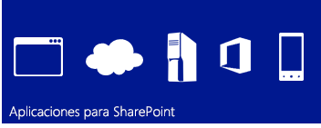
  
    
    
](http://msdn.microsoft.com/library/cd1eda9e-8e54-4223-93a9-a6ea0d18df70%28Office.15%29.aspx) [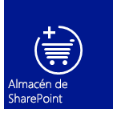
  
    
    
](http://msdn.microsoft.com/library/d15a74a7-3c10-485a-9885-7ef11aaa0d90%28Office.15%29.aspx) [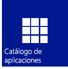
  
    
    
](http://msdn.microsoft.com/library/d15a74a7-3c10-485a-9885-7ef11aaa0d90%28Office.15%29.aspx)
  
    
    

## Modelo de programación familiar usando estándares web

SharePoint 2013 facilita a los desarrolladores web, incluidos a los que trabajan en pilas de plataformas que no son de Microsoft, crear soluciones de SharePoint. Lo que hace que esto sea posible es que SharePoint 2013 se basa en estándares web comunes, como HTML, CSS y JavaScript. Además, la implementación se basa en protocolos establecidos, como el Open Data protocol (OData) y OAuth.
  
    
    
 [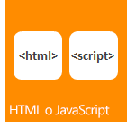
  
    
    
](http://msdn.microsoft.com/library/cd1eda9e-8e54-4223-93a9-a6ea0d18df70%28Office.15%29.aspx) [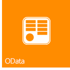
  
    
    
](using-odata-sources-with-business-connectivity-services-in-sharepoint-2013.md) [
  
    
    
](get-to-know-the-sharepoint-2013-rest-service.md) [
  
    
    
](http://msdn.microsoft.com/library/bde5647a-fff1-4b51-b67b-2139de79ce4a%28Office.15%29.aspx)
  
    
    

## Herramientas de desarrollo

La versión actual supone un gran avance en la optimización de las herramientas de desarrollo existentes, como Visual Studio y SharePoint Designer, además de ofrecer la versión de las recién desarrolladas herramientas Herramientas de desarrollo de Office 365 de Napa basadas en web para desarrollar complementos. El nuevo sistema de proyectos unificados de Visual Studio le permite desarrollar Complementos de SharePoint, Complementos de Office, Complementos de SharePoint que incluyen Complementos de Office o Complementos de Office que están hospedadas en SharePoint. Además de las plantillas de proyecto de SharePoint de las versiones anteriores, ahora Visual Studio 2012 incluye una nueva plantilla de proyecto de complemento en la carpeta de complementos denominada Complementos para SharePoint 2013. Se agregaron varias propiedades nuevas a la ventana de propiedades y a las páginas de propiedades para dar soporte a los proyectos de Complemento de SharePoint. Otras mejoras son la compatibilidad total para el desarrollo con el modelo de complemento de nube, incluida la compatibilidad con OData y OAuth, y la compatibilidad total para el desarrollo en la plataforma Cliente del Administrador de flujos de trabajo 1.0.
  
    
    
 [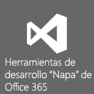
  
    
    
](http://msdn.microsoft.com/library/82a3645c-0911-4926-9176-236ac8d28bdd%28Office.15%29.aspx) [
  
    
    
](http://msdn.microsoft.com/library/e00dc63f-b4a4-4c08-b058-729fcb09af41%28Office.15%29.aspx) [
  
    
    
](workflow-development-in-sharepoint-designer-and-visio.md)
  
    
    

## Mejoras en la plataforma principal

En términos generales, SharePoint 2013 se ha mejorado para dar soporte a la nueva arquitectura basada en nube y al marco de desarrollo controlado por aplicaciones. Desde el nivel más bajo de las API de SharePoint hasta la conectividad y la integración de los medios sociales, SharePoint 2013 se diseña y ejecuta para ofrecer una experiencia de aplicaciones enriquecidas. Además del uso de los extremos de transferencia de estado representacional (REST) para los servicios web, existe una nueva API más amplia para el desarrollo de servidores y clientes. Ahora, además de la representación del lado cliente, se admiten los receptores de eventos remotos. 
  
    
    
 [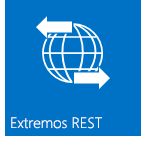
  
    
    
](e1ff2979-1c16-4cb0-a57e-9168dfe20a7c.md) [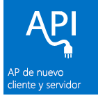
  
    
    
](choose-the-right-api-set-in-sharepoint-2013.md) [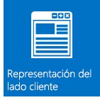
  
    
    
](how-to-customize-a-field-type-using-client-side-rendering.md) [
  
    
    
](http://msdn.microsoft.com/library/c050d056-8548-4496-a053-016779d723d9%28Office.15%29.aspx)
  
    
    

## Movilidad

Con SharePoint 2013, puede combinar aplicaciones de Windows Phone 7 con aplicaciones y servicios de SharePoint locales o con aplicaciones y servicios de SharePoint remotos que se ejecuten en la nube (como los que usa SharePoint Online) para crear aplicaciones eficaces que amplíen las funciones más allá del tradicional escritorio o portátil en un entorno realmente portátil y mucho más accesible. Las nuevas características de movilidad disponibles en SharePoint 2013 se basan en tecnologías y herramientas de Microsoft existentes, como SharePoint, Windows Phone 7, Visual Studio y Microsoft Silverlight. Puede crear aplicaciones móviles controladas por SharePoint para Windows Phone usando la nueva plantilla del asistente de aplicaciones para teléfono de SharePoint que hay en Visual Studio, que le permite crear aplicaciones móviles simples basadas en listas. Puede integrar nuevas características introducidas en SharePoint 2013, como el tipo de campo de geolocalización y las notificaciones push de SharePoint Server, en sus aplicaciones móviles.
  
    
    
 [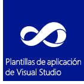
  
    
    
](overview-of-windows-phone-sharepoint-2013-application-templates-in-visual-studio.md) [
  
    
    
](how-to-configure-and-use-push-notifications-in-sharepoint-2013-apps-for-windows.md) [
  
    
    
](integrating-location-and-map-functionality-in-sharepoint-2013.md)
  
    
    

## Sociales y de colaboración

Las nuevas y mejoradas características sociales y de colaboración hacen que sea más fácil para los usuarios comunicarse y estar al día de toda la información. La fuente social mejorada de Mi sitio ayuda a los usuarios a estar informados sobre las personas y el contenido que les interesa. La nueva característica Sitio de la comunidad ofrece una experiencia enriquecida en la comunidad que permite a los usuarios buscar y compartir información fácilmente, así como buscar a personas con los mismos intereses.
  
    
    
 [
  
    
    
](work-with-social-feeds-in-sharepoint-2013.md) [
  
    
    
](what-s-new-for-developers-in-social-and-collaboration-features-in-sharepoint-201.md#bkmk_Collab) [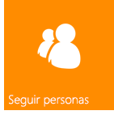
  
    
    
](follow-people-in-sharepoint-2013.md) [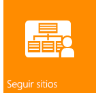
  
    
    
](follow-content-in-sharepoint-2013.md)
  
    
    

## Búsqueda

La función de búsqueda de SharePoint 2013 incluye varias mejoras, procesamiento de contenido personalizado con el servicio web de enriquecimiento de contenido y un nuevo marco para presentar los tipos de resultados de búsqueda. Además, se han hecho mejoras considerables en el lenguaje de consulta de palabras clave (KQL).
  
    
    
 [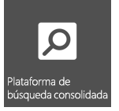
  
    
    
](custom-content-processing-with-the-content-enrichment-web-service-callout.md) [
  
    
    
](what-s-new-in-sharepoint-2013-search-for-developers.md) [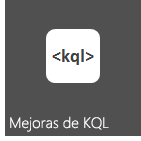
  
    
    
](building-search-queries-in-sharepoint-2013.md)
  
    
    

## Flujos de trabajo

Cliente del Administrador de flujos de trabajo 1.0 es una infraestructura de flujos de trabajo rediseñada que está integrada en Windows Workflow Foundation 4 y trae más potencia y flexibilidad a la creación de flujos de trabajo en SharePoint 2013. Un entorno de creación totalmente declarativo permite a los trabajadores de la información usar SharePoint Designer 2013 para crear flujos de trabajo sólidos, y un nuevo conjunto de plantillas de proyecto de flujo de trabajo de Visual Studio 2012 permite a los desarrolladores obtener acceso a características más sofisticadas, como las acciones personalizadas. Es más, Cliente del Administrador de flujos de trabajo 1.0 está totalmente integrado con el modelo para aplicaciones para SharePoint. Además, los flujos de trabajo se ejecutan en la nube y no en SharePoint, lo cual ofrece una gran flexibilidad al diseñar Complementos de SharePoint basadas en flujos de trabajo.
  
    
    
 [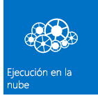
  
    
    
](what-s-new-in-workflows-for-sharepoint-2013.md) [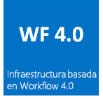
  
    
    
](sharepoint-2013-workflow-fundamentals.md) [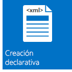
  
    
    
](workflow-development-in-sharepoint-designer-and-visio.md) [
  
    
    
](develop-sharepoint-2013-workflows-using-visual-studio.md)
  
    
    

## Administración de contenido empresarial

En SharePoint 2013, ahora puede usar las API del cliente .NET, Silverlight, Windows Phone y JavaScript además del conjunto de API administradas del servidor .NET, que se acaba de ampliar, para personalizar las experiencias y el comportamiento de la administración de contenido empresarial (ECM).
  
    
    
 [
  
    
    
](what-s-new-with-sharepoint-2013-site-development.md) [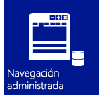
  
    
    
](managed-navigation-in-sharepoint-2013.md) [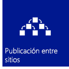
  
    
    
](cross-site-publishing-in-sharepoint-2013.md) [
  
    
    
](ediscovery-in-sharepoint-2013.md)
  
    
    

## Servicios de conectividad empresarial

Servicios de conectividad empresarial (BCS) le permite a SharePoint obtener acceso a datos desde sistemas de datos externos, como SAP, ERP y CRM, además de otras aplicaciones controladas por datos que se exponen a través de los servicios de WCF o los extremos OData. BCS en SharePoint 2013 se mejoró de muchas formas, incluida la conectividad OData, eventos externos, datos externos en complementos, filtrado y ordenación, compatibilidad para REST y otros elementos.
  
    
    
 [
  
    
    
](using-odata-sources-with-business-connectivity-services-in-sharepoint-2013.md) [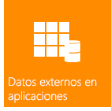
  
    
    
](add-in-scoped-external-content-types-in-sharepoint-2013.md) [
  
    
    
](external-events-and-alerts-in-sharepoint-2013.md)
  
    
    

## Servicios de aplicación

SharePoint Server 2013 incluye varios servicios para trabajar con datos en sus sitios de SharePoint. En SharePoint hemos introducido el Servicio de traducción automática, que traduce sitios, documentos y secuencias para ofrecer soporte multilingüe. SharePoint Server 2013 también incluye Servicios de Access y un nuevo modelo de acceso a datos. Para convertir archivos y secuencias a otros formatos, SharePoint Server 2013 tiene Word Automation Services y PowerPoint Automation Services (una nueva característica para SharePoint). SharePoint también ofrece herramientas de análisis de datos, como PerformancePoint Services y Servicios de Visio, que permiten usar inteligencia empresarial y nuevas y potentes características en Servicios de Excel.
  
    
    
 [
  
    
    
](machine-translation-services-in-sharepoint-2013.md) [
  
    
    
](powerpoint-automation-services-in-sharepoint-2013.md) [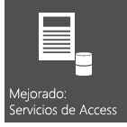
  
    
    
](what-s-new-in-access.md) [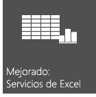
  
    
    
](09e96c8b-cb55-4fd1-a797-b50fbf0f9296.md)
  
    
    

## Recursos adicionales

-  [Información general sobre el desarrollo de SharePoint 2013](sharepoint-2013-development-overview.md)
    
  
-  [Desarrollar complementos para SharePoint](http://msdn.microsoft.com/library/71ddde4b-fac4-4d8c-aa2e-524f9c2c4c99%28Office.15%29.aspx)
    
  
-  [Complementos para SharePoint comparadas con las soluciones de SharePoint](sharepoint-add-ins-compared-with-sharepoint-solutions.md)
    
  
-  [Elegir el conjunto de API correcto en SharePoint 2013](choose-the-right-api-set-in-sharepoint-2013.md)
    
  
-  [Accesibilidad en SharePoint 2013](accessibility-in-sharepoint-2013.md)
    
  

