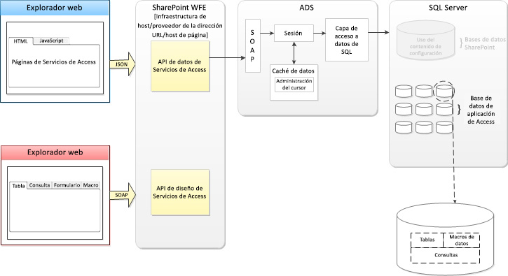

# Novedades de Access
Obtenga información acerca de las características de Access 2013 que facilitan la creación, implementación y administración de aplicaciones web de colaboración en local o en la nube.
## Introducción

Access 2013 incluye un nuevo modelo de aplicación diseñado para un propósito: simplificar el desarrollo web como en las versiones anteriores de Access con el desarrollo de Windows. Access 2013 permite a los expertos en la materia crear rápidamente aplicaciones que se pueden usar para el funcionamiento de su empresa. Al usar Microsoft SharePoint 2013 para hospedar el front-end de la aplicación y Microsoft SQL Server 2012 como su tecnología de almacenamiento de datos, Access 2013 mejora significativamente la capacidad de administración y escalabilidad de las aplicaciones de Access. La compatibilidad con Office 365 y SQL Azure expande significativamente el alcance de las aplicaciones de Access.
  
    
    

## Arquitectura

En un entorno local, las aplicaciones de Access 2013 las hospeda SharePoint 2013, mientras que los datos se almacenan en SQL Server 2012. SharePoint 2013 proporciona autenticación, autorización y seguridad para las aplicaciones de Access 2013. Las tablas, vistas, macros y consultas back-end se almacenan en una base de datos de SQL Server 2012.
  
    
    
Access 2013, a través de los servicios de Office 365 y SQL Azure, proporciona un método para implementar una aplicación de Access en la nube.
  
    
    
En la figura 1 se ofrece una visión general de la arquitectura de Access 2013.
  
    
    

**Figura 1. Arquitectura de Access 2013**

  
    
    

  
    
    

  
    
    
Cuando se crea una nueva aplicación de Access, Servicios de Access en SharePoint Server 2013 crea una nueva Base de datos de aplicación que almacena los datos, las vistas, las consultas y las macros que se incluyen en la aplicación. La base de datos del sistema Servicios de Access 2013 se puede configurar para crear nuevas Base de datos de aplicacións en un servidor SQL Server 2012 independiente.
  
    
    
Si se usa SQL Server 2012 para almacenar los datos, dispondrá de una elevada capacidad de administración y escalabilidad para las aplicaciones de Access. Atrás quedaron los días en los que era necesario rediseñar y reimplementar una aplicación de Access en un entorno más poderoso.
  
    
    
Las aplicaciones Access 2013 están en línea en el momento de su creación. Usted puede decidir si desea compartirlas con otras personas, implementarlas en un catálogo corporativo privado o en Tienda Office.
  
    
    

## Desarrollo de aplicaciones de Access

A diferencia de muchos de los servicios de aplicaciones de SharePoint Server 2013, Servicios de Access 2013 no expone una API que pueda usar para desarrollar aplicaciones de Access en Visual Studio. Access 2013 es el entorno que se usa para desarrollar aplicaciones de Access 2013.
  
    
    
Para obtener más información sobre cómo desarrollar aplicaciones de Access 2013, consulte  [Procedimiento para crear y personalizar una aplicación web en Access](http://msdn.microsoft.com/library/628745f4-82e9-4838-9726-6f3e506a654f%28Office.15%29.aspx)
  
    
    

## Recursos adicionales

-  [Nuevo en Access para desarrolladores](http://msdn.microsoft.com/library/df778f51-d65e-4c30-b618-65003ceb39b3%28Office.15%29.aspx)
    
  
-  [Referencia de aplicación web personalizado de Access](http://msdn.microsoft.com/library/8d696fa4-a6f2-4fb1-8662-a313bf0b5989%28Office.15%29.aspx)
    
  

