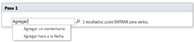

# Referencia rápida sobre acciones de flujo de trabajo (plataforma de flujo de trabajo de SharePoint 2010)
Obtenga información sobre las acciones de flujo de trabajo que están disponibles en la Plataforma de flujo de trabajo de SharePoint 2010 en Microsoft SharePoint Designer 2013.Use este artículo  *solo*  si está trabajando en SharePoint Designer 2013, pero desea seguir usando la Plataforma de flujo de trabajo de SharePoint 2010.Si en cambio desea usar la Plataforma de flujo de trabajo de SharePoint 2013, consulte  [Referencia rápida sobre acciones de flujo de trabajo (plataforma de flujo de trabajo de SharePoint 2013)](workflow-actions-quick-reference-sharepoint-2013-workflow-platform.md), junto con otros artículos (mencionados en la sección "Recursos adicionales") sobre las características nuevas que están disponibles en la plataforma más reciente.Para empezar a crear un flujo de trabajo mediante la Plataforma de flujo de trabajo 2010, seleccione **Flujo de trabajo de SharePoint 2010** en el cuadro **Tipo de plataforma** del cuadro de diálogo **Crear flujo de trabajo**.
## Dónde encontrar las acciones de flujo de trabajo

Existen dos formas de acceder al menú de acciones de flujo de trabajo disponibles.
  
    
    
Mientras está editando dentro de un paso de flujo de trabajo, realice una de estas acciones:
  
    
    

- En la pestaña **Flujo de trabajo**, en el grupo **Insertar**, haga clic en **Acciones**.
    
  
- Haga doble clic en el paso de flujo de trabajo. En el cuadro de búsqueda que aparece, escriba el texto que aparece en el nombre de la acción que desee (por ejemplo, "agregar") y presione ENTRAR. Las acciones y las condiciones que contienen el texto que escribió aparecen debajo del cuadro de texto.
    

  

  

  
Las acciones disponibles durante la creación del flujo de trabajo dependen del contexto actual. Por ejemplo, las acciones **Iniciar proceso de aprobación** e **Iniciar proceso de comentarios** no están disponibles para los sitios basados en Microsoft SharePoint Foundation 2013. Algunas acciones de la lista están disponibles solo dentro de un paso de suplantación, mientras que otras solo están disponibles cuando el flujo de trabajo está asociado a una biblioteca de documentos o a un tipo de contenido del documento. Las acciones de la lista que funcionan en el elemento actual, como **Establecer estado de aprobación de contenido** y **Establecer campo en elemento actual**, no están disponibles en un flujo de trabajo de sitio.
  
    
    
Las acciones se organizan en categorías en función de su ámbito de aplicación en un flujo de trabajo. Por ejemplo, las acciones que afectan al comportamiento de un elemento se enumeran en **Acciones de lista**, las acciones pertinentes para conjuntos de documentos en **Acciones del conjunto de documentos** y las acciones de flujo de trabajo personalizadas en **Acciones personalizadas**. Las categorías de acciones son las siguientes:
  
    
    

- Acciones principales
    
  
- Acciones del conjunto de documentos (solo aparecen cuando el flujo de trabajo está asociado a una biblioteca de documentos o a un tipo de contenido del documento)
    
  
- Acciones de lista
    
  
- Acciones relacionales (solo aparecen cuando el sitio de SharePoint ejecuta SharePoint Server 2013)
    
  
- Acciones de tarea (solo aparecen cuando el sitio de SharePoint ejecuta SharePoint Server 2013)
    
  
- Acciones de comportamiento de tarea (solo aparecen cuando se personalizan tareas de acciones de flujo de trabajo predefinidas, como **Iniciar proceso de aprobación** e **Iniciar proceso de comentarios**)
    
  
- Acciones de utilidades
    
  
- Acciones personalizadas
    
  

## Acciones generales

Las acciones generales son las que se muestran en la lista de acciones en todos los contextos de flujo de trabajo.
  
    
    

****

|**Acción**|**Descripción**|
|:-----|:-----|
|**Acciones principales**   |Las acciones de esta categoría son las más usadas en los flujos de trabajo.    |
|Agregar un comentario    | Esta acción suele mostrarse en un paso de flujo de trabajo como **Comentario: texto de comentario**. Use esta acción para dejar comentarios informativos en el diseñador de flujo de trabajo como referencia. Esto es especialmente útil cuando hay otros usuarios que colaboran en la creación del flujo de trabajo. Por ejemplo, si una variable del flujo de trabajo actual no tiene un nombre descriptivo, puede usar esta acción para agregar un comentario con el fin de indicar qué hace la variable en el flujo de trabajo.     A continuación se muestra un ejemplo de la apariencia que podría tener la acción en un paso de flujo de trabajo:    Comentario: Esta variable proporciona el departamento del iniciador de los flujos de trabajo.   > **NOTA**>  Cualquier usuario que modifique el flujo de trabajo en Microsoft Visio 2013 también podrá ver los comentarios.          |
|Agregar hora a la fecha    | Esta acción se muestra inicialmente en un paso de flujo de trabajo como **Agregar 0 minutos a la fecha (salida a variable: fecha)**. Use esta acción para agregar un número especificado de minutos, horas, días, meses o años a un valor de fecha y para almacenar el valor de salida en una variable. El valor de fecha al que se agrega el tiempo puede ser la fecha actual, una fecha especificada o el resultado de una búsqueda.     A continuación se muestra un ejemplo de la apariencia que podría tener la acción en un paso de flujo de trabajo:    Agregar7días aElemento actual:Modificado (salida a:variable: Una semana a partir de que se modificó)    |
|Realizar el cálculo    | Esta acción se muestra inicialmente en un paso de flujo de trabajo como **Calcular valor más valor (salida a variable: calc)**. Use esta acción para realizar un cálculo con dos valores y para almacenar el valor de salida en una variable. Entre los cálculos posibles se incluyen la suma, la resta, la multiplicación y la división.     A continuación se muestran ejemplos de la apariencia que podría tener la acción en un paso de flujo de trabajo:    Calcular36dividido entre9 (salida avariable: número de widgets)     Calcular [fx :: Cursos*, asientos ocupados] más 1 (salida a variable: Nuevos asientos ocupados)   |
|Registrar en el historial    | Esta acción se muestra inicialmente en un paso de flujo de trabajo como **Registrar este mensaje en la lista de historial de flujo de trabajo**. Use esta acción para registrar un mensaje en la lista de historial de flujo de trabajo sobre las acciones o el progreso del flujo de trabajo. El mensaje puede ser un resumen de un evento de flujo de trabajo, o cualquier otra cosa que desee capturar relacionada con la ejecución actual del flujo de trabajo. Estos mensajes pueden ser útiles para solucionar problemas de flujo de trabajo. Por ejemplo, puede registrar un mensaje en el que se recoja un evento como **Copiado a la lista A** o **Correo electrónico enviado a revisores**. Después de que el flujo de trabajo se complete correctamente, puede ir a la lista **Historial de flujo de trabajo** y ver los mensajes que aparecen en la columna **Descripción**.     A continuación se muestra un ejemplo de la apariencia que podría tener la acción en un paso de flujo de trabajo:    Registrar lavariable Una semana a partir de que se modificó establecida en la lista de historial de flujo de trabajo   > **NOTA**>  Si necesita una acción que detenga el flujo de trabajo y registre un mensaje en la lista de historial, use en su lugar la acción **Detener flujo de trabajo**.           |
|Detener durante    |Esta acción se muestra inicialmente en un paso de flujo de trabajo como **Detener durante 0 días, 0 horas, 5 minutos**. Use esta acción para pausar el flujo de trabajo durante una duración especificada como un número de días, horas y minutos.    > **NOTA**> El tiempo de retraso que se muestra inicialmente refleja el intervalo de trabajos del temporizador, que tiene un valor predeterminado de cinco minutos.           |
|Detener hasta fecha    | Esta acción se muestra inicialmente en un paso de flujo de trabajo como **Detener hasta esta hora**. Use esta acción para pausar el flujo de trabajo hasta una fecha determinada. Puede usar la fecha actual, una fecha especificada o el resultado de una búsqueda.     A continuación se muestran ejemplos de la apariencia que podría tener la acción en un paso de flujo de trabajo:    Detener hasta1/1/2010 12:00:00 a. m.    Detener hastavariable: Una semana a partir de que se modificó   |
|Enviar correo electrónico    | Esta acción se muestra inicialmente en un paso de flujo de trabajo como **Enviar un mensaje de correo electrónico a estos usuarios**. Use esta acción para enviar un mensaje de correo electrónico a un usuario o a un grupo. Normalmente se usa para enviar un mensaje de confirmación a los participantes en el flujo de trabajo. Los destinatarios del mensaje de correo electrónico pueden ser un usuario o un grupo de la colección de sitios, o bien cualquier persona de la organización. Ahora puede especificar en el asunto un valor dinámico, como una búsqueda o una cadena.    > **IMPORTANTE**>  El mensaje de correo electrónico saliente debe configurarse en la Administración central de SharePoint.           A continuación se muestra un ejemplo de la apariencia que podría tener la acción en un paso de flujo de trabajo:    Correo electrónicovariable: Aprobadores   |
|Configurar parte de la hora del campo Fecha y hora    | Esta acción se muestra inicialmente en un paso de flujo de trabajo como **Establecer hora como 00:00 minutos para fecha (salida a variable: fecha1)**. Use esta acción para crear una marca de tiempo y para almacenar el valor de salida en una variable. Puede establecer el tiempo en horas y minutos y agregar la fecha actual, una fecha especificada o el resultado de una búsqueda. Por ejemplo, suponga que desea agregar una marca de tiempo a todos los nuevos pedidos de cliente que se agreguen a una lista de pedidos. En lugar de usar en la marca de tiempo la hora actual en la que se recibió realmente el pedido, desea agregar una hora específica para que el flujo de trabajo realice una operación determinada (como redirigir los pedidos al almacén) en todos los elementos nuevos que tengan la misma marca de tiempo. Otro ejemplo: suponga que tiene una presentación programada para las 9 a. m. de un día concreto y desea recibir un recordatorio por correo electrónico. Puede usar esta acción para agregar la hora a la fecha, pausar el flujo de trabajo hasta el día antes de la presentación y hacer que el flujo de trabajo le envíe el recordatorio.     A continuación se muestra un ejemplo de la apariencia que podría tener la acción en un paso de flujo de trabajo:    Establecer hora como00: 00 paraElemento actual:Modificado (salida avariable Hora modificada establecida en medianoche)    |
|Establecer estado del flujo de trabajo    | Esta acción se muestra inicialmente en un paso de flujo de trabajo como **Establecer estado de flujo de trabajo en Cancelado**. Use esta acción para establecer el estado del flujo de trabajo. Las opciones predeterminadas son Cancelado, Aprobado y Rechazado.     Si escribe un valor de estado nuevo en la lista desplegable de la acción, el estado nuevo se agrega automáticamente a la lista desplegable para su uso posterior. Por ejemplo, puede agregar un estado personalizado que sea más descriptivo e informativo que **Completado** o **Cancelado**, como **Informe de gastos aprobado**.    > **NOTA**>  No se puede cambiar el nombre ni eliminar un valor de estado personalizado una vez que se ha creado. Sin embargo, no es necesario usarlo.>  Un estado personalizado solo es aplicable al flujo de trabajo actual y no se puede usar en otro flujo de trabajo.>  Un flujo de trabajo no puede usar los valores de estado personalizados que defina en la acción si la acción se utiliza dentro de un paso de suplantación.           Si la acción **Establecer estado de flujo de trabajo** es el último paso de un flujo de trabajo donde también se ha usado un valor personalizado, puede ver su valor personalizado en la columna **Estado** de la lista cuando el flujo de trabajo se detiene o finaliza.    A continuación se muestra un ejemplo de la apariencia que podría tener la acción en un paso de flujo de trabajo:    Establecer estado de flujo de trabajo enEstado de especificación: Listo para la revisión del diseño   |
|Establecer variable de flujo de trabajo    | Esta acción se muestra inicialmente en un paso de flujo de trabajo como **Establecer variable de flujo de trabajo en valor**. Use esta acción para indicarle al flujo de trabajo que asigne datos de valor a una variable de flujo de trabajo.     A continuación se muestra un ejemplo de la apariencia que podría tener la acción en un paso de flujo de trabajo:    Establecervariable: Total del informe de gastos enElemento actual:Total   |
|**Acciones de lista**   |Las acciones de esta categoría realizan operaciones en elementos de lista.    > **NOTA**> Algunas acciones de esta categoría aparecen en algunos contextos de flujo de trabajo, pero no en todos. Por ejemplo, algunas acciones de la lista solo aparecen al hacer clic dentro de un paso de suplantación del flujo de trabajo, mientras que otras solo aparecen cuando el flujo de trabajo está vinculado a una biblioteca de documentos o a un tipo de contenido del documento. Para obtener más información, consulte  [Acciones disponibles solo dentro de un paso de suplantación](workflow-actions-quick-reference-sharepoint-2010-workflow-platform.md#section7a) y [Acciones disponibles cuando el flujo de trabajo está asociado a una biblioteca de documentos o a un tipo de contenido del documento](workflow-actions-quick-reference-sharepoint-2010-workflow-platform.md#section6) más adelante en este artículo.          |
|Proteger elemento    | Esta acción se muestra inicialmente en un paso de flujo de trabajo como **Proteger elemento en esta lista con el comentario: comentario**. Use esta acción para proteger un elemento que está desprotegido.     A continuación se muestra un ejemplo de la apariencia que podría tener la acción en un paso de flujo de trabajo:    Proteger elemento enInformes de gastos con el comentario:Informe de gastos aprobado   > **NOTA**>  Solo puede proteger elementos en bibliotecas de documentos.          |
|Desproteger elemento    | Esta acción se muestra inicialmente en un paso de flujo de trabajo como **Desproteger elemento en esta lista**. Use esta acción para desproteger un elemento que está protegido.     A continuación se muestra un ejemplo de la apariencia que podría tener la acción en un paso de flujo de trabajo:    Desproteger elemento enElemento actual   > **NOTA**>  Solo puede desproteger elementos de una biblioteca en su sitio.>  Antes de desproteger el elemento, el flujo de trabajo comprueba que el elemento está protegido.          |
|Copiar elemento de lista    | Esta acción se muestra inicialmente en un paso de flujo de trabajo como **Copiar elemento de esta lista en esta lista**. Use esta acción para copiar un elemento de lista en otra lista. (Si hay un documento en el elemento de lista, el flujo de trabajo también copia el documento en la lista de destino).     A continuación se muestra un ejemplo de la apariencia que podría tener la acción en un paso de flujo de trabajo:    Copiar elemento deElemento actual enSolicitudes de archivo   > **IMPORTANTE**>  Debe haber al menos una columna similar en la lista de origen y la lista de destino.          |
|Crear elemento de lista    | Esta acción se muestra inicialmente en un paso de flujo de trabajo como **Crear un elemento en esta lista (salida a variable: crear)**. Use esta acción para crear un elemento de lista nuevo en la lista que especifique. Puede proporcionar los campos y los valores en el elemento nuevo.     Puede usar esta acción cuando desee crear un elemento nuevo que contenga la información especificada. Por ejemplo, crear un anuncio cada vez que se apruebe un documento importante para la empresa (como un contrato) o archivar documentos.   > **NOTA**>  La variable de salida es el identificador del nuevo elemento creado en la lista.           A continuación se muestra un ejemplo de la apariencia que podría tener la acción en un paso de flujo de trabajo:    Crear elemento enPedidos (salida a variable: nuevo identificador de pedido)   |
|Eliminar elemento    | Esta acción se muestra inicialmente en un paso de flujo de trabajo como **Eliminar elemento de esta lista**. Use esta acción para eliminar un elemento de una lista.     A continuación se muestra un ejemplo de la apariencia que podría tener la acción en un paso de flujo de trabajo:    Eliminar elemento deDocumentos   |
|Descartar elemento desprotegido    | Esta acción se muestra inicialmente en un paso de flujo de trabajo como **Descartar desprotección de elemento en esta lista**. Use esta acción para volver a proteger un elemento sin conservar los cambios que se realizaron en este desde la última vez que se desprotegió.     A continuación se muestra un ejemplo de la apariencia que podría tener la acción en un paso de flujo de trabajo:    Descartar desprotección de elemento enDocumentos   |
|Establecer estado de aprobación de contenido    | Esta acción se muestra inicialmente en un paso de flujo de trabajo como **Establecer el estado de aprobación de contenido a este estado con comentarios**. Use esta acción para establecer el campo de estado de aprobación de contenido en un valor como **Aprobado**, **Rechazado** o **Pendiente** (también puede escribir un estado personalizado en la acción).    A continuación se muestra un ejemplo de la apariencia que podría tener la acción en un paso de flujo de trabajo:    Establecer estado de aprobación de contenido enAprobado conParece correcto   > **NOTA**>  La aprobación de contenido debe estar habilitada en la lista para que esta acción funcione.           Esta acción funciona en el elemento en el que actualmente actúa el flujo de trabajo y, por lo tanto, no está disponible en un flujo de trabajo de sitio.   |
|Establecer campo en elemento actual    | Esta acción se muestra inicialmente en un paso de flujo de trabajo como **Establecer el campo en valor**. Use esta acción para establecer un campo del elemento actual en un valor.     A continuación se muestra un ejemplo de la apariencia que podría tener la acción en un paso de flujo de trabajo:    EstablecerId. de tipo de contenido enEspecificación   > **NOTA**>  Si desea pausar el flujo de trabajo hasta que cambie el valor de un campo, en su lugar use la acción **Esperar cambio de campo en elemento actual**. >  La acción **Establecer campo en elemento actual** no está disponible cuando se trabaja en un flujo de trabajo de sitio.          |
|Actualizar elemento de lista    | Esta acción se muestra inicialmente en un paso de flujo de trabajo como **Actualizar elemento en esta lista**. Use esta acción para actualizar un elemento de lista. Puede especificar los campos y los nuevos valores de esos campos.     A continuación se muestra un ejemplo de la apariencia que podría tener la acción en un paso de flujo de trabajo:    Actualizar elemento deDocumentos   |
|Esperar cambio de campo en elemento actual    | Esta acción se muestra inicialmente en un paso de flujo de trabajo como **Esperar a que el campo iguale el valor**. Use esta acción para pausar el flujo de trabajo hasta que el campo especificado en el elemento actual haya cambiado a un valor especificado.     A continuación se muestra un ejemplo de la apariencia que podría tener la acción en un paso de flujo de trabajo:    Esperar a queEstado de aprobación iguale a1;#Rechazado   > **NOTA**>  Si desea que el flujo de trabajo cambie el valor del campo, en vez de que el flujo de trabajo espere a que cambie el campo, use en su lugar la acción **Establecer campo en elemento actual**.           |
|**Acciones de tarea**   |Las acciones de esta categoría hacen referencia a elementos de tarea.    |
|Asignar un formulario a un grupo    | Esta acción se muestra inicialmente en un paso de flujo de trabajo como **Asignar un formulario personalizado a estos usuarios**. Use esta acción para crear un formulario de tareas personalizado y asignar el formulario a uno o más participantes o grupos. Los participantes proporcionan sus respuestas en los campos del formulario y, cuando terminan, hacen clic en **Realizar tarea** en el formulario.    A continuación se muestra un ejemplo de la apariencia que podría tener la acción en un paso de flujo de trabajo:    AsignarInformes de activos aMarketing   > **NOTA**>  No existe ningún valor devuelto que identifique los datos de la tarea.          |
|Asignar un elemento pendiente    | Esta acción se muestra inicialmente en un paso de flujo de trabajo como **Asignar un elemento de tarea pendiente a estos usuarios**. Use esta acción para asignar una tarea pendiente a uno o más participantes o grupos, solicitándoles que realicen sus tareas y, al terminar, hagan clic en el botón **Realizar tarea** en el formulario de tareas.    A continuación se muestra un ejemplo de la apariencia que podría tener la acción en un paso de flujo de trabajo:    AsignarEnviar informe de gastos aMarketing   |
|Recopilar datos de un usuario    | Esta acción se muestra inicialmente en un paso de flujo de trabajo como **Recopilar datos de este usuario (salida a variable: collect)**. Use esta acción para asignar una tarea al participante, solicitándole que proporcione la información necesaria en un formulario de tarea personalizado y que luego haga clic en el botón **Realizar tarea** en el formulario de tareas.    Esta acción tiene una cláusula de salida, es decir, el flujo de trabajo almacena la información devuelta por la acción en una variable correspondiente. El identificador del elemento de tarea completada de la acción del elemento de lista se almacena en la variable **collect**.    A continuación se muestra un ejemplo de la apariencia que podría tener la acción en un paso de flujo de trabajo:    RecopilarInforme de gastos deMarketing (salida avariable: Informe de gastos de marketing)    |
|**Acciones de utilidades**   |La mayoría de las acciones de esta categoría puede usarse para extraer información de cadenas de texto.    Puede cortar una cadena de texto y usarla en varios escenarios distintos en un flujo de trabajo. Por ejemplo, suponga que su empresa desea marcar todos los documentos entrantes con un formato de nombre específico, como fecha_departamento (por ejemplo: 14072009_ventas.docx), y usted desea ejecutar flujos de trabajo que asignan tareas a un revisor en función de la fecha que figura en la marca de ese archivo. Podría usar una acción de utilidades para obtener los 8 primeros caracteres del nombre del documento (14072009) y convertirlos en una fecha mediante el uso de conversiones de búsqueda, para poder asignar tareas que tengan esa fecha de vencimiento.    Para obtener más información sobre las conversiones de búsqueda, consulte la sección Vea también.    |
|Extraer subcadena de final de cadena    | Esta acción se muestra inicialmente en un paso de flujo de trabajo como **Copiar 0 caracteres a partir del final de la cadena (salida a variable: subcadena)**. Use esta acción para copiar un número especificado de caracteres a partir del final de una cadena y almacenar el valor de salida en una variable. Debe especificar el número de caracteres de la cadena que el flujo de trabajo copia.     A continuación se muestra un ejemplo de la apariencia que podría tener la acción en un paso de flujo de trabajo:    Copiar15 caracteres a partir del final deElemento actual:Nombre (salida a variable:Copy15CharFromEndOfName)    |
|Extraer subcadena de índice de cadena    | Esta acción se muestra inicialmente en un paso de flujo de trabajo como **Copiar de la cadena, a partir de 0 (salida a variable: subcadena)**. Use esta acción para copiar todos los caracteres a partir de un carácter especificado de una cadena y almacenar la salida en una variable.     A continuación se muestra un ejemplo de la apariencia que podría tener la acción en un paso de flujo de trabajo:    Copiar deElemento actual:Nombre, a partir de 4 (salida a variable:CopyStringFromChar4)    |
|Extraer subcadena de principio de cadena    | Esta acción se muestra inicialmente en un paso de flujo de trabajo como **Copiar 0 caracteres a partir del comienzo de la cadena (salida a variable: subcadena)**. Use esta acción para copiar un número especificado de caracteres a partir del comienzo de una cadena y almacenar la salida en una variable. Debe especificar el número de caracteres de la cadena que el flujo de trabajo copia.     A continuación se muestra un ejemplo de la apariencia que podría tener la acción en un paso de flujo de trabajo:    Copiar15 caracteres a partir del comienzo deElemento actual:Nombre (salida a variable:Copy15CharFromStartOfName)    |
|Extraer subcadena de cadena de índice con longitud    | Esta acción se muestra inicialmente en un paso de flujo de trabajo como **Copiar de la cadena, a partir de 0 para 0 caracteres (salida a variable: subcadena)**. Use esta acción para copiar un número especificado de caracteres a partir de un carácter determinado de una cadena y almacenar la salida en una variable. Debe especificar el número de caracteres de la cadena que el flujo de trabajo copia.     A continuación se muestra un ejemplo de la apariencia que podría tener la acción en un paso de flujo de trabajo:    Copiar deElemento actual:Nombre, a partir de 4 para15 caracteres (salida a variable:CopyfromChar4for15CharOfName)    |
|Encontrar intervalo entre fechas    | Esta acción se muestra inicialmente en un paso de flujo de trabajo como **Encontrar minutos entre fecha y fecha (salida a variable: tiempo)**. Use esta acción para calcular la diferencia de tiempo en minutos, horas o días entre dos fechas y almacenar la salida en una variable.     A continuación se muestra un ejemplo de la apariencia que podría tener la acción en un paso de flujo de trabajo:    Buscarminutos entreElementoActual:Modificado yHoy (salida avariable: Última modificación en minutos)    |
   

## Acciones disponibles cuando el sitio de SharePoint ejecuta SharePoint Server 2013

Las acciones como **Iniciar proceso de aprobación**, **Declarar como registro** y **Buscar administrador de un usuario** solo están disponibles cuando el sitio de SharePoint ejecuta SharePoint Server 2013.
  
    
    

****

|**Acción**|**Descripción**|
|:-----|:-----|
|**Acciones del conjunto de documentos**   |Las acciones de esta categoría hacen referencia a un conjunto de documentos. Un conjunto de documentos es una carpeta en la que se almacenan documentos. En un flujo de trabajo, un conjunto de documentos se trata como un solo elemento.    > **NOTA**> Para poder usar conjuntos de documentos en la biblioteca, debe agregar el tipo de contenido del conjunto de documentos desde la página Configuración de biblioteca en su sitio de SharePoint.           |
|Iniciar proceso de aprobación de conjunto de documentos    | Esta acción se muestra inicialmente en los pasos de flujo de trabajo como **Iniciar proceso de aprobación para el contenido de este conjunto de documentos con los usuarios especificados por esta columna**. Use esta acción para iniciar una acción de aprobación en un conjunto de documentos y todos los documentos que contiene.     Cuando se usa esta acción, se cambian el estado del conjunto de documentos y el estado de todos los documentos que contiene (por ejemplo, a Aprobado o a Rechazado).    Si, por el contrario, usa la acción **Iniciar proceso de aprobación** en el conjunto de documentos, solo se cambia el estado del conjunto de documentos, y no los estados de los documentos que contiene.    A continuación se muestra un ejemplo de la apariencia que podría tener la acción en un paso de flujo de trabajo:    Iniciar procesoAprobación de factura de materiales para el contenido de este conjunto de documentos con los usuarios especificados porvariable: Aprobadores de factura de materiales   |
|Capturar una versión del conjunto de documentos    | Esta acción se muestra inicialmente en los pasos de flujo de trabajo como **Capturar una versión de este conjunto de documentos que incluya las versiones de tipo de los contenidos con el comentario: comentario**. Use esta acción para bloquear la versión del conjunto de documentos que contenga la versión de los documentos, principal o secundaria, que se especifica en la acción.     A continuación se muestra un ejemplo de la apariencia que podría tener la acción en un paso de flujo de trabajo:    Capturar una versión de este conjunto de documentos que incluya lasúltimas versiones principales de los contenidos con el comentario:Última versión principal de la factura de materiales   |
|Enviar conjunto de documentos al repositorio    | Esta acción se muestra inicialmente en los pasos de flujo de trabajo como **Enviar conjunto de documentos con esta acción a este organizador de contenido de destino (salida a variable: resultado de enviar archivo)**. Use esta acción para mover o copiar un conjunto de documentos en un repositorio de documentos. Un repositorio de documentos puede ser una biblioteca en su sitio de SharePoint o un sitio completo, como el Centro de documentación, que redirige los registros a un destino específico mediante las reglas definidas.     A continuación se muestra un ejemplo de la apariencia que podría tener la acción en un paso de flujo de trabajo:    Enviar conjunto de documentos usandoCopiar enRepositorioDeDocumentos:GUID conCopiar factura final de materiales en el repositorio (salida avariable: Copiar conjunto de documentos en repositorio)    > **NOTA**>  Para poder definir reglas y redirigir documentos, debe habilitar la característica de sitio **Organizador de contenido** en el sitio de SharePoint. Para obtener más información, consulte el tema Configurar el organizador de contenido para redirigir registros en la sección Vea también.          |
|Establecer el estado de aprobación del contenido del conjunto de documentos    | Esta acción se muestra inicialmente en los pasos de flujo de trabajo como **Establecer el estado de aprobación de contenido para el contenido de este conjunto de documentos en este estado con comentarios**. Use esta acción para establecer la aprobación de contenido de un conjunto de documentos en **Aprobado**, **Rechazado** o **Pendiente**.     A continuación se muestra un ejemplo de la apariencia que podría tener la acción en un paso de flujo de trabajo:    Establecer el estado de aprobación de contenido para el contenido de este conjunto de documentos enAprobado con La factura de materiales está aprobada   > **NOTA**>  La aprobación de contenido debe estar habilitada en la lista para poder usar esta acción.          |
|**Acciones de tarea**   |Las acciones de esta categoría se usan en escenarios de aprobación. Hay dos acciones de flujo de trabajo predefinidas en esta categoría: **Iniciar proceso de aprobación** e **Iniciar proceso de comentarios**. Las acciones predefinidas funcionan como flujos de trabajo secundarios, lo que significa que la lógica de flujo de trabajo ya está definida en las acciones. Todo lo que necesita hacer es proporcionar la información adecuada.    Estas acciones se usan en los flujos de trabajo reutilizables globalmente **Aprobación de SharePoint 2013** y **Recopilar comentarios de SharePoint 2013** que se incluyen en SharePoint Server 2013. Para obtener información sobre cuándo se usan estos flujos de trabajo y cuándo se usan las acciones, consulte la sección [¿Cuándo se deben usar las acciones de aprobación y comentarios?](workflow-actions-quick-reference-sharepoint-2010-workflow-platform.md#section5) de este artículo.   También está disponible **Iniciar proceso de tarea personalizado**, que también tiene lógica integrada pero, a diferencia de las dos acciones anteriores, no viene predefinida con lo que el flujo de trabajo debería hacer en cada fase.    Una categoría de acciones llamada **Acciones de comportamiento de tarea** aparece en la lista de acciones únicamente cuando se personaliza el comportamiento de una acción de aprobación como **Asignar elemento para su aprobación** o **Asignar elemento para comentarios**. Para obtener más información sobre **Acciones de comportamiento de tarea**, consulte la sección  [Acciones disponibles en las acciones de tarea](workflow-actions-quick-reference-sharepoint-2010-workflow-platform.md#section4) de este artículo.   |
|Iniciar proceso de aprobación    | Esta acción se muestra inicialmente en un paso de flujo de trabajo como **Iniciar proceso de aprobación en el elemento actual con estos usuarios**. Use esta acción para redirigir un documento para su aprobación. Los aprobadores pueden aprobar o rechazar el documento, reasignar la tarea de aprobación o solicitar cambios en el documento.     La acción **Iniciar proceso de aprobación** se comporta como un flujo de trabajo predefinido, ya que la lógica ya está definida en la acción. La acción tiene distintas fases generadas para definir comportamientos de tarea, comportamientos de proceso de tarea, registro en el registro de historial, notificaciones de correo electrónico y condiciones de finalización. Aunque la acción incluye esta lógica predefinida, debe proporcionarle información, como quiénes son los revisores, si las tareas de aprobación se asignan una de cada vez ("en serie", valor predeterminado) o todas a la vez ("en paralelo") y cuáles son las fechas de vencimiento o las duraciones permitidas para la realización de la tarea.    Puede asignar tareas a participantes internos y externos. Un participante externo puede ser un empleado de la organización que no es un usuario de la colección de sitios o cualquier persona ajena a la organización.    A continuación se muestra un ejemplo de la apariencia que podría tener la acción en un paso de flujo de trabajo:    Iniciar proceso deAprobación de especificación enElemento actual convariable: Aprobadores   |
|Iniciar proceso de comentarios    | Esta acción se muestra inicialmente en un paso de flujo de trabajo como **Iniciar proceso de comentarios en el elemento actual con estos usuarios**. Use esta acción para redirigir un documento para solicitar comentarios. Los revisores pueden enviar comentarios o reasignar la tarea de comentarios.     La acción **Iniciar proceso de comentarios** se comporta como un flujo de trabajo predefinido, ya que la lógica ya está definida en la acción. La acción tiene distintas fases generadas para definir comportamientos de tarea, comportamientos de proceso de tarea, registro en el registro de historial, notificaciones de correo electrónico y condiciones de finalización. Aunque la acción de aprobación incluye esta lógica predefinida, debe proporcionarle información, como quiénes son los revisores, si las tareas de aprobación se asignan una de cada vez ("en serie", valor predeterminado) o todas a la vez ("en paralelo") y cuáles son las fechas de vencimiento o las duraciones permitidas para la realización de la tarea.    Puede asignar tareas a participantes internos y externos. Un participante externo puede ser un empleado de la organización que no es un usuario de la colección de sitios o cualquier persona ajena a la organización.    A continuación se muestra un ejemplo de la apariencia que podría tener la acción en un paso de flujo de trabajo:    Iniciar proceso deComentarios de especificación enElemento actual convariable: Revisores   |
|Iniciar proceso de tarea personalizado    | Esta acción se muestra inicialmente en un paso de flujo de trabajo como **Iniciar proceso de tarea en el elemento actual con estos usuarios**. Use la acción **Iniciar proceso de tarea personalizado** (una plantilla de proceso de aprobación) si ninguna de las dos acciones de aprobación anteriores satisface sus necesidades. **Iniciar proceso de tarea personalizado** también permite generar lógica dentro de él pero, a diferencia de las otras dos acciones de aprobación, la lógica no viene predefinida con todas las acciones que el flujo de trabajo necesita en cada una de sus fases. Puede especificar sus propias acciones y condiciones en los comportamientos de tarea o condiciones de finalización.    A continuación se muestra un ejemplo de la apariencia que podría tener la acción en un paso de flujo de trabajo:    Iniciar proceso deAprobación de vídeo de lección enElemento actual convariable: Aprobadores   |
|**Acciones de lista**   |Las acciones de esta categoría realizan operaciones en elementos de lista.    |
|Declarar como registro    |Esta acción se muestra en un paso de flujo de trabajo como **Declarar este elemento como un registro**. Use esta acción para identificar un documento como un registro y aplicar la configuración de restricciones de registro que haya definido en la página **Configuración de declaración como registro** en su sitio de SharePoint.   No hay que establecer ninguna variable para esta acción.    Puede definir la configuración de declaración como registro en el sitio de primer nivel de la colección de sitios. La configuración de declaración como registro rige la manera en que se tratan los registros; por ejemplo, si se pueden editar o eliminar, qué metadatos se les aplican y cuál es la directiva de retención de registros. La configuración de declaración como registro especifica las restricciones que deben aplicarse después de que un elemento se declare como registro, así como los roles de usuario que pueden declarar registros y si la declaración de registros está disponible para todos los usuarios del sitio.    |
|Revocar declaración como registro    |Esta acción se muestra en un paso de flujo de trabajo como **Revocar la declaración del elemento como registro**. Use esta acción para deshacer cualquier configuración de declaración como registro que se aplique a un registro.    No hay que establecer ninguna variable para esta acción.    Puede definir la configuración de declaración como registro en el sitio de primer nivel de la colección de sitios. La configuración de declaración como registro rige la manera en que se tratan los registros; por ejemplo, si se pueden editar o eliminar, qué metadatos se aplican al registro y cuál es la directiva de retención de un registro. La configuración de declaración como registro especifica las restricciones que deben aplicarse después de que un elemento se declare como registro, los roles de usuario que pueden declarar registros y si la declaración de registros está disponible para todos los usuarios del sitio.    |
|**Acciones relacionales**   |La acción de esta categoría permite buscar el administrador de un usuario y almacenar el valor de salida en una variable.    |
|Buscar administrador de un usuario    | Esta acción se muestra inicialmente en los pasos de flujo de trabajo como **Buscar el administrador de este usuario (salida a variable: administrador)**. Use esta acción para buscar el administrador de un usuario y almacenar el valor de salida en una variable.     A continuación se muestra un ejemplo de la apariencia que podría tener la acción en un paso de flujo de trabajo:    Buscar administrador deContexto de flujo de trabajo:Iniciador (salida avariable: administrador)    |
   

## Acciones disponibles en las acciones de tarea

Es posible usar acciones como **Iniciar proceso de aprobación** e **Iniciar proceso de comentarios** en los flujos de trabajo para asignar elementos de lista para su aprobación o para solicitar comentarios. Aunque estas acciones están predefinidas (es decir, gran parte de la lógica de flujo de trabajo ya está definida en la acción), deberá proporcionar la información adicional que requiera la acción (por ejemplo, identificando los aprobadores o los revisores a los que se asignarán las tareas).
  
    
    

> **NOTA**
> Si estas acciones no satisfacen completamente sus necesidades, puede personalizarlas en el explorador, en SharePoint Designer 2013 y en entornos de desarrollo que sean compatibles con SharePoint, incluido Visual Studio. También puede personalizar la acción **Iniciar proceso de tarea personalizado** usando esas mismas herramientas. Esta acción es una plantilla que puede usar para definir un nuevo proceso de tarea para su organización.
  
    
    

Cuando personaliza el comportamiento de tarea en acciones como **Iniciar proceso de aprobación** e **Iniciar proceso de comentarios**, está disponible una nueva categoría de acciones llamada **Acciones de comportamiento de tarea**.
  
    
    

> **NOTA**
> Las acciones que están disponibles en esta categoría varían en función del lugar del flujo de trabajo en el que esté trabajando. 
  
    
    

****

|**Acción**|**Descripción**|
|:-----|:-----|
|Finalizar un proceso de tarea|Esta acción se muestra inicialmente en un paso de flujo de trabajo como **Finalizar un proceso de tarea**. Use esta acción para finalizar el proceso de tarea. El flujo de trabajo principal pasa a la acción siguiente.|
|Establecer el estado de aprobación de contenido (como autor)|Esta acción se muestra inicialmente en un paso de flujo de trabajo como **Establecer en este estado la aprobación de contenido del elemento en el que se está ejecutando el proceso de tarea (ejecutar como autor del flujo de trabajo)**. Le permite establecer el estado de aprobación del elemento de lista en **Aprobado**, **Rechazado** o **Pendiente** usando los permisos del autor del flujo de trabajo, en lugar de los de la persona que inicia el flujo de trabajo. Esta acción suele usarse en el caso de que la persona que inicia un flujo de trabajo de aprobación no tuviera los permisos necesarios para aprobar un documento.El elemento de lista especificado en la acción es el elemento en el que se está ejecutando actualmente la acción. Puede tratarse del mismo elemento que se está ejecutando el flujo de trabajo general.> **NOTA**> La aprobación de contenido debe estar habilitada en la lista para que esta acción funcione.           |
|Esperar cambio del elemento del proceso de tarea|Esta acción se muestra en un paso de flujo de trabajo como **Esperar cambio del elemento en que se ejecuta el proceso de tarea**. Use esta acción para pausar el proceso de tarea hasta que cambie un valor en el elemento en el que se ejecuta el proceso de aprobación.|
|Esperar eliminación del elemento del proceso de tarea|Esta acción se muestra en un paso de flujo de trabajo como **Esperar eliminación del elemento en que se ejecuta el proceso de tarea**. Use esta acción para pausar el proceso de tarea hasta que se elimine un valor en el elemento en el que se ejecuta el proceso de aprobación.|
||La siguiente acción solo aparece cuando, al personalizar la acción **Iniciar proceso de aprobación**, hace clic en **Cambiar el comportamiento de una sola tarea** y luego hace clic en el paso **Antes de que se asigne una tarea**.|
|Establecer campo de tarea|Esta acción se muestra inicialmente en un paso de flujo de trabajo como **Establecer campo de tarea en valor**. Use esta acción para establecer en un valor especificado un campo específico del elemento de tarea actual. Esta acción puede usarse en una tarea que aún no se haya creado.|
||Las siguientes acciones solo aparecen cuando, al personalizar la acción **Iniciar proceso de aprobación**, hace clic en **Cambiar el comportamiento de una sola tarea** y luego hace clic en el paso **Cuando una tarea está pendiente o Cuando expira una tarea**.|
|Rescindir tarea|Esta acción se muestra en un paso de flujo de trabajo como **Después rescindir esta tarea**. Use esta acción para realizar la tarea sin resultado.|
|Anexar tarea|Esta acción se muestra en un paso de flujo de trabajo como **Después anexar una tarea nueva y asignarla a este usuario**. Use esta acción para asignar una tarea nueva al usuario especificado al final de la fase actual de la acción de aprobación. Si la fase actual era Molly;Diane;Oliver y anexa una tarea a Diane, la fase cambiará a Molly;Diane;Oliver;Diane.|
|Delegar tarea|Esta acción se muestra inicialmente en un paso de flujo de trabajo como **Después delegar esta tarea a este usuario**. Use esta acción para rescindir la asignación de una tarea a un usuario actual y después asignar la misma tarea a otro usuario. Si realiza la nueva asignación a un grupo, solo se asignará una tarea al grupo en su conjunto, en vez de una tarea a cada miembro del grupo. Para asignar una tarea a cada miembro del grupo, use la acción **Reenviar tarea**.|
|Elevar tarea|Esta acción se muestra inicialmente en un paso de flujo de trabajo como **Después elevar esta tarea al administrador de la persona asignada actual**. Use esta acción para asignar la tarea al administrador del usuario que tiene actualmente asignada la tarea. No hay que establecer ninguna variable para esta acción.|
|Reenviar tarea|Esta acción se muestra inicialmente en un paso de flujo de trabajo como **Después reenviar esta tarea a este usuario**. Use esta acción para rescindir la asignación de una tarea a un usuario actual y asignar la misma tarea a otro usuario. Si realiza la nueva asignación a un grupo, se asignará una tarea a cada miembro del grupo, en vez de una sola tarea al grupo en su conjunto. Para asignar una sola tarea al grupo en su conjunto, use la acción **Delegar tarea**.|
|Insertar tarea|Esta acción se muestra inicialmente en un paso de flujo de trabajo como **Después insertar una tarea asignada a este usuario**. Use esta acción en el proceso de aprobación para insertar, después de la fase actual, una nueva fase en la que el usuario especificado es el único participante.|
|Reasignar tarea|Esta acción se muestra inicialmente en un paso de flujo de trabajo como **Después reasignar esta tarea a este usuario**. Use esta acción para reasignar una tarea a otro usuario.|
|Solicitar un cambio|Esta acción se muestra inicialmente en un paso de flujo de trabajo como **Después solicitar un cambio de este usuario**. Use esta acción para solicitar un cambio de otro usuario y, después, cuando se realiza el cambio solicitado, para que se asigne una nueva tarea al usuario actual.|
|Enviar mensaje de correo electrónico de tarea|Esta acción se muestra inicialmente en un paso de flujo de trabajo como **Después enviar un mensaje de correo electrónico a estos usuarios**. Use esta acción para incluir el botón **Editar tarea** en la notificación de tarea de correo electrónico que se envía a los usuarios especificados.|
   

## ¿Cuándo se deben usar las acciones de aprobación y comentarios?

En Microsoft Office SharePoint Designer 2007, usó acciones de tarea en escenarios de aprobación. Teniendo en cuenta los flujos de trabajo reutilizables predefinidos en SharePoint Server 2013, como **Aprobación de SharePoint 2013** y **Recopilar comentarios de SharePoint 2013**, probablemente se pregunte en qué se diferencian de las acciones de tarea **Iniciar proceso de aprobación** e **Iniciar proceso de comentarios**. Aunque tanto las acciones de tarea y los flujos de trabajo predefinidos se pueden usar en escenarios de recopilación de comentarios y de recopilación de aprobación, los flujos de trabajo predefinidos proporcionan una solución más sofisticada y completa.
  
    
    
Si los flujos de trabajo reutilizables predefinidos no satisfacen sus necesidades, puede personalizarlos con SharePoint Designer 2013. Si el hecho de personalizar un flujo de trabajo predefinido para satisfacer sus necesidades supondrá más trabajo que crear un flujo de trabajo nuevo, puede aprovechar las acciones **Iniciar proceso de aprobación** e **Iniciar proceso de comentarios** en el flujo de trabajo nuevo. Si le interesa la estructura que proporcionan estas acciones pero no todas las funcionalidades preconfiguradas, puede usar la acción **Iniciar proceso de tarea personalizado**.
  
    
    
Tenga en cuenta que las diferentes acciones de tarea se pueden usar en escenarios que no son estrictamente procesos de aprobación o de comentarios. Por ejemplo, puede usar una acción de tarea para enviar mensajes de correo electrónico que les recuerden a los empleados que deben completar sus partes de horas.
  
    
    
La tabla siguiente presenta una comparación entre, por un lado, las tres acciones de tarea y, por otro, los flujos de trabajo reutilizables predefinidos:
  
    
    

****

|**Característica**|**Acciones de tarea**|**Flujos de trabajo reutilizables predefinidos**|
|:-----|:-----|:-----|
|Número de usuarios que intervienen en el proceso    |Un solo usuario o grupo por acción de tarea.    |En los flujos de trabajo predefinidos, pueden especificarse varios usuarios y grupos en varias fases de asignación. Cada fase de asignación permite especificar dos cosas: si las tareas se asignan en serie o en paralelo, y a qué usuarios, grupos y otros participantes se asignan las tareas.    |
|Lógica de flujo de trabajo cargada previamente    |Las tres acciones de tarea no tienen lógica integrada. Debe usar otras acciones y condiciones para crear un mecanismo de aprobación o comentarios.    |Los flujos de trabajo predefinidos ya están equipados con toda la lógica integrada para ofrecer de comienzo a fin una experiencia de aprobación o recopilación de comentarios. Puede usar la lógica predeterminada o personalizarlos para satisfacer sus necesidades.    |
|Orden en que se asignan las tareas    |En las tres acciones de tarea, solo se pueden asignar tareas en paralelo tanto a los usuarios individuales como a los miembros de un grupo. Esto significa que todas las tareas asignadas por una acción de tarea se asignan al mismo tiempo, en una sola fase de distribución.    |En los flujos de trabajo predefinidos, las tareas se pueden asignar en una sola fase de distribución o en varias fases y, dentro de cada fase, se pueden asignar tareas en serie o en paralelo.    |
|Enlace de datos con información de la tarea    |Ninguna de las tres acciones de tarea incluye búsquedas listas para su uso.    **Recopilar datos de un usuario** es una acción que tiene una cláusula de salida: los datos generados en tiempo de ejecución de flujo de trabajo se almacenan en la variable en la cláusula de salida. Para crear un escenario de aprobación o comentarios por su cuenta, debe proporcionar después esta variable en varias acciones diferentes en el flujo de trabajo.   |Los flujos de trabajo predefinidos aprovechan los orígenes de datos (incluidos el elemento actual, las variables y los parámetros predefinidos del flujo de trabajo, el contexto del flujo de trabajo actual y los resultados de la tarea), lo que permite personalizar más fácilmente el flujo de trabajo para satisfacer sus necesidades.    Por ejemplo, para enviar un mensaje de correo electrónico a la persona a la que está asignada actualmente la tarea, puede usar la acción **Enviar correo electrónico** y configurar la acción para enviar un mensaje de correo electrónico a **Tarea actual: asignada a**.    |
|Características especiales para los participantes en la tarea    |Ninguna de las tres acciones de tarea proporciona características especiales (como la reasignación de tareas y opciones de solicitud de cambio) para los participantes en la tarea.    |En los flujos de trabajo predefinidos, las acciones de aprobación pueden permitir que un participante en la tarea reasigne la tarea a otro usuario o solicite un cambio en el propietario del proceso de tarea con un solo clic.    |
|Finalización de la tarea    |En las tres acciones de tarea, el único botón disponible para indicar la finalización de la tarea siempre tiene la etiqueta **Realizar tarea**.    |En los flujos de trabajo predefinidos puede agregar botones más explicativos, como **Aprobar** y **Rechazar** para indicar el resultado de la tarea en el formulario de finalización de la tarea.   |
   

## Acciones disponibles cuando el flujo de trabajo está asociado a una biblioteca de documentos o a un tipo de contenido del documento

Algunas acciones de flujo de trabajo (como **Documentos compartidos**) solo están disponibles cuando el flujo de trabajo está asociado a una biblioteca de documentos, o bien al tipo de contenido del **documento** o a un elemento secundario de dicho tipo de contenido.
  
    
    

****

|**Acción**|**Descripción**|
|:-----|:-----|
|**Acciones principales**   ||
|Enviar documento a repositorio    | Esta acción se muestra inicialmente en un paso de flujo de trabajo como **Enviar archivo mediante esta acción a este enrutador de destino con esta explicación (salida a variable: resultado de enviar archivo)**. Use esta acción para mover o copiar el documento asociado con el elemento de lista a un repositorio de documentos. Un repositorio de documentos puede ser una biblioteca en su sitio de SharePoint o un sitio completo, como el Centro de documentación, que redirige los registros a un destino específico mediante las reglas definidas.     A continuación se muestra un ejemplo de la apariencia que podría tener la acción en un paso de flujo de trabajo:    Enviar archivo conMover aArchivo:Valor IdDeDocumento conEl archivo está listo para el archivado (salida avariable: Enviar archivo para el archivado)    |
|**Acciones del conjunto de documentos**   |Las acciones de esta categoría hacen referencia a un conjunto de documentos. Un conjunto de documentos es una carpeta en la que se almacenan documentos. En un flujo de trabajo, un conjunto de documentos y todos los documentos que contiene se tratan como un solo elemento.    > **NOTA**>  Para poder usar conjuntos de documentos en la biblioteca, debe agregar el tipo de contenido del conjunto de documentos desde la página Configuración de biblioteca en su sitio de SharePoint.>  Los conjuntos de documentos son una característica de SharePoint Server 2013.          Para obtener más información sobre las acciones de conjuntos de documentos, consulte la sección  [Acciones disponibles cuando el sitio de SharePoint ejecuta SharePoint Server 2013](workflow-actions-quick-reference-sharepoint-2010-workflow-platform.md#section3) de este artículo.   |
|**Acciones de lista**   |Esta categoría de acciones realiza operaciones en elementos de lista.    |
|Eliminar borradores    |Esta acción se muestra en un paso de flujo de trabajo como **Eliminar todos los borradores (versiones secundarias) del elemento**. Use esta acción para eliminar todos los borradores existentes o las versiones secundarias del elemento actual. No hay que establecer ninguna variable para esta acción.    > **NOTA**> El control de versiones con versiones secundarias debe estar habilitado en la lista de SharePoint para que funcione esta acción.           |
|Eliminar versiones anteriores    |Esta acción se muestra en un paso de flujo de trabajo como **Eliminar todas las versiones anteriores del elemento**. Use esta acción para eliminar todas las versiones anteriores existentes del elemento actual. No hay que establecer ninguna variable para esta acción.    > **NOTA**> El control de versiones debe estar habilitado en la lista de SharePoint para que funcione esta acción.           |
   

## Acciones disponibles solo dentro de un paso de suplantación

Algunas acciones de lista solo están disponibles dentro de un paso de suplantación. Los pasos de suplantación dirigen el flujo de trabajo para que realice acciones haciéndose pasar por el autor del flujo de trabajo, en lugar del iniciador del flujo de trabajo. Los pasos de suplantación son útiles en escenarios como la aprobación y la publicación, en los que los usuarios que envían contenido para su aprobación podrían no tener los mismos permisos que las personas que aprueban el contenido. Los pasos de suplantación también son útiles para automatizar las tareas del administrador del sitio (por ejemplo, en un flujo de trabajo que asigna permisos a los usuarios automáticamente).
  
    
    

> **NOTA**
>  El "autor del flujo de trabajo" es la persona que publicó por última vez el flujo de trabajo.>  Un paso de suplantación no puede anidarse dentro de otro paso de ningún tipo.
  
    
    

|**Acción**|**Descripción**|
|:-----|:-----|
|Agregar permisos de elementos de lista    | Esta acción se muestra inicialmente en un paso de flujo de trabajo como **Agregar estos permisos a un elemento de la lista**. Use esta acción para conceder los niveles de permisos especificados para el elemento determinado a los usuarios indicados.     A continuación se muestra un ejemplo de la apariencia que podría tener la acción en un paso de flujo de trabajo:    AgregarContribuir, Leer al elemento deImágenes   |
|Heredar permisos principales de elemento de lista    | Esta acción se muestra inicialmente en un paso de flujo de trabajo como **Heredar permisos principales de un elemento de esta lista**. Use esta acción para forzar que un elemento de lista con permisos exclusivos herede los permisos principales de su lista.     A continuación se muestra un ejemplo de la apariencia que podría tener la acción en un paso de flujo de trabajo:    Heredar permisos principales de un elemento deImágenes   |
|Quitar permisos de elemento de lista    | Esta acción se muestra inicialmente en un paso de flujo de trabajo como **Quitar estos permisos de un elemento de la lista**. Use esta acción para quitar los niveles de permisos especificados para el elemento determinado a los usuarios indicados.     A continuación se muestra un ejemplo de la apariencia que podría tener la acción en un paso de flujo de trabajo:    QuitarContribuir del elemento deImágenes   |
|Reemplazar permisos de elemento de lista    | Esta acción se muestra inicialmente en un paso de flujo de trabajo como **Sustituir estos permisos de un elemento de la lista**. Use esta acción para sustituir, para uno o varios usuarios determinados, su nivel actual de permisos para un elemento especificado por un nuevo nivel de permisos especificado.     A continuación se muestra un ejemplo de la apariencia que podría tener la acción en un paso de flujo de trabajo:    ReemplazarLeer del elemento deImágenes   |
   

## Acciones dentro de un flujo de trabajo de sitio

Un flujo de trabajo de sitio funciona a nivel del sitio y no está asociado a ningún objeto más específico (como un elemento individual o un tipo de contenido). Cuando se trabaja dentro de un flujo de trabajo de sitio, las acciones que funcionan en el elemento actual, como **Establecer estado de aprobación de contenido** y **Establecer campo en elemento actual**, no están disponibles. Para obtener más información sobre estas acciones, consulte la sección  [Acciones generales](workflow-actions-quick-reference-sharepoint-2010-workflow-platform.md#section2) de este artículo.
  
    
    

## Recursos adicionales

-  [Referencia rápida sobre acciones de flujo de trabajo (plataforma de flujo de trabajo de SharePoint 2013)](workflow-actions-quick-reference-sharepoint-2013-workflow-platform.md)
    
  
-  [Novedades en flujos de trabajo para SharePoint 2013](what-s-new-in-workflows-for-sharepoint-2013.md)
    
  
-  [Introducción a los flujos de trabajo de SharePoint 2013](get-started-with-workflows-in-sharepoint-2013.md)
    
  
-  [Desarrollo de flujos de trabajo en SharePoint Designer y Visio](workflow-development-in-sharepoint-designer-and-visio.md)
    
  

  
    
    
