# Trabajar con tareas en los flujos de trabajo de SharePoint 2013 con Visual Studio 2012
Infórmese sobre el nuevo y revisado marco de tareas de flujo de trabajo que se introdujo en SharePoint 2013 y que se basa en el nuevo Administrador de flujos de trabajo. 
 **Proporcionado por:** [Andrew Connell](http://social.msdn.microsoft.com/profile/andrew%20connell%20%5bmvp%5d/),  [AndrewConnell.com](http://www.andrewconnell.com)
  
    
    


  
    
    

> **NOTA**
> Este artículo incluye un ejemplo de código de extremo a extremo que puede usar para seguir el artículo o como punto de partido en sus propios proyectos de flujo de trabajo de SharePoint. Encontrará el código de descarga  [aquí](http://assets.andrewconnell.com/media/Default/Downloads/SP2013Wf-CustomTasks.zip). 
  
    
    


  
    
    
Una de las principales ventajas que SharePoint aporta a Windows Workflow Foundation es la implementación de un nuevo y mejorado marco de administración de tareas que incorpora el nuevo Administrador de flujos de trabajo como entorno de hospedaje.
## Revisar las tareas de flujo de trabajo en SharePoint 2007 y SharePoint 2010

SharePoint 2007 y SharePoint 2010 implementaban las tareas de flujo de trabajo de la misma forma. Cuando se creaba una asociación de flujo de trabajo en una lista, un tipo de contenido o un sitio (en SharePoint 2010), se designaba una lista específica como la ubicación donde se crearían las tareas del flujo de trabajo. Esta lista era una lista **Task** estándar de SharePoint (ID = 107) que usaba el tipo de contenido estándar **Task** de SharePoint (ID = 0x0108). Así, los usuarios podían tener acceso a elementos de la lista para ver, editar y completar la tarea. Las instancias de flujo de trabajo supervisaban los elementos de tarea en la lista en busca de actualizaciones si el flujo de trabajo estaba configurado para ello.
  
    
    
Sin embargo, la representación predeterminada del formulario de la tarea en SharePoint se determinó previamente, incluso para los flujos de trabajo personalizados. Para lograr una flexibilidad total, había que usar  [formularios web](http://www.asp.net/web-forms) de ASP.NET o [formularios de InfoPath](http://msdn.microsoft.com/es-es/library/ms540731%28v=office.14%29.aspx) cuando se creaban soluciones de formulario personalizadas para admitir las tareas.
  
    
    

## Novedades de las tareas en SharePoint 2013

La manera en que las tareas se crean, administran y controlan en SharePoint 2013 se modificó debido a cambios en la arquitectura de SharePoint.
  
    
    
El cambio más importante es que los flujos de trabajo ya no se administran y procesan dentro de SharePoint. Ahora, SharePoint 2013 usa un nuevo componente denominado Administrador de flujos de trabajo, que se ejecuta externamente. Administrador de flujos de trabajo hospeda el tiempo de ejecución y los servicios de Windows Workflow Foundation que Windows Workflow Foundation necesita. Cuando se publica un flujo de trabajo o se inicia una nueva instancia de un flujo de trabajo publicado, SharePoint notifica a Administrador de flujos de trabajo que, a su vez, procesa los episodios de flujo de trabajo. Cuando un flujo de trabajo necesita obtener acceso a información en SharePoint, como las propiedades de elemento de lista o las propiedades de usuario, se autentica mediante OAuth y vuelve a comunicarse con SharePoint a través de llamadas a servicios web usando las API de REST.
  
    
    
La tendencia general de personalización para la plataforma de SharePoint también cambió en SharePoint 2013, aunque este cambio se inició con la implementación de soluciones de espacio aislado en SharePoint 2010. En SharePoint 2013, Microsoft presentó los cambios que desplazaron las personalizaciones de SharePoint Server al explorador del cliente o a recursos externos. Estos cambios incluyen el nuevo modelo de aplicaciones de SharePoint, la compatibilidad con la asignación de identidades de aplicación, la autenticación mediante OAuth, mejoras en el modelo de objetos de cliente (CSOM) y las API de REST.
  
    
    

## Cambios de arquitectura para las tareas de flujo de trabajo en SharePoint 2013

¿Cómo afectan los cambios en la arquitectura de SharePoint 2013 a las tareas de flujo de trabajo? En el caso de las tareas de flujo de trabajo, el impacto no es significativo excepto cuando se trabaja con formularios de tareas personalizados. Antes, se creaban formularios de tareas con formularios web de InfoPath o ASP.NET. SharePoint 2013, por otro lado, usa el formulario de representación de elementos de lista predeterminado para las tareas de flujo de trabajo. 
  
    
    
A veces, puede que necesite personalizar la apariencia o el comportamiento de los campos de tareas. Para ello, cree un tipo de contenido de tareas personalizado que contenga una columna de sitio. Luego la columna de sitio puede usar el nuevo marco de representación del lado cliente en SharePoint 2013, lo que requiere la creación de un archivo de JavaScript que defina la apariencia y el comportamiento de los campos en el explorador. 
  
    
    
Para obtener más información sobre cómo usar la representación del lado cliente, consulte  [Personalizar una vista de lista en aplicaciones para SharePoint mediante representación del lado cliente](http://msdn.microsoft.com/es-es/library/jj220045.aspx).
  
    
    
Los elementos de tareas individuales se basan en tipos de contenido. Cabe destacar que hay algunos cambios en los tipos de contenido en SharePoint 2013. En SharePoint 2007 y SharePoint 2010, las tareas de flujo de trabajo se creaban con el tipo de contenido **Task** (ID = 0x0108). Este es el mismo tipo de contenido que se usa para crear manualmente tareas que no son de flujo de trabajo en las listas de tareas. SharePoint 2013 cambia esto mediante la introducción de un nuevo tipo de contenido, **Workflow Task (SharePoint 2013)** (ID = 0x0108003365C4474CAE8C42BCE396314E88E51F), que se hereda del tipo de contenido Tarea y que indica que las tareas solo se usarán para el flujo de trabajo.
  
    
    
Este nuevo tipo de contenido **Workflow Task** es diferente del anterior tipo de contenido **Task**, ya que tiene dos nuevas columnas:
  
    
    

- **WorkflowInstanceId**: contiene una referencia al identificador de la instancia de flujo de trabajo que creó la tarea, que se usa en sitios como la página de estado de la instancia de flujo de trabajo. La página de estado puede usar este campo para consultar la lista de tareas de flujo de trabajo asociada para todos los elementos de lista cuya columna **WorkflowInstanceId** contiene el identificador especificado.
    
  
- **TaskOutcome**: un campo de opción que se usa en la presentación del formulario de tareas para permitir al usuario seleccionar distintas opciones de criterios de finalización. El formulario de edición de tareas presenta los resultados de las tareas del flujo de trabajo especificado como botones en la parte inferior del formulario, junto a los botones **Guardar** y **Cancelar**. Los flujos de trabajo en SharePoint 2013 no se limitan a las opciones **Approved** y **Rejected**, como se muestra en la figura 1.
    
   **Figura 1. Resultados de las tareas del flujo de trabajo**

  

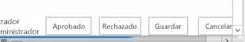
  

  

  
Los tipos de contenido forman parte de las tareas de flujo de trabajo. Los tipos de contenido simplemente rigen la estructura de los elementos de lista de tareas. Igual de importante es la plantilla de lista de tareas, que también se modificó SharePoint 2013.
  
    
    
Antes de SharePoint 2013, la lista de tareas de flujo de trabajo usaba la misma plantilla de lista como lista de tareas estándar (ID = 107). Era una lista de tareas estándar de SharePoint que también podía contener tareas que no eran de flujo de trabajo. Sin embargo, en SharePoint 2013 el enfoque es diferente, ya que introduce un nuevo tipo de lista. Esta lista, denominada la lista de tareas de jerarquía, presenta una vista de escala de tiempo en la parte superior de la página para mostrar la programación de las tareas, como se muestra en la figura 2. Observe que también permite a los usuarios ver las dependencias entre tareas.
  
    
    

**Figura 2. Lista de tareas de jerarquía**

  
    
    

  
    
    

  
    
    

  
    
    

  
    
    

## Creación de opciones de tarea de flujo de trabajo en SharePoint 2013

Tanto SharePoint Designer 2013 como Visual Studio 2012 proporcionan a los autores de flujos de trabajo dos formas de crear tareas de flujo de trabajo. Una consiste en crear una tarea única que se asigna a una persona o un grupo. La otra consiste en crear una tarea y asignarla a varias personas. Al crear una tarea única en un flujo de trabajo personalizado con Visual Studio 2012, use la actividad **SingleTask**. Mediante esta actividad, puede modificar las propiedades, ya sea en la ventana de herramientas **Propiedades** o con el asistente, tal como se muestra en la figura 3.
  
    
    

**Figura 3. Asistente para tarea única**

  
    
    

  
    
    
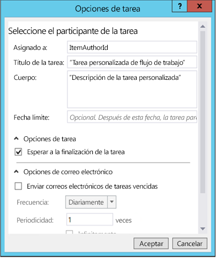
  
    
    
SharePoint permite especificar si se deben ejecutar varias tareas en serie o en paralelo, así como los criterios para la finalización de las tareas. ¿Debe esperar SharePoint a que todas las tareas se complete o a que se complete un porcentaje con un resultado específico? Para crear varias tareas en Visual Studio 2012, use la actividad **CompositeTask**, cuyas propiedades y asistente se parecen a la actividad **SingleTask**, tal como se muestra en la figura 4.
  
    
    

**Figura 4. Asistente para tareas compuestas**

  
    
    

  
    
    
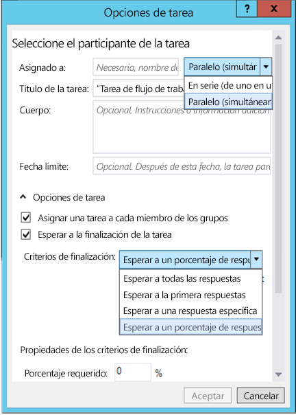
  
    
    

  
    
    

  
    
    

## Crear y asignar tareas en flujos de trabajo personalizados

A continuación presentamos un tutorial que muestra cómo crear y asignar tareas en un flujo de trabajo personalizado. Antes de empezar, asegúrese de que tiene acceso a un sitio para desarrolladores de SharePoint 2013.
  
    
    

### 1. Crear un nuevo proyecto de aplicación de SharePoint 2013


1. Cree un nuevo proyecto de aplicación de SharePoint 2013 y configure el proyecto como un Complementos hospedados en SharePoint.
    
  
2. Agregue una nueva instancia de lista **Announcement** al proyecto. Se usará como contenedor para los elementos usados para probar el flujo de trabajo.
    
  
3. Agregue un elemento de flujo de trabajo al proyecto haciendo clic con el botón derecho en el icono del proyecto en el **Explorador de soluciones** y luego seleccione **Agregar** y **Nuevo elemento**.
    
  
4. En el cuadro de diálogo **Agregar nuevo elemento**, seleccione el elemento de proyecto **Flujo de trabajo** en la categoría **Office/SharePoint**, póngale el nombre "Flujo de trabajo de tareas personalizado" y haga clic en **Siguiente**.
    
  

### 2. Recopilar información en el elemento Nuevo anuncio

Vamos a crear una tarea en el flujo de trabajo y la vamos a asignar a la persona que creó el elemento de lista del anuncio que inicia el flujo de trabajo. El elemento de la lista proporciona la información al flujo de trabajo. Vamos a usar una actividad **LookupSPListItemProperties**, que devuelve un valor dinámico desde el servicio web REST al que llama en SharePoint. Luego vamos a almacenar este valor en una nueva variable llamada **AnnouncementItemProperties**, cuyo tipo de datos se cambiará a **DynamicValue**.
  
    
    

1. Cree una variable **AnnouncementItemAuthorId** para almacenar el identificador de la persona que creó el elemento de lista, como se muestra en la figura 5.
    
   **Figura 5. Actividad LookupSPListItemProperties**

  

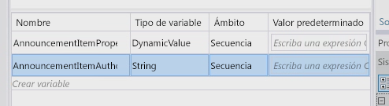
  

  

  
2. Coloque la actividad **LookupSPListItem** en la superficie de diseño del flujo de trabajo y establezca la propiedad **ListID** en _(current list)_.
    
  
3. Establezca **ItemId** en _(current item)_.
    
  
4. Establezca el resultado **Result** en la variable **AnnouncementItemProperties** que creamos antes.
    
  
5. Para obtener el autor del elemento a partir de la variable, haga clic en el vínculo **Obtener propiedades** en la actividad **LookupSPListItem** y agregue una actividad **GetDynamicValueProperties** a la superficie de diseño. Establezca su propiedad **Source** en el resultado de la actividad **LookupSPListItem**.
    
  
6. Haga clic en el botón **[...]** de la propiedad **Properties** para que aparezca el cuadro de diálogo **Propiedades**.
    
  
7. En el cuadro de diálogo **Propiedades**, cambie el **Tipo de entidad** a **Elemento de lista de anuncios**, como se muestra en la figura 6.
    
  
8. Asigne la ruta de acceso **Creado por** a la variable **AnnouncementItemAuthorId**, como se muestra en la figura 6.
    
   **Figura 6. Cuadro de diálogo Propiedades**

  

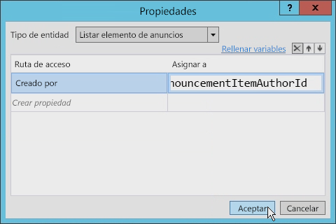
  

  

  

### 3. Crear y asignar la tarea

En este momento podemos crear y asignar la tarea al autor del elemento de anuncio.
  
    
    

1. En el cuadro de herramientas, agregue una actividad **SingleTask** a la superficie de diseño del flujo de trabajo.
    
  
2. Haga clic en el vínculo **Configurar** en la actividad para abrir el cuadro de diálogo **Opciones de tareas**.
    
  
3. Establezca la propiedad **Asignada a** en la variable usada para almacenar el identificador del autor.
    
  
4. Modifique el título y el cuerpo de la tarea, tal como se muestra en la figura 7.
    
   **Figura 7. Cuadro de diálogo Opciones de tareas**

  

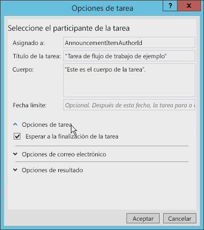
  

  

  
Existen otras opciones que se pueden establecer en el cuadro de diálogo **Opciones de tareas**. Por ejemplo, puede configurar el flujo de trabajo para que espere a que la tarea se complete activando la casilla (véase la figura 7). En las versiones anteriores de los flujos de trabajo de SharePoint era más difícil lograr esto.
  
    
    
En la figura 8, observe las opciones de correo electrónico que se pueden establecer. Entre otras cosas, puede asegurarse de que se envíen mensajes de correo electrónico cada vez que venza la tarea y especificar la frecuencia de envío de los avisos. 
  
    
    

**Figura 8. Configuración de opciones de correo electrónico**

  
    
    

  
    
    
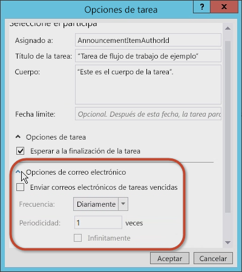
  
    
    
También puede establecer las opciones del resultado de las tareas. Puede seleccionar el tipo de contenido de la tarea de flujo de trabajo, el **Campo Resultado** y el **Resultado predeterminado**, como se muestra en la figura 9.
  
    
    

**Figura 9. Configuración de opciones de resultados**

  
    
    

  
    
    
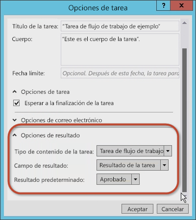
  
    
    

  
    
    

  
    
    

### 4. Examinar y modificar las propiedades de la tarea

Una vez que acepte los valores del cuadro de diálogo **Opciones de tareas**, seleccione la actividad **SingleTask** y luego examine la cuadrícula de propiedades **Propiedades** (consulte la figura 10).
  
    
    

**Figura 10. Ventana de herramientas Propiedades**

  
    
    

  
    
    
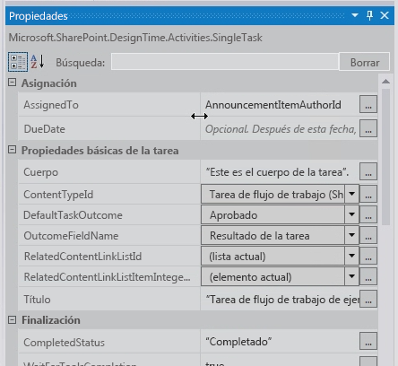
  
    
    
En la cuadrícula de propiedades **Propiedades**, puede especificar si quiere que la tarea espere a que finalice antes de continuar y configurar los mensajes de correo electrónico que genera la tarea, incluidos el mensaje de correo electrónico de la asignación inicial, el mensaje de correo electrónico de vencimiento y el mensaje de correo electrónico de cancelación de la tarea.
  
    
    
Observe que la propiedad **Outcome** creó automáticamente una variable denominada **outcome_0** para la tarea. Para ver el contenido de esta variable, agregue una actividad **WriteToHistory** en la superficie de diseño y la actualice el mensaje para escribir el resultado, como se muestra en la figura 11.
  
    
    

**Figura 11. Valor de la propiedad Resultado**

  
    
    

  
    
    
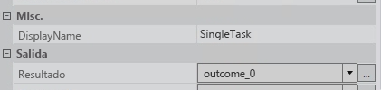
  
    
    

  
    
    

  
    
    

### 5. Probar el flujo de trabajo

Para probar el flujo de trabajo, haga lo siguiente:
  
    
    

1. Presione **F5** para compilar y ejecutar o haga clic en el botón **Iniciar** en Visual Studio 2012. Si va a probar una instalación local de SharePoint 2013, Visual Studio 2012 inicia la utilidad Host del servicio de pruebas de Administrador de flujos de trabajo e implementa el flujo de trabajo en el sitio para desarrolladores. Tras unos momentos, se abre el sitio para desarrolladores.
    
  
2. Vaya a la lista **Anuncios**, cree un elemento de lista y luego inicie el flujo de trabajo personalizado de forma manual.
    
  
3. Vuelva a la página de estado de la instancia de flujo de trabajo para buscar la tarea que se creó con el flujo de trabajo. Haga clic en la tarea para ver el formulario. Observe los campos **Nombre de tarea** y **Asignada a** que se definieron en el flujo de trabajo, tal como se muestra en la figura 12.
    
   **Figura 12. Formulario de tarea**

  

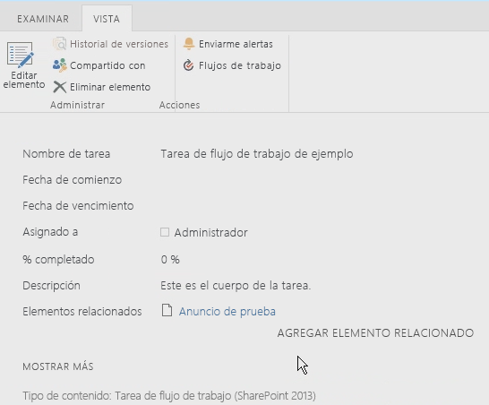
  

  

  
4. Por último, vuelva a la tarea, edite el formulario y luego haga clic en **Aprobar** o **Rechazar** para completar la tarea. Observe que el resultado de la tarea se muestra en la lista **Historial de flujo de trabajo** para la instancia del flujo de trabajo, tal como se muestra en la figura 13.
    
   **Figura 13. Lista Historial de flujo de trabajo**

  

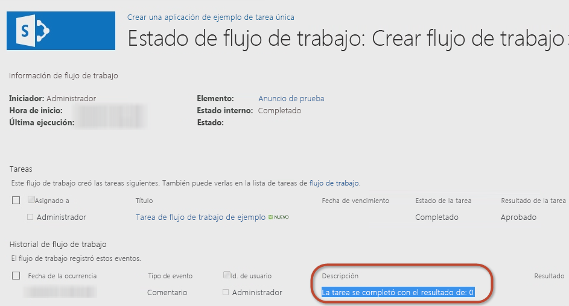
  

  

  

## Crear un tipo de tarea personalizado con un resultado personalizado

El tutorial anterior demuestra cómo crear una tarea sencilla y configurar sus propiedades. Sin embargo, a veces las opciones predeterminadas no satisfacen nuestras necesidades. Por ejemplo, piense en una tarea que le pide a alguien que revise un documento. Al revisar el borrador, el revisor debe elegir una de estas dos opciones: enviar el borrador al autor de la revisión o reenviar el documento al editor. Lamentablemente, ninguna de las opciones predeterminadas ( **Aprobado** y **Rechazado**) satisface las necesidades de los revisores. Otras opciones más apropiadas serían "Devolver al autor" y "Pasar al editor".
  
    
    
Al crear flujos de trabajo con SharePoint Designer 2013 o Visual Studio 2012 puede crear tareas de flujo de trabajo personalizadas que incluyan resultados de tareas personalizadas. Para ello, cree una tarea personalizada como un tipo de contenido especial y luego agregue una columna de sitio personalizada que defina los resultados que quiera. Puede obtener la columna personalizada a partir del tipo de campo denominado **OutcomeChoice**, que es un campo de opción.
  
    
    
Este enfoque puede suponer un reto, no obstante, porque el tipo de contenido del que se deriva la tarea personalizada es el tipo de contenido **Workflow Task (SharePoint 2013)**, que incluye la columna de sitio predeterminada **TaskOutcome** que contiene las opciones **Aprobado** y **Rechazado**. Sin embargo, puede evitar que se aplique la configuración predeterminada quitando la columna **TaskOutcome** del tipo de contenido de la tarea personalizada y asegurándose de que no está presente en la lista de tareas de flujo de trabajo. De lo contrario, podrían mostrarse varias opciones. Por ejemplo, imaginemos un resultado personalizado que tenía dos opciones: "Píldora roja" y "Píldora azul". Si no se quita el resultado predeterminado, los usuarios que completen la tarea verán todas las opciones de resultado disponibles, como se muestra en la figura 14, aunque no tengan relación con la tarea.
  
    
    

**Figura 14. Opciones de resultados**

  
    
    

  
    
    

  
    
    
Como práctica recomendada, conviene crear una lista de tareas de flujo de trabajo diferente para cada tipo de tarea que se cree. 
  
    
    

### Crear un proyecto de aplicación de SharePoint 2013

Para iniciar el tutorial y crear una tarea de flujo de trabajo personalizada con Visual Studio 2012, primero debe asegurarse de que tiene acceso a un sitio para desarrolladores de SharePoint 2013. 
  
    
    

1. En Visual Studio 2012, cree un nuevo proyecto de aplicación de SharePoint 2013 que esté configurado como Complementos hospedados en SharePoint.
    
  
2. Agregue una nueva instancia de lista **Announcement** al proyecto. Se usará como contenedor para los elementos usados para probar el flujo de trabajo.
    
  
3. Luego agregue un elemento de flujo de trabajo al proyecto haciendo clic con el botón derecho en el icono del proyecto en el **Explorador de soluciones** y seleccione **Agregar** y **Nuevo elemento**.
    
  
4. En el cuadro de diálogo **Agregar nuevo elemento**, seleccione el elemento de proyecto **Flujo de trabajo** en la categoría **Office/SharePoint**, póngale el nombre "Flujo de trabajo de tareas personalizadas" y haga clic en **Siguiente**.
    
  

### Crear la columna de resultados personalizada

Una vez que tenemos creada la lista **Announcements**, hay que crear el tipo de contenido personalizado que contendrá la tarea personalizada y la columna de sitio para el campo personalizado de resultados. 
  
    
    

1. Haga clic con el botón derecho en el proyecto y seleccione **Agregar** y **Nuevo elemento**.
    
  
2. Ahora elija la plantilla de elemento de proyecto **Columna de sitio** y establezca el nombre de este campo en "Columna de resultados personalizada". Dentro de la plantilla de la columna de sitio, hay que hacer algunos cambios.
    
  
3. Establezca el tipo de campo de la columna en **OutcomeChoice**, que es el tipo de campo requerido para una columna de resultados.
    
  
4. Quite la columna **Requerido**.
    
  
5. Luego tiene que agregar sus propias elecciones, ya que el tipo de campo **OutcomeChoice** se basa en el tipo de campo de elección.
    
  
El nuevo marcado de la columna de sitio personalizada debe ser similar al siguiente:
  
    
    


```XML

<?xml version="1.0" encoding="utf-8"?>
<Elements xmlns="http://schemas.microsoft.com/sharepoint/">  
  <Field
       ID="{7b7edd9e-f5d1-4558-a2c8-e733dcfb0a5e}"
       Name="CustomSiteColumn"
       DisplayName="Better State"
       Type="Choice"
       Required="FALSE"
       Group="Custom Site Columns">
       <CHOICES>
         <CHOICE>Florida</CHOICE>
         <CHOICE>Georgia</CHOICE>
       </CHOICES>
       <Default>Florida</Default>
  </Field>
</Elements>
```


### Crear un tipo de contenido de tarea personalizada

Después de crear la columna de sitio, el siguiente paso es crear un tipo de contenido especializado para la tarea personalizada.
  
    
    

1. Agregue un nuevo elemento de proyecto de tipo de contenido para el proyecto con el nombre **CustomTaskContentType**.
    
  
2. Cuando se le pida que seleccione en qué tipo de contenido se basa, seleccione el tipo de contenido **Workflow Task (SharePoint 2013)**.
    
  
3. Después agregue la columna de resultados personalizada a la lista de columnas disponibles y quite la columna de resultados predeterminada para que el marcado del tipo de contenido quede como el del ejemplo siguiente.
    
  ```XML
  
<?xml version="1.0" encoding="utf-8"?>
<Elements xmlns="http://schemas.microsoft.com/sharepoint/">
  <!-- Parent ContentType: Workflow Task (SharePoint 2013) (0x0108003365C4474CAE8C42BCE396314E88E51F) -->
  <ContentType 
      ID="0x0108003365C4474CAE8C42BCE396314E88E51F00D368DFB2B31A447BB184BA1334E5119E" 
      Name="CustomContentType" 
      Group="Custom Content Types" 
      Description="My Content Type" 
      Inherits="TRUE" Version="0">
      <FieldRefs>
         <FieldRef 
            ID="{7b7edd9e-f5d1-4558-a2c8-e733dcfb0a5e}" 
            DisplayName="Better State" 
            Required="FALSE" 
            Name="CustomSiteColumn" />
            <RemoveFieldRef 
               ID="{55B29417-1042-47F0-9DFF-CE8156667F96}" 
               Name="TaskOutcome" />
      </FieldRefs>
  </ContentType>
</Elements>
  ```


### Crear un flujo de trabajo

Ahora crearemos un flujo de trabajo para probar la columna de sitio personalizada y el tipo de contenido. 
  
    
    

1. Agregue un flujo de trabajo al proyecto y configúrelo para que sea un flujo de trabajo de lista.
    
  
2. Cree una asociación con este flujo de trabajo usando la lista **Anuncios** que creamos anteriormente.
    
  
3. Cree una nueva variable de tipo **DynamicValue** y póngale el nombre "Propiedades de elemento". Vamos a usar esta variable para almacenar el elemento que inicia las propiedades del flujo de trabajo.
    
  
4. Cree una variable **Int32** y póngale el nombre "Identificador del autor del elemento", tal como se muestra en la figura 15.
    
   **Figura 15. Crear una variable de flujo de trabajo**

  

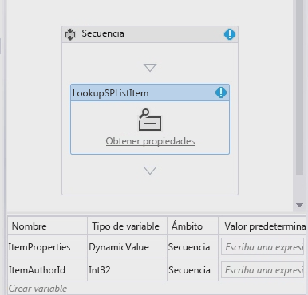
  

  

  

### Recopilar las propiedades de elemento de lista

Ahora se recopilan las propiedades de elemento de lista.
  
    
    

1. Coloque la actividad **LookupSPListItem** en la superficie de diseño y establezca la propiedad **ListID** en _(current list)_ y la propiedad **ItemId** en _(current item)_. 
    
  
2. Ahora establezca el resultado **Result** en la variable **ItemProperties** **DynamicValue** que acabamos de crear.
    
  
3. Para obtener el autor del elemento a partir de la variable, haga clic en el vínculo **Obtener propiedades** en la actividad **LookupSPListItem** y agregue una actividad **GetDynamicValueProperties** a la superficie de diseño.
    
  
4. Establezca la propiedad **Source** del elemento en el resultado de la actividad **LookupSPListItem** automáticamente.
    
  
5. Haga clic en el botón **[...]** de la propiedad **Properties** para mostrar el cuadro de diálogo **Propiedades**.
    
  
6. Cambie el **Entity Type** a **List Item of Announcements** para dar al cuadro de diálogo un contexto y asigne la ruta de acceso de **Created By** a la variable **ItemAuthorId**, como se muestra en la figura 16.
    
   **Figura 16. Cuadro de diálogo Propiedades**

  

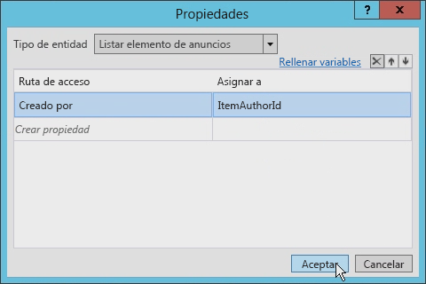
  

  

  

### Crear una tarea única

Ahora podemos crear la tarea única. 
  
    
    

1. Agregue una actividad **SingleTask** a la superficie de diseño.
    
  
2. Haga clic en el vínculo **Configurar** en la actividad para abrir el cuadro de diálogo **Opciones de tareas**.
    
  
3. Establezca el campo **Cuerpo** en cualquier cadena (la que sea) y luego establezca la propiedad **Asignada a** en la variable que está usando para almacenar el identificador de autor (en nuestro caso, **ItemAuthorId**).
    
  
4. Cambie el título de la tarea, tal como se muestra en la figura 17.
    
   **Figura 17. Configuración Título de la tarea**

  

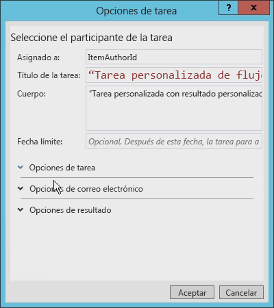
  

  

  
5. Por último, establezca las **Opciones de resultado** para que usen el nuevo tipo de contenido personalizado y la columna de resultados personalizada.
    
    En el cuadro de diálogo se ve lo que está disponible al ver todos los tipos de contenido que se derivan del tipo de contenido **Workflow Task (SharePoint 2013)**, tal como se muestra en la figura 18.
    

   **Figura 18. Configuración de opciones de resultados**

  

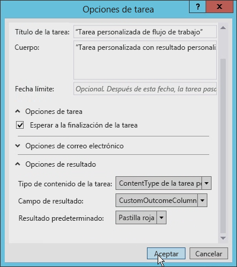
  

  

  

### Actualizar el campo Asignada a

Antes de seguir, es necesario actualizar el campo **Asignada a** en la actividad **SingleTask**, ya que se espera una cadena, no un entero. Para solucionar esto, agregue **ToString()** al final de la expresión.
  
    
    
Además, observe que la propiedad **Outcome** creó automáticamente una variable denominada **outcome_0**. Para ver lo que hay en esta variable, agregue una actividad **WriteToHistory** en la superficie de diseño y actualice el mensaje para escribir el resultado.
  
    
    

### Actualizar la lista de tareas de flujo de trabajo

El último paso es configurar la lista de tareas de flujo de trabajo. De forma predeterminada, la lista de tareas que la aplicación crea solo acepta el tipo de contenido **Workflow Task (SharePoint 2013)**. Este flujo de trabajo usa un tipo de contenido personalizado para el resultado personalizado. Abra el archivo  `Elements.xml` correspondiente a la lista de tareas de flujo de trabajo y cambie el atributo **ContentTypeId** del elemento **<ContentTypeBinding>** para que coincida con el tipo de contenido en el proyecto, como se muestra en el siguiente ejemplo de código.
  
    
    

```XML

<?xml version="1.0" encoding="utf-8" ?>
<Elements xmlns="http://schemas.microsoft.com/sharepoint/">
  <ListInstance 
      FeatureId="{f9ce21f8-f437-4f7e-8bc6-946378c850f0}"
      TemplateType="171"
      Title="WorkflowTaskList"
      Description="This list instance is used for workflow Task items."
      Url="Lists/WorkflowTaskList"
      RootWebOnly="FALSE" />
  <!-- CustomContentType -->
  <ContentTypeBinding 
      ListUrl="Lists/WorkflowTaskList"
      RootWebOnly="FALSE"
      ContentTypeId="0x0108003365C4474CAE8C42BCE396314E88E51F00D368DFB2B31A447BB184BA1334E5119E"/>
</Elements>
```


### Probar la tarea de contenido personalizada con un resultado de tarea personalizada

Ahora vamos a probar el flujo de trabajo. 
  
    
    

1. En Visual Studio 2012, presione **F5** o haga clic en el botón **Iniciar**. Si las pruebas se realizan en una instalación local de SharePoint 2013, Visual Studio 2012 iniciará la utilidad Host del servicio de pruebas de Administrador de flujos de trabajo e implementará el flujo de trabajo en el sitio para desarrolladores. Tras unos momentos, se abrirá el sitio para desarrolladores.
    
  
2. Vaya a la lista **Anuncios** y cree un elemento nuevo. Después de crear el elemento, inicie el flujo de trabajo personalizado manualmente.
    
  
3. Luego vuelva a la página de estado de la instancia de flujo de trabajo para buscar la tarea que se creó con el flujo de trabajo.
    
  
4. Haga clic en la tarea y, con el botón **Editar** de la cinta de opciones, cambie al modo de edición. Debe haber cuatro botones en la parte inferior del formulario. Los dos primeros botones son los del resultado personalizado, que, cuando se presionan, marcan la tarea como completada. Los dos segundos botones son los predeterminados para **Guardar** y **Cancelar** que solo actualizan el elemento de lista sin completar la tarea, tal como se muestra en la figura 19.
    
   **Figura 19. Botones de resultados personalizados**

  

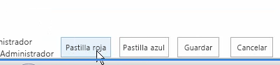
  

  

  

## Conclusión

Microsoft introdujo los flujos de trabajo en la plataforma SharePoint 2007 y prácticamente no cambian en SharePoint 2010 en cuanto a arquitectura, implementación y proceso. Lo mismo sucedió con las tareas en los flujos de trabajo de SharePoint. Sin embargo, SharePoint 2013 presenta muchos cambios en los flujos de trabajo en cuanto a arquitectura e implementación.
  
    
    
En este artículo se describen los cambios relacionados con las tareas de flujo de trabajo surgidos a partir de los cambios hechos en la historia del flujo de trabajo en SharePoint 2013. Hemos explicado cómo crear un flujo de trabajo simple que aproveche las tareas de SharePoint 2013 con Visual Studio 2012. Estos tipos de tareas son adecuados para muchos desarrolladores, aunque a veces se necesitan tareas y resultados personalizados. Estos se pueden generar usando Visual Studio 2012 tal como hemos mostrado.
  
    
    

## Recursos adicionales
<a name="bk_addresources"> </a>


-  [Flujos de trabajo en SharePoint 2013](http://msdn.microsoft.com/es-es/library/jj163986.aspx)
    
  
-  [Autorización y autenticación de aplicaciones en SharePoint 2013](http://msdn.microsoft.com/es-es/library/office/fp142384.aspx)
    
  
-  [Personalizar una vista de lista en aplicaciones para SharePoint mediante representación del lado cliente](http://msdn.microsoft.com/es-es/library/jj220045.aspx)
    
  

