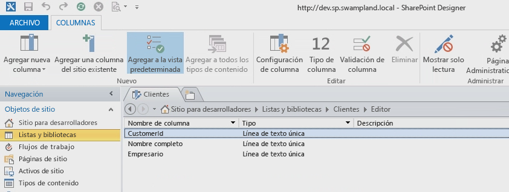
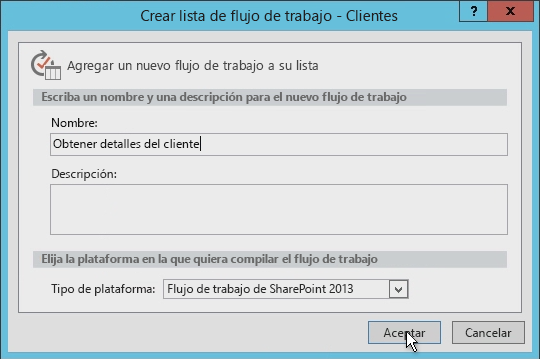
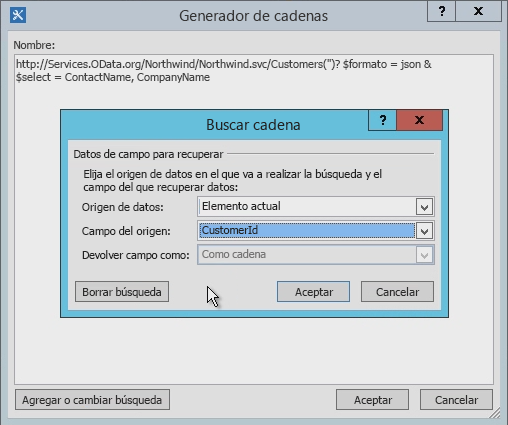
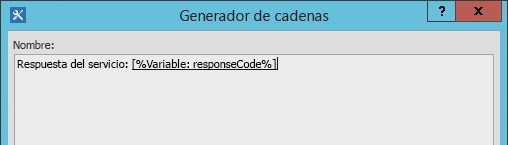
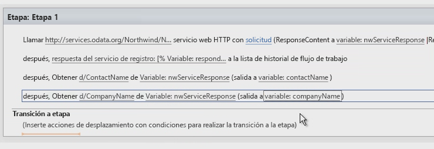
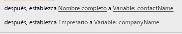
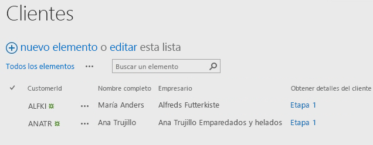

# Trabajar con servicios web en flujos de trabajo de SharePoint 2013 con SharePoint Designer 2013
Se muestra cómo usar servicios web en los flujos de trabajo de SharePoint Designer 2013. 
 **Ofrecido por:** [Andrew Connell](http://social.msdn.microsoft.com/profile/andrew%20connell%20%5bmvp%5d/),  [www.AndrewConnell.com](http://www.andrewconnell.com)
  
    
    

Microsoft ha adoptado un nuevo enfoque para flujos de trabajo en SharePoint Server 2013. El equipo de flujo de trabajo ha colaborado con el equipo de Microsoft Azure para crear un nuevo producto llamado Administrador de flujos de trabajo. Administrador de flujos de trabajo actúa como host para la versión más reciente del tiempo de ejecución de Windows Workflow Foundation, y proporciona todos los servicios necesarios además de aprovechar el bus de servicio de Microsoft Azure para mejorar el rendimiento y la escalabilidad. Una vez implementado, se ejecuta igual tanto en una implementación local como en una implementación en la nube. Otro detalle importante es que SharePoint 2013 entrega toda la ejecución de flujos de trabajo y tareas relacionadas a la granja de servidores de Administrador de flujos de trabajo, que está fuera de SharePoint 2013.
Uno de los cambios más significativos en la arquitectura de flujo de trabajo es que ahora todos los flujos de trabajo se crean de forma declarativa, en una superficie del diseñador, incluidas las creadas mediante Visual Studio 2012. En versiones anteriores de SharePoint, los flujos de trabajo desarrollados con Visual Studio 2012 no eran exclusivamente declarativos. En su lugar, había una mezcla de XAML declarativo y un ensamblado compilado que contenía la lógica de negocios de los flujos de trabajo.
  
    
    

Para aquellos clientes que hayan creado flujos de trabajo con SharePoint Designer en el pasado, esto no es nada nuevo. Los flujos de trabajo creados con SharePoint Designer siempre han sido totalmente declarativos. Sin embargo, este cambio beneficia a los clientes que crean flujos de trabajo con SharePoint Designer 2013, ya que ahora los flujos de trabajo de SharePoint Designer 2013 admiten llamar a servicios web y consumirlos.
## ¿Por qué son importantes los servicios web para los flujos de trabajo de SharePoint 2013?

Empecemos por la descripción de escenarios en los que tiene sentido usar servicios web. En los días de SharePoint 2007 o SharePoint 2010, escribir código personalizado era normal al usar Visual Studio para crear flujos de trabajo, ya que era la mejor manera de realizar cálculos o implementar la lógica de negocios personalizada. Cada vez que se producía una situación en la que las actividades y las acciones de fábrica no satisfacían sus necesidades, podía recurrir al código personalizado en un ensamblado administrado.
  
    
    
Por otra parte, para los usuarios que no eran desarrolladores de SharePoint Designer 2013, esto no resultaba tan sencillo. Cuando un usuario se encontraba con casos de uso que no se podían controlar con acciones de flujo de trabajo existentes, tenía que llamar a un desarrollador para escribir una acción personalizada. A menudo, esto era difícil porque este solo podía crear código para el espacio aislado (en un entorno hospedado), o solo podía usar soluciones de plena confianza en el caso de una implementación local. En otros casos, debía confiar todo el flujo de trabajo a un desarrollador para que lo creara como una solución de plena confianza porque lo que se necesitaba no se podía obtener en SharePoint Designer.
  
    
    
Ahora vienen las buenas noticas: en el mundo de SharePoint 2013, cuando SharePoint Designer 2013 carece de una acción que el usuario necesita, todo lo que necesita es crear un servicio web personalizado. Y la creación de un servicio web personalizado es mucho más fácil que crear una acción personalizada. No solo eso, sino que mientras que una acción personalizada solo puede ser usada por el flujo de trabajo en la que está instalada (o, como mucho, solo por un flujo de trabajo de SharePoint), un servicio web personalizado es portátil y lo puede utilizar cualquier número de consumidores.
  
    
    
Quizás lo mejor de todo, en los casos en los que hay un servicio web existente al que necesita tener acceso, ya sea un servicio web público o quizás uno privado hospedado por su empresa, SharePoint Designer 2013 ahora proporciona una acción que se puede usar para llamar al servicio web. Ya no tiene que recurrir a un desarrollador cuando necesite llamar a un servicio web existente.
  
    
    
Si bien SharePoint 2013 puede consumir cualquier tipo de servicio web, es más fácil (y recomendado) usar servicios web que aceptan y devuelven datos mediante los formatos  [OData](http://www.odata.org/) estándar de [Atom](http://msdn.microsoft.com/es-es/library/ff478141.aspx) o [JSON](http://json.org/) (notación de objetos JavaScript).
  
    
    
Esta recomendación se basa en la compatibilidad de las herramientas de creación de flujo de trabajo de SharePoint 2013 (tanto SharePoint Designer 2013 como Visual Studio 2012) con estos formatos de OData. Ambas herramientas son compatibles con la creación de cargas para enviar al servicio y para administrar las respuestas devueltas por los servicios web. Además, los formatos de OData admiten la comunicación con los servicios web anónimos y con los protegidos por los distintos tipos de autenticación. En resumen, el usuario tiene control total sobre la solicitud y la respuesta de cada llamada de servicio. Esto le permite usar una serie de actividades dentro de un flujo de trabajo para, primero, autenticarse con un servicio y obtener un token de OAuth y, a continuación, incluir ese token en las futuras solicitudes a servicios protegidos mediante el protocolo  [OAuth 2.0 ](http://oauth.net/2/).
  
    
    

## Aprovechamiento de los servicios web en flujos de trabajo de SharePoint

La invocación de servicios web de flujos de trabajo con SharePoint 2013 tiene lugar en dos fases: primero se llama al servicio web y, a continuación, se intercambian datos con el servicio web.
  
    
    
En los flujos de trabajo de SharePoint 2013, se llama a un servicio web mediante una nueva acción que se incluyó en SharePoint 2013 llamada **Call HTTP Web Service**. Esta acción es flexible y le permite hacer fácilmente llamadas sencillas a un servicio web, o bien, si es necesario, puede crear llamadas más complejas con verbos HTTP, además de permitir agregar encabezados HTTP. La figura 1 muestra la acción **Call HTTP Web Service** en la superficie de SharePoint Designer 2013.
  
    
    

**Figura 1. Fase de SharePoint Designer 2013 que muestra la acción Llamar al servicio web HTTP**

  
    
    

  
    
    

  
    
    
La acción **Call HTTP Web Service** le permite especificar cualquiera de los distintos métodos de solicitud, incluidos **GET**, **PUT**, **POST** y **DELETE**. Esto le permite indicar a los servicios web, específicamente a los servicios  [RESTful](http://msdn.microsoft.com/es-es/library/office/jj164022.aspx), qué hacer en el servicio especificado con la propiedad URI en la actividad.
  
    
    
Por ejemplo, para obtener todas las propiedades de un elemento específico, la dirección URL del servicio puede incluir la dirección única del elemento, y podría establecer el método en **GET**. Para eliminar el elemento, el proceso es el mismo, excepto que debe establecer el método en **DELETE**. Lo mismo sucede para actualizar un elemento, excepto que se establece el método en **POST**. Cuando crea un elemento, debe establecer la dirección URL en la dirección única de la colección donde se creará el elemento y, a continuación, establecer el método en **POST**. Al crear o actualizar elementos, los servicios generalmente requieren los datos que van a usar, que se pasan como contenido en la solicitud y, a continuación, se indican con la propiedad **request** en la acción **Call HTTP Web Service**.
  
    
    
La segunda fase de trabajar con servicios web implica enviar y recibir datos de un servicio web, lo cual se lleva a cabo mediante las propiedades **request** o **response** de la acción **Call HTTP Web Service**. Sin embargo, tenga en cuenta que los datos, en lugar de como una secuencia, se pasan como una estructura compleja mediante el objeto  [DynamicValue](http://msdn.microsoft.com/es-es/library/windowsazure/microsoft.activities.dynamicvalue%28v=azure.10%29.aspx). (Para obtener más información acerca de los valores dinámicos, consulte  [Entender DynamicValue](http://msdn.microsoft.com/es-es/library/windowsazure/jj193505%28v=azure.10%29.aspx)).
  
    
    
Las estructuras de datos de valor dinámico tienen el formato de cadenas Notación de objetos de JavaScript (JSON). Sin embargo, en lugar de hacer que un desarrollador cree y manipule cadenas manualmente en el flujo de trabajo, Microsoft ha proporcionado el tipo de objeto **DynamicValue** que puede utilizarse para almacenar tanto datos jerárquicos como la respuesta a una llamada de servicio web.
  
    
    
Hay una serie de actividades asociadas con el tipo **DynamicValue** que se puede utilizar para contar el número de elementos en la respuesta, extraer valores de la respuesta o crear una nueva estructura para actualizar o crear elementos. Tenga en cuenta que SharePoint Designer 2013 no admite trabajar directamente con el tipo **DynamicValue** y, en su lugar, los autores de los flujos de trabajo usarán el tipo **Dictionary**.
  
    
    

## Creación de servicios web para flujos de trabajo de SharePoint 2013

Hemos aprendido que SharePoint Designer 2013 admite llamadas a servicios web, pero  *no*  admite invocar código personalizado desde los flujos de trabajo. Por lo tanto, tendrá que saber cómo crear un servicio web si desea ampliar la funcionalidad de los flujos de trabajo más allá de las acciones predeterminadas.
  
    
    
Afortunadamente, hay muchas opciones para crear servicios web personalizados para utilizarlos en flujos de trabajo de SharePoint 2013. En concreto, la actividad **HttpSend**, junto con el tipo de dato **DynamicValue**, son ideales para la creación de servicios web RESTful que cumplen el protocolo OData.
  
    
    
 OData es un protocolo para crear y consumir datos basándose en los principios de servicios REST. Se desarrolló para estandarizar el intercambio de datos mediante protocolos HTTP avanzados, confiables y eficaz. Una vez completada la especificación de OData, diferentes organizaciones implementaron el protocolo en sus propias pilas de tecnología. Microsoft implementó su propia versión de OData, a la que llamó [WCF Data Services ](http://msdn.microsoft.com/es-es/library/hh487257%28v=vs.103%29.aspx).
  
    
    
A continuación se describen dos escenarios comunes en los que los servicios web RESTful son útiles para los desarrolladores de flujo de trabajo:
  
    
    

- Implementación de las operaciones CRUD-Q del servicio OData
    
  
- Implementación de las operaciones del servicio OData
    
  

### Implementación de las operaciones CRUD-Q del servicio OData

Un uso habitual para los servicios web es realizar sencillas operaciones de crear, leer, actualizar, eliminar y consultar (CRUD-Q) en los datos de una base de datos. Es relativamente fácil crear un servicio web OData para un servicio de datos de WCF de flujo de trabajo de SharePoint 2013 para que lo utilice un flujo de trabajo mediante los servicios de datos de WCF. Puede consultar los tutoriales y ejemplos sobre la creación de servicios web en sitios como  [WCF Data Services ](http://msdn.microsoft.com/es-es/library/cc668792.aspx),  [www.OData.org ](http://www.odata.org/) y otros.
  
    
    
Suponiendo que ya tiene la base de datos con la que trabajar, hay cuatro pequeños pasos que seguir:
  
    
    

1. Cree un modelo de la base de datos mediante  [Entity Framework](http://msdn.microsoft.com/es-es/data/aa937723). No se requiere ningún código ya que se trata de una creación basada en asistente en Visual Studio. Para obtener más información, consulte  [Entity Framework 4.0 y WCF Data Services 4.0 en Visual Studio 2010](http://msdn.microsoft.com/es-es/magazine/ee336128.aspx) y [Entity Framework Designer recibe atención en Visual Studio 2012](http://msdn.microsoft.com/es-es/magazine/jj721589.aspx).
    
  
2. Cree un nuevo servicio de datos de WCF. De nuevo, no se requiere ningún código en este asistente de Visual Studio. Para obtener más información, vea el tutorial:  [Crear y obtener acceso a un servicio de datos de WCF en Visual Studio](http://msdn.microsoft.com/es-es/library/vstudio/cc668184.aspx).
    
  
3. En el archivo de código del servicio, establezca el nombre del modelo de entidad que creó en el paso uno como el origen del servicio; a continuación, establezca la accesibilidad y los permisos para las entidades en el modelo (ambos pasos se implementan en tan solo dos líneas de código).
    
  
4. Publique el servicio en una ubicación en la que tenga acceso Administrador de flujos de trabajo.
    
  

### Implementación de las operaciones del servicio OData

Es bastante probable que desee que el flujo de trabajo quiera ejecutar alguna lógica de negocios que no se ajuste al limitado modelo CRUD-Q. Por ejemplo, puede haber un servicio de OData que admita operaciones de CRUD Q cuando crea un nuevo préstamo bancario. Este servicio también podría pedir a los consumidores que llamaran al servicio y proporcionaran una puntuación de crédito para que, a continuación, pueda recuperar la tasa de interés actual. Esta tarea supera la capacidad de las sencillas operaciones de CRUD-Q, ya que llama a un método, pasa un entero y recibe una respuesta.
  
    
    
Sin embargo, puede admitir este escenario con OData y los servicios de datos de WCF, a través del cual se pueden implementar  [Operaciones de servicio](http://msdn.microsoft.com/es-es/library/cc668788.aspx). Las operaciones de servicio son comunes e incluso se usan en los servicios de SharePoint 2013. Por ejemplo, cuando SharePoint recupera una lista específica con el formato de dirección  `http://[..]/_api/web/lists/GetByTitle('ListTitle')`, la función **GetByTitle()** en la dirección es en realidad un operador de servicio creado por el equipo de SharePoint 2013. Normalmente, los desarrolladores crean sus operaciones de servicio personalizadas en los servicios web que crean mediante los servicios de datos de WCF.
  
    
    

## Creación de un flujo de trabajo con SharePoint Designer 2013

El siguiente tutorial muestra cómo crear un flujo de trabajo personalizado que llama al servicio web de OData de la base de datos Northwind, que puede encontrar hospedada públicamente en el sitio  [www.odata.org](http://www.odata.org). En este ejemplo, el usuario escribe un identificador de cliente y, a continuación, inicia el flujo de trabajo, que toma el identificador de cliente y lo utiliza para consultar el servicio web con el fin de recopilar información adicional acerca del cliente, en concreto, el nombre completo y la empresa del usuario. Después, el flujo de trabajo toma esta información y actualiza el elemento de lista agregando el nombre de cliente y la empresa del usuario.
  
    
    

### Creación de una lista de clientes

1. En SharePoint Designer 2013, cree una lista personalizada y asígnele el nombre "Clientes".
    
  
2. Cambie el nombre del campo **Título** a **Id. de cliente**.
    
  
3. Agregue dos nuevos campos de tipo **String** y asígneles los nombres **Nombre completo** y **Empresa**, tal como se muestra en la figura 2.
    
   **Figura 2. Creación de la lista Clientes en SharePoint Designer 2013**

  

  

  

  

### Creación del flujo de trabajo

1. En el panel de navegación de SharePoint Designer 2013, seleccione la opción **Flujos de trabajo**.
    
  
2. En la cinta de opciones, haga clic en el botón **Flujo de trabajo de lista** y seleccione **Clientes** en la lista desplegable resultante.
    
  
3. Asigne al flujo de trabajo el nombre "Obtener detalles de los clientes".
    
  
4. Establezca el **Tipo de plataforma** en **Flujo de trabajo de SharePoint 2013**, tal como se muestra en la figura 3.
    
   **Figura 3. Creación de un nuevo flujo de trabajo de lista con SharePoint Designer 2013**

  

  

  

  

### Consulta al servicio web para los detalles del cliente

Ahora que hemos creado el flujo de trabajo, queremos habilitarlo para que llame a un servicio web, lo que hacemos agregando una acción **Llamar al servicio web HTTP** a la fase predeterminada del flujo de trabajo.
  
    
    

1. Haga clic en el vínculo con la etiqueta **este**.
    
  
2. A la derecha del cuadro de texto **Introducir la dirección URL del servicio web HTTP**, haga clic en el botón generador ( **...**) para abrir el cuadro de diálogo **Generador de cadenas**.
    
  
3. En el **Generador de cadenas**, escriba esta dirección URL:  `http://services.odata.org/Northwind/Northwind.svc/Customers('CUSTOMERID')?$format=json&amp;$select=ContactName,CompanyName`. Observe que la parte "  `$select`" de la dirección URL solo recupera los campos que son relevantes para esta lista. 
    
  
4. En la dirección URL, busque el segmento  `CUSTOMERID` de la dirección URL y quítelo. Deje los paréntesis y las comillas simples en su sitio.
    
  
5. Para, a continuación, crear dinámicamente la dirección URL completa, haga clic en el botón **Agregar o cambiar búsqueda** en el **Generador de cadenas**.
    
  
6. En el cuadro de diálogo **Buscar cadena**, establezca el **Origen de datos** en **Elemento actual** y establezca el **Campo del origen** en **IdentificadorDelCliente**, tal como se muestra en la figura 4.
    
   **Figura 4. Creación dinámica de la dirección URL para la solicitud de servicio web**

  

  

  

  
7. Haga clic en **Aceptar** y luego de nuevo en **Aceptar** para aceptar la nueva dirección URL.
    
    Ahora que hemos terminado la configuración que nos permite recibir resultados del servicio web, lo siguiente que necesitamos es almacenar los resultados en otra variable.
    
  
8. En la acción **Llamar al servicio web HTTP**, haga clic en el vínculo de **respuesta** en la acción y cree una nueva variable de tipo **Dictionary** y asígnele el nombre **nwServiceResponse**.
    
    Toda la acción **Llamar al servicio web HTTP** es probable que no sea visible, debido a que es una frase larga en el diseñador. Desplácese a la derecha y observe que el código de estado de respuesta se almacena en una variable denominada **responseCode**. Esto es práctico y también es algo que se puede escribir en la página de estadísticas de la instancia de flujo de trabajo mediante la lista del historial del flujo de trabajo.
    
  
9. Agregue una acción **Registrar en lista de historial** después de la acción **Llamar al servicio web HTTP** y establezca su **mensaje** para escribir el código de estado de la respuesta en el registro, tal como se muestra en la figura 5.
    
   **Figura 5. Escritura del código de respuesta del servicio web en la lista del historial**

  

  

  

  

### Extracción de valores de respuesta

Ahora que tenemos la respuesta del servicio web almacenada en la variable **nwServiceResponse**, el siguiente paso es extraer estos valores y colocarlos en variables locales.
  
    
    
Para ello, vamos a agregar dos acciones **Obtener el elemento del diccionario** al flujo de trabajo. Tenga en cuenta que la ruta de acceso al elemento desde la que vamos a extraer un valor debe coincidir con la estructura de la respuesta y estar en un formato específico. Una buena forma de averiguarlo consiste en especificar la dirección URL en el explorador para ver la respuesta que se obtiene. Observe que los resultados están anidados dentro del objeto llamado **d**. Por lo tanto, la ruta de acceso al campo **CompanyName** en la respuesta del servicio web es `d/CompanyName`.
  
    
    

1. Agregue dos acciones **Obtener el elemento del diccionario** al flujo de trabajo.
    
  
2. En la primera de estas nuevas acciones, establezca **Elemento por nombre o ruta de acceso** en `d/ComopanyName`.
    
  
3. Establezca el vínculo **Diccionario** en **nwServiceResponse**.
    
  
4. Establezca el vínculo **Elemento** en una nueva variable **String** llamada **CompanyName**.
    
  
5. Repita los pasos 2, 3 y 4 en la segunda acción **Obtener el elemento del diccionario**, excepto que aquí debe usar **ContactName** en lugar de "CompanyName", tal como se muestra en la figura 6.
    
   **Figura 6. Extracción de valores del servicio web Dictionary Response**

  

  

  

  

### Actualización del elemento de lista

El paso final es actualizar el elemento de lista mediante dos de las acciones **Establecer campo en elemento actual**. Estas acciones establecen los campos en el elemento de lista con los valores almacenados en las variables que creamos, tal como se muestra en la figura 7.
  
    
    

**Figura 7. Actualización del elemento de lista**

  
    
    

  
    
    

  
    
    
Y, por último, completamos la sección **Transición a fase** de la fase de flujo de trabajo.
  
    
    

1. Agregue una acción **Ir a fase**.
    
  
2. Seleccione **Final del flujo de trabajo**.
    
  
3. Guarde y publique el flujo de trabajo.
    
  

### Prueba del flujo de trabajo

1. Abra un explorador y navegue hasta la lista **Clientes**.
    
  
2. Agregue los dos identificadores de cliente que están en el servicio de Northwind en dos nuevos elementos de lista, **ALFKI** y **ANATR**.
    
  
3. Inicie manualmente los flujos de trabajo; para ello, seleccione cada elemento y, a continuación, haga clic en el botón **Flujos de trabajo** en la cinta de opciones.
    
  
4. Seleccione el flujo de trabajo **Obtener detalles de los clientes**.
    
    En este punto, el flujo de trabajo se iniciará y consulta el servicio web.
    
  
5. Navegue de vuelta a la lista **Clientes** y actualice la página. Podría tardar unas cuantas actualizaciones hasta que se completen los flujos de trabajo, pero finalmente debería tener un aspecto similar al de la imagen de la figura 8. Debería ver ambos elementos de lista actualizados con el nombre completo del cliente y el de su empresa, que se recibió desde el servicio web de Northwind.
    
   **Figura 8. Elementos de lista actualizados por el flujo de trabajo personalizado**

  

  

  

  

## Conclusión

SharePoint 2013 introdujo una nueva arquitectura de flujo de trabajo facilitada por un nuevo producto, Administrador de flujos de trabajo 1.0. Para asegurarse de que todos los flujos de trabajo personalizados funcionaran independientemente de la opción de implementación de SharePoint 2013, ya sea local u hospedada en Office 365, todos los flujos de trabajo son ahora declarativos al 100 por ciento. La compatibilidad agregada para llamar a servicios web desde flujos de trabajo creados con SharePoint Designer 2013 proporciona un proceso de creación de flujos de trabajo más flexible y eficaz que en versiones anteriores.
  
    
    
 Microsoft introdujo compatibilidad para llamar a servicios web en Administrador de flujos de trabajo con la nueva acción **Call HTTP Web Service** en SharePoint Designer 2013. Administrador de flujos de trabajo también introdujo compatibilidad para crear estructuras que enviar a los servicios web, así como para consumir sus respuestas con el tipo de variable **Dictionary**. Al crear flujos de trabajo, use el tipo **Dictionary** y las acciones asociadas en flujos de trabajo de SharePoint que usan servicios web externos.
  
    
    

## Recursos adicionales

-  [Flujos de trabajo de SharePoint 2013](workflows-in-sharepoint-2013.md)
    
  
-  [OData](http://www.odata.org/)
    
  
-  [Introducción a JSON](http://json.org/)
    
  
-  [Introducción al servicio SharePoint 2013 REST](http://msdn.microsoft.com/es-es/library/office/fp142380.aspx)
    
  
-  [Entity Framework 4.0 y WCF Data Services 4.0 en Visual Studio 2010](http://msdn.microsoft.com/es-es/magazine/ee336128.aspx)
    
  

  
    
    

